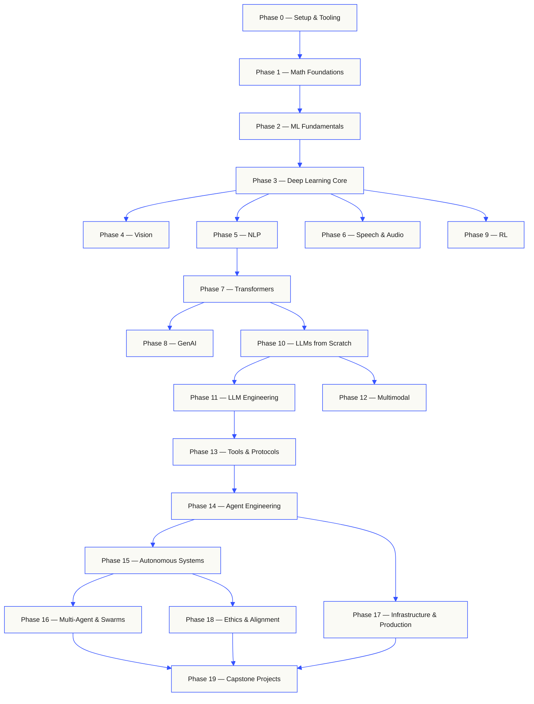
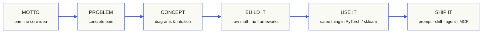

<p align="center">
  
</p>

<p align="center">
  <a href="LICENSE"></a>
  <a href="ROADMAP.md"></a>
  <a href="#contents"></a>
  <a href="https://github.com/stabuev/ai-engineering-from-scratch/stargazers"></a>
  <a href="https://datascience.xyz/courses/aicourse/"></a>
</p>

```
░░░▒▒▒░░░▒▒▒░░░▒▒▒░░░▒▒▒░░░▒▒▒░░░▒▒▒░░░▒▒▒░░░▒▒▒░░░▒▒▒░░░▒▒▒░░░▒▒▒░░░▒▒▒░░░▒▒▒░░░▒▒▒░░░▒▒▒
```

> **84% студентов уже используют AI-инструменты. Только 18% чувствуют себя готовыми
> применять их профессионально.** Этот курс закрывает этот разрыв.
>
> 502 урока. 20 фаз. ~486 часов уроков + ~627 часов capstone-проектов. Основной язык — Python, отдельные уроки добавляют TypeScript, Rust и Julia. Каждый урок поставляет
> переиспользуемый артефакт: промпт, навык, агента, MCP-сервер. Бесплатно, с открытым исходным кодом, MIT.
>
> Вы не просто изучаете AI. Вы его строите. От начала до конца. Вручную.

## Как это работает

Большинство материалов по AI обучают разрозненными фрагментами. Здесь статья, там пост про
fine-tuning, где-то еще эффектная демонстрация агента. Эти фрагменты редко складываются в
цельную картину. Вы выпускаете чат-бота, но не можете объяснить его кривую потерь. Вы
подключаете функцию к агенту, но не можете сказать, что делает attention внутри модели,
которая ее вызывает.

Этот курс - каркас. 20 фаз, 502 урока. Основной язык — Python; отдельные уроки добавляют TypeScript, Rust и Julia.
На одном конце линейная алгебра, на другом - автономные swarms. Каждый алгоритм сначала
строится из чистой математики. Backprop. Tokenizer. Attention. Agent loop. К моменту,
когда появляется PyTorch, вы уже знаете, что он делает под капотом.

Каждый урок проходит по одному и тому же циклу: прочитать задачу, вывести математику,
написать код, запустить тест, сохранить артефакт. Никаких пятиминутных видео, никаких
copy-paste-деплоев, никакого ведения за руку. Бесплатно, с открытым исходным кодом и рассчитано на запуск
на вашем собственном ноутбуке.

```
░░░▒▒▒░░░▒▒▒░░░▒▒▒░░░▒▒▒░░░▒▒▒░░░▒▒▒░░░▒▒▒░░░▒▒▒░░░▒▒▒░░░▒▒▒░░░▒▒▒░░░▒▒▒░░░▒▒▒░░░▒▒▒░░░▒▒▒
```

## Структура курса

Двадцать фаз надстраиваются друг над другом. Математика - фундамент. Агенты и production -
крыша. Переходите вперед, если уже знаете нижние слои, но не пропускайте их, а потом не
удивляйтесь, почему что-то наверху ломается.



```
░░░▒▒▒░░░▒▒▒░░░▒▒▒░░░▒▒▒░░░▒▒▒░░░▒▒▒░░░▒▒▒░░░▒▒▒░░░▒▒▒░░░▒▒▒░░░▒▒▒░░░▒▒▒░░░▒▒▒░░░▒▒▒░░░▒▒▒
```

## Структура урока

Каждый урок находится в собственной папке, с одной и той же структурой по всему курсу:

```
phases/<NN>-<phase-name>/<NN>-<lesson-name>/
├── code/      runnable implementations (Python; местами TypeScript, Rust, Julia)
├── docs/
│   └── en.md  lesson narrative
└── outputs/   prompts, skills, agents, or MCP servers this lesson produces
```

Каждый урок следует шести шагам. Разделение *Build It / Use It* - это каркас: сначала вы
реализуете алгоритм с нуля, затем запускаете то же самое через production-библиотеку. Вы
понимаете, что делает фреймворк, потому что сами написали его меньшую версию.



## С чего начать

Три способа войти в курс. Выберите один.

**Вариант A — читать.** Откройте любой завершенный урок на
[datascience.xyz/courses/aicourse](https://datascience.xyz/courses/aicourse/) или раскройте фазу в
[содержании](#contents). Без настройки, без клонирования.

**Вариант B — клонировать и запустить.**

```bash
git clone https://github.com/stabuev/ai-engineering-from-scratch.git
cd ai-engineering-from-scratch
pip install -r requirements.lock   # точный воспроизводимый набор (или requirements.txt — свежие версии)
python phases/01-math-foundations/01-linear-algebra-intuition/code/vectors.py
```

**Вариант C — найти свой уровень *(рекомендуется)*.** Переходите вперед осознанно. Внутри Claude, Cursor, Codex, OpenClaw, Hermes или любого агента с установленным SkillKit:

```bash
/find-your-level
```

Десять вопросов. Сопоставляет ваши знания со стартовой фазой и строит персональный маршрут
с оценкой часов. После каждой фазы:

```bash
/check-understanding 3        # quiz yourself on phase 3
ls phases/03-deep-learning-core/05-loss-functions/outputs/
# ├── prompt-loss-function-selector.md
# └── prompt-loss-debugger.md
```

### Предварительные требования

- Вы умеете писать код (на любом языке; Python помогает).
- Вы хотите понять, как AI **работает на самом деле**, а не просто вызывать API.

**Железо и ключи.** Почти каждый урок запускается на вашем ноутбуке — CPU, без GPU и без оплаченного API-ключа (код пишется с нуля и работает офлайн). Те немногие уроки, которым нужен платный API, помечены строкой `**Requires:**` в шапке — вы увидите её до того, как начнёте.

### Встроенные навыки агентов (SkillKit / Claude, Cursor, Codex, OpenClaw, Hermes)

| Навык | Что делает |
|---|---|
| [`/find-your-level`](.claude/skills/find-your-level/SKILL.md) | Входной квиз из десяти вопросов. Сопоставляет ваши знания со стартовой фазой и создает персональный маршрут с оценкой часов. |
| [`/check-understanding <phase>`](.claude/skills/check-understanding/SKILL.md) | Квиз по фазе: восемь вопросов, обратная связь и конкретные уроки для повторения. |

### Когда застрял

Эти навыки удобны, но не обязательны — курс полностью проходится и без AI-агента. Если что-то не сходится:

1. **Запустите код урока и сверьте вывод.** Каждый `code/main.py` печатает результат и запускается сам по себе (`python phases/.../code/main.py`). Если вывод не такой, как в уроке, — вы нашли, где сломалось.
2. **Прочитайте оба языка.** У каждого урока есть `docs/en.md` и `docs/ru.md` — другая формулировка часто проясняет затык.
3. **Проверьте окружение.** Несовпадение версий — частая причина. Поставьте точный проверенный набор: `pip install -r requirements.lock` (см. также [`requirements.txt`](requirements.txt) и фазу 0).
4. **Спросите.** Вопрос по уроку — в [Discussions](https://github.com/stabuev/ai-engineering-from-scratch/discussions); ошибка в материале (битый код, неверная формула, обещанный артефакт не там) — [заведите issue](https://github.com/stabuev/ai-engineering-from-scratch/issues/new?template=bug_report.md).

```
░░░▒▒▒░░░▒▒▒░░░▒▒▒░░░▒▒▒░░░▒▒▒░░░▒▒▒░░░▒▒▒░░░▒▒▒░░░▒▒▒░░░▒▒▒░░░▒▒▒░░░▒▒▒░░░▒▒▒░░░▒▒▒░░░▒▒▒
```

## Каждый урок поставляет что-то

Другие курсы заканчиваются фразой *"поздравляем, вы изучили X."* Здесь каждый урок
заканчивается **переиспользуемым инструментом**, который можно установить или вставить в
свой ежедневный рабочий процесс.

<table>
<tr>
<th align="left" width="25%"><br/><sub>FIG_001 · A</sub><br/><b>ПРОМПТЫ</b></th>
<th align="left" width="25%"><br/><sub>FIG_001 · B</sub><br/><b>НАВЫКИ</b></th>
<th align="left" width="25%"><br/><sub>FIG_001 · C</sub><br/><b>АГЕНТЫ</b></th>
<th align="left" width="25%"><br/><sub>FIG_001 · D</sub><br/><b>MCP-СЕРВЕРЫ</b></th>
</tr>
<tr>
<td valign="top">Вставьте в любой AI-ассистент, чтобы получить экспертную помощь по узкой задаче.</td>
<td valign="top">Поместите в Claude, Cursor, Codex, OpenClaw, Hermes или любого агента, который читает <code>SKILL.md</code>.</td>
<td valign="top">Разверните как автономных исполнителей - вы сами написали цикл в фазе 14.</td>
<td valign="top">Подключите к любому MCP-совместимому клиенту. Построено от начала до конца в фазе 13.</td>
</tr>
</table>

> Установите весь набор через [SkillKit](https://github.com/stabuev/skillkit). Настоящие
> инструменты, не домашние задания. К концу курса у вас будет портфолио из 487 артефактов,
> которые вы действительно понимаете, потому что сами их построили.

### FIG_002 · Рабочий пример

Фаза 14, урок 1: цикл агента. ~120 строк чистого Python, без зависимостей.

<table>
<tr>
<td valign="top" width="50%">

**`code/agent_loop.py`** &nbsp; <sub><i>собрать</i></sub>

```python
def run(query, tools):
    history = [user(query)]
    for step in range(MAX_STEPS):
        msg = llm(history)
        if msg.tool_calls:
            for call in msg.tool_calls:
                result = tools[call.name](**call.args)
                history.append(tool_result(call.id, result))
            continue
        return msg.content
    raise StepLimitExceeded
```

</td>
<td valign="top" width="50%">

**`outputs/skill-agent-loop.md`** &nbsp; <sub><i>поставить</i></sub>

```markdown
---
name: agent-loop
description: ReAct-style loop for any tool list
phase: 14
lesson: 01
---

Implement a minimal agent loop that...
```

**`outputs/prompt-debug-agent.md`**

```markdown
You are an agent debugger. Given the trace
of an agent run, identify the step where
the agent went wrong and explain why...
```

</td>
</tr>
</table>

```
░░░▒▒▒░░░▒▒▒░░░▒▒▒░░░▒▒▒░░░▒▒▒░░░▒▒▒░░░▒▒▒░░░▒▒▒░░░▒▒▒░░░▒▒▒░░░▒▒▒░░░▒▒▒░░░▒▒▒░░░▒▒▒░░░▒▒▒
```

<a id="contents"></a>

## Содержание

Двадцать фаз. Нажмите на любую фазу, чтобы раскрыть список уроков.

<a id="phase-0"></a>
### Фаза 0: Настройка и инструменты `12 уроков`
> Подготовьте среду для всего, что будет дальше.

| # | Урок | Тип | Язык |
|:---:|--------|:----:|------|
| 01 | [Среда разработки](phases/00-setup-and-tooling/01-dev-environment/) | Практика | Python, TypeScript, Rust |
| 02 | [Git и совместная работа](phases/00-setup-and-tooling/02-git-and-collaboration/) | Теория | — |
| 03 | [Настройка GPU и облако](phases/00-setup-and-tooling/03-gpu-setup-and-cloud/) | Практика | Python |
| 04 | [API и ключи](phases/00-setup-and-tooling/04-apis-and-keys/) | Практика | Python, TypeScript |
| 05 | [Jupyter Notebook](phases/00-setup-and-tooling/05-jupyter-notebooks/) | Практика | Python |
| 06 | [Окружения Python](phases/00-setup-and-tooling/06-python-environments/) | Практика | Python |
| 07 | [Docker для AI](phases/00-setup-and-tooling/07-docker-for-ai/) | Практика | Python |
| 08 | [Настройка редактора](phases/00-setup-and-tooling/08-editor-setup/) | Практика | — |
| 09 | [Управление данными](phases/00-setup-and-tooling/09-data-management/) | Практика | Python |
| 10 | [Терминал и shell](phases/00-setup-and-tooling/10-terminal-and-shell/) | Теория | — |
| 11 | [Linux для AI](phases/00-setup-and-tooling/11-linux-for-ai/) | Теория | — |
| 12 | [Отладка и профилирование](phases/00-setup-and-tooling/12-debugging-and-profiling/) | Практика | Python |

<details id="phase-1">
<summary><b>Фаза 1 — Математические основы</b> &nbsp;<code>22 урока</code>&nbsp; <em>Интуиция за каждым AI-алгоритмом через код.</em></summary>
<br/>

| # | Урок | Тип | Язык |
|:---:|--------|:----:|------|
| 01 | [Интуиция линейной алгебры](phases/01-math-foundations/01-linear-algebra-intuition/) | Теория | Python, Julia |
| 02 | [Векторы, матрицы и операции](phases/01-math-foundations/02-vectors-matrices-operations/) | Практика | Python, Julia |
| 03 | [Матричные преобразования и собственные значения](phases/01-math-foundations/03-matrix-transformations/) | Практика | Python, Julia |
| 04 | [Математический анализ для ML: производные и градиенты](phases/01-math-foundations/04-calculus-for-ml/) | Теория | Python |
| 05 | [Правило цепочки и автоматическое дифференцирование](phases/01-math-foundations/05-chain-rule-and-autodiff/) | Практика | Python |
| 06 | [Вероятность и распределения](phases/01-math-foundations/06-probability-and-distributions/) | Теория | Python |
| 07 | [Теорема Байеса и статистическое мышление](phases/01-math-foundations/07-bayes-theorem/) | Практика | Python |
| 08 | [Оптимизация: семейство градиентного спуска](phases/01-math-foundations/08-optimization/) | Практика | Python |
| 09 | [Теория информации: энтропия, KL-дивергенция](phases/01-math-foundations/09-information-theory/) | Теория | Python |
| 10 | [Снижение размерности: PCA, t-SNE, UMAP](phases/01-math-foundations/10-dimensionality-reduction/) | Практика | Python |
| 11 | [Сингулярное разложение](phases/01-math-foundations/11-singular-value-decomposition/) | Практика | Python, Julia |
| 12 | [Тензорные операции](phases/01-math-foundations/12-tensor-operations/) | Практика | Python |
| 13 | [Численная устойчивость](phases/01-math-foundations/13-numerical-stability/) | Практика | Python |
| 14 | [Нормы и расстояния](phases/01-math-foundations/14-norms-and-distances/) | Практика | Python |
| 15 | [Статистика для ML](phases/01-math-foundations/15-statistics-for-ml/) | Практика | Python |
| 16 | [Методы выборки](phases/01-math-foundations/16-sampling-methods/) | Практика | Python |
| 17 | [Линейные системы](phases/01-math-foundations/17-linear-systems/) | Практика | Python |
| 18 | [Выпуклая оптимизация](phases/01-math-foundations/18-convex-optimization/) | Практика | Python |
| 19 | [Комплексные числа для AI](phases/01-math-foundations/19-complex-numbers/) | Теория | Python |
| 20 | [Преобразование Фурье](phases/01-math-foundations/20-fourier-transform/) | Практика | Python |
| 21 | [Теория графов для ML](phases/01-math-foundations/21-graph-theory/) | Практика | Python |
| 22 | [Стохастические процессы](phases/01-math-foundations/22-stochastic-processes/) | Теория | Python |

</details>

<details id="phase-2">
<summary><b>Фаза 2 — Основы ML</b> &nbsp;<code>18 уроков</code>&nbsp; <em>Классический ML все еще остается основой большей части production AI.</em></summary>
<br/>

| # | Урок | Тип | Язык |
|:---:|--------|:----:|------|
| 01 | [Что такое машинное обучение](phases/02-ml-fundamentals/01-what-is-machine-learning/) | Теория | Python |
| 02 | [Линейная регрессия с нуля](phases/02-ml-fundamentals/02-linear-regression/) | Практика | Python |
| 03 | [Логистическая регрессия и классификация](phases/02-ml-fundamentals/03-logistic-regression/) | Практика | Python |
| 04 | [Деревья решений и случайные леса](phases/02-ml-fundamentals/04-decision-trees/) | Практика | Python |
| 05 | [Метод опорных векторов](phases/02-ml-fundamentals/05-support-vector-machines/) | Практика | Python |
| 06 | [KNN и метрики расстояния](phases/02-ml-fundamentals/06-knn-and-distances/) | Практика | Python |
| 07 | [Обучение без учителя: K-Means, DBSCAN](phases/02-ml-fundamentals/07-unsupervised-learning/) | Практика | Python |
| 08 | [Проектирование и отбор признаков](phases/02-ml-fundamentals/08-feature-engineering/) | Практика | Python |
| 09 | [Оценка моделей: метрики, кросс-валидация](phases/02-ml-fundamentals/09-model-evaluation/) | Практика | Python |
| 10 | [Смещение, дисперсия и кривая обучения](phases/02-ml-fundamentals/10-bias-variance/) | Теория | Python |
| 11 | [Ансамблевые методы: boosting, bagging, stacking](phases/02-ml-fundamentals/11-ensemble-methods/) | Практика | Python |
| 12 | [Настройка гиперпараметров](phases/02-ml-fundamentals/12-hyperparameter-tuning/) | Практика | Python |
| 13 | [ML-пайплайны и отслеживание экспериментов](phases/02-ml-fundamentals/13-ml-pipelines/) | Практика | Python |
| 14 | [Наивный Байес](phases/02-ml-fundamentals/14-naive-bayes/) | Практика | Python |
| 15 | [Основы временных рядов](phases/02-ml-fundamentals/15-time-series/) | Практика | Python |
| 16 | [Обнаружение аномалий](phases/02-ml-fundamentals/16-anomaly-detection/) | Практика | Python |
| 17 | [Работа с несбалансированными данными](phases/02-ml-fundamentals/17-imbalanced-data/) | Практика | Python |
| 18 | [Отбор признаков](phases/02-ml-fundamentals/18-feature-selection/) | Практика | Python |

</details>

<details id="phase-3">
<summary><b>Фаза 3 — Ядро deep learning</b> &nbsp;<code>13 уроков</code>&nbsp; <em>Нейросети с первых принципов. Никаких фреймворков, пока вы не соберете свой.</em></summary>
<br/>

| # | Урок | Тип | Язык |
|:---:|--------|:----:|------|
| 01 | [Перцептрон: с чего все началось](phases/03-deep-learning-core/01-the-perceptron/) | Практика | Python |
| 02 | [Многослойные сети и прямой проход](phases/03-deep-learning-core/02-multi-layer-networks/) | Практика | Python |
| 03 | [Backpropagation с нуля](phases/03-deep-learning-core/03-backpropagation/) | Практика | Python |
| 04 | [Функции активации: ReLU, Sigmoid, GELU и зачем они нужны](phases/03-deep-learning-core/04-activation-functions/) | Практика | Python |
| 05 | [Функции потерь: MSE, Cross-Entropy, Contrastive](phases/03-deep-learning-core/05-loss-functions/) | Практика | Python |
| 06 | [Оптимизаторы: SGD, Momentum, Adam, AdamW](phases/03-deep-learning-core/06-optimizers/) | Практика | Python |
| 07 | [Регуляризация: Dropout, Weight Decay, BatchNorm](phases/03-deep-learning-core/07-regularization/) | Практика | Python |
| 08 | [Инициализация весов и стабильность обучения](phases/03-deep-learning-core/08-weight-initialization/) | Практика | Python |
| 09 | [Расписания learning rate и warmup](phases/03-deep-learning-core/09-learning-rate-schedules/) | Практика | Python |
| 10 | [Соберите собственный мини-фреймворк](phases/03-deep-learning-core/10-mini-framework/) | Практика | Python |
| 11 | [Введение в PyTorch](phases/03-deep-learning-core/11-intro-to-pytorch/) | Практика | Python |
| 12 | [Введение в JAX](phases/03-deep-learning-core/12-intro-to-jax/) | Практика | Python |
| 13 | [Отладка нейросетей](phases/03-deep-learning-core/13-debugging-neural-networks/) | Практика | Python |

</details>

<details id="phase-4">
<summary><b>Фаза 4 — Computer Vision</b> &nbsp;<code>28 уроков</code>&nbsp; <em>От пикселей к пониманию: изображения, видео, 3D, VLM и модели мира.</em></summary>
<br/>

| # | Урок | Тип | Язык |
|:---:|--------|:----:|------|
| 01 | [Основы изображений: пиксели, каналы, цветовые пространства](phases/04-computer-vision/01-image-fundamentals/) | Теория | Python |
| 02 | [Свертки с нуля](phases/04-computer-vision/02-convolutions-from-scratch/) | Практика | Python |
| 03 | [CNN: от LeNet до ResNet](phases/04-computer-vision/03-cnns-lenet-to-resnet/) | Практика | Python |
| 04 | [Классификация изображений](phases/04-computer-vision/04-image-classification/) | Практика | Python |
| 05 | [Transfer learning и fine-tuning](phases/04-computer-vision/05-transfer-learning/) | Практика | Python |
| 06 | [Обнаружение объектов — YOLO с нуля](phases/04-computer-vision/06-object-detection-yolo/) | Практика | Python |
| 07 | [Семантическая сегментация — U-Net](phases/04-computer-vision/07-semantic-segmentation-unet/) | Практика | Python |
| 08 | [Instance segmentation — Mask R-CNN](phases/04-computer-vision/08-instance-segmentation-mask-rcnn/) | Практика | Python |
| 09 | [Генерация изображений — GAN](phases/04-computer-vision/09-image-generation-gans/) | Практика | Python |
| 10 | [Генерация изображений — diffusion models](phases/04-computer-vision/10-image-generation-diffusion/) | Практика | Python |
| 11 | [Stable Diffusion — архитектура и fine-tuning](phases/04-computer-vision/11-stable-diffusion/) | Практика | Python |
| 12 | [Понимание видео — временное моделирование](phases/04-computer-vision/12-video-understanding/) | Практика | Python |
| 13 | [3D vision: облака точек, NeRF](phases/04-computer-vision/13-3d-vision-nerf/) | Практика | Python |
| 14 | [Vision Transformers (ViT)](phases/04-computer-vision/14-vision-transformers/) | Практика | Python |
| 15 | [Зрение в реальном времени: edge-деплой](phases/04-computer-vision/15-real-time-edge/) | Практика | Python |
| 16 | [Соберите полный vision-пайплайн](phases/04-computer-vision/16-vision-pipeline-capstone/) | Практика | Python |
| 17 | [Self-supervised vision — SimCLR, DINO, MAE](phases/04-computer-vision/17-self-supervised-vision/) | Практика | Python |
| 18 | [Open-vocabulary vision — CLIP](phases/04-computer-vision/18-open-vocab-clip/) | Практика | Python |
| 19 | [OCR и понимание документов](phases/04-computer-vision/19-ocr-document-understanding/) | Практика | Python |
| 20 | [Поиск изображений и metric learning](phases/04-computer-vision/20-image-retrieval-metric/) | Практика | Python |
| 21 | [Обнаружение ключевых точек и оценка позы](phases/04-computer-vision/21-keypoint-pose/) | Практика | Python |
| 22 | [3D Gaussian Splatting с нуля](phases/04-computer-vision/22-3d-gaussian-splatting/) | Практика | Python |
| 23 | [Diffusion Transformers и Rectified Flow](phases/04-computer-vision/23-diffusion-transformers-rectified-flow/) | Практика | Python |
| 24 | [SAM 3 и open-vocabulary сегментация](phases/04-computer-vision/24-sam3-open-vocab-segmentation/) | Практика | Python |
| 25 | [Vision-language models (ViT-MLP-LLM)](phases/04-computer-vision/25-vision-language-models/) | Практика | Python |
| 26 | [Монокулярная глубина и оценка геометрии](phases/04-computer-vision/26-monocular-depth/) | Практика | Python |
| 27 | [Multi-object tracking и видеопамять](phases/04-computer-vision/27-multi-object-tracking/) | Практика | Python |
| 28 | [Модели мира и video diffusion](phases/04-computer-vision/28-world-models-video-diffusion/) | Практика | Python |

</details>

<details id="phase-5">
<summary><b>Фаза 5 — NLP: от основ к продвинутому уровню</b> &nbsp;<code>29 уроков</code>&nbsp; <em>Язык — интерфейс к интеллекту.</em></summary>
<br/>

| # | Урок | Тип | Язык |
|:---:|--------|:----:|------|
| 01 | [Обработка текста: токенизация, stemming, лемматизация](phases/05-nlp-foundations-to-advanced/01-text-processing/) | Практика | Python |
| 02 | [Bag of Words, TF-IDF и представление текста](phases/05-nlp-foundations-to-advanced/02-bag-of-words-tfidf/) | Практика | Python |
| 03 | [Word embeddings: Word2Vec с нуля](phases/05-nlp-foundations-to-advanced/03-word-embeddings-word2vec/) | Практика | Python |
| 04 | [GloVe, FastText и subword embeddings](phases/05-nlp-foundations-to-advanced/04-glove-fasttext-subword/) | Практика | Python |
| 05 | [Анализ тональности](phases/05-nlp-foundations-to-advanced/05-sentiment-analysis/) | Практика | Python |
| 06 | [Распознавание именованных сущностей (NER)](phases/05-nlp-foundations-to-advanced/06-named-entity-recognition/) | Практика | Python |
| 07 | [POS-tagging и синтаксический парсинг](phases/05-nlp-foundations-to-advanced/07-pos-tagging-parsing/) | Практика | Python |
| 08 | [Классификация текста — CNN и RNN для текста](phases/05-nlp-foundations-to-advanced/08-cnns-rnns-for-text/) | Практика | Python |
| 09 | [Sequence-to-sequence модели](phases/05-nlp-foundations-to-advanced/09-sequence-to-sequence/) | Практика | Python |
| 10 | [Механизм attention — прорыв](phases/05-nlp-foundations-to-advanced/10-attention-mechanism/) | Практика | Python |
| 11 | [Машинный перевод](phases/05-nlp-foundations-to-advanced/11-machine-translation/) | Практика | Python |
| 12 | [Суммаризация текста](phases/05-nlp-foundations-to-advanced/12-text-summarization/) | Практика | Python |
| 13 | [Системы ответов на вопросы](phases/05-nlp-foundations-to-advanced/13-question-answering/) | Практика | Python |
| 14 | [Information retrieval и поиск](phases/05-nlp-foundations-to-advanced/14-information-retrieval-search/) | Практика | Python |
| 15 | [Topic modeling: LDA, BERTopic](phases/05-nlp-foundations-to-advanced/15-topic-modeling/) | Практика | Python |
| 16 | [Генерация текста](phases/05-nlp-foundations-to-advanced/16-text-generation-pre-transformer/) | Практика | Python |
| 17 | [Чат-боты: от правил к нейросетям](phases/05-nlp-foundations-to-advanced/17-chatbots-rule-to-neural/) | Практика | Python |
| 18 | [Многоязычный NLP](phases/05-nlp-foundations-to-advanced/18-multilingual-nlp/) | Практика | Python |
| 19 | [Subword tokenization: BPE, WordPiece, Unigram, SentencePiece](phases/05-nlp-foundations-to-advanced/19-subword-tokenization/) | Теория | Python |
| 20 | [Структурированные выходы и constrained decoding](phases/05-nlp-foundations-to-advanced/20-structured-outputs-constrained-decoding/) | Практика | Python |
| 21 | [NLI и textual entailment](phases/05-nlp-foundations-to-advanced/21-nli-textual-entailment/) | Теория | Python |
| 22 | [Глубокий разбор embedding models](phases/05-nlp-foundations-to-advanced/22-embedding-models-deep-dive/) | Теория | Python |
| 23 | [Стратегии chunking для RAG](phases/05-nlp-foundations-to-advanced/23-chunking-strategies-rag/) | Практика | Python |
| 24 | [Разрешение кореференции](phases/05-nlp-foundations-to-advanced/24-coreference-resolution/) | Теория | Python |
| 25 | [Entity linking и устранение неоднозначности](phases/05-nlp-foundations-to-advanced/25-entity-linking/) | Практика | Python |
| 26 | [Извлечение отношений и построение knowledge graph](phases/05-nlp-foundations-to-advanced/26-relation-extraction-kg/) | Практика | Python |
| 27 | [Оценка LLM: RAGAS, DeepEval, G-Eval](phases/05-nlp-foundations-to-advanced/27-llm-evaluation-frameworks/) | Практика | Python |
| 28 | [Оценка длинного контекста: NIAH, RULER, LongBench, MRCR](phases/05-nlp-foundations-to-advanced/28-long-context-evaluation/) | Теория | Python |
| 29 | [Отслеживание состояния диалога](phases/05-nlp-foundations-to-advanced/29-dialogue-state-tracking/) | Практика | Python |

</details>

<details id="phase-6">
<summary><b>Фаза 6 — Speech & Audio</b> &nbsp;<code>17 уроков</code>&nbsp; <em>Слышать, понимать, говорить.</em></summary>
<br/>

| # | Урок | Тип | Язык |
|:---:|--------|:----:|------|
| 01 | [Основы аудио: волновые формы, sampling, FFT](phases/06-speech-and-audio/01-audio-fundamentals/) | Теория | Python |
| 02 | [Спектрограммы, Mel scale и audio features](phases/06-speech-and-audio/02-spectrograms-mel-features/) | Практика | Python |
| 03 | [Классификация аудио](phases/06-speech-and-audio/03-audio-classification/) | Практика | Python |
| 04 | [Распознавание речи (ASR)](phases/06-speech-and-audio/04-speech-recognition-asr/) | Практика | Python |
| 05 | [Whisper: архитектура и fine-tuning](phases/06-speech-and-audio/05-whisper-architecture-finetuning/) | Практика | Python |
| 06 | [Распознавание и верификация говорящего](phases/06-speech-and-audio/06-speaker-recognition-verification/) | Практика | Python |
| 07 | [Text-to-Speech (TTS)](phases/06-speech-and-audio/07-text-to-speech/) | Практика | Python |
| 08 | [Клонирование и преобразование голоса](phases/06-speech-and-audio/08-voice-cloning-conversion/) | Практика | Python |
| 09 | [Генерация музыки](phases/06-speech-and-audio/09-music-generation/) | Практика | Python |
| 10 | [Audio-language models](phases/06-speech-and-audio/10-audio-language-models/) | Практика | Python |
| 11 | [Обработка аудио в реальном времени](phases/06-speech-and-audio/11-real-time-audio-processing/) | Практика | Python |
| 12 | [Соберите пайплайн голосового ассистента](phases/06-speech-and-audio/12-voice-assistant-pipeline/) | Практика | Python |
| 13 | [Нейронные аудиокодеки — EnCodec, SNAC, Mimi, DAC](phases/06-speech-and-audio/13-neural-audio-codecs/) | Теория | Python |
| 14 | [Voice activity detection и turn-taking](phases/06-speech-and-audio/14-voice-activity-detection-turn-taking/) | Практика | Python |
| 15 | [Потоковый speech-to-speech — Moshi, Hibiki](phases/06-speech-and-audio/15-streaming-speech-to-speech-moshi-hibiki/) | Теория | Python |
| 16 | [Voice anti-spoofing и аудиоводяные знаки](phases/06-speech-and-audio/16-anti-spoofing-audio-watermarking/) | Практика | Python |
| 17 | [Оценка аудио — WER, MOS, MMAU, лидерборды](phases/06-speech-and-audio/17-audio-evaluation-metrics/) | Теория | Python |

</details>

<details id="phase-7">
<summary><b>Фаза 7 — Глубокий разбор Transformers</b> &nbsp;<code>16 уроков</code>&nbsp; <em>Архитектура, которая изменила все.</em></summary>
<br/>

| # | Урок | Тип | Язык |
|:---:|--------|:----:|------|
| 01 | [Зачем нужны Transformers: проблемы RNN](phases/07-transformers-deep-dive/01-why-transformers/) | Теория | Python |
| 02 | [Self-attention с нуля](phases/07-transformers-deep-dive/02-self-attention-from-scratch/) | Практика | Python |
| 03 | [Multi-head attention](phases/07-transformers-deep-dive/03-multi-head-attention/) | Практика | Python |
| 04 | [Позиционное кодирование: sinusoidal, RoPE, ALiBi](phases/07-transformers-deep-dive/04-positional-encoding/) | Практика | Python |
| 05 | [Полный Transformer: encoder + decoder](phases/07-transformers-deep-dive/05-full-transformer/) | Практика | Python |
| 06 | [BERT — masked language modeling](phases/07-transformers-deep-dive/06-bert-masked-language-modeling/) | Практика | Python |
| 07 | [GPT — causal language modeling](phases/07-transformers-deep-dive/07-gpt-causal-language-modeling/) | Практика | Python |
| 08 | [T5, BART — encoder-decoder модели](phases/07-transformers-deep-dive/08-t5-bart-encoder-decoder/) | Теория | Python |
| 09 | [Vision Transformers (ViT)](phases/07-transformers-deep-dive/09-vision-transformers/) | Практика | Python |
| 10 | [Audio Transformers — архитектура Whisper](phases/07-transformers-deep-dive/10-audio-transformers-whisper/) | Теория | Python |
| 11 | [Mixture of Experts (MoE)](phases/07-transformers-deep-dive/11-mixture-of-experts/) | Практика | Python |
| 12 | [KV cache, Flash Attention и оптимизация inference](phases/07-transformers-deep-dive/12-kv-cache-flash-attention/) | Практика | Python |
| 13 | [Законы масштабирования](phases/07-transformers-deep-dive/13-scaling-laws/) | Теория | Python |
| 14 | [Соберите Transformer с нуля](phases/07-transformers-deep-dive/14-build-a-transformer-capstone/) | Практика | Python |
| 15 | [Варианты Attention — Sliding Window, Sparse, Differential](phases/07-transformers-deep-dive/15-attention-variants/) | Практика | Python |
| 16 | [Speculative Decoding — черновик, проверка, повтор](phases/07-transformers-deep-dive/16-speculative-decoding/) | Практика | Python |

</details>

<details id="phase-8">
<summary><b>Фаза 8 — Generative AI</b> &nbsp;<code>15 уроков</code>&nbsp; <em>Создавайте изображения, видео, аудио, 3D и многое другое.</em></summary>
<br/>

| # | Урок | Тип | Язык |
|:---:|--------|:----:|------|
| 01 | [Генеративные модели: таксономия и история](phases/08-generative-ai/01-generative-models-taxonomy-history/) | Теория | Python |
| 02 | [Автоэнкодеры и VAE](phases/08-generative-ai/02-autoencoders-vae/) | Практика | Python |
| 03 | [GAN: генератор против дискриминатора](phases/08-generative-ai/03-gans-generator-discriminator/) | Практика | Python |
| 04 | [Conditional GAN и Pix2Pix](phases/08-generative-ai/04-conditional-gans-pix2pix/) | Практика | Python |
| 05 | [StyleGAN](phases/08-generative-ai/05-stylegan/) | Практика | Python |
| 06 | [Diffusion models — DDPM с нуля](phases/08-generative-ai/06-diffusion-ddpm-from-scratch/) | Практика | Python |
| 07 | [Latent diffusion и Stable Diffusion](phases/08-generative-ai/07-latent-diffusion-stable-diffusion/) | Практика | Python |
| 08 | [ControlNet, LoRA и conditioning](phases/08-generative-ai/08-controlnet-lora-conditioning/) | Практика | Python |
| 09 | [Inpainting, outpainting и редактирование](phases/08-generative-ai/09-inpainting-outpainting-editing/) | Практика | Python |
| 10 | [Генерация видео](phases/08-generative-ai/10-video-generation/) | Практика | Python |
| 11 | [Генерация аудио](phases/08-generative-ai/11-audio-generation/) | Практика | Python |
| 12 | [Генерация 3D](phases/08-generative-ai/12-3d-generation/) | Практика | Python |
| 13 | [Flow matching и Rectified Flows](phases/08-generative-ai/13-flow-matching-rectified-flows/) | Практика | Python |
| 14 | [Оценка: FID, CLIP Score](phases/08-generative-ai/14-evaluation-fid-clip-score/) | Практика | Python |
| 15 | [Visual Autoregressive Modeling (VAR): Next-Scale Prediction](phases/08-generative-ai/15-visual-autoregressive-var/) | Практика | Python |

</details>

<details id="phase-9">
<summary><b>Фаза 9 — Reinforcement Learning</b> &nbsp;<code>12 уроков</code>&nbsp; <em>Основа RLHF и AI для игр.</em></summary>
<br/>

| # | Урок | Тип | Язык |
|:---:|--------|:----:|------|
| 01 | [MDP, состояния, действия и награды](phases/09-reinforcement-learning/01-mdps-states-actions-rewards/) | Теория | Python |
| 02 | [Динамическое программирование](phases/09-reinforcement-learning/02-dynamic-programming/) | Практика | Python |
| 03 | [Методы Monte Carlo](phases/09-reinforcement-learning/03-monte-carlo-methods/) | Практика | Python |
| 04 | [Q-learning, SARSA](phases/09-reinforcement-learning/04-q-learning-sarsa/) | Практика | Python |
| 05 | [Deep Q-Networks (DQN)](phases/09-reinforcement-learning/05-dqn/) | Практика | Python |
| 06 | [Policy gradients — REINFORCE](phases/09-reinforcement-learning/06-policy-gradients-reinforce/) | Практика | Python |
| 07 | [Actor-critic — A2C, A3C](phases/09-reinforcement-learning/07-actor-critic-a2c-a3c/) | Практика | Python |
| 08 | [PPO](phases/09-reinforcement-learning/08-ppo/) | Практика | Python |
| 09 | [Reward modeling и RLHF](phases/09-reinforcement-learning/09-reward-modeling-rlhf/) | Практика | Python |
| 10 | [Multi-agent RL](phases/09-reinforcement-learning/10-multi-agent-rl/) | Практика | Python |
| 11 | [Sim-to-real transfer](phases/09-reinforcement-learning/11-sim-to-real-transfer/) | Практика | Python |
| 12 | [RL для игр](phases/09-reinforcement-learning/12-rl-for-games/) | Практика | Python |

</details>

<details id="phase-10">
<summary><b>Фаза 10 — LLM с нуля</b> &nbsp;<code>23 урока</code>&nbsp; <em>Стройте, обучайте и понимайте большие языковые модели.</em></summary>
<br/>

| # | Урок | Тип | Язык |
|:---:|--------|:----:|------|
| 01 | [Токенизаторы: BPE, WordPiece, SentencePiece](phases/10-llms-from-scratch/01-tokenizers/) | Практика | Python |
| 02 | [Создание токенизатора с нуля](phases/10-llms-from-scratch/02-building-a-tokenizer/) | Практика | Python |
| 03 | [Пайплайны данных для pre-training](phases/10-llms-from-scratch/03-data-pipelines/) | Практика | Python |
| 04 | [Pre-training мини-GPT (124M)](phases/10-llms-from-scratch/04-pre-training-mini-gpt/) | Практика | Python |
| 05 | [Распределенное обучение, FSDP, DeepSpeed](phases/10-llms-from-scratch/05-scaling-distributed/) | Практика | Python |
| 06 | [Instruction tuning — SFT](phases/10-llms-from-scratch/06-instruction-tuning-sft/) | Практика | Python |
| 07 | [RLHF — reward model + PPO](phases/10-llms-from-scratch/07-rlhf/) | Практика | Python |
| 08 | [DPO — Direct Preference Optimization](phases/10-llms-from-scratch/08-dpo/) | Практика | Python |
| 09 | [Constitutional AI и self-improvement](phases/10-llms-from-scratch/09-constitutional-ai-self-improvement/) | Практика | Python |
| 10 | [Оценка — бенчмарки, evals](phases/10-llms-from-scratch/10-evaluation/) | Практика | Python |
| 11 | [Квантизация: INT8, GPTQ, AWQ, GGUF](phases/10-llms-from-scratch/11-quantization/) | Практика | Python |
| 12 | [Оптимизация inference](phases/10-llms-from-scratch/12-inference-optimization/) | Практика | Python |
| 13 | [Создание полного LLM-пайплайна](phases/10-llms-from-scratch/13-building-complete-llm-pipeline/) | Практика | Python |
| 14 | [Открытые модели: разбор архитектур](phases/10-llms-from-scratch/14-open-models-architecture-walkthroughs/) | Теория | Python |
| 15 | [Speculative decoding и EAGLE-3](phases/10-llms-from-scratch/15-speculative-decoding-eagle3/) | Практика | Python |
| 16 | [Differential Attention (V2)](phases/10-llms-from-scratch/16-differential-attention-v2/) | Практика | Python |
| 17 | [Native Sparse Attention (DeepSeek NSA)](phases/10-llms-from-scratch/17-native-sparse-attention/) | Практика | Python |
| 18 | [Multi-token prediction (MTP)](phases/10-llms-from-scratch/18-multi-token-prediction/) | Практика | Python |
| 19 | [Параллелизм DualPipe](phases/10-llms-from-scratch/19-dualpipe-parallelism/) | Теория | Python |
| 20 | [Разбор архитектуры DeepSeek-V3](phases/10-llms-from-scratch/20-deepseek-v3-walkthrough/) | Теория | Python |
| 21 | [Jamba — гибридный SSM-Transformer](phases/10-llms-from-scratch/21-jamba-hybrid-ssm-transformer/) | Теория | Python |
| 22 | [Async и Hogwild! inference](phases/10-llms-from-scratch/22-async-hogwild-inference/) | Практика | Python |
| 23 | [Gradient Checkpointing и Activation Recomputation](phases/10-llms-from-scratch/23-gradient-checkpointing/) | Практика | Python |

</details>

<details id="phase-11">
<summary><b>Фаза 11 — LLM Engineering</b> &nbsp;<code>17 уроков</code>&nbsp; <em>Заставьте LLM работать в production.</em></summary>
<br/>

| # | Урок | Тип | Язык |
|:---:|--------|:----:|------|
| 01 | [Prompt engineering: техники и паттерны](phases/11-llm-engineering/01-prompt-engineering/) | Практика | Python |
| 02 | [Few-shot, CoT, Tree-of-Thought](phases/11-llm-engineering/02-few-shot-cot/) | Практика | Python |
| 03 | [Структурированные выходы](phases/11-llm-engineering/03-structured-outputs/) | Практика | Python |
| 04 | [Embeddings и векторные представления](phases/11-llm-engineering/04-embeddings/) | Практика | Python |
| 05 | [Context engineering](phases/11-llm-engineering/05-context-engineering/) | Практика | Python |
| 06 | [RAG: Retrieval-Augmented Generation](phases/11-llm-engineering/06-rag/) | Практика | Python |
| 07 | [Продвинутый RAG: chunking, reranking](phases/11-llm-engineering/07-advanced-rag/) | Практика | Python |
| 08 | [Fine-tuning с LoRA и QLoRA](phases/11-llm-engineering/08-fine-tuning-lora/) | Практика | Python |
| 09 | [Function calling и использование инструментов](phases/11-llm-engineering/09-function-calling/) | Практика | Python |
| 10 | [Оценка и тестирование](phases/11-llm-engineering/10-evaluation/) | Практика | Python |
| 11 | [Кэширование, rate limiting и стоимость](phases/11-llm-engineering/11-caching-cost/) | Практика | Python |
| 12 | [Guardrails и безопасность](phases/11-llm-engineering/12-guardrails/) | Практика | Python |
| 13 | [Создание production LLM-приложения](phases/11-llm-engineering/13-production-app/) | Практика | Python |
| 14 | [Model Context Protocol (MCP)](phases/11-llm-engineering/14-model-context-protocol/) | Практика | Python |
| 15 | [Prompt caching и context caching](phases/11-llm-engineering/15-prompt-caching/) | Практика | Python |
| 16 | [LangGraph — конечные автоматы для агентов](phases/11-llm-engineering/16-langgraph-state-machines/) | Практика | Python |
| 17 | [Компромиссы агентных фреймворков — LangGraph, CrewAI, AutoGen и Agno](phases/11-llm-engineering/17-agent-framework-tradeoffs/) | Теория | Python |

</details>

<details id="phase-12">
<summary><b>Фаза 12 — Multimodal AI</b> &nbsp;<code>25 уроков</code>&nbsp; <em>Видеть, слышать, читать и рассуждать между модальностями — от ViT patches до computer-use агентов.</em></summary>
<br/>

| # | Урок | Тип | Язык |
|:---:|--------|:----:|------|
| 01 | [Vision Transformers и примитив patch-token](phases/12-multimodal-ai/01-vision-transformer-patch-tokens/) | Теория | Python |
| 02 | [CLIP и contrastive vision-language pretraining](phases/12-multimodal-ai/02-clip-contrastive-pretraining/) | Практика | Python |
| 03 | [BLIP-2 Q-Former как мост между модальностями](phases/12-multimodal-ai/03-blip2-qformer-bridge/) | Практика | Python |
| 04 | [Flamingo и gated cross-attention](phases/12-multimodal-ai/04-flamingo-gated-cross-attention/) | Теория | Python |
| 05 | [LLaVA и visual instruction tuning](phases/12-multimodal-ai/05-llava-visual-instruction-tuning/) | Практика | Python |
| 06 | [Any-resolution vision — Patch-n'-Pack и NaFlex](phases/12-multimodal-ai/06-any-resolution-patch-n-pack/) | Практика | Python |
| 07 | [Рецепты open-weight VLM: что действительно важно](phases/12-multimodal-ai/07-open-weight-vlm-recipes/) | Теория | Python |
| 08 | [LLaVA-OneVision: single, multi, video](phases/12-multimodal-ai/08-llava-onevision-single-multi-video/) | Практика | Python |
| 09 | [Семейство Qwen-VL и видео с dynamic FPS](phases/12-multimodal-ai/09-qwen-vl-family-dynamic-fps/) | Теория | Python |
| 10 | [InternVL3 native multimodal pretraining](phases/12-multimodal-ai/10-internvl3-native-multimodal/) | Теория | Python |
| 11 | [Chameleon early-fusion token-only](phases/12-multimodal-ai/11-chameleon-early-fusion-tokens/) | Практика | Python |
| 12 | [Emu3 next-token prediction для генерации](phases/12-multimodal-ai/12-emu3-next-token-for-generation/) | Теория | Python |
| 13 | [Transfusion autoregressive + diffusion](phases/12-multimodal-ai/13-transfusion-autoregressive-diffusion/) | Практика | Python |
| 14 | [Show-o unified discrete diffusion](phases/12-multimodal-ai/14-show-o-discrete-diffusion-unified/) | Теория | Python |
| 15 | [Janus-Pro decoupled encoders](phases/12-multimodal-ai/15-janus-pro-decoupled-encoders/) | Практика | Python |
| 16 | [MIO any-to-any streaming](phases/12-multimodal-ai/16-mio-any-to-any-streaming/) | Теория | Python |
| 17 | [Video-language temporal grounding](phases/12-multimodal-ai/17-video-language-temporal-grounding/) | Практика | Python |
| 18 | [Длинное видео в million-token context](phases/12-multimodal-ai/18-long-video-million-token/) | Практика | Python |
| 19 | [Audio-language models: от Whisper до AF3](phases/12-multimodal-ai/19-audio-language-whisper-to-af3/) | Практика | Python |
| 20 | [Omni models: thinker-talker streaming](phases/12-multimodal-ai/20-omni-models-thinker-talker/) | Практика | Python |
| 21 | [Embodied VLA: RT-2, OpenVLA, π0, GR00T](phases/12-multimodal-ai/21-embodied-vlas-openvla-pi0-groot/) | Теория | Python |
| 22 | [Понимание документов и диаграмм](phases/12-multimodal-ai/22-document-diagram-understanding/) | Практика | Python |
| 23 | [ColPali vision-native document RAG](phases/12-multimodal-ai/23-colpali-vision-native-rag/) | Практика | Python |
| 24 | [Multimodal RAG и cross-modal retrieval](phases/12-multimodal-ai/24-multimodal-rag-cross-modal/) | Практика | Python |
| 25 | [Мультимодальные агенты и computer-use (capstone)](phases/12-multimodal-ai/25-multimodal-agents-computer-use/) | Практика | Python |

</details>

<details id="phase-13">
<summary><b>Фаза 13 — Инструменты и протоколы</b> &nbsp;<code>23 урока</code>&nbsp; <em>Интерфейсы между AI и реальным миром.</em></summary>
<br/>

| # | Урок | Тип | Язык |
|:---:|--------|:----:|------|
| 01 | [Интерфейс инструмента](phases/13-tools-and-protocols/01-the-tool-interface/) | Теория | Python |
| 02 | [Глубокий разбор function calling](phases/13-tools-and-protocols/02-function-calling-deep-dive/) | Практика | Python |
| 03 | [Параллельные и потоковые вызовы инструментов](phases/13-tools-and-protocols/03-parallel-and-streaming-tool-calls/) | Практика | Python |
| 04 | [Структурированный выход](phases/13-tools-and-protocols/04-structured-output/) | Практика | Python |
| 05 | [Проектирование схем инструментов](phases/13-tools-and-protocols/05-tool-schema-design/) | Теория | Python |
| 06 | [Основы MCP](phases/13-tools-and-protocols/06-mcp-fundamentals/) | Теория | Python |
| 07 | [Создание MCP-сервера](phases/13-tools-and-protocols/07-building-an-mcp-server/) | Практика | Python |
| 08 | [Создание MCP-клиента](phases/13-tools-and-protocols/08-building-an-mcp-client/) | Практика | Python |
| 09 | [Транспорты MCP](phases/13-tools-and-protocols/09-mcp-transports/) | Теория | Python |
| 10 | [MCP resources и prompts](phases/13-tools-and-protocols/10-mcp-resources-and-prompts/) | Практика | Python |
| 11 | [MCP sampling](phases/13-tools-and-protocols/11-mcp-sampling/) | Практика | Python |
| 12 | [MCP roots и elicitation](phases/13-tools-and-protocols/12-mcp-roots-and-elicitation/) | Практика | Python |
| 13 | [MCP async tasks](phases/13-tools-and-protocols/13-mcp-async-tasks/) | Практика | Python |
| 14 | [MCP apps](phases/13-tools-and-protocols/14-mcp-apps/) | Практика | Python |
| 15 | [Безопасность MCP I — tool poisoning](phases/13-tools-and-protocols/15-mcp-security-tool-poisoning/) | Теория | Python |
| 16 | [Безопасность MCP II — OAuth 2.1](phases/13-tools-and-protocols/16-mcp-security-oauth-2-1/) | Практика | Python |
| 17 | [MCP gateways и registries](phases/13-tools-and-protocols/17-mcp-gateways-and-registries/) | Теория | Python |
| 18 | [MCP auth в production — DCR + JWKS на iii](phases/13-tools-and-protocols/18-mcp-auth-production/) | Практика | Python |
| 19 | [Протокол A2A](phases/13-tools-and-protocols/19-a2a-protocol/) | Практика | Python |
| 20 | [OpenTelemetry GenAI](phases/13-tools-and-protocols/20-opentelemetry-genai/) | Практика | Python |
| 21 | [Слой маршрутизации LLM](phases/13-tools-and-protocols/21-llm-routing-layer/) | Теория | Python |
| 22 | [Skills и agent SDK](phases/13-tools-and-protocols/22-skills-and-agent-sdks/) | Теория | Python |
| 23 | [Capstone — экосистема инструментов](phases/13-tools-and-protocols/23-capstone-tool-ecosystem/) | Практика | Python |

</details>

<details id="phase-14">
<summary><b>Фаза 14 — Agent Engineering</b> &nbsp;<code>42 урока</code>&nbsp; <em>Стройте агентов с первых принципов: цикл, память, планирование, фреймворки, бенчмарки, production, workbench.</em></summary>
<br/>

| # | Урок | Тип | Язык |
|:---:|--------|:----:|------|
| 01 | [Цикл агента](phases/14-agent-engineering/01-the-agent-loop/) | Практика | Python |
| 02 | [ReWOO и plan-and-execute](phases/14-agent-engineering/02-rewoo-plan-and-execute/) | Практика | Python |
| 03 | [Reflexion и verbal reinforcement learning](phases/14-agent-engineering/03-reflexion-verbal-rl/) | Практика | Python |
| 04 | [Tree of Thoughts и LATS](phases/14-agent-engineering/04-tree-of-thoughts-lats/) | Практика | Python |
| 05 | [Self-Refine и CRITIC](phases/14-agent-engineering/05-self-refine-and-critic/) | Практика | Python |
| 06 | [Использование инструментов и function calling](phases/14-agent-engineering/06-tool-use-and-function-calling/) | Практика | Python |
| 07 | [Память — virtual context и MemGPT](phases/14-agent-engineering/07-memory-virtual-context-memgpt/) | Практика | Python |
| 08 | [Блоки памяти и sleep-time compute](phases/14-agent-engineering/08-memory-blocks-sleep-time-compute/) | Практика | Python |
| 09 | [Гибридная память — Mem0 vector + graph + KV](phases/14-agent-engineering/09-hybrid-memory-mem0/) | Практика | Python |
| 10 | [Библиотеки skills и lifelong learning — Voyager](phases/14-agent-engineering/10-skill-libraries-voyager/) | Практика | Python |
| 11 | [Планирование с HTN и evolutionary search](phases/14-agent-engineering/11-planning-htn-and-evolutionary/) | Практика | Python |
| 12 | [Паттерны workflow Anthropic](phases/14-agent-engineering/12-anthropic-workflow-patterns/) | Практика | Python |
| 13 | [LangGraph — stateful graphs и durable execution](phases/14-agent-engineering/13-langgraph-stateful-graphs/) | Практика | Python |
| 14 | [AutoGen v0.4 — actor model](phases/14-agent-engineering/14-autogen-actor-model/) | Практика | Python |
| 15 | [CrewAI — role-based crews и flows](phases/14-agent-engineering/15-crewai-role-based-crews/) | Практика | Python |
| 16 | [OpenAI Agents SDK — handoffs, guardrails, tracing](phases/14-agent-engineering/16-openai-agents-sdk/) | Практика | Python |
| 17 | [Claude Agent SDK — subagents и session store](phases/14-agent-engineering/17-claude-agent-sdk/) | Практика | Python |
| 18 | [Agno и Mastra — production runtimes](phases/14-agent-engineering/18-agno-and-mastra-runtimes/) | Теория | Python |
| 19 | [Benchmarks — SWE-bench, GAIA, AgentBench](phases/14-agent-engineering/19-benchmarks-swebench-gaia/) | Теория | Python |
| 20 | [Бенчмарки — WebArena и OSWorld](phases/14-agent-engineering/20-benchmarks-webarena-osworld/) | Теория | Python |
| 21 | [Computer use — Claude, OpenAI CUA, Gemini](phases/14-agent-engineering/21-computer-use-agents/) | Практика | Python |
| 22 | [Голосовые агенты — Pipecat и LiveKit](phases/14-agent-engineering/22-voice-agents-pipecat-livekit/) | Практика | Python |
| 23 | [Семантические соглашения OpenTelemetry GenAI](phases/14-agent-engineering/23-otel-genai-conventions/) | Практика | Python |
| 24 | [Agent observability — Langfuse, Phoenix, Opik](phases/14-agent-engineering/24-agent-observability-platforms/) | Теория | Python |
| 25 | [Multi-agent debate и collaboration](phases/14-agent-engineering/25-multi-agent-debate/) | Практика | Python |
| 26 | [Failure modes — почему агенты ломаются](phases/14-agent-engineering/26-failure-modes-agentic/) | Практика | Python |
| 27 | [Prompt injection и защита PVE](phases/14-agent-engineering/27-prompt-injection-defense/) | Практика | Python |
| 28 | [Паттерны оркестрации — supervisor, swarm, hierarchical](phases/14-agent-engineering/28-orchestration-patterns/) | Практика | Python |
| 29 | [Production runtimes — queue, event, cron](phases/14-agent-engineering/29-production-runtimes/) | Теория | Python |
| 30 | [Eval-driven разработка агентов](phases/14-agent-engineering/30-eval-driven-agent-development/) | Практика | Python |
| 31 | [Agent Workbench: почему способные модели все еще ошибаются](phases/14-agent-engineering/31-agent-workbench-why-models-fail/) | Теория | Python |
| 32 | [Минимальный Agent Workbench](phases/14-agent-engineering/32-minimal-agent-workbench/) | Практика | Python |
| 33 | [Инструкции агента как исполняемые ограничения](phases/14-agent-engineering/33-instructions-as-executable-constraints/) | Практика | Python |
| 34 | [Память репозитория и durable state](phases/14-agent-engineering/34-repo-memory-and-state/) | Практика | Python |
| 35 | [Скрипты инициализации для агентов](phases/14-agent-engineering/35-initialization-scripts/) | Практика | Python |
| 36 | [Scope contracts и границы задачи](phases/14-agent-engineering/36-scope-contracts/) | Практика | Python |
| 37 | [Runtime feedback loops](phases/14-agent-engineering/37-runtime-feedback-loops/) | Практика | Python |
| 38 | [Verification gates](phases/14-agent-engineering/38-verification-gates/) | Практика | Python |
| 39 | [Reviewer agent: отделить builder от marker](phases/14-agent-engineering/39-reviewer-agent/) | Практика | Python |
| 40 | [Multi-session handoff](phases/14-agent-engineering/40-multi-session-handoff/) | Практика | Python |
| 41 | [Workbench на реальном репозитории](phases/14-agent-engineering/41-workbench-for-real-repos/) | Практика | Python |
| 42 | [Capstone: поставьте переиспользуемый пакет Agent Workbench](phases/14-agent-engineering/42-agent-workbench-capstone/) | Практика | Python |

</details>

<details id="phase-15">
<summary><b>Фаза 15 — Автономные системы</b> &nbsp;<code>22 урока</code>&nbsp; <em>Долгосрочные агенты, self-improvement и стек безопасности 2026 года.</em></summary>
<br/>

| # | Урок | Тип | Язык |
|:---:|--------|:----:|------|
| 01 | [От чат-ботов к долгосрочным агентам (METR)](phases/15-autonomous-systems/01-long-horizon-agents/) | Теория | Python |
| 02 | [STaR, V-STaR, Quiet-STaR: самообучающееся рассуждение](phases/15-autonomous-systems/02-star-family-reasoning/) | Теория | Python |
| 03 | [AlphaEvolve: эволюционные coding agents](phases/15-autonomous-systems/03-alphaevolve-evolutionary-coding/) | Теория | Python |
| 04 | [Darwin Gödel Machine: самомодифицирующиеся агенты](phases/15-autonomous-systems/04-darwin-godel-machine/) | Теория | Python |
| 05 | [AI Scientist v2: исследования уровня workshop](phases/15-autonomous-systems/05-ai-scientist-v2/) | Теория | Python |
| 06 | [Автоматизированные alignment-исследования (Anthropic AAR)](phases/15-autonomous-systems/06-automated-alignment-research/) | Теория | Python |
| 07 | [Рекурсивное self-improvement: capability vs alignment](phases/15-autonomous-systems/07-recursive-self-improvement/) | Теория | Python |
| 08 | [Дизайны ограниченного self-improvement](phases/15-autonomous-systems/08-bounded-self-improvement/) | Теория | Python |
| 09 | [Ландшафт автономных coding agents (SWE-bench, CodeAct)](phases/15-autonomous-systems/09-coding-agent-landscape/) | Теория | Python |
| 10 | [Режимы разрешений Claude Code и auto mode](phases/15-autonomous-systems/10-claude-code-permission-modes/) | Теория | Python |
| 11 | [Браузерные агенты и indirect prompt injection](phases/15-autonomous-systems/11-browser-agents/) | Теория | Python |
| 12 | [Durable execution для долгих запусков агентов](phases/15-autonomous-systems/12-durable-execution/) | Теория | Python |
| 13 | [Бюджеты действий, лимиты итераций, cost governors](phases/15-autonomous-systems/13-cost-governors/) | Теория | Python |
| 14 | [Kill switches, circuit breakers, canary tokens](phases/15-autonomous-systems/14-kill-switches-canaries/) | Теория | Python |
| 15 | [HITL: propose-then-commit](phases/15-autonomous-systems/15-propose-then-commit/) | Теория | Python |
| 16 | [Checkpoints и rollback](phases/15-autonomous-systems/16-checkpoints-rollback/) | Теория | Python |
| 17 | [Constitutional AI и переопределения правил](phases/15-autonomous-systems/17-constitutional-ai/) | Теория | Python |
| 18 | [Llama Guard и классификация input/output](phases/15-autonomous-systems/18-llama-guard/) | Теория | Python |
| 19 | [Anthropic Responsible Scaling Policy v3.0](phases/15-autonomous-systems/19-anthropic-rsp/) | Теория | Python |
| 20 | [OpenAI Preparedness Framework и DeepMind FSF](phases/15-autonomous-systems/20-openai-preparedness-deepmind-fsf/) | Теория | Python |
| 21 | [Временные горизонты METR и внешняя оценка](phases/15-autonomous-systems/21-metr-external-evaluation/) | Теория | Python |
| 22 | [CAIS, CAISI и риски общественного масштаба](phases/15-autonomous-systems/22-cais-caisi-societal-risk/) | Теория | Python |

</details>

<details id="phase-16">
<summary><b>Фаза 16 — Multi-Agent и Swarms</b> &nbsp;<code>25 уроков</code>&nbsp; <em>Координация, emergence и коллективный интеллект.</em></summary>
<br/>

| # | Урок | Тип | Язык |
|:---:|--------|:----:|------|
| 01 | [Зачем нужен multi-agent подход](phases/16-multi-agent-and-swarms/01-why-multi-agent/) | Теория | TypeScript |
| 02 | [Наследие FIPA-ACL и speech acts](phases/16-multi-agent-and-swarms/02-fipa-acl-heritage/) | Теория | Python |
| 03 | [Коммуникационные протоколы](phases/16-multi-agent-and-swarms/03-communication-protocols/) | Практика | TypeScript |
| 04 | [Примитивная multi-agent модель](phases/16-multi-agent-and-swarms/04-primitive-model/) | Теория | Python |
| 05 | [Паттерн supervisor / orchestrator-worker](phases/16-multi-agent-and-swarms/05-supervisor-orchestrator-pattern/) | Практика | Python |
| 06 | [Иерархическая архитектура и decomposition drift](phases/16-multi-agent-and-swarms/06-hierarchical-architecture/) | Теория | Python |
| 07 | [Society of Mind и multi-agent debate](phases/16-multi-agent-and-swarms/07-society-of-mind-debate/) | Практика | Python |
| 08 | [Специализация ролей — planner / critic / executor / verifier](phases/16-multi-agent-and-swarms/08-role-specialization/) | Практика | Python |
| 09 | [Параллельный swarm и сетевые архитектуры](phases/16-multi-agent-and-swarms/09-parallel-swarm-networks/) | Практика | Python |
| 10 | [Групповой чат и выбор говорящего](phases/16-multi-agent-and-swarms/10-group-chat-speaker-selection/) | Практика | Python |
| 11 | [Handoffs и routines (stateless orchestration)](phases/16-multi-agent-and-swarms/11-handoffs-and-routines/) | Практика | Python |
| 12 | [A2A — протокол agent-to-agent](phases/16-multi-agent-and-swarms/12-a2a-protocol/) | Практика | Python |
| 13 | [Shared memory и blackboard patterns](phases/16-multi-agent-and-swarms/13-shared-memory-blackboard/) | Практика | Python |
| 14 | [Консенсус и Byzantine fault tolerance](phases/16-multi-agent-and-swarms/14-consensus-and-bft/) | Практика | Python |
| 15 | [Голосование, self-consistency и debate topology](phases/16-multi-agent-and-swarms/15-voting-debate-topology/) | Практика | Python |
| 16 | [Переговоры и bargaining](phases/16-multi-agent-and-swarms/16-negotiation-bargaining/) | Практика | Python |
| 17 | [Generative agents и emergent simulation](phases/16-multi-agent-and-swarms/17-generative-agents-simulation/) | Практика | Python |
| 18 | [Theory of mind и emergent coordination](phases/16-multi-agent-and-swarms/18-theory-of-mind-coordination/) | Практика | Python |
| 19 | [Swarm optimization (PSO, ACO)](phases/16-multi-agent-and-swarms/19-swarm-optimization-pso-aco/) | Практика | Python |
| 20 | [MARL — MADDPG, QMIX, MAPPO](phases/16-multi-agent-and-swarms/20-marl-maddpg-qmix-mappo/) | Теория | Python |
| 21 | [Agent economies, token incentives, reputation](phases/16-multi-agent-and-swarms/21-agent-economies/) | Теория | Python |
| 22 | [Production scaling — очереди, checkpoints, durability](phases/16-multi-agent-and-swarms/22-production-scaling-queues-checkpoints/) | Практика | Python |
| 23 | [Failure modes — MAST, groupthink, monoculture](phases/16-multi-agent-and-swarms/23-failure-modes-mast-groupthink/) | Теория | Python |
| 24 | [Оценка и coordination benchmarks](phases/16-multi-agent-and-swarms/24-evaluation-coordination-benchmarks/) | Теория | Python |
| 25 | [Case studies и state of the art 2026 года](phases/16-multi-agent-and-swarms/25-case-studies-2026-sota/) | Теория | Python |

</details>

<details id="phase-17">
<summary><b>Фаза 17 — Infrastructure и Production</b> &nbsp;<code>28 уроков</code>&nbsp; <em>Доведите AI до реального мира.</em></summary>
<br/>

| # | Урок | Тип | Язык |
|:---:|--------|:----:|------|
| 01 | [Управляемые LLM-платформы — Bedrock, Azure OpenAI, Vertex AI](phases/17-infrastructure-and-production/01-managed-llm-platforms/) | Теория | Python |
| 02 | [Экономика inference-платформ — Fireworks, Together, Baseten, Modal](phases/17-infrastructure-and-production/02-inference-platform-economics/) | Теория | Python |
| 03 | [GPU autoscaling в Kubernetes — Karpenter, KAI Scheduler](phases/17-infrastructure-and-production/03-gpu-autoscaling-kubernetes/) | Теория | Python |
| 04 | [Внутреннее устройство vLLM serving — PagedAttention, continuous batching, chunked prefill](phases/17-infrastructure-and-production/04-vllm-serving-internals/) | Теория | Python |
| 05 | [EAGLE-3 speculative decoding в production](phases/17-infrastructure-and-production/05-eagle3-speculative-decoding/) | Теория | Python |
| 06 | [SGLang и RadixAttention для prefix-heavy нагрузок](phases/17-infrastructure-and-production/06-sglang-radixattention/) | Теория | Python |
| 07 | [TensorRT-LLM на Blackwell с FP8 и NVFP4](phases/17-infrastructure-and-production/07-tensorrt-llm-blackwell/) | Теория | Python |
| 08 | [Метрики inference — TTFT, TPOT, ITL, goodput, P99](phases/17-infrastructure-and-production/08-inference-metrics-goodput/) | Теория | Python |
| 09 | [Production quantization — AWQ, GPTQ, GGUF, FP8, NVFP4](phases/17-infrastructure-and-production/09-production-quantization/) | Теория | Python |
| 10 | [Смягчение cold start для serverless LLM](phases/17-infrastructure-and-production/10-cold-start-mitigation/) | Теория | Python |
| 11 | [Multi-region LLM serving и локальность KV cache](phases/17-infrastructure-and-production/11-multi-region-kv-locality/) | Теория | Python |
| 12 | [Edge inference — ANE, Hexagon, WebGPU, Jetson](phases/17-infrastructure-and-production/12-edge-inference/) | Теория | Python |
| 13 | [Выбор стека observability для LLM](phases/17-infrastructure-and-production/13-llm-observability/) | Теория | Python |
| 14 | [Prompt caching и экономика semantic caching](phases/17-infrastructure-and-production/14-prompt-semantic-caching/) | Теория | Python |
| 15 | [Batch APIs — скидка 50% как отраслевой стандарт](phases/17-infrastructure-and-production/15-batch-apis/) | Теория | Python |
| 16 | [Model routing как примитив снижения стоимости](phases/17-infrastructure-and-production/16-model-routing/) | Теория | Python |
| 17 | [Раздельные prefill/decode — NVIDIA Dynamo и llm-d](phases/17-infrastructure-and-production/17-disaggregated-prefill-decode/) | Теория | Python |
| 18 | [Production-стек vLLM с LMCache KV offloading](phases/17-infrastructure-and-production/18-vllm-production-stack-lmcache/) | Теория | Python |
| 19 | [AI gateways — LiteLLM, Portkey, Kong, Bifrost](phases/17-infrastructure-and-production/19-ai-gateways/) | Теория | Python |
| 20 | [Shadow, canary и progressive deployment](phases/17-infrastructure-and-production/20-shadow-canary-progressive/) | Теория | Python |
| 21 | [A/B testing LLM-функций — GrowthBook и Statsig](phases/17-infrastructure-and-production/21-ab-testing-llm-features/) | Теория | Python |
| 22 | [Load testing LLM API — k6, LLMPerf, GenAI-Perf](phases/17-infrastructure-and-production/22-load-testing-llm-apis/) | Практика | Python |
| 23 | [SRE для AI — multi-agent incident response](phases/17-infrastructure-and-production/23-sre-for-ai/) | Теория | Python |
| 24 | [Chaos engineering для LLM production](phases/17-infrastructure-and-production/24-chaos-engineering-llm/) | Теория | Python |
| 25 | [Безопасность — secrets, PII scrubbing, audit logs](phases/17-infrastructure-and-production/25-security-secrets-audit/) | Теория | Python |
| 26 | [Compliance — SOC 2, HIPAA, GDPR, EU AI Act, ISO 42001](phases/17-infrastructure-and-production/26-compliance-frameworks/) | Теория | Python |
| 27 | [FinOps для LLM — unit economics и multi-tenant attribution](phases/17-infrastructure-and-production/27-finops-llms/) | Теория | Python |
| 28 | [Выбор self-hosted serving — llama.cpp, Ollama, TGI, vLLM, SGLang](phases/17-infrastructure-and-production/28-self-hosted-serving-selection/) | Теория | Python |

</details>

<details id="phase-18">
<summary><b>Фаза 18 — Этика, безопасность и alignment</b> &nbsp;<code>30 уроков</code>&nbsp; <em>Стройте AI, который помогает человечеству. Это не опция.</em></summary>
<br/>

| # | Урок | Тип | Язык |
|:---:|--------|:----:|------|
| 01 | [Следование инструкциям как alignment signal](phases/18-ethics-safety-alignment/01-instruction-following-alignment-signal/) | Теория | Python |
| 02 | [Reward hacking и закон Гудхарта](phases/18-ethics-safety-alignment/02-reward-hacking-goodhart/) | Теория | Python |
| 03 | [Семейство Direct Preference Optimization](phases/18-ethics-safety-alignment/03-direct-preference-optimization-family/) | Теория | Python |
| 04 | [Sycophancy как усиление RLHF](phases/18-ethics-safety-alignment/04-sycophancy-rlhf-amplification/) | Теория | Python |
| 05 | [Constitutional AI и RLAIF](phases/18-ethics-safety-alignment/05-constitutional-ai-rlaif/) | Теория | Python |
| 06 | [Mesa-optimization и deceptive alignment](phases/18-ethics-safety-alignment/06-mesa-optimization-deceptive-alignment/) | Теория | Python |
| 07 | [Sleeper agents — устойчивый обман](phases/18-ethics-safety-alignment/07-sleeper-agents-persistent-deception/) | Теория | Python |
| 08 | [In-context scheming во frontier models](phases/18-ethics-safety-alignment/08-in-context-scheming-frontier-models/) | Теория | Python |
| 09 | [Alignment faking](phases/18-ethics-safety-alignment/09-alignment-faking/) | Теория | Python |
| 10 | [AI control — безопасность несмотря на subversion](phases/18-ethics-safety-alignment/10-ai-control-subversion/) | Теория | Python |
| 11 | [Scalable oversight и weak-to-strong](phases/18-ethics-safety-alignment/11-scalable-oversight-weak-to-strong/) | Теория | Python |
| 12 | [Red-teaming: PAIR и автоматизированные атаки](phases/18-ethics-safety-alignment/12-red-teaming-pair-automated-attacks/) | Практика | Python |
| 13 | [Many-shot jailbreaking](phases/18-ethics-safety-alignment/13-many-shot-jailbreaking/) | Теория | Python |
| 14 | [ASCII art и визуальные jailbreaks](phases/18-ethics-safety-alignment/14-ascii-art-visual-jailbreaks/) | Практика | Python |
| 15 | [Indirect prompt injection](phases/18-ethics-safety-alignment/15-indirect-prompt-injection/) | Практика | Python |
| 16 | [Инструменты red-team: Garak, Llama Guard, PyRIT](phases/18-ethics-safety-alignment/16-red-team-tooling-garak-llamaguard-pyrit/) | Практика | Python |
| 17 | [WMDP и оценка dual-use capabilities](phases/18-ethics-safety-alignment/17-wmdp-dual-use-evaluation/) | Теория | Python |
| 18 | [Frontier safety frameworks — RSP, PF, FSF](phases/18-ethics-safety-alignment/18-frontier-safety-frameworks-rsp-pf-fsf/) | Теория | — |
| 19 | [Исследования model welfare](phases/18-ethics-safety-alignment/19-model-welfare-research/) | Теория | Python |
| 20 | [Bias и representational harm](phases/18-ethics-safety-alignment/20-bias-representational-harm/) | Практика | Python |
| 21 | [Критерии fairness: group, individual, counterfactual](phases/18-ethics-safety-alignment/21-fairness-criteria-group-individual-counterfactual/) | Теория | Python |
| 22 | [Differential privacy для LLM](phases/18-ethics-safety-alignment/22-differential-privacy-for-llms/) | Практика | Python |
| 23 | [Watermarking: SynthID, Stable Signature, C2PA](phases/18-ethics-safety-alignment/23-watermarking-synthid-stable-signature-c2pa/) | Практика | Python |
| 24 | [Регуляторные frameworks: EU, US, UK, Korea](phases/18-ethics-safety-alignment/24-regulatory-frameworks-eu-us-uk-korea/) | Теория | — |
| 25 | [EchoLeak и CVE для AI](phases/18-ethics-safety-alignment/25-echoleak-cves-for-ai/) | Теория | Python |
| 26 | [Model, system и dataset cards](phases/18-ethics-safety-alignment/26-model-system-dataset-cards/) | Практика | Python |
| 27 | [Data provenance и управление training data](phases/18-ethics-safety-alignment/27-data-provenance-training-governance/) | Теория | Python |
| 28 | [Экосистема alignment research: MATS, Redwood, Apollo, METR](phases/18-ethics-safety-alignment/28-alignment-research-ecosystem/) | Теория | — |
| 29 | [Системы модерации: OpenAI, Perspective, Llama Guard](phases/18-ethics-safety-alignment/29-moderation-systems-openai-perspective-llamaguard/) | Практика | Python |
| 30 | [Dual-use risk: cyber, bio, chem, nuclear](phases/18-ethics-safety-alignment/30-dual-use-risk-cyber-bio-chem-nuclear/) | Теория | — |

</details>

<details id="phase-19">
<summary><b>Фаза 19 — Capstone-проекты</b> &nbsp;<code>85 проектов</code>&nbsp; <em>Спецификации + starter-скелеты end-to-end продуктов 2026 года, по 20-40 часов самостоятельной работы каждый.</em></summary>
<br/>

| # | Проект | Объединяет | Язык |
|:---:|---------|----------|------|
| 01 | [Terminal-native coding agent](phases/19-capstone-projects/01-terminal-native-coding-agent/) | P0 P5 P7 P10 P11 P13 P14 P15 P17 P18 | TypeScript, Python |
| 02 | [RAG поверх codebase (cross-repo semantic search)](phases/19-capstone-projects/02-rag-over-codebase/) | P5 P7 P11 P13 P17 | Python, TypeScript |
| 03 | [Голосовой ассистент в реальном времени (ASR → LLM → TTS)](phases/19-capstone-projects/03-realtime-voice-assistant/) | P6 P7 P11 P13 P14 P17 | Python, TypeScript |
| 04 | [Multimodal document QA (vision-first)](phases/19-capstone-projects/04-multimodal-document-qa/) | P4 P5 P7 P11 P12 P17 | Python, TypeScript |
| 05 | [Автономный исследовательский агент (класс AI Scientist)](phases/19-capstone-projects/05-autonomous-research-agent/) | P0 P2 P3 P7 P10 P14 P15 P16 P18 | Python |
| 06 | [DevOps-агент для troubleshooting Kubernetes](phases/19-capstone-projects/06-devops-troubleshooting-agent/) | P11 P13 P14 P15 P17 P18 | Python, TypeScript |
| 07 | [End-to-end пайплайн fine-tuning](phases/19-capstone-projects/07-end-to-end-fine-tuning-pipeline/) | P2 P3 P7 P10 P11 P17 P18 | Python |
| 08 | [Production RAG chatbot для регулируемой вертикали](phases/19-capstone-projects/08-production-rag-chatbot/) | P5 P7 P11 P12 P17 P18 | Python, TypeScript |
| 09 | [Агент миграции кода (repo-level upgrade)](phases/19-capstone-projects/09-code-migration-agent/) | P5 P7 P11 P13 P14 P15 P17 | Python, TypeScript |
| 10 | [Multi-agent команда software engineering](phases/19-capstone-projects/10-multi-agent-software-team/) | P11 P13 P14 P15 P16 P17 | Python, TypeScript |
| 11 | [LLM observability и eval dashboard](phases/19-capstone-projects/11-llm-observability-dashboard/) | P11 P13 P17 P18 | TypeScript, Python |
| 12 | [Пайплайн понимания видео (scene → QA)](phases/19-capstone-projects/12-video-understanding-pipeline/) | P4 P6 P7 P11 P12 P17 | Python, TypeScript |
| 13 | [MCP-сервер с registry и governance](phases/19-capstone-projects/13-mcp-server-with-registry/) | P11 P13 P14 P17 P18 | Python, TypeScript |
| 14 | [Inference server для speculative decoding](phases/19-capstone-projects/14-speculative-decoding-server/) | P3 P7 P10 P17 | Python |
| 15 | [Constitutional safety harness + red-team range](phases/19-capstone-projects/15-constitutional-safety-harness/) | P10 P11 P13 P14 P18 | Python |
| 16 | [Автономный агент GitHub issue-to-PR](phases/19-capstone-projects/16-github-issue-to-pr-agent/) | P11 P13 P14 P15 P17 | Python, TypeScript |
| 17 | [Персональный AI tutor (adaptive, multimodal)](phases/19-capstone-projects/17-personal-ai-tutor/) | P5 P6 P11 P12 P14 P17 P18 | Python, TypeScript |
| 20 | [Контракт цикла агентского харнеса](phases/19-capstone-projects/20-agent-harness-loop-contract/) | A. Agent harness | Python |
| 21 | [Реестр инструментов с валидацией схем](phases/19-capstone-projects/21-tool-registry-schema-validation/) | A. Agent harness | Python |
| 22 | [JSON-RPC 2.0 поверх newline-delimited stdio](phases/19-capstone-projects/22-jsonrpc-stdio-transport/) | A. Agent harness | Python |
| 23 | [Диспетчер function calls](phases/19-capstone-projects/23-function-call-dispatcher/) | A. Agent harness | Python |
| 24 | [Управляющий поток plan-execute](phases/19-capstone-projects/24-plan-execute-control-flow/) | A. Agent harness | Python |
| 25 | [Verification gates и бюджет наблюдений](phases/19-capstone-projects/25-verification-gates-observation-budget/) | A. Agent harness | Python |
| 26 | [Sandbox-раннер с denylist и path jail](phases/19-capstone-projects/26-sandbox-runner-denylist/) | A. Agent harness | Python |
| 27 | [Eval-харнес с fixture-задачами](phases/19-capstone-projects/27-eval-harness-fixture-tasks/) | A. Agent harness | Python |
| 28 | [Observability: OTel GenAI spans и метрики Prometheus](phases/19-capstone-projects/28-observability-otel-traces/) | A. Agent harness | Python |
| 29 | [Coding-агент на харнесе end-to-end](phases/19-capstone-projects/29-end-to-end-coding-task-demo/) | A. Agent harness | Python |
| 30 | [BPE-токенизатор с нуля](phases/19-capstone-projects/30-bpe-tokenizer-from-scratch/) | B. NLP LLM | Python |
| 31 | [Токенизированный датасет со скользящим окном](phases/19-capstone-projects/31-tokenized-dataset-sliding-window/) | B. NLP LLM | Python |
| 32 | [Токенные и позиционные эмбеддинги](phases/19-capstone-projects/32-token-positional-embeddings/) | B. NLP LLM | Python |
| 33 | [Multi-head self-attention](phases/19-capstone-projects/33-multihead-self-attention/) | B. NLP LLM | Python |
| 34 | [Блок трансформера с нуля](phases/19-capstone-projects/34-transformer-block/) | B. NLP LLM | Python |
| 35 | [Сборка GPT-модели](phases/19-capstone-projects/35-gpt-model-assembly/) | B. NLP LLM | Python |
| 36 | [Цикл обучения и оценка](phases/19-capstone-projects/36-training-loop-eval/) | B. NLP LLM | Python |
| 37 | [Загрузка предобученных весов](phases/19-capstone-projects/37-loading-pretrained-weights/) | B. NLP LLM | Python |
| 38 | [Fine-tuning классификатора заменой головы](phases/19-capstone-projects/38-classifier-finetuning/) | B. NLP LLM | Python |
| 39 | [Instruction tuning через SFT](phases/19-capstone-projects/39-instruction-tuning-sft/) | B. NLP LLM | Python |
| 40 | [DPO с нуля](phases/19-capstone-projects/40-dpo-from-scratch/) | B. NLP LLM | Python |
| 41 | [Полный eval-пайплайн](phases/19-capstone-projects/41-eval-pipeline/) | B. NLP LLM | Python |
| 42 | [Загрузчик большого корпуса](phases/19-capstone-projects/42-large-corpus-downloader/) | C. Train end-to-end | Python |
| 43 | [Токенизированный корпус в HDF5](phases/19-capstone-projects/43-hdf5-tokenized-corpus/) | C. Train end-to-end | Python |
| 44 | [Cosine LR с линейным warmup](phases/19-capstone-projects/44-cosine-lr-warmup/) | C. Train end-to-end | Python |
| 45 | [Gradient clipping и mixed precision](phases/19-capstone-projects/45-gradient-clipping-amp/) | C. Train end-to-end | Python |
| 46 | [Аккумуляция градиентов](phases/19-capstone-projects/46-gradient-accumulation/) | C. Train end-to-end | Python |
| 47 | [Сохранение и возобновление чекпоинтов](phases/19-capstone-projects/47-checkpoint-save-resume/) | C. Train end-to-end | Python |
| 48 | [DDP и FSDP с нуля](phases/19-capstone-projects/48-distributed-fsdp-ddp/) | C. Train end-to-end | Python |
| 49 | [Харнес оценки языковой модели](phases/19-capstone-projects/49-lm-eval-harness/) | C. Train end-to-end | Python |
| 50 | [Генератор гипотез](phases/19-capstone-projects/50-hypothesis-generator/) | D. Auto research | Python |
| 51 | [Поиск литературы](phases/19-capstone-projects/51-literature-retrieval/) | D. Auto research | Python |
| 52 | [Раннер экспериментов](phases/19-capstone-projects/52-experiment-runner/) | D. Auto research | Python |
| 53 | [Оценщик результатов](phases/19-capstone-projects/53-result-evaluator/) | D. Auto research | Python |
| 54 | [Генерация научной статьи](phases/19-capstone-projects/54-paper-writer/) | D. Auto research | Python |
| 55 | [Цикл критика](phases/19-capstone-projects/55-critic-loop/) | D. Auto research | Python |
| 56 | [Планировщик итераций](phases/19-capstone-projects/56-iteration-scheduler/) | D. Auto research | Python |
| 57 | [Research-агент end-to-end](phases/19-capstone-projects/57-end-to-end-research-demo/) | D. Auto research | Python |
| 58 | [Vision-энкодер: патчи изображения](phases/19-capstone-projects/58-vision-encoder-patches/) | E. Multimodal VLM | Python |
| 59 | [ViT-энкодер](phases/19-capstone-projects/59-vit-transformer/) | E. Multimodal VLM | Python |
| 60 | [Projection-слой для выравнивания модальностей](phases/19-capstone-projects/60-projection-layer-modality-align/) | E. Multimodal VLM | Python |
| 61 | [Cross-attention fusion](phases/19-capstone-projects/61-cross-attention-fusion/) | E. Multimodal VLM | Python |
| 62 | [Vision-language предобучение](phases/19-capstone-projects/62-vision-language-pretraining/) | E. Multimodal VLM | Python |
| 63 | [Мультимодальная оценка](phases/19-capstone-projects/63-multimodal-eval/) | E. Multimodal VLM | Python |
| 64 | [Сравнение стратегий chunking](phases/19-capstone-projects/64-chunking-strategies-advanced/) | F. Advanced RAG | Python |
| 65 | [Гибридный retrieval: BM25 + dense](phases/19-capstone-projects/65-hybrid-retrieval-bm25-dense/) | F. Advanced RAG | Python |
| 66 | [Reranker на cross-encoder](phases/19-capstone-projects/66-reranker-cross-encoder/) | F. Advanced RAG | Python |
| 67 | [Переписывание запросов: HyDE, multi-query, декомпозиция](phases/19-capstone-projects/67-query-rewriting-hyde/) | F. Advanced RAG | Python |
| 68 | [Оценка RAG: precision, recall, MRR, nDCG, faithfulness](phases/19-capstone-projects/68-rag-eval-precision-recall/) | F. Advanced RAG | Python |
| 69 | [RAG-система end-to-end](phases/19-capstone-projects/69-end-to-end-rag-system/) | F. Advanced RAG | Python |
| 70 | [Формат спецификации задач](phases/19-capstone-projects/70-task-spec-format/) | G. Eval framework | Python |
| 71 | [Классические метрики](phases/19-capstone-projects/71-classical-metrics/) | G. Eval framework | Python |
| 72 | [Метрика исполнения кода](phases/19-capstone-projects/72-code-exec-metric/) | G. Eval framework | Python |
| 73 | [Перплексия и калибровка](phases/19-capstone-projects/73-perplexity-calibration/) | G. Eval framework | Python |
| 74 | [Агрегация лидерборда](phases/19-capstone-projects/74-leaderboard-aggregation/) | G. Eval framework | Python |
| 75 | [Eval-раннер end-to-end](phases/19-capstone-projects/75-end-to-end-eval-runner/) | G. Eval framework | Python |
| 76 | [Коллективные операции с нуля](phases/19-capstone-projects/76-collective-ops-from-scratch/) | H. Distributed train | Python |
| 77 | [Data parallel DDP с нуля](phases/19-capstone-projects/77-data-parallel-ddp/) | H. Distributed train | Python |
| 78 | [ZeRO: шардирование состояния оптимизатора](phases/19-capstone-projects/78-zero-parameter-sharding/) | H. Distributed train | Python |
| 79 | [Pipeline parallelism и анализ bubble](phases/19-capstone-projects/79-pipeline-parallel/) | H. Distributed train | Python |
| 80 | [Шардированные чекпоинты и атомарный resume](phases/19-capstone-projects/80-checkpoint-sharded-resume/) | H. Distributed train | Python |
| 81 | [Распределенное обучение end-to-end](phases/19-capstone-projects/81-end-to-end-distributed-train/) | H. Distributed train | Python |
| 82 | [Таксономия джейлбрейков](phases/19-capstone-projects/82-jailbreak-taxonomy/) | I. Safety harness | Python |
| 83 | [Детектор prompt injection](phases/19-capstone-projects/83-prompt-injection-detector/) | I. Safety harness | Python |
| 84 | [Оценка отказов](phases/19-capstone-projects/84-refusal-evaluation/) | I. Safety harness | Python |
| 85 | [Интеграция контент-классификатора](phases/19-capstone-projects/85-content-classifier-integration/) | I. Safety harness | Python |
| 86 | [Движок constitutional-правил](phases/19-capstone-projects/86-constitutional-rules-engine/) | I. Safety harness | Python, YAML |
| 87 | [Safety gate end-to-end](phases/19-capstone-projects/87-end-to-end-safety-gate/) | I. Safety harness | Python |

</details>

```
░░░▒▒▒░░░▒▒▒░░░▒▒▒░░░▒▒▒░░░▒▒▒░░░▒▒▒░░░▒▒▒░░░▒▒▒░░░▒▒▒░░░▒▒▒░░░▒▒▒░░░▒▒▒░░░▒▒▒░░░▒▒▒░░░▒▒▒
```

## Набор инструментов

Каждый урок создает переиспользуемый артефакт. К концу у вас будет:

```
outputs/
├── prompts/      prompt templates for every AI task
├── skills/       SKILL.md files for AI coding agents
├── agents/       agent definitions ready to deploy
└── mcp-servers/  MCP servers built during the course
```

Установите их через [SkillKit](https://github.com/stabuev/skillkit). Подключите к Claude, Cursor,
Codex, OpenClaw, Hermes или любому MCP-совместимому агенту. Настоящие инструменты, не домашние задания.

## С чего начать

| Бэкграунд | Начать с | Оценка времени |
|---|---|---|
| Новичок в программировании и AI | Фаза 0 — Setup | ~490 часов |
| Знаете Python, но новичок в ML | Фаза 1 — Математические основы | ~470 часов |
| Знаете ML, но новичок в deep learning | Фаза 3 — Ядро deep learning | ~430 часов |
| Знаете deep learning, хотите LLM и агентов | Фаза 10 — LLM с нуля | ~290 часов |
| Senior engineer, нужен только agent engineering | Фаза 14 — Agent Engineering | ~150 часов |

```
░░░▒▒▒░░░▒▒▒░░░▒▒▒░░░▒▒▒░░░▒▒▒░░░▒▒▒░░░▒▒▒░░░▒▒▒░░░▒▒▒░░░▒▒▒░░░▒▒▒░░░▒▒▒░░░▒▒▒░░░▒▒▒░░░▒▒▒
```

## Почему это важно сейчас

<table>
<tr>
<th align="left" width="50%"><sub>FIG_003 · A</sub><br/><b>СИГНАЛ ИНДУСТРИИ</b></th>
<th align="left" width="50%"><sub>FIG_003 · B</sub><br/><b>КЛЮЧЕВЫЕ СТАТЬИ, КОТОРЫЕ МЫ РАЗБИРАЕМ</b></th>
</tr>
<tr>
<td valign="top">

> *"Самый горячий новый язык программирования — английский."*<br/>
> — **Andrej Karpathy** ([твит](https://x.com/karpathy/status/1617979122625712128))

> *"Software engineering перестраивается прямо у нас на глазах."*<br/>
> — **Boris Cherny**, создатель Claude Code

> *"Модели будут становиться лучше. Навык, который накапливает ценность, — **понимать, что строить**."*<br/>
> — Консенсус индустрии, 2026

</td>
<td valign="top">

- *Attention Is All You Need* — Vaswani et al., 2017 → [Фаза 7](#phase-7)
- *Language Models are Few-Shot Learners* (GPT-3) → [Фаза 10](#phase-10)
- *Denoising Diffusion Probabilistic Models* → [Фаза 8](#phase-8)
- *InstructGPT / RLHF* → [Фаза 10](#phase-10)
- *Direct Preference Optimization* → [Фаза 10](#phase-10)
- *Chain-of-Thought Prompting* → [Фаза 11](#phase-11)
- *ReAct: Reasoning + Acting in LLMs* → [Фаза 14](#phase-14)
- *Model Context Protocol* — Anthropic → [Фаза 13](#phase-13)

</td>
</tr>
</table>

```
░░░▒▒▒░░░▒▒▒░░░▒▒▒░░░▒▒▒░░░▒▒▒░░░▒▒▒░░░▒▒▒░░░▒▒▒░░░▒▒▒░░░▒▒▒░░░▒▒▒░░░▒▒▒░░░▒▒▒░░░▒▒▒░░░▒▒▒
```

## Участие в проекте

| Цель | Читать |
|---|---|
| Добавить урок или исправление | [CONTRIBUTING.md](CONTRIBUTING.md) |
| Сделать fork для команды или учебного заведения | [FORKING.md](FORKING.md) |
| Шаблон урока | [LESSON_TEMPLATE.md](LESSON_TEMPLATE.md) |
| Отслеживать прогресс | [ROADMAP.md](ROADMAP.md) |
| Глоссарий | [glossary/terms.md](glossary/terms.md) |
| Кодекс поведения | [CODE_OF_CONDUCT.md](CODE_OF_CONDUCT.md) |

```
░░░▒▒▒░░░▒▒▒░░░▒▒▒░░░▒▒▒░░░▒▒▒░░░▒▒▒░░░▒▒▒░░░▒▒▒░░░▒▒▒░░░▒▒▒░░░▒▒▒░░░▒▒▒░░░▒▒▒░░░▒▒▒░░░▒▒▒
```

## Поддержать работу

Бесплатно, лицензия MIT, 428 уроков. Курс поддерживается только за счет спонсорства. Только деньги.

**Охват (проверено 2026-05-14):** 55,593 посетителя в месяц · 90,709 просмотров страниц · 7.5K звезд ·
Twitter/X — канал привлечения №1.

| Уровень | $/мес | Что вы получаете |
|------|------|---|
| Backer | $25 | Имя в BACKERS.md |
| Bronze | $250 | Текстовая строка в спонсорском блоке README + твит в день запуска |
| Silver | $750 | Небольшой логотип в README + упоминание как одного из поддерживаемых провайдеров в API-уроках |
| Gold | $2,000 | Средний логотип в README + страница спонсора + ежеквартальная совместная публикация в X / LinkedIn |
| Platinum | $5,000 | Hero-логотип above the fold + один отдельный интеграционный урок, максимум 1 партнер |

Полный rate card, жесткие правила, ценовые ориентиры и данные об охвате: [SPONSORS.md](SPONSORS.md).
Подключайтесь через [GitHub Sponsors](https://github.com/sponsors/stabuev).

```
░░░▒▒▒░░░▒▒▒░░░▒▒▒░░░▒▒▒░░░▒▒▒░░░▒▒▒░░░▒▒▒░░░▒▒▒░░░▒▒▒░░░▒▒▒░░░▒▒▒░░░▒▒▒░░░▒▒▒░░░▒▒▒░░░▒▒▒
```

## История звезд

<a href="https://star-history.com/#stabuev/ai-engineering-from-scratch&Date">
  <picture>
    <source media="(prefers-color-scheme: dark)" srcset="https://api.star-history.com/svg?repos=stabuev/ai-engineering-from-scratch&type=Date&theme=dark">
    
  </picture>
</a>

Если этот справочник помог вам, поставьте звезду репозиторию. Это помогает проекту жить.

## Лицензия

MIT. Используйте как хотите: делайте fork, учите по нему, продавайте, поставляйте. Указание авторства приветствуется,
но не обязательно.

Поддерживается [Rohit Ghumare](https://github.com/stabuev) и сообществом.

<sub>
  <a href="https://x.com/ghumare64">@ghumare64</a> &nbsp;·&nbsp;
  <a href="https://datascience.xyz/courses/aicourse/">datascience.xyz/courses/aicourse</a> &nbsp;·&nbsp;
  <a href="https://github.com/stabuev/ai-engineering-from-scratch/issues/new/choose">Сообщить / Предложить</a>
</sub>
