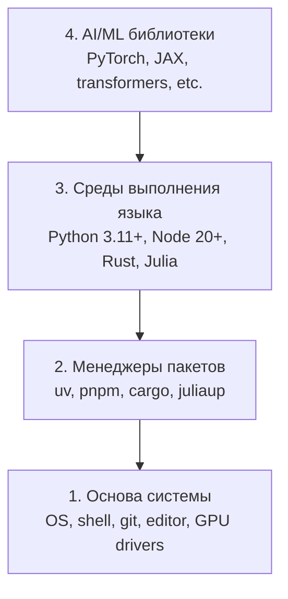

# Среда разработки

> Ваши инструменты формируют ваше мышление. Настройте их один раз — и настройте правильно.

**Тип:** Практика  
**Языки:** Python, Node.js, Rust  
**Предварительные требования:** Нет  
**Время:** ~45 минут

## Цели обучения

- Установить Python 3.11+, Node.js 20+ и toolchain Rust с нуля
- Настроить виртуальные окружения и менеджеры пакетов для воспроизводимых сборок
- Проверить доступ к GPU через CUDA/MPS и выполнить тестовую тензорную операцию
- Понять стек из четырёх уровней: система, пакеты, рантаймы, AI-библиотеки

## Проблема

Вам предстоит изучать AI-инженерию в рамках более чем 200 уроков, используя Python, TypeScript, Rust и Julia. Если ваше окружение сломано, каждый урок превращается в борьбу с инструментами вместо обучения.

Большинство людей пропускают настройку среды. А потом тратят часы на отладку ошибок импорта, конфликтов версий и отсутствующих CUDA-драйверов. Мы сделаем это один раз — и сделаем правильно.

## Концепция

Среда AI-инженера состоит из четырёх уровней:



Мы устанавливаем всё снизу вверх. Каждый уровень зависит от предыдущего.

## Практика

### Шаг 1: Системная основа

Проверьте свою систему и установите базовые инструменты.

```bash
# macOS
xcode-select --install
brew install git curl wget

# Ubuntu/Debian
sudo apt update && sudo apt install -y build-essential git curl wget

# Windows (use WSL2)
wsl --install -d Ubuntu-24.04
```

### Шаг 2: Python с uv

Мы используем `uv` — он в 10–100 раз быстрее pip и автоматически управляет виртуальными окружениями.

```bash
curl -LsSf https://astral.sh/uv/install.sh | sh

uv python install 3.12

uv venv
source .venv/bin/activate  # or .venv\Scripts\activate on Windows

uv pip install numpy matplotlib jupyter
```

Проверка:

```python
import sys
print(f"Python {sys.version}")

import numpy as np
print(f"NumPy {np.__version__}")
a = np.array([1, 2, 3])
print(f"Vector: {a}, dot product with itself: {np.dot(a, a)}")
```

### Шаг 3: Node.js с pnpm

Для уроков по TypeScript (агенты, MCP-серверы, веб-приложения).

```bash
curl -fsSL https://fnm.vercel.app/install | bash
fnm install 22
fnm use 22

npm install -g pnpm

node -e "console.log('Node', process.version)"
```

### Шаг 4: Rust

Для уроков, критичных к производительности (инференс, системное программирование).

```bash
curl --proto '=https' --tlsv1.2 -sSf https://sh.rustup.rs | sh

rustc --version
cargo --version
```

### Шаг 5: Julia (необязательно)

Для математически насыщенных уроков, где Julia особенно сильна.

```bash
curl -fsSL https://install.julialang.org | sh

julia -e 'println("Julia ", VERSION)'
```

### Шаг 6: Настройка GPU (если он у вас есть)

```bash
# NVIDIA
nvidia-smi

# Install PyTorch with CUDA
uv pip install torch torchvision torchaudio --index-url https://download.pytorch.org/whl/cu124
```

```python
import torch
print(f"CUDA available: {torch.cuda.is_available()}")
if torch.cuda.is_available():
    print(f"GPU: {torch.cuda.get_device_name(0)}")
```

Нет GPU? Не проблема. Большинство уроков работают и на CPU. Для задач с тяжёлым обучением используйте Google Colab или облачные GPU.

### Шаг 7: Проверка всего окружения

Запустите скрипт проверки:

```bash
python phases/00-setup-and-tooling/01-dev-environment/code/verify.py
```

## Использование

Теперь ваше окружение готово для всех уроков этого курса. Вот где что будет использоваться:

| Язык | Где используется | Менеджер пакетов |
|----------|---------|-----------------|
| Python | Фазы 1–12 (ML, DL, NLP, Vision, Audio, LLMs) | uv |
| TypeScript | Фазы 13–17 (инструменты, агенты, swarm-системы, инфраструктура) | pnpm |
| Rust | Фазы 12, 15–17 (системы, критичные к производительности) | cargo |
| Julia | Фаза 1 (математические основы) | Pkg |

## Результат

В результате этого урока вы получите скрипт проверки, который любой человек сможет запустить для диагностики своей среды.

См. `outputs/prompt-env-check.md` — там находится prompt, который помогает AI-ассистентам диагностировать проблемы с окружением.

## Упражнения

1. Запустите скрипт проверки и исправьте все ошибки
2. Создайте виртуальное окружение Python для этого курса и установите PyTorch
3. Напишите «hello world» на всех четырёх языках и запустите каждую программу
