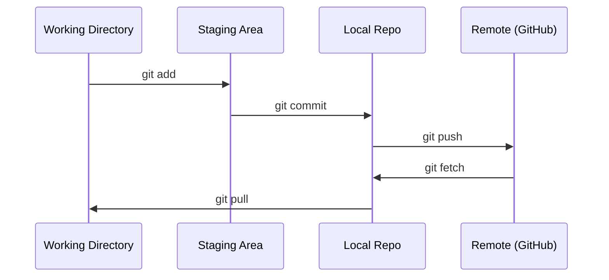

# Git и совместная работа

> Контроль версий — не опция. Каждый эксперимент, каждая модель и каждый урок, который вы создаёте здесь, должны отслеживаться.

**Тип:** Обучение  
**Языки:** --  
**Предварительные требования:** Фаза 0, Урок 01  
**Время:** ~30 минут

## Цели обучения

- Настроить git identity и использовать ежедневный workflow: add, commit и push
- Создавать и объединять ветки для изолированных экспериментов, не ломая main
- Написать `.gitignore`, исключающий чекпоинты моделей и крупные бинарные файлы
- Перемещаться по истории коммитов с помощью `git log`, чтобы понимать эволюцию проекта

## Проблема

Вам предстоит написать сотни файлов кода в рамках 20 фаз. Без системы контроля версий вы будете терять работу, ломать вещи без возможности отката и не сможете нормально сотрудничать с другими.

Git — это инструмент. GitHub — место, где хранится код. В этом уроке рассматривается только то, что действительно нужно для курса, и ничего лишнего.

## Концепция



Три вещи, которые нужно запомнить:
1. Чаще сохраняйте изменения (`git commit`)
2. Отправляйте изменения в удалённый репозиторий (`git push`)
3. Используйте ветки для экспериментов (`git checkout -b experiment`)

## Практика

### Шаг 1: Настройка git

```bash
git config --global user.name "Your Name"
git config --global user.email "you@example.com"
```

### Шаг 2: Ежедневный workflow

```bash
git status
git add file.py
git commit -m "Add perceptron implementation"
git push origin main
```

### Шаг 3: Ветки для экспериментов

```bash
git checkout -b experiment/new-optimizer

# ... внесите изменения, сделайте commit ...

git checkout main
git merge experiment/new-optimizer
```

### Шаг 4: Работа с репозиторием курса

```bash
git clone https://github.com/stabuev/ai-engineering-from-scratch.git
cd ai-engineering-from-scratch

git checkout -b my-progress
# проходите уроки курса и коммитьте свой код
git push origin my-progress
```

## Использование

Для этого курса вам нужны ровно эти команды:

| Команда | Когда использовать |
|---------|------|
| `git clone` | Получить репозиторий курса |
| `git add` + `git commit` | Сохранить свою работу |
| `git push` | Сделать резервную копию на GitHub |
| `git checkout -b` | Попробовать что-то новое, не ломая main |
| `git log --oneline` | Посмотреть историю изменений |

Вот и всё. Для этого курса вам не нужны rebase, cherry-pick или submodules.

## Упражнения

1. Клонируйте этот репозиторий, создайте ветку `my-progress`, создайте файл, закоммитьте его и отправьте в удалённый репозиторий
2. Создайте `.gitignore`, который исключает файлы чекпоинтов моделей (`.pt`, `.pth`, `.safetensors`)
3. Посмотрите историю коммитов этого репозитория с помощью `git log --oneline` и изучите, как добавлялись уроки

## Ключевые термины

| Термин | Как обычно говорят | Что это означает на самом деле |
|------|----------------|----------------------|
| Commit | «Сохранение» | Снимок всего проекта в определённый момент времени |
| Branch | «Копия» | Указатель на коммит, который движется вперёд по мере вашей работы |
| Merge | «Объединение кода» | Применение изменений из одной ветки к другой |
| Remote | «Облако» | Копия репозитория, размещённая где-то ещё (GitHub, GitLab) |
