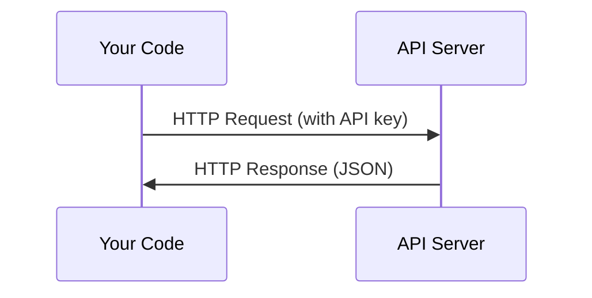

# API и ключи

> Каждый AI API работает одинаково: отправляете запрос, получаете ответ. Детали меняются, паттерн - нет.

**Тип:** Build
**Языки:** Python, TypeScript
**Предварительные требования:** Фаза 0, урок 01
**Время:** ~30 минут

## Цели обучения

- Безопасно хранить API-ключи с помощью переменных окружения и файлов `.env`
- Выполнить LLM API-вызов с помощью Anthropic Python SDK и сырого HTTP
- Сравнить форматы запросов и ответов при работе через SDK и через сырой HTTP для отладки
- Распознавать и обрабатывать распространенные ошибки API, включая аутентификацию и rate limits

## Проблема

Начиная с фазы 11 вы будете вызывать LLM API (Anthropic, OpenAI, Google). В фазах 13-16 вы будете строить агентов, которые используют эти API в циклах. Нужно понимать, как работают API-ключи, как хранить их безопасно и как сделать первый API-вызов.

## Концепция



У каждого API-вызова есть:
1. Endpoint (URL)
2. API-ключ (аутентификация)
3. Тело запроса (что вы хотите)
4. Тело ответа (что вы получаете обратно)

## Практика

### Шаг 1: безопасно храните API-ключи

Никогда не помещайте API-ключи в код. Используйте переменные окружения.

```bash
export ANTHROPIC_API_KEY="sk-ant-..."
export OPENAI_API_KEY="sk-..."
```

Или используйте файл `.env` (добавьте его в `.gitignore`):

```
ANTHROPIC_API_KEY=sk-ant-...
OPENAI_API_KEY=sk-...
```

### Шаг 2: первый API-вызов (Python)

```python
import anthropic

client = anthropic.Anthropic()

response = client.messages.create(
    model="claude-sonnet-4-20250514",
    max_tokens=256,
    messages=[{"role": "user", "content": "What is a neural network in one sentence?"}]
)

print(response.content[0].text)
```

### Шаг 3: первый API-вызов (TypeScript)

```typescript
import Anthropic from "@anthropic-ai/sdk";

const client = new Anthropic();

const response = await client.messages.create({
  model: "claude-sonnet-4-20250514",
  max_tokens: 256,
  messages: [{ role: "user", content: "What is a neural network in one sentence?" }],
});

console.log(response.content[0].text);
```

### Шаг 4: сырой HTTP (без SDK)

```python
import os
import urllib.request
import json

url = "https://api.anthropic.com/v1/messages"
headers = {
    "Content-Type": "application/json",
    "x-api-key": os.environ["ANTHROPIC_API_KEY"],
    "anthropic-version": "2023-06-01",
}
body = json.dumps({
    "model": "claude-sonnet-4-20250514",
    "max_tokens": 256,
    "messages": [{"role": "user", "content": "What is a neural network in one sentence?"}],
}).encode()

req = urllib.request.Request(url, data=body, headers=headers, method="POST")
with urllib.request.urlopen(req) as resp:
    result = json.loads(resp.read())
    print(result["content"][0]["text"])
```

Именно это SDK делают под капотом. Понимание сырого HTTP-вызова помогает при отладке.

## Использование

Для этого курса:

| API | Когда он нужен | Бесплатный уровень |
|-----|-----------------|-----------|
| Anthropic (Claude) | Фазы 11-16 (агенты, инструменты) | $5 credit on signup |
| OpenAI | Фаза 11 (сравнение) | $5 credit on signup |
| Hugging Face | Фазы 4-10 (модели, датасеты) | Free |

Сейчас вам не нужны все эти API. Настраивайте их тогда, когда этого требует урок.

## Результат

Этот урок создает:
- `outputs/prompt-api-troubleshooter.md` - диагностика распространенных ошибок API

## Упражнения

1. Получите API-ключ Anthropic и сделайте первый API-вызов
2. Попробуйте версию с сырым HTTP и сравните формат ответа с версией через SDK
3. Намеренно используйте неверный API-ключ и прочитайте сообщение об ошибке

## Ключевые термины

| Термин | Как говорят | Что это на самом деле означает |
|------|----------------|----------------------|
| API key | "Пароль для API" | Уникальная строка, которая идентифицирует ваш аккаунт и авторизует запросы |
| Rate limit | "Меня ограничивают" | Максимальное число запросов в минуту/час для предотвращения злоупотреблений и честного распределения ресурсов |
| Token | "Слово" (в контексте API) | Единица биллинга: входные и выходные токены считаются и оплачиваются отдельно |
| Streaming | "Ответы в реальном времени" | Получение ответа слово за словом вместо ожидания полного ответа |
