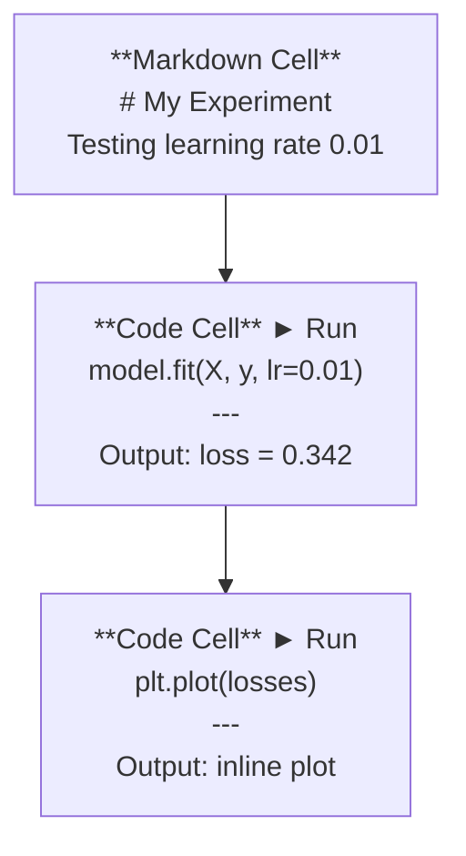
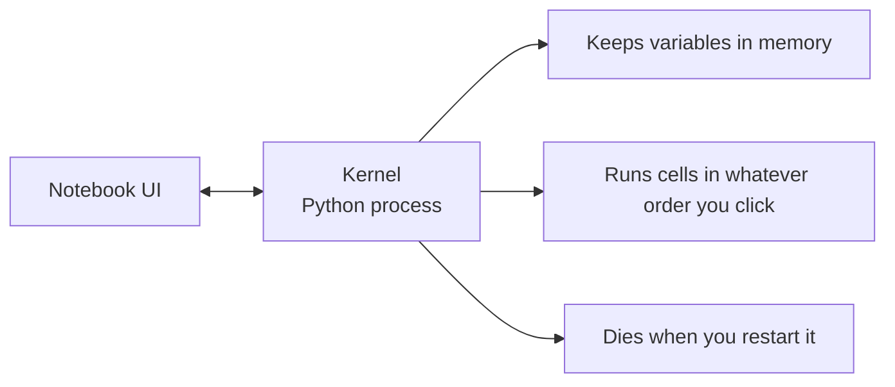

# Jupyter Notebooks

> Ноутбуки - лабораторный стол AI-инженерии. Здесь вы прототипируете, а затем переносите то, что работает, в production.

**Тип:** Build
**Языки:** Python
**Предварительные требования:** Фаза 0, урок 01
**Время:** ~30 минут

## Цели обучения

- Установить и запустить JupyterLab, Jupyter Notebook или VS Code с расширением Jupyter
- Использовать magic-команды (`%timeit`, `%%time`, `%matplotlib inline`) для бенчмаркинга и inline-визуализации
- Различать, когда использовать ноутбуки, а когда скрипты, и применять workflow "исследуйте в ноутбуках, поставляйте в скриптах"
- Распознавать и избегать распространенных ловушек ноутбуков: выполнение не по порядку, скрытое состояние и утечки памяти

## Проблема

Каждая AI-статья, tutorial и Kaggle-соревнование используют Jupyter notebooks. Они позволяют запускать код частями, видеть вывод inline, смешивать код с объяснениями и быстро итерироваться. Пытаться изучать AI без ноутбуков - как делать математическую домашнюю работу без черновика.

Но у ноутбуков есть реальные ловушки. Люди используют их для всего, включая задачи, для которых они плохо подходят. Понимание, когда использовать ноутбук, а когда скрипт, позже избавит вас от кошмарной отладки.

## Концепция

Ноутбук - это список ячеек. Каждая ячейка содержит либо код, либо текст.



Kernel - это Python-процесс, работающий в фоне. Когда вы запускаете ячейку, она отправляет код в kernel, он выполняет код и возвращает результат. Все ячейки используют один и тот же kernel, поэтому переменные сохраняются между ячейками.



Часть "в каком угодно порядке, в котором вы кликаете" одновременно суперсила и источник проблем.

## Практика

### Шаг 1: выберите интерфейс

Три варианта, один формат:

| Интерфейс | Установка | Лучше всего подходит для |
|-----------|---------|----------|
| JupyterLab | `pip install jupyterlab`, затем `jupyter lab` | Полноценный IDE-опыт, несколько вкладок, файловый браузер, терминал |
| Jupyter Notebook | `pip install notebook`, затем `jupyter notebook` | Простой, легкий вариант, один ноутбук за раз |
| VS Code | Установите расширение "Jupyter" | Уже в вашем редакторе, интеграция с git, отладка |

Все три читают и записывают один и тот же файл `.ipynb`. Выберите то, что вам нравится. JupyterLab - самый распространенный вариант в AI-работе.

```bash
pip install jupyterlab
jupyter lab
```

### Шаг 2: важные горячие клавиши

Вы работаете в двух режимах. Нажмите `Escape` для command mode (синяя полоска слева), `Enter` для edit mode (зеленая полоска).

**Command mode (используется чаще всего):**

| Клавиша | Действие |
|-----|--------|
| `Shift+Enter` | Запустить ячейку и перейти к следующей |
| `A` | Вставить ячейку выше |
| `B` | Вставить ячейку ниже |
| `DD` | Удалить ячейку |
| `M` | Преобразовать в markdown |
| `Y` | Преобразовать в code |
| `Z` | Отменить операцию с ячейкой |
| `Ctrl+Shift+H` | Показать все shortcuts |

**Edit mode:**

| Клавиша | Действие |
|-----|--------|
| `Tab` | Автодополнение |
| `Shift+Tab` | Показать сигнатуру функции |
| `Ctrl+/` | Переключить комментарий |

`Shift+Enter` - комбинация, которую вы будете использовать тысячу раз в день. Выучите ее первой.

### Шаг 3: типы ячеек

**Code cells** запускают Python и показывают вывод:

```python
import numpy as np
data = np.random.randn(1000)
data.mean(), data.std()
```

Вывод: `(0.0032, 0.9987)`

**Markdown cells** отображают форматированный текст. Используйте их, чтобы документировать, что вы делаете и почему. Поддерживаются заголовки, bold, italic, LaTeX math (`$E = mc^2$`), таблицы и изображения.

### Шаг 4: magic-команды

Это не Python. Это специфичные для Jupyter команды, которые начинаются с `%` (line magic) или `%%` (cell magic).

**Измеряйте время выполнения кода:**

```python
%timeit np.random.randn(10000)
```

Вывод: `45.2 us +/- 1.3 us per loop`

```python
%%time
model.fit(X_train, y_train, epochs=10)
```

Вывод: `Wall time: 2.34 s`

`%timeit` запускает код много раз и усредняет результат. `%%time` запускает его один раз. Используйте `%timeit` для микробенчмарков, `%%time` для training runs.

**Включите inline-графики:**

```python
%matplotlib inline
```

Теперь каждый `plt.plot()` или `plt.show()` будет отображаться прямо в ноутбуке.

**Устанавливайте пакеты, не выходя из ноутбука:**

```python
!pip install scikit-learn
```

Префикс `!` запускает любую shell-команду.

**Проверяйте переменные окружения:**

```python
%env CUDA_VISIBLE_DEVICES
```

### Шаг 5: отображайте rich output inline

Ноутбуки автоматически отображают последнее выражение в ячейке. Но вы можете управлять этим:

```python
import pandas as pd

df = pd.DataFrame({
    "model": ["Linear", "Random Forest", "Neural Net"],
    "accuracy": [0.72, 0.89, 0.94],
    "training_time": [0.1, 2.3, 45.6]
})
df
```

Это отображает форматированную HTML-таблицу, а не текстовый dump. То же самое с графиками:

```python
import matplotlib.pyplot as plt

plt.figure(figsize=(8, 4))
plt.plot([1, 2, 3, 4], [1, 4, 2, 3])
plt.title("Inline Plot")
plt.show()
```

График появляется прямо под ячейкой. Поэтому ноутбуки доминируют в AI-работе. Вы видите данные, график и код вместе.

Для изображений:

```python
from IPython.display import Image, display
display(Image(filename="architecture.png"))
```

### Шаг 6: Google Colab

Colab - это бесплатный Jupyter notebook в облаке. Он дает GPU, предустановленные библиотеки и интеграцию с Google Drive. Настройка не требуется.

1. Перейдите на [colab.research.google.com](https://colab.research.google.com)
2. Загрузите любой файл `.ipynb` из этого курса
3. Runtime > Change runtime type > T4 GPU (free)

Отличия Colab от локального Jupyter:
- Файлы не сохраняются между сессиями (сохраняйте в Drive или скачивайте)
- Предустановлено: numpy, pandas, matplotlib, torch, tensorflow, sklearn
- `from google.colab import files` для upload/download файлов
- `from google.colab import drive; drive.mount('/content/drive')` для постоянного хранилища
- Сессии завершаются после 90 минут бездействия (free tier)

## Использование

### Ноутбуки и скрипты: когда что использовать

| Используйте ноутбуки для | Используйте скрипты для |
|-------------------|-----------------|
| Исследования датасета | Training pipelines |
| Прототипирования модели | Переиспользуемых утилит |
| Визуализации результатов | Всего, где есть `if __name__` |
| Объяснения своей работы | Кода, который запускается по расписанию |
| Быстрых экспериментов | Production-кода |
| Упражнений курса | Пакетов и библиотек |

Правило: **исследуйте в ноутбуках, поставляйте в скриптах**.

Типичный AI workflow:
1. Исследуйте данные в ноутбуке
2. Прототипируйте модель в ноутбуке
3. Когда она заработала, перенесите код в файлы `.py`
4. Импортируйте эти `.py` файлы обратно в ноутбук для дальнейших экспериментов

### Распространенные ловушки

**Выполнение не по порядку.** Вы запускаете ячейку 5, затем 2, затем 7. Ноутбук работает на вашей машине, но ломается, когда кто-то запускает его сверху вниз. Исправление: Kernel > Restart & Run All перед тем, как делиться ноутбуком.

**Скрытое состояние.** Вы удалили ячейку, но переменная, которую она создала, все еще в памяти. Ноутбук выглядит чистым, но зависит от удаленной ячейки. Исправление: регулярно перезапускайте kernel.

**Утечки памяти.** Загрузили датасет на 4 GB, обучили модель, загрузили еще один датасет. Ничего не освобождается. Исправление: `del variable_name` и `gc.collect()` или перезапуск kernel.

## Результат

Этот урок создает:
- `outputs/prompt-notebook-helper.md` для отладки проблем с ноутбуками

## Упражнения

1. Откройте JupyterLab, создайте ноутбук и используйте `%timeit`, чтобы сравнить list comprehension и numpy для создания массива из 100 000 случайных чисел
2. Создайте ноутбук с markdown- и code-ячейками, который загружает CSV, отображает dataframe и строит график. Затем выполните Kernel > Restart & Run All, чтобы проверить, что он работает сверху вниз
3. Возьмите код из `code/notebook_tips.py`, вставьте его в Colab notebook и запустите с бесплатным GPU

## Ключевые термины

| Термин | Как говорят | Что это на самом деле означает |
|------|----------------|----------------------|
| Kernel | "То, что запускает мой код" | Отдельный Python-процесс, который выполняет ячейки и хранит переменные в памяти |
| Cell | "Блок кода" | Независимо запускаемый элемент ноутбука: либо code, либо markdown |
| Magic command | "Jupyter tricks" | Специальные команды с префиксом `%` или `%%`, которые управляют окружением ноутбука |
| `.ipynb` | "Файл ноутбука" | JSON-файл, содержащий ячейки, вывод и метаданные. Расшифровывается как IPython Notebook |

## Дополнительное чтение

- [JupyterLab Docs](https://jupyterlab.readthedocs.io/) для полного набора возможностей
- [Google Colab FAQ](https://research.google.com/colaboratory/faq.html) для лимитов и особенностей Colab
- [28 Jupyter Notebook Tips](https://www.dataquest.io/blog/jupyter-notebook-tips-tricks-shortcuts/) для power-user shortcuts
