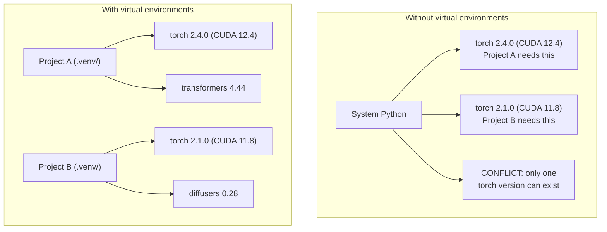

# Python-окружения

> Ад зависимостей реален. Виртуальные окружения - лекарство.

**Тип:** Build
**Языки:** Python
**Предварительные требования:** Фаза 0, урок 01
**Время:** ~30 минут

## Цели обучения

- Создавать изолированные виртуальные окружения с помощью `uv`, `venv` или `conda`
- Писать `pyproject.toml` с optional dependency groups и генерировать lockfiles для воспроизводимости
- Диагностировать и исправлять распространенные проблемы: глобальные установки, смешивание pip/conda, несовпадение версий CUDA
- Реализовать стратегию окружений по фазам для проектов с конфликтующими зависимостями

## Проблема

Вы устанавливаете PyTorch 2.4 для проекта по fine-tuning. На следующей неделе другому проекту нужен PyTorch 2.1, потому что его CUDA build зафиксирован. Вы обновляете глобальную установку, и первый проект ломается. Вы откатываете версию, и ломается второй.

Это dependency hell. В AI/ML это происходит постоянно, потому что:

- PyTorch, JAX и TensorFlow поставляют собственные CUDA bindings
- Библиотеки моделей фиксируют конкретные версии фреймворков
- Глобальный `pip install` перезаписывает то, что было установлено раньше
- CUDA 11.8 builds не работают с CUDA 12.x drivers (и наоборот)

Исправление: каждый проект получает собственное изолированное окружение со своими пакетами.

## Концепция



## Практика

### Вариант 1: uv venv (рекомендуется)

`uv` - самый быстрый менеджер Python-пакетов (в 10-100 раз быстрее pip). Он управляет виртуальными окружениями, версиями Python и разрешением зависимостей в одном инструменте.

```bash
curl -LsSf https://astral.sh/uv/install.sh | sh

uv python install 3.12

cd your-project
uv venv
source .venv/bin/activate
```

Установите пакеты:

```bash
uv pip install torch numpy
```

Создайте проект с `pyproject.toml` за один шаг:

```bash
uv init my-ai-project
cd my-ai-project
uv add torch numpy matplotlib
```

### Вариант 2: venv (встроенный)

Если вы не можете установить `uv`, Python поставляется с `venv`:

```bash
python3 -m venv .venv
source .venv/bin/activate  # Linux/macOS
.venv\Scripts\activate     # Windows

pip install torch numpy
```

Медленнее, чем `uv`, но работает везде, где установлен Python.

### Вариант 3: conda (когда она нужна)

Conda управляет не-Python зависимостями вроде CUDA toolkits, cuDNN и C-библиотек. Используйте ее, когда:

- Нужна конкретная версия CUDA toolkit без системной установки
- Вы работаете на shared cluster, где нельзя устанавливать системные пакеты
- В инструкциях по установке библиотеки сказано "use conda"

```bash
# Install miniconda (not the full Anaconda)
curl -LsSf https://repo.anaconda.com/miniconda/Miniconda3-latest-Linux-x86_64.sh -o miniconda.sh
bash miniconda.sh -b

conda create -n myproject python=3.12
conda activate myproject

conda install pytorch torchvision torchaudio pytorch-cuda=12.4 -c pytorch -c nvidia
```

Одно правило: если вы используете conda для окружения, используйте conda для всех пакетов в этом окружении. Смешивание `pip install` внутри conda env вызывает конфликты зависимостей, которые больно отлаживать.

### Для этого курса: стратегия по фазам

Можно создать одно окружение для всего курса. Не делайте так. Разным фазам нужны разные, иногда конфликтующие зависимости.

Стратегия:

```
ai-engineering-from-scratch/
├── .venv/                    <-- shared lightweight env for phases 0-3
├── phases/
│   ├── 04-neural-networks/
│   │   └── .venv/            <-- PyTorch env
│   ├── 05-cnns/
│   │   └── .venv/            <-- same PyTorch env (symlink or shared)
│   ├── 08-transformers/
│   │   └── .venv/            <-- might need different transformer versions
│   └── 11-llm-apis/
│       └── .venv/            <-- API SDKs, no torch needed
```

Скрипт в `code/env_setup.sh` создает базовое окружение для этого курса.

## Основы pyproject.toml

У каждого Python-проекта должен быть `pyproject.toml`. Он заменяет `setup.py`, `setup.cfg` и `requirements.txt` одним файлом.

```toml
[project]
name = "ai-engineering-from-scratch"
version = "0.1.0"
requires-python = ">=3.11"
dependencies = [
    "numpy>=1.26",
    "matplotlib>=3.8",
    "jupyter>=1.0",
    "scikit-learn>=1.4",
]

[project.optional-dependencies]
torch = ["torch>=2.3", "torchvision>=0.18"]
llm = ["anthropic>=0.39", "openai>=1.50"]
```

Затем установите:

```bash
uv pip install -e ".[torch]"    # base + PyTorch
uv pip install -e ".[llm]"     # base + LLM SDKs
uv pip install -e ".[torch,llm]" # everything
```

## Lockfiles

Lockfile фиксирует каждую зависимость, включая транзитивные, до точных версий. Это гарантирует воспроизводимость: любой, кто устанавливает зависимости из lockfile, получает точно такие же пакеты.

```bash
# uv generates uv.lock automatically when using uv add
uv add numpy

# pip-tools approach
uv pip compile pyproject.toml -o requirements.lock
uv pip install -r requirements.lock
```

Коммитьте lockfile в git. Когда кто-то клонирует репозиторий, он устанавливает зависимости из lockfile и получает идентичные версии.

## Распространенные ошибки

### 1. Глобальная установка

```bash
pip install torch  # BAD: installs to system Python

source .venv/bin/activate
pip install torch  # GOOD: installs to virtual environment
```

Проверьте, куда устанавливаются пакеты:

```bash
which python       # should show .venv/bin/python, not /usr/bin/python
which pip           # should show .venv/bin/pip
```

### 2. Смешивание pip и conda

```bash
conda create -n myenv python=3.12
conda activate myenv
conda install pytorch -c pytorch
pip install some-other-package   # BAD: can break conda's dependency tracking
conda install some-other-package # GOOD: let conda manage everything
```

Если вам обязательно нужно использовать pip внутри conda (некоторые пакеты доступны только через pip), сначала установите все conda-пакеты, а pip-пакеты - последними.

### 3. Забыли активировать окружение

```bash
python train.py           # uses system Python, missing packages
source .venv/bin/activate
python train.py           # uses project Python, packages found
```

Shell prompt должен показывать имя окружения:

```
(.venv) $ python train.py
```

### 4. Коммит `.venv` в git

```bash
echo ".venv/" >> .gitignore
```

Виртуальные окружения занимают 200 MB-2 GB. Они локальные и не переносимы между машинами. Вместо них коммитьте `pyproject.toml` и lockfile.

### 5. Несовпадение версий CUDA

```bash
nvidia-smi                # shows driver CUDA version (e.g., 12.4)
python -c "import torch; print(torch.version.cuda)"  # shows PyTorch CUDA version

# These must be compatible.
# PyTorch CUDA version must be <= driver CUDA version.
```

## Использование

Запустите setup-скрипт, чтобы создать окружение курса:

```bash
bash phases/00-setup-and-tooling/06-python-environments/code/env_setup.sh
```

Он создает `.venv` в корне репозитория, устанавливает базовые зависимости и проверяет их.

## Упражнения

1. Запустите `env_setup.sh` и убедитесь, что все проверки проходят
2. Создайте второе виртуальное окружение, установите в него другую версию numpy и подтвердите, что окружения изолированы
3. Напишите `pyproject.toml` для проекта, которому нужны и PyTorch, и Anthropic SDK
4. Намеренно установите пакет глобально (без активации venv), посмотрите, куда он попал, затем удалите его

## Ключевые термины

| Термин | Как говорят | Что это на самом деле означает |
|------|----------------|----------------------|
| Virtual environment | "A venv" | Изолированная директория с Python-интерпретатором и пакетами, отделенная от системного Python |
| Lockfile | "Pinned dependencies" | Файл, перечисляющий каждый пакет и его точную версию, что гарантирует идентичные установки на разных машинах |
| pyproject.toml | "The new setup.py" | Стандартный конфигурационный файл Python-проекта, заменяющий setup.py/setup.cfg/requirements.txt |
| Transitive dependency | "Зависимость зависимости" | Package B зависит от C; если вы устанавливаете A, который зависит от B, C является транзитивной зависимостью A |
| CUDA mismatch | "Мой GPU не работает" | PyTorch был скомпилирован под другую версию CUDA, чем поддерживает ваш GPU driver |
