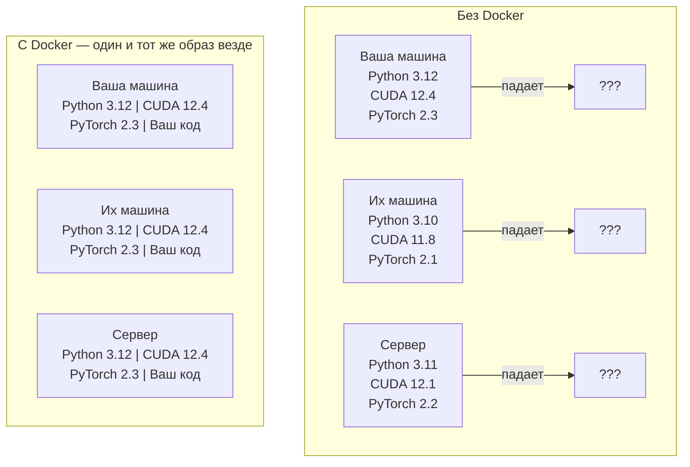

# Docker для AI

> Контейнеры делают фразу «у меня на машине работает» пережитком прошлого.

**Тип:** Сборка  
**Языки:** Python  
**Предварительные требования:** Phase 0, Lessons 01 и 03  
**Время:** ~60 минут

## Цели обучения

- Собрать Docker-образ с поддержкой GPU, CUDA, PyTorch и AI-библиотек на основе Dockerfile
- Подключать директории хоста как volumes для сохранения моделей, датасетов и кода между пересборками контейнера
- Настроить NVIDIA Container Toolkit для доступа к GPU внутри контейнеров
- Оркестрировать многосервисные AI-приложения (сервер инференса + векторная база данных) с помощью Docker Compose

## Проблема

Вы обучили модель на своём ноутбуке с PyTorch 2.3, CUDA 12.4 и Python 3.12. У вашего коллеги установлены PyTorch 2.1, CUDA 11.8 и Python 3.10. На его машине ваша модель падает. А Dockerfile работает одинаково у всех.

AI-проекты — это настоящий кошмар зависимостей. Типичный стек включает Python, PyTorch, CUDA-драйверы, cuDNN, системные C-библиотеки и специализированные пакеты вроде flash-attn, которым нужны строго определённые версии компиляторов. Docker упаковывает всё это в единый образ, который запускается одинаково везде.



### Почему AI-проектам Docker нужен больше, чем большинству других проектов

1. **GPU-драйверы хрупкие.** Код под CUDA 12.4 не будет работать на CUDA 11.8. Docker изолирует CUDA Toolkit внутри контейнера, при этом используя GPU-драйвер хоста через NVIDIA Container Toolkit.

2. **Веса моделей огромные.** Модель на 7B параметров занимает 14 ГБ в fp16. Вам точно не хочется скачивать её заново при каждой пересборке. Docker volumes позволяют подключать директорию с моделями с хоста.

3. **Многосервисные архитектуры — норма.** Реальное AI-приложение — это не просто Python-скрипт. Это сервер инференса, векторная база данных для RAG, возможно веб-интерфейс. Docker Compose управляет всем этим одной командой.

### Основные термины

| Термин | Что это означает |
|------|---------------|
| Image | Шаблон только для чтения. Ваш рецепт. Собирается из Dockerfile. |
| Container | Запущенный экземпляр image. Ваша кухня. |
| Dockerfile | Инструкции для сборки image. Послойно. |
| Volume | Постоянное хранилище, которое сохраняется после перезапуска контейнера. |
| docker-compose | Инструмент для описания многоконтейнерных приложений в YAML. |

### Типичные паттерны контейнеров в AI

```
Dev Container
  Полный набор инструментов. Поддержка редактора. Jupyter. Инструменты отладки.
  Используется во время разработки и экспериментов.

Training Container
  Минималистичный. Только training-скрипт и зависимости.
  Запускается на GPU-кластерах. Без редактора и Jupyter.

Inference Container
  Оптимизирован для инференса. Небольшой образ. Быстрый cold start.
  Работает за балансировщиком нагрузки в production.
```

## Собираем

### Шаг 1: Установка Docker

```bash
# macOS
brew install --cask docker
open /Applications/Docker.app

# Ubuntu
curl -fsSL https://get.docker.com | sh
sudo usermod -aG docker $USER
# Выйдите из системы и войдите снова, чтобы изменения группы вступили в силу
```

Проверка:

```bash
docker --version
docker run hello-world
```

### Шаг 2: Установка NVIDIA Container Toolkit (Linux с NVIDIA GPU)

Это позволяет Docker-контейнерам получать доступ к GPU. Пользователи macOS и Windows (WSL2) могут пропустить этот шаг — Docker Desktop реализует GPU passthrough иначе.

```bash
distribution=$(. /etc/os-release;echo $ID$VERSION_ID)
curl -fsSL https://nvidia.github.io/libnvidia-container/gpgkey | sudo gpg --dearmor -o /usr/share/keyrings/nvidia-container-toolkit-keyring.gpg
curl -s -L https://nvidia.github.io/libnvidia-container/$distribution/libnvidia-container.list | \
    sed 's#deb https://#deb [signed-by=/usr/share/keyrings/nvidia-container-toolkit-keyring.gpg] https://#g' | \
    sudo tee /etc/apt/sources.list.d/nvidia-container-toolkit.list

sudo apt-get update
sudo apt-get install -y nvidia-container-toolkit
sudo nvidia-ctk runtime configure --runtime=docker
sudo systemctl restart docker
```

Проверьте доступ к GPU внутри контейнера:

```bash
docker run --rm --gpus all nvidia/cuda:12.4.1-base-ubuntu22.04 nvidia-smi
```

Если вы видите информацию о своей GPU, значит toolkit работает.

### Шаг 3: Разберитесь с базовыми образами

Правильный выбор базового образа экономит часы отладки.

```
nvidia/cuda:12.4.1-devel-ubuntu22.04
  Полный CUDA Toolkit. Включает компиляторы.
  Использование: сборка пакетов, которым нужен nvcc (flash-attn, bitsandbytes)
  Размер: ~4 ГБ

nvidia/cuda:12.4.1-runtime-ubuntu22.04
  Только CUDA runtime. Без компиляторов.
  Использование: запуск уже собранного кода
  Размер: ~1.5 ГБ

pytorch/pytorch:2.3.1-cuda12.4-cudnn9-runtime
  PyTorch уже установлен поверх CUDA.
  Использование: чтобы пропустить шаг установки PyTorch
  Размер: ~6 ГБ

python:3.12-slim
  Без CUDA. Только CPU.
  Использование: инференс на CPU, лёгкие утилиты
  Размер: ~150 МБ
```

### Шаг 4: Напишите Dockerfile для AI-разработки

Вот Dockerfile из `code/Dockerfile`. Разберём его:

```dockerfile
FROM nvidia/cuda:12.4.1-devel-ubuntu22.04

ENV DEBIAN_FRONTEND=noninteractive
ENV PYTHONUNBUFFERED=1

RUN apt-get update && apt-get install -y --no-install-recommends \
    python3.12 \
    python3.12-venv \
    python3.12-dev \
    python3-pip \
    git \
    curl \
    build-essential \
    && rm -rf /var/lib/apt/lists/*

RUN update-alternatives --install /usr/bin/python python /usr/bin/python3.12 1

RUN python -m pip install --no-cache-dir --upgrade pip setuptools wheel

RUN python -m pip install --no-cache-dir \
    torch==2.3.1 \
    torchvision==0.18.1 \
    torchaudio==2.3.1 \
    --index-url https://download.pytorch.org/whl/cu124

RUN python -m pip install --no-cache-dir \
    numpy \
    pandas \
    scikit-learn \
    matplotlib \
    jupyter \
    transformers \
    datasets \
    accelerate \
    safetensors

WORKDIR /workspace

VOLUME ["/workspace", "/models"]

EXPOSE 8888

CMD ["python"]
```

Соберите его:

```bash
docker build -t ai-dev -f phases/00-setup-and-tooling/07-docker-for-ai/code/Dockerfile .
```

Первый раз это займёт время (скачивание CUDA-образа и PyTorch). Последующие сборки будут использовать кэшированные слои.

Запустите:

```bash
docker run --rm -it --gpus all \
    -v $(pwd):/workspace \
    -v ~/models:/models \
    ai-dev python -c "import torch; print(f'PyTorch {torch.__version__}, CUDA: {torch.cuda.is_available()}')"
```

Запустите Jupyter внутри контейнера:

```bash
docker run --rm -it --gpus all \
    -v $(pwd):/workspace \
    -v ~/models:/models \
    -p 8888:8888 \
    ai-dev jupyter notebook --ip=0.0.0.0 --port=8888 --no-browser --allow-root
```

### Шаг 5: Volume mounts для данных и моделей

Volume mounts критически важны для AI-разработки. Без них скачанные 14 ГБ модели исчезнут после остановки контейнера.

```bash
# Подключить ваш код
-v $(pwd):/workspace

# Подключить общую директорию с моделями
-v ~/models:/models

# Подключить датасеты
-v ~/datasets:/data
```

Внутри training-скрипта загружайте модель из подключённого пути:

```python
from transformers import AutoModel

model = AutoModel.from_pretrained("/models/llama-7b")
```

Модель хранится в файловой системе хоста. Вы можете пересобирать контейнер сколько угодно без повторного скачивания.

### Шаг 6: Docker Compose для многосервисных AI-приложений

Настоящему RAG-приложению нужны сервер инференса и векторная база данных. Docker Compose запускает их одной командой.

Смотрите `code/docker-compose.yml`:

```yaml
services:
  ai-dev:
    build:
      context: .
      dockerfile: Dockerfile
    deploy:
      resources:
        reservations:
          devices:
            - driver: nvidia
              count: all
              capabilities: [gpu]
    volumes:
      - ../../../:/workspace
      - ~/models:/models
      - ~/datasets:/data
    ports:
      - "8888:8888"
    stdin_open: true
    tty: true
    command: jupyter notebook --ip=0.0.0.0 --port=8888 --no-browser --allow-root

  qdrant:
    image: qdrant/qdrant:v1.12.5
    ports:
      - "6333:6333"
      - "6334:6334"
    volumes:
      - qdrant_data:/qdrant/storage

volumes:
  qdrant_data:
```

Запустите всё:

```bash
cd phases/00-setup-and-tooling/07-docker-for-ai/code
docker compose up -d
```

Теперь AI-контейнер может обращаться к векторной базе данных по адресу `http://qdrant:6333` через имя сервиса. Docker Compose автоматически создаёт общую сеть.

Проверьте соединение изнутри AI-контейнера:

```python
from qdrant_client import QdrantClient

client = QdrantClient(host="qdrant", port=6333)
print(client.get_collections())
```

Остановите всё:

```bash
docker compose down
```

Добавьте `-v`, чтобы также удалить volume qdrant:

```bash
docker compose down -v
```

### Шаг 7: Полезные Docker-команды для AI

```bash
# Список запущенных контейнеров
docker ps

# Список всех образов и их размеров
docker images

# Удалить неиспользуемые образы (освободить место)
docker system prune -a

# Проверить использование GPU внутри работающего контейнера
docker exec -it <container_id> nvidia-smi

# Скопировать файл из контейнера на хост
docker cp <container_id>:/workspace/results.csv ./results.csv

# Просмотр логов контейнера
docker logs -f <container_id>
```

## Используем

Теперь у вас есть воспроизводимая среда для AI-разработки. Для остальной части курса:

- Используйте `docker compose up`, чтобы запускать среду разработки и векторную базу данных вместе
- Подключайте код, модели и данные через volumes, чтобы ничего не терялось между пересборками
- Если для урока нужен новый Python-пакет — добавьте его в Dockerfile и пересоберите образ
- Делитесь Dockerfile с командой. Все получат абсолютно одинаковое окружение.

### Нет GPU?

Удалите флаг `--gpus all` и блок NVIDIA deploy. Контейнер всё равно будет работать для CPU-уроков. PyTorch автоматически обнаружит отсутствие CUDA и переключится на CPU.

## Упражнения

1. Соберите Dockerfile и выполните внутри контейнера `python -c "import torch; print(torch.__version__)"`
2. Запустите стек docker-compose и убедитесь, что Qdrant доступен из AI-контейнера по адресу `http://qdrant:6333/collections`
3. Добавьте `flask` в Dockerfile, пересоберите образ и запустите простой API-сервер на порту 5000. Пробросьте порт через `-p 5000:5000`
4. Измерьте размер образа с помощью `docker images`. Попробуйте заменить базовый образ с `devel` на `runtime` и сравните размеры

## Ключевые термины

| Термин | Как это обычно называют | Что это означает на самом деле |
|------|----------------|----------------------|
| Container | «Лёгкая VM» | Изолированный процесс, использующий kernel хоста, со своей файловой системой и сетью |
| Image layer | «Кэшированный шаг» | Каждая инструкция Dockerfile создаёт слой. Неизменённые слои кэшируются, поэтому пересборка происходит быстро. |
| NVIDIA Container Toolkit | «GPU в Docker» | Runtime-хук, который предоставляет контейнерам доступ к GPU хоста через флаг `--gpus` |
| Volume mount | «Общая папка» | Директория на хосте, подключённая внутрь контейнера. Изменения сохраняются после остановки контейнера. |
| Base image | «Точка старта» | Образ из `FROM`, поверх которого строится Dockerfile. Определяет, что уже предустановлено. |
