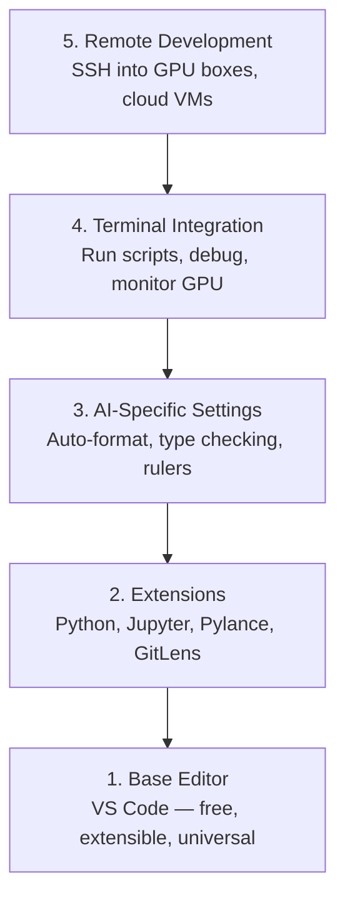

# Настройка редактора

> Ваш редактор — это ваш второй пилот. Настройте его один раз, чтобы он не мешал работе и действительно начал помогать.

**Тип:** Практика  
**Языки:** --  
**Предварительные требования:** Фаза 0, Урок 01  
**Время:** ~20 минут

## Цели обучения

- Установить VS Code с необходимыми расширениями для Python, Jupyter, линтинга и Remote SSH
- Настроить автоформатирование при сохранении, проверку типов и прокрутку вывода ноутбуков для AI‑workflow
- Настроить Remote SSH для редактирования и отладки кода на удаленных GPU‑машинах так, будто они локальные
- Оценить альтернативы редактора (Cursor, Windsurf, Neovim) и их компромиссы для AI‑разработки

## Проблема

Вы проведете тысячи часов внутри редактора: будете писать Python, запускать ноутбуки, отлаживать training loop и подключаться по SSH к GPU‑серверам. Неправильно настроенный редактор превращает каждую сессию в постоянное трение: нет автодополнения, подсказок типов, встроенных ошибок, автоформатирования и удобного терминального workflow.

Правильная настройка занимает 20 минут. Если ее пропустить — вы будете терять по 20 минут каждый день.

## Концепция

Настройка редактора для AI‑инженерии требует пяти вещей:



## Практика

### Шаг 1: Установите VS Code

VS Code — рекомендуемый редактор. Он бесплатный, работает на любой ОС, имеет первоклассную поддержку Jupyter Notebook, а экосистема расширений покрывает все необходимое для AI‑разработки.

Скачать можно с [code.visualstudio.com](https://code.visualstudio.com/).

Проверьте установку из терминала:

```bash
code --version
```

Если `code` не найден в macOS, откройте VS Code, нажмите `Cmd+Shift+P`, введите «Shell Command» и выберите «Install 'code' command in PATH».

### Шаг 2: Установите необходимые расширения

Откройте встроенный терминал в VS Code (`Ctrl+`` ` или `` Cmd+` ``) и установите расширения, которые действительно важны для AI‑разработки:

```bash
code --install-extension ms-python.python
code --install-extension ms-python.vscode-pylance
code --install-extension ms-toolsai.jupyter
code --install-extension eamodio.gitlens
code --install-extension ms-vscode-remote.remote-ssh
code --install-extension ms-python.debugpy
code --install-extension ms-python.black-formatter
code --install-extension charliermarsh.ruff
```

Что делает каждое из них:

| Расширение | Зачем нужно |
|-----------|-----|
| Python | Поддержка языка, обнаружение virtual env, запуск и отладка |
| Pylance | Быстрая проверка типов, автодополнение, разрешение импортов |
| Jupyter | Запуск ноутбуков прямо внутри VS Code, просмотр переменных |
| GitLens | Показывает, кто и что изменил, inline git blame |
| Remote SSH | Открытие папки на удаленном GPU‑сервере как локальной |
| Debugpy | Пошаговая отладка Python |
| Black Formatter | Автоформатирование при сохранении, единый стиль |
| Ruff | Быстрый линтер, ловит распространенные ошибки |

Файл `code/.vscode/extensions.json` в этом уроке содержит полный список рекомендуемых расширений. Когда вы откроете папку проекта, VS Code предложит установить их автоматически.

### Шаг 3: Настройте параметры

Скопируйте настройки из `code/.vscode/settings.json` этого урока или примените их вручную через `Settings > Open Settings (JSON)`.

Ключевые настройки для AI‑разработки:

```jsonc
{
    "python.analysis.typeCheckingMode": "basic",
    "editor.formatOnSave": true,
    "editor.rulers": [88, 120],
    "notebook.output.scrolling": true,
    "files.autoSave": "afterDelay"
}
```

Почему это важно:

- **Проверка типов в режиме basic**: ловит неправильные типы аргументов еще до запуска. Экономит время на отладке несовпадений форм тензоров и неверных параметров API.
- **Форматирование при сохранении**: больше никогда не думайте о форматировании. Black все сделает сам.
- **Линейки на 88 и 120**: Black переносит строки на 88 символах. Маркер 120 показывает, когда docstring или комментарии становятся слишком длинными.
- **Прокрутка вывода notebook**: training loop могут печатать тысячи строк. Без прокрутки панель вывода превращается в хаос.
- **Автосохранение**: вы забудете сохранить файл. Ваш training script запустит устаревший код. Автосохранение предотвращает это.

### Шаг 4: Интеграция терминала

Встроенный терминал VS Code — место, где вы запускаете training script, следите за GPU и управляете окружениями.

Настройте его правильно:

```jsonc
{
    "terminal.integrated.defaultProfile.osx": "zsh",
    "terminal.integrated.defaultProfile.linux": "bash",
    "terminal.integrated.fontSize": 13,
    "terminal.integrated.scrollback": 10000
}
```

Полезные сочетания клавиш:

| Действие | macOS | Linux/Windows |
|--------|-------|---------------|
| Открыть/скрыть терминал | `` Ctrl+` `` | `` Ctrl+` `` |
| Новый терминал | `Ctrl+Shift+`` ` | `Ctrl+Shift+`` ` |
| Разделить терминал | `Cmd+\` | `Ctrl+\` |

Разделенные терминалы особенно полезны: один для запуска скрипта, второй — для мониторинга GPU через `nvidia-smi -l 1` или `watch -n 1 nvidia-smi`.

### Шаг 5: Удаленная разработка (SSH к GPU‑серверам)

Это самое важное расширение для AI‑разработки. Вы будете обучать модели на удаленных машинах (облачные VM, лабораторные серверы, Lambda, Vast.ai). Remote SSH позволяет открывать удаленную файловую систему, редактировать файлы, запускать терминалы и отлаживать код так, будто все работает локально.

Настройка:

1. Установите расширение Remote SSH (сделано на шаге 2).
2. Нажмите `Ctrl+Shift+P` (или `Cmd+Shift+P`), введите «Remote-SSH: Connect to Host».
3. Введите `user@your-gpu-box-ip`.
4. VS Code автоматически установит серверный компонент на удаленную машину.

Для беспарольного доступа настройте SSH‑ключи:

```bash
ssh-keygen -t ed25519 -C "your-email@example.com"
ssh-copy-id user@your-gpu-box-ip
```

Добавьте хост в `~/.ssh/config` для удобства:

```
Host gpu-box
    HostName 203.0.113.50
    User ubuntu
    IdentityFile ~/.ssh/id_ed25519
    ForwardAgent yes
```

Теперь `Remote-SSH: Connect to Host > gpu-box` подключается мгновенно.

## Альтернативы

### Cursor

[cursor.com](https://cursor.com) — форк VS Code со встроенной AI‑генерацией кода. Он использует ту же экосистему расширений и тот же формат настроек. Если вы используете Cursor, все из этого урока остается актуальным. Импортируйте те же `settings.json` и `extensions.json`.

### Windsurf

[windsurf.com](https://windsurf.com) — еще один AI‑ориентированный форк VS Code. Та же история: те же расширения, тот же формат настроек, та же поддержка Remote SSH.

### Vim/Neovim

Если вы уже используете Vim или Neovim и продуктивно в них работаете — оставайтесь на них. Минимальная настройка для AI‑разработки на Python:

- **pyright** или **pylsp** для проверки типов (через Mason или вручную)
- **nvim-lspconfig** для интеграции language server
- **jupyter-vim** или **molten-nvim** для notebook‑подобного выполнения кода
- **telescope.nvim** для поиска файлов и символов
- **none-ls.nvim** с black и ruff для форматирования и линтинга

Если вы еще не пользуетесь Vim — не начинайте сейчас. Кривая обучения будет конкурировать с изучением AI‑инженерии. Используйте VS Code.

## Использование

С такой настройкой ваш ежедневный workflow выглядит так:

1. Откройте папку проекта в VS Code (или подключитесь к GPU‑серверу через Remote SSH).
2. Пишите Python‑код с автодополнением, подсказками типов и встроенными ошибками.
3. Запускайте Jupyter Notebook прямо внутри редактора.
4. Используйте встроенный терминал для training script, `uv pip install` и мониторинга GPU.
5. Просматривайте изменения через GitLens перед коммитом.

## Упражнения

1. Установите VS Code и все расширения из шага 2
2. Скопируйте `settings.json` из этого урока в конфигурацию VS Code
3. Откройте Python‑файл и убедитесь, что Pylance показывает подсказки типов, а Black форматирует код при сохранении
4. Если у вас есть доступ к удаленной машине — настройте Remote SSH и откройте на ней папку

## Ключевые термины

| Термин | Как обычно говорят | Что это означает на самом деле |
|------|----------------|----------------------|
| LSP | «Движок автодополнения» | Language Server Protocol — стандарт, через который редакторы получают информацию о типах, автодополнение и диагностику от language server |
| Pylance | «Python‑плагин» | Python language server от Microsoft, использующий Pyright для проверки типов и IntelliSense |
| Remote SSH | «Работа на сервере» | Расширение VS Code, которое запускает легкий сервер на удаленной машине и транслирует UI в локальный редактор |
| Format on save | «Автопричесывание кода» | Редактор запускает formatter (Black, Ruff) при каждом сохранении, чтобы стиль кода всегда оставался единообразным |
