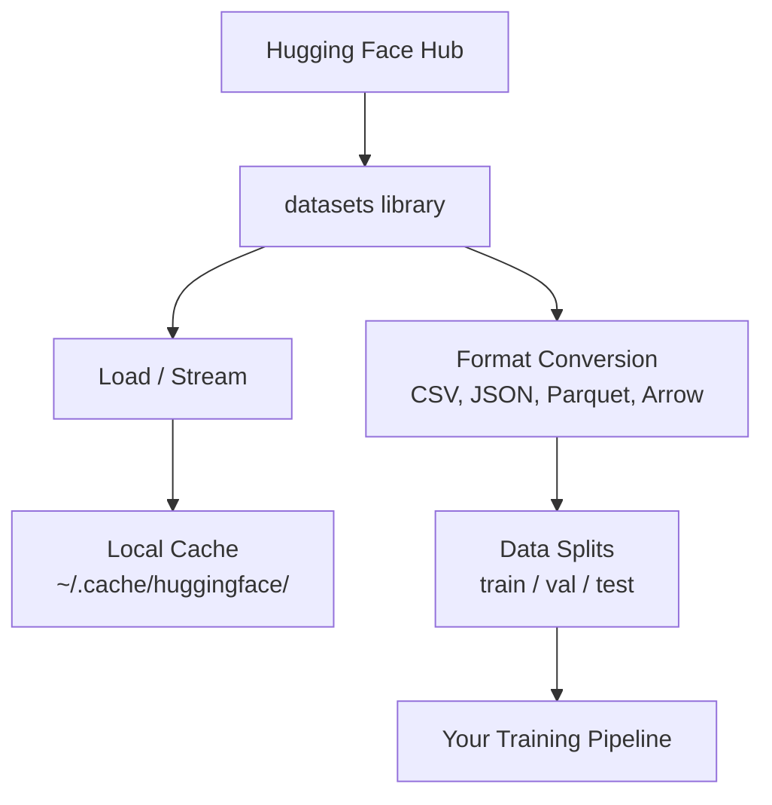

# Управление данными

> Данные - это топливо. От того, как вы ими управляете, зависит, как быстро вы движетесь.

**Тип:** Build
**Язык:** Python
**Предварительные требования:** Фаза 0, урок 01
**Время:** ~45 минут

## Цели обучения

- Загружать, стримить и кэшировать датасеты с помощью библиотеки Hugging Face `datasets`
- Конвертировать данные между форматами CSV, JSON, Parquet и Arrow и объяснять их компромиссы
- Создавать воспроизводимые train/validation/test splits с фиксированными random seeds
- Управлять большими файлами моделей и датасетов с помощью `.gitignore`, Git LFS или DVC

## Проблема

Каждый AI-проект начинается с данных. Нужно находить датасеты, скачивать их, конвертировать между форматами, разделять для обучения и оценки, а также версионировать, чтобы эксперименты были воспроизводимыми. Делать это вручную каждый раз медленно и приводит к ошибкам. Нужен повторяемый workflow.

## Концепция



Библиотека Hugging Face `datasets` - стандартный способ загружать данные для AI-работы. Она из коробки обрабатывает скачивание, кэширование, конвертацию форматов и streaming.

## Практика

### Шаг 1: установите библиотеку datasets

```bash
pip install datasets huggingface_hub
```

### Шаг 2: загрузите датасет

```python
from datasets import load_dataset

dataset = load_dataset("imdb")
print(dataset)
print(dataset["train"][0])
```

Это скачивает датасет отзывов о фильмах IMDB. После первого скачивания он загружается из кэша в `~/.cache/huggingface/datasets/`.

### Шаг 3: стримьте большие датасеты

Некоторые датасеты слишком велики, чтобы поместиться на диск. Streaming загружает их построчно, не скачивая все целиком.

```python
dataset = load_dataset("wikimedia/wikipedia", "20220301.en", split="train", streaming=True)

for i, example in enumerate(dataset):
    print(example["title"])
    if i >= 4:
        break
```

Streaming дает `IterableDataset`. Вы обрабатываете строки по мере поступления. Использование памяти остается постоянным независимо от размера датасета.

### Шаг 4: форматы датасетов

Библиотека `datasets` использует Apache Arrow под капотом. Вы можете конвертировать данные в другие форматы в зависимости от того, что нужно вашему pipeline.

```python
dataset = load_dataset("imdb", split="train")

dataset.to_csv("imdb_train.csv")
dataset.to_json("imdb_train.json")
dataset.to_parquet("imdb_train.parquet")
```

Сравнение форматов:

| Формат | Размер | Скорость чтения | Лучше всего подходит для |
|--------|------|-----------|----------|
| CSV | Большой | Низкая | Читаемость человеком, spreadsheets |
| JSON | Большой | Низкая | API, вложенные данные |
| Parquet | Маленький | Высокая | Analytics, columnar queries |
| Arrow | Маленький | Самая высокая | In-memory processing (то, что `datasets` использует внутри) |

Для AI-работы Parquet - лучший формат хранения. Arrow - то, с чем вы работаете в памяти. CSV и JSON нужны для обмена.

### Шаг 5: data splits

Каждому ML-проекту нужны три split:

- **Train**: модель учится на этом (обычно 80%)
- **Validation**: вы проверяете прогресс во время обучения (обычно 10%)
- **Test**: финальная оценка после завершения обучения (обычно 10%)

Некоторые датасеты уже разделены. Если нет, разделите их сами:

```python
dataset = load_dataset("imdb", split="train")

split = dataset.train_test_split(test_size=0.2, seed=42)
train_val = split["train"].train_test_split(test_size=0.125, seed=42)

train_ds = train_val["train"]
val_ds = train_val["test"]
test_ds = split["test"]

print(f"Train: {len(train_ds)}, Val: {len(val_ds)}, Test: {len(test_ds)}")
```

Всегда задавайте seed для воспроизводимости. Один и тот же seed каждый раз дает одинаковый split.

### Шаг 6: скачивайте и кэшируйте модели

Модели - это большие файлы. Библиотека `huggingface_hub` управляет скачиванием и кэшированием.

```python
from huggingface_hub import hf_hub_download, snapshot_download

model_path = hf_hub_download(
    repo_id="sentence-transformers/all-MiniLM-L6-v2",
    filename="config.json"
)
print(f"Cached at: {model_path}")

model_dir = snapshot_download("sentence-transformers/all-MiniLM-L6-v2")
print(f"Full model at: {model_dir}")
```

Модели кэшируются в `~/.cache/huggingface/hub/`. После скачивания при следующих запусках они загружаются мгновенно.

### Шаг 7: работайте с большими файлами

Веса моделей и большие датасеты не должны попадать в git. Три варианта:

**Вариант A: .gitignore (самый простой)**

```
*.bin
*.safetensors
*.pt
*.onnx
data/*.parquet
data/*.csv
models/
```

**Вариант B: Git LFS (отслеживать большие файлы в git)**

```bash
git lfs install
git lfs track "*.bin"
git lfs track "*.safetensors"
git add .gitattributes
```

Git LFS хранит pointers в вашем репозитории, а реальные файлы - на отдельном сервере. GitHub дает 1 GB бесплатно.

**Вариант C: DVC (data version control)**

```bash
pip install dvc
dvc init
dvc add data/training_set.parquet
git add data/training_set.parquet.dvc data/.gitignore
git commit -m "Track training data with DVC"
```

DVC создает маленькие `.dvc` файлы, которые указывают на ваши данные. Сами данные живут в S3, GCS или другом remote storage backend.

| Подход | Сложность | Лучше всего подходит для |
|----------|-----------|----------|
| .gitignore | Низкая | Личные проекты, скачанные данные, которые можно получить заново |
| Git LFS | Средняя | Команды, которые делятся весами моделей через git |
| DVC | Высокая | Воспроизводимые эксперименты, большие датасеты, команды |

Для этого курса достаточно `.gitignore`. Используйте DVC, когда нужно воспроизводить точные эксперименты на разных машинах.

### Шаг 8: паттерны хранения

**Локальное хранилище** подходит для датасетов до ~10 GB. HF cache обрабатывает это автоматически.

**Cloud storage** нужен для всего более крупного или общего для нескольких машин:

```python
import os

local_path = os.path.expanduser("~/.cache/huggingface/datasets/")

# s3_path = "s3://my-bucket/datasets/"
# gcs_path = "gs://my-bucket/datasets/"
```

DVC напрямую интегрируется с S3 и GCS:

```bash
dvc remote add -d myremote s3://my-bucket/dvc-store
dvc push
```

Для этого курса достаточно локального хранения. Cloud storage становится актуальным, когда вы fine-tune на удаленных GPU instances.

## Датасеты, используемые в этом курсе

| Датасет | Уроки | Размер | Чему учит |
|---------|---------|------|----------------|
| IMDB | Tokenization, classification | 84 MB | Основы text classification |
| WikiText | Language modeling | 181 MB | Next-token prediction |
| SQuAD | QA systems | 35 MB | Question answering, spans |
| Common Crawl (subset) | Embeddings | Varies | Large-scale text processing |
| MNIST | Vision basics | 21 MB | Основы image classification |
| COCO (subset) | Multimodal | Varies | Image-text pairs |

Не нужно скачивать все это сейчас. Каждый урок указывает, что ему нужно.

## Использование

Запустите utility script, чтобы проверить, что все работает:

```bash
python code/data_utils.py
```

Он скачивает маленький датасет, конвертирует его, разделяет и печатает summary.

## Результат

Этот урок создает:
- `code/data_utils.py` - переиспользуемая utility для загрузки и кэширования данных
- `outputs/prompt-data-helper.md` - prompt для поиска подходящего датасета под задачу

## Упражнения

1. Загрузите датасет `glue` с config `mrpc` и изучите первые 5 examples
2. Стримьте датасет `c4` и посчитайте, сколько examples можно обработать за 10 секунд
3. Конвертируйте датасет в Parquet и сравните размер файла с CSV
4. Создайте split 70/15/15 train/val/test с фиксированным seed и проверьте размеры

## Ключевые термины

| Термин | Как говорят | Что это на самом деле означает |
|------|----------------|----------------------|
| Dataset split | "Training data" | Именованное подмножество (train/val/test), используемое на разных этапах ML lifecycle |
| Streaming | "Load it lazily" | Построчная обработка данных из remote source без скачивания полного датасета |
| Parquet | "Compressed CSV" | Колонковый формат файлов, оптимизированный для analytical queries и эффективного хранения |
| Arrow | "Fast dataframe" | In-memory columnar format, который библиотека datasets использует внутри для zero-copy reads |
| Git LFS | "Git for big files" | Расширение, которое хранит большие файлы вне git repo, оставляя pointers в version control |
| DVC | "Git for data" | Система version control для датасетов и моделей, интегрирующаяся с cloud storage |
| Cache | "Already downloaded" | Локальная копия ранее полученных данных, по умолчанию хранящаяся в ~/.cache/huggingface/ |
