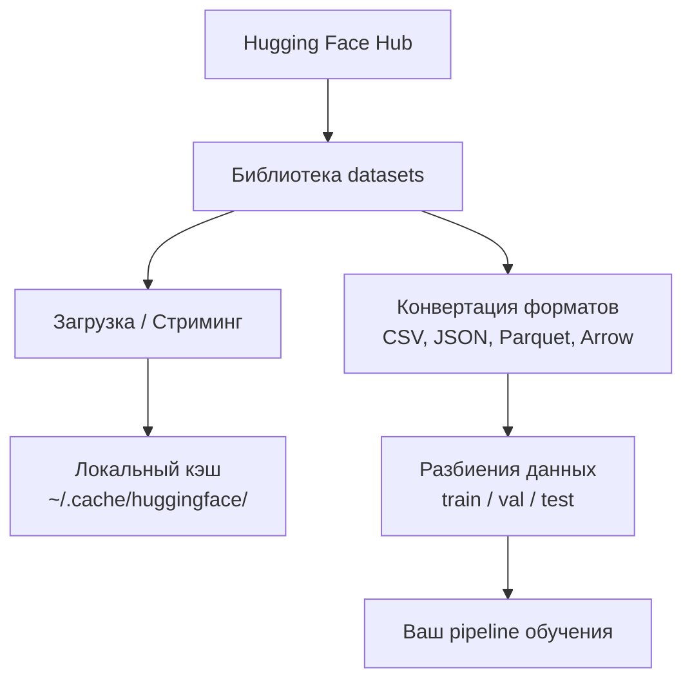

# Управление данными

> Данные — это топливо. То, как вы ими управляете, определяет, насколько быстро вы движетесь.

**Тип:** Практика  
**Язык:** Python  
**Предварительные требования:** Phase 0, Lesson 01  
**Время:** ~45 минут

## Цели обучения

- Загружать, стримить и кэшировать датасеты с помощью библиотеки Hugging Face `datasets`
- Конвертировать данные между форматами CSV, JSON, Parquet и Arrow и понимать их различия
- Создавать воспроизводимые train/validation/test-разбиения с фиксированными random seed
- Управлять большими файлами моделей и датасетов с помощью `.gitignore`, Git LFS или DVC

## Проблема

Любой AI‑проект начинается с данных. Вам нужно находить датасеты, загружать их, конвертировать между форматами, разбивать для обучения и оценки, а также версионировать, чтобы эксперименты были воспроизводимыми. Делать это вручную каждый раз — медленно и чревато ошибками. Нужен повторяемый workflow.

## Концепция



Библиотека Hugging Face `datasets` — это стандартный способ загрузки данных для AI‑разработки. Она «из коробки» поддерживает скачивание, кэширование, конвертацию форматов и стриминг.

## Практика

### Шаг 1: Установите библиотеку datasets

```bash
pip install datasets huggingface_hub
```

### Шаг 2: Загрузите датасет

```python
from datasets import load_dataset

dataset = load_dataset("imdb")
print(dataset)
print(dataset["train"][0])
```

Это скачает датасет отзывов на фильмы IMDB. После первой загрузки данные будут подгружаться из кэша `~/.cache/huggingface/datasets/`.

### Шаг 3: Стриминг больших датасетов

Некоторые датасеты слишком большие, чтобы хранить их локально. Стриминг загружает данные построчно без скачивания всего датасета.

```python
dataset = load_dataset("wikimedia/wikipedia", "20220301.en", split="train", streaming=True)

for i, example in enumerate(dataset):
    print(example["title"])
    if i >= 4:
        break
```

Стриминг возвращает `IterableDataset`. Вы обрабатываете строки по мере поступления. Использование памяти остаётся постоянным независимо от размера датасета.

## Ключевые термины

| Термин | Как обычно говорят | Что это означает на практике |
|------|----------------|----------------------|
| Dataset split | «Обучающая выборка» | Именованное подмножество данных (train/val/test), используемое на разных этапах ML‑цикла |
| Streaming | «Ленивая загрузка» | Построчная обработка данных из удалённого источника без скачивания полного датасета |
| Parquet | «Сжатый CSV» | Колоночный формат файлов, оптимизированный для аналитических запросов и эффективного хранения |
| Arrow | «Быстрый dataframe» | Колоночный формат в памяти, который библиотека datasets использует внутри для zero‑copy чтения |
| Git LFS | «Git для больших файлов» | Расширение, которое хранит большие файлы вне git‑репозитория, оставляя в системе контроля версий только указатели |
| DVC | «Git для данных» | Система контроля версий для датасетов и моделей с интеграцией облачного хранилища |
| Cache | «Уже скачано» | Локальная копия ранее загруженных данных, по умолчанию хранится в ~/.cache/huggingface/ |
