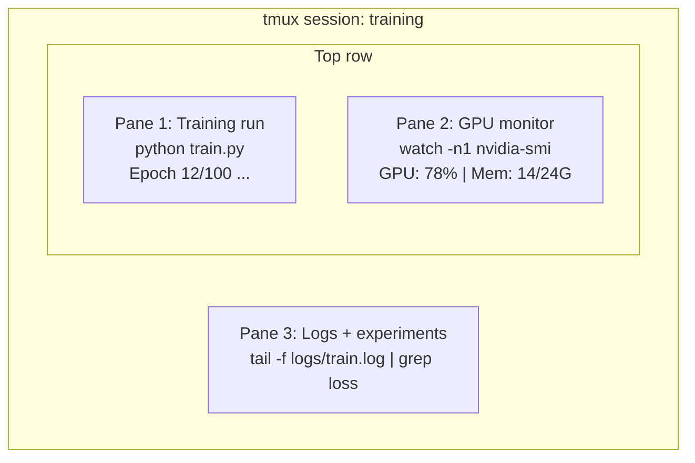

# Терминал и оболочка

> Терминал — место, где живут AI‑инженеры. Освойтесь здесь.

**Тип:** Learn  
**Языки:** --  
**Требования:** Phase 0, Lesson 01  
**Время:** ~35 минут

## Цели обучения

- Использовать пайпы, перенаправления и `grep` для фильтрации и обработки логов обучения из командной строки
- Создавать постоянные tmux‑сессии с несколькими панелями для одновременного запуска обучения и мониторинга GPU
- Мониторить системные ресурсы и GPU с помощью `htop`, `nvtop` и `nvidia-smi`
- Передавать файлы между локальной и удалённой машинами через SSH, `scp` и `rsync`

## Проблема

Вы будете проводить в терминале больше времени, чем в любом редакторе. Запуски обучения, мониторинг GPU, просмотр логов, удалённые SSH‑сессии, управление окружениями. Любой AI‑workflow так или иначе связан с оболочкой. Если вы медленно работаете в терминале — вы медленно работаете везде.

Этот урок охватывает навыки работы с терминалом, действительно важные для AI‑разработки. Без истории Unix. Без глубокого погружения в Bash‑скрипты. Только то, что действительно нужно.

## Концепция



Три процесса одновременно. Один терминал. Вы можете отсоединиться, пойти домой, снова подключиться по SSH и продолжить работу. Обучение при этом не остановится.

## Практика

### Шаг 1: Узнайте свою оболочку

Проверьте, какую оболочку вы используете:

```bash
echo $SHELL
```

Большинство систем используют `bash` или `zsh`. Обе подходят. Команды из этого курса работают в любой из них.

Ключевые вещи, которые стоит знать:

```bash
# Перемещение
cd ~/projects/ai-engineering-from-scratch
pwd
ls -la

# Поиск по истории (самый полезный хоткей, который вы выучите)
# Ctrl+R, затем введите часть предыдущей команды
# Нажмите Ctrl+R ещё раз, чтобы переключаться между совпадениями

# Очистить терминал
clear   # или Ctrl+L

# Остановить выполняющуюся команду
# Ctrl+C

# Приостановить выполняющуюся команду (возврат через fg)
# Ctrl+Z
```

### Шаг 2: Пайпы и перенаправления

Пайпы соединяют команды друг с другом. Именно так вы обрабатываете логи, фильтруете вывод и объединяете инструменты. Вы будете использовать это постоянно.

```bash
# Подсчитать, сколько раз слово "loss" встречается в логе
cat train.log | grep "loss" | wc -l

# Извлечь только значения loss из вывода обучения
grep "loss:" train.log | awk '{print $NF}' > losses.txt

# Следить за обновлением логов в реальном времени, фильтруя ошибки
tail -f train.log | grep --line-buffered "ERROR"

# Отсортировать эксперименты по финальной accuracy
grep "final_accuracy" results/*.log | sort -t= -k2 -n -r

# Перенаправить stdout и stderr в разные файлы
python train.py > output.log 2> errors.log

# Перенаправить оба потока в один файл
python train.py > train_full.log 2>&1
```

Три перенаправления, которые вам действительно нужны:

| Символ | Что делает |
|--------|-------------|
| `>` | Записывает stdout в файл (с перезаписью) |
| `>>` | Добавляет stdout в конец файла |
| `2>` | Записывает stderr в файл |
| `2>&1` | Отправляет stderr туда же, куда и stdout |
| `\|` | Передаёт stdout одной команды как stdin следующей |

### Шаг 3: Фоновые процессы

Обучение моделей занимает часы. Вы не захотите держать терминал открытым всё это время.

```bash
# Запустить в фоне (вывод всё ещё идёт в терминал)
python train.py &

# Запустить в фоне и защитить от hangup
nohup python train.py > train.log 2>&1 &

# Проверить фоновые процессы
jobs
ps aux | grep train.py

# Вернуть фоновую задачу на передний план
fg %1

# Убить фоновый процесс
kill %1
# или найти PID и завершить его
kill $(pgrep -f "train.py")
```

Разница между `&`, `nohup` и `screen`/`tmux`:

| Метод | Переживает закрытие терминала? | Можно переподключиться? |
|--------|-------------------------------|--------------------------|
| `command &` | Нет | Нет |
| `nohup command &` | Да | Нет (смотрите лог-файл) |
| `screen` / `tmux` | Да | Да |

Для всего, что длится больше нескольких минут, используйте tmux.

### Шаг 4: tmux

tmux позволяет создавать постоянные терминальные сессии с несколькими панелями. Это один из самых полезных инструментов для управления обучением моделей.

```bash
# Установка
# macOS
brew install tmux

# Ubuntu
sudo apt install tmux

# Создать именованную сессию
tmux new -s training

# Разделить горизонтально
# Ctrl+B затем "

# Разделить вертикально
# Ctrl+B затем %

# Переключение между панелями
# Ctrl+B затем стрелки

# Отсоединиться (сессия продолжит работать)
# Ctrl+B затем d

# Подключиться снова
tmux attach -t training

# Список сессий
tmux ls

# Удалить сессию
tmux kill-session -t training
```

Типичный AI‑workflow:

```bash
tmux new -s train

# Панель 1: запуск обучения
python train.py --epochs 100 --lr 1e-4

# Ctrl+B, " чтобы разделить, затем мониторинг GPU
watch -n1 nvidia-smi

# Ctrl+B, % чтобы разделить вертикально, просмотр логов
tail -f logs/experiment.log

# Теперь можно отсоединиться через Ctrl+B, d
# Выйти по SSH, пойти за кофе, вернуться
# tmux attach -t train
```

### Шаг 5: Мониторинг через htop и nvtop

```bash
# Системные процессы (лучше, чем top)
htop

# GPU-процессы (если у вас NVIDIA GPU)
# Установка: sudo apt install nvtop (Ubuntu) или brew install nvtop (macOS)
nvtop

# Быстрая проверка GPU без nvtop
nvidia-smi

# Обновлять использование GPU каждую секунду
watch -n1 nvidia-smi

# Посмотреть, какие процессы используют GPU
nvidia-smi --query-compute-apps=pid,name,used_memory --format=csv
```

Полезные клавиши в `htop`:
- `F6` или `>` — сортировка по столбцу
- `F5` — древовидный режим
- `F9` — завершить процесс
- `/` — поиск процесса

### Шаг 6: SSH для удалённых GPU‑серверов

Когда вы арендуете облачный GPU (Lambda, RunPod, Vast.ai), вы подключаетесь через SSH.

```bash
# Базовое подключение
ssh user@gpu-box-ip

# С использованием конкретного ключа
ssh -i ~/.ssh/my_gpu_key user@gpu-box-ip

# Копирование файлов на удалённую машину
scp model.pt user@gpu-box-ip:~/models/

# Копирование файлов с удалённой машины
scp user@gpu-box-ip:~/results/metrics.json ./

# Синхронизация директории
rsync -avz ./data/ user@gpu-box-ip:~/data/

# Проброс порта
ssh -L 8888:localhost:8888 user@gpu-box-ip

# Затем откройте localhost:8888 в браузере

# SSH config для удобства
# Добавьте в ~/.ssh/config:
# Host gpu
#     HostName 192.168.1.100
#     User ubuntu
#     IdentityFile ~/.ssh/gpu_key
#
# После этого:
# ssh gpu
```

### Шаг 7: Полезные алиасы для AI‑разработки

Добавьте это в `~/.bashrc` или `~/.zshrc`:

```bash
source phases/00-setup-and-tooling/10-terminal-and-shell/code/shell_aliases.sh
```

Или просто скопируйте нужные алиасы:

```bash
# Быстрый статус GPU
alias gpu='nvidia-smi --query-gpu=index,name,utilization.gpu,memory.used,memory.total,temperature.gpu --format=csv,noheader'

# Убить все процессы обучения на Python
alias killtraining='pkill -f "python.*train"'

# Быстрая активация виртуального окружения
alias ae='source .venv/bin/activate'

# Следить за training loss
alias watchloss='tail -f logs/*.log | grep --line-buffered "loss"'
```

Полный список смотрите в `code/shell_aliases.sh`.

### Шаг 8: Частые terminal‑паттерны в AI

Эти команды постоянно встречаются на практике:

```bash
# Запустить обучение, логировать всё и получить уведомление по завершении
python train.py 2>&1 | tee train.log; echo "DONE" | mail -s "Training complete" you@email.com

# Сравнить два лога экспериментов
diff <(grep "accuracy" exp1.log) <(grep "accuracy" exp2.log)

# Найти самые большие файлы моделей
find . -name "*.pt" -o -name "*.safetensors" | xargs du -h | sort -rh | head -20

# Скачать модель с Hugging Face
wget https://huggingface.co/model/resolve/main/model.safetensors

# Распаковать датасет
tar xzf dataset.tar.gz -C ./data/

# Подсчитать строки во всех Python-файлах
find . -name "*.py" | xargs wc -l | tail -1

# Проверить свободное место
df -h
du -sh ./data/*

# Проверить переменные окружения перед обучением
env | grep -i cuda
env | grep -i torch
```

## Применение

Вот где именно инструменты пригодятся в этом курсе:

| Инструмент | Когда используется |
|------------|-------------------|
| tmux | Каждый запуск обучения (Phases 3+) |
| `tail -f` + `grep` | Мониторинг training‑логов |
| `nohup` / `&` | Быстрые фоновые задачи |
| `htop` / `nvtop` | Отладка медленного обучения и OOM‑ошибок |
| SSH + `rsync` | Работа с облачными GPU |
| Пайпы и перенаправления | Обработка результатов экспериментов |
| Алиасы | Экономия времени на повторяющихся командах |

## Упражнения

1. Установите tmux, создайте сессию с тремя панелями и запустите `htop` в одной, `watch -n1 date` во второй и Python‑скрипт в третьей. Отсоединитесь и подключитесь снова.
2. Добавьте алиасы из `code/shell_aliases.sh` в конфиг оболочки и перезагрузите его через `source ~/.zshrc` (или `~/.bashrc`).
3. Создайте фейковый training‑лог:
```bash
for i in $(seq 1 100); do echo "epoch $i loss: $(echo "scale=4; 1/$i" | bc)"; sleep 0.1; done > fake_train.log
```
Затем используйте `grep`, `tail` и `awk`, чтобы извлечь только значения loss.
4. Настройте SSH config для сервера, к которому у вас есть доступ (или используйте `localhost` для практики).

## Ключевые термины

| Термин | Как обычно говорят | Что это означает на самом деле |
|--------|-------------------|--------------------------------|
| Shell | «Терминал» | Программа, интерпретирующая ваши команды (`bash`, `zsh`, `fish`) |
| tmux | «Терминальный мультиплексор» | Программа, позволяющая запускать несколько терминальных сессий в одном окне |
| Pipe | «Вертикальная черта» | Оператор `\|`, передающий вывод одной команды на вход другой |
| PID | «Идентификатор процесса» | Уникальный номер каждого процесса |
| nohup | «No hangup» | Запускает команду так, чтобы закрытие терминала её не завершило |
| SSH | «Подключение к серверу» | Защищённый протокол для удалённого выполнения команд |
