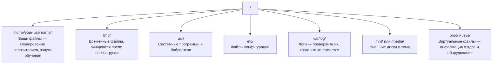

# Linux для AI

> Большинство AI-систем работают на Linux. Вам нужно знать достаточно, чтобы не застрять.

**Тип:** Обучение  
**Языки:** --  
**Предварительные требования:** Фаза 0, Урок 01  
**Время:** ~30 минут

## Цели обучения

- Навигировать по файловой системе Linux и выполнять базовые операции с файлами из командной строки
- Управлять правами доступа с помощью `chmod` и `chown`, чтобы исправлять ошибки вида «Permission denied»
- Устанавливать системные пакеты через `apt` и настраивать свежий GPU-сервер для работы с AI
- Понимать различия между macOS и Linux, которые чаще всего мешают разработчикам при работе на удалённых машинах

## Проблема

Вы разрабатываете на macOS или Windows. Но как только вы подключаетесь по SSH к облачному GPU-серверу, арендуете инстанс Lambda или запускаете EC2-машину — вы оказываетесь в Ubuntu. Терминал становится вашим единственным интерфейсом. Нет ни Finder, ни Explorer, ни GUI. Если вы не умеете перемещаться по файловой системе, устанавливать пакеты и управлять процессами из командной строки, вы будете просто сжигать GPU-часы, гугля «как распаковать zip-файл в Linux».

Это руководство по выживанию. Здесь только то, что действительно нужно для работы с удалённой Linux-машиной в AI. Ничего лишнего.

## Структура файловой системы

Linux организует всё под единым корнем `/`. Здесь нет `C:\` или `/Volumes`. Каталоги, с которыми вы действительно будете работать:



Ваш домашний каталог — это `~` или `/home/your-username`. Почти всё, что вы делаете, происходит здесь.

## Основные команды

Это 15 команд, которые покрывают 95% того, что вы будете делать на удалённом GPU-сервере.

### Навигация

```bash
pwd                         # Где я?
ls                          # Что здесь?
ls -la                      # Что здесь, включая скрытые файлы и подробности?
cd /path/to/dir             # Перейти туда
cd ~                        # Перейти домой
cd ..                       # Подняться на уровень выше
```

### Файлы и директории

```bash
mkdir my-project            # Создать директорию
mkdir -p a/b/c              # Создать вложенные директории одной командой

cp file.txt backup.txt      # Скопировать файл
cp -r src/ src-backup/      # Скопировать директорию (рекурсивно)

mv old.txt new.txt          # Переименовать файл
mv file.txt /tmp/           # Переместить файл

rm file.txt                 # Удалить файл (без корзины — навсегда)
rm -rf my-dir/              # Удалить директорию и всё внутри
```

`rm -rf` удаляет безвозвратно. Отмены нет. Перед нажатием Enter дважды проверьте путь.

### Чтение файлов

```bash
cat file.txt                # Вывести весь файл
head -20 file.txt           # Первые 20 строк
tail -20 file.txt           # Последние 20 строк
tail -f log.txt             # Следить за логом в реальном времени (Ctrl+C для остановки)
less file.txt               # Просматривать файл с прокруткой (q для выхода)
```

### Поиск

```bash
grep "error" training.log           # Найти строки с "error"
grep -r "learning_rate" .           # Искать во всех файлах текущей директории
grep -i "cuda" config.yaml          # Поиск без учёта регистра

find . -name "*.py"                 # Найти все Python-файлы
find . -name "*.ckpt" -size +1G     # Найти checkpoint-файлы больше 1GB
```

## Права доступа

У каждого файла в Linux есть владелец и биты прав доступа. Вы столкнётесь с этим, когда скрипт не запускается или вы не можете записать файл в директорию.

```bash
ls -l train.py
# -rwxr-xr-- 1 user group 2048 Mar 19 10:00 train.py
#  ^^^             права владельца: чтение, запись, выполнение
#     ^^^          права группы: чтение, выполнение
#        ^^        остальные: только чтение
```

Частые исправления:

```bash
chmod +x train.sh           # Сделать скрипт исполняемым
chmod 755 deploy.sh         # Владелец: полный доступ, остальные: чтение + выполнение
chmod 644 config.yaml       # Владелец: чтение + запись, остальные: только чтение

chown user:group file.txt   # Изменить владельца файла (нужен sudo)
```

Если вы видите «Permission denied», почти всегда проблема в правах доступа. В большинстве случаев помогут `chmod +x` или `sudo`.

## Управление пакетами (apt)

Ubuntu использует `apt`. Через него устанавливается системное ПО.

```bash
sudo apt update             # Обновить список пакетов (всегда делайте это сначала)
sudo apt install -y htop    # Установить пакет (-y пропускает подтверждение)
sudo apt install -y build-essential  # C-компилятор, make и т.д. Нужны многим Python-пакетам
sudo apt install -y tmux    # Терминальный мультиплексор (сохраняет сессии после отключения)

apt list --installed        # Что установлено?
sudo apt remove htop        # Удалить пакет
```

Часто используемые пакеты для свежего GPU-сервера:

```bash
sudo apt update && sudo apt install -y \
    build-essential \
    git \
    curl \
    wget \
    tmux \
    htop \
    unzip \
    python3-venv
```

## Пользователи и sudo

Обычно вы работаете как обычный пользователь. Некоторые операции требуют root-доступа.

```bash
whoami                      # Кто я?
sudo command                # Выполнить одну команду от root
sudo su                     # Стать root-пользователем (exit для возврата, используйте осторожно)
```

На облачных GPU-инстансах вы чаще всего единственный пользователь и уже имеете доступ к sudo. Не запускайте всё от root. Используйте sudo только при необходимости.

## Процессы и systemd

Когда обучение зависло или нужно проверить, что сейчас работает:

```bash
htop                        # Интерактивный просмотр процессов (q для выхода)
ps aux | grep python        # Найти работающие Python-процессы
kill 12345                  # Аккуратно остановить процесс с PID 12345
kill -9 12345               # Принудительно завершить процесс (если обычное завершение не сработало)
nvidia-smi                  # Процессы GPU и использование памяти
```

systemd управляет сервисами (фоновыми демонами). Вы будете использовать его, если запускаете inference-серверы:

```bash
sudo systemctl start nginx          # Запустить сервис
sudo systemctl stop nginx           # Остановить сервис
sudo systemctl restart nginx        # Перезапустить сервис
sudo systemctl status nginx         # Проверить статус
sudo systemctl enable nginx         # Автозапуск при загрузке
```

## Дисковое пространство

GPU-серверы часто имеют ограниченный объём диска. Модели и датасеты быстро его заполняют.

```bash
df -h                       # Использование диска для всех подключённых устройств
df -h /home                 # Использование диска для /home

du -sh *                    # Размер каждого объекта в текущей директории
du -sh ~/.cache             # Размер кэша (сюда попадают pip и модели Hugging Face)
du -sh /data/checkpoints/   # Проверить размер checkpoint-файлов

# Найти самых крупных потребителей места
du -h --max-depth=1 / 2>/dev/null | sort -hr | head -20
```

Частые способы освободить место:

```bash
# Очистить кэш pip
pip cache purge

# Очистить кэш apt
sudo apt clean

# Удалить старые checkpoint-файлы
rm -rf checkpoints/epoch_01/ checkpoints/epoch_02/
```

## Сеть

Из командной строки вы будете скачивать модели, переносить файлы и обращаться к API.

```bash
# Скачать файлы
wget https://example.com/model.bin                   # Скачать файл
curl -O https://example.com/data.tar.gz              # То же самое через curl
curl -s https://api.example.com/health | python3 -m json.tool  # Запрос к API и красивый вывод JSON

# Передача файлов между машинами
scp model.bin user@remote:/data/                     # Копировать файл на удалённую машину
scp user@remote:/data/results.csv .                  # Копировать файл с удалённой машины
scp -r user@remote:/data/checkpoints/ ./local-dir/   # Копировать директорию

# Синхронизация директорий (быстрее scp для больших файлов, умеет продолжать после обрыва)
rsync -avz --progress ./data/ user@remote:/data/
rsync -avz --progress user@remote:/results/ ./results/
```

Для больших файлов используйте `rsync`, а не `scp`. Он передаёт только изменённые байты и умеет восстанавливаться после разрыва соединения.

## tmux: сохраняем сессии живыми

Если вы подключены по SSH к удалённому серверу, закрытие ноутбука завершит обучение. tmux предотвращает это.

```bash
tmux new -s train           # Создать новую сессию с именем "train"
# ... запустите обучение, затем:
# Ctrl+B, затем D           # Отсоединиться (обучение продолжит работать)

tmux ls                     # Список сессий
tmux attach -t train        # Подключиться обратно

# Внутри tmux:
# Ctrl+B, затем %           # Разделить окно вертикально
# Ctrl+B, затем "           # Разделить окно горизонтально
# Ctrl+B, затем стрелки     # Переключаться между окнами
```

Всегда запускайте длительное обучение внутри tmux. Всегда.

## WSL2 для пользователей Windows

Если вы используете Windows, WSL2 даёт вам полноценную Linux-среду без dual boot.

```bash
# В PowerShell (от имени администратора)
wsl --install -d Ubuntu-24.04

# После перезагрузки откройте Ubuntu из меню Start
sudo apt update && sudo apt upgrade -y
```

WSL2 запускает настоящее Linux-ядро. Всё из этого урока работает внутри него. Ваши Windows-файлы доступны по пути `/mnt/c/Users/YourName/` из WSL.

GPU passthrough работает с установленными NVIDIA-драйверами на стороне Windows. Установите Windows-драйвер NVIDIA (а не Linux-версию), и CUDA будет доступна внутри WSL2.

## Подводные камни: macOS → Linux

Что чаще всего вызывает проблемы у пользователей macOS:

| macOS | Linux | Комментарий |
|-------|-------|-------|
| `brew install` | `sudo apt install` | Названия пакетов иногда отличаются. `brew install htop` и `sudo apt install htop` работают одинаково, а вот `brew install readline` и `sudo apt install libreadline-dev` — нет. |
| `open file.txt` | `xdg-open file.txt` | Но на удалённом сервере GUI не будет. Используйте `cat` или `less`. |
| `pbcopy` / `pbpaste` | Нет аналога | Буфер обмена через пайпы не работает по SSH. |
| `~/.zshrc` | `~/.bashrc` | В macOS по умолчанию zsh. Большинство Linux-серверов используют bash. |
| `/opt/homebrew/` | `/usr/bin/`, `/usr/local/bin/` | Бинарники лежат в других местах. |
| `sed -i '' 's/a/b/' file` | `sed -i 's/a/b/' file` | В macOS sed требует пустую строку после `-i`, Linux — нет. |
| Файловая система без учёта регистра | Файловая система с учётом регистра | `Model.py` и `model.py` — два разных файла в Linux. |
| Концы строк `\n` | Концы строк `\n` | Здесь одинаково. Но Windows использует `\r\n`, что ломает bash-скрипты. Используйте `dos2unix`. |

## Краткая шпаргалка

```
Навигация:     pwd, ls, cd, find
Файлы:         cp, mv, rm, mkdir, cat, head, tail, less
Поиск:         grep, find
Права:         chmod, chown, sudo
Пакеты:        apt update, apt install
Процессы:      htop, ps, kill, nvidia-smi
Сервисы:       systemctl start/stop/restart/status
Диск:          df -h, du -sh
Сеть:          curl, wget, scp, rsync
Сессии:        tmux new/attach/detach
```

## Упражнения

1. Подключитесь к любой Linux-машине по SSH (или откройте WSL2), перейдите в домашнюю директорию. Создайте папку проекта, создайте внутри три пустых файла через `touch`, затем выведите их с помощью `ls -la`.
2. Установите `htop` через apt, запустите его и найдите процесс, который использует больше всего памяти.
3. Создайте tmux-сессию, выполните внутри `sleep 300`, отсоединитесь, выведите список сессий и подключитесь обратно.
4. Используйте `df -h` для проверки свободного места на диске, затем `du -sh ~/.cache/*`, чтобы найти, что занимает место в кэше.
5. Передайте файл с локальной машины на удалённую через `scp`, затем выполните ту же передачу через `rsync` и сравните опыт использования.
