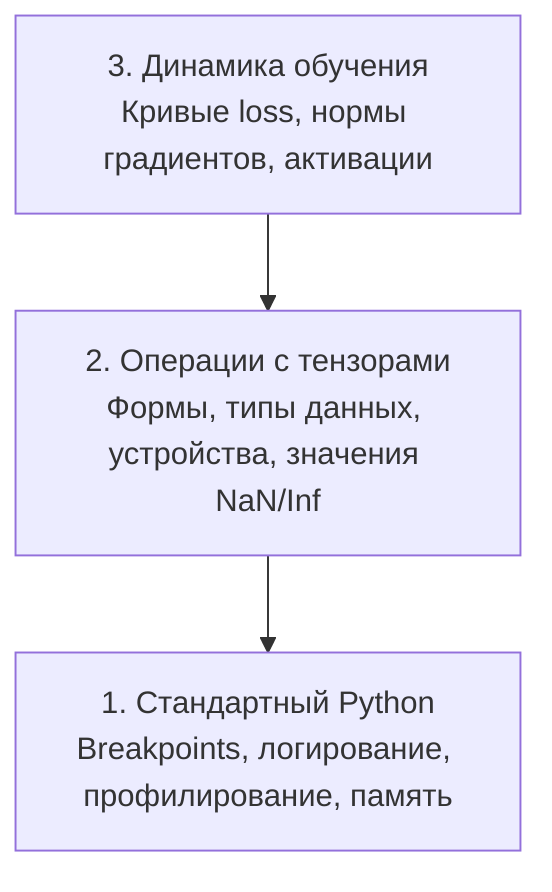

# Отладка и профилирование

> Худшие баги в AI не приводят к падению программы. Они молча обучаются на мусоре и показывают красивую кривую loss.

**Тип:** Build
**Язык:** Python
**Требования:** Урок 1 (Dev Environment), базовое знакомство с PyTorch
**Время:** ~60 минут

## Цели обучения

- Использовать условный `breakpoint()` и `debug_print` для проверки форм тензоров, типов данных и значений NaN во время обучения
- Профилировать циклы обучения с помощью `cProfile`, `line_profiler` и `tracemalloc` для поиска узких мест
- Находить распространённые AI-баги: несовпадение форм, NaN в loss, утечку данных и тензоры на неправильном устройстве
- Настроить TensorBoard для визуализации кривых loss, гистограмм весов и распределений градиентов

## Проблема

AI-код ломается не так, как обычный код. Веб-приложение падает со stack trace. Неправильно настроенный training loop работает 8 часов, сжигает $200 GPU-времени и выдаёт модель, которая предсказывает среднее значение для любого входа. Код ни разу не упал. Багом оказался тензор на неправильном устройстве, забытый `.detach()` или утечка меток в признаки.

Вам нужны инструменты отладки, которые ловят такие «тихие» ошибки до того, как они потратят ваше время и вычислительные ресурсы.

## Концепция

Отладка AI работает на трёх уровнях:



Большинство людей сразу прыгают на уровень 3 (смотрят в TensorBoard). Но 80% AI-багов живут на уровнях 1 и 2.

## Build It

### Часть 1: Отладка через print (да, это работает)

Многие пренебрежительно относятся к print-отладке. Зря. Для тензорного кода точечный print полезнее пошагового дебаггера, потому что вам нужно сразу видеть формы, типы данных и диапазоны значений.

```python
def debug_print(name, tensor):
    print(f"{name}: shape={tensor.shape}, dtype={tensor.dtype}, "
          f"device={tensor.device}, "
          f"min={tensor.min().item():.4f}, max={tensor.max().item():.4f}, "
          f"mean={tensor.mean().item():.4f}, "
          f"has_nan={tensor.isnan().any().item()}")
```

Вызывайте это после каждой подозрительной операции. Когда найдёте баг — удалите print. Всё просто.

### Часть 2: Python Debugger (pdb и breakpoint)

Встроенный дебаггер недооценён в AI-разработке. Вставьте `breakpoint()` в training loop и интерактивно исследуйте тензоры.

```python
def training_step(model, batch, criterion, optimizer):
    inputs, labels = batch
    outputs = model(inputs)
    loss = criterion(outputs, labels)

    if loss.item() > 100 or torch.isnan(loss):
        breakpoint()

    loss.backward()
    optimizer.step()
```

Когда выполнение остановится в дебаггере, полезны такие команды:

- `p outputs.shape` — проверить формы
- `p loss.item()` — посмотреть значение loss
- `p torch.isnan(outputs).sum()` — посчитать количество NaN
- `p model.fc1.weight.grad` — проверить градиенты
- `c` — продолжить, `q` — выйти

Это условная отладка. Вы останавливаетесь только тогда, когда что-то выглядит неправильно. Для training run на 10 000 шагов это важно.

### Часть 3: Логирование в Python

Заменяйте print на логирование, когда отладка выходит за рамки быстрой проверки.

```python
import logging

logging.basicConfig(
    level=logging.INFO,
    format="%(asctime)s [%(levelname)s] %(message)s",
    handlers=[
        logging.FileHandler("training.log"),
        logging.StreamHandler()
    ]
)
logger = logging.getLogger(__name__)

logger.info("Starting training: lr=%.4f, batch_size=%d", lr, batch_size)
logger.warning("Loss spike detected: %.4f at step %d", loss.item(), step)
logger.error("NaN loss at step %d, stopping", step)
```

Логирование даёт временные метки, уровни важности и запись в файл. Когда training run падает в 3 часа ночи, вам нужен log-файл, а не вывод в терминале, который давно прокрутился за пределы экрана.

### Часть 4: Измерение времени отдельных участков кода

Понимание того, куда уходит время, — первый шаг к оптимизации.

```python
import time

class Timer:
    def __init__(self, name=""):
        self.name = name

    def __enter__(self):
        self.start = time.perf_counter()
        return self

    def __exit__(self, *args):
        elapsed = time.perf_counter() - self.start
        print(f"[{self.name}] {elapsed:.4f}s")

with Timer("data loading"):
    batch = next(dataloader_iter)

with Timer("forward pass"):
    outputs = model(batch)

with Timer("backward pass"):
    loss.backward()
```

Типичная находка: загрузка данных занимает 60% времени обучения. Решение — `num_workers > 0` в DataLoader, а не более быстрая GPU.

### Часть 5: cProfile и line_profiler

Когда ручных таймеров недостаточно:

```bash
python -m cProfile -s cumtime train.py
```

Эта команда показывает все вызовы функций, отсортированные по суммарному времени выполнения. Для построчного профилирования:

```bash
pip install line_profiler
```

```python
@profile
def train_step(model, data, target):
    output = model(data)
    loss = F.cross_entropy(output, target)
    loss.backward()
    return loss

# Run with: kernprof -l -v train.py
```

### Часть 6: Профилирование памяти

#### CPU-память с помощью tracemalloc

```python
import tracemalloc

tracemalloc.start()

# your code here
model = build_model()
data = load_dataset()

snapshot = tracemalloc.take_snapshot()
top_stats = snapshot.statistics("lineno")
for stat in top_stats[:10]:
    print(stat)
```

#### CPU-память с помощью memory_profiler

```bash
pip install memory_profiler
```

```python
from memory_profiler import profile

@profile
def load_data():
    raw = read_csv("data.csv")       # watch memory jump here
    processed = preprocess(raw)       # and here
    return processed
```

Запустите `python -m memory_profiler your_script.py`, чтобы увидеть построчное потребление памяти.

#### GPU-память с помощью PyTorch

```python
import torch

if torch.cuda.is_available():
    print(torch.cuda.memory_summary())

    print(f"Allocated: {torch.cuda.memory_allocated() / 1e9:.2f} GB")
    print(f"Cached: {torch.cuda.memory_reserved() / 1e9:.2f} GB")
```

Когда вы сталкиваетесь с OOM (Out of Memory):

1. Уменьшите batch size (это всегда первое, что стоит попробовать)
2. Используйте `torch.cuda.empty_cache()`, чтобы освободить кэшированную память
3. Используйте `del tensor`, а затем `torch.cuda.empty_cache()` для больших промежуточных тензоров
4. Используйте mixed precision (`torch.cuda.amp`), чтобы примерно вдвое снизить потребление памяти
5. Используйте gradient checkpointing для очень глубоких моделей

### Часть 7: Распространённые AI-баги и как их ловить

#### Несовпадение форм

Самый частый баг. У тензора форма `[batch, features]`, а модель ожидает `[batch, channels, height, width]`.

```python
def check_shapes(model, sample_input):
    print(f"Input: {sample_input.shape}")
    hooks = []

    def make_hook(name):
        def hook(module, inp, out):
            in_shape = inp[0].shape if isinstance(inp, tuple) else inp.shape
            out_shape = out.shape if hasattr(out, "shape") else type(out)
            print(f"  {name}: {in_shape} -> {out_shape}")
        return hook

    for name, module in model.named_modules():
        hooks.append(module.register_forward_hook(make_hook(name)))

    with torch.no_grad():
        model(sample_input)

    for h in hooks:
        h.remove()
```

Запустите это один раз на sample batch. Так вы получите карту всех преобразований форм внутри модели.

#### NaN в loss

NaN в loss означает, что что-то «взорвалось». Частые причины:

- Слишком высокий learning rate
- Деление на ноль в кастомной loss-функции
- Логарифм нуля или отрицательного числа
- Взрывающиеся градиенты в RNN

```python
def detect_nan(model, loss, step):
    if torch.isnan(loss):
        print(f"NaN loss at step {step}")
        for name, param in model.named_parameters():
            if param.grad is not None:
                if torch.isnan(param.grad).any():
                    print(f"  NaN gradient in {name}")
                if torch.isinf(param.grad).any():
                    print(f"  Inf gradient in {name}")
        return True
    return False
```

#### Утечка данных

Модель показывает 99% accuracy на test set. Звучит отлично. На самом деле это баг.

```python
def check_data_leakage(train_set, test_set, id_column="id"):
    train_ids = set(train_set[id_column].tolist())
    test_ids = set(test_set[id_column].tolist())
    overlap = train_ids & test_ids
    if overlap:
        print(f"DATA LEAKAGE: {len(overlap)} samples in both train and test")
        return True
    return False
```

Также проверяйте temporal leakage: использование будущих данных для предсказания прошлого. Перед разделением данных сортируйте их по timestamp.

#### Неправильное устройство

Тензоры на разных устройствах (CPU и GPU) вызывают runtime errors. Но иногда тензор молча остаётся на CPU, пока всё остальное находится на GPU, и обучение просто идёт медленно.

```python
def check_devices(model, *tensors):
    model_device = next(model.parameters()).device
    print(f"Model device: {model_device}")
    for i, t in enumerate(tensors):
        if t.device != model_device:
            print(f"  WARNING: tensor {i} on {t.device}, model on {model_device}")
```

### Часть 8: Основы TensorBoard

TensorBoard показывает, что происходит внутри обучения во времени.

```bash
pip install tensorboard
```

```python
from torch.utils.tensorboard import SummaryWriter

writer = SummaryWriter("runs/experiment_1")

for step in range(num_steps):
    loss = train_step(model, batch)

    writer.add_scalar("loss/train", loss.item(), step)
    writer.add_scalar("lr", optimizer.param_groups[0]["lr"], step)

    if step % 100 == 0:
        for name, param in model.named_parameters():
            writer.add_histogram(f"weights/{name}", param, step)
            if param.grad is not None:
                writer.add_histogram(f"grads/{name}", param.grad, step)

writer.close()
```

Запустите TensorBoard:

```bash
tensorboard --logdir=runs
```

На что смотреть:

- **Loss не уменьшается**: learning rate слишком низкий или проблема в архитектуре модели
- **Loss сильно осциллирует**: learning rate слишком высокий
- **Loss становится NaN**: численная нестабильность (см. раздел про NaN выше)
- **Train loss уменьшается, val loss растёт**: переобучение
- **Гистограммы весов схлопываются к нулю**: затухающие градиенты
- **Гистограммы градиентов взрываются**: нужен gradient clipping

### Часть 9: Дебаггер VS Code

Для интерактивной отладки настройте VS Code с помощью `launch.json`:

```json
{
    "version": "0.2.0",
    "configurations": [
        {
            "name": "Debug Training",
            "type": "debugpy",
            "request": "launch",
            "program": "${file}",
            "console": "integratedTerminal",
            "justMyCode": false
        }
    ]
}
```

Ставьте breakpoints, кликая по gutter. Используйте панель Variables для проверки свойств тензоров. Debug Console позволяет выполнять произвольные Python-выражения во время выполнения программы.

Это полезно для пошаговой проверки data preprocessing pipelines, когда нужно видеть каждое преобразование.

## Use It

Вот рабочий процесс отладки, который ловит большинство AI-багов:

1. **Перед обучением**: запустите `check_shapes` на sample batch. Проверьте, что входные и выходные размерности соответствуют ожиданиям.
2. **Первые 10 шагов**: используйте `debug_print` для loss, outputs и gradients. Убедитесь, что нигде нет NaN и значения находятся в разумных диапазонах.
3. **Во время обучения**: логируйте loss, learning rate и нормы градиентов. Используйте TensorBoard для визуализации.
4. **Когда что-то ломается**: поставьте `breakpoint()` в точке сбоя. Интерактивно исследуйте тензоры.
5. **Для производительности**: измеряйте время data loading, forward pass и backward pass. Профилируйте память, если приближаетесь к OOM.

## Ship It

Запустите скрипт с набором инструментов для отладки:

```bash
python phases/00-setup-and-tooling/12-debugging-and-profiling/code/debug_tools.py
```

См. `outputs/prompt-debug-ai-code.md` — там находится prompt, который помогает диагностировать AI-специфичные баги.

## Упражнения

1. Запустите `debug_tools.py` и изучите вывод каждого раздела. Измените dummy model так, чтобы создать NaN (подсказка: разделите на ноль в forward pass), и посмотрите, как detector это поймает.
2. Профилируйте training loop с помощью `cProfile` и найдите самую медленную функцию.
3. Используйте `tracemalloc`, чтобы найти строку в вашем data loading pipeline, которая выделяет больше всего памяти.
4. Настройте TensorBoard для простого training run и определите, переобучается ли модель.
5. Используйте `breakpoint()` внутри training loop. Потренируйтесь проверять формы тензоров, устройства и значения градиентов из prompt дебаггера.
