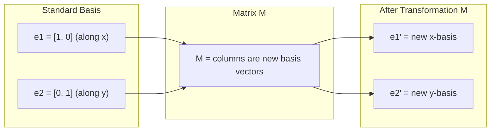
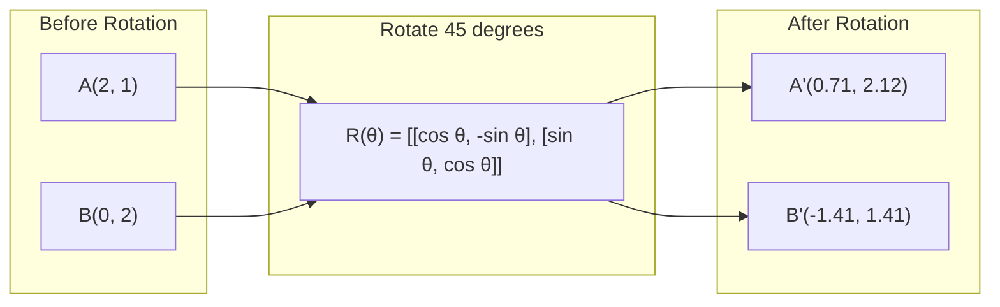
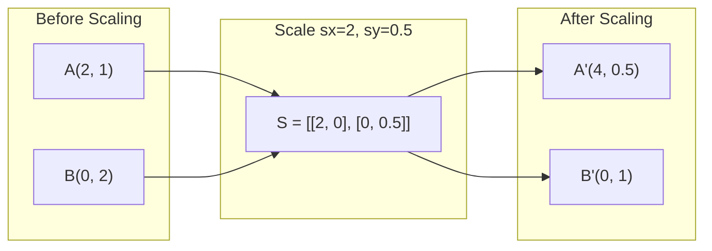
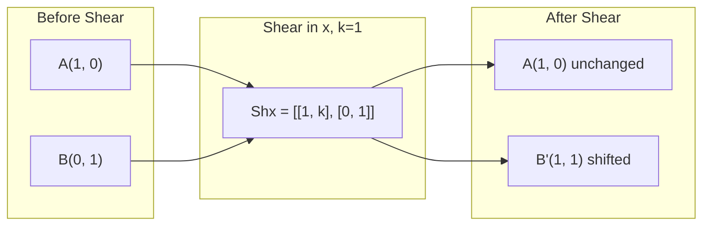
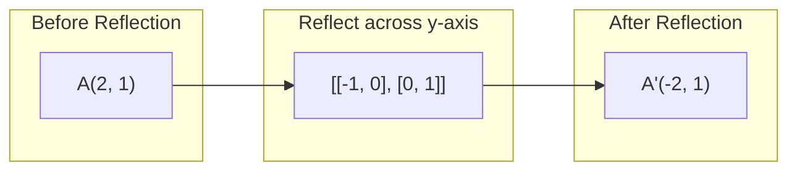
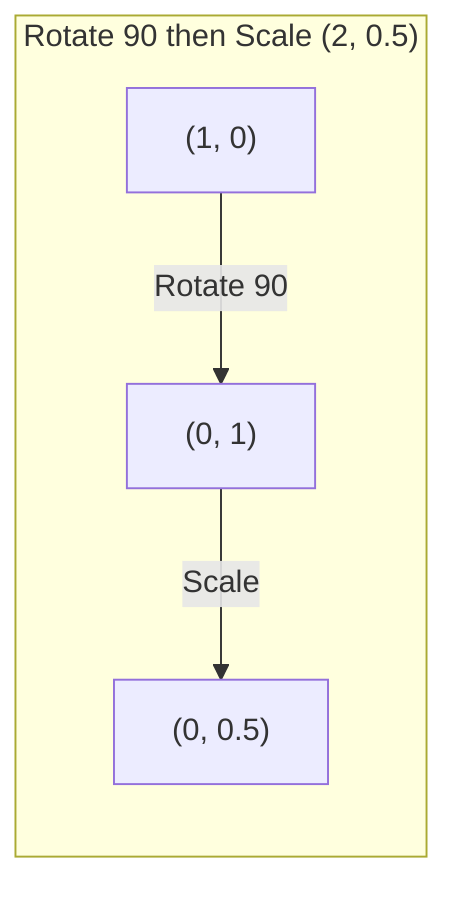
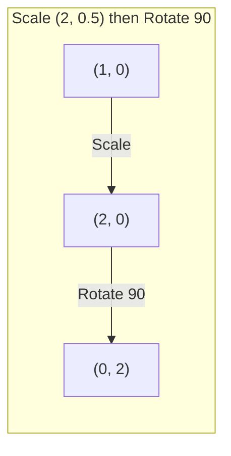

# Матричные преобразования

> Матрица — это машина, которая изменяет форму пространства. Поймите, что она делает с каждой точкой, и вы поймете все преобразование.

**Тип:** Сборка
**Языки:** Python, Julia
**Предварительные требования:** Phase 1, Lessons 01-02 (Linear Algebra Intuition, Vectors & Matrices Operations)
**Время:** ~75 минут

## Цели обучения

- Строить матрицы поворота, масштабирования, сдвига и отражения и применять их к 2D- и 3D-точкам
- Составлять несколько преобразований через умножение матриц и проверять, что порядок важен
- Вычислять собственные значения и собственные векторы матриц 2x2 из характеристического уравнения
- Объяснять, почему собственные значения определяют направления PCA, стабильность RNN и поведение спектральной кластеризации

## Проблема

Вы читаете про PCA и видите: "найдите собственные векторы ковариационной матрицы." Вы читаете про стабильность модели и видите: "проверьте, что все собственные значения имеют модуль меньше 1." Вы читаете про аугментацию данных и видите: "примените случайный поворот." Все это не имеет смысла, пока вы не поймете, что матрицы делают с пространством геометрически.

Матрицы — это не просто таблицы чисел. Это пространственные машины. Матрица поворота вращает точки. Матрица масштабирования растягивает их. Матрица сдвига наклоняет их. Каждое преобразование, которое нейросеть применяет к данным, является одной из этих операций или их композицией. Этот урок делает такие операции конкретными.

## Концепция

### Преобразования как матрицы

Каждое линейное преобразование в 2D можно записать как матрицу 2x2. Матрица точно показывает, куда переходят базисные векторы [1, 0] и [0, 1]. Все остальное следует из этого.



### Поворот

2D-поворот на угол theta сохраняет расстояния и углы. Он перемещает каждую точку по дуге окружности.



В 3D вы поворачиваете вокруг оси. У каждой оси есть своя матрица поворота:

```
Rz(theta) = | cos  -sin  0 |     Rotate around z-axis
            | sin   cos  0 |     (x-y plane spins, z stays)
            |  0     0   1 |

Rx(theta) = | 1   0     0    |   Rotate around x-axis
            | 0  cos  -sin   |   (y-z plane spins, x stays)
            | 0  sin   cos   |

Ry(theta) = |  cos  0  sin |     Rotate around y-axis
            |   0   1   0  |     (x-z plane spins, y stays)
            | -sin  0  cos |
```

### Масштабирование

Масштабирование растягивает или сжимает вдоль каждой оси независимо.



### Сдвиг

Сдвиг наклоняет одну ось, оставляя другую фиксированной. Он превращает прямоугольники в параллелограммы.



Матрицы сдвига:
- `Shx = [[1, k], [0, 1]]` сдвигает x на k * y
- `Shy = [[1, 0], [k, 1]]` сдвигает y на k * x

### Отражение

Отражение зеркально отображает точки относительно оси или прямой.



Матрицы отражения:
- Отражение относительно оси y: `[[-1, 0], [0, 1]]`
- Отражение относительно оси x: `[[1, 0], [0, -1]]`

### Композиция: цепочка преобразований

Применить преобразование A, а затем B — то же самое, что умножить их матрицы: `result = B @ A @ point`. Порядок важен. Сначала повернуть, затем масштабировать дает другой результат, чем сначала масштабировать, затем повернуть.



Композиция: `S @ R = [[0, -2], [0.5, 0]]`



Композиция: `R @ S = [[0, -0.5], [2, 0]]`

Результаты разные. Умножение матриц не коммутативно.

### Собственные значения и собственные векторы

Большинство векторов меняют направление, когда на них действует матрица. Собственные векторы особенные: матрица только масштабирует их и никогда не поворачивает. Коэффициент масштабирования — это собственное значение.

```
A @ v = lambda * v

v is the eigenvector (direction that survives)
lambda is the eigenvalue (how much it stretches)

Example: A = | 2  1 |
             | 1  2 |

Eigenvector [1, 1] with eigenvalue 3:
  A @ [1,1] = [3, 3] = 3 * [1, 1]     (same direction, scaled by 3)

Eigenvector [1, -1] with eigenvalue 1:
  A @ [1,-1] = [1, -1] = 1 * [1, -1]  (same direction, unchanged)
```

Матрица растягивает пространство в 3 раза вдоль [1, 1] и оставляет [1, -1] неизменным. Любое другое направление — это смесь этих двух.

### Собственное разложение

Если у матрицы есть n линейно независимых собственных векторов, ее можно разложить:

```
A = V @ D @ V^(-1)

V = matrix whose columns are eigenvectors
D = diagonal matrix of eigenvalues
V^(-1) = inverse of V

This says: rotate into eigenvector coordinates, scale along each axis, rotate back.
```

### Почему собственные значения важны

**PCA.** Собственные векторы ковариационной матрицы — это главные компоненты. Собственные значения показывают, сколько дисперсии захватывает каждая компонента. Отсортируйте по собственному значению, оставьте верхние k, и вы получите снижение размерности.

**Устойчивость.** В рекуррентных сетях и динамических системах собственные значения с модулем > 1 заставляют выходы взрываться. Модуль < 1 заставляет их исчезать. Это проблема vanishing/exploding gradient, сформулированная в одном предложении.

**Спектральные методы.** Графовые нейросети используют собственные значения матрицы смежности. Спектральная кластеризация использует собственные значения лапласиана. Собственные векторы раскрывают структуру графа.

### Детерминант как коэффициент масштабирования объема

Детерминант матрицы преобразования показывает, во сколько раз она масштабирует площадь (2D) или объем (3D).

```
det = 1:   area preserved (rotation)
det = 2:   area doubled
det = 0:   space crushed to lower dimension (singular)
det = -1:  area preserved but orientation flipped (reflection)

| det(Rotation) | = 1        (always)
| det(Scale sx, sy) | = sx * sy
| det(Shear) | = 1           (area preserved)
| det(Reflection) | = -1     (orientation flipped)
```

## Соберите это

### Шаг 1: Матрицы преобразований с нуля (Python)

```python
import math

def rotation_2d(theta):
    c, s = math.cos(theta), math.sin(theta)
    return [[c, -s], [s, c]]

def scaling_2d(sx, sy):
    return [[sx, 0], [0, sy]]

def shearing_2d(kx, ky):
    return [[1, kx], [ky, 1]]

def reflection_x():
    return [[1, 0], [0, -1]]

def reflection_y():
    return [[-1, 0], [0, 1]]

def mat_vec_mul(matrix, vector):
    return [
        sum(matrix[i][j] * vector[j] for j in range(len(vector)))
        for i in range(len(matrix))
    ]

def mat_mul(a, b):
    rows_a, cols_b = len(a), len(b[0])
    cols_a = len(a[0])
    return [
        [sum(a[i][k] * b[k][j] for k in range(cols_a)) for j in range(cols_b)]
        for i in range(rows_a)
    ]

point = [1.0, 0.0]
angle = math.pi / 4

rotated = mat_vec_mul(rotation_2d(angle), point)
print(f"Rotate (1,0) by 45 deg: ({rotated[0]:.4f}, {rotated[1]:.4f})")

scaled = mat_vec_mul(scaling_2d(2, 3), [1.0, 1.0])
print(f"Scale (1,1) by (2,3): ({scaled[0]:.1f}, {scaled[1]:.1f})")

sheared = mat_vec_mul(shearing_2d(1, 0), [1.0, 1.0])
print(f"Shear (1,1) kx=1: ({sheared[0]:.1f}, {sheared[1]:.1f})")

reflected = mat_vec_mul(reflection_y(), [2.0, 1.0])
print(f"Reflect (2,1) across y: ({reflected[0]:.1f}, {reflected[1]:.1f})")
```

### Шаг 2: Композиция преобразований

```python
R = rotation_2d(math.pi / 2)
S = scaling_2d(2, 0.5)

rotate_then_scale = mat_mul(S, R)
scale_then_rotate = mat_mul(R, S)

point = [1.0, 0.0]
result1 = mat_vec_mul(rotate_then_scale, point)
result2 = mat_vec_mul(scale_then_rotate, point)

print(f"Rotate 90 then scale: ({result1[0]:.2f}, {result1[1]:.2f})")
print(f"Scale then rotate 90: ({result2[0]:.2f}, {result2[1]:.2f})")
print(f"Same? {result1 == result2}")
```

### Шаг 3: Собственные значения с нуля (2x2)

Для матрицы 2x2 `[[a, b], [c, d]]` собственные значения решают характеристическое уравнение: `lambda^2 - (a+d)*lambda + (ad - bc) = 0`.

```python
def eigenvalues_2x2(matrix):
    a, b = matrix[0]
    c, d = matrix[1]
    trace = a + d
    det = a * d - b * c
    discriminant = trace ** 2 - 4 * det
    if discriminant < 0:
        real = trace / 2
        imag = (-discriminant) ** 0.5 / 2
        return (complex(real, imag), complex(real, -imag))
    sqrt_disc = discriminant ** 0.5
    return ((trace + sqrt_disc) / 2, (trace - sqrt_disc) / 2)

def eigenvector_2x2(matrix, eigenvalue):
    a, b = matrix[0]
    c, d = matrix[1]
    if abs(b) > 1e-10:
        v = [b, eigenvalue - a]
    elif abs(c) > 1e-10:
        v = [eigenvalue - d, c]
    else:
        if abs(a - eigenvalue) < 1e-10:
            v = [1, 0]
        else:
            v = [0, 1]
    mag = (v[0] ** 2 + v[1] ** 2) ** 0.5
    return [v[0] / mag, v[1] / mag]

A = [[2, 1], [1, 2]]
vals = eigenvalues_2x2(A)
print(f"Matrix: {A}")
print(f"Eigenvalues: {vals[0]:.4f}, {vals[1]:.4f}")

for val in vals:
    vec = eigenvector_2x2(A, val)
    result = mat_vec_mul(A, vec)
    scaled = [val * vec[0], val * vec[1]]
    print(f"  lambda={val:.1f}, v={[round(x,4) for x in vec]}")
    print(f"    A@v = {[round(x,4) for x in result]}")
    print(f"    l*v = {[round(x,4) for x in scaled]}")
```

### Шаг 4: Детерминант как коэффициент масштабирования объема

```python
def det_2x2(matrix):
    return matrix[0][0] * matrix[1][1] - matrix[0][1] * matrix[1][0]

print(f"det(rotation 45) = {det_2x2(rotation_2d(math.pi/4)):.4f}")
print(f"det(scale 2,3)   = {det_2x2(scaling_2d(2, 3)):.1f}")
print(f"det(shear kx=1)  = {det_2x2(shearing_2d(1, 0)):.1f}")
print(f"det(reflect y)   = {det_2x2(reflection_y()):.1f}")

singular = [[1, 2], [2, 4]]
print(f"det(singular)     = {det_2x2(singular):.1f}")
print("Singular: columns are proportional, space collapses to a line.")
```

### Ожидаемый вывод

Запустите `code/transformations.py` — последние строки должны быть такими:

```
3D rotate (1,0,0) 90 deg around z: [0. 1. 0.]

Covariance matrix: [[2.0, 1.0], [1.0, 3.0]]
Principal components (eigenvectors): columns of
[[-0.85065081 -0.52573111]
 [ 0.52573111 -0.85065081]]
Variance along each (eigenvalues): [1.38196601 3.61803399]
PCA picks the eigenvectors with the largest eigenvalues.
```

## Используйте это

NumPy выполняет все это оптимизированными процедурами.

```python
import numpy as np

theta = np.pi / 4
R = np.array([[np.cos(theta), -np.sin(theta)],
              [np.sin(theta),  np.cos(theta)]])

point = np.array([1.0, 0.0])
print(f"Rotate (1,0) by 45 deg: {R @ point}")

S = np.diag([2.0, 3.0])
composed = S @ R
print(f"Scale(2,3) after Rotate(45): {composed @ point}")

A = np.array([[2, 1], [1, 2]], dtype=float)
eigenvalues, eigenvectors = np.linalg.eig(A)
print(f"\nEigenvalues: {eigenvalues}")
print(f"Eigenvectors (columns):\n{eigenvectors}")

for i in range(len(eigenvalues)):
    v = eigenvectors[:, i]
    lam = eigenvalues[i]
    print(f"  A @ v{i} = {A @ v}, lambda * v{i} = {lam * v}")

print(f"\ndet(R) = {np.linalg.det(R):.4f}")
print(f"det(S) = {np.linalg.det(S):.1f}")

B = np.array([[3, 1], [0, 2]], dtype=float)
vals, vecs = np.linalg.eig(B)
D = np.diag(vals)
V = vecs
reconstructed = V @ D @ np.linalg.inv(V)
print(f"\nEigendecomposition A = V @ D @ V^-1:")
print(f"Original:\n{B}")
print(f"Reconstructed:\n{reconstructed}")
```

### 3D-повороты с NumPy

```python
def rotation_3d_z(theta):
    c, s = np.cos(theta), np.sin(theta)
    return np.array([[c, -s, 0], [s, c, 0], [0, 0, 1]])

def rotation_3d_x(theta):
    c, s = np.cos(theta), np.sin(theta)
    return np.array([[1, 0, 0], [0, c, -s], [0, s, c]])

point_3d = np.array([1.0, 0.0, 0.0])
rotated_z = rotation_3d_z(np.pi / 2) @ point_3d
rotated_x = rotation_3d_x(np.pi / 2) @ point_3d

print(f"\n3D point: {point_3d}")
print(f"Rotate 90 around z: {np.round(rotated_z, 4)}")
print(f"Rotate 90 around x: {np.round(rotated_x, 4)}")
```

## Доведите до результата

Этот урок создает геометрическую основу для PCA (Phase 2) и анализа весов нейросетей. Код для собственных значений и собственных векторов, построенный здесь, — это тот же алгоритм, который лежит в основе снижения размерности, спектральной кластеризации и анализа стабильности в промышленных ML-системах.

## Упражнения

1. Примените поворот, масштабирование и сдвиг к единичному квадрату (вершины в [0,0], [1,0], [1,1], [0,1]). Выведите преобразованные вершины для каждого преобразования. Проверьте, что поворот сохраняет расстояния между вершинами.

2. Найдите собственные значения матрицы [[4, 2], [1, 3]] вручную с помощью характеристического уравнения. Затем проверьте результат своей функцией, написанной с нуля, и с NumPy.

3. Создайте композицию из трех преобразований (поворот на 30 градусов, масштабирование на [1.5, 0.8], сдвиг с kx=0.3) и примените ее к 8 точкам, расположенным на окружности. Выведите координаты до и после. Вычислите детерминант составной матрицы и проверьте, что он равен произведению детерминантов отдельных преобразований.

## Ключевые термины

| Термин | Как говорят | Что это на самом деле означает |
|------|----------------|----------------------|
| Матрица поворота | "Вращает объекты" | Ортогональная матрица, которая перемещает точки по дугам окружностей, сохраняя расстояния и углы. Детерминант всегда равен 1. |
| Матрица масштабирования | "Делает объекты больше" | Диагональная матрица, которая независимо растягивает или сжимает вдоль каждой оси. Детерминант равен произведению коэффициентов масштаба. |
| Матрица сдвига | "Наклоняет объекты" | Матрица, которая сдвигает одну координату пропорционально другой, превращая прямоугольники в параллелограммы. Детерминант равен 1. |
| Отражение | "Зеркалит объекты" | Матрица, которая переворачивает пространство относительно оси или плоскости. Детерминант равен -1. |
| Композиция | "Сделать две вещи" | Умножение матриц преобразований для построения цепочки операций. Порядок важен: B @ A означает сначала применить A, затем B. |
| Собственный вектор | "Особое направление" | Направление, которое матрица только масштабирует и никогда не поворачивает. Отпечаток преобразования. |
| Собственное значение | "Насколько сильно растягивает" | Скалярный коэффициент, на который матрица масштабирует свой собственный вектор. Может быть отрицательным (переворот) или комплексным (поворот). |
| Собственное разложение | "Разобрать матрицу на части" | Запись матрицы как V @ D @ V^(-1), разделяющая ее на фундаментальные направления масштабирования и величины. |
| Детерминант | "Одно число из матрицы" | Коэффициент, на который преобразование масштабирует площадь (2D) или объем (3D). Ноль означает, что преобразование необратимо. |
| Характеристическое уравнение | "Откуда берутся собственные значения" | det(A - lambda * I) = 0. Полином, корни которого являются собственными значениями. |

## Дополнительное чтение

- [3Blue1Brown: Linear Transformations](https://www.3blue1brown.com/lessons/linear-transformations) -- визуальная интуиция того, как матрицы изменяют форму пространства
- [3Blue1Brown: Eigenvectors and Eigenvalues](https://www.3blue1brown.com/lessons/eigenvalues) -- лучшее визуальное объяснение того, что собственные векторы означают геометрически
- [MIT 18.06 Lecture 21: Eigenvalues and Eigenvectors](https://ocw.mit.edu/courses/18-06-linear-algebra-spring-2010/) -- классическое изложение Гилберта Стрэнга
