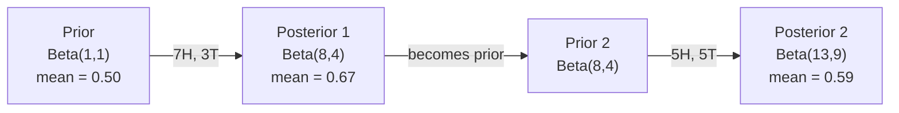

# Теорема Байеса

> Вероятность говорит о том, чего вы ожидаете. Теорема Байеса говорит о том, чему вы научились.

**Тип:** Практика
**Язык:** Python
**Пререквизиты:** Фаза 1, урок 06 (Основы вероятности)
**Время:** ~75 минут

## Цели обучения

- Применять теорему Байеса для вычисления апостериорных вероятностей по априорным вероятностям, likelihood и evidence
- Построить текстовый классификатор Naive Bayes с нуля, используя Laplace smoothing и вычисления в log-space
- Сравнить оценки MLE и MAP и объяснить, как MAP соответствует L2-регуляризации
- Реализовать последовательное байесовское обновление с помощью Beta-Binomial сопряженных априорных распределений для A/B-тестирования

## Проблема

Медицинский тест точен на 99%. Ваш результат положительный. Какова вероятность, что болезнь у вас действительно есть?

Большинство людей отвечает: 99%. Реальный ответ зависит от того, насколько болезнь редкая. Если она есть у 1 человека из 10 000, положительный результат дает всего около 1% вероятности быть больным. Остальные 99% положительных результатов - ложные тревоги у здоровых людей.

Это не вопрос с подвохом. Это теорема Байеса. Каждый спам-фильтр, каждая медицинская диагностика, каждая ML-модель, которая оценивает неопределенность, использует ровно это рассуждение. Вы начинаете с убеждения. Видите evidence. Обновляете убеждение.

Если строить ML-системы без понимания этого принципа, вы будете неверно интерпретировать выходы моделей, выбирать плохие пороги и выпускать переуверенные предсказания.

## Концепция

### От совместной вероятности к Байесу

Из урока 06 вы уже знаете, что условная вероятность равна:

```
P(A|B) = P(A and B) / P(B)
```

И симметрично:

```
P(B|A) = P(A and B) / P(A)
```

У обоих выражений один и тот же числитель: P(A and B). Приравняйте их и преобразуйте:

```
P(A and B) = P(A|B) * P(B) = P(B|A) * P(A)

Therefore:

P(A|B) = P(B|A) * P(A) / P(B)
```

Это и есть теорема Байеса. Четыре величины, одно уравнение.

### Четыре части

| Часть | Название | Что это означает |
|------|------|---------------|
| P(A\|B) | Posterior | Ваше обновленное убеждение об A после наблюдения evidence B |
| P(B\|A) | Likelihood | Насколько вероятно evidence B, если A истинно |
| P(A) | Prior | Ваше убеждение об A до наблюдения evidence |
| P(B) | Evidence | Полная вероятность увидеть B при всех возможностях |

Член evidence P(B) работает как нормирующий множитель. Его можно раскрыть через закон полной вероятности:

```
P(B) = P(B|A) * P(A) + P(B|not A) * P(not A)
```

### Пример с медицинским тестом

Болезнь встречается у 1 человека из 10 000. Тест точен на 99%: он обнаруживает 99% больных и дает ложноположительный результат в 1% случаев.

```
P(sick)          = 0.0001     (prior: disease is rare)
P(positive|sick) = 0.99       (likelihood: test catches it)
P(positive|healthy) = 0.01    (false positive rate)

P(positive) = P(positive|sick) * P(sick) + P(positive|healthy) * P(healthy)
            = 0.99 * 0.0001 + 0.01 * 0.9999
            = 0.000099 + 0.009999
            = 0.010098

P(sick|positive) = P(positive|sick) * P(sick) / P(positive)
                 = 0.99 * 0.0001 / 0.010098
                 = 0.0098
                 = 0.98%
```

Меньше 1%. Prior доминирует. Когда состояние редкое, даже точные тесты в основном дают ложноположительные результаты. Именно поэтому врачи назначают подтверждающие тесты.

### Пример спам-фильтра

Вы получили письмо со словом "lottery". Это спам?

```
P(spam)                = 0.3      (30% of email is spam)
P("lottery"|spam)      = 0.05     (5% of spam emails contain "lottery")
P("lottery"|not spam)  = 0.001    (0.1% of legitimate emails contain "lottery")

P("lottery") = 0.05 * 0.3 + 0.001 * 0.7
             = 0.015 + 0.0007
             = 0.0157

P(spam|"lottery") = 0.05 * 0.3 / 0.0157
                  = 0.955
                  = 95.5%
```

Одно слово сдвигает вероятность с 30% до 95,5%. Настоящий спам-фильтр применяет Bayes сразу к сотням слов.

### Naive Bayes: предположение о независимости

Naive Bayes расширяет эту идею на множество признаков, предполагая, что все признаки условно независимы при заданном классе:

```
P(class | feature_1, feature_2, ..., feature_n)
  = P(class) * P(feature_1|class) * P(feature_2|class) * ... * P(feature_n|class)
    / P(feature_1, feature_2, ..., feature_n)
```

"Наивная" часть - это предположение о независимости. В тексте появления слов не независимы: "New" и "York" коррелируют. Но на практике предположение работает на удивление хорошо, потому что классификатору нужно только ранжировать классы, а не выдавать калиброванные вероятности.

Поскольку знаменатель одинаков для всех классов, его можно пропустить и сравнивать только числители:

```
score(class) = P(class) * product of P(feature_i | class)
```

Выберите класс с максимальным score.

### Maximum likelihood estimation (MLE)

Как получить P(feature|class) из обучающих данных? Посчитать.

```
P("free"|spam) = (number of spam emails containing "free") / (total spam emails)
```

Это MLE: выбрать значения параметров, при которых наблюдаемые данные наиболее вероятны. Вы максимизируете функцию likelihood, которая для дискретных счетчиков сводится к относительной частоте.

Проблема: если слово ни разу не встретилось в спаме во время обучения, MLE присвоит ему вероятность ноль. Одно невиданное слово обнуляет все произведение. Это исправляется Laplace smoothing:

```
P(word|class) = (count(word, class) + 1) / (total_words_in_class + vocabulary_size)
```

Добавление 1 к каждому счетчику гарантирует, что вероятность никогда не будет нулевой.

### Maximum a posteriori (MAP)

MLE спрашивает: какие параметры максимизируют P(data|parameters)?

MAP спрашивает: какие параметры максимизируют P(parameters|data)?

По теореме Байеса:

```
P(parameters|data) proportional to P(data|parameters) * P(parameters)
```

MAP добавляет prior на сами параметры. Если вы считаете, что параметры должны быть малыми, вы кодируете это как prior, который штрафует большие значения. Это идентично L2-регуляризации в ML. Штраф "ridge" в ridge regression буквально является гауссовским prior на веса.

| Оценивание | Оптимизирует | Эквивалент в ML |
|------------|-----------|---------------|
| MLE | P(data\|params) | Обучение без регуляризации |
| MAP | P(data\|params) * P(params) | L2 / L1-регуляризация |

### Байесовский и частотный подходы: практическая разница

Частотники рассматривают параметры как фиксированные неизвестные. Они спрашивают: "Что произошло бы, если повторить этот эксперимент много раз?"

Байесианцы рассматривают параметры как распределения. Они спрашивают: "Учитывая то, что я наблюдал, во что я верю относительно параметров?"

Для построения ML-систем практическая разница такая:

| Аспект | Частотный подход | Байесовский подход |
|--------|-------------|----------|
| Выход | Точечная оценка | Распределение по значениям |
| Неопределенность | Доверительные интервалы (о процедуре) | Credible intervals (о параметре) |
| Малые данные | Может переобучаться | Prior действует как регуляризация |
| Вычисления | Обычно быстрее | Часто требует sampling (MCMC) |

Большинство production ML - частотное: SGD, точечные оценки. Байесовские методы особенно полезны, когда нужна калиброванная неопределенность (медицинские решения, safety-critical системы) или когда данных мало (few-shot learning, cold start).

### Почему байесовское мышление важно для ML

Связь глубже, чем аналогия:

**Priors - это регуляризация.** Гауссовский prior на веса - это L2-регуляризация. Laplace prior - это L1. Каждый раз, когда вы добавляете член регуляризации, вы делаете байесовское утверждение о том, какие значения параметров ожидаете.

**Posteriors - это неопределенность.** Одна предсказанная вероятность ничего не говорит о том, насколько модель уверена в этой оценке. Байесовские методы дают распределение: "Я думаю, P(spam) находится между 0.8 и 0.95."

**Байесовские обновления - это online learning.** Сегодняшний posterior становится завтрашним prior. Когда модель видит новые данные, она обновляет свои убеждения инкрементально, а не переобучается с нуля.

**Сравнение моделей может быть байесовским.** Bayesian information criterion (BIC), marginal likelihood и Bayes factors используют байесовские рассуждения, чтобы выбирать между моделями без переобучения.

## Соберите это

### Шаг 1: функция теоремы Байеса

```python
def bayes(prior, likelihood, false_positive_rate):
    evidence = likelihood * prior + false_positive_rate * (1 - prior)
    posterior = likelihood * prior / evidence
    return posterior

result = bayes(prior=0.0001, likelihood=0.99, false_positive_rate=0.01)
print(f"P(sick|positive) = {result:.4f}")
```

### Шаг 2: классификатор Naive Bayes

```python
import math
from collections import defaultdict

class NaiveBayes:
    def __init__(self, smoothing=1.0):
        self.smoothing = smoothing
        self.class_counts = defaultdict(int)
        self.word_counts = defaultdict(lambda: defaultdict(int))
        self.class_word_totals = defaultdict(int)
        self.vocab = set()

    def train(self, documents, labels):
        for doc, label in zip(documents, labels):
            self.class_counts[label] += 1
            words = doc.lower().split()
            for word in words:
                self.word_counts[label][word] += 1
                self.class_word_totals[label] += 1
                self.vocab.add(word)

    def predict(self, document):
        words = document.lower().split()
        total_docs = sum(self.class_counts.values())
        vocab_size = len(self.vocab)
        best_class = None
        best_score = float("-inf")
        for cls in self.class_counts:
            score = math.log(self.class_counts[cls] / total_docs)
            for word in words:
                count = self.word_counts[cls].get(word, 0)
                total = self.class_word_totals[cls]
                score += math.log((count + self.smoothing) / (total + self.smoothing * vocab_size))
            if score > best_score:
                best_score = score
                best_class = cls
        return best_class
```

Логарифмы вероятностей предотвращают underflow. Произведение множества малых вероятностей дает числа слишком маленькие для floating point. Суммирование log-probabilities численно устойчиво и математически эквивалентно.

### Шаг 3: обучение на данных о спаме

```python
train_docs = [
    "win free money now",
    "free lottery ticket winner",
    "claim your prize today free",
    "urgent offer free cash",
    "congratulations you won free",
    "meeting tomorrow at noon",
    "project update attached",
    "can we schedule a call",
    "quarterly report review",
    "lunch on thursday sounds good",
    "team standup notes attached",
    "please review the pull request",
]

train_labels = [
    "spam", "spam", "spam", "spam", "spam",
    "ham", "ham", "ham", "ham", "ham", "ham", "ham",
]

classifier = NaiveBayes()
classifier.train(train_docs, train_labels)

test_messages = [
    "free money waiting for you",
    "meeting rescheduled to friday",
    "you won a free prize",
    "please review the attached report",
]

for msg in test_messages:
    print(f"  '{msg}' -> {classifier.predict(msg)}")
```

### Шаг 4: изучите выученные вероятности

```python
def show_top_words(classifier, cls, n=5):
    vocab_size = len(classifier.vocab)
    total = classifier.class_word_totals[cls]
    probs = {}
    for word in classifier.vocab:
        count = classifier.word_counts[cls].get(word, 0)
        probs[word] = (count + classifier.smoothing) / (total + classifier.smoothing * vocab_size)
    sorted_words = sorted(probs.items(), key=lambda x: x[1], reverse=True)
    for word, prob in sorted_words[:n]:
        print(f"    {word}: {prob:.4f}")

print("\nTop spam words:")
show_top_words(classifier, "spam")
print("\nTop ham words:")
show_top_words(classifier, "ham")
```

## Используйте это

В scikit-learn есть production-ready реализации naive Bayes:

```python
from sklearn.feature_extraction.text import CountVectorizer
from sklearn.naive_bayes import MultinomialNB
from sklearn.metrics import classification_report

vectorizer = CountVectorizer()
X_train = vectorizer.fit_transform(train_docs)
clf = MultinomialNB()
clf.fit(X_train, train_labels)

X_test = vectorizer.transform(test_messages)
predictions = clf.predict(X_test)
for msg, pred in zip(test_messages, predictions):
    print(f"  '{msg}' -> {pred}")
```

Тот же алгоритм. CountVectorizer выполняет токенизацию и строит словарь. MultinomialNB внутри обрабатывает smoothing и log-probabilities. Ваша версия с нуля делает то же самое в 40 строк.

## Доведите до результата

Класс NaiveBayes, построенный здесь, демонстрирует весь pipeline: токенизацию, оценивание вероятностей с Laplace smoothing, предсказание в log-space. Код в `code/bayes.py` запускается end-to-end без зависимостей, кроме стандартной библиотеки Python.

### Сопряженные priors

Когда prior и posterior принадлежат одному семейству распределений, prior называется "сопряженным". Это делает байесовское обновление алгебраически простым: вы получаете posterior в closed form без численного интегрирования.

| Правдоподобие | Сопряженный prior | Posterior | Пример |
|-----------|----------------|-----------|---------|
| Bernoulli | Beta(a, b) | Beta(a + successes, b + failures) | Оценка смещения монеты |
| Normal (known variance) | Normal(mu_0, sigma_0) | Normal(weighted mean, smaller variance) | Калибровка сенсора |
| Poisson | Gamma(a, b) | Gamma(a + sum of counts, b + n) | Моделирование интенсивности поступлений |
| Multinomial | Dirichlet(alpha) | Dirichlet(alpha + counts) | Topic modeling, языковые модели |

Почему это важно: без сопряженных priors нужны Monte Carlo sampling или variational inference, чтобы приблизить posterior. С сопряженными priors вы просто обновляете два числа.

Распределение Beta - самый распространенный сопряженный prior на практике. Beta(a, b) представляет ваше убеждение о вероятностном параметре. Среднее равно a/(a+b). Чем больше a+b, тем более сконцентрировано распределение и тем выше уверенность.

Частные случаи Beta prior:
- Beta(1, 1) = равномерное. У вас нет мнения о параметре.
- Beta(10, 10) = пик около 0.5. Вы сильно верите, что параметр близок к 0.5.
- Beta(1, 10) = скошено к 0. Вы верите, что параметр мал.

Правило обновления предельно простое:

```
Prior:     Beta(a, b)
Data:      s successes, f failures
Posterior: Beta(a + s, b + f)
```

Без интегралов. Без sampling. Только сложение.

### Последовательное байесовское обновление

Байесовский вывод естественно последователен. Сегодняшний posterior становится завтрашним prior. Так реальные системы учатся инкрементально, не обрабатывая заново все исторические данные.

Конкретный пример: оценка того, является ли монета честной.

**День 1: данных пока нет.**
Начните с Beta(1, 1) - равномерного prior. У вас нет мнения.
- Среднее prior: 0.5
- Prior плоский на [0, 1]

**День 2: наблюдаем 7 орлов и 3 решки.**
Posterior = Beta(1 + 7, 1 + 3) = Beta(8, 4)
- Среднее posterior: 8/12 = 0.667
- Evidence говорит, что монета смещена в сторону орла

**День 3: наблюдаем еще 5 орлов и 5 решек.**
Используйте вчерашний posterior как сегодняшний prior.
Posterior = Beta(8 + 5, 4 + 5) = Beta(13, 9)
- Среднее posterior: 13/22 = 0.591
- Новые сбалансированные данные потянули оценку обратно к 0.5



Порядок наблюдений не важен. Beta(1,1), обновленное сразу всеми 12 орлами и 8 решками, дает Beta(13, 9) - тот же результат. Последовательное обновление и batch updating математически эквивалентны. Но последовательное обновление позволяет принимать решения на каждом шаге без хранения сырых данных.

Это основа online learning в production ML-системах. Thompson sampling для bandits, инкрементальные рекомендательные системы и потоковые детекторы аномалий используют этот паттерн.

### Связь с A/B-тестированием

A/B-тестирование - это замаскированный байесовский вывод.

Постановка: вы тестируете два цвета кнопки. Variant A (blue) и variant B (green). Вы хотите узнать, какой получает больше кликов.

Байесовский A/B-тест:

1. **Prior.** Начните с Beta(1, 1) для обоих вариантов. Никаких априорных предпочтений.
2. **Data.** Variant A: 50 кликов из 1000 показов. Variant B: 65 кликов из 1000 показов.
3. **Posteriors.**
   - A: Beta(1 + 50, 1 + 950) = Beta(51, 951). Mean = 0.051
   - B: Beta(1 + 65, 1 + 935) = Beta(66, 936). Mean = 0.066
4. **Decision.** Вычислите P(B > A) - вероятность того, что истинная конверсия B выше, чем у A.

Аналитически вычислить P(B > A) сложно. Но Monte Carlo делает это тривиальным:

```
1. Draw 100,000 samples from Beta(51, 951)  -> samples_A
2. Draw 100,000 samples from Beta(66, 936)  -> samples_B
3. P(B > A) = fraction of samples where B > A
```

Если P(B > A) > 0.95, вы запускаете variant B. Если она между 0.05 и 0.95, продолжаете собирать данные. Если P(B > A) < 0.05, запускаете variant A.

Преимущества перед частотным A/B-тестированием:
- Вы получаете прямое вероятностное утверждение: "есть 97% вероятность, что B лучше"
- Нет путаницы с p-value. Нет уклончивого "не удалось отвергнуть нулевую гипотезу".
- Можно проверять результаты в любое время без раздувания false positive rates (без "peeking problem")
- Можно включать априорные знания: например, предыдущие тесты показывают, что conversion rates обычно 3-8%

| Аспект | Frequentist A/B | Bayesian A/B |
|--------|----------------|--------------|
| Выход | p-value | P(B > A) |
| Интерпретация | "Насколько удивительны эти данные, если A=B?" | "Насколько вероятно, что B лучше A?" |
| Early stopping | Раздувает false positives | Безопасна в любой момент при хорошо выбранном prior и корректно заданной модели |
| Prior knowledge | Не используется | Кодируется как Beta prior |
| Правило решения | p < 0.05 | P(B > A) > threshold |

## Упражнения

1. **Несколько тестов.** Пациент дважды получил положительный результат на независимых тестах: оба точны на 99%, распространенность болезни 1 на 10 000. Чему равно P(sick) после обоих тестов? Используйте posterior из первого теста как prior для второго.

2. **Влияние smoothing.** Запустите спам-классификатор со значениями smoothing 0.01, 0.1, 1.0 и 10.0. Как меняются вероятности top words? Что происходит при smoothing=0 и слове, которое встречается только в ham?

3. **Добавьте признаки.** Расширьте класс NaiveBayes, чтобы он использовал длину сообщения (short/long) как признак вместе со счетчиками слов. Оцените P(short|spam) и P(short|ham) по обучающим данным и включите это в prediction score.

4. **MAP вручную.** Для наблюдаемых данных (7 орлов в 10 бросках монеты) вычислите MAP-оценку bias с prior Beta(2,2). Сравните ее с MLE-оценкой (7/10).

## Ключевые термины

| Термин | Как обычно говорят | Что это на самом деле означает |
|------|----------------|----------------------|
| Prior | "Моя начальная догадка" | P(hypothesis) до наблюдения evidence. В ML: член регуляризации. |
| Likelihood | "Насколько хорошо данные подходят" | P(evidence\|hypothesis). Насколько вероятны наблюдаемые данные при конкретной hypothesis. |
| Posterior | "Мое обновленное убеждение" | P(hypothesis\|evidence). Prior, умноженный на likelihood, затем нормированный. |
| Evidence | "Нормирующая константа" | P(data) по всем hypotheses. Гарантирует, что posterior суммируется к 1. |
| Naive Bayes | "Тот простой текстовый классификатор" | Классификатор, который предполагает независимость признаков при заданном классе. Хорошо работает, несмотря на ложность предположения. |
| Laplace smoothing | "Add-one smoothing" | Добавление небольшого счетчика к каждому признаку, чтобы предотвратить нулевые вероятности для невиданных данных. |
| MLE | "Просто используйте частоты" | Выбор параметров, максимизирующих P(data\|parameters). Без prior. Может переобучаться на малых данных. |
| MAP | "MLE с prior" | Выбор параметров, максимизирующих P(data\|parameters) * P(parameters). Эквивалентно регуляризованному MLE. |
| Log-probability | "Работайте в log space" | Использование log(P) вместо P, чтобы избежать floating-point underflow при умножении множества малых чисел. |
| False positive | "Ложная тревога" | Тест говорит positive, но истинное состояние negative. Движущая причина base rate fallacy. |

## Дополнительное чтение

- [3Blue1Brown: Bayes' theorem](https://www.youtube.com/watch?v=HZGCoVF3YvM) - визуальное объяснение на примере медицинского теста
- [Stanford CS229: Generative Learning Algorithms](https://cs229.stanford.edu/notes2022fall/cs229-notes2.pdf) - naive Bayes и его связь с discriminative models
- [Think Bayes](https://greenteapress.com/wp/think-bayes/) - бесплатная книга, байесовская статистика с кодом на Python
- [scikit-learn Naive Bayes](https://scikit-learn.org/stable/modules/naive_bayes.html) - production-реализации и когда использовать каждый вариант
