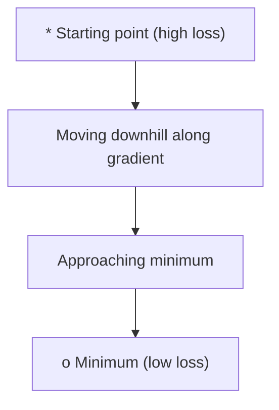
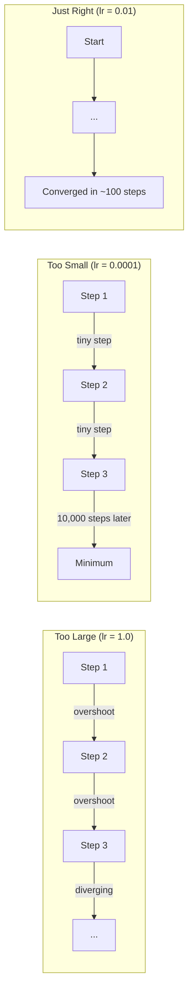
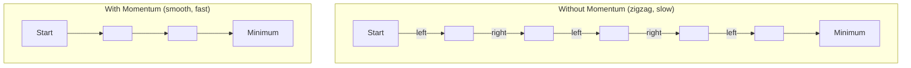
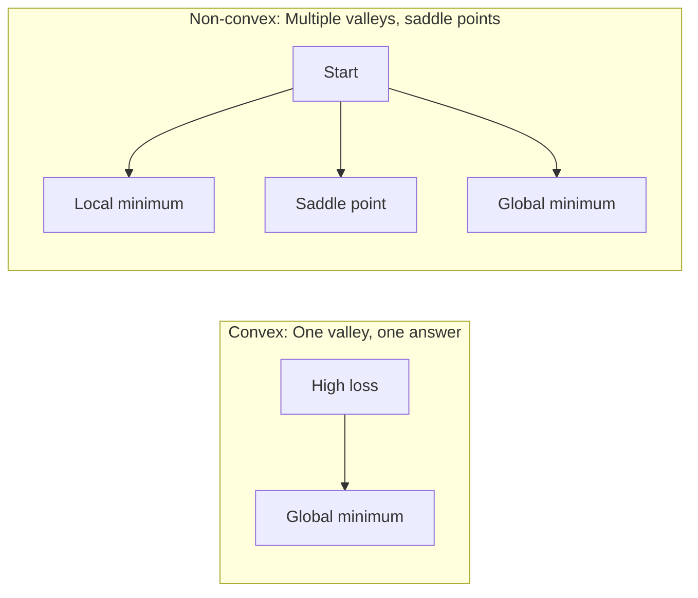
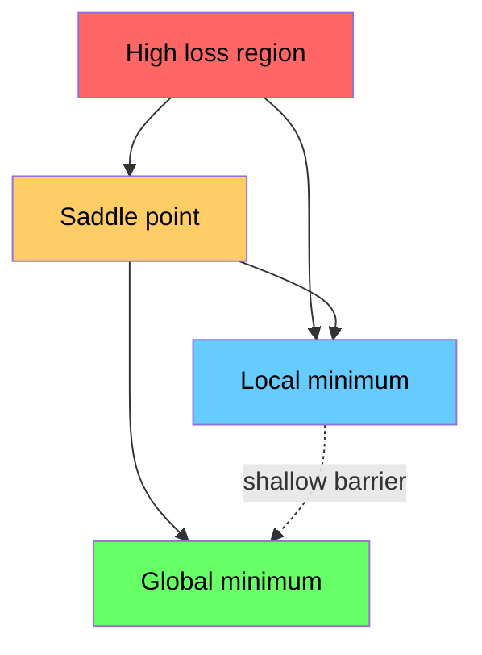

# Оптимизация

> Обучение нейронной сети - это всего лишь поиск дна долины.

**Тип:** Практика
**Язык:** Python
**Пререквизиты:** Фаза 1, уроки 04-05 (производные, градиенты)
**Время:** ~75 минут

## Цели обучения

- Реализовать vanilla gradient descent, SGD with momentum и Adam с нуля
- Сравнить сходимость оптимизаторов на функции Розенброка и объяснить, почему Adam адаптирует learning rate для каждого веса
- Отличать convex и non-convex loss landscapes и объяснять роль saddle points в высоких размерностях
- Настраивать learning rate schedules (step decay, cosine annealing, warmup) для стабильности обучения

## Проблема

У вас есть функция потерь. Она говорит, насколько ошибается модель. У вас есть градиенты. Они говорят, в каком направлении loss растет. Теперь нужна стратегия движения вниз.

Наивный подход прост: двигаться против градиента. Масштабировать шаг некоторым числом, которое называется learning rate. Повторять. Это gradient descent, и он работает. Но у слова "работает" есть оговорки. Слишком большой learning rate - и вы полностью перескакиваете долину, отскакивая от стен. Слишком маленький - и вы ползете к ответу тысячи лишних шагов. Попадете в saddle point - и остановитесь, хотя minimum еще не найден.

Каждый optimizer в deep learning отвечает на один и тот же вопрос: как добраться до дна долины быстрее и надежнее?

## Концепция

### Что означает оптимизация

Оптимизация - это поиск входных значений, которые минимизируют или максимизируют функцию. В machine learning функция - это loss. Входы - веса модели. Обучение - это оптимизация.

```
minimize L(w) where:
  L = loss function
  w = model weights (could be millions of parameters)
```

### Gradient descent (vanilla)

Самый простой optimizer. Вычислите градиент loss по каждому весу. Сдвиньте каждый вес в направлении, противоположном его градиенту. Масштабируйте шаг learning rate.

```
w = w - lr * gradient
```

Это весь алгоритм. Одна строка.



### Learning rate: самый важный hyperparameter

Learning rate управляет размером шага. Он определяет все, что связано со сходимостью.



Формулы для правильного learning rate нет. Его находят экспериментом. Типичные стартовые значения: 0.001 для Adam, 0.01 для SGD with momentum.

### SGD vs batch vs mini-batch

Vanilla gradient descent вычисляет градиент по всему датасету перед одним шагом. Это называется batch gradient descent. Он стабилен, но медленный.

Stochastic gradient descent (SGD) вычисляет градиент на одном случайном sample и сразу делает шаг. Он шумный, но быстрый.

Mini-batch gradient descent - компромисс. Вычислите градиент на небольшом batch (32, 64, 128, 256 samples), затем сделайте шаг. Именно это почти все используют на практике.

| Вариант | Batch size | Качество градиента | Скорость одного шага | Шум |
|---------|-----------|-----------------|---------------|-------|
| Batch GD | Весь датасет | Точный | Медленно | Нет |
| SGD | 1 sample | Очень шумный | Быстро | Высокий |
| Mini-batch | 32-256 | Хорошая оценка | Сбалансированно | Умеренный |

Шум в SGD и mini-batch - не баг. Он помогает выходить из неглубоких local minima и saddle points.

### Momentum: шар, катящийся вниз

Vanilla gradient descent смотрит только на текущий градиент. Если градиент зигзагом меняет направление, что часто бывает в узких долинах, прогресс медленный. Momentum исправляет это, накапливая прошлые градиенты в velocity term.

```
v = beta * v + gradient
w = w - lr * v
```

Аналогия: шар катится вниз. Он не останавливается и не стартует заново на каждой неровности. Он набирает скорость в устойчивых направлениях и гасит осцилляции.



`beta` (обычно 0.9) управляет тем, сколько истории сохранять. Более высокий beta означает больше momentum и более гладкие траектории, но более медленную реакцию на смену направления.

### Adam: adaptive learning rates

Разным весам нужны разные learning rates. Вес, который редко получает большие градиенты, должен делать более крупные шаги, когда они наконец появляются. Вес, который постоянно получает огромные градиенты, должен делать меньшие шаги.

Adam (Adaptive Moment Estimation) отслеживает две величины для каждого веса:

1. First moment (m): скользящее среднее градиентов, как momentum
2. Second moment (v): скользящее среднее квадратов градиентов, то есть magnitude градиента

```
m = beta1 * m + (1 - beta1) * gradient
v = beta2 * v + (1 - beta2) * gradient^2

m_hat = m / (1 - beta1^t)    bias correction
v_hat = v / (1 - beta2^t)    bias correction

w = w - lr * m_hat / (sqrt(v_hat) + epsilon)
```

Деление на `sqrt(v_hat)` - ключевая идея. Веса с большими градиентами делятся на большое число, то есть получают маленький эффективный шаг. Веса с малыми градиентами делятся на малое число и получают большой эффективный шаг. Каждый вес получает собственный adaptive learning rate.

Параметры по умолчанию: `lr=0.001, beta1=0.9, beta2=0.999, epsilon=1e-8`. Эти defaults хорошо работают для большинства задач.

### Learning rate schedules

Фиксированный learning rate - это компромисс. В начале обучения нужны большие шаги для быстрого прогресса. В конце нужны маленькие шаги, чтобы точно донастроиться около minimum.

Распространенные schedules:

| Schedule | Формула | Сценарий использования |
|----------|---------|----------|
| Step decay | lr = lr * factor every N epochs | Простой ручной контроль |
| Exponential decay | lr = lr_0 * decay^t | Плавное уменьшение |
| Cosine annealing | lr = lr_min + 0.5 * (lr_max - lr_min) * (1 + cos(pi * t / T)) | Transformers, modern training |
| Warmup + decay | Linear ramp up, then decay | Большие модели, предотвращает раннюю нестабильность |

### Convex vs non-convex

У convex функции один minimum. Gradient descent всегда его находит. Квадратичная функция вроде `f(x) = x^2` является convex.

Loss-функции нейронных сетей non-convex. У них много local minima, saddle points и flat regions.



На практике local minima в высокоразмерных нейронных сетях редко становятся проблемой. Большинство local minima имеют значения loss, близкие к global minimum. Настоящее препятствие - saddle points: плоские в одних направлениях и изогнутые в других. Momentum и шум от mini-batches помогают из них выходить.

### Визуализация loss landscape

Loss - это функция всех весов. Для модели с 1 миллионом весов loss landscape живет в 1 000 001-мерном пространстве. Мы визуализируем его, выбирая два случайных направления в пространстве весов и строя loss вдоль этих направлений, получая 2D surface.



Sharp minima плохо обобщают. Flat minima обобщают хорошо. Это одна из причин, почему SGD with momentum часто превосходит Adam по итоговой test accuracy: его шум мешает осесть в sharp minima.

## Соберите это

### Шаг 1: определите тестовую функцию

Функция Розенброка - классический benchmark для оптимизации. Ее minimum находится в (1, 1) внутри узкой изогнутой долины, которую легко найти, но трудно пройти.

```
f(x, y) = (1 - x)^2 + 100 * (y - x^2)^2
```

```python
def rosenbrock(params):
    x, y = params
    return (1 - x) ** 2 + 100 * (y - x ** 2) ** 2

def rosenbrock_gradient(params):
    x, y = params
    df_dx = -2 * (1 - x) + 200 * (y - x ** 2) * (-2 * x)
    df_dy = 200 * (y - x ** 2)
    return [df_dx, df_dy]
```

### Шаг 2: Vanilla gradient descent

```python
class GradientDescent:
    def __init__(self, lr=0.001):
        self.lr = lr

    def step(self, params, grads):
        return [p - self.lr * g for p, g in zip(params, grads)]
```

### Шаг 3: SGD with momentum

```python
class SGDMomentum:
    def __init__(self, lr=0.001, momentum=0.9):
        self.lr = lr
        self.momentum = momentum
        self.velocity = None

    def step(self, params, grads):
        if self.velocity is None:
            self.velocity = [0.0] * len(params)
        self.velocity = [
            self.momentum * v + g
            for v, g in zip(self.velocity, grads)
        ]
        return [p - self.lr * v for p, v in zip(params, self.velocity)]
```

### Шаг 4: Adam

```python
class Adam:
    def __init__(self, lr=0.001, beta1=0.9, beta2=0.999, epsilon=1e-8):
        self.lr = lr
        self.beta1 = beta1
        self.beta2 = beta2
        self.epsilon = epsilon
        self.m = None
        self.v = None
        self.t = 0

    def step(self, params, grads):
        if self.m is None:
            self.m = [0.0] * len(params)
            self.v = [0.0] * len(params)

        self.t += 1

        self.m = [
            self.beta1 * m + (1 - self.beta1) * g
            for m, g in zip(self.m, grads)
        ]
        self.v = [
            self.beta2 * v + (1 - self.beta2) * g ** 2
            for v, g in zip(self.v, grads)
        ]

        m_hat = [m / (1 - self.beta1 ** self.t) for m in self.m]
        v_hat = [v / (1 - self.beta2 ** self.t) for v in self.v]

        return [
            p - self.lr * mh / (vh ** 0.5 + self.epsilon)
            for p, mh, vh in zip(params, m_hat, v_hat)
        ]
```

### Шаг 5: запустите и сравните

```python
def optimize(optimizer, func, grad_func, start, steps=5000):
    params = list(start)
    history = [params[:]]
    for _ in range(steps):
        grads = grad_func(params)
        params = optimizer.step(params, grads)
        history.append(params[:])
    return history

start = [-1.0, 1.0]

gd_history = optimize(GradientDescent(lr=0.0005), rosenbrock, rosenbrock_gradient, start)
sgd_history = optimize(SGDMomentum(lr=0.0001, momentum=0.9), rosenbrock, rosenbrock_gradient, start)
adam_history = optimize(Adam(lr=0.01), rosenbrock, rosenbrock_gradient, start)

for name, history in [("GD", gd_history), ("SGD+M", sgd_history), ("Adam", adam_history)]:
    final = history[-1]
    loss = rosenbrock(final)
    print(f"{name:6s} -> x={final[0]:.6f}, y={final[1]:.6f}, loss={loss:.8f}")
```

Ожидаемый вывод: Adam сходится быстрее всего. SGD with momentum идет по более гладкой траектории. Vanilla GD медленно продвигается вдоль узкой долины.

### Ожидаемый вывод

Запустите `code/optimizers.py` — последние строки должны быть такими:

```
  Start: x=0.01, y=0.01 (near saddle at origin)

  Method                           x           y        f(x,y)  Escaped?
  --------------------------------------------------------------
  Gradient Descent          0.000176    0.524849     -0.275466  no
  SGD + Momentum           -0.000000  4729020.438514  -22363634307887.484375  yes
  Adam                     -0.000000    3.033698     -9.203325  yes
```

## Используйте это

На практике используйте оптимизаторы PyTorch или JAX. Они обрабатывают parameter groups, weight decay, gradient clipping и GPU acceleration.

```python
import torch

model = torch.nn.Linear(784, 10)

sgd = torch.optim.SGD(model.parameters(), lr=0.01, momentum=0.9)
adam = torch.optim.Adam(model.parameters(), lr=0.001)
adamw = torch.optim.AdamW(model.parameters(), lr=0.001, weight_decay=0.01)

scheduler = torch.optim.lr_scheduler.CosineAnnealingLR(adam, T_max=100)
```

Практические правила:

- Начните с Adam (lr=0.001). Он работает для большинства задач без настройки.
- Переключайтесь на SGD with momentum (lr=0.01, momentum=0.9), когда нужна лучшая итоговая accuracy и вы можете позволить себе больше tuning.
- Используйте AdamW (Adam с decoupled weight decay) для transformers.
- Всегда используйте learning rate schedule для запусков обучения длиннее нескольких эпох.
- Если обучение нестабильно, уменьшите learning rate. Если обучение слишком медленное, увеличьте его.

## Доведите до результата

Этот урок создает prompt для выбора правильного optimizer. См. `outputs/prompt-optimizer-guide.md`.

Классы optimizer, построенные здесь, снова появятся в фазе 3, когда мы будем обучать нейронную сеть с нуля.

## Упражнения

1. **Перебор learning rate.** Запустите vanilla gradient descent на функции Розенброка с learning rates [0.0001, 0.0005, 0.001, 0.005, 0.01]. Постройте график или выведите final loss после 5000 шагов для каждого. Найдите самый большой learning rate, который все еще сходится.

2. **Сравнение momentum.** Запустите SGD с momentum values [0.0, 0.5, 0.9, 0.99] на функции Розенброка. Отслеживайте loss на каждом шаге. Какое значение momentum сходится быстрее всего? Какое overshoots?

3. **Выход из saddle point.** Определите функцию `f(x, y) = x^2 - y^2` (saddle point в начале координат). Начните с (0.01, 0.01). Сравните поведение vanilla GD, SGD with momentum и Adam. Какой выходит из saddle point?

4. **Реализуйте learning rate decay.** Добавьте exponential decay schedule в класс GradientDescent: `lr = lr_0 * 0.999^step`. Сравните сходимость с decay и без него на функции Розенброка.

## Ключевые термины

| Термин | Как обычно говорят | Что это на самом деле означает |
|------|----------------|----------------------|
| Gradient descent | "Идти вниз" | Обновлять веса, вычитая градиент, масштабированный learning rate. Самый базовый optimizer. |
| Learning rate | "Размер шага" | Скаляр, который управляет тем, насколько далеко каждое обновление сдвигает веса. Слишком большой вызывает divergence. Слишком маленький тратит compute. |
| Momentum | "Продолжать катиться" | Накопление прошлых градиентов в velocity vector. Гасит осцилляции и ускоряет движение в устойчивых направлениях. |
| SGD | "Случайная выборка" | Stochastic gradient descent. Вычисляет градиент на случайном подмножестве вместо полного датасета. На практике почти всегда означает mini-batch SGD. |
| Mini-batch | "Кусок данных" | Небольшое подмножество обучающих данных (32-256 samples), используемое для оценки градиента. Балансирует скорость и точность градиента. |
| Adam | "Optimizer по умолчанию" | Adaptive Moment Estimation. Отслеживает скользящие средние градиентов и квадратов градиентов для каждого веса, чтобы дать каждому весу собственный learning rate. |
| Bias correction | "Исправить cold start" | Первый и второй моменты Adam инициализируются нулями. Bias correction делит на (1 - beta^t), чтобы компенсировать это на ранних шагах. |
| Learning rate schedule | "Менять lr со временем" | Функция, которая настраивает learning rate во время обучения. Большие шаги в начале, маленькие в конце. |
| Convex function | "Одна долина" | Функция, у которой любой local minimum является global minimum. Gradient descent всегда его находит. Losses нейронных сетей не convex. |
| Saddle point | "Плоско, но не minimum" | Точка, где градиент равен нулю, но в одних направлениях это minimum, а в других maximum. Часто встречается в высоких размерностях. |
| Loss landscape | "Рельеф" | Loss function, построенная по пространству весов. Визуализируется срезом вдоль двух случайных направлений. |
| Convergence | "Дошли" | Optimizer достиг точки, где дальнейшие шаги больше не уменьшают loss значимо. |

## Дополнительное чтение

- [Sebastian Ruder: An overview of gradient descent optimization algorithms](https://ruder.io/optimizing-gradient-descent/) - полный обзор основных optimizers
- [Why Momentum Really Works (Distill)](https://distill.pub/2017/momentum/) - интерактивная визуализация dynamics of momentum
- [Adam: A Method for Stochastic Optimization (Kingma & Ba, 2014)](https://arxiv.org/abs/1412.6980) - оригинальная статья Adam, понятная и короткая
- [Visualizing the Loss Landscape of Neural Nets (Li et al., 2018)](https://arxiv.org/abs/1712.09913) - статья, показавшая sharp vs flat minima
