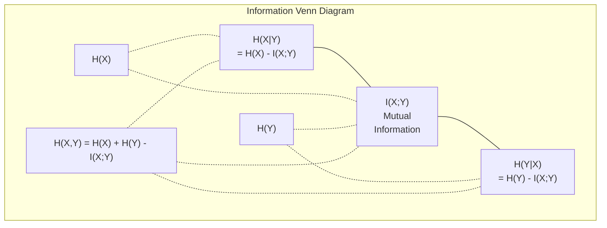

# Теория информации

> Теория информации измеряет неожиданность. Loss functions построены на ней.

**Тип:** Изучение
**Язык:** Python
**Пререквизиты:** Фаза 1, урок 06 (вероятность)
**Время:** ~60 минут

## Цели обучения

- Вычислять entropy, cross-entropy и KL divergence с нуля и объяснять их связь
- Вывести, почему минимизация cross-entropy loss эквивалентна максимизации log-likelihood
- Вычислять mutual information между признаками и target, чтобы ранжировать важность признаков
- Объяснять perplexity как эффективный размер словаря, из которого выбирает языковая модель

## Проблема

Вы вызываете `CrossEntropyLoss()` в каждой классификационной модели, которую обучаете. Вы видите "perplexity" в каждой статье про языковые модели. Вы читаете про KL divergence в VAE, distillation и RLHF. Это не разрозненные понятия. Это одна и та же идея в разных ролях.

Теория информации дает язык для рассуждений о неопределенности, сжатии и предсказании. Клод Шеннон создал ее в 1948 году, чтобы решать задачи коммуникации. Оказалось, обучение нейронной сети - тоже задача коммуникации: модель пытается передать правильную метку через шумный канал выученных весов.

Этот урок строит каждую формулу с нуля, чтобы вы увидели, откуда они берутся и почему работают.

## Концепция

### Information Content (Surprise)

Когда происходит что-то маловероятное, это несет больше информации. Монета выпала орлом? Не удивительно. Выигрыш в лотерею? Очень удивительно.

Information content события с вероятностью p:

```
I(x) = -log(p(x))
```

Логарифм по основанию 2 дает bits. Натуральный логарифм дает nats. Идея та же, единицы разные.

```
Event              Probability    Surprise (bits)
Fair coin heads    0.5            1.0
Rolling a 6        0.167          2.58
1-in-1000 event    0.001          9.97
Certain event      1.0            0.0
```

Достоверные события несут ноль информации. Вы уже знали, что они произойдут.

### Entropy (Average Surprise)

Entropy - это ожидаемая surprise по всем возможным исходам распределения.

```
H(P) = -sum( p(x) * log(p(x)) )  for all x
```

Честная монета имеет максимальную entropy для бинарной переменной: 1 bit. Смещенная монета (99% орлов) имеет низкую entropy: 0.08 bits. Вы почти заранее знаете, что произойдет, поэтому каждый бросок почти ничего не сообщает.

```
Fair coin:    H = -(0.5 * log2(0.5) + 0.5 * log2(0.5)) = 1.0 bit
Biased coin:  H = -(0.99 * log2(0.99) + 0.01 * log2(0.01)) = 0.08 bits
```

Entropy измеряет несводимую неопределенность в распределении. Сжать ниже нее невозможно.

### Cross-Entropy (Loss Function, которую вы используете каждый день)

Cross-entropy измеряет среднюю surprise, когда вы используете распределение Q для кодирования событий, которые на самом деле приходят из распределения P.

```
H(P, Q) = -sum( p(x) * log(q(x)) )  for all x
```

P - истинное распределение (labels). Q - предсказания модели. Если Q идеально совпадает с P, cross-entropy равна entropy. Любое несовпадение увеличивает ее.

В классификации P - one-hot vector: истинный класс имеет вероятность 1, все остальные 0. Это упрощает cross-entropy до:

```
H(P, Q) = -log(q(true_class))
```

Это вся формула cross-entropy loss для классификации. Максимизируйте предсказанную вероятность правильного класса.

### KL Divergence (расстояние между распределениями)

KL divergence измеряет, сколько дополнительной surprise вы получаете, используя Q вместо P.

```
D_KL(P || Q) = sum( p(x) * log(p(x) / q(x)) )  for all x
             = H(P, Q) - H(P)
```

Cross-entropy - это entropy плюс KL divergence. Поскольку entropy истинного распределения постоянна во время обучения, минимизировать cross-entropy - то же самое, что минимизировать KL divergence. Вы подтягиваете распределение модели к истинному распределению.

KL divergence несимметрична: D_KL(P || Q) != D_KL(Q || P). Это не настоящая метрика расстояния.

### Mutual Information

Mutual information измеряет, сколько знание одной переменной сообщает вам о другой.

```
I(X; Y) = H(X) - H(X|Y)
        = H(X) + H(Y) - H(X, Y)
```

Если X и Y независимы, mutual information равна нулю. Знание одной ничего не говорит о другой. Если они идеально коррелируют, mutual information равна entropy любой из переменных.

В feature selection высокая mutual information между признаком и target означает, что признак полезен. Низкая mutual information означает, что это шум.

### Conditional Entropy

H(Y|X) измеряет, сколько неопределенности остается о Y после наблюдения X.

```
H(Y|X) = H(X,Y) - H(X)
```

Две крайности:
- Если X полностью определяет Y, то H(Y|X) = 0. Знание X устраняет всю неопределенность о Y. Пример: X = температура в Celsius, Y = температура в Fahrenheit.
- Если X ничего не говорит о Y, то H(Y|X) = H(Y). Знание X вообще не уменьшает неопределенность. Пример: X = бросок монеты, Y = погода завтра.

Conditional entropy всегда неотрицательна и никогда не превышает H(Y):

```
0 <= H(Y|X) <= H(Y)
```

В machine learning conditional entropy появляется в decision trees. На каждом split алгоритм выбирает признак X, который минимизирует H(Y|X), то есть признак, удаляющий больше всего неопределенности о label Y.

### Joint Entropy

H(X,Y) - это entropy совместного распределения X и Y.

```
H(X,Y) = -sum sum p(x,y) * log(p(x,y))   for all x, y
```

Ключевое свойство:

```
H(X,Y) <= H(X) + H(Y)
```

Равенство выполняется, когда X и Y независимы. Если они разделяют информацию, joint entropy меньше суммы индивидуальных entropies. "Недостающая" entropy - это ровно mutual information.



Связи:
- H(X,Y) = H(X) + H(Y|X) = H(Y) + H(X|Y)
- I(X;Y) = H(X) - H(X|Y) = H(Y) - H(Y|X)
- H(X,Y) = H(X) + H(Y) - I(X;Y)

### Mutual Information (Deep Dive)

Mutual information I(X;Y) количественно выражает, насколько знание одной переменной уменьшает неопределенность о другой.

```
I(X;Y) = H(X) - H(X|Y)
       = H(Y) - H(Y|X)
       = H(X) + H(Y) - H(X,Y)
       = sum sum p(x,y) * log(p(x,y) / (p(x) * p(y)))
```

Свойства:
- I(X;Y) >= 0 всегда. Наблюдая что-то, вы никогда не теряете информацию.
- I(X;Y) = 0 тогда и только тогда, когда X и Y независимы.
- I(X;Y) = I(Y;X). Она симметрична, в отличие от KL divergence.
- I(X;X) = H(X). Переменная разделяет всю свою информацию с самой собой.

**Mutual information для feature selection.** В ML нужны признаки, информативные относительно target. Mutual information дает принципиальный способ ранжировать признаки:

1. Для каждого признака X_i вычислите I(X_i; Y), где Y - target variable.
2. Отранжируйте признаки по MI score.
3. Оставьте top k признаков.

Это работает для любой связи между feature и target: линейной, нелинейной, монотонной или иной. Correlation ловит только линейные связи. MI ловит все.

| Метод | Что обнаруживает | Вычислительная стоимость | Работает с категориальными признаками? |
|--------|---------|-------------------|---------------------|
| Pearson correlation | Линейные связи | O(n) | Нет |
| Spearman correlation | Монотонные связи | O(n log n) | Нет |
| Mutual information | Любую статистическую зависимость | O(n log n) with binning | Да |

### Label Smoothing and Cross-Entropy

Стандартная классификация использует hard targets: [0, 0, 1, 0]. Истинный класс получает вероятность 1, все остальные - 0. Label smoothing заменяет их soft targets:

```
soft_target = (1 - epsilon) * hard_target + epsilon / num_classes
```

При epsilon = 0.1 и 4 классах:
- Hard target:  [0, 0, 1, 0]
- Soft target:  [0.025, 0.025, 0.925, 0.025]

С точки зрения теории информации label smoothing увеличивает entropy целевого распределения. Hard one-hot targets имеют entropy 0 - неопределенности нет. Soft targets имеют положительную entropy.

Почему это помогает:
- Не дает модели уводить logits в экстремальные значения: infinite logits понадобились бы, чтобы идеально совпасть с one-hot target при cross-entropy
- Действует как regularization: модель не может быть уверена на 100%
- Улучшает calibration: предсказанные вероятности лучше отражают истинную неопределенность
- Снижает разрыв между поведением при training и inference

Cross-entropy loss с label smoothing становится:

```
L = (1 - epsilon) * CE(hard_target, prediction) + epsilon * H_uniform(prediction)
```

Второй член штрафует предсказания, далекие от uniform, то есть напрямую регуляризует уверенность.

### Почему Cross-Entropy - главный loss для классификации

Три взгляда, один вывод.

**Взгляд теории информации.** Cross-entropy измеряет, сколько bits вы тратите впустую, используя распределение модели вместо истинного распределения. Минимизация делает модель самым эффективным кодировщиком реальности.

**Взгляд maximum likelihood.** Для N обучающих samples с истинными классами y_i:

```
Likelihood     = product( q(y_i) )
Log-likelihood = sum( log(q(y_i)) )
Negative log-likelihood = -sum( log(q(y_i)) )
```

Последняя строка - это cross-entropy loss. Минимизация cross-entropy = максимизация likelihood обучающих данных при вашей модели.

**Взгляд градиента.** Градиент cross-entropy по logits - это просто (predicted - true). Чисто, стабильно и быстро вычисляется. Поэтому она идеально сочетается с softmax.

### Bits vs Nats

Единственная разница - основание логарифма.

```
log base 2   -> bits      (information theory tradition)
log base e   -> nats      (machine learning convention)
log base 10  -> hartleys  (rarely used)
```

1 nat = 1/ln(2) bits = 1.4427 bits. PyTorch и TensorFlow по умолчанию используют natural log (nats).

### Perplexity

Perplexity - это экспонента cross-entropy. Она говорит эффективное число равновероятных вариантов, между которыми модель неопределенна.

```
Perplexity = 2^H(P,Q)   (if using bits)
Perplexity = e^H(P,Q)   (if using nats)
```

Языковая модель с perplexity 50 в среднем настолько же растеряна, как если бы выбирала равномерно из 50 возможных следующих tokens. Меньше - лучше.

GPT-2 достигала perplexity ~30 на распространенных benchmarks. Современные модели в хорошо представленных domains имеют значения в единицах.

## Соберите это

### Шаг 1: Information content и entropy

```python
import math

def information_content(p, base=2):
    if p <= 0 or p > 1:
        return float('inf') if p <= 0 else 0.0
    return -math.log(p) / math.log(base)

def entropy(probs, base=2):
    return sum(
        p * information_content(p, base)
        for p in probs if p > 0
    )

fair_coin = [0.5, 0.5]
biased_coin = [0.99, 0.01]
fair_die = [1/6] * 6

print(f"Fair coin entropy:   {entropy(fair_coin):.4f} bits")
print(f"Biased coin entropy: {entropy(biased_coin):.4f} bits")
print(f"Fair die entropy:    {entropy(fair_die):.4f} bits")
```

### Шаг 2: Cross-entropy и KL divergence

```python
def cross_entropy(p, q, base=2):
    total = 0.0
    for pi, qi in zip(p, q):
        if pi > 0:
            if qi <= 0:
                return float('inf')
            total += pi * (-math.log(qi) / math.log(base))
    return total

def kl_divergence(p, q, base=2):
    return cross_entropy(p, q, base) - entropy(p, base)

true_dist = [0.7, 0.2, 0.1]
good_model = [0.6, 0.25, 0.15]
bad_model = [0.1, 0.1, 0.8]

print(f"Entropy of true dist:     {entropy(true_dist):.4f} bits")
print(f"CE (good model):          {cross_entropy(true_dist, good_model):.4f} bits")
print(f"CE (bad model):           {cross_entropy(true_dist, bad_model):.4f} bits")
print(f"KL divergence (good):     {kl_divergence(true_dist, good_model):.4f} bits")
print(f"KL divergence (bad):      {kl_divergence(true_dist, bad_model):.4f} bits")
```

### Шаг 3: Cross-entropy как classification loss

```python
def softmax(logits):
    max_logit = max(logits)
    exps = [math.exp(z - max_logit) for z in logits]
    total = sum(exps)
    return [e / total for e in exps]

def cross_entropy_loss(true_class, logits):
    probs = softmax(logits)
    return -math.log(probs[true_class])

logits = [2.0, 1.0, 0.1]
true_class = 0

probs = softmax(logits)
loss = cross_entropy_loss(true_class, logits)

print(f"Logits:      {logits}")
print(f"Softmax:     {[f'{p:.4f}' for p in probs]}")
print(f"True class:  {true_class}")
print(f"Loss:        {loss:.4f} nats")
print(f"Perplexity:  {math.exp(loss):.2f}")
```

### Шаг 4: Cross-entropy равна negative log-likelihood

```python
import random

random.seed(42)

n_samples = 1000
n_classes = 3
true_labels = [random.randint(0, n_classes - 1) for _ in range(n_samples)]
model_logits = [[random.gauss(0, 1) for _ in range(n_classes)] for _ in range(n_samples)]

ce_loss = sum(
    cross_entropy_loss(label, logits)
    for label, logits in zip(true_labels, model_logits)
) / n_samples

nll = -sum(
    math.log(softmax(logits)[label])
    for label, logits in zip(true_labels, model_logits)
) / n_samples

print(f"Cross-entropy loss:      {ce_loss:.6f}")
print(f"Negative log-likelihood: {nll:.6f}")
print(f"Difference:              {abs(ce_loss - nll):.2e}")
```

### Шаг 5: Mutual information

```python
def mutual_information(joint_probs, base=2):
    rows = len(joint_probs)
    cols = len(joint_probs[0])

    margin_x = [sum(joint_probs[i][j] for j in range(cols)) for i in range(rows)]
    margin_y = [sum(joint_probs[i][j] for i in range(rows)) for j in range(cols)]

    mi = 0.0
    for i in range(rows):
        for j in range(cols):
            pxy = joint_probs[i][j]
            if pxy > 0:
                mi += pxy * math.log(pxy / (margin_x[i] * margin_y[j])) / math.log(base)
    return mi

independent = [[0.25, 0.25], [0.25, 0.25]]
dependent = [[0.45, 0.05], [0.05, 0.45]]

print(f"MI (independent): {mutual_information(independent):.4f} bits")
print(f"MI (dependent):   {mutual_information(dependent):.4f} bits")
```

### Ожидаемый вывод

Запустите `code/information_theory.py` — последние строки должны быть такими:

```
  Feature MI ranking:
       strong_signal  MI = 0.5860 bits  #####################################################################################################################
         weak_signal  MI = 0.0693 bits  #############
               noise  MI = 0.0110 bits  ##
            constant  MI = 0.0000 bits  

  Strong signal has highest MI. Noise and constant have ~0.
```

## Используйте это

Те же концепции с NumPy, в том виде, как вы будете использовать их на практике:

```python
import numpy as np

def np_entropy(p):
    p = np.asarray(p, dtype=float)
    mask = p > 0
    result = np.zeros_like(p)
    result[mask] = p[mask] * np.log(p[mask])
    return -result.sum()

def np_cross_entropy(p, q):
    p, q = np.asarray(p, dtype=float), np.asarray(q, dtype=float)
    mask = p > 0
    return -(p[mask] * np.log(q[mask])).sum()

def np_kl_divergence(p, q):
    return np_cross_entropy(p, q) - np_entropy(p)

true = np.array([0.7, 0.2, 0.1])
pred = np.array([0.6, 0.25, 0.15])
print(f"Entropy:    {np_entropy(true):.4f} nats")
print(f"Cross-ent:  {np_cross_entropy(true, pred):.4f} nats")
print(f"KL div:     {np_kl_divergence(true, pred):.4f} nats")
```

Вы построили с нуля то, что `torch.nn.CrossEntropyLoss()` делает внутри. Теперь вы знаете, почему loss снижается во время обучения: предсказанное распределение модели становится ближе к истинному распределению, измеренному в nats потраченной впустую информации.

## Упражнения

1. Вычислите entropy английского алфавита, предполагая uniform distribution (26 букв). Затем оцените ее с использованием реальных частот букв. Какая выше и почему?

2. Модель выдает logits [5.0, 2.0, 0.5] для sample с true class 1. Вычислите cross-entropy loss вручную, затем проверьте функцией `cross_entropy_loss`. Какие logits дали бы zero loss?

3. Покажите, что KL divergence несимметрична. Выберите два распределения P и Q и вычислите D_KL(P || Q) и D_KL(Q || P). Объясните, почему они различаются.

4. Постройте функцию, которая вычисляет perplexity для последовательности token predictions. Дан список пар (true_token_index, predicted_logits); верните perplexity последовательности.

## Ключевые термины

| Термин | Как обычно говорят | Что это на самом деле означает |
|------|----------------|----------------------|
| Information content | "Surprise" | Число bits или nats, нужное для кодирования события: -log(p) |
| Entropy | "Randomness" | Средняя surprise по всем исходам распределения. Измеряет несводимую неопределенность. |
| Cross-entropy | "The loss function" | Средняя surprise при использовании распределения модели Q для кодирования событий из истинного распределения P. |
| KL divergence | "Distance between distributions" | Дополнительные bits, потраченные из-за использования Q вместо P. Равна cross-entropy минус entropy. Несимметрична. |
| Mutual information | "How related are X and Y" | Уменьшение неопределенности о X благодаря знанию Y. Ноль означает независимость. |
| Softmax | "Turn logits into probabilities" | Возвести в экспоненту и нормировать. Преобразует любой вещественный вектор в корректное вероятностное распределение. |
| Perplexity | "How confused the model is" | Экспонента cross-entropy. Эффективный размер словаря, из которого модель выбирает на каждом шаге. |
| Bits | "Shannon's unit" | Информация, измеренная логарифмом по основанию 2. Один bit разрешает один бросок честной монеты. |
| Nats | "ML's unit" | Информация, измеренная натуральным логарифмом. По умолчанию используется PyTorch и TensorFlow. |
| Negative log-likelihood | "NLL loss" | Идентична cross-entropy loss для one-hot labels. Ее минимизация максимизирует вероятность правильных предсказаний. |

## Дополнительное чтение

- [Shannon 1948: A Mathematical Theory of Communication](https://people.math.harvard.edu/~ctm/home/text/others/shannon/entropy/entropy.pdf) - оригинальная статья, все еще читается
- [Visual Information Theory (Chris Olah)](https://colah.github.io/posts/2015-09-Visual-Information/) - лучшее визуальное объяснение entropy и KL divergence
- [PyTorch CrossEntropyLoss docs](https://pytorch.org/docs/stable/generated/torch.nn.CrossEntropyLoss.html) - как framework реализует то, что вы только что построили
