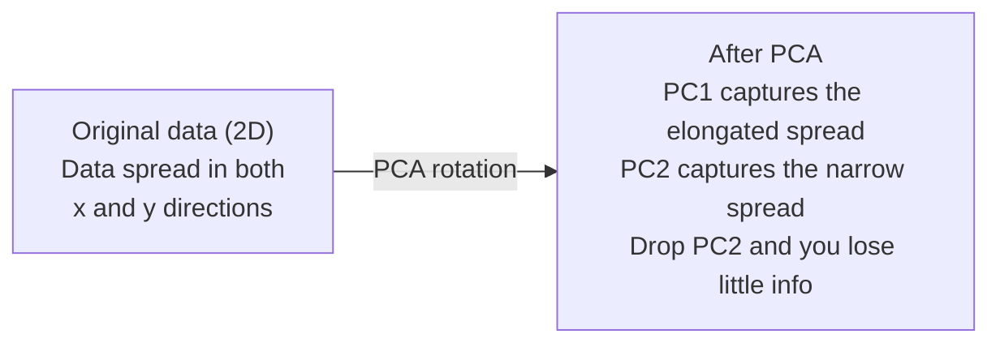

# Снижение размерности

> У высокоразмерных данных есть структура. Чтобы ее увидеть, нужно посмотреть под правильным углом.

**Тип:** Практика
**Язык:** Python
**Пререквизиты:** Фаза 1, уроки 01 (интуиция линейной алгебры), 02 (векторы, матрицы и операции), 03 (собственные значения и собственные векторы), 06 (вероятность и распределения)
**Время:** ~90 минут

## Цели обучения

- Реализовать PCA с нуля: центрировать данные, вычислить матрицу ковариации, выполнить разложение по собственным векторам и проекцию
- Использовать долю объясненной дисперсии и метод локтя для выбора числа главных компонент
- Сравнить PCA, t-SNE и UMAP для визуализации цифр MNIST в 2D и объяснить компромиссы между ними
- Применить kernel PCA с RBF kernel, чтобы разделять нелинейные структуры данных, с которыми обычный PCA не справляется

## Проблема

У вас есть датасет с 784 признаками на пример. Может быть, это значения пикселей рукописных цифр. Может быть, уровни экспрессии генов. Может быть, сигналы поведения пользователей. Вы не можете визуализировать 784 измерения. Не можете построить их на графике. Даже думать о них трудно.

Но большинство из этих 784 признаков избыточны. Реальная информация живет на намного меньшей поверхности. Рукописная "7" не требует 784 независимых чисел для описания. Достаточно нескольких: угол штриха, длина перекладины, насколько она наклонена. Остальное - шум.

Снижение размерности находит эту меньшую поверхность. Оно берет ваши данные размерности 784 и сжимает их до 2, 10 или 50 измерений, сохраняя важную структуру.

## Концепция

### Проклятие размерности

Высокоразмерные пространства неинтуитивны. С ростом размерности ломаются три вещи.

**Расстояние теряет смысл.** В высоких размерностях расстояние между любыми двумя случайными точками сходится к одному и тому же значению. Если каждая точка примерно одинаково удалена от каждой другой, поиск ближайших соседей перестает работать.

```
Dimension    Avg distance ratio (max/min between random points)
2            ~5.0
10           ~1.8
100          ~1.2
1000         ~1.02
```

**Объем концентрируется в углах.** Единичный гиперкуб в d измерениях имеет 2^d углов. В 100 измерениях почти весь объем находится в углах, далеко от центра. Точки данных расползаются к краям, и моделям не хватает данных внутри пространства.

**Нужно экспоненциально больше данных.** Чтобы поддерживать ту же плотность примеров в пространстве, переход от 2D к 20D требует в 10^18 раз больше данных. Столько никогда нет. Снижение размерности возвращает плотность данных к рабочему уровню.

### PCA: найти направления, которые важны

Principal Component Analysis (PCA) находит оси, вдоль которых ваши данные меняются сильнее всего. Он поворачивает систему координат так, что первая ось захватывает максимальную дисперсию, вторая — следующую по величине, и так далее.

Алгоритм:

```
1. Center the data        (subtract the mean from each feature)
2. Compute covariance     (how features move together)
3. Eigendecomposition     (find the principal directions)
4. Sort by eigenvalue     (biggest variance first)
5. Project               (keep top k eigenvectors, drop the rest)
```

Почему разложение по собственным векторам? Матрица ковариации симметрична и положительно полуопределена. Ее собственные векторы — ортогональные направления в пространстве признаков. Собственные значения показывают, сколько дисперсии захватывает каждое направление. Собственный вектор с максимальным собственным значением указывает вдоль направления максимальной дисперсии.



- **До PCA:** облако данных растянуто по диагонали относительно осей x и y
- **После PCA:** система координат повернута так, что PC1 совпадает с направлением максимальной дисперсии (вытянутый разброс), а PC2 — с направлением минимальной дисперсии (узкий разброс)
- **Снижение размерности:** удаление PC2 проецирует данные на PC1 с очень малой потерей информации

### Доля объясненной дисперсии

Каждая главная компонента захватывает долю общей дисперсии. Доля объясненной дисперсии показывает, какую именно.

```
Component    Eigenvalue    Explained ratio    Cumulative
PC1          4.73          0.473              0.473
PC2          2.51          0.251              0.724
PC3          1.12          0.112              0.836
PC4          0.89          0.089              0.925
...
```

Когда накопленная объясненная дисперсия достигает 0.95, вы знаете, что это число компонент захватывает 95% информации. Все после этого в основном шум.

### Выбор числа компонент

Три стратегии:

1. **Порог.** Оставить достаточно компонент, чтобы объяснить 90-95% дисперсии.
2. **Метод локтя.** Построить объясненную дисперсию по компонентам. Искать резкое падение.
3. **Качество downstream-задачи.** Использовать PCA как предобработку. Перебрать k и измерить accuracy модели. Лучшее k там, где accuracy выходит на плато.

### t-SNE: сохранять соседства

t-Distributed Stochastic Neighbor Embedding (t-SNE) предназначен для визуализации. Он отображает высокоразмерные данные в 2D или 3D, сохраняя то, какие точки находятся рядом друг с другом.

Интуиция: в исходном пространстве вычислите распределение вероятностей по парам точек на основе расстояний. Близкие точки получают высокую вероятность. Далекие точки — низкую. Затем найдите 2D-расположение, где сохраняется то же распределение вероятностей. Точки, которые были соседями в 784 измерениях, остаются соседями в 2D.

Ключевые свойства t-SNE:
- Нелинейный. Может разворачивать сложные многообразия, с которыми PCA не справляется.
- Стохастический. Разные запуски дают разные расположения.
- Параметр perplexity управляет тем, сколько соседей учитывать (типичный диапазон: 5-50).
- Расстояния между кластерами на выходе не имеют смысла. Имеют смысл только сами кластеры.
- Медленный на больших датасетах. По умолчанию O(n^2).

### UMAP: быстрее и лучше сохраняет глобальную структуру

Uniform Manifold Approximation and Projection (UMAP) работает похоже на t-SNE, но с двумя преимуществами:
- Быстрее. Он использует приближенные графы ближайших соседей вместо вычисления всех попарных расстояний.
- Лучше сохраняет глобальную структуру. Относительные положения кластеров на выходе обычно более осмысленны, чем в t-SNE.

UMAP строит взвешенный граф в высокоразмерном пространстве ("нечеткое топологическое представление"), а затем находит низкоразмерное расположение, которое сохраняет этот граф настолько хорошо, насколько возможно.

Ключевые параметры:
- `n_neighbors`: сколько соседей определяют локальную структуру, похоже на perplexity. Более высокие значения сохраняют больше глобальной структуры.
- `min_dist`: насколько плотно точки упаковываются на выходе. Более низкие значения создают более плотные кластеры.

### Что когда использовать

| Метод | Когда использовать | Что сохраняет | Скорость |
|--------|----------|-----------|-------|
| PCA | Предобработка перед обучением | Глобальную дисперсию | Быстрый (точный), работает на миллионах примеров |
| PCA | Быстрая исследовательская визуализация | Линейную структуру | Быстрый |
| t-SNE | 2D-графики для публикаций | Локальные соседства | Медленный (идеально < 10k примеров) |
| UMAP | 2D-визуализация в масштабе | Локальную и часть глобальной структуры | Средний (обрабатывает миллионы) |
| PCA | Сокращение признаков для моделей | Признаки, ранжированные по дисперсии | Быстрый |
| t-SNE / UMAP | Понимание структуры кластеров | Разделение кластеров | От среднего до медленного |

Практическое правило: используйте PCA для предобработки и сжатия данных. Используйте t-SNE или UMAP, когда нужно визуализировать структуру в 2D.

### Kernel PCA

Обычный PCA находит линейные подпространства. Он поворачивает систему координат и удаляет оси. Но что если данные лежат на нелинейном многообразии? Окружность в 2D невозможно разделить никакой прямой. Обычный PCA не поможет.

Kernel PCA применяет PCA в высокоразмерном пространстве признаков, заданном ядерной функцией, не вычисляя явно координаты в этом пространстве. Это kernel trick — та же идея, что и в SVM.

Алгоритм:
1. Вычислить ядерную матрицу K, где K_ij = k(x_i, x_j)
2. Центрировать ядерную матрицу в пространстве признаков
3. Выполнить разложение по собственным векторам центрированной ядерной матрицы
4. Верхние собственные векторы, масштабированные на 1/sqrt(eigenvalue), являются проекциями

Распространенные ядерные функции:

| Kernel | Формула | Подходит для |
|--------|---------|----------|
| RBF (Gaussian) | exp(-gamma * \|\|x - y\|\|^2) | Большинство нелинейных данных, гладкие многообразия |
| Polynomial | (x . y + c)^d | Полиномиальные зависимости |
| Sigmoid | tanh(alpha * x . y + c) | Отображения, похожие на нейросетевые |

Когда использовать kernel PCA вместо обычного PCA:

| Критерий | Обычный PCA | Kernel PCA |
|-----------|-------------|------------|
| Структура данных | Линейное подпространство | Нелинейное многообразие |
| Скорость | O(min(n^2 d, d^2 n)) | O(n^2 d + n^3) |
| Интерпретируемость | Компоненты являются линейными комбинациями признаков | У компонент нет прямой интерпретации через признаки |
| Масштабируемость | Работает на миллионах примеров | Ядерная матрица имеет размер n x n и ограничена памятью |
| Реконструкция | Прямое обратное преобразование | Требует аппроксимации прообраза |

Классический пример: концентрические окружности в 2D. Два кольца точек, одно внутри другого. Обычный PCA проецирует оба на одну и ту же линию, что бесполезно для классификации. Kernel PCA с RBF kernel отображает внутреннюю и внешнюю окружности в разные области, делая их линейно разделимыми.

### Ошибка реконструкции

Насколько хорошо сработало снижение размерности? Вы сжали 784 измерения до 50. Что потеряли?

Измерьте ошибку реконструкции:
1. Спроецируйте данные в k измерений: X_reduced = X @ W_k
2. Восстановите: X_hat = X_reduced @ W_k^T
3. Вычислите MSE: mean((X - X_hat)^2)

Для PCA у ошибки реконструкции есть простая связь с объясненной дисперсией:

```
Reconstruction error = sum of eigenvalues NOT included
Total variance = sum of ALL eigenvalues
Fraction lost = (sum of dropped eigenvalues) / (sum of all eigenvalues)
```

Доля объясненной дисперсии для каждой компоненты:

```
explained_ratio_k = eigenvalue_k / sum(all eigenvalues)
```

График накопленной объясненной дисперсии по числу компонент дает "кривую локтя". Правильное число компонент находится там, где:
- Кривая выравнивается (убывающая отдача)
- Накопленная дисперсия пересекает ваш порог, обычно 0.90 или 0.95
- Качество downstream-задачи выходит на плато

Ошибка реконструкции полезна не только для выбора k. Ее можно использовать для anomaly detection: примеры с высокой ошибкой реконструкции — outliers, которые не подходят к выученному подпространству. Это основа PCA-based anomaly detection в production-системах.

## Соберите это

### Шаг 1: PCA с нуля

```python
import numpy as np

class PCA:
    def __init__(self, n_components):
        self.n_components = n_components
        self.components = None
        self.mean = None
        self.eigenvalues = None
        self.explained_variance_ratio_ = None

    def fit(self, X):
        self.mean = np.mean(X, axis=0)
        X_centered = X - self.mean

        cov_matrix = np.cov(X_centered, rowvar=False)

        eigenvalues, eigenvectors = np.linalg.eigh(cov_matrix)

        sorted_idx = np.argsort(eigenvalues)[::-1]
        eigenvalues = eigenvalues[sorted_idx]
        eigenvectors = eigenvectors[:, sorted_idx]

        self.components = eigenvectors[:, :self.n_components].T
        self.eigenvalues = eigenvalues[:self.n_components]
        total_var = np.sum(eigenvalues)
        self.explained_variance_ratio_ = self.eigenvalues / total_var

        return self

    def transform(self, X):
        X_centered = X - self.mean
        return X_centered @ self.components.T

    def fit_transform(self, X):
        self.fit(X)
        return self.transform(X)
```

### Шаг 2: тест на синтетических данных

```python
np.random.seed(42)
n_samples = 500

t = np.random.uniform(0, 2 * np.pi, n_samples)
x1 = 3 * np.cos(t) + np.random.normal(0, 0.2, n_samples)
x2 = 3 * np.sin(t) + np.random.normal(0, 0.2, n_samples)
x3 = 0.5 * x1 + 0.3 * x2 + np.random.normal(0, 0.1, n_samples)

X_synthetic = np.column_stack([x1, x2, x3])

pca = PCA(n_components=2)
X_reduced = pca.fit_transform(X_synthetic)

print(f"Original shape: {X_synthetic.shape}")
print(f"Reduced shape:  {X_reduced.shape}")
print(f"Explained variance ratios: {pca.explained_variance_ratio_}")
print(f"Total variance captured: {sum(pca.explained_variance_ratio_):.4f}")
```

### Шаг 3: цифры MNIST в 2D

```python
from sklearn.datasets import fetch_openml

mnist = fetch_openml("mnist_784", version=1, as_frame=False, parser="auto")
X_mnist = mnist.data[:5000].astype(float)
y_mnist = mnist.target[:5000].astype(int)

pca_mnist = PCA(n_components=50)
X_pca50 = pca_mnist.fit_transform(X_mnist)
print(f"50 components capture {sum(pca_mnist.explained_variance_ratio_):.2%} of variance")

pca_2d = PCA(n_components=2)
X_pca2d = pca_2d.fit_transform(X_mnist)
print(f"2 components capture {sum(pca_2d.explained_variance_ratio_):.2%} of variance")
```

### Шаг 4: сравните со sklearn

```python
from sklearn.decomposition import PCA as SklearnPCA
from sklearn.manifold import TSNE

sklearn_pca = SklearnPCA(n_components=2)
X_sklearn_pca = sklearn_pca.fit_transform(X_mnist)

print(f"\nOur PCA explained variance:     {pca_2d.explained_variance_ratio_}")
print(f"Sklearn PCA explained variance: {sklearn_pca.explained_variance_ratio_}")

diff = np.abs(np.abs(X_pca2d) - np.abs(X_sklearn_pca))
print(f"Max absolute difference: {diff.max():.10f}")

tsne = TSNE(n_components=2, perplexity=30, random_state=42)
X_tsne = tsne.fit_transform(X_mnist)
print(f"\nt-SNE output shape: {X_tsne.shape}")
```

### Шаг 5: сравнение UMAP

```python
try:
    from umap import UMAP

    reducer = UMAP(n_components=2, n_neighbors=15, min_dist=0.1, random_state=42)
    X_umap = reducer.fit_transform(X_mnist)
    print(f"UMAP output shape: {X_umap.shape}")
except ImportError:
    print("Install umap-learn: pip install umap-learn")
```

### Ожидаемый вывод

Запустите `code/dim_reduction.py` — последние строки должны быть такими:

```
PCA as preprocessing for logistic regression
============================================================
k= 10  accuracy=0.8190  variance=0.4939
k= 30  accuracy=0.8930  variance=0.7361
k= 50  accuracy=0.8990  variance=0.8291
k=100  accuracy=0.8520  variance=0.9182
k=200  accuracy=0.8680  variance=0.9689
k=784  accuracy=0.8770  variance=1.0000
```

## Используйте это

PCA как предобработка перед классификатором:

```python
from sklearn.decomposition import PCA as SklearnPCA
from sklearn.linear_model import LogisticRegression
from sklearn.model_selection import train_test_split
from sklearn.metrics import accuracy_score

X_train, X_test, y_train, y_test = train_test_split(
    X_mnist, y_mnist, test_size=0.2, random_state=42
)

results = {}
for k in [10, 30, 50, 100, 200]:
    pca_k = SklearnPCA(n_components=k)
    X_tr = pca_k.fit_transform(X_train)
    X_te = pca_k.transform(X_test)

    clf = LogisticRegression(max_iter=1000, random_state=42)
    clf.fit(X_tr, y_train)
    acc = accuracy_score(y_test, clf.predict(X_te))
    var_captured = sum(pca_k.explained_variance_ratio_)
    results[k] = (acc, var_captured)
    print(f"k={k:>3d}  accuracy={acc:.4f}  variance={var_captured:.4f}")
```

Качество выходит на плато задолго до 784 измерений. Это плато — ваша рабочая точка.

## Доведите до результата

Этот урок создает:
- `outputs/skill-dimensionality-reduction.md` — skill для выбора правильной техники снижения размерности под конкретную задачу

## Упражнения

1. Измените класс PCA, чтобы он поддерживал `inverse_transform`. Реконструируйте цифры MNIST из 10, 50 и 200 компонент. Выведите ошибку реконструкции (средний квадрат разности с исходными данными) для каждого.

2. Запустите t-SNE на той же подвыборке MNIST со значениями perplexity 5, 30 и 100. Опишите, как меняется результат. Почему perplexity влияет на плотность кластеров?

3. Возьмите датасет с 50 признаками, где только 5 информативны (сгенерируйте его через `sklearn.datasets.make_classification`). Примените PCA и проверьте, правильно ли кривая объясненной дисперсии показывает, что данные фактически пятимерные.

## Ключевые термины

| Термин | Как обычно говорят | Что это на самом деле означает |
|------|----------------|----------------------|
| Curse of dimensionality | "Слишком много признаков" | Расстояния, объемы и плотность данных ведут себя контринтуитивно при росте размерности. Моделям нужно экспоненциально больше данных для компенсации. |
| PCA | "Снизить размерность" | Повернуть систему координат так, чтобы оси совпали с направлениями максимальной дисперсии, затем удалить оси с низкой дисперсией. |
| Principal component | "Важное направление" | Собственный вектор матрицы ковариации. Направление в пространстве признаков, вдоль которого данные меняются сильнее всего. |
| Explained variance ratio | "Сколько информации в этой компоненте" | Доля общей дисперсии, захваченная одной главной компонентой. Суммируйте верхние k долей, чтобы увидеть, сколько сохраняют k компонент. |
| Covariance matrix | "Как признаки коррелируют" | Симметричная матрица, где элемент (i,j) измеряет, как признак i и признак j движутся вместе. Диагональные элементы — отдельные дисперсии. |
| t-SNE | "Тот график кластеров" | Нелинейный метод, который отображает высокоразмерные данные в 2D, сохраняя вероятности попарного соседства. Хорош для визуализации, не для предобработки. |
| UMAP | "Более быстрый t-SNE" | Нелинейный метод на основе топологического анализа данных. Сохраняет локальную и часть глобальной структуры. Масштабируется лучше t-SNE. |
| Perplexity | "Ручка t-SNE" | Управляет эффективным числом соседей, которые учитывает каждая точка. Низкая perplexity фокусируется на очень локальной структуре. Высокая perplexity захватывает более широкие паттерны. |
| Manifold | "Поверхность, на которой живут данные" | Низкоразмерная поверхность, вложенная в высокоразмерное пространство. Лист бумаги, скомканный в 3D, — это 2D manifold. |

## Дополнительное чтение

- [A Tutorial on Principal Component Analysis](https://arxiv.org/abs/1404.1100) (Shlens) — понятный вывод PCA с нуля
- [How to Use t-SNE Effectively](https://distill.pub/2016/misread-tsne/) (Wattenberg et al.) — интерактивное руководство по типичным ошибкам t-SNE и выбору параметров
- [UMAP documentation](https://umap-learn.readthedocs.io/) — теория и практические рекомендации от авторов UMAP
