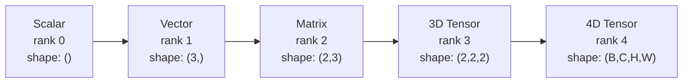
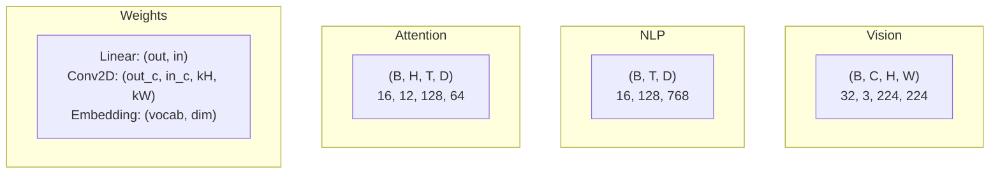
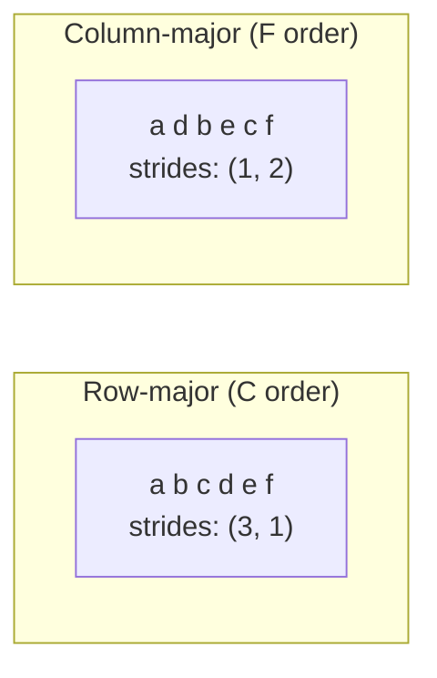
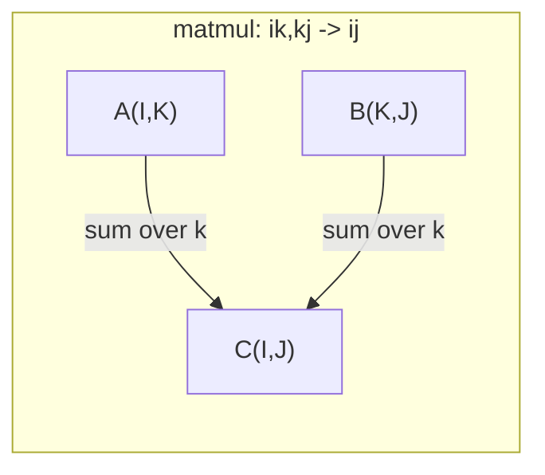

# Тензорные операции

> Тензоры — общий язык данных и deep learning. Каждое изображение, каждое предложение, каждый градиент проходит через них.

**Тип:** Практика
**Язык:** Python
**Предварительные требования:** Фаза 1, уроки 01 (интуиция линейной алгебры), 02 (векторы, матрицы и операции)
**Время:** ~90 минут

## Цели обучения

- Реализовать класс tensor с shape, strides, reshape, transpose и поэлементными операциями с нуля
- Применять правила broadcasting для операций над тензорами разных форм без копирования данных
- Писать einsum-выражения для скалярного произведения, матричного умножения, внешнего произведения и batch-операций
- Проследить точные формы тензоров на каждом шаге multi-head attention

## Проблема

Вы строите transformer. Прямой проход выглядит чисто. Вы запускаете его и получаете: `RuntimeError: mat1 and mat2 shapes cannot be multiplied (32x768 and 512x768)`. Вы смотрите на shapes. Пробуете transpose. Теперь ошибка говорит: `Expected 4D input (got 3D input)`. Вы добавляете unsqueeze. Ломается что-то еще.

Ошибки форм — самая частая ошибка в коде deep learning. Концептуально они не сложны: у каждой операции есть контракт формы. Но они быстро размножаются. В transformer десятки reshape, transpose и broadcast связаны в цепочку. Одна неправильная ось — и ошибка распространяется дальше. Хуже того, некоторые ошибки форм вообще не выбрасывают исключений. Они тихо производят мусор, выполняя broadcasting по неправильному измерению или суммируя по неправильной оси.

Матрицы описывают попарные отношения между двумя наборами сущностей. Реальные данные не помещаются в два измерения. Батч из 32 RGB-изображений 224x224 — это 4D tensor: `(32, 3, 224, 224)`. Self-attention с 12 heads — тоже 4D: `(batch, heads, seq_len, head_dim)`. Вам нужна структура данных, которая обобщается на любое число измерений, с операциями, которые аккуратно композиционируются во всех этих измерениях. Эта структура — tensor. Освойте его операции, и ошибки shapes станут тривиально отлаживаемыми.

## Концепция

### Что такое tensor

Tensor — это многомерный массив чисел с единым типом данных. Число измерений называется **rank** (или **order**). Каждое измерение — это **axis**. **Shape** — это кортеж, перечисляющий размер вдоль каждой axis.



Общее число элементов = произведение всех размеров. Shape `(2, 3, 4)` содержит `2 * 3 * 4 = 24` элемента.

### Формы тензоров в deep learning

Разные типы данных по соглашению сопоставляются с конкретными tensor shapes.



PyTorch использует NCHW (channels-first). TensorFlow по умолчанию использует NHWC (channels-last). Несовпадающие layouts вызывают незаметные замедления или ошибки.

### Как работает layout в памяти

2D-массив в памяти — это 1D-последовательность байтов. **Strides** говорят, сколько элементов нужно пропустить, чтобы перейти на один шаг вдоль каждой axis.



Transpose не перемещает данные. Он меняет strides местами, делая tensor **non-contiguous**: элементы строки больше не лежат рядом в памяти.

### Правила broadcasting

Broadcasting позволяет выполнять операции над тензорами разных shapes без копирования данных. Выравнивайте shapes справа. Два измерения совместимы, если они равны или одно из них равно 1. Недостающие измерения дополняются единицами слева.

```
Tensor A:     (8, 1, 6, 1)
Tensor B:        (7, 1, 5)
Padded B:     (1, 7, 1, 5)
Result:       (8, 7, 6, 5)
```

### Einsum: универсальная тензорная операция

Соглашение суммирования Эйнштейна помечает каждую axis буквой. Axis, которые есть во входе, но отсутствуют в выходе, суммируются. Axis, которые есть и там и там, сохраняются.



Ключевые паттерны: `i,i->` (скалярное произведение), `i,j->ij` (внешнее произведение), `ii->` (след), `ij->ji` (transpose), `bij,bjk->bik` (batch matmul), `bhtd,bhsd->bhts` (attention scores).

## Реализуйте

Код находится в `code/tensors.py`. Каждый шаг ссылается на реализацию там.

### Шаг 1: хранение tensor и strides

Tensor хранит плоский список чисел плюс метаданные shape. Strides говорят логике индексирования, как отображать многомерные индексы в плоские позиции.

```python
class Tensor:
    def __init__(self, data, shape=None):
        if isinstance(data, (list, tuple)):
            self._data, self._shape = self._flatten_nested(data)
        elif isinstance(data, np.ndarray):
            self._data = data.flatten().tolist()
            self._shape = tuple(data.shape)
        else:
            self._data = [data]
            self._shape = ()

        if shape is not None:
            total = reduce(lambda a, b: a * b, shape, 1)
            if total != len(self._data):
                raise ValueError(
                    f"Cannot reshape {len(self._data)} elements into shape {shape}"
                )
            self._shape = tuple(shape)

        self._strides = self._compute_strides(self._shape)

    @staticmethod
    def _compute_strides(shape):
        if len(shape) == 0:
            return ()
        strides = [1] * len(shape)
        for i in range(len(shape) - 2, -1, -1):
            strides[i] = strides[i + 1] * shape[i + 1]
        return tuple(strides)
```

Для shape `(3, 4)` strides равны `(4, 1)`: пропустить 4 элемента, чтобы перейти на одну строку, и 1 элемент, чтобы перейти на один столбец.

### Шаг 2: reshape, squeeze, unsqueeze

Reshape меняет shape, не меняя порядок элементов. Общее число элементов должно оставаться тем же. Используйте `-1` для одного измерения, чтобы вывести его размер автоматически.

```python
t = Tensor(list(range(12)), shape=(2, 6))
r = t.reshape((3, 4))
r = t.reshape((-1, 3))
```

Squeeze удаляет axes размера 1. Unsqueeze вставляет одну axis. Unsqueeze критически важен для broadcasting: bias vector `(D,)`, добавляемый к batch `(B, T, D)`, нужно расширить до `(1, 1, D)`.

```python
t = Tensor(list(range(6)), shape=(1, 3, 1, 2))
s = t.squeeze()
v = Tensor([1, 2, 3])
u = v.unsqueeze(0)
```

### Шаг 3: transpose и permute

Transpose меняет местами две axes. Permute переупорядочивает все axes. Так вы конвертируете NCHW в NHWC и обратно.

```python
mat = Tensor(list(range(6)), shape=(2, 3))
tr = mat.transpose(0, 1)

t4d = Tensor(list(range(24)), shape=(1, 2, 3, 4))
perm = t4d.permute((0, 2, 3, 1))
```

После transpose или permute tensor становится non-contiguous в памяти. В PyTorch `view` падает на non-contiguous tensors: используйте `reshape` или сначала вызовите `.contiguous()`.

### Шаг 4: поэлементные операции и reductions

Поэлементные операции (сложение, умножение, вычитание) применяются независимо к каждому элементу и сохраняют shape. Reductions (sum, mean, max) схлопывают одну или несколько axes.

```python
a = Tensor([[1, 2], [3, 4]])
b = Tensor([[10, 20], [30, 40]])
c = a + b
d = a * 2
s = a.sum(axis=0)
```

Глобальный average pooling в CNN: `(B, C, H, W).mean(axis=[2, 3])` дает `(B, C)`. Усреднение последовательности в NLP: `(B, T, D).mean(axis=1)` дает `(B, D)`.

### Шаг 5: broadcasting с NumPy

Функция `demo_broadcasting_numpy()` в `tensors.py` показывает основные паттерны.

```python
activations = np.random.randn(4, 3)
bias = np.array([0.1, 0.2, 0.3])
result = activations + bias

images = np.random.randn(2, 3, 4, 4)
scale = np.array([0.5, 1.0, 1.5]).reshape(1, 3, 1, 1)
result = images * scale

a = np.array([1, 2, 3]).reshape(-1, 1)
b = np.array([10, 20, 30, 40]).reshape(1, -1)
outer = a * b
```

Попарное расстояние через broadcasting: преобразуйте `(M, 2)` в `(M, 1, 2)` и `(N, 2)` в `(1, N, 2)`, вычтите, возведите в квадрат, просуммируйте по последней axis, возьмите квадратный корень. Результат: `(M, N)`.

### Шаг 6: операции einsum

Функции `demo_einsum()` и `demo_einsum_gallery()` проходят по всем распространенным паттернам.

```python
a = np.array([1.0, 2.0, 3.0])
b = np.array([4.0, 5.0, 6.0])
dot = np.einsum("i,i->", a, b)

A = np.array([[1, 2], [3, 4], [5, 6]], dtype=float)
B = np.array([[7, 8, 9], [10, 11, 12]], dtype=float)
matmul = np.einsum("ik,kj->ij", A, B)

batch_A = np.random.randn(4, 3, 5)
batch_B = np.random.randn(4, 5, 2)
batch_mm = np.einsum("bij,bjk->bik", batch_A, batch_B)
```

Вычислительная стоимость contraction — произведение размеров всех индексов (сохраняемых и суммируемых). Для `bij,bjk->bik` с B=32, I=128, J=64, K=128: `32 * 128 * 64 * 128 = 33,554,432` операций умножения-сложения.

### Шаг 7: attention mechanism через einsum

Функция `demo_attention_einsum()` реализует multi-head attention от начала до конца.

```python
B, H, T, D = 2, 4, 8, 16
E = H * D

X = np.random.randn(B, T, E)
W_q = np.random.randn(E, E) * 0.02

Q = np.einsum("bte,ek->btk", X, W_q)
Q = Q.reshape(B, T, H, D).transpose(0, 2, 1, 3)

scores = np.einsum("bhtd,bhsd->bhts", Q, K) / np.sqrt(D)
weights = softmax(scores, axis=-1)
attn_output = np.einsum("bhts,bhsd->bhtd", weights, V)

concat = attn_output.transpose(0, 2, 1, 3).reshape(B, T, E)
output = np.einsum("bte,ek->btk", concat, W_o)
```

Каждый шаг — tensor operation: проекция (matmul через einsum), разбиение на heads (reshape + transpose), attention scores (batch matmul через einsum), взвешенная сумма (batch matmul через einsum), объединение heads (transpose + reshape), выходная проекция (matmul через einsum).

### Ожидаемый вывод

Запустите `code/tensors.py` — последние строки должны быть такими:

```
--- Global Average Pooling (vision) ---
  Feature map: (2, 64, 7, 7)
  After GAP:   (2, 64)

--- Sequence mean pooling (NLP) ---
  Hidden states: (4, 128, 768)
  Mask:          (4, 128, 1)
  Pooled:        (4, 768)
```

## Используйте

### Реализация с нуля и NumPy

| Операция | Реализация с нуля (класс Tensor) | NumPy |
|---|---|---|
| Создание | `Tensor([[1,2],[3,4]])` | `np.array([[1,2],[3,4]])` |
| Reshape | `t.reshape((3,4))` | `a.reshape(3,4)` |
| Transpose | `t.transpose(0,1)` | `a.T` или `a.transpose(0,1)` |
| Squeeze | `t.squeeze(0)` | `np.squeeze(a, 0)` |
| Сумма | `t.sum(axis=0)` | `a.sum(axis=0)` |
| Einsum | Нет | `np.einsum("ij,jk->ik", a, b)` |

### Реализация с нуля и PyTorch

```python
import torch

t = torch.tensor([[1, 2, 3], [4, 5, 6]], dtype=torch.float32)
t.shape
t.stride()
t.is_contiguous()

t.reshape(3, 2)
t.unsqueeze(0)
t.transpose(0, 1)
t.transpose(0, 1).contiguous()

torch.einsum("ik,kj->ij", A, B)
```

PyTorch добавляет autograd, поддержку GPU и оптимизированные BLAS kernels. Семантика shapes идентична. Если вы понимаете реализацию с нуля, ошибки shapes в PyTorch становятся читаемыми.

### Каждый слой нейронной сети как tensor operation

| Операция | Форма tensor | Einsum |
|---|---|---|
| Линейный слой | `Y = X @ W.T + b` | `"bd,od->bo"` + bias |
| QKV для attention | `Q = X @ W_q` | `"btd,dh->bth"` |
| Attention scores (оценки внимания) | `Q @ K.T / sqrt(d)` | `"bhtd,bhsd->bhts"` |
| Выход attention (внимания) | `softmax(scores) @ V` | `"bhts,bhsd->bhtd"` |
| Batch norm | `(X - mu) / sigma * gamma` | поэлементно + broadcast |
| Softmax | `exp(x) / sum(exp(x))` | поэлементно + reduction |

## Итоговые артефакты

Этот урок создает два переиспользуемых prompts:

1. **`outputs/prompt-tensor-shapes.md`** — системный prompt для отладки несовпадений tensor shapes. Включает таблицы решений для каждой распространенной операции (matmul, broadcast, cat, Linear, Conv2d, BatchNorm, softmax) и таблицу поиска исправлений.

2. **`outputs/prompt-tensor-debugger.md`** — пошаговый prompt для отладки, который вы вставляете в любого AI assistant, когда ошибка shape вас блокирует. Дайте ему сообщение об ошибке и ваши tensor shapes, получите точное исправление.

## Упражнения

1. **Легко — round-trip для reshape.** Возьмите tensor shape `(2, 3, 4)`. Преобразуйте его в `(6, 4)`, затем в `(24,)`, затем обратно в `(2, 3, 4)`. Проверьте, что порядок элементов сохраняется на каждом шаге, распечатав плоские данные.

2. **Средне — реализуйте broadcasting.** Расширьте класс `Tensor` методом `broadcast_to(shape)`, который расширяет измерения размера 1 до целевого shape. Затем измените `_elementwise_op`, чтобы она автоматически выполняла broadcasting перед операцией. Проверьте на shapes `(3, 1)` и `(1, 4)`, получая `(3, 4)`.

3. **Сложно — соберите einsum с нуля.** Реализуйте базовую функцию `einsum(subscripts, *tensors)`, которая поддерживает хотя бы: скалярное произведение (`i,i->`), матричное умножение (`ij,jk->ik`), внешнее произведение (`i,j->ij`) и transpose (`ij->ji`). Разберите строку subscripts, найдите суммируемые индексы и пройдите циклом по всем комбинациям индексов. Сравните результаты с `np.einsum`.

4. **Сложно — трекер shapes для attention.** Напишите функцию, которая принимает `batch_size`, `seq_len`, `embed_dim` и `num_heads` и печатает точный shape на каждом шаге multi-head attention: вход, Q/K/V projection, разделение heads, attention scores, веса softmax, взвешенная сумма, объединение heads, выходная проекция. Сверьте с выводом `demo_attention_einsum()`.

## Ключевые термины

| Термин | Как обычно говорят | Что это на самом деле значит |
|---|---|---|
| Tensor | "Матрица, но с большим числом измерений" | Многомерный массив с единым типом, заданными shape, strides и операциями |
| Rank | "Число измерений" | Число axes. У матрицы rank 2, а не rank, равный ее matrix rank |
| Shape | "Размер tensor" | Кортеж, перечисляющий размер вдоль каждой axis. `(2, 3)` означает 2 строки, 3 столбца |
| Stride | "Как разложена память" | Число элементов, которые нужно пропустить, чтобы продвинуться на одну позицию вдоль каждой axis |
| Broadcasting | "Оно просто работает, когда shapes разные" | Строгий набор правил: выравнивать справа, измерения должны быть равны или одно из них должно быть 1 |
| Contiguous | "Tensor нормальный" | Элементы хранятся последовательно в памяти без пропусков или переупорядочивания относительно логического layout |
| Einsum | "Модный способ написать matmul" | Общая нотация, которая выражает любую tensor contraction, внешнее произведение, след или transpose в одну строку |
| View | "То же, что reshape" | Tensor, разделяющий тот же буфер памяти, но с другими метаданными shape/stride. Падает на non-contiguous data |
| Contraction | "Суммирование по индексу" | Общая операция, где общий индекс между tensors перемножается и суммируется, давая результат меньшего rank |
| NCHW / NHWC | "Формат PyTorch vs TensorFlow" | Соглашения layout памяти для image tensors. NCHW ставит channels перед пространственными измерениями, NHWC — после |

## Дополнительные материалы

- [NumPy Broadcasting](https://numpy.org/doc/stable/user/basics.broadcasting.html) — канонические правила с визуальными примерами
- [PyTorch Tensor Views](https://pytorch.org/docs/stable/tensor_view.html) — когда views работают и когда они копируют
- [einops](https://github.com/arogozhnikov/einops) — библиотека, которая делает tensor reshaping читаемым и безопасным
- [The Illustrated Transformer](https://jalammar.github.io/illustrated-transformer/) — визуализирует tensor shapes, проходящие через attention
- [Einstein Summation in NumPy](https://numpy.org/doc/stable/reference/generated/numpy.einsum.html) — полная документация einsum с примерами
