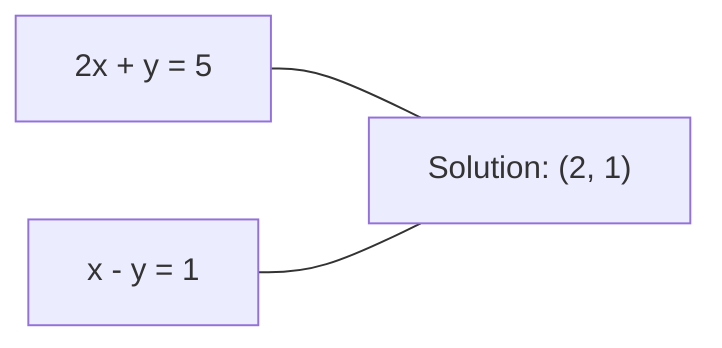
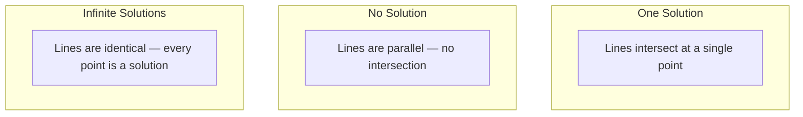

# Линейные системы

> Решение Ax = b — старейшая задача математики, которая все еще запускает вашу нейросеть.

**Тип:** Практика
**Язык:** Python
**Предварительные требования:** Фаза 1, уроки 01 (интуиция линейной алгебры), 02 (векторы и матрицы), 03 (матричные преобразования)
**Время:** ~120 минут

## Цели обучения

- Решать Ax = b методом Gaussian elimination с partial pivoting и обратной подстановкой
- Раскладывать матрицы с помощью разложений LU, QR и Cholesky и объяснять, когда какое разложение уместно
- Выводить normal equations для least squares и связывать их с linear и ridge regression
- Диагностировать плохо обусловленные системы с помощью condition number и применять regularization для стабилизации

## Проблема

Каждый раз, когда вы обучаете linear regression, вы решаете линейную систему. Каждый раз, когда вы вычисляете least-squares fit, вы решаете линейную систему. Каждый раз, когда слой нейросети вычисляет `y = Wx + b`, он оценивает одну сторону линейной системы. Когда вы добавляете regularization, вы меняете систему. Когда вы используете Gaussian processes, вы факторизуете матрицу. Когда вы инвертируете матрицу ковариации для расстояния Махаланобиса, вы решаете линейную систему.

Уравнение Ax = b встречается везде. A — матрица известных коэффициентов. b — вектор известных результатов. x — вектор неизвестных, которые нужно найти. В linear regression A — ваша матрица данных, b — целевой вектор, а x — вектор весов. Вся модель сводится к следующему: найти x такой, чтобы Ax был как можно ближе к b.

Этот урок строит с нуля все основные методы решения этого уравнения. Вы поймете, почему одни методы быстрые, а другие устойчивые, почему одни работают только для квадратных систем, а другие справляются с переопределенными, и почему condition number вашей матрицы определяет, имеет ли ответ какой-либо смысл.

## Концепция

### Что Ax = b означает геометрически

Система линейных уравнений имеет геометрическую интерпретацию. Каждое уравнение задает гиперплоскость. Решение — это точка (или множество точек), где все гиперплоскости пересекаются.

```
2x + y = 5          Two lines in 2D.
x - y  = 1          They intersect at x=2, y=1.
```



Могут произойти три вещи:



В матричной форме «одно решение» означает, что A обратима. «Нет решения» означает, что система несовместна. «Бесконечно много решений» означает, что у A есть null space. Большинство ML-задач попадает в категорию «нет точного решения», потому что у вас больше уравнений (точек данных), чем неизвестных (параметров). Здесь и нужны least squares.

### Картина по столбцам и строкам

Есть два способа читать Ax = b.

**Картина по строкам.** Каждая строка A задает одно уравнение. Каждое уравнение — гиперплоскость. Решение находится там, где они все пересекаются.

**Картина по столбцам.** Каждый столбец A — это вектор. Вопрос становится таким: какая линейная комбинация столбцов A дает b?

```
A = | 2  1 |    b = | 5 |
    | 1 -1 |        | 1 |

Row picture: solve 2x + y = 5 and x - y = 1 simultaneously.

Column picture: find x1, x2 such that:
  x1 * [2, 1] + x2 * [1, -1] = [5, 1]
  2 * [2, 1] + 1 * [1, -1] = [4+1, 2-1] = [5, 1]   check.
```

Картина по столбцам более фундаментальна. Если b лежит в пространстве столбцов A, система имеет решение. Если b там не лежит, вы ищете ближайшую точку в пространстве столбцов. Эта ближайшая точка и есть решение least squares.

### Gaussian elimination

Gaussian elimination преобразует Ax = b в верхнетреугольную систему Ux = c, которую вы решаете обратной подстановкой. Это самый прямой метод.

Алгоритм:

```
1. For each column k (the pivot column):
   a. Find the largest entry in column k at or below row k (partial pivoting).
   b. Swap that row with row k.
   c. For each row i below k:
      - Compute multiplier m = A[i][k] / A[k][k]
      - Subtract m times row k from row i.
2. Back substitute: solve from the last equation upward.
```

Пример:

```
Original:
| 2  1  1 | 8 |       R2 = R2 - (2)R1     | 2  1   1 |  8 |
| 4  3  3 |20 |  -->  R3 = R3 - (1)R1 --> | 0  1   1 |  4 |
| 2  3  1 |12 |                            | 0  2   0 |  4 |

                       R3 = R3 - (2)R2     | 2  1   1 |  8 |
                                       --> | 0  1   1 |  4 |
                                           | 0  0  -2 | -4 |

Back substitute:
  -2 * x3 = -4    -->  x3 = 2
  x2 + 2  = 4     -->  x2 = 2
  2*x1 + 2 + 2 = 8 --> x1 = 2
```

Gaussian elimination требует O(n^3) операций. Для системы 1000x1000 это примерно миллиард операций с плавающей точкой. Быстро, но можно лучше, если нужно решать несколько систем с одной и той же A.

### Partial pivoting: почему это важно

Без pivoting Gaussian elimination может упасть или выдать мусор. Если pivot element равен нулю, вы делите на ноль. Если он мал, вы усиливаете ошибки округления.

```
Bad pivot:                       With partial pivoting:
| 0.001  1 | 1.001 |            Swap rows first:
| 1      1 | 2     |            | 1      1 | 2     |
                                 | 0.001  1 | 1.001 |
m = 1/0.001 = 1000              m = 0.001/1 = 0.001
R2 = R2 - 1000*R1               R2 = R2 - 0.001*R1
| 0.001  1     | 1.001   |      | 1      1     | 2     |
| 0     -999   | -999.0  |      | 0      0.999 | 0.999 |

x2 = 1.000 (correct)            x2 = 1.000 (correct)
x1 = (1.001 - 1)/0.001          x1 = (2 - 1)/1 = 1.000 (correct)
   = 0.001/0.001 = 1.000        Stable because the multiplier is small.
```

В арифметике с плавающей точкой и ограниченной точностью версия без pivoting может потерять значащие цифры. Partial pivoting всегда выбирает наибольший доступный pivot, чтобы минимизировать усиление ошибки.

### LU decomposition

LU decomposition факторизует A в нижнетреугольную матрицу L и верхнетреугольную матрицу U: A = LU. Матрица L хранит множители из Gaussian elimination. Матрица U — результат исключения.

```
A = L @ U

| 2  1  1 |   | 1  0  0 |   | 2  1   1 |
| 4  3  3 | = | 2  1  0 | @ | 0  1   1 |
| 2  3  1 |   | 1  2  1 |   | 0  0  -2 |
```

Зачем факторизовать вместо простого исключения? Потому что когда L и U уже есть, решение Ax = b для любого нового b стоит только O(n^2):

```
Ax = b
LUx = b
Let y = Ux:
  Ly = b    (forward substitution, O(n^2))
  Ux = y    (back substitution, O(n^2))
```

Стоимость O(n^3) платится один раз при факторизации. Каждое последующее решение стоит O(n^2). Если нужно решить 1000 систем с одной и той же A, но разными векторами b, LU экономит примерно фактор 1000/3 в общей работе.

С partial pivoting получается PA = LU, где P — матрица перестановок, записывающая перестановки строк.

### QR decomposition

QR decomposition факторизует A в ортогональную матрицу Q и верхнетреугольную матрицу R: A = QR.

Ортогональная матрица имеет свойство Q^T Q = I. Ее столбцы — ортонормированные векторы. Умножение на Q сохраняет длины и углы.

```
A = Q @ R

Q has orthonormal columns: Q^T Q = I
R is upper triangular

To solve Ax = b:
  QRx = b
  Rx = Q^T b    (just multiply by Q^T, no inversion needed)
  Back substitute to get x.
```

QR численно устойчивее, чем LU, для решения задач least squares. Процесс Gram-Schmidt строит Q столбец за столбцом:

```
Given columns a1, a2, ... of A:

q1 = a1 / ||a1||

q2 = a2 - (a2 . q1) * q1        (subtract projection onto q1)
q2 = q2 / ||q2||                (normalize)

q3 = a3 - (a3 . q1) * q1 - (a3 . q2) * q2
q3 = q3 / ||q3||

R[i][j] = qi . aj    for i <= j
```

Каждый шаг удаляет компоненту вдоль всех предыдущих векторов q, оставляя только новое ортогональное направление.

### Cholesky decomposition

Когда A симметрична (A = A^T) и positive definite (все собственные значения положительные), ее можно факторизовать как A = L L^T, где L нижнетреугольная. Это Cholesky decomposition.

```
A = L @ L^T

| 4  2 |   | 2  0 |   | 2  1 |
| 2  5 | = | 1  2 | @ | 0  2 |

L[i][i] = sqrt(A[i][i] - sum(L[i][k]^2 for k < i))
L[i][j] = (A[i][j] - sum(L[i][k]*L[j][k] for k < j)) / L[j][j]    for i > j
```

Cholesky вдвое быстрее LU и требует вдвое меньше памяти. Он работает только для symmetric positive definite matrices, но они встречаются постоянно:

- Матрицы ковариации являются symmetric positive semi-definite (positive definite с regularization).
- Kernel matrix в Gaussian processes является symmetric positive definite.
- Hessian выпуклой функции в минимуме является symmetric positive definite.
- A^T A всегда является symmetric positive semi-definite.

В Gaussian processes вы факторизуете kernel matrix K с Cholesky, затем решаете K alpha = y, чтобы получить predictive mean. Фактор Cholesky также дает log-determinant для marginal likelihood: log det(K) = 2 * sum(log(diag(L))).

### Least squares: когда у Ax = b нет точного решения

Если A имеет размер m x n при m > n (уравнений больше, чем неизвестных), система переопределена. Точного решения нет. Вместо этого минимизируется квадратичная ошибка:

```
minimize ||Ax - b||^2

This is the sum of squared residuals:
  sum((A[i,:] @ x - b[i])^2 for i in range(m))
```

Минимизатор удовлетворяет normal equations:

```
A^T A x = A^T b
```

Вывод: раскройте ||Ax - b||^2 = (Ax - b)^T (Ax - b) = x^T A^T A x - 2 x^T A^T b + b^T b. Возьмите градиент по x и приравняйте к нулю: 2 A^T A x - 2 A^T b = 0.

```
Original system (overdetermined, 4 equations, 2 unknowns):
| 1  1 |         | 3 |
| 1  2 | x     = | 5 |       No exact x satisfies all 4 equations.
| 1  3 |         | 6 |
| 1  4 |         | 8 |

Normal equations:
A^T A = | 4  10 |    A^T b = | 22 |
        | 10 30 |            | 63 |

Solve: x = [1.5, 1.7]

This is linear regression. x[0] is the intercept, x[1] is the slope.
```

### Normal equations = linear regression

Связь точная. В linear regression ваша матрица данных X имеет одну строку на сэмпл и один столбец на признак. Целевой вектор y имеет один элемент на сэмпл. Вектор весов w удовлетворяет:

```
X^T X w = X^T y
w = (X^T X)^(-1) X^T y
```

Это аналитическое решение для linear regression. Каждый вызов `sklearn.linear_model.LinearRegression.fit()` вычисляет это (или эквивалент через QR или SVD).

Добавьте член регуляризации lambda * I к матрице, и получите ridge regression:

```
(X^T X + lambda * I) w = X^T y
w = (X^T X + lambda * I)^(-1) X^T y
```

Regularization делает матрицу лучше обусловленной (проще точно инвертировать) и предотвращает overfitting, сжимая веса к нулю. Матрица X^T X + lambda * I всегда symmetric positive definite при lambda > 0, поэтому для ее решения можно использовать Cholesky.

### Pseudoinverse (Moore-Penrose)

Pseudoinverse A+ обобщает обращение матрицы на неквадратные и вырожденные матрицы. Для любой матрицы A:

```
x = A+ b

where A+ = V Sigma+ U^T    (computed via SVD)
```

Sigma+ строится взятием обратного значения каждого ненулевого сингулярного значения и транспонированием результата. Если A = U Sigma V^T, то A+ = V Sigma+ U^T.

```
A = U Sigma V^T        (SVD)

Sigma = | 5  0 |       Sigma+ = | 1/5  0  0 |
        | 0  2 |                | 0  1/2  0 |
        | 0  0 |

A+ = V Sigma+ U^T
```

Pseudoinverse дает minimum-norm least-squares solution. Если система имеет:
- Одно решение: A+ b дает его.
- Нет решения: A+ b дает least-squares solution.
- Бесконечно много решений: A+ b дает то, у которого минимальная ||x||.

`np.linalg.lstsq` и `np.linalg.pinv` в NumPy оба используют SVD внутри.

### Condition number

Condition number измеряет, насколько чувствительно решение к малым изменениям входа. Для матрицы A condition number равен:

```
kappa(A) = ||A|| * ||A^(-1)|| = sigma_max / sigma_min
```

где sigma_max и sigma_min — наибольшее и наименьшее сингулярные значения.

```
Well-conditioned (kappa ~ 1):        Ill-conditioned (kappa ~ 10^15):
Small change in b -->                Small change in b -->
small change in x                    huge change in x

| 2  0 |   kappa = 2/1 = 2          | 1   1          |   kappa ~ 10^15
| 0  1 |   safe to solve            | 1   1+10^(-15) |   solution is garbage
```

Практические правила:
- kappa < 100: безопасно, решение точное.
- kappa ~ 10^k: вы теряете примерно k цифр точности из арифметики с плавающей точкой.
- kappa ~ 10^16 (для float64): решение бессмысленно. Матрица фактически вырождена.

В ML ill-conditioning возникает, когда признаки почти коллинеарны. Regularization (добавление lambda * I) улучшает condition number с sigma_max / sigma_min до (sigma_max + lambda) / (sigma_min + lambda).

### Итерационные методы: conjugate gradient

Для очень больших sparse systems (миллионы неизвестных) прямые методы вроде LU или Cholesky слишком дорогие. Итерационные методы приближают решение, улучшая догадку за много итераций.

Conjugate gradient (CG) решает Ax = b, когда A symmetric positive definite. В точной арифметике он находит точное решение максимум за n итераций, но обычно сходится гораздо быстрее, если собственные значения A сгруппированы.

```
Algorithm sketch:
  x0 = initial guess (often zero)
  r0 = b - A x0           (residual)
  p0 = r0                 (search direction)

  For k = 0, 1, 2, ...:
    alpha = (rk . rk) / (pk . A pk)
    x_{k+1} = xk + alpha * pk
    r_{k+1} = rk - alpha * A pk
    beta = (r_{k+1} . r_{k+1}) / (rk . rk)
    p_{k+1} = r_{k+1} + beta * pk
    if ||r_{k+1}|| < tolerance: stop
```

CG используется в:
- Крупномасштабной оптимизации (Newton-CG method)
- Решении дискретизаций PDE
- Kernel methods, где kernel matrix слишком велика для факторизации
- Preconditioning для других iterative solvers

Скорость сходимости зависит от condition number. Лучше обусловленные системы сходятся быстрее, и это еще одна причина, почему regularization помогает.

### Полная картина: какой метод когда использовать

| Метод | Требования | Стоимость | Сценарий использования |
|--------|-------------|------|----------|
| Gaussian elimination | Квадратная невырожденная A | O(n^3) | Однократное решение квадратной системы |
| LU decomposition | Квадратная невырожденная A | O(n^3) factor + O(n^2) solve | Несколько решений с одной и той же A |
| QR decomposition | Любая A (m >= n) | O(mn^2) | Least squares, численная устойчивость |
| Cholesky | Symmetric positive definite A | O(n^3/3) | Covariance matrices, Gaussian processes, ridge regression |
| Normal equations | Переопределенная (m > n) | O(mn^2 + n^3) | Linear regression при малом n |
| SVD / pseudoinverse | Любая A | O(mn^2) | Rank-deficient systems, решения с минимальной нормой |
| Conjugate gradient | Symmetric positive definite, sparse A | O(n * k * nnz) | Большие разреженные системы, k = число итераций |

### Связь с ML

Каждый метод из этого урока встречается в production ML:

**Linear regression.** Аналитическое решение решает normal equations X^T X w = X^T y. Это делается через Cholesky (если n мало), QR (если важна численная устойчивость) или SVD (если матрица может быть rank-deficient).

**Ridge regression.** Добавляет lambda * I к X^T X. Регуляризованная система (X^T X + lambda * I) w = X^T y всегда решается через Cholesky, потому что X^T X + lambda * I symmetric positive definite при lambda > 0.

**Gaussian processes.** Predictive mean требует решить K alpha = y, где K — kernel matrix. Факторизация K через Cholesky — стандартный подход. Log marginal likelihood использует log det(K) = 2 sum(log(diag(L))).

**Инициализация нейросетей.** Orthogonal initialization использует QR decomposition для создания матриц весов, столбцы которых ортонормированы. Это предотвращает затухание или взрыв сигнала в глубоких сетях.

**Preconditioning.** Large-scale optimizers используют incomplete Cholesky или incomplete LU как preconditioners для conjugate gradient solvers.

**Feature engineering.** Condition number of X^T X показывает, есть ли коллинеарность у признаков. Если kappa велик, удалите признаки или добавьте regularization.

## Сборка

### Шаг 1: Gaussian elimination с partial pivoting

```python
import numpy as np

def gaussian_elimination(A, b):
    n = len(b)
    Ab = np.hstack([A.astype(float), b.reshape(-1, 1).astype(float)])

    for k in range(n):
        max_row = k + np.argmax(np.abs(Ab[k:, k]))
        Ab[[k, max_row]] = Ab[[max_row, k]]

        if abs(Ab[k, k]) < 1e-12:
            raise ValueError(f"Matrix is singular or nearly singular at pivot {k}")

        for i in range(k + 1, n):
            m = Ab[i, k] / Ab[k, k]
            Ab[i, k:] -= m * Ab[k, k:]

    x = np.zeros(n)
    for i in range(n - 1, -1, -1):
        x[i] = (Ab[i, -1] - Ab[i, i+1:n] @ x[i+1:n]) / Ab[i, i]

    return x
```

### Шаг 2: LU decomposition

```python
def lu_decompose(A):
    n = A.shape[0]
    L = np.eye(n)
    U = A.astype(float).copy()
    P = np.eye(n)

    for k in range(n):
        max_row = k + np.argmax(np.abs(U[k:, k]))
        if max_row != k:
            U[[k, max_row]] = U[[max_row, k]]
            P[[k, max_row]] = P[[max_row, k]]
            if k > 0:
                L[[k, max_row], :k] = L[[max_row, k], :k]

        for i in range(k + 1, n):
            L[i, k] = U[i, k] / U[k, k]
            U[i, k:] -= L[i, k] * U[k, k:]

    return P, L, U

def lu_solve(P, L, U, b):
    n = len(b)
    Pb = P @ b.astype(float)

    y = np.zeros(n)
    for i in range(n):
        y[i] = Pb[i] - L[i, :i] @ y[:i]

    x = np.zeros(n)
    for i in range(n - 1, -1, -1):
        x[i] = (y[i] - U[i, i+1:] @ x[i+1:]) / U[i, i]

    return x
```

### Шаг 3: Cholesky decomposition

```python
def cholesky(A):
    n = A.shape[0]
    L = np.zeros_like(A, dtype=float)

    for i in range(n):
        for j in range(i + 1):
            s = A[i, j] - L[i, :j] @ L[j, :j]
            if i == j:
                if s <= 0:
                    raise ValueError("Matrix is not positive definite")
                L[i, j] = np.sqrt(s)
            else:
                L[i, j] = s / L[j, j]

    return L
```

### Шаг 4: Least squares через normal equations

```python
def least_squares_normal(A, b):
    AtA = A.T @ A
    Atb = A.T @ b
    return gaussian_elimination(AtA, Atb)

def ridge_regression(A, b, lam):
    n = A.shape[1]
    AtA = A.T @ A + lam * np.eye(n)
    Atb = A.T @ b
    L = cholesky(AtA)
    y = np.zeros(n)
    for i in range(n):
        y[i] = (Atb[i] - L[i, :i] @ y[:i]) / L[i, i]
    x = np.zeros(n)
    for i in range(n - 1, -1, -1):
        x[i] = (y[i] - L.T[i, i+1:] @ x[i+1:]) / L.T[i, i]
    return x
```

### Шаг 5: Condition number

```python
def condition_number(A):
    U, S, Vt = np.linalg.svd(A)
    return S[0] / S[-1]
```

## Использование

Соберем части вместе для linear regression и ridge regression на реальных данных:

```python
np.random.seed(42)
X_raw = np.random.randn(100, 3)
w_true = np.array([2.0, -1.0, 0.5])
y = X_raw @ w_true + np.random.randn(100) * 0.1

X = np.column_stack([np.ones(100), X_raw])

w_ols = least_squares_normal(X, y)
print(f"OLS weights (ours):    {w_ols}")

w_np = np.linalg.lstsq(X, y, rcond=None)[0]
print(f"OLS weights (numpy):   {w_np}")
print(f"Max difference: {np.max(np.abs(w_ols - w_np)):.2e}")

w_ridge = ridge_regression(X, y, lam=1.0)
print(f"Ridge weights (ours):  {w_ridge}")

from sklearn.linear_model import Ridge
ridge_sk = Ridge(alpha=1.0, fit_intercept=False)
ridge_sk.fit(X, y)
print(f"Ridge weights (sklearn): {ridge_sk.coef_}")
```

## Результат

Этот урок дает:
- `code/linear_systems.py`, содержащий реализации Gaussian elimination, LU decomposition, Cholesky decomposition, least squares и ridge regression с нуля
- Рабочую демонстрацию, что normal equations и sklearn LinearRegression дают одинаковые веса

## Упражнения

1. Решите систему `[[1,2,3],[4,5,6],[7,8,10]] x = [6, 15, 27]` с помощью вашего Gaussian elimination, вашего LU solver и `np.linalg.solve`. Проверьте, что все три дают один и тот же ответ в пределах допуска для чисел с плавающей точкой.

2. Сгенерируйте случайную матрицу X размера 50x5 и целевой вектор y = X @ w_true + noise. Найдите w через normal equations, QR (через `np.linalg.qr`), SVD (через `np.linalg.svd`) и `np.linalg.lstsq`. Сравните все четыре решения. Измерьте condition number матрицы X^T X и объясните, как он влияет на то, какому методу вы доверяете.

3. Создайте почти вырожденную матрицу, сделав два столбца почти одинаковыми (например, column 2 = column 1 + 1e-10 * noise). Вычислите ее condition number. Решите Ax = b с regularization и без нее (добавьте 0.01 * I). Сравните решения и residuals. Объясните, почему regularization помогает.

4. Реализуйте алгоритм conjugate gradient для случайной symmetric positive definite matrix размера 100x100. Посчитайте, сколько итераций нужно для сходимости до tolerance 1e-8. Сравните с теоретическим максимумом n итераций.

5. Измерьте время вашего Cholesky solver, вашего LU solver и `np.linalg.solve` на symmetric positive definite matrices размеров 10, 50, 200, 500. Постройте результаты. Проверьте, что Cholesky примерно в 2 раза быстрее LU.

## Ключевые термины

| Термин | Как говорят | Что это на самом деле означает |
|------|----------------|----------------------|
| Linear system | «Решить относительно x» | Набор линейных уравнений Ax = b. Найти x значит найти вход, который дает выход b под преобразованием A. |
| Gaussian elimination | «Привести строки» | Систематически занулять элементы ниже диагонали строковыми операциями, получая верхнетреугольную систему, решаемую обратной подстановкой. O(n^3). |
| Partial pivoting | «Переставить строки для устойчивости» | Перед elimination в столбце k поменять местами строку с наибольшим абсолютным значением в этом столбце и pivot position. Предотвращает деление на малые числа. |
| LU decomposition | «Разложить на треугольники» | Записать A = LU, где L нижнетреугольная (хранит множители), а U верхнетреугольная (eliminated matrix). Амортизирует стоимость O(n^3) на несколько решений. |
| QR decomposition | «Ортогональная факторизация» | Записать A = QR, где Q имеет ортонормированные столбцы, а R верхнетреугольная. Устойчивее LU для least squares. |
| Cholesky decomposition | «Квадратный корень из матрицы» | Для symmetric positive definite A записать A = LL^T. Половина стоимости LU. Используется для covariance matrices, kernel matrices и ridge regression. |
| Least squares | «Лучшее приближение, когда точное невозможно» | Минимизировать сумму квадратов остатков ||Ax - b||^2, когда система переопределена (уравнений больше, чем неизвестных). |
| Normal equations | «Краткий путь через calculus» | A^T A x = A^T b. Приравнивание градиента ||Ax - b||^2 к нулю. Это аналитическое решение для linear regression. |
| Pseudoinverse | «Инверсия для неквадратных матриц» | A+ = V Sigma+ U^T через SVD. Дает minimum-norm least-squares solution для любой матрицы: квадратной или прямоугольной, singular или нет. |
| Condition number | «Насколько этому ответу можно доверять» | kappa = sigma_max / sigma_min. Измеряет чувствительность к возмущениям входа. Теряется примерно log10(kappa) цифр точности. |
| Ridge regression | «Regularized least squares» | Решить (X^T X + lambda I) w = X^T y. Добавление lambda I улучшает conditioning и сжимает веса к нулю. Предотвращает overfitting. |
| Conjugate gradient | «Итеративное Ax=b для больших матриц» | Iterative solver для symmetric positive definite systems. Сходится максимум за n шагов. Практичен для больших разреженных систем, где factorization слишком дорогая. |
| Overdetermined system | «Данных больше, чем параметров» | m > n в системе m-by-n. Точного решения нет. Least squares находит лучшую аппроксимацию. Это любая regression problem. |
| Back substitution | «Решать снизу вверх» | В верхнетреугольной системе сначала решить последнее уравнение, затем подставлять назад. O(n^2). |
| Forward substitution | «Решать сверху вниз» | В нижнетреугольной системе сначала решить первое уравнение, затем подставлять вперед. O(n^2). Используется на шаге L в LU solves. |

## Дополнительное чтение

- [MIT 18.06: Linear Algebra](https://ocw.mit.edu/courses/18-06-linear-algebra-spring-2010/) (Gilbert Strang) -- главный курс по линейным системам и матричным факторизациям
- [Numerical Linear Algebra](https://people.maths.ox.ac.uk/trefethen/text.html) (Trefethen & Bau) -- стандартный справочник по численной устойчивости, conditioning и тому, почему алгоритмы ломаются
- [Matrix Computations](https://www.cs.cornell.edu/cv/GolubVanLoan4/golubandvanloan.htm) (Golub & Van Loan) -- энциклопедический справочник по всем матричным алгоритмам
- [3Blue1Brown: Inverse Matrices](https://www.3blue1brown.com/lessons/inverse-matrices) -- визуальная интуиция того, что означает решение Ax = b геометрически
