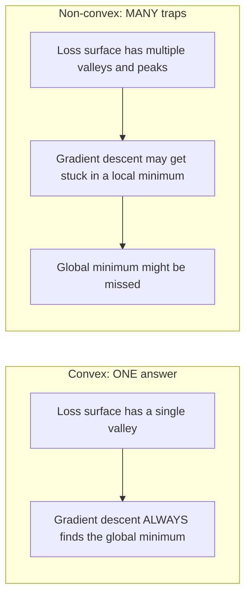
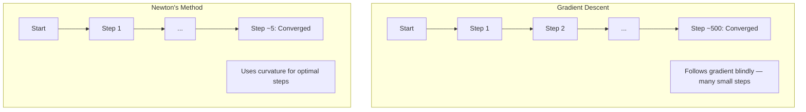
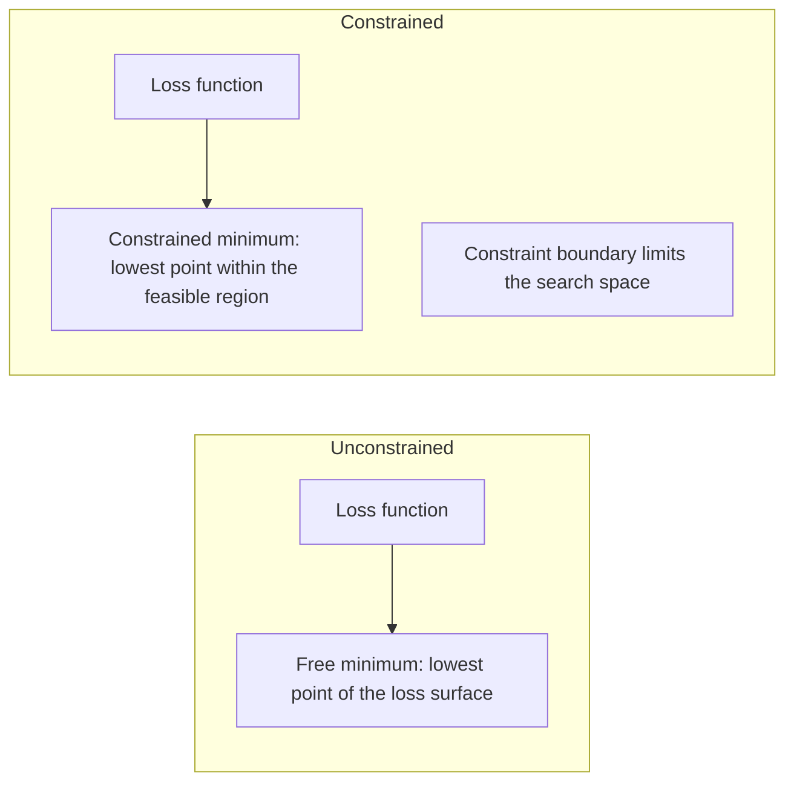
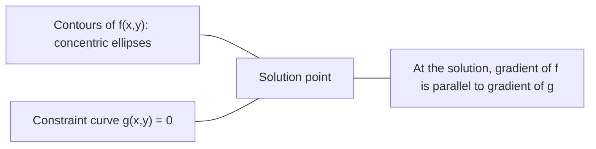

# Выпуклая оптимизация

> У выпуклых задач одна долина. У нейросетей — миллионы. Понимать разницу важно.

**Тип:** Практика
**Язык:** Python
**Предварительные требования:** Фаза 1, уроки 04 (Calculus for ML), 08 (Оптимизация)
**Время:** ~90 минут

## Цели обучения

- Проверять, является ли функция выпуклой, используя определение, вторую производную и критерий на основе Hessian
- Реализовать Newton's method и сравнить его квадратичную сходимость с gradient descent
- Решать задачи оптимизации с ограничениями с помощью множителей Лагранжа и интерпретировать условия KKT
- Объяснить, почему ландшафты функции потерь нейросетей невыпуклые, но SGD все равно находит хорошие решения

## Проблема

Урок 08 научил вас gradient descent, momentum и Adam. Эти оптимизаторы идут вниз по любой поверхности. Но они не дают гарантий. Gradient descent на невыпуклом ландшафте может попасть в плохой локальный минимум, застрять в седловой точке или колебаться бесконечно. Вы все равно использовали его, потому что нейросети невыпуклые и альтернативы нет.

Но многие задачи машинного обучения выпуклые. Linear regression, logistic regression, SVMs, LASSO, ridge regression. Для них есть нечто сильнее: оптимизация с математическими гарантиями. У выпуклой задачи ровно одна долина. Любой алгоритм, который идет вниз, достигнет глобального минимума. Не нужны перезапуски. Не нужны расписания learning rate. Не нужна вера.

Понимание выпуклости дает три вещи. Во-первых, оно говорит, когда ваша задача легкая (выпуклая), а когда тяжелая (невыпуклая). Во-вторых, оно дает более быстрые инструменты, например Newton's method для выпуклых задач. В-третьих, оно объясняет идеи, которые встречаются во всем ML: регуляризация как ограничение, двойственность в SVMs и почему deep learning работает, несмотря на нарушение всех приятных свойств, которые дает выпуклость.

## Концепция

### Выпуклые множества

Множество S выпукло, если для любых двух точек в S отрезок между ними тоже целиком лежит в S.

| Выпуклые множества | Невыпуклые |
|---|---|
| **Прямоугольник**: любые две точки внутри можно соединить отрезком, который остается внутри | **Звезда/полумесяц**: линия между двумя внутренними точками может выйти за пределы множества |
| **Треугольник**: то же свойство выполняется для всех внутренних точек | **Бублик/кольцо**: отверстие означает, что некоторые отрезки выходят из множества |
| Отрезок между любыми двумя точками остается внутри множества | Отрезок между некоторыми парами точек выходит из множества |

Формальный тест: для любых точек x, y в S и любого t из [0, 1] точка tx + (1-t)y тоже находится в S.

Примеры выпуклых множеств:
- Прямая, плоскость, все R^n
- Шар (окружность, сфера, гиперсфера)
- Полупространство: {x : a^T x <= b}
- Пересечение любого числа выпуклых множеств

Примеры невыпуклых множеств:
- Бублик (кольцо)
- Объединение двух непересекающихся окружностей
- Любое множество с «вмятиной» или «дырой»

### Выпуклые функции

Функция f выпукла, если ее область определения является выпуклым множеством и для любых двух точек x, y из этой области и любого t из [0, 1]:

```
f(tx + (1-t)y) <= t*f(x) + (1-t)*f(y)
```

Геометрически: отрезок между любыми двумя точками на графике лежит выше графика или на нем.

| Свойство | Выпуклая функция | Невыпуклая функция |
|---|---|---|
| **Тест отрезка** | Линия между любыми двумя точками на графике лежит **выше кривой или на ней** | Линия между некоторыми точками на графике проваливается **ниже** кривой |
| **Форма** | Одна чаша/долина, изгибающаяся вверх | Несколько пиков и долин со смешанной кривизной |
| **Локальные минимумы** | Каждый локальный минимум является глобальным минимумом | Может существовать несколько локальных минимумов на разных высотах |

Распространенные выпуклые функции:
- f(x) = x^2 (парабола)
- f(x) = |x| (модуль)
- f(x) = e^x (экспонента)
- f(x) = max(0, x) (ReLU, хотя функция кусочно-линейная)
- f(x) = -log(x) для x > 0 (отрицательный логарифм)
- Любая линейная функция f(x) = a^T x + b (одновременно выпуклая и вогнутая)

### Проверка выпуклости

Три практических теста, от самого простого до самого строгого.

**Тест 1: проверка второй производной (1D).** Если f''(x) >= 0 для всех x, то f выпукла.

- f(x) = x^2: f''(x) = 2 >= 0. Выпуклая.
- f(x) = x^3: f''(x) = 6x. Отрицательно при x < 0. Не выпуклая.
- f(x) = e^x: f''(x) = e^x > 0. Выпуклая.

**Тест 2: проверка Hessian (многомерный случай).** Если матрица Hessian H(x) положительно полуопределена для всех x, то f выпукла. Hessian — это матрица вторых частных производных.

**Тест 3: проверка по определению.** Проверить неравенство f(tx + (1-t)y) <= t*f(x) + (1-t)*f(y) напрямую. Полезно для функций, где производные сложно вычислить.

### Почему выпуклость важна

Центральная теорема выпуклой оптимизации:

**Для выпуклой функции каждый локальный минимум является глобальным минимумом.**

Это значит, что gradient descent не может попасть в ловушку. Любой путь вниз ведет к одному и тому же ответу. Алгоритм гарантированно сходится к оптимальному решению.



Следствия:
- Не нужны случайные перезапуски
- Не нужны сложные расписания learning rate
- Возможны доказательства сходимости (скорость зависит от свойств функции)
- Решение единственно (с точностью до плоских областей)

### Выпуклые и невыпуклые задачи в ML

| Задача | Выпуклая? | Почему |
|---------|---------|-----|
| Linear regression (MSE) | Да | Функция потерь квадратична по весам |
| Logistic regression | Да | Log-loss выпукл по весам |
| SVM (hinge loss) | Да | Максимум линейных функций |
| LASSO (L1 regression) | Да | Сумма выпуклых функций выпукла |
| Ridge regression (L2) | Да | Квадратичная функция + квадратичная функция = выпуклая функция |
| Нейросеть (любой loss) | Нет | Нелинейные активации создают невыпуклый ландшафт |
| k-means clustering | Нет | Дискретный шаг назначения кластеров |
| Matrix factorization | Нет | Произведение неизвестных |

Линейные модели с выпуклыми функциями потерь являются выпуклыми. Как только вы добавляете скрытые слои с нелинейными активациями, выпуклость ломается.

### Матрица Hessian

Hessian H функции f: R^n -> R — это матрица n x n вторых частных производных.

```
H[i][j] = d^2 f / (dx_i dx_j)
```

Для f(x, y) = x^2 + 3xy + y^2:

```
df/dx = 2x + 3y       d^2f/dx^2 = 2      d^2f/dxdy = 3
df/dy = 3x + 2y       d^2f/dydx = 3      d^2f/dy^2 = 2

H = [ 2  3 ]
    [ 3  2 ]
```

Hessian говорит о кривизне:
- Все собственные значения положительные: функция изгибается вверх во всех направлениях (выпукла в этой точке)
- Все собственные значения отрицательные: изгибается вниз во всех направлениях (вогнута, локальный максимум)
- Смешанные знаки: седловая точка (в одних направлениях вверх, в других вниз)
- Нулевое собственное значение: плоско в этом направлении (вырожденный случай)

Для выпуклости Hessian должен быть положительно полуопределенным (все собственные значения >= 0) везде, а не только в одной точке.

### Newton's method

Gradient descent использует информацию первого порядка (градиент). Newton's method использует информацию второго порядка (Hessian). Он строит квадратичную аппроксимацию в текущей точке и прыгает прямо в минимум этой аппроксимации.

```
Update rule:
  x_new = x - H^(-1) * gradient

Compare to gradient descent:
  x_new = x - lr * gradient
```

Newton's method заменяет скалярный learning rate на обратный Hessian. Это автоматически настраивает размер и направление шага на основе локальной кривизны.



Преимущества:
- Квадратичная сходимость около минимума (ошибка возводится в квадрат на каждом шаге)
- Нет learning rate для настройки
- Инвариантность к масштабу (работает независимо от параметризации задачи)

Недостатки:
- Вычисление Hessian требует O(n^2) памяти и O(n^3) операций для инверсии
- Для нейросети с 1 миллионом весов это 10^12 элементов и 10^18 операций
- Непрактично для deep learning

### Оптимизация с ограничениями

Оптимизация без ограничений: минимизировать f(x) по всем x.
Оптимизация с ограничениями: минимизировать f(x) при ограничениях.

У реальных задач есть ограничения. Вы хотите минимизировать стоимость, но бюджет ограничен. Вы хотите минимизировать ошибку, но сложность модели ограничена.



### Множители Лагранжа

Метод множителей Лагранжа превращает задачу с ограничениями в задачу без ограничений.

Задача: минимизировать f(x) при условии g(x) = 0.

Решение: введите новую переменную (множитель Лагранжа lambda) и решите задачу без ограничений:

```
L(x, lambda) = f(x) + lambda * g(x)
```

В решении градиент функции L равен нулю:

```
dL/dx = df/dx + lambda * dg/dx = 0
dL/dlambda = g(x) = 0
```

Геометрическая интуиция: в минимуме с ограничением градиент функции f должен быть параллелен градиенту ограничения g. Если бы они не были параллельны, можно было бы двигаться вдоль поверхности ограничения и дальше уменьшать f.



Пример: минимизировать f(x,y) = x^2 + y^2 при условии x + y = 1.

```
L = x^2 + y^2 + lambda(x + y - 1)

dL/dx = 2x + lambda = 0  =>  x = -lambda/2
dL/dy = 2y + lambda = 0  =>  y = -lambda/2
dL/dlambda = x + y - 1 = 0

From first two: x = y
Substituting: 2x = 1, so x = y = 0.5, lambda = -1
```

Ближайшая к началу координат точка на линии x + y = 1 — это (0.5, 0.5).

### Условия KKT

Условия Karush-Kuhn-Tucker расширяют множители Лагранжа на ограничения-неравенства.

Задача: минимизировать f(x) при условии g_i(x) <= 0 для i = 1, ..., m.

Условия KKT (необходимые условия оптимальности):

```
1. Stationarity:    df/dx + sum(lambda_i * dg_i/dx) = 0
2. Primal feasibility:  g_i(x) <= 0  for all i
3. Dual feasibility:    lambda_i >= 0  for all i
4. Complementary slackness:  lambda_i * g_i(x) = 0  for all i
```

Условие дополняющей нежесткости — ключевая идея: либо ограничение активно (g_i = 0, решение лежит на границе), либо множитель равен нулю (ограничение не важно). Ограничение, которое не влияет на решение, имеет lambda = 0.

Условия KKT центральны для SVMs. Опорные векторы — это точки данных, где ограничение активно (lambda > 0). Все остальные точки данных имеют lambda = 0 и не влияют на разделяющую границу.

### Регуляризация как оптимизация с ограничениями

L1 и L2-регуляризация — не произвольные трюки. Это задачи оптимизации с ограничениями под другим видом.

**L2-регуляризация (Ridge):**

```
minimize  Loss(w)  subject to  ||w||^2 <= t

Equivalent unconstrained form:
minimize  Loss(w) + lambda * ||w||^2
```

Ограничение ||w||^2 <= t задает шар (окружность в 2D, сферу в 3D). Решение находится там, где контуры функции потерь впервые касаются этого шара.

**L1-регуляризация (LASSO):**

```
minimize  Loss(w)  subject to  ||w||_1 <= t

Equivalent unconstrained form:
minimize  Loss(w) + lambda * ||w||_1
```

Ограничение ||w||_1 <= t задает ромб (повернутый квадрат в 2D).

| Свойство | L2-ограничение (окружность) | L1-ограничение (ромб) |
|---|---|---|
| **Форма ограничения** | Окружность (сфера в больших размерностях) | Ромб (повернутый квадрат в 2D) |
| **Где контур функции потерь касается ограничения** | Гладкая граница — любая точка на окружности | Угол — выровнен с осью |
| **Поведение решения** | Веса маленькие, но ненулевые | Некоторые веса ровно нулевые (разреженность) |
| **Результат** | Сжатие весов | Отбор признаков |

Это объясняет, почему L1 дает разреженные модели (отбор признаков), а L2 только сжимает веса. У ромба есть углы, выровненные с осями. Контуры функции потерь с большей вероятностью коснутся угла, зануляя один или несколько весов.

### Двойственность

У каждой задачи оптимизации с ограничениями (primal) есть сопутствующая задача (dual). Для выпуклых задач primal и dual имеют одно и то же оптимальное значение. Это сильная двойственность.

Двойственная функция Лагранжа:

```
Primal: minimize f(x) subject to g(x) <= 0
Lagrangian: L(x, lambda) = f(x) + lambda * g(x)
Dual function: d(lambda) = min_x L(x, lambda)
Dual problem: maximize d(lambda) subject to lambda >= 0
```

Почему двойственность важна:
- Двойственную задачу иногда легче решать, чем primal
- SVMs решаются в двойственной форме, где задача зависит от скалярных произведений между точками данных (это включает kernel trick)
- Двойственная задача дает нижнюю оценку для оптимума primal, полезную для проверки качества решения

Для SVMs конкретно:

```
Primal: find w, b that maximize the margin 2/||w|| subject to
        y_i(w^T x_i + b) >= 1 for all i

Dual:   maximize sum(alpha_i) - 0.5 * sum_ij(alpha_i * alpha_j * y_i * y_j * x_i^T x_j)
        subject to alpha_i >= 0 and sum(alpha_i * y_i) = 0

The dual only involves dot products x_i^T x_j.
Replace x_i^T x_j with K(x_i, x_j) to get the kernel trick.
```

### Почему deep learning работает несмотря на невыпуклость

Функции потерь нейросетей крайне невыпуклые. По всем классическим меркам их оптимизация должна проваливаться. Но SGD надежно находит хорошие решения. Это объясняют несколько факторов.

**Большинство локальных минимумов достаточно хороши.** В пространствах высокой размерности случайные критические точки (где градиент равен нулю) почти всегда являются седловыми точками, а не локальными минимумами. Немногие локальные минимумы, которые существуют, обычно имеют значения функции потерь, близкие к глобальному минимуму. Застрять в ужасном локальном минимуме крайне маловероятно, когда пространство параметров имеет миллионы измерений.

**Седловые точки, а не локальные минимумы, — реальное препятствие.** В функции с n параметрами седловая точка имеет смесь направлений положительной и отрицательной кривизны. Для случайной критической точки в пространстве высокой размерности вероятность того, что все n собственных значений положительны (локальный минимум), примерно 2^(-n). Почти все критические точки — седловые точки. Шум в SGD помогает из них выходить.

**Overparameterization сглаживает ландшафт.** Сети с большим числом параметров, чем обучающих примеров, имеют более гладкие и связные поверхности функции потерь. У более широких сетей меньше плохих локальных минимумов. Это контринтуитивно, но согласуется с эмпирикой.

**Структура ландшафта функции потерь:**

| Свойство | Пространство низкой размерности | Пространство высокой размерности |
|---|---|---|
| **Ландшафт** | Много изолированных пиков и долин | Плавно связанные долины |
| **Минимумы** | Много изолированных локальных минимумов | Мало плохих локальных минимумов; большинство почти оптимальны |
| **Навигация** | Трудно найти глобальный минимум | Много путей ведет к хорошим решениям |
| **Критические точки** | Смесь локальных минимумов и седловых точек | Преимущественно седловые точки, а не локальные минимумы |

**Стохастический шум действует как неявная регуляризация.** Mini-batch SGD добавляет шум, который не дает осесть в острых минимумах. Острые минимумы переобучаются; плоские минимумы лучше обобщают. Шум смещает оптимизацию в сторону плоских областей ландшафта функции потерь.

### Методы второго порядка на практике

Чистый Newton's method непрактичен для больших моделей. Несколько аппроксимаций делают информацию второго порядка пригодной.

**L-BFGS (Limited-memory BFGS):** аппроксимирует обратный Hessian, используя последние m разностей градиентов. Требует O(mn) памяти вместо O(n^2). Хорошо работает для задач до ~10,000 параметров. Используется в классическом ML (logistic regression, CRFs), но не в deep learning.

**Natural gradient:** использует матрицу информации Фишера (ожидаемый Hessian логарифмического правдоподобия) вместо стандартного Hessian. Это учитывает геометрию вероятностных распределений. K-FAC (Kronecker-Factored Approximate Curvature) аппроксимирует Fisher matrix как произведение Кронекера, делая метод практичным для нейросетей.

**Hessian-free optimization:** использует метод сопряженных градиентов для решения Hx = g, никогда не формируя H. Требуются только произведения Hessian на вектор, которые можно вычислять за O(n) через автоматическое дифференцирование.

**Диагональные аппроксимации:** второй момент Adam — это диагональная аппроксимация диагонали Hessian. AdaHessian расширяет это, используя реальные диагональные элементы Hessian через оцениватель Hutchinson.

| Метод | Память | Стоимость шага | Когда использовать |
|--------|--------|--------------|-------------|
| Gradient descent | O(n) | O(n) | Базовый вариант, большие модели |
| Newton's method | O(n^2) | O(n^3) | Небольшие выпуклые задачи |
| L-BFGS | O(mn) | O(mn) | Средние выпуклые задачи |
| Adam | O(n) | O(n) | Стандартный выбор для deep learning |
| K-FAC | O(n) | O(n) на слой | Исследования, обучение с большими батчами |

## Сборка

### Шаг 1: Проверка выпуклости

Постройте функцию, которая эмпирически проверяет выпуклость, сэмплируя точки и проверяя определение.

```python
import random
import math

def check_convexity(f, dim, bounds=(-5, 5), samples=1000):
    violations = 0
    for _ in range(samples):
        x = [random.uniform(*bounds) for _ in range(dim)]
        y = [random.uniform(*bounds) for _ in range(dim)]
        t = random.uniform(0, 1)
        mid = [t * xi + (1 - t) * yi for xi, yi in zip(x, y)]
        lhs = f(mid)
        rhs = t * f(x) + (1 - t) * f(y)
        if lhs > rhs + 1e-10:
            violations += 1
    return violations == 0, violations
```

### Шаг 2: Newton's method для 2D

Реализуйте Newton's method с явным Hessian. Сравните скорость сходимости с gradient descent.

```python
def newtons_method(f, grad_f, hessian_f, x0, steps=50, tol=1e-12):
    x = list(x0)
    history = [x[:]]
    for _ in range(steps):
        g = grad_f(x)
        H = hessian_f(x)
        det = H[0][0] * H[1][1] - H[0][1] * H[1][0]
        if abs(det) < 1e-15:
            break
        H_inv = [
            [H[1][1] / det, -H[0][1] / det],
            [-H[1][0] / det, H[0][0] / det],
        ]
        dx = [
            H_inv[0][0] * g[0] + H_inv[0][1] * g[1],
            H_inv[1][0] * g[0] + H_inv[1][1] * g[1],
        ]
        x = [x[0] - dx[0], x[1] - dx[1]]
        history.append(x[:])
        if sum(gi ** 2 for gi in g) < tol:
            break
    return history
```

### Шаг 3: Решатель с множителем Лагранжа

Решите задачу оптимизации с ограничением через gradient descent по функции Лагранжа.

```python
def lagrange_solve(f_grad, g_val, g_grad, x0, lr=0.01,
                   lr_lambda=0.01, steps=5000):
    x = list(x0)
    lam = 0.0
    history = []
    for _ in range(steps):
        fg = f_grad(x)
        gv = g_val(x)
        gg = g_grad(x)
        x = [
            xi - lr * (fgi + lam * ggi)
            for xi, fgi, ggi in zip(x, fg, gg)
        ]
        lam = lam + lr_lambda * gv
        history.append((x[:], lam, gv))
    return history
```

### Шаг 4: Сравнение методов первого и второго порядка

Запустите gradient descent и Newton's method на одной и той же квадратичной функции. Посчитайте число шагов до сходимости.

```python
def quadratic(x):
    return 5 * x[0] ** 2 + x[1] ** 2

def quadratic_grad(x):
    return [10 * x[0], 2 * x[1]]

def quadratic_hessian(x):
    return [[10, 0], [0, 2]]
```

Newton's method сойдется за 1 шаг (для квадратичных функций он точен). Gradient descent потребует сотни шагов, потому что собственные значения Hessian отличаются в 5 раз, создавая вытянутую долину.

## Использование

Анализ выпуклости напрямую применяется при выборе ML-моделей и решателей.

Для выпуклых задач (logistic regression, SVMs, LASSO):
- Используйте специализированные решатели (liblinear, CVXPY, scipy.optimize.minimize with method='L-BFGS-B')
- Ожидайте единственное глобальное решение
- Методы второго порядка практичны и быстры

Для невыпуклых задач (нейросети):
- Используйте методы первого порядка (SGD, Adam)
- Примите, что решение зависит от инициализации и случайности
- Используйте overparameterization, шум и расписания learning rate как неявную регуляризацию
- Не тратьте время на поиск глобального минимума. Достаточно хорошего локального минимума.

```python
from scipy.optimize import minimize

result = minimize(
    fun=lambda w: sum((y - X @ w) ** 2) + 0.1 * sum(w ** 2),
    x0=np.zeros(d),
    method='L-BFGS-B',
    jac=lambda w: -2 * X.T @ (y - X @ w) + 0.2 * w,
)
```

Для SVMs двойственная формулировка позволяет использовать kernel trick:

```python
from sklearn.svm import SVC

svm = SVC(kernel='rbf', C=1.0)
svm.fit(X_train, y_train)
print(f"Support vectors: {svm.n_support_}")
```

## Упражнения

1. **Галерея выпуклости.** Проверьте эти функции на выпуклость с помощью проверяющей функции: f(x) = x^4, f(x) = sin(x), f(x,y) = x^2 + y^2, f(x,y) = x*y, f(x) = max(x, 0). Объясните, почему каждый результат имеет смысл.

2. **Newton против gradient descent.** Запустите оба метода на f(x,y) = 50*x^2 + y^2 из начальной точки (10, 10). Сколько шагов нужно каждому, чтобы достичь loss < 1e-10? Что происходит с gradient descent, когда число обусловленности (отношение наибольшего собственного значения Hessian к наименьшему) растет?

3. **Геометрия множителя Лагранжа.** Минимизируйте f(x,y) = (x-3)^2 + (y-3)^2 при условии x + 2y = 4. Проверьте решение, убедившись, что градиент функции f параллелен градиенту функции g в решении.

4. **Ограничение регуляризации.** Реализуйте оптимизацию с L1-ограничением: минимизировать (x-3)^2 + (y-2)^2 при условии |x| + |y| <= 1. Покажите, что в решении одна координата равна нулю (разреженность из-за ромбовидного ограничения).

5. **Анализ собственных значений Hessian.** Вычислите Hessian функции Rosenbrock в (1,1) и в (-1,1). Вычислите собственные значения в обеих точках. Что они говорят о кривизне в минимуме и вдали от него?

## Ключевые термины

| Термин | Что означает |
|------|---------------|
| Convex set | Множество, где отрезок между любыми двумя точками множества остается внутри множества |
| Convex function | Функция, где линия между любыми двумя точками на графике лежит выше графика или на нем. Эквивалентно, Hessian положительно полуопределен везде |
| Local minimum | Точка ниже всех близких точек. Для выпуклых функций каждый локальный минимум является глобальным минимумом |
| Global minimum | Самая низкая точка функции на всей ее области определения |
| Hessian matrix | Матрица всех вторых частных производных. Кодирует информацию о кривизне |
| Positive semidefinite | Матрица, все собственные значения которой неотрицательны. Многомерный аналог «вторая производная >= 0» |
| Condition number | Отношение наибольшего собственного значения Hessian к наименьшему. Высокое число обусловленности означает вытянутые долины и медленный gradient descent |
| Newton's method | Оптимизатор второго порядка, использующий обратный Hessian для выбора направления и размера шага. Имеет квадратичную сходимость около минимума |
| Lagrange multiplier | Переменная, введенная для превращения задачи оптимизации с ограничениями в задачу без ограничений |
| KKT conditions | Необходимые условия оптимальности при ограничениях-неравенствах. Обобщают множители Лагранжа |
| Complementary slackness | В решении ограничение либо активно, либо его множитель равен нулю. Они никогда не бывают ненулевыми одновременно |
| Duality | У каждой задачи с ограничениями есть сопутствующая двойственная задача. Для выпуклых задач обе имеют одно оптимальное значение |
| Strong duality | Оптимальные значения primal и dual равны. Выполняется для выпуклых задач, удовлетворяющих условию Слейтера |
| L-BFGS | Приближенный метод второго порядка, который хранит последние m разностей градиентов вместо полного Hessian |
| Saddle point | Точка, где градиент равен нулю, но это минимум в одних направлениях и максимум в других |
| Overparameterization | Использование большего числа параметров, чем обучающих примеров. Сглаживает ландшафт функции потерь и уменьшает число плохих локальных минимумов |

## Дополнительное чтение

- [Boyd & Vandenberghe: Convex Optimization](https://web.stanford.edu/~boyd/cvxbook/) - стандартный учебник, свободно доступный онлайн
- [Bottou, Curtis, Nocedal: Optimization Methods for Large-Scale Machine Learning (2018)](https://arxiv.org/abs/1606.04838) - связывает теорию выпуклой оптимизации и практику deep learning
- [Choromanska et al.: The Loss Surfaces of Multilayer Networks (2015)](https://arxiv.org/abs/1412.0233) - почему невыпуклые ландшафты нейросетей не так плохи, как кажется
- [Nocedal & Wright: Numerical Optimization](https://link.springer.com/book/10.1007/978-0-387-40065-5) - подробный справочник по Newton's method, L-BFGS и оптимизации с ограничениями
