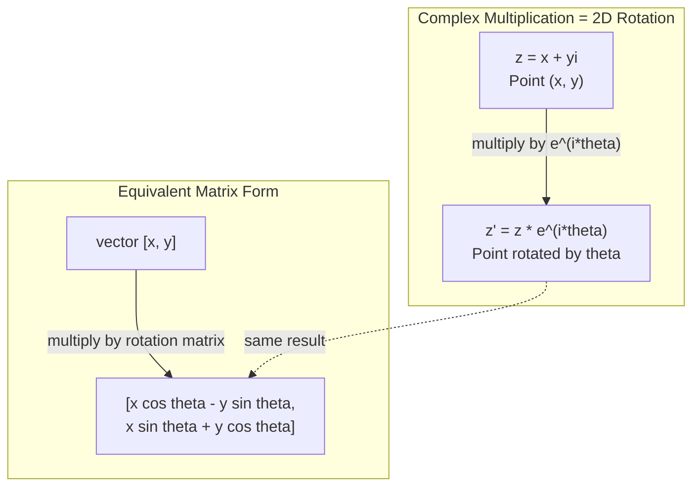
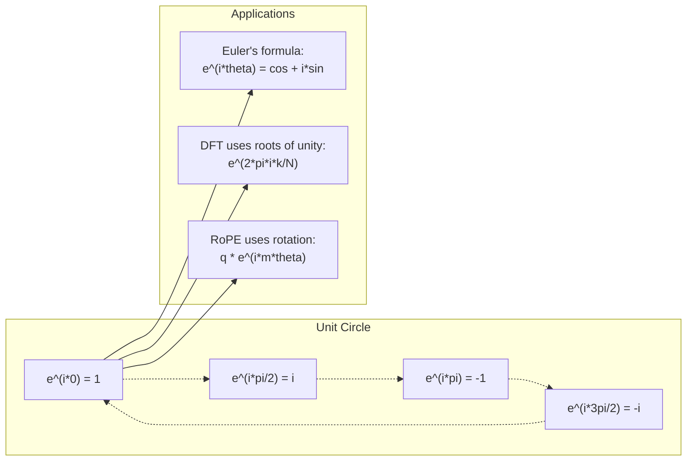

# Комплексные числа для AI

> Квадратный корень из -1 не является воображаемым. Это ключ к вращениям, частотам и половине обработки сигналов.

**Тип:** Изучение
**Язык:** Python
**Предварительные требования:** Phase 1, Lessons 01-04 (линейная алгебра, математический анализ)
**Время:** ~60 минут

## Цели обучения

- Выполнять арифметику комплексных чисел (сложение, умножение, деление, сопряжение) как в алгебраической, так и в полярной форме
- Применять формулу Эйлера для перехода между комплексными экспонентами и тригонометрическими функциями
- Реализовать Discrete Fourier Transform с использованием комплексных корней из единицы
- Объяснять, как комплексные вращения лежат в основе RoPE и синусоидальных позиционных кодировок в трансформерах

## Проблема

Вы открываете статью о преобразованиях Фурье, и там повсюду встречается `i`. Вы смотрите на позиционные кодировки трансформеров и видите `sin` и `cos` на разных частотах -- действительную и мнимую части комплексных экспонент. Вы читаете о квантовых вычислениях и обнаруживаете, что все выражается в комплексных векторных пространствах.

Комплексные числа кажутся абстрактными. Система чисел, построенная на квадратном корне из -1, выглядит как математический трюк. Но это не трюк. Это естественный язык вращений и колебаний. Каждый раз, когда что-то вращается, вибрирует или осциллирует, комплексные числа оказываются правильным инструментом.

Без понимания комплексных чисел нельзя понять Discrete Fourier Transform. Нельзя понять FFT. Нельзя понять, как RoPE (Rotary Position Embedding) работает в современных языковых моделях. Нельзя понять, почему синусоидальные позиционные кодировки в оригинальной статье Transformer используют именно такие частоты.

Этот урок строит арифметику комплексных чисел с нуля, связывает ее с геометрией и показывает, где именно комплексные числа появляются в машинном обучении.

## Концепция

### Что такое комплексное число?

Комплексное число состоит из двух частей: действительной части и мнимой части.

```
z = a + bi

where:
  a is the real part
  b is the imaginary part
  i is the imaginary unit, defined by i^2 = -1
```

Вот и все. Вы расширяете числовую прямую до плоскости. Действительные числа лежат на одной оси. Мнимые числа лежат на другой. Каждое комплексное число -- это точка на этой плоскости.

### Арифметика комплексных чисел

**Сложение.** Сложите действительные части и сложите мнимые части.

```
(a + bi) + (c + di) = (a + c) + (b + d)i

Example: (3 + 2i) + (1 + 4i) = 4 + 6i
```

**Умножение.** Используйте распределительный закон и помните, что i^2 = -1.

```
(a + bi)(c + di) = ac + adi + bci + bdi^2
                 = ac + adi + bci - bd
                 = (ac - bd) + (ad + bc)i

Example: (3 + 2i)(1 + 4i) = 3 + 12i + 2i + 8i^2
                            = 3 + 14i - 8
                            = -5 + 14i
```

**Сопряжение.** Поменяйте знак мнимой части.

```
conjugate of (a + bi) = a - bi
```

Произведение комплексного числа и его сопряженного всегда является действительным:

```
(a + bi)(a - bi) = a^2 + b^2
```

**Деление.** Умножьте числитель и знаменатель на сопряженное к знаменателю.

```
(a + bi) / (c + di) = (a + bi)(c - di) / (c^2 + d^2)
```

Так мнимая часть устраняется из знаменателя, и получается аккуратное комплексное число.

### Комплексная плоскость

Комплексная плоскость сопоставляет каждому комплексному числу 2D-точку. Горизонтальная ось -- действительная ось, вертикальная ось -- мнимая ось.

```
z = 3 + 2i  corresponds to the point (3, 2)
z = -1 + 0i corresponds to the point (-1, 0) on the real axis
z = 0 + 4i  corresponds to the point (0, 4) on the imaginary axis
```

Комплексное число одновременно является точкой и вектором из начала координат. Именно эта двойная интерпретация делает комплексные числа полезными в геометрии.

### Полярная форма

Любую точку на плоскости можно описать расстоянием от начала координат и углом относительно положительного направления действительной оси.

```
z = r * (cos(theta) + i*sin(theta))

where:
  r = |z| = sqrt(a^2 + b^2)     (magnitude, or modulus)
  theta = atan2(b, a)             (phase, or argument)
```

Алгебраическая форма (a + bi) удобна для сложения. Полярная форма (r, theta) удобна для умножения.

**Умножение в полярной форме.** Умножьте модули и сложите углы.

```
z1 = r1 * e^(i*theta1)
z2 = r2 * e^(i*theta2)

z1 * z2 = (r1 * r2) * e^(i*(theta1 + theta2))
```

Именно поэтому комплексные числа идеально подходят для вращений. Умножение на комплексное число с модулем 1 -- это чистое вращение.

### Формула Эйлера

Мост между комплексными экспонентами и тригонометрией:

```
e^(i*theta) = cos(theta) + i*sin(theta)
```

Это самая важная формула в этом уроке. Когда theta = pi:

```
e^(i*pi) = cos(pi) + i*sin(pi) = -1 + 0i = -1

Therefore: e^(i*pi) + 1 = 0
```

Пять фундаментальных констант (e, i, pi, 1, 0), связанные одним уравнением.

### Почему формула Эйлера важна для ML

Формула Эйлера говорит, что `e^(i*theta)` обходит единичную окружность по мере изменения theta. При theta = 0 вы находитесь в (1, 0). При theta = pi/2 -- в (0, 1). При theta = pi -- в (-1, 0). При theta = 3*pi/2 -- в (0, -1). Полный оборот соответствует theta = 2*pi.

Это означает, что комплексные экспоненты И ЕСТЬ вращения. А вращения повсюду встречаются в обработке сигналов и ML.

### Связь с 2D-вращениями

Умножение комплексного числа (x + yi) на e^(i*theta) поворачивает точку (x, y) на угол theta вокруг начала координат.

```
Rotation via complex multiplication:
  (x + yi) * (cos(theta) + i*sin(theta))
  = (x*cos(theta) - y*sin(theta)) + (x*sin(theta) + y*cos(theta))i

Rotation via matrix multiplication:
  [cos(theta)  -sin(theta)] [x]   [x*cos(theta) - y*sin(theta)]
  [sin(theta)   cos(theta)] [y] = [x*sin(theta) + y*cos(theta)]
```

Они дают одинаковые результаты. Комплексное умножение И ЕСТЬ 2D-вращение. Матрица вращения -- это просто комплексное умножение, записанное в матричной нотации.



### Фазоры и вращающиеся сигналы

Комплексная экспонента e^(i*omega*t) -- это точка, вращающаяся по единичной окружности с угловой частотой omega. Когда t увеличивается, точка описывает окружность.

Действительная часть этой вращающейся точки равна cos(omega*t). Мнимая часть равна sin(omega*t). Синусоидальный сигнал -- это тень вращающегося комплексного числа.

```
e^(i*omega*t) = cos(omega*t) + i*sin(omega*t)

Real part:      cos(omega*t)    -- a cosine wave
Imaginary part: sin(omega*t)    -- a sine wave
```

Это фазорное представление. Вместо отслеживания извилистой синусоиды вы отслеживаете плавно вращающуюся стрелку. Сдвиги фазы становятся угловыми смещениями. Изменения амплитуды становятся изменениями модуля. Сложение сигналов становится векторным сложением.

### Корни из единицы

N-е корни из единицы -- это N точек, равномерно расположенных на единичной окружности:

```
w_k = e^(2*pi*i*k/N)    for k = 0, 1, 2, ..., N-1
```

Для N = 4 корни: 1, i, -1, -i (четыре стороны света).
Для N = 8 вы получаете четыре стороны света плюс четыре диагонали.

Корни из единицы -- основа Discrete Fourier Transform. DFT раскладывает сигнал на компоненты на этих N равномерно расположенных частотах.

### Связь с DFT

Discrete Fourier Transform сигнала x[0], x[1], ..., x[N-1] задается так:

```
X[k] = sum_{n=0}^{N-1} x[n] * e^(-2*pi*i*k*n/N)
```

Каждый X[k] измеряет, насколько сигнал коррелирует с k-м корнем из единицы -- комплексной синусоидой на частоте k. DFT разбивает сигнал на N вращающихся фазоров и сообщает амплитуду и фазу каждого из них.

### Почему i не является воображаемым

Слово "мнимый" -- историческая случайность. Декарт использовал его пренебрежительно. Но i не более мнимое, чем отрицательные числа были мнимыми для тех, кто когда-то их отвергал. Отрицательные числа отвечают на вопрос "что нужно вычесть из 3, чтобы получить 5?" Мнимая единица отвечает на вопрос "что нужно возвести в квадрат, чтобы получить -1?"

Практичнее думать так: i -- это оператор поворота на 90 градусов. Умножьте действительное число на i один раз, и вы повернете его на 90 градусов к мнимой оси. Умножьте на i снова (i^2), и вы повернете еще на 90 градусов -- теперь вы указываете в отрицательном действительном направлении. Поэтому i^2 = -1. В этом нет мистики. Это пол-оборота, составленные из двух четвертей оборота.

Именно поэтому комплексные числа повсюду в инженерии. Все, что вращается -- электромагнитные волны, квантовые состояния, осцилляции сигналов, позиционные кодировки -- естественно описывается комплексными числами.

### Комплексные экспоненты и тригонометрические функции

До формулы Эйлера инженеры записывали сигналы как A*cos(omega*t + phi) -- амплитуда A, частота omega, фаза phi. Это работает, но делает арифметику болезненной. Сложение двух косинусов с разными фазами требует тригонометрических тождеств.

С комплексными экспонентами тот же сигнал записывается как A*e^(i*(omega*t + phi)). Сложение двух сигналов -- это просто сложение двух комплексных чисел. Умножение (модуляция) -- это просто умножение модулей и сложение углов. Сдвиги фазы становятся сложением углов. Сдвиги частоты становятся умножением на фазоры.

Вся область обработки сигналов перешла на нотацию комплексных экспонент, потому что математика становится чище. "Действительный сигнал" всегда является просто действительной частью комплексного представления. Мнимая часть переносится как вспомогательный учет, благодаря которому вся алгебра естественно сходится.

### Связь с трансформерами

**Синусоидальные позиционные кодировки** (оригинальная статья Transformer):

```
PE(pos, 2i) = sin(pos / 10000^(2i/d))
PE(pos, 2i+1) = cos(pos / 10000^(2i/d))
```

Пары sin и cos -- это действительная и мнимая части комплексных экспонент на разных частотах. Каждая частота дает разное "разрешение" для кодирования позиции. Низкие частоты меняются медленно (грубая позиция). Высокие частоты меняются быстро (точная позиция). Вместе они дают каждой позиции уникальный частотный отпечаток.

**RoPE (Rotary Position Embedding)** идет дальше. Он явно умножает query- и key-векторы на комплексные матрицы вращения. Относительная позиция между двумя токенами становится углом вращения. Attention вычисляется с использованием этих повернутых векторов, что делает модель чувствительной к относительной позиции через комплексное умножение.

| Операция | Алгебраическая форма | Геометрический смысл |
|-----------|---------------|-------------------|
| Сложение | (a+c) + (b+d)i | Векторное сложение на плоскости |
| Умножение | (ac-bd) + (ad+bc)i | Поворот и масштабирование |
| Сопряжение | a - bi | Отражение относительно действительной оси |
| Модуль | sqrt(a^2 + b^2) | Расстояние от начала координат |
| Фаза | atan2(b, a) | Угол от положительного направления действительной оси |
| Деление | multiply by conjugate | Обратное вращение и перемасштабирование |
| Степень | r^n * e^(i*n*theta) | Повернуть n раз, масштабировать на r^n |



## Реализация

### Шаг 1: Класс Complex

Постройте класс комплексных чисел Complex, который поддерживает арифметику, модуль, фазу и переход между алгебраической и полярной формами.

```python
import math

class Complex:
    def __init__(self, real, imag=0.0):
        self.real = real
        self.imag = imag

    def __add__(self, other):
        return Complex(self.real + other.real, self.imag + other.imag)

    def __mul__(self, other):
        r = self.real * other.real - self.imag * other.imag
        i = self.real * other.imag + self.imag * other.real
        return Complex(r, i)

    def __truediv__(self, other):
        denom = other.real ** 2 + other.imag ** 2
        r = (self.real * other.real + self.imag * other.imag) / denom
        i = (self.imag * other.real - self.real * other.imag) / denom
        return Complex(r, i)

    def magnitude(self):
        return math.sqrt(self.real ** 2 + self.imag ** 2)

    def phase(self):
        return math.atan2(self.imag, self.real)

    def conjugate(self):
        return Complex(self.real, -self.imag)
```

### Шаг 2: Переход к полярной форме и формула Эйлера

```python
def to_polar(z):
    return z.magnitude(), z.phase()

def from_polar(r, theta):
    return Complex(r * math.cos(theta), r * math.sin(theta))

def euler(theta):
    return Complex(math.cos(theta), math.sin(theta))
```

Проверьте: `euler(theta).magnitude()` всегда должен быть равен 1.0. `euler(0)` должен давать (1, 0). `euler(pi)` должен давать (-1, 0).

### Шаг 3: Вращение

Поворот точки (x, y) на угол theta -- это одно комплексное умножение:

```python
point = Complex(3, 4)
rotated = point * euler(math.pi / 4)
```

Модуль остается тем же. Меняется только угол.

### Шаг 4: DFT через комплексную арифметику

```python
def dft(signal):
    N = len(signal)
    result = []
    for k in range(N):
        total = Complex(0, 0)
        for n in range(N):
            angle = -2 * math.pi * k * n / N
            total = total + Complex(signal[n], 0) * euler(angle)
        result.append(total)
    return result
```

Это O(N^2) DFT. Каждый выход X[k] -- сумма отсчетов сигнала, умноженных на корни из единицы.

### Шаг 5: Обратное DFT

Обратное DFT восстанавливает исходный сигнал из его спектра. Единственные изменения по сравнению с прямым DFT: поменять знак в экспоненте и разделить на N.

```python
def idft(spectrum):
    N = len(spectrum)
    result = []
    for n in range(N):
        total = Complex(0, 0)
        for k in range(N):
            angle = 2 * math.pi * k * n / N
            total = total + spectrum[k] * euler(angle)
        result.append(Complex(total.real / N, total.imag / N))
    return result
```

Это дает точное восстановление. Примените DFT, затем IDFT, и вы получите исходный сигнал обратно с точностью до машинной погрешности. Информация не теряется.

### Шаг 6: Корни из единицы

```python
def roots_of_unity(N):
    return [euler(2 * math.pi * k / N) for k in range(N)]
```

Проверьте два свойства:
- Каждый корень имеет модуль ровно 1.
- Сумма всех N корней равна нулю (они взаимно сокращаются из-за симметрии).

Именно эти свойства делают DFT обратимым. Корни из единицы образуют ортогональный базис для частотной области.

### Ожидаемый вывод

Запустите `code/complex_numbers.py` — последние строки должны быть такими:

```
  2. Multiplication rotates and scales. Division reverses it.
  3. Euler's formula: e^(i*theta) = cos(theta) + i*sin(theta).
  4. Multiplying by e^(i*theta) rotates by theta radians.
  5. Complex multiplication IS 2D rotation (same as rotation matrix).
  6. DFT decomposes signals into rotating phasors (roots of unity).
  7. Transformer positional encodings are complex exponentials
     at different frequencies.
  8. RoPE uses explicit complex multiplication for position.
```

## Применение

В Python есть встроенная поддержка комплексных чисел. Литерал `j` представляет мнимую единицу.

```python
z = 3 + 2j
w = 1 + 4j

print(z + w)
print(z * w)
print(abs(z))

import cmath
print(cmath.phase(z))
print(cmath.exp(1j * cmath.pi))
```

Для массивов numpy нативно обрабатывает комплексные числа:

```python
import numpy as np

z = np.array([1+2j, 3+4j, 5+6j])
print(np.abs(z))
print(np.angle(z))
print(np.conj(z))
print(np.real(z))
print(np.imag(z))

signal = np.sin(2 * np.pi * 5 * np.linspace(0, 1, 128))
spectrum = np.fft.fft(signal)
freqs = np.fft.fftfreq(128, d=1/128)
```

## Результат

Запустите `code/complex_numbers.py`, чтобы сгенерировать `outputs/skill-complex-arithmetic.md`.

## Упражнения

1. **Комплексная арифметика вручную.** Вычислите (2 + 3i) * (4 - i) и проверьте результат с помощью кода. Затем вычислите (5 + 2i) / (1 - 3i). Нарисуйте оба результата на комплексной плоскости и проверьте, что умножение повернуло и масштабировало первое число.

2. **Последовательность вращений.** Начните с точки (1, 0). Умножьте ее на e^(i*pi/6) двенадцать раз. Проверьте, что после 12 умножений вы вернетесь в (1, 0). Выведите координаты на каждом шаге и убедитесь, что они описывают правильный 12-угольник.

3. **DFT известного сигнала.** Создайте сигнал, являющийся суммой sin(2*pi*3*t) и 0.5*sin(2*pi*7*t), дискретизированный в 32 точках. Запустите DFT. Проверьте, что спектр модулей имеет пики на частотах 3 и 7, причем пик на 7 имеет половину высоты пика на 3.

4. **Визуализация корней из единицы.** Вычислите 8-е корни из единицы. Проверьте, что их сумма равна нулю. Проверьте, что умножение любого корня на примитивный корень e^(2*pi*i/8) дает следующий корень.

5. **Эквивалентность матрицы вращения.** Для 10 случайных углов и 10 случайных точек проверьте, что комплексное умножение дает тот же результат, что и матрично-векторное умножение с 2x2 матрицей вращения. Выведите максимальную численную разницу.

## Ключевые термины

| Термин | Что это значит |
|------|---------------|
| Комплексное число | Число a + bi, где a -- действительная часть, b -- мнимая часть, а i^2 = -1 |
| Мнимая единица | Число i, определенное как i^2 = -1. Оно не мнимое в философском смысле -- это оператор вращения |
| Комплексная плоскость | 2D-плоскость, где ось x действительная, а ось y мнимая. Также называется плоскостью Аргана |
| Модуль | Расстояние от начала координат: sqrt(a^2 + b^2). Записывается как \|z\| |
| Фаза (аргумент) | Угол от положительного направления действительной оси: atan2(b, a). Записывается как arg(z) |
| Сопряжение | Зеркальное отражение относительно действительной оси: сопряженное к a + bi равно a - bi |
| Полярная форма | Представление z как r * e^(i*theta) вместо a + bi. Упрощает умножение |
| Формула Эйлера | e^(i*theta) = cos(theta) + i*sin(theta). Связывает экспоненты с тригонометрией |
| Фазор | Вращающееся комплексное число e^(i*omega*t), представляющее синусоидальный сигнал |
| Корни из единицы | N комплексных чисел e^(2*pi*i*k/N) для k = 0 до N-1. N равномерно расположенных точек на единичной окружности |
| DFT | Discrete Fourier Transform. Раскладывает сигнал на комплексные синусоидальные компоненты с помощью корней из единицы |
| RoPE | Rotary Position Embedding. Использует комплексное умножение для кодирования относительной позиции в transformer attention |

## Дополнительное чтение

- [Visual Introduction to Euler's Formula](https://betterexplained.com/articles/intuitive-understanding-of-eulers-formula/) - развивает геометрическую интуицию без тяжелой нотации
- [Su et al.: RoFormer (2021)](https://arxiv.org/abs/2104.09864) - статья, вводящая Rotary Position Embedding с использованием комплексных вращений
- [Vaswani et al.: Attention Is All You Need (2017)](https://arxiv.org/abs/1706.03762) - оригинальная статья Transformer с синусоидальными позиционными кодировками
- [3Blue1Brown: Euler's formula with introductory group theory](https://www.youtube.com/watch?v=mvmuCPvRoWQ) - визуальное объяснение того, почему e^(i*pi) = -1
- [Needham: Visual Complex Analysis](https://global.oup.com/academic/product/visual-complex-analysis-9780198534464) - лучшая визуальная трактовка комплексных чисел, полная геометрической интуиции
- [Strang: Introduction to Linear Algebra, Ch. 10](https://math.mit.edu/~gs/linearalgebra/) - комплексные числа в контексте линейной алгебры и собственных значений
