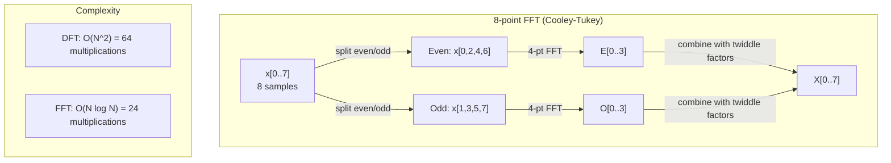
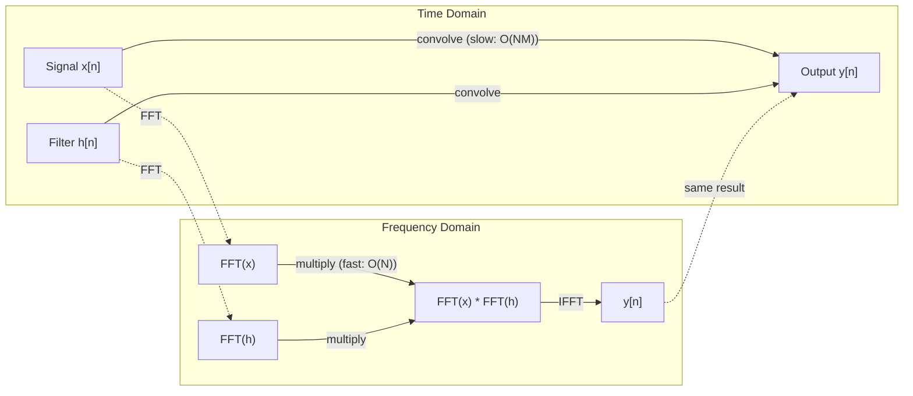

# Преобразование Фурье

> Каждый сигнал -- это сумма синусоид. Преобразование Фурье показывает, каких именно.

**Тип:** Практика
**Язык:** Python
**Предварительные требования:** Phase 1, Lessons 01-04, 19 (комплексные числа)
**Время:** ~90 минут

## Цели обучения

- Реализовать DFT с нуля и проверить его относительно O(N log N) Cooley-Tukey FFT
- Интерпретировать частотные коэффициенты: извлекать амплитуду, фазу и спектр мощности из сигнала
- Применять теорему о свертке для выполнения свертки через умножение FFT
- Связать частотное разложение Фурье с позиционными кодировками трансформеров и сверточными слоями CNN

## Проблема

Аудиозапись -- это последовательность измерений давления во времени. Цена акции -- последовательность значений по дням. Изображение -- сетка интенсивностей пикселей в пространстве. Все это данные во временной области (или пространственной области). Вы видите значения, меняющиеся по некоторому индексу.

Но многие паттерны невидимы во временной области. Этот аудиосигнал -- чистый тон или аккорд? У этой цены акции есть недельный цикл? На этом изображении есть повторяющаяся текстура? Эти вопросы относятся к частотному содержанию, а временная область его скрывает.

Преобразование Фурье переводит данные из временной области в частотную. Оно берет сигнал и раскладывает его на синусоиды разных частот. У каждой синусоиды есть амплитуда (насколько она сильна) и фаза (где она начинается). Преобразование Фурье сообщает и то, и другое.

Это важно для ML, потому что мышление в частотной области встречается повсюду. Сверточные нейронные сети выполняют свертку, которая является умножением в частотной области. Позиционные кодировки трансформеров используют частотное разложение для представления позиции. Аудиомодели (распознавание речи, генерация музыки) работают со спектрограммами -- частотными представлениями звука. Модели временных рядов ищут периодические паттерны. Понимание преобразования Фурье дает вам словарь для работы со всем этим.

## Концепция

### Определение DFT

Для N отсчетов x[0], x[1], ..., x[N-1] Discrete Fourier Transform производит N частотных коэффициентов X[0], X[1], ..., X[N-1]:

```
X[k] = sum_{n=0}^{N-1} x[n] * e^(-2*pi*i*k*n/N)

for k = 0, 1, ..., N-1
```

Каждый X[k] -- комплексное число. Его модуль |X[k]| показывает амплитуду частоты k. Его фаза angle(X[k]) показывает фазовый сдвиг этой частоты.

Ключевая идея: `e^(-2*pi*i*k*n/N)` -- это вращающийся фазор на частоте k. DFT вычисляет корреляцию между сигналом и каждой из N равномерно расположенных частот. Если сигнал содержит энергию на частоте k, корреляция велика. Если нет, она близка к нулю.

### Что означает каждый коэффициент

**X[0]: DC-компонента.** Это сумма всех отсчетов -- пропорциональная среднему. Она представляет постоянное смещение сигнала с нулевой частотой.

```
X[0] = sum_{n=0}^{N-1} x[n] * e^0 = sum of all samples
```

**X[k] для 1 <= k <= N/2: положительные частоты.** X[k] представляет частоту k циклов на N отсчетов. Чем выше k, тем выше частота (быстрее осцилляция).

**X[N/2]: частота Найквиста.** Самая высокая частота, которую можно представить N отсчетами. Выше нее возникает алиасинг -- высокие частоты маскируются под низкие.

**X[k] для N/2 < k < N: отрицательные частоты.** Для действительных сигналов X[N-k] = conj(X[k]). Отрицательные частоты являются зеркальным отражением положительных. Поэтому полезная информация находится в первых N/2 + 1 коэффициентах.

### Обратное DFT

Обратное DFT восстанавливает исходный сигнал из его частотных коэффициентов:

```
x[n] = (1/N) * sum_{k=0}^{N-1} X[k] * e^(2*pi*i*k*n/N)

for n = 0, 1, ..., N-1
```

Единственные отличия от прямого DFT: знак в экспоненте положительный (а не отрицательный), и есть нормирующий множитель 1/N.

Обратное DFT дает точное восстановление. Информация не теряется. Вы можете перейти из временной области в частотную и обратно без какой-либо ошибки. DFT -- это смена базиса: оно выражает ту же информацию в другой системе координат.

### FFT: как сделать быстро

DFT в приведенном выше определении имеет сложность O(N^2): для каждого из N выходных коэффициентов нужно суммировать по N входным отсчетам. Для N = 1 миллион это 10^12 операций.

Fast Fourier Transform (FFT) вычисляет тот же результат за O(N log N). Для N = 1 миллион это около 20 миллионов операций вместо триллиона. Именно это делает частотный анализ практичным.

Алгоритм Cooley-Tukey (самый распространенный FFT) работает по принципу "разделяй и властвуй":

1. Разделить сигнал на отсчеты с четными и нечетными индексами.
2. Рекурсивно вычислить DFT каждой половины.
3. Объединить два DFT половинного размера с помощью "twiddle factors" e^(-2*pi*i*k/N).

```
X[k] = E[k] + e^(-2*pi*i*k/N) * O[k]          for k = 0, ..., N/2 - 1
X[k + N/2] = E[k] - e^(-2*pi*i*k/N) * O[k]    for k = 0, ..., N/2 - 1

where E = DFT of even-indexed samples
      O = DFT of odd-indexed samples
```

Симметрия означает, что каждый уровень рекурсии выполняет O(N) работы, а уровней log2(N). Итого: O(N log N).



FFT требует, чтобы длина сигнала была степенью 2. На практике сигналы дополняют нулями до следующей степени 2.

### Спектральный анализ

**Спектр мощности** -- это |X[k]|^2, квадрат модуля каждого частотного коэффициента. Он показывает, сколько энергии приходится на каждую частоту.

**Фазовый спектр** -- это angle(X[k]), фазовый сдвиг каждой частоты. В большинстве задач анализа вас интересует спектр мощности, а фазу можно игнорировать.

```
Power at frequency k:  P[k] = |X[k]|^2 = X[k].real^2 + X[k].imag^2
Phase at frequency k:  phi[k] = atan2(X[k].imag, X[k].real)
```

### Частотное разрешение

Частотное разрешение DFT зависит от числа отсчетов N и частоты дискретизации fs.

```
Frequency of bin k:      f_k = k * fs / N
Frequency resolution:    delta_f = fs / N
Maximum frequency:       f_max = fs / 2  (Nyquist)
```

Чтобы различить две близкие частоты, нужно больше отсчетов. Чтобы захватывать высокие частоты, нужна более высокая частота дискретизации.

### Теорема о свертке

Это один из важнейших результатов в обработке сигналов, напрямую связанный с CNN.

**Свертка во временной области равна поточечному умножению в частотной области.**

```
x * h = IFFT(FFT(x) . FFT(h))

where * is convolution and . is element-wise multiplication
```

Почему это важно:

- Прямая свертка двух сигналов длины N и M требует O(N*M) операций.
- Свертка через FFT требует O(N log N): преобразовать оба, перемножить, преобразовать обратно.
- Для больших ядер FFT-свертка значительно быстрее.
- Именно это происходит в сверточных слоях с большими receptive fields.

Примечание: DFT вычисляет циклическую свертку (сигнал "заворачивается"). Для линейной свертки (без заворачивания) дополните оба сигнала нулями до длины N + M - 1 перед вычислением.



### Оконные функции

DFT предполагает, что сигнал периодичен: оно рассматривает N отсчетов как один период бесконечно повторяющегося сигнала. Если сигнал не начинается и не заканчивается одним и тем же значением, на границе возникает разрыв, который проявляется как паразитное высокочастотное содержимое. Это называется спектральной утечкой.

Оконное сглаживание уменьшает утечку, плавно сводя сигнал к нулю на обоих концах перед вычислением DFT.

Распространенные окна:

| Окно | Форма | Ширина главного лепестка | Уровень боковых лепестков | Когда использовать |
|--------|-------|----------------|-----------------|----------|
| Rectangular | Плоское (без окна) | Самая узкая | Самый высокий (-13 dB) | Когда сигнал точно периодичен в N отсчетах |
| Hann | Приподнятый косинус | Умеренная | Низкий (-31 dB) | Спектральный анализ общего назначения |
| Hamming | Модифицированный косинус | Умеренная | Ниже (-42 dB) | Обработка аудио, анализ речи |
| Blackman | Тройной косинус | Широкая | Очень низкий (-58 dB) | Когда критично подавление боковых лепестков |

```
Hann window:    w[n] = 0.5 * (1 - cos(2*pi*n / (N-1)))
Hamming window: w[n] = 0.54 - 0.46 * cos(2*pi*n / (N-1))
```

Примените окно, умножив его поэлементно на сигнал перед DFT: `X = DFT(x * w)`.

### Свойства DFT

| Свойство | Временная область | Частотная область |
|----------|-------------|-----------------|
| Линейность | a*x + b*y | a*X + b*Y |
| Сдвиг во времени | x[n - k] | X[f] * e^(-2*pi*i*f*k/N) |
| Сдвиг по частоте | x[n] * e^(2*pi*i*f0*n/N) | X[f - f0] |
| Свертка | x * h | X * H (pointwise) |
| Умножение | x * h (pointwise) | X * H (circular convolution, scaled by 1/N) |
| Теорема Парсеваля | sum \|x[n]\|^2 | (1/N) * sum \|X[k]\|^2 |
| Сопряженная симметрия (действительный вход) | x[n] real | X[k] = conj(X[N-k]) |

Теорема Парсеваля говорит, что полная энергия одинакова в обеих областях. Энергия сохраняется при преобразовании.

### Связь с позиционными кодировками

Оригинальный Transformer использует синусоидальные позиционные кодировки:

```
PE(pos, 2i)   = sin(pos / 10000^(2i/d_model))
PE(pos, 2i+1) = cos(pos / 10000^(2i/d_model))
```

Каждая пара измерений (2i, 2i+1) осциллирует на своей частоте. Частоты расположены геометрически: от высоких (измерения 0,1) к низким (последние измерения). Это дает каждой позиции уникальный паттерн по всем частотным полосам -- похоже на то, как коэффициенты Фурье однозначно идентифицируют сигнал.

Ключевые свойства:

- **Уникальность:** никакие две позиции не имеют одинаковой кодировки.
- **Ограниченные значения:** sin и cos всегда лежат в [-1, 1].
- **Относительная позиция:** кодировку позиции p+k можно выразить как линейную функцию от кодировки позиции p. Модель может научиться обращать внимание на относительные позиции.

### Связь с CNN

Сверточный слой применяет обучаемый фильтр (kernel) к входу, сдвигая его по сигналу или изображению. Математически это операция свертки.

По теореме о свертке это эквивалентно:
1. FFT входа
2. FFT ядра
3. Умножению в частотной области
4. IFFT результата

Стандартные реализации CNN используют прямую свертку (она быстрее для маленьких ядер 3x3). Но для больших ядер или глобальной свертки подходы на основе FFT значительно быстрее. Некоторые архитектуры (например, FNet) полностью заменяют attention на FFT, достигая конкурентной точности со сложностью O(N log N) вместо O(N^2).

### Спектрограммы и Short-Time Fourier Transform

Один FFT показывает частотное содержимое всего сигнала, но ничего не говорит о том, когда эти частоты возникают. Чирп (сигнал, частота которого растет со временем) и аккорд (все частоты присутствуют одновременно) могут иметь один и тот же спектр модулей.

Short-Time Fourier Transform (STFT) решает это, вычисляя FFT на перекрывающихся окнах сигнала. Результат -- спектрограмма: 2D-представление, где на одной оси время, а на другой частота. Интенсивность в каждой точке показывает энергию на этой частоте в этот момент времени.

```
STFT procedure:
1. Choose a window size (e.g., 1024 samples)
2. Choose a hop size (e.g., 256 samples -- 75% overlap)
3. For each window position:
   a. Extract the windowed segment
   b. Apply a Hann/Hamming window
   c. Compute FFT
   d. Store the magnitude spectrum as one column of the spectrogram
```

Спектрограммы -- стандартное входное представление для аудио ML-моделей. Модели распознавания речи (Whisper, DeepSpeech) работают с mel-spectrograms -- спектрограммами, где частоты отображены на mel-шкалу, лучше соответствующую восприятию высоты звука человеком.

### Алиасинг

Если сигнал содержит частоты выше fs/2 (частоты Найквиста), дискретизация с частотой fs создаст алиасные копии. Сигнал 90 Hz, дискретизированный с частотой 100 Hz, выглядит идентично сигналу 10 Hz. По одним только отсчетам их невозможно различить.

```
Example:
  True signal: 90 Hz sine wave
  Sampling rate: 100 Hz
  Apparent frequency: 100 - 90 = 10 Hz

  The samples from the 90 Hz signal at 100 Hz sampling rate
  are identical to the samples from a 10 Hz signal.
  No amount of math can recover the original 90 Hz.
```

Поэтому аналого-цифровые преобразователи включают антиалиасинговые фильтры, удаляющие частоты выше Найквиста перед дискретизацией. В ML алиасинг возникает при downsampling feature maps без корректной низкочастотной фильтрации -- некоторые архитектуры решают это с помощью anti-aliased pooling layers.

### Дополнение нулями не повышает разрешение

Распространенное заблуждение: дополнение сигнала нулями перед FFT улучшает частотное разрешение. Это не так. Дополнение нулями интерполирует между существующими частотными бинами, делая спектр визуально более гладким. Но оно не может выявить частотные детали, которых не было в исходных отсчетах.

Настоящее частотное разрешение зависит только от времени наблюдения T = N / fs. Чтобы различить две частоты, разделенные delta_f, нужно как минимум T = 1 / delta_f секунд данных. Никакое дополнение нулями не меняет этот фундаментальный предел.

## Реализация

### Шаг 1: DFT с нуля

O(N^2) DFT напрямую следует из определения.

```python
import math

class Complex:
    ...

def dft(x):
    N = len(x)
    result = []
    for k in range(N):
        total = Complex(0, 0)
        for n in range(N):
            angle = -2 * math.pi * k * n / N
            w = Complex(math.cos(angle), math.sin(angle))
            xn = x[n] if isinstance(x[n], Complex) else Complex(x[n])
            total = total + xn * w
        result.append(total)
    return result
```

### Шаг 2: Обратное DFT

Та же структура, положительная экспонента, деление на N.

```python
def idft(X):
    N = len(X)
    result = []
    for n in range(N):
        total = Complex(0, 0)
        for k in range(N):
            angle = 2 * math.pi * k * n / N
            w = Complex(math.cos(angle), math.sin(angle))
            total = total + X[k] * w
        result.append(Complex(total.real / N, total.imag / N))
    return result
```

### Шаг 3: FFT (Cooley-Tukey)

Рекурсивный FFT требует длину, равную степени 2. Разделите на четные и нечетные элементы, рекурсивно вычислите, объедините с twiddle factors.

```python
def fft(x):
    N = len(x)
    if N <= 1:
        return [x[0] if isinstance(x[0], Complex) else Complex(x[0])]
    if N % 2 != 0:
        return dft(x)

    even = fft([x[i] for i in range(0, N, 2)])
    odd = fft([x[i] for i in range(1, N, 2)])

    result = [Complex(0)] * N
    for k in range(N // 2):
        angle = -2 * math.pi * k / N
        twiddle = Complex(math.cos(angle), math.sin(angle))
        t = twiddle * odd[k]
        result[k] = even[k] + t
        result[k + N // 2] = even[k] - t
    return result
```

### Шаг 4: Вспомогательные функции спектрального анализа

```python
def power_spectrum(X):
    return [xk.real ** 2 + xk.imag ** 2 for xk in X]

def convolve_fft(x, h):
    N = len(x) + len(h) - 1
    padded_N = 1
    while padded_N < N:
        padded_N *= 2

    x_padded = x + [0.0] * (padded_N - len(x))
    h_padded = h + [0.0] * (padded_N - len(h))

    X = fft(x_padded)
    H = fft(h_padded)

    Y = [xk * hk for xk, hk in zip(X, H)]

    y = idft(Y)
    return [y[n].real for n in range(N)]
```

## Применение

Для реальной работы используйте FFT из numpy, который опирается на высокооптимизированные C-библиотеки.

```python
import numpy as np

signal = np.sin(2 * np.pi * 5 * np.arange(256) / 256)
spectrum = np.fft.fft(signal)
freqs = np.fft.fftfreq(256, d=1/256)

power = np.abs(spectrum) ** 2

positive_freqs = freqs[:len(freqs)//2]
positive_power = power[:len(power)//2]
```

Для оконных функций и более продвинутого спектрального анализа:

```python
from scipy.signal import windows, stft

window = windows.hann(256)
windowed = signal * window
spectrum = np.fft.fft(windowed)
```

Для свертки:

```python
from scipy.signal import fftconvolve

result = fftconvolve(signal, kernel, mode='full')
```

Для спектрограмм:

```python
from scipy.signal import stft

frequencies, times, Zxx = stft(signal, fs=sample_rate, nperseg=256)
spectrogram = np.abs(Zxx) ** 2
```

Матрица спектрограммы имеет форму (n_frequencies, n_time_frames). Каждый столбец -- спектр мощности в одном временном окне. Именно это аудио ML-модели получают на вход.

## Результат

Запустите `code/fourier.py`, чтобы сгенерировать `outputs/prompt-spectral-analyzer.md`.

## Упражнения

1. **Определение чистого тона.** Создайте сигнал с одной синусоидой неизвестной частоты (между 1 и 50 Hz), дискретизированный с частотой 128 Hz в течение 1 секунды. Используйте свой DFT, чтобы определить частоту. Проверьте, что ответ совпадает. Теперь добавьте гауссов шум со стандартным отклонением 0.5 и повторите. Как шум влияет на спектр?

2. **Проверка FFT против DFT.** Сгенерируйте случайный сигнал длины 64. Вычислите и DFT (O(N^2)), и FFT. Проверьте, что все коэффициенты совпадают с точностью до 1e-10. Измерьте время обеих функций на сигналах длины 256, 512, 1024 и 2048. Постройте график отношения времени DFT ко времени FFT.

3. **Доказательство теоремы о свертке на примере.** Создайте сигнал x = [1, 2, 3, 4, 0, 0, 0, 0] и фильтр h = [1, 1, 1, 0, 0, 0, 0, 0]. Вычислите их циклическую свертку напрямую (вложенный цикл). Затем вычислите ее через FFT (преобразование, умножение, обратное преобразование). Проверьте, что результаты совпадают. Теперь выполните линейную свертку, корректно дополнив нулями.

4. **Эффекты оконных функций.** Создайте сигнал, являющийся суммой двух синусоид на 10 Hz и 12 Hz (очень близко). Дискретизируйте с частотой 128 Hz в течение 1 секунды. Вычислите спектр мощности без окна, с окном Hann и с окном Hamming. Какое окно облегчает различение двух пиков? Почему?

5. **Анализ позиционных кодировок.** Сгенерируйте синусоидальные позиционные кодировки для d_model = 128 и max_pos = 512. Для каждой пары позиций (p1, p2) вычислите dot product их кодировок. Покажите, что dot product зависит только от |p1 - p2|, а не от абсолютных позиций. Что происходит с dot product при увеличении расстояния?

## Ключевые термины

| Термин | Что это значит |
|------|---------------|
| DFT (Discrete Fourier Transform) | Преобразует N отсчетов временной области в N коэффициентов частотной области. Каждый коэффициент -- корреляция с комплексной синусоидой на этой частоте |
| FFT (Fast Fourier Transform) | Алгоритм O(N log N) для вычисления DFT. Алгоритм Cooley-Tukey рекурсивно разделяет четные/нечетные индексы |
| Обратное DFT | Восстанавливает сигнал временной области из частотных коэффициентов. Та же формула, что и DFT, но со сменой знака экспоненты и масштабированием 1/N |
| Частотный бин | Каждый индекс k в выходе DFT представляет частоту k*fs/N Hz. "Бин" -- дискретная частотная ячейка |
| DC-компонента | X[0], коэффициент нулевой частоты. Пропорционален среднему сигнала |
| Частота Найквиста | fs/2, максимальная частота, представимая при частоте дискретизации fs. Частоты выше нее алиасируются |
| Спектр мощности | \|X[k]\|^2, квадрат модуля каждого частотного коэффициента. Показывает распределение энергии по частотам |
| Фазовый спектр | angle(X[k]), фазовый сдвиг каждой частотной компоненты. Часто игнорируется в анализе |
| Спектральная утечка | Паразитное частотное содержимое, возникающее из-за трактовки непериодического сигнала как периодического. Уменьшается оконными функциями |
| Оконная функция | Сглаживающая функция (Hann, Hamming, Blackman), применяемая перед DFT для уменьшения спектральной утечки |
| Twiddle factor | Комплексная экспонента e^(-2*pi*i*k/N), используемая для объединения sub-DFTs в butterfly-вычислении FFT |
| Теорема о свертке | Свертка во временной области равна поточечному умножению в частотной области. Фундаментальна для обработки сигналов и CNN |
| Циклическая свертка | Свертка, в которой сигнал заворачивается. Именно ее естественно вычисляет DFT |
| Линейная свертка | Стандартная свертка без заворачивания. Достигается дополнением нулями перед DFT |
| Теорема Парсеваля | Полная энергия сохраняется при преобразовании Фурье. sum \|x[n]\|^2 = (1/N) sum \|X[k]\|^2 |
| Алиасинг | Ситуация, когда частоты выше Найквиста проявляются как более низкие частоты из-за недостаточной частоты дискретизации |

## Дополнительное чтение

- [Cooley & Tukey: An Algorithm for the Machine Calculation of Complex Fourier Series (1965)](https://www.ams.org/journals/mcom/1965-19-090/S0025-5718-1965-0178586-1/) - оригинальная статья об FFT, изменившая вычисления
- [3Blue1Brown: But what is the Fourier Transform?](https://www.youtube.com/watch?v=spUNpyF58BY) - лучшее визуальное введение в преобразования Фурье
- [Lee-Thorp et al.: FNet: Mixing Tokens with Fourier Transforms (2021)](https://arxiv.org/abs/2105.03824) - заменяет self-attention на FFT в трансформерах
- [Smith: The Scientist and Engineer's Guide to Digital Signal Processing](http://www.dspguide.com/) - бесплатный онлайн-учебник, подробно покрывающий FFT, оконные функции и спектральный анализ
- [Vaswani et al.: Attention Is All You Need (2017)](https://arxiv.org/abs/1706.03762) - синусоидальные позиционные кодировки, выведенные из частотного разложения Фурье
- [Radford et al.: Whisper (2022)](https://arxiv.org/abs/2212.04356) - распознавание речи с использованием mel-spectrograms как входного представления
