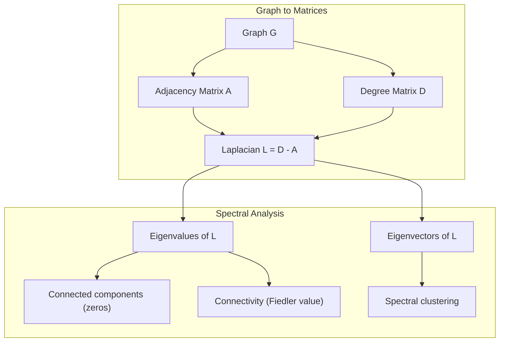
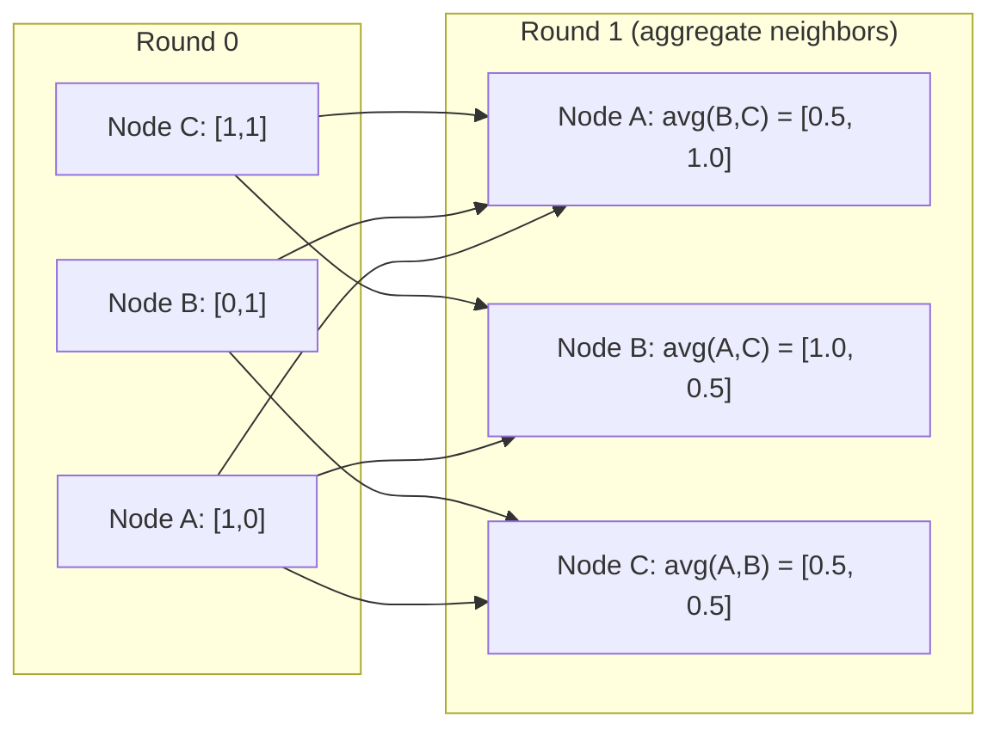

# Теория графов для машинного обучения

> Графы -- это структура данных для отношений. Если в ваших данных есть связи, вам нужна теория графов.

**Тип:** Практика
**Язык:** Python
**Предварительные требования:** Phase 1, Lessons 01-03 (линейная алгебра, матрицы)
**Время:** ~90 минут

## Цели обучения

- Построить класс графа с представлениями через матрицу/список смежности и реализовать обходы BFS и DFS
- Вычислять лапласиан графа и использовать его собственные значения для обнаружения связных компонент и кластеризации узлов
- Реализовать один раунд GNN-style message passing как умножение на нормализованную матрицу смежности
- Применять спектральную кластеризацию для разбиения графа с помощью вектора Фидлера

## Проблема

Социальные сети, молекулы, базы знаний, сети цитирования, дорожные карты -- все это графы. Традиционное ML рассматривает данные как плоские таблицы. Каждая строка независима. Каждый признак -- столбец. Но когда важна структура связей, таблицы не справляются.

Рассмотрим социальную сеть. Вы хотите предсказать, какой продукт купит пользователь. Его история покупок важна. Но история покупок его друзей может быть важнее. Связи несут сигнал.

Или рассмотрим молекулу. Вы хотите предсказать, связывается ли она с белком. Атомы важны, но действительно важно то, как атомы связаны друг с другом. Структура и есть данные.

Graph Neural Networks (GNNs) -- одна из самых быстрорастущих областей deep learning. Они используются в разработке лекарств, социальных рекомендациях, обнаружении мошенничества и reasoning по knowledge graphs. Каждый GNN опирается на одну и ту же основу: базовую теорию графов.

Вам нужны четыре вещи:
1. Способ представлять графы как матрицы (чтобы их можно было умножать)
2. Алгоритмы обхода для исследования структуры графа
3. Лапласиан -- самая важная матрица в спектральной теории графов
4. Message passing -- операция, благодаря которой работают GNN

## Концепция

### Графы: узлы и ребра

Граф G = (V, E) состоит из вершин (узлов) V и ребер E. Каждое ребро соединяет два узла.

**Ориентированный и неориентированный.** В неориентированном графе ребро (u, v) означает, что u связан с v И v связан с u. В ориентированном графе (digraph) ребро (u, v) означает, что u указывает на v, но не обязательно наоборот.

**Взвешенный и невзвешенный.** В невзвешенном графе ребра либо существуют, либо нет. Во взвешенном графе у каждого ребра есть численный вес -- расстояние, стоимость, сила связи.

| Тип графа | Пример |
|-----------|---------|
| Неориентированный, невзвешенный | Сеть дружбы Facebook |
| Ориентированный, невзвешенный | Сеть подписок Twitter |
| Неориентированный, взвешенный | Дорожная карта (расстояния) |
| Ориентированный, взвешенный | Ссылки веб-страниц (PageRank scores) |

### Матрица смежности

Матрица смежности A -- центральное представление. Для графа с n узлами:

```
A[i][j] = 1    if there is an edge from node i to node j
A[i][j] = 0    otherwise
```

Для неориентированных графов A симметрична: A[i][j] = A[j][i]. Для взвешенных графов A[i][j] = вес ребра (i, j).

**Пример -- треугольник:**

```
Nodes: 0, 1, 2
Edges: (0,1), (1,2), (0,2)

A = [[0, 1, 1],
     [1, 0, 1],
     [1, 1, 0]]
```

Матрица смежности -- вход для каждого GNN. Матричные операции с A соответствуют операциям над графом.

### Степень

Степень узла -- это количество ребер, связанных с ним. Для ориентированных графов есть входящая степень (ребра входят) и исходящая степень (ребра выходят).

Матрица степеней D диагональна:

```
D[i][i] = degree of node i
D[i][j] = 0    for i != j
```

Для примера с треугольником: D = diag(2, 2, 2), потому что каждый узел связан с двумя другими.

Степень говорит о важности узла. Высокая степень = узел-хаб. Распределение степеней сети раскрывает ее структуру. Социальные сети следуют степенным законам (немного хабов, много листовых узлов). Случайные графы имеют пуассоновское распределение степеней.

### BFS и DFS

Два фундаментальных алгоритма обхода графа. Нужны оба.

**Breadth-First Search (BFS):** сначала исследовать всех соседей, затем соседей соседей. Использует очередь (FIFO).

```
BFS from node 0:
  Visit 0
  Queue: [1, 2]        (neighbors of 0)
  Visit 1
  Queue: [2, 3]        (add neighbors of 1)
  Visit 2
  Queue: [3]           (neighbors of 2 already visited)
  Visit 3
  Queue: []            (done)
```

BFS находит кратчайшие пути в невзвешенных графах. Расстояние от стартового узла до любого другого равно уровню BFS, на котором этот узел был впервые обнаружен. Поэтому BFS используют для расстояний в числе hops в социальных сетях.

**Depth-First Search (DFS):** идти как можно глубже, прежде чем возвращаться назад. Использует стек (LIFO) или рекурсию.

```
DFS from node 0:
  Visit 0
  Stack: [1, 2]        (neighbors of 0)
  Visit 2               (pop from stack)
  Stack: [1, 3]         (add neighbors of 2)
  Visit 3               (pop from stack)
  Stack: [1]
  Visit 1               (pop from stack)
  Stack: []             (done)
```

DFS полезен для:
- Поиска связных компонент (запускайте DFS из непосещенных узлов)
- Обнаружения циклов (обратные ребра в дереве DFS)
- Топологической сортировки (обратный порядок завершения DFS)

| Алгоритм | Структура данных | Находит | Применение |
|-----------|---------------|-------|----------|
| BFS | Очередь | Кратчайшие пути | Расстояния в социальных сетях, обход knowledge graph |
| DFS | Стек | Компоненты, циклы | Связность, топологическая сортировка |

### Лапласиан графа

L = D - A. Самая важная матрица в спектральной теории графов.

Для треугольника:

```
D = [[2, 0, 0],    A = [[0, 1, 1],    L = [[2, -1, -1],
     [0, 2, 0],         [1, 0, 1],         [-1, 2, -1],
     [0, 0, 2]]         [1, 1, 0]]         [-1, -1,  2]]
```

У лапласиана есть замечательные свойства:

1. **L положительно полуопределена.** Все собственные значения >= 0.

2. **Количество нулевых собственных значений равно количеству связных компонент.** Связный граф имеет ровно одно нулевое собственное значение. Граф с 3 несвязными компонентами имеет три нулевых собственных значения.

3. **Наименьшее ненулевое собственное значение (значение Фидлера) измеряет связность.** Большое значение Фидлера означает, что граф хорошо связан. Малое значение Фидлера означает, что в графе есть слабое место -- bottleneck.

4. **Собственный вектор значения Фидлера (вектор Фидлера) выявляет лучшее разбиение.** Узлы с положительными значениями попадают в одну группу, узлы с отрицательными -- в другую. Это спектральная кластеризация.



### Спектральные свойства

Собственные значения матрицы смежности и лапласиана раскрывают структурные свойства без какого-либо обхода.

**Спектральная кластеризация** работает так:
1. Вычислить лапласиан L
2. Найти k наименьших собственных векторов L (пропустить первый, который для связных графов является вектором из единиц)
3. Использовать эти собственные векторы как новые координаты каждого узла
4. Запустить k-means на этих координатах

Почему это работает? Собственные векторы L кодируют самые "гладкие" функции на графе. Хорошо связанные узлы получают похожие значения собственных векторов. Узлы, разделенные bottleneck, получают разные значения. Собственные векторы естественно отделяют кластеры.

**Связь со случайным блужданием.** Нормализованный лапласиан связан со случайными блужданиями по графу. Стационарное распределение случайного блуждания пропорционально степени узла. Время перемешивания (как быстро блуждание сходится) зависит от спектрального зазора.

### Message Passing

Базовая операция Graph Neural Networks. Каждый узел собирает сообщения от соседей, агрегирует их и обновляет свое состояние.

```
h_v^(k+1) = UPDATE(h_v^(k), AGGREGATE({h_u^(k) : u in neighbors(v)}))
```

В простейшей форме AGGREGATE = mean, а UPDATE = linear transform + activation:

```
h_v^(k+1) = sigma(W * mean({h_u^(k) : u in neighbors(v)}))
```

Это замаскированное матричное умножение. Если H -- матрица признаков всех узлов, а A -- матрица смежности:

```
H^(k+1) = sigma(A_norm * H^(k) * W)
```

где A_norm -- нормализованная матрица смежности (каждая строка суммируется в 1).

Один раунд message passing позволяет каждому узлу "видеть" своих непосредственных соседей. Два раунда позволяют видеть соседей соседей. K раундов дают каждому узлу информацию из его K-hop neighborhood.



### Концепции и применения в ML

| Концепция | Применение в ML |
|---------|---------------|
| Матрица смежности | Входное представление GNN |
| Лапласиан графа | Спектральная кластеризация, обнаружение сообществ |
| BFS/DFS | Обход knowledge graph, поиск путей |
| Распределение степеней | Важность узлов, feature engineering |
| Message passing (передача сообщений) | GNN layers (GCN, GAT, GraphSAGE) |
| Собственные значения L | Обнаружение сообществ, разбиение графа |
| Спектральная кластеризация | Неконтролируемая группировка узлов |
| PageRank | Важность узлов, веб-поиск |

## Реализация

### Шаг 1: Класс Graph с нуля

```python
class Graph:
    def __init__(self, n_nodes, directed=False):
        self.n = n_nodes
        self.directed = directed
        self.adj = {i: {} for i in range(n_nodes)}

    def add_edge(self, u, v, weight=1.0):
        self.adj[u][v] = weight
        if not self.directed:
            self.adj[v][u] = weight

    def neighbors(self, node):
        return list(self.adj[node].keys())

    def degree(self, node):
        return len(self.adj[node])

    def adjacency_matrix(self):
        import numpy as np
        A = np.zeros((self.n, self.n))
        for u in range(self.n):
            for v, w in self.adj[u].items():
                A[u][v] = w
        return A

    def degree_matrix(self):
        import numpy as np
        D = np.zeros((self.n, self.n))
        for i in range(self.n):
            D[i][i] = self.degree(i)
        return D

    def laplacian(self):
        return self.degree_matrix() - self.adjacency_matrix()
```

Список смежности (`self.adj`) эффективно хранит соседей. Преобразование в матрицу смежности использует numpy, потому что все спектральные операции нуждаются в нем.

### Шаг 2: BFS и DFS

```python
from collections import deque

def bfs(graph, start):
    visited = set()
    order = []
    distances = {}
    queue = deque([(start, 0)])
    visited.add(start)
    while queue:
        node, dist = queue.popleft()
        order.append(node)
        distances[node] = dist
        for neighbor in graph.neighbors(node):
            if neighbor not in visited:
                visited.add(neighbor)
                queue.append((neighbor, dist + 1))
    return order, distances


def dfs(graph, start):
    visited = set()
    order = []
    stack = [start]
    while stack:
        node = stack.pop()
        if node in visited:
            continue
        visited.add(node)
        order.append(node)
        for neighbor in reversed(graph.neighbors(node)):
            if neighbor not in visited:
                stack.append(neighbor)
    return order
```

BFS использует deque (двустороннюю очередь) для O(1) popleft. DFS использует list как стек. Оба посещают каждый узел ровно один раз -- время O(V + E).

### Шаг 3: Связные компоненты и собственные значения лапласиана

```python
def connected_components(graph):
    visited = set()
    components = []
    for node in range(graph.n):
        if node not in visited:
            order, _ = bfs(graph, node)
            visited.update(order)
            components.append(order)
    return components


def laplacian_eigenvalues(graph):
    import numpy as np
    L = graph.laplacian()
    eigenvalues = np.linalg.eigvalsh(L)
    return eigenvalues
```

`eigvalsh` предназначен для симметричных матриц -- лапласиан всегда симметричен для неориентированных графов. Он возвращает собственные значения в порядке возрастания. Посчитайте нули, чтобы найти число связных компонент.

### Шаг 4: Спектральная кластеризация

```python
def spectral_clustering(graph, k=2):
    import numpy as np
    L = graph.laplacian()
    eigenvalues, eigenvectors = np.linalg.eigh(L)
    features = eigenvectors[:, 1:k+1]

    labels = np.zeros(graph.n, dtype=int)
    for i in range(graph.n):
        if features[i, 0] >= 0:
            labels[i] = 0
        else:
            labels[i] = 1
    return labels
```

Для k=2 знак вектора Фидлера делит граф на два кластера. Для k>2 вы запускали бы k-means на первых k собственных векторах (исключая тривиальный вектор из единиц).

### Шаг 5: Message passing

```python
def message_passing(graph, features, weight_matrix):
    import numpy as np
    A = graph.adjacency_matrix()
    row_sums = A.sum(axis=1, keepdims=True)
    row_sums[row_sums == 0] = 1
    A_norm = A / row_sums
    aggregated = A_norm @ features
    output = aggregated @ weight_matrix
    return output
```

Это один раунд GNN message passing. Новые признаки каждого узла -- взвешенное среднее признаков соседей, преобразованное матрицей весов. Сложите несколько раундов, чтобы распространять информацию дальше.

### Ожидаемый вывод

Запустите `code/graph_theory.py` — последние строки должны быть такими:

```
  Node 6: 0.0959
  Node 7: 0.1163
  Node 8: 0.0959
  Node 9: 0.0959

Bridge nodes [2, 7] PageRank: 0.1163
Non-bridge nodes avg PageRank: 0.0959
Bridge nodes have higher PageRank -- they connect communities.
```

## Применение

С networkx и numpy те же операции становятся однострочными:

```python
import networkx as nx
import numpy as np

G = nx.karate_club_graph()

A = nx.adjacency_matrix(G).toarray()
L = nx.laplacian_matrix(G).toarray()

eigenvalues = np.linalg.eigvalsh(L.astype(float))
print(f"Smallest eigenvalues: {eigenvalues[:5]}")
print(f"Connected components: {nx.number_connected_components(G)}")

communities = nx.community.greedy_modularity_communities(G)
print(f"Communities found: {len(communities)}")

pr = nx.pagerank(G)
top_nodes = sorted(pr.items(), key=lambda x: x[1], reverse=True)[:5]
print(f"Top 5 PageRank nodes: {top_nodes}")
```

networkx обрабатывает графы любого размера с оптимизированными C-бэкендами. Используйте его в production. Реализацию с нуля используйте, чтобы понимать, что он делает.

### Спектральный анализ в numpy

```python
import numpy as np

A = np.array([
    [0, 1, 1, 0, 0],
    [1, 0, 1, 0, 0],
    [1, 1, 0, 1, 0],
    [0, 0, 1, 0, 1],
    [0, 0, 0, 1, 0]
])

D = np.diag(A.sum(axis=1))
L = D - A

eigenvalues, eigenvectors = np.linalg.eigh(L)
print(f"Eigenvalues: {np.round(eigenvalues, 4)}")
print(f"Fiedler value: {eigenvalues[1]:.4f}")
print(f"Fiedler vector: {np.round(eigenvectors[:, 1], 4)}")

fiedler = eigenvectors[:, 1]
group_a = np.where(fiedler >= 0)[0]
group_b = np.where(fiedler < 0)[0]
print(f"Cluster A: {group_a}")
print(f"Cluster B: {group_b}")
```

Вектор Фидлера выполняет основную работу. Положительные элементы -- в одном кластере, отрицательные -- в другом. Никакой итеративной оптимизации не требуется: только одно eigendecomposition.

## Результат

Этот урок создает:
- `outputs/skill-graph-analysis.md` -- skill reference для анализа graph-structured data

## Связи

| Концепция | Где встречается |
|---------|------------------|
| Матрица смежности | Вход GCN, GAT, GraphSAGE |
| Лапласиан | Спектральная кластеризация, ChebNet filters |
| BFS | Обход knowledge graph, запросы кратчайшего пути |
| Message passing | Каждый GNN layer, neural message passing |
| Спектральный зазор | Связность графа, mixing time случайных блужданий |
| Распределение степеней | Power-law networks, feature engineering узлов |
| Связные компоненты | Preprocessing, обработка несвязных графов |
| PageRank | Ранжирование важности узлов, инициализация attention |

GNNs заслуживают отдельного упоминания. Операция graph convolution в GCN (Kipf & Welling, 2017) использует матрицу смежности с добавленными self-loops, A_hat = A + I:

```text
H^(l+1) = sigma(D_hat^(-1/2) * A_hat * D_hat^(-1/2) * H^(l) * W^(l))
```

где A_hat = A + I (смежность плюс self-loops), а D_hat -- матрица степеней для A_hat. Self-loops гарантируют, что каждый узел включает собственные признаки при агрегации. Это ровно message passing с симметричной нормализацией. D_hat^(-1/2) * A_hat * D_hat^(-1/2) -- нормализованная матрица смежности. Лапласиан появляется потому, что эта нормализация связана с L_sym = I - D^(-1/2) * A * D^(-1/2). Понимание лапласиана означает понимание того, почему работают GCN.

## Упражнения

1. **Реализуйте PageRank с нуля.** Начните с равномерных оценок. На каждом шаге: score(v) = (1-d)/n + d * sum(score(u)/out_degree(u)) для всех u, указывающих на v. Используйте d=0.85. Запускайте до сходимости (изменение < 1e-6). Проверьте на небольшом web graph.

2. **Найдите сообщества с помощью спектральной кластеризации.** Создайте граф с двумя явно разделенными кластерами (например, две клики, соединенные одним ребром). Запустите спектральную кластеризацию и проверьте, что она находит правильное разбиение. Что происходит, когда вы добавляете больше межкластерных ребер?

3. **Реализуйте алгоритм Дейкстры** для кратчайших путей во взвешенных графах. Сравните результаты с BFS на том же графе с равномерными весами.

4. **Постройте 2-layer message passing network.** Примените message passing дважды с разными матрицами весов. Покажите, что после 2 раундов каждый узел содержит информацию из своего 2-hop neighborhood.

5. **Проанализируйте реальный граф.** Используйте Karate Club graph (34 узла, 78 ребер). Вычислите распределение степеней, собственные значения лапласиана и спектральную кластеризацию. Сравните результат спектральной кластеризации с известным ground truth split.

## Ключевые термины

| Термин | Как говорят | Что это на самом деле значит |
|------|----------------|----------------------|
| Граф | "Узлы и ребра" | Математическая структура G=(V,E), кодирующая парные отношения |
| Матрица смежности | "Таблица связей" | Матрица n x n, где A[i][j] = 1, если узлы i и j связаны |
| Степень | "Насколько связан узел" | Количество ребер, касающихся узла |
| Лапласиан | "D минус A" | L = D - A, матрица, собственные значения которой раскрывают структуру графа |
| Значение Фидлера | "Алгебраическая связность" | Наименьшее ненулевое собственное значение L, измеряющее, насколько хорошо связан граф |
| BFS | "Поиск уровень за уровнем" | Обход, который посещает всех соседей перед углублением, находит кратчайшие пути |
| DFS | "Сначала идти в глубину" | Обход, который идет по одному пути до конца, прежде чем возвращаться назад |
| Message passing | "Узлы разговаривают с соседями" | Каждый узел агрегирует информацию от соседей; ядро GNN |
| Спектральная кластеризация | "Кластеризация по собственным векторам" | Разбиение графа с помощью собственных векторов его лапласиана |
| Связная компонента | "Отдельный кусок" | Максимальный подграф, в котором каждый узел достижим из любого другого |

## Дополнительное чтение

- **Kipf & Welling (2017)** -- "Semi-Supervised Classification with Graph Convolutional Networks." Статья, запустившая современные GNN. Показывает, что спектральные graph convolutions упрощаются до message passing.
- **Spielman (2012)** -- "Spectral Graph Theory" lecture notes. Классическое введение в лапласианы, спектральные зазоры и разбиение графов.
- **Hamilton (2020)** -- "Graph Representation Learning." Книга о GNN от основ до применений.
- **Bronstein et al. (2021)** -- "Geometric Deep Learning: Grids, Groups, Graphs, Geodesics, and Gauges." Статья с объединяющей рамкой.
- **Veličković et al. (2018)** -- "Graph Attention Networks." Расширяет message passing механизмами attention.
