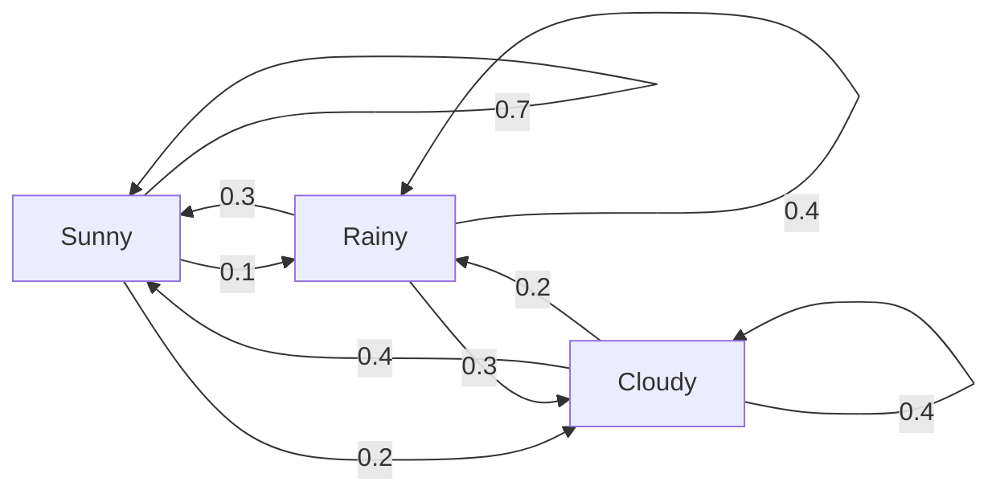
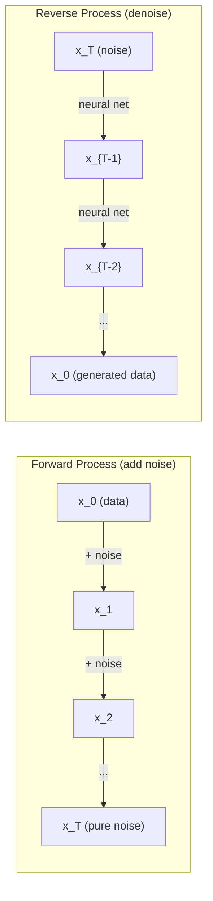

# Стохастические процессы

> Случайность со структурой. Математика случайных блужданий, марковских цепей и diffusion models.

**Тип:** Изучение
**Язык:** Python
**Предварительные требования:** Phase 1, Lessons 06-07 (вероятность, Bayes)
**Время:** ~75 минут

## Цели обучения

- Симулировать 1D- и 2D-случайные блуждания и проверять sqrt(n)-масштабирование смещения
- Построить симулятор марковской цепи и вычислять ее стационарное распределение через eigendecomposition
- Реализовать Metropolis-Hastings MCMC и Langevin dynamics для сэмплирования из целевых распределений
- Связать forward diffusion process с броуновским движением и объяснять, как reverse process генерирует данные

## Проблема

Многие AI-системы включают случайность, которая развивается во времени. Не статическую случайность, а структурированную, последовательную случайность, где каждый шаг зависит от того, что было раньше.

Языковые модели генерируют токены по одному. Каждый токен зависит от предыдущего контекста. Модель выдает распределение вероятностей, сэмплирует из него и движется дальше. Это стохастический процесс.

Diffusion models добавляют шум к изображению шаг за шагом, пока оно не превращается в чистую помеху. Затем они обращают процесс, денойзя шаг за шагом, пока не появится новое изображение. Прямой процесс -- марковская цепь. Обратный процесс -- обученная марковская цепь, идущая назад.

Reinforcement learning-агенты выполняют действия в среде. Каждое действие с некоторой вероятностью ведет к новому состоянию. Агент следует случайной политике в случайном мире. Вся система -- Markov decision process.

MCMC sampling -- основа байесовского вывода -- строит марковскую цепь, стационарным распределением которой является posterior, из которого вы хотите сэмплировать.

Все это строится на четырех фундаментальных идеях:
1. Случайные блуждания -- простейший стохастический процесс
2. Марковские цепи -- структурированная случайность с матрицей переходов
3. Langevin dynamics -- градиентный спуск с шумом
4. Metropolis-Hastings -- сэмплирование из любого распределения

## Концепция

### Случайные блуждания

Начните в позиции 0. На каждом шаге бросайте честную монету. Орел: движение вправо (+1). Решка: движение влево (-1).

После n шагов ваша позиция -- сумма n случайных значений +/-1. Ожидаемая позиция равна 0 (блуждание несмещенное). Но ожидаемое расстояние от начала растет как sqrt(n).

Это контринтуитивно. Блуждание честное -- нет дрейфа ни в одну сторону. Но со временем оно уходит все дальше и дальше от начальной точки. Стандартное отклонение после n шагов равно sqrt(n).

```
Step 0:  Position = 0
Step 1:  Position = +1 or -1
Step 2:  Position = +2, 0, or -2
...
Step 100: Expected distance from origin ~ 10 (sqrt(100))
Step 10000: Expected distance from origin ~ 100 (sqrt(10000))
```

**В 2D** блуждание движется вверх, вниз, влево или вправо с равной вероятностью. То же sqrt(n)-масштабирование применимо к расстоянию от начала координат. Траектория образует фракталоподобный паттерн.

**Почему sqrt(n)?** Каждый шаг равен +1 или -1 с равной вероятностью. После n шагов позиция S_n = X_1 + X_2 + ... + X_n, где каждый X_i равен +/-1. Дисперсия каждого шага равна 1, а шаги независимы, поэтому Var(S_n) = n. Стандартное отклонение = sqrt(n). По центральной предельной теореме S_n / sqrt(n) сходится к стандартному нормальному распределению.

Это sqrt(n)-масштабирование встречается повсюду в ML. Шум SGD масштабируется как 1/sqrt(batch_size). Размерности embedding масштабируются как sqrt(d). Квадратный корень -- признак независимых случайных сложений.

**Связь с броуновским движением.** Возьмите случайное блуждание с размером шага 1/sqrt(n) и n шагами за единицу времени. Когда n стремится к бесконечности, блуждание сходится к броуновскому движению B(t) -- непрерывному во времени процессу, где B(t) нормально распределено со средним 0 и дисперсией t.

Броуновское движение -- математическая основа diffusion. Оно моделирует случайное дрожание частиц в жидкости, колебания цен акций и -- что критично -- процесс шума в diffusion models.

**Разорение игрока.** Случайный блуждающий стартует в позиции k, с поглощающими барьерами в 0 и N. Какова вероятность достичь N раньше 0? Для честного блуждания: P(reach N) = k/N. Это удивительно просто и элегантно. Это связано с теорией martingales -- честное случайное блуждание является martingale (ожидаемое будущее значение = текущее значение).

### Марковские цепи

Марковская цепь -- система, переходящая между состояниями согласно фиксированным вероятностям. Ключевое свойство: следующее состояние зависит только от текущего состояния, а не от истории.

```
P(X_{t+1} = j | X_t = i, X_{t-1} = ...) = P(X_{t+1} = j | X_t = i)
```

Это марковское свойство. Оно означает, что всю динамику можно описать матрицей переходов P:

```
P[i][j] = probability of going from state i to state j
```

Каждая строка P суммируется в 1 (вы должны куда-то перейти).

**Пример -- погода:**

```
States: Sunny (0), Rainy (1), Cloudy (2)

P = [[0.7, 0.1, 0.2],    (if sunny: 70% sunny, 10% rainy, 20% cloudy)
     [0.3, 0.4, 0.3],    (if rainy: 30% sunny, 40% rainy, 30% cloudy)
     [0.4, 0.2, 0.4]]    (if cloudy: 40% sunny, 20% rainy, 40% cloudy)
```

Начните в любом состоянии. После многих переходов распределение состояний сходится к стационарному распределению pi, где pi * P = pi. Это левый собственный вектор P с собственным значением 1.

Для цепи погоды стационарное распределение может быть [0.53, 0.18, 0.29] -- в долгосрочной перспективе солнечно 53% времени независимо от начального состояния.



**Вычисление стационарного распределения.** Есть два подхода:

1. **Power method**: многократно умножать любое начальное распределение на P. После достаточного числа итераций оно сходится.
2. **Eigenvalue method**: найти левый собственный вектор P с собственным значением 1. Это собственный вектор P^T с собственным значением 1.

Оба подхода требуют, чтобы цепь удовлетворяла условиям сходимости.

**Условия сходимости.** Марковская цепь сходится к уникальному стационарному распределению, если она:
- **Неприводима**: каждое состояние достижимо из любого другого состояния
- **Апериодична**: цепь не циклирует с фиксированным периодом

Большинство цепей, которые встречаются в ML, удовлетворяют обоим условиям.

**Поглощающие состояния.** Состояние является поглощающим, если после входа в него вы никогда его не покидаете (P[i][i] = 1). Поглощающие марковские цепи моделируют процессы с терминальными состояниями -- завершившуюся игру, ушедшего клиента, последовательность токенов, достигшую end-of-text token.

**Время перемешивания.** Сколько шагов нужно, чтобы цепь стала "близка" к стационарному распределению? Формально это число шагов, после которого total variation distance до стационарности падает ниже некоторого порога. Быстрое перемешивание = нужно мало шагов. Спектральный зазор P (1 минус второе по величине собственное значение) управляет временем перемешивания. Больший зазор = более быстрое перемешивание.

### Связь с языковыми моделями

Генерация токенов в языковой модели примерно является марковским процессом. По текущему контексту модель выдает распределение по следующему токену. Temperature управляет резкостью:

```
P(token_i) = exp(logit_i / temperature) / sum(exp(logit_j / temperature))
```

- Temperature = 1.0: стандартное распределение
- Temperature < 1.0: более резкое (более детерминированное)
- Temperature > 1.0: более плоское (более случайное)
- Temperature -> 0: argmax (greedy)

Top-k sampling обрезает распределение до k токенов с наибольшей вероятностью. Top-p (nucleus) sampling обрезает до минимального набора токенов, чья суммарная вероятность превышает p. Оба метода изменяют вероятности марковских переходов.

### Броуновское движение

Непрерывный во времени предел случайного блуждания. Позиция B(t) имеет три свойства:
1. B(0) = 0
2. B(t) - B(s) нормально распределено со средним 0 и дисперсией t - s (для t > s)
3. Приращения на непересекающихся интервалах независимы

Броуновское движение непрерывно, но нигде не дифференцируемо -- оно дрожит на каждом масштабе. Траектория имеет фрактальную размерность 2 на плоскости.

В дискретной симуляции броуновское движение аппроксимируют так:

```
B(t + dt) = B(t) + sqrt(dt) * z,    where z ~ N(0, 1)
```

Масштабирование sqrt(dt) важно. Оно следует из центральной предельной теоремы, примененной к случайным блужданиям.

### Langevin Dynamics

Градиентный спуск находит минимум функции. Langevin dynamics находит распределение вероятностей, пропорциональное exp(-U(x)/T), где U -- энергетическая функция, а T -- температура.

```
x_{t+1} = x_t - dt * gradient(U(x_t)) + sqrt(2 * T * dt) * z_t
```

На частицу действуют две силы:
1. **Градиентная сила** (-dt * gradient(U)): толкает к низкой энергии (как градиентный спуск)
2. **Случайная сила** (sqrt(2*T*dt) * z): толкает в случайных направлениях (exploration)

При температуре T = 0 это чистый градиентный спуск. При высокой температуре это почти случайное блуждание. При правильной температуре частица исследует энергетический ландшафт и проводит больше времени в областях низкой энергии.

**Связь с diffusion models.** Прямой процесс diffusion model:

```
x_t = sqrt(alpha_t) * x_{t-1} + sqrt(1 - alpha_t) * noise
```

Это марковская цепь, которая постепенно смешивает данные с шумом. После достаточного числа шагов x_T становится чистым гауссовым шумом.

Обратный процесс -- переход от шума обратно к данным -- тоже марковская цепь, но ее вероятности переходов обучаются нейронной сетью. Сеть учится предсказывать шум, добавленный на каждом шаге, а затем вычитать его.



### MCMC: Markov Chain Monte Carlo

Иногда нужно сэмплировать из распределения p(x), которое можно вычислять (с точностью до константы), но из которого нельзя сэмплировать напрямую. Байесовские posterior -- классический пример: вы знаете likelihood, умноженный на prior, но нормировочная константа невычислима.

**Metropolis-Hastings** строит марковскую цепь, стационарным распределением которой является p(x):

1. Начать в некоторой позиции x
2. Предложить новую позицию x' из proposal distribution Q(x'|x)
3. Вычислить отношение принятия: a = p(x') * Q(x|x') / (p(x) * Q(x'|x))
4. Принять x' с вероятностью min(1, a). Иначе остаться в x.
5. Повторять.

Если Q симметрично (например, Q(x'|x) = Q(x|x') = N(x, sigma^2)), отношение упрощается до a = p(x') / p(x). Нужен только ratio вероятностей -- нормировочная константа сокращается.

Цепь гарантированно сходится к p(x) при мягких условиях. Но сходимость может быть медленной, если proposal слишком мал (random walk) или слишком велик (много отклонений). Настройка proposal -- искусство MCMC.

**Почему это работает.** Отношение принятия обеспечивает detailed balance: вероятность быть в x и перейти в x' равна вероятности быть в x' и перейти в x. Detailed balance означает, что p(x) является стационарным распределением цепи. Поэтому после достаточного числа шагов сэмплы приходят из p(x).

**Практические аспекты:**
- **Burn-in**: отбросить первые N сэмплов. Цепи нужно время, чтобы дойти от стартовой точки до стационарного распределения.
- **Thinning**: сохранять каждый k-й сэмпл, чтобы уменьшить автокорреляцию.
- **Multiple chains**: запускать несколько цепей из разных начальных точек. Если они сходятся к одному распределению, это свидетельство сходимости.
- **Acceptance rate**: для гауссовых proposals в d измерениях оптимальная доля принятия около 23% (Roberts & Rosenthal, 2001). Слишком высокая означает, что цепь почти не движется. Слишком низкая означает, что она все отклоняет.

### Стохастические процессы в AI

| Процесс | Применение в AI |
|---------|---------------|
| Случайное блуждание | Exploration in RL, Node2Vec embeddings |
| Марковская цепь | Генерация текста, MCMC sampling |
| Броуновское движение | Diffusion models (forward process, прямой процесс) |
| Langevin dynamics | Score-based generative models, SGLD |
| Markov decision process (марковский процесс принятия решений) | Reinforcement learning |
| Metropolis-Hastings | Байесовский вывод, posterior sampling |

## Реализация

### Шаг 1: Симулятор случайного блуждания

```python
import numpy as np

def random_walk_1d(n_steps, seed=None):
    rng = np.random.RandomState(seed)
    steps = rng.choice([-1, 1], size=n_steps)
    positions = np.concatenate([[0], np.cumsum(steps)])
    return positions


def random_walk_2d(n_steps, seed=None):
    rng = np.random.RandomState(seed)
    directions = rng.choice(4, size=n_steps)
    dx = np.zeros(n_steps)
    dy = np.zeros(n_steps)
    dx[directions == 0] = 1   # right
    dx[directions == 1] = -1  # left
    dy[directions == 2] = 1   # up
    dy[directions == 3] = -1  # down
    x = np.concatenate([[0], np.cumsum(dx)])
    y = np.concatenate([[0], np.cumsum(dy)])
    return x, y
```

1D-блуждание хранит накопленные суммы. Каждый шаг равен +1 или -1. После n шагов позиция является суммой. Дисперсия растет линейно с n, поэтому стандартное отклонение растет как sqrt(n).

### Шаг 2: Марковская цепь

```python
class MarkovChain:
    def __init__(self, transition_matrix, state_names=None):
        self.P = np.array(transition_matrix, dtype=float)
        self.n_states = len(self.P)
        self.state_names = state_names or [str(i) for i in range(self.n_states)]

    def step(self, current_state, rng=None):
        if rng is None:
            rng = np.random.RandomState()
        probs = self.P[current_state]
        return rng.choice(self.n_states, p=probs)

    def simulate(self, start_state, n_steps, seed=None):
        rng = np.random.RandomState(seed)
        states = [start_state]
        current = start_state
        for _ in range(n_steps):
            current = self.step(current, rng)
            states.append(current)
        return states

    def stationary_distribution(self):
        eigenvalues, eigenvectors = np.linalg.eig(self.P.T)
        idx = np.argmin(np.abs(eigenvalues - 1.0))
        stationary = np.real(eigenvectors[:, idx])
        stationary = stationary / stationary.sum()
        return np.abs(stationary)
```

Стационарное распределение -- левый собственный вектор P с собственным значением 1. Мы находим его, вычисляя собственные векторы P^T (транспонирование превращает левые собственные векторы в правые).

### Шаг 3: Langevin dynamics

```python
def langevin_dynamics(grad_U, x0, dt, temperature, n_steps, seed=None):
    rng = np.random.RandomState(seed)
    x = np.array(x0, dtype=float)
    trajectory = [x.copy()]
    for _ in range(n_steps):
        noise = rng.randn(*x.shape)
        x = x - dt * grad_U(x) + np.sqrt(2 * temperature * dt) * noise
        trajectory.append(x.copy())
    return np.array(trajectory)
```

Градиент толкает x к низкой энергии. Шум не дает застрять. В равновесии распределение сэмплов пропорционально exp(-U(x)/temperature).

### Шаг 4: Metropolis-Hastings

```python
def metropolis_hastings(target_log_prob, proposal_std, x0, n_samples, seed=None):
    rng = np.random.RandomState(seed)
    x = np.array(x0, dtype=float)
    samples = [x.copy()]
    accepted = 0
    for _ in range(n_samples - 1):
        x_proposed = x + rng.randn(*x.shape) * proposal_std
        log_ratio = target_log_prob(x_proposed) - target_log_prob(x)
        if np.log(rng.rand()) < log_ratio:
            x = x_proposed
            accepted += 1
        samples.append(x.copy())
    acceptance_rate = accepted / (n_samples - 1)
    return np.array(samples), acceptance_rate
```

Алгоритм предлагает новую точку, проверяет, имеет ли она более высокую вероятность (или принимает с вероятностью, пропорциональной отношению), и повторяет. Доля принятия должна быть примерно 23-50% для хорошего перемешивания.

### Ожидаемый вывод

Запустите `code/stochastic.py` — последние строки должны быть такими:

```
    25 |  -0.0049 |   0.8198 |       5.34 |       0.8602
    50 |  -0.0273 |   0.8481 |       0.29 |       0.5688
    75 |   0.0379 |   1.0001 |      -1.60 |       0.4595
   100 |   0.0913 |   0.9782 |      -2.64 |       0.2891

At step 0: perfect signal (correlation = 1.0)
At step 100: nearly pure noise (correlation near 0)
This is the forward process of a diffusion model.
```

## Применение

На практике для этих алгоритмов используют устоявшиеся библиотеки. Но понимание механики важно для отладки и настройки.

```python
import numpy as np

rng = np.random.RandomState(42)
walk = np.cumsum(rng.choice([-1, 1], size=10000))
print(f"Final position: {walk[-1]}")
print(f"Expected distance: {np.sqrt(10000):.1f}")
print(f"Actual distance: {abs(walk[-1])}")
```

### numpy для матриц переходов

```python
import numpy as np

P = np.array([[0.7, 0.1, 0.2],
              [0.3, 0.4, 0.3],
              [0.4, 0.2, 0.4]])

distribution = np.array([1.0, 0.0, 0.0])
for _ in range(100):
    distribution = distribution @ P

print(f"Stationary distribution: {np.round(distribution, 4)}")
```

Многократно умножайте начальное распределение на P. После достаточного числа итераций оно сходится к стационарному распределению независимо от начальной точки. Это power method для нахождения доминирующего левого собственного вектора.

### Связи с реальными фреймворками

- **PyTorch diffusion:** `DDPMScheduler` в Hugging Face `diffusers` реализует прямую и обратную марковские цепи
- **NumPyro / PyMC:** Используют MCMC (NUTS sampler, улучшающий Metropolis-Hastings) для байесовского вывода
- **Gymnasium (RL):** Функция environment step задает Markov decision process

### Проверка сходимости марковской цепи

```python
import numpy as np

P = np.array([[0.9, 0.1], [0.3, 0.7]])

eigenvalues = np.linalg.eigvals(P)
spectral_gap = 1 - sorted(np.abs(eigenvalues))[-2]
print(f"Eigenvalues: {eigenvalues}")
print(f"Spectral gap: {spectral_gap:.4f}")
print(f"Approximate mixing time: {1/spectral_gap:.1f} steps")
```

Спектральный зазор показывает, как быстро цепь забывает начальное состояние. Зазор 0.2 означает примерно 5 шагов для перемешивания. Зазор 0.01 означает примерно 100 шагов. Всегда проверяйте это перед запуском длинных симуляций -- медленно перемешивающаяся цепь тратит вычисления впустую.

## Результат

Этот урок создает:
- `outputs/prompt-stochastic-process-advisor.md` -- prompt, помогающий определить, какой stochastic process framework применим к задаче

## Связи

| Концепция | Где встречается |
|---------|------------------|
| Случайное блуждание | Node2Vec graph embeddings, exploration in RL |
| Марковская цепь | Генерация токенов в LLMs, MCMC sampling |
| Броуновское движение | Forward diffusion process (прямой диффузионный процесс) in DDPM, SDE-based models |
| Langevin dynamics | Score-based generative models, stochastic gradient Langevin dynamics (SGLD) |
| Стационарное распределение | MCMC convergence target (цель сходимости MCMC), PageRank |
| Metropolis-Hastings | Bayesian posterior sampling, simulated annealing |
| Temperature | LLM sampling, Boltzmann exploration in RL, simulated annealing |
| Mixing time | Convergence speed of MCMC (скорость сходимости MCMC), spectral gap analysis |
| Поглощающее состояние | End-of-sequence token, terminal states in RL |
| Detailed balance | Correctness guarantee (гарантия корректности) for MCMC samplers |

Diffusion models заслуживают отдельного внимания. DDPM (Ho et al., 2020) задает прямую марковскую цепь:

```
q(x_t | x_{t-1}) = N(x_t; sqrt(1-beta_t) * x_{t-1}, beta_t * I)
```

где beta_t -- noise schedule. После T шагов x_T приблизительно имеет распределение N(0, I). Обратный процесс параметризуется нейронной сетью, которая предсказывает шум:

```
p_theta(x_{t-1} | x_t) = N(x_{t-1}; mu_theta(x_t, t), sigma_t^2 * I)
```

Каждый шаг генерации -- шаг в обученной марковской цепи. Понимание марковских цепей означает понимание того, как и почему diffusion models генерируют данные.

SGLD (Stochastic Gradient Langevin Dynamics) объединяет mini-batch gradient descent с Langevin noise. Вместо вычисления полного градиента вы используете стохастическую оценку и добавляете калиброванный шум. По мере затухания learning rate SGLD переходит от оптимизации к сэмплированию -- вы почти бесплатно получаете приближенные байесовские posterior samples для нейронной сети. Это один из самых простых способов получать оценки неопределенности из нейронной сети.

Ключевая идея во всех этих связях: стохастические процессы -- не просто теоретические инструменты. Это вычислительные механизмы внутри современных AI-систем. Когда вы настраиваете temperature в LLM, вы регулируете марковскую цепь. Когда вы обучаете diffusion model, вы учитесь обращать процесс, похожий на броуновское движение. Когда вы запускаете байесовский вывод, вы строите цепь, сходящуюся к posterior.

## Упражнения

1. **Симулируйте 1000 случайных блужданий по 10000 шагов.** Постройте распределение финальных позиций. Проверьте, что оно приблизительно гауссово со средним 0 и стандартным отклонением sqrt(10000) = 100.

2. **Постройте генератор текста с помощью марковской цепи.** Обучите на небольшом корпусе: для каждого слова посчитайте переходы к следующему слову. Постройте матрицу переходов. Генерируйте новые предложения, сэмплируя из цепи.

3. **Реализуйте simulated annealing** с помощью Metropolis-Hastings. Начните с высокой temperature (принимать почти все) и постепенно охлаждайте (принимать только улучшения). Используйте это, чтобы найти минимум функции со многими локальными минимумами.

4. **Сравните Langevin dynamics при разных temperature.** Сэмплируйте из double-well potential U(x) = (x^2 - 1)^2. При низкой temperature сэмплы группируются в одной яме. При высокой temperature они распределяются по обеим. Найдите критическую temperature, при которой цепь перемешивается между ямами.

5. **Реализуйте forward diffusion process.** Начните с 1D-сигнала (например, синусоиды). Постепенно добавляйте шум за 100 шагов с линейным noise schedule. Покажите, как сигнал деградирует до чистого шума. Затем реализуйте простой denoiser, который обращает процесс (даже наивный, который просто вычитает оцененный шум).

## Ключевые термины

| Термин | Как говорят | Что это на самом деле значит |
|------|----------------|----------------------|
| Случайное блуждание | "Движение по броску монеты" | Процесс, в котором позиция меняется на случайные приращения на каждом шаге |
| Марковское свойство | "Без памяти" | Будущее зависит только от текущего состояния, а не от истории |
| Матрица переходов | "Таблица вероятностей" | P[i][j] = probability of moving from state i to state j |
| Стационарное распределение | "Долгосрочное среднее" | Распределение pi, где pi*P = pi -- равновесие цепи |
| Броуновское движение | "Случайное дрожание" | Непрерывный во времени предел случайного блуждания, B(t) ~ N(0, t) |
| Langevin dynamics | "Градиентный спуск с шумом" | Правило обновления, объединяющее детерминированный градиент и случайное возмущение |
| MCMC | "Блуждание к цели" | Построение марковской цепи, стационарное распределение которой является нужным вам распределением |
| Metropolis-Hastings | "Предложить и принять/отклонить" | MCMC-алгоритм, использующий отношения принятия для обеспечения сходимости |
| Temperature | "Ручка случайности" | Параметр, управляющий компромиссом между exploration и exploitation |
| Diffusion process | "Шум туда, шум обратно" | Forward: постепенно добавлять шум. Reverse: постепенно удалять его. Генерирует данные. |

## Дополнительное чтение

- [**Ho, Jain, Abbeel (2020)**](https://arxiv.org/abs/2006.11239) -- "Denoising Diffusion Probabilistic Models." Статья DDPM, запустившая революцию diffusion models. Ясный вывод прямой и обратной марковских цепей.
- [**Song & Ermon (2019)**](https://arxiv.org/abs/1907.05600) -- "Generative Modeling by Estimating Gradients of the Data Distribution." Score-based подход, использующий Langevin dynamics для сэмплирования.
- **Roberts & Rosenthal (2004)** -- "General state space Markov chains and MCMC algorithms." Теория того, когда и почему работает MCMC.
- **Norris (1997)** -- "Markov Chains." Стандартный учебник. Покрывает сходимость, стационарные распределения и hitting times.
- **Welling & Teh (2011)** -- "Bayesian Learning via Stochastic Gradient Langevin Dynamics." Объединяет SGD с Langevin dynamics для масштабируемого байесовского вывода.
