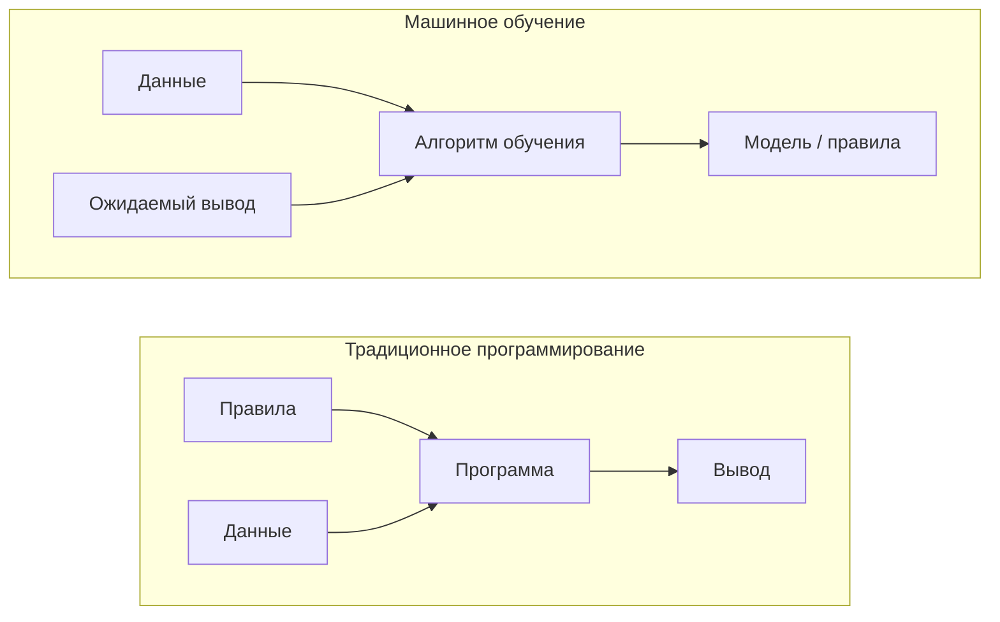
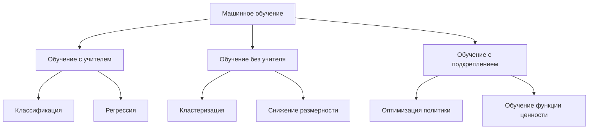
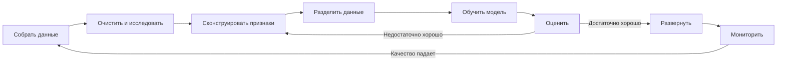
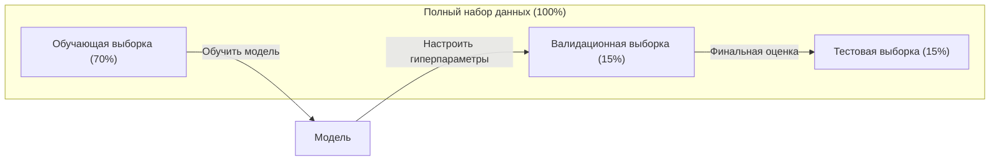
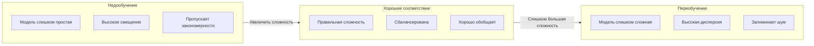
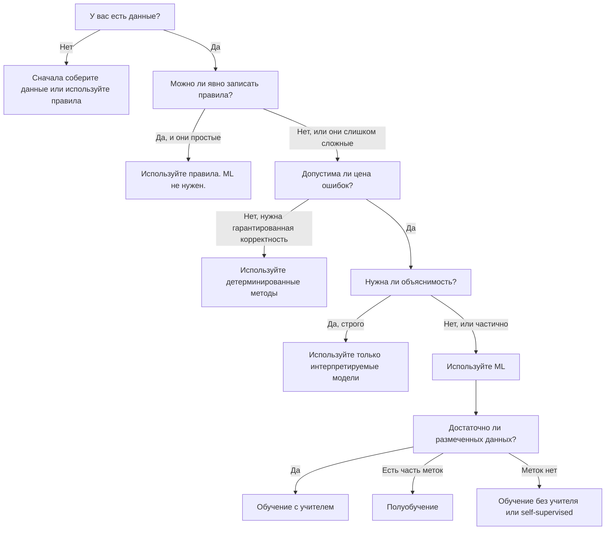

# Что такое машинное обучение

> Машинное обучение учит компьютеры находить закономерности в данных вместо ручного написания правил.

**Тип:** Изучение
**Языки:** Python
**Требования:** Фаза 1 (математические основы)
**Время:** ~45 минут

## Цели обучения

- Объяснять различие между обучением с учителем, обучением без учителя и обучением с подкреплением, а также определять, какой тип подходит для заданной задачи
- Реализовать с нуля классификатор ближайшего центроида и сравнить его со случайной базовой моделью
- Различать задачи классификации и регрессии и выбирать подходящую функцию потерь для каждой из них
- Оценивать, подходит ли бизнес-задача для ML или ее лучше решить детерминированными правилами

## Проблема

Вы хотите построить спам-фильтр. Традиционный подход: сесть и написать сотни правил. «Если письмо содержит "FREE MONEY", пометить как спам. Если в нем больше трех восклицательных знаков, пометить как спам». Вы неделями пишете правила. Затем спамеры меняют формулировки. Ваши правила ломаются. Вы пишете еще правила. Цикл не заканчивается.

Машинное обучение переворачивает этот подход. Вместо написания правил вы даете компьютеру тысячи размеченных писем («спам» или «не спам») и позволяете ему самому вывести правила. Компьютер находит закономерности, о которых вы бы не подумали. Когда спамеры меняют тактику, вы переобучаете модель на новых данных вместо переписывания кода.

Этот переход от «программирования правил» к «обучению на данных» и есть ядро машинного обучения. Так работают рекомендательные системы, голосовые ассистенты, беспилотные автомобили и языковые модели.

## Концепция

### Обучение на данных, а не на правилах

Традиционное программирование и машинное обучение решают задачи в противоположных направлениях.



Традиционное программирование: вы пишете правила. Программа применяет их к данным, чтобы получить результат.

Машинное обучение: вы предоставляете данные и ожидаемые ответы. Алгоритм обнаруживает правила.

«Модель», получающаяся после обучения, и ЕСТЬ правила, закодированные числами (весами, параметрами). Она обобщает примеры, которые видела, чтобы делать предсказания на данных, которых никогда не видела.

### Три типа машинного обучения



**Обучение с учителем**: у вас есть пары «вход-выход». Модель учится отображать входы в выходы.
- «Вот 10 000 фотографий с метками "кошка" или "собака". Научись их различать».
- «Вот характеристики домов и цены. Научись предсказывать цену».

**Обучение без учителя**: у вас есть только входные данные. Меток нет. Модель сама находит структуру.
- «Вот 10 000 историй покупок клиентов. Найди естественные группы».
- «Вот точки в 1000-мерном пространстве. Сожми их до 2 измерений, сохранив структуру».

**Обучение с подкреплением**: агент выполняет действия в среде и получает награды или штрафы. Он учится стратегии (политике), которая максимизирует суммарную награду.
- «Играй в эту игру. +1 за победу, -1 за поражение. Найди стратегию».
- «Управляй этой роботизированной рукой. +1 за поднятый объект, -0.01 за каждую потраченную секунду».

Большинство того, что вы будете строить на практике, использует обучение с учителем. Обучение без учителя часто применяется для предобработки и исследования данных. Обучение с подкреплением используется в игровом ИИ, робототехнике и RLHF для языковых моделей.

### За пределами большой тройки

Три категории выше выглядят аккуратно, но в реальном ML границы часто размываются.

**Полуобучение (semi-supervised learning)** использует небольшой набор размеченных данных и большой набор неразмеченных данных. Например, у вас может быть 100 размеченных медицинских изображений и 100 000 неразмеченных. Техники включают:

- **Распространение меток (label propagation):** построить граф, соединяющий похожие точки данных. Метки распространяются от размеченных узлов к неразмеченным соседям по графу.
- **Псевдоразметка (pseudo-labeling):** обучить модель на размеченных данных, использовать ее для предсказания меток неразмеченных данных, затем переобучить на всем наборе. Модель сама расширяет свой обучающий набор.
- **Регуляризация согласованности (consistency regularization):** модель должна давать одно и то же предсказание для входа и его слегка возмущенной версии. Это работает даже без меток.

**Самообучение с самоконтролем (self-supervised learning)** создает сигнал обучения из самих данных. Человеческая разметка вообще не нужна. Модель формирует собственную задачу предсказания из структуры данных.

- **Маскированное языковое моделирование (BERT):** скрыть 15% слов в предложении и обучить модель предсказывать пропущенные слова. «Метки» берутся из исходного текста.
- **Контрастивное обучение (SimCLR):** взять изображение и создать две аугментированные версии. Обучить модель распознавать, что они получены из одного изображения, и отличать их от аугментированных версий других изображений.
- **Предсказание следующего токена (GPT):** предсказывать следующее слово по всем предыдущим словам. Каждый текстовый документ становится обучающим примером.

Это не отдельные категории относительно большой тройки. Это стратегии, которые объединяют идеи обучения с учителем и без учителя. Self-supervised learning технически является обучением с учителем (модель что-то предсказывает), но метки генерируются автоматически, а не людьми.

### Классификация и регрессия

Это две главные задачи обучения с учителем.

| Аспект | Классификация | Регрессия |
|--------|---------------|-----------|
| Выход | Дискретные категории | Непрерывные числа |
| Пример | «Это письмо спам?» | «Какой будет цена дома?» |
| Пространство выходов | {кошка, собака, птица} | Любое вещественное число |
| Функция потерь | Кросс-энтропия, accuracy | Среднеквадратичная ошибка, MAE |
| Решение | Границы между классами | Кривая, аппроксимирующая данные |

Классификация отвечает на вопрос «какая категория?». Регрессия отвечает на вопрос «сколько?».

Некоторые задачи можно сформулировать обоими способами. Предсказать, вырастет акция или упадет, — классификация. Предсказать точную цену — регрессия.

### Рабочий процесс ML

Каждый проект машинного обучения следует одному и тому же конвейеру независимо от алгоритма.



**Сбор данных**: собрать сырые данные. Больше данных почти всегда лучше, но качество важнее количества.

**Очистка и исследование**: обработать пропуски, удалить дубликаты, визуализировать распределения, найти аномалии. Этот шаг часто занимает 60-80% общего времени проекта.

**Конструирование признаков (feature engineering)**: преобразовать сырые данные в признаки, которые модель может использовать. Превратить даты в день недели. Нормализовать числовые столбцы. Закодировать категориальные переменные. Хорошие признаки важнее модных алгоритмов.

**Разделение данных**: разделить данные на обучающую, валидационную и тестовую выборки. Модель обучается на обучающих данных, вы настраиваете гиперпараметры на валидационных данных, а финальное качество сообщаете на тестовых данных.

**Обучение модели**: подать обучающие данные в алгоритм. Алгоритм подстраивает внутренние параметры, чтобы минимизировать функцию потерь.

**Оценка**: измерить качество на валидационных/тестовых данных. Если качество неприемлемо, вернуться назад и попробовать другие признаки, алгоритмы или гиперпараметры.

**Развертывание**: поместить модель в production, где она делает предсказания на новых данных.

**Мониторинг**: отслеживать качество со временем. Распределения данных меняются (data drift), и модели деградируют. Когда качество падает, модель переобучают.

### Обучающая, валидационная и тестовая выборки

Это самая важная идея, в которой начинающие часто ошибаются. Модель нужно оценивать на данных, которых она никогда не видела во время обучения. Иначе вы измеряете запоминание, а не обучение.



| Выборка | Назначение | Когда используется | Типичный размер |
|---------|------------|--------------------|-----------------|
| Обучающая | Модель учится на этих данных | Во время обучения | 60-80% |
| Валидационная | Настройка гиперпараметров, сравнение моделей | После каждого запуска обучения | 10-20% |
| Тестовая | Финальная несмещенная оценка качества | Один раз, в самом конце | 10-20% |

Тестовая выборка неприкосновенна. Вы смотрите на нее ровно один раз. Если вы продолжаете подстраивать модель на основе тестового качества, вы фактически обучаетесь на тестовой выборке, и ваши опубликованные числа бессмысленны.

Для маленьких наборов данных используйте k-fold cross-validation: разделите данные на k частей, обучайте на k-1 частях, валидируйте на оставшейся части, вращайте роли частей и усредняйте результаты.

### Переобучение и недообучение



**Недообучение (underfitting)**: модель слишком проста, чтобы уловить закономерности в данных. Например, прямая линия пытается описать криволинейную зависимость. Ошибка на обучении высокая. Ошибка на тесте высокая.

**Переобучение (overfitting)**: модель слишком сложна и запоминает обучающие данные, включая шум. Извилистая кривая проходит через каждую обучающую точку, но проваливается на новых данных. Ошибка на обучении низкая. Ошибка на тесте высокая.

**Хорошее соответствие**: модель улавливает реальные закономерности, не запоминая шум. Ошибка на обучении и тесте достаточно низкая.

Признаки переобучения:
- Accuracy на обучении намного выше, чем accuracy на валидации
- Модель хорошо работает на обучающих данных, но плохо на новых
- Добавление обучающих данных улучшает качество (модель запоминала, а не училась)

Как исправлять переобучение:
- Получить больше обучающих данных
- Уменьшить сложность модели (меньше параметров, более простая архитектура)
- Регуляризация (добавить штраф за большие веса)
- Dropout (случайно занулять нейроны во время обучения)
- Early stopping (остановить обучение, когда валидационная ошибка начинает расти)

Как исправлять недообучение:
- Использовать более сложную модель
- Добавить больше признаков
- Ослабить регуляризацию
- Обучать дольше

### Компромисс смещения и дисперсии

Это математическая рамка, стоящая за переобучением и недообучением.

**Смещение (bias)**: ошибка из-за неверных предположений модели. Линейная модель имеет высокое смещение, когда истинная зависимость нелинейна. Высокое смещение ведет к недообучению.

**Дисперсия (variance)**: ошибка из-за чувствительности к небольшим колебаниям в обучающих данных. Модель с высокой дисперсией дает очень разные предсказания при обучении на разных поднаборах данных. Высокая дисперсия ведет к переобучению.

| Сложность модели | Смещение | Дисперсия | Результат |
|------------------|----------|-----------|-----------|
| Слишком низкая (линейная модель для криволинейных данных) | Высокое | Низкая | Недообучение |
| В самый раз | Среднее | Средняя | Хорошее обобщение |
| Слишком высокая (полином 20-й степени для 10 точек) | Низкое | Высокая | Переобучение |

Полная ошибка = Смещение^2 + Дисперсия + Неустранимый шум

Неустранимый шум уменьшить нельзя (это случайность в самих данных). Нужно найти «золотую середину», где сумма смещения^2 и дисперсии минимальна.

### Теорема «бесплатных обедов не бывает»

Не существует одного алгоритма, который лучше всего работает для всех задач. Алгоритм, хорошо работающий на одном классе задач, будет плохо работать на другом. Поэтому специалисты по данным пробуют несколько алгоритмов и сравнивают результаты.

На практике выбор зависит от:
- Сколько у вас данных
- Сколько есть признаков
- Линейная зависимость или нелинейная
- Нужна ли интерпретируемость
- Сколько вычислений вы можете себе позволить

### Когда НЕ стоит использовать машинное обучение

ML мощен, но не всегда является правильным инструментом. Перед тем как брать модель, спросите себя, действительно ли она нужна.

**Не используйте ML, когда:**

- **Правила просты и хорошо определены.** Расчет налогов, алгоритмы сортировки, преобразования единиц измерения. Если логику можно записать несколькими `if`, модель добавит сложность без пользы.
- **У вас нет данных или их очень мало.** ML нужны примеры, на которых можно учиться. На 10 точках данных нельзя обучить ничего содержательного. Сначала соберите данные.
- **Цена ошибки катастрофична, и нужна гарантированная корректность.** Расчет медицинской дозировки, управление ядерным реактором, криптографическая проверка. ML-модели вероятностны. Иногда они ошибаются. Если «иногда ошибается» неприемлемо, используйте детерминированные методы.
- **Таблица соответствий или эвристика решает задачу.** Если простой порог или таблица покрывает 99% случаев, добавление ML увеличит стоимость поддержки без значимого улучшения.
- **Вы не можете объяснить решение, а объяснимость обязательна.** В регулируемых отраслях (кредитование, страхование, уголовное правосудие) иногда требуется, чтобы каждое решение было полностью объяснимым. Некоторые ML-модели интерпретируемы (линейная регрессия, небольшие деревья решений). Большинство — нет.
- **Задача меняется быстрее, чем вы можете переобучать модель.** Если правила меняются ежедневно, а переобучение занимает неделю, модель всегда устаревшая.

Используйте эту блок-схему принятия решения:



## Соберите это

Код в `code/ml_intro.py` реализует с нуля классификатор ближайшего центроида, самый простой возможный ML-алгоритм. Он показывает главную идею: учиться на данных, затем предсказывать на новых данных.

### Шаг 1: классификатор ближайшего центроида с нуля

Классификатор ближайшего центроида вычисляет центр (среднее) каждого класса в обучающих данных. Для предсказания он относит каждую новую точку к классу, центр которого ближе всего.

```python
class NearestCentroid:
    def fit(self, X, y):
        self.classes = np.unique(y)
        self.centroids = np.array([
            X[y == c].mean(axis=0) for c in self.classes
        ])

    def predict(self, X):
        distances = np.array([
            np.sqrt(((X - c) ** 2).sum(axis=1))
            for c in self.centroids
        ])
        return self.classes[distances.argmin(axis=0)]
```

Это весь алгоритм. `fit` вычисляет два средних. `predict` вычисляет расстояния. Никакого градиентного спуска, никаких итераций, никаких гиперпараметров.

### Шаг 2: обучение на синтетических данных

Мы генерируем двумерный классификационный набор данных с двумя классами, которые слегка перекрываются. Центроидный классификатор проводит линейную границу решений между центрами классов.

```python
rng = np.random.RandomState(42)
X_class0 = rng.randn(100, 2) + np.array([1.0, 1.0])
X_class1 = rng.randn(100, 2) + np.array([-1.0, -1.0])
X = np.vstack([X_class0, X_class1])
y = np.array([0] * 100 + [1] * 100)
```

### Шаг 3: сравнение с базовой моделью

Каждую ML-модель нужно сравнивать с тривиальной базовой моделью. Здесь базовая модель предсказывает случайный класс. Если ваша ML-модель не превосходит случайное угадывание, что-то не так.

```python
baseline_preds = rng.choice([0, 1], size=len(y_test))
baseline_acc = np.mean(baseline_preds == y_test)
```

На этом чистом наборе данных центроидный классификатор должен давать accuracy около 90% и выше. Случайная базовая модель дает около 50%.

### Почему это важно

Классификатор ближайшего центроида предельно прост. У него нет гиперпараметров, итераций и градиентного спуска. Но он отражает фундаментальный ML-шаблон:

1. **Выучить** представление по обучающим данным (центроиды)
2. **Предсказать** на новых данных с помощью этого представления (ближайшее расстояние)
3. **Оценить** относительно базовой модели (случайного угадывания)

Каждый ML-алгоритм, от логистической регрессии до трансформеров, следует этому трехшаговому шаблону. Представление становится сложнее, но рабочий процесс остается тем же.

### Шаг 4: чего не умеет центроидный классификатор

Классификатор ближайшего центроида предполагает, что каждый класс образует одно «пятно». Он проводит линейные границы решений. Он ломается, когда:

- Классы имеют несколько кластеров (например, цифру «1» можно написать несколькими разными способами)
- Граница решений нелинейна (например, один класс окружает другой)
- Признаки имеют очень разные масштабы (расстояние начинает определяться признаком с самым большим масштабом)

Эти ограничения мотивируют все остальные алгоритмы, которые вы будете изучать. K ближайших соседей справляется с несколькими кластерами. Деревья решений справляются с нелинейными границами. Масштабирование признаков исправляет проблему масштаба. Каждый урок строится на ограничениях предыдущего.

## Используйте это

В sklearn есть `NearestCentroid` и генераторы синтетических данных:

```python
from sklearn.neighbors import NearestCentroid
from sklearn.datasets import make_classification
from sklearn.model_selection import train_test_split

X, y = make_classification(
    n_samples=500, n_features=2, n_redundant=0,
    n_clusters_per_class=1, random_state=42
)
X_train, X_test, y_train, y_test = train_test_split(X, y, test_size=0.3)

clf = NearestCentroid()
clf.fit(X_train, y_train)
print(f"Accuracy: {clf.score(X_test, y_test):.3f}")
```

## Доведите до результата

Этот урок создает `outputs/prompt-ml-problem-framer.md` — промпт, который превращает размытые бизнес-задачи в конкретные ML-задачи. Дайте ему описание проблемы («мы хотим снизить churn» или «предсказать спрос на следующий квартал»), и он определит тип обучения, задаст целевую переменную, перечислит возможные признаки, выберет метрику успеха, установит базовую модель и отметит риски вроде утечки данных или дисбаланса классов. Используйте его в начале любого ML-проекта, чтобы не строить не то, что нужно.

## Ключевые термины

| Термин | Как говорят | Что это на самом деле значит |
|--------|-------------|------------------------------|
| Модель | «ИИ» | Математическая функция с обучаемыми параметрами, отображающая входы в выходы |
| Обучение | «Учить ИИ» | Запуск алгоритма оптимизации для настройки параметров модели так, чтобы предсказания совпадали с известными выходами |
| Признак | «Входной столбец» | Измеримое свойство данных, которое модель использует для предсказаний |
| Метка | «Ответ» | Известный выход для обучающего примера, используемый для вычисления сигнала ошибки |
| Гиперпараметр | «Настройка, которую подкручивают» | Параметр, заданный до обучения и управляющий процессом обучения (learning rate, число слоев) |
| Функция потерь | «Насколько модель ошибается» | Функция, измеряющая разрыв между предсказанными и фактическими выходами; обучение пытается ее минимизировать |
| Переобучение | «Она запомнила тест» | Модель выучила шум, специфичный для обучения, вместо общих закономерностей, поэтому проваливается на новых данных |
| Недообучение | «Она ничего не выучила» | Модель слишком проста, чтобы уловить реальные закономерности в данных |
| Обобщение | «Работает на новых данных» | Способность модели делать точные предсказания на данных, на которых она не обучалась |
| Кросс-валидация | «Тестирование на разных кусках» | Повторное разбиение данных на train/test-фолды с усреднением результатов, дающее более устойчивую оценку качества |
| Регуляризация | «Держать веса маленькими» | Добавление штрафного члена к функции потерь, который препятствует чрезмерной сложности модели |
| Data drift | «Мир изменился» | Статистическое распределение входящих данных со временем смещается, ухудшая качество модели |

## Упражнения

1. Возьмите любой набор данных (например, Iris, Titanic). Разделите его в пропорции 70/15/15 на train/validation/test. Объясните, почему нельзя настраивать гиперпараметры на тестовой выборке.
2. Перечислите три реальные задачи. Для каждой определите, является ли она классификацией, регрессией или кластеризацией, а также обучением с учителем или без учителя.
3. Модель получает 99% accuracy на обучающих данных, но 60% на тестовых. Диагностируйте проблему и перечислите три действия, которые вы попробовали бы для исправления.

## Дополнительное чтение

- [An Introduction to Statistical Learning](https://www.statlearning.com/) — бесплатный учебник по классическим методам ML с практическими примерами
- [Google's Machine Learning Crash Course](https://developers.google.com/machine-learning/crash-course) — краткое визуальное введение в концепции ML
- [Scikit-learn User Guide](https://scikit-learn.org/stable/user_guide.html) — практический справочник по реализации ML в Python
