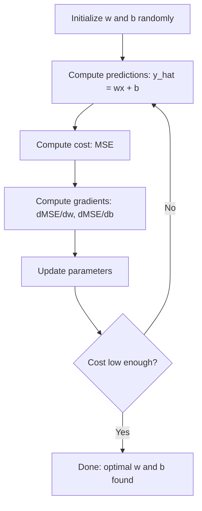

# Линейная регрессия

> Линейная регрессия проводит через данные лучшую прямую. Это «hello world» машинного обучения.

**Тип:** Практика
**Языки:** Python
**Требования:** Фаза 1 (линейная алгебра, математический анализ, оптимизация), Фаза 2 Урок 1
**Время:** ~90 минут

## Цели обучения

- Вывести правила обновления градиентного спуска для среднеквадратичной ошибки и реализовать линейную регрессию с нуля
- Сравнить градиентный спуск и нормальное уравнение по вычислительной сложности и понять, когда использовать каждый подход
- Построить модель множественной линейной регрессии со стандартизацией признаков и интерпретировать выученные веса
- Объяснить, как Ridge-регрессия (L2-регуляризация) предотвращает переобучение, штрафуя большие веса

## Проблема

У вас есть данные: площади домов и цены их продажи. Вы хотите предсказать цену нового дома по его площади. Можно прикинуть на глаз по scatter plot, но вам нужна формула. Нужна прямая, которая лучше всего описывает данные, чтобы подставить любую площадь и получить прогноз цены.

Линейная регрессия дает такую прямую. Что важнее, она вводит полный цикл обучения ML: задать модель, задать функцию стоимости, оптимизировать параметры. Каждый ML-алгоритм следует тому же шаблону. Освойте его здесь на самом простом случае, и вы будете узнавать его везде.

Это не только для простых задач. Линейная регрессия используется в production-системах для прогнозирования спроса, анализа A/B-тестов, финансового моделирования и как базовая модель для любой задачи регрессии.

## Концепция

### Модель

Линейная регрессия предполагает линейную зависимость между входом (x) и выходом (y):

```
y = wx + b
```

- `w` (вес/наклон): насколько меняется y, когда x увеличивается на 1
- `b` (сдвиг/intercept): значение y при x = 0

Для нескольких входов (признаков) это расширяется до:

```
y = w1*x1 + w2*x2 + ... + wn*xn + b
```

Или в векторной форме: `y = w^T * x + b`

Цель: найти значения w и b, при которых предсказанное y как можно ближе к фактическому y на всех обучающих примерах.

### Функция стоимости (среднеквадратичная ошибка)

Как измерить «как можно ближе»? Нужна одна величина, которая показывает, насколько ошибаются предсказания. Самый распространенный выбор — среднеквадратичная ошибка (Mean Squared Error, MSE):

```
MSE = (1/n) * sum((y_predicted - y_actual)^2)
```

Почему квадрат? По двум причинам. Во-первых, он штрафует большие ошибки сильнее малых (ошибка 10 в 100 раз хуже ошибки 1, а не в 10 раз). Во-вторых, квадратичная функция гладкая и дифференцируема везде, поэтому оптимизация становится простой.

Функция стоимости образует поверхность. Для одного веса w и сдвига b поверхность MSE похожа на чашу (выпуклый параболоид). Дно чаши — место, где MSE минимальна. Обучение означает найти это дно.

### Градиентный спуск

Градиентный спуск находит дно чаши, делая шаги вниз по склону.



Градиенты говорят две вещи: в каком направлении двигать каждый параметр и насколько сильно двигать.

Для MSE при y_hat = wx + b:

```
dMSE/dw = (2/n) * sum((y_hat - y) * x)
dMSE/db = (2/n) * sum(y_hat - y)
```

Правило обновления:

```
w = w - learning_rate * dMSE/dw
b = b - learning_rate * dMSE/db
```

Learning rate управляет размером шага. Слишком большой: вы перескакиваете минимум и расходитесь. Слишком маленький: обучение длится вечность. Типичные начальные значения: 0.01, 0.001 или 0.0001.

### Нормальное уравнение (закрытое решение)

Именно для линейной регрессии существует прямая формула, которая дает оптимальные веса без итераций:

```
w = (X^T * X)^(-1) * X^T * y
```

Она обращает матрицу и решает задачу для w за один шаг. Это отлично работает на маленьких наборах данных. Для больших наборов (миллионы строк или тысячи признаков) предпочтительнее градиентный спуск, потому что обращение матрицы имеет сложность O(n^3) по числу признаков.

### Множественная линейная регрессия

С несколькими признаками модель становится такой:

```
y = w1*x1 + w2*x2 + ... + wn*xn + b
```

Все работает так же: MSE — функция стоимости, градиентный спуск одновременно обновляет все веса. Единственная разница в том, что вы подгоняете гиперплоскость вместо прямой.

Здесь важно масштабирование признаков. Если один признак лежит в диапазоне от 0 до 1, а другой — от 0 до 1 000 000, градиентному спуску будет трудно, потому что поверхность стоимости станет вытянутой. Стандартизируйте признаки (вычесть среднее, разделить на стандартное отклонение) перед обучением.

### Полиномиальная регрессия

Что если зависимость нелинейна? Линейную регрессию все равно можно использовать, создав полиномиальные признаки:

```
y = w1*x + w2*x^2 + w3*x^3 + b
```

Это все еще «линейная» регрессия, потому что модель линейна по весам (w1, w2, w3). Вы просто используете нелинейные признаки от x.

Полиномы более высокой степени могут подгонять более сложные кривые, но рискуют переобучиться. Полином 10-й степени пройдет через каждую точку в наборе из 10 точек, но будет плохо предсказывать на новых данных.

### R-squared

MSE говорит, насколько вы ошибаетесь, но число зависит от масштаба y. R-squared (R^2) дает безмасштабную меру:

```
R^2 = 1 - (sum of squared residuals) / (sum of squared deviations from mean)
    = 1 - SS_res / SS_tot
```

- R^2 = 1.0: идеальные предсказания
- R^2 = 0.0: модель не лучше постоянного предсказания среднего
- R^2 < 0.0: модель хуже предсказания среднего

### Предпросмотр регуляризации (Ridge-регрессия)

Когда признаков много, модель может переобучиться, назначая большие веса. Ridge-регрессия (L2-регуляризация) добавляет штраф:

```
Cost = MSE + lambda * sum(w_i^2)
```

Штрафной член препятствует большим весам. Гиперпараметр lambda управляет компромиссом: чем выше lambda, тем меньше веса и сильнее регуляризация. Это подробно разбирается в следующем уроке. Сейчас достаточно знать, что такая техника существует и почему она помогает.

## Соберите это

### Шаг 1: сгенерировать пример данных

```python
import random
import math

random.seed(42)

TRUE_W = 3.0
TRUE_B = 7.0
N_SAMPLES = 100

X = [random.uniform(0, 10) for _ in range(N_SAMPLES)]
y = [TRUE_W * x + TRUE_B + random.gauss(0, 2.0) for x in X]

print(f"Generated {N_SAMPLES} samples")
print(f"True relationship: y = {TRUE_W}x + {TRUE_B} (+ noise)")
print(f"First 5 points: {[(round(X[i], 2), round(y[i], 2)) for i in range(5)]}")
```

### Шаг 2: линейная регрессия с нуля через градиентный спуск

```python
class LinearRegression:
    def __init__(self, learning_rate=0.01):
        self.w = 0.0
        self.b = 0.0
        self.lr = learning_rate
        self.cost_history = []

    def predict(self, X):
        return [self.w * x + self.b for x in X]

    def compute_cost(self, X, y):
        predictions = self.predict(X)
        n = len(y)
        cost = sum((pred - actual) ** 2 for pred, actual in zip(predictions, y)) / n
        return cost

    def compute_gradients(self, X, y):
        predictions = self.predict(X)
        n = len(y)
        dw = (2 / n) * sum((pred - actual) * x for pred, actual, x in zip(predictions, y, X))
        db = (2 / n) * sum(pred - actual for pred, actual in zip(predictions, y))
        return dw, db

    def fit(self, X, y, epochs=1000, print_every=200):
        for epoch in range(epochs):
            dw, db = self.compute_gradients(X, y)
            self.w -= self.lr * dw
            self.b -= self.lr * db
            cost = self.compute_cost(X, y)
            self.cost_history.append(cost)
            if epoch % print_every == 0:
                print(f"  Epoch {epoch:4d} | Cost: {cost:.4f} | w: {self.w:.4f} | b: {self.b:.4f}")
        return self

    def r_squared(self, X, y):
        predictions = self.predict(X)
        y_mean = sum(y) / len(y)
        ss_res = sum((actual - pred) ** 2 for actual, pred in zip(y, predictions))
        ss_tot = sum((actual - y_mean) ** 2 for actual in y)
        return 1 - (ss_res / ss_tot)


print("=== Training Linear Regression (Gradient Descent) ===")
model = LinearRegression(learning_rate=0.005)
model.fit(X, y, epochs=1000, print_every=200)
print(f"\nLearned: y = {model.w:.4f}x + {model.b:.4f}")
print(f"True:    y = {TRUE_W}x + {TRUE_B}")
print(f"R-squared: {model.r_squared(X, y):.4f}")
```

### Шаг 3: нормальное уравнение (закрытое решение)

```python
class LinearRegressionNormal:
    def __init__(self):
        self.w = 0.0
        self.b = 0.0

    def fit(self, X, y):
        n = len(X)
        x_mean = sum(X) / n
        y_mean = sum(y) / n
        numerator = sum((X[i] - x_mean) * (y[i] - y_mean) for i in range(n))
        denominator = sum((X[i] - x_mean) ** 2 for i in range(n))
        self.w = numerator / denominator
        self.b = y_mean - self.w * x_mean
        return self

    def predict(self, X):
        return [self.w * x + self.b for x in X]

    def r_squared(self, X, y):
        predictions = self.predict(X)
        y_mean = sum(y) / len(y)
        ss_res = sum((actual - pred) ** 2 for actual, pred in zip(y, predictions))
        ss_tot = sum((actual - y_mean) ** 2 for actual in y)
        return 1 - (ss_res / ss_tot)


print("\n=== Normal Equation (Closed-Form) ===")
model_normal = LinearRegressionNormal()
model_normal.fit(X, y)
print(f"Learned: y = {model_normal.w:.4f}x + {model_normal.b:.4f}")
print(f"R-squared: {model_normal.r_squared(X, y):.4f}")
```

### Шаг 4: множественная линейная регрессия

```python
class MultipleLinearRegression:
    def __init__(self, n_features, learning_rate=0.01):
        self.weights = [0.0] * n_features
        self.bias = 0.0
        self.lr = learning_rate
        self.cost_history = []

    def predict_single(self, x):
        return sum(w * xi for w, xi in zip(self.weights, x)) + self.bias

    def predict(self, X):
        return [self.predict_single(x) for x in X]

    def compute_cost(self, X, y):
        predictions = self.predict(X)
        n = len(y)
        return sum((pred - actual) ** 2 for pred, actual in zip(predictions, y)) / n

    def fit(self, X, y, epochs=1000, print_every=200):
        n = len(y)
        n_features = len(X[0])
        for epoch in range(epochs):
            predictions = self.predict(X)
            errors = [pred - actual for pred, actual in zip(predictions, y)]
            for j in range(n_features):
                grad = (2 / n) * sum(errors[i] * X[i][j] for i in range(n))
                self.weights[j] -= self.lr * grad
            grad_b = (2 / n) * sum(errors)
            self.bias -= self.lr * grad_b
            cost = self.compute_cost(X, y)
            self.cost_history.append(cost)
            if epoch % print_every == 0:
                print(f"  Epoch {epoch:4d} | Cost: {cost:.4f}")
        return self

    def r_squared(self, X, y):
        predictions = self.predict(X)
        y_mean = sum(y) / len(y)
        ss_res = sum((actual - pred) ** 2 for actual, pred in zip(y, predictions))
        ss_tot = sum((actual - y_mean) ** 2 for actual in y)
        return 1 - (ss_res / ss_tot)


random.seed(42)
N = 100
X_multi = []
y_multi = []
for _ in range(N):
    size = random.uniform(500, 3000)
    bedrooms = random.randint(1, 5)
    age = random.uniform(0, 50)
    price = 50 * size + 10000 * bedrooms - 1000 * age + 50000 + random.gauss(0, 20000)
    X_multi.append([size, bedrooms, age])
    y_multi.append(price)


def standardize(X):
    n_features = len(X[0])
    means = [sum(X[i][j] for i in range(len(X))) / len(X) for j in range(n_features)]
    stds = []
    for j in range(n_features):
        variance = sum((X[i][j] - means[j]) ** 2 for i in range(len(X))) / len(X)
        stds.append(variance ** 0.5)
    X_scaled = []
    for i in range(len(X)):
        row = [(X[i][j] - means[j]) / stds[j] if stds[j] > 0 else 0 for j in range(n_features)]
        X_scaled.append(row)
    return X_scaled, means, stds


y_mean_val = sum(y_multi) / len(y_multi)
y_std_val = (sum((yi - y_mean_val) ** 2 for yi in y_multi) / len(y_multi)) ** 0.5
y_scaled = [(yi - y_mean_val) / y_std_val for yi in y_multi]

X_scaled, x_means, x_stds = standardize(X_multi)

print("\n=== Multiple Linear Regression (3 features) ===")
print("Features: house size, bedrooms, age")
multi_model = MultipleLinearRegression(n_features=3, learning_rate=0.01)
multi_model.fit(X_scaled, y_scaled, epochs=1000, print_every=200)

print(f"\nWeights (standardized): {[round(w, 4) for w in multi_model.weights]}")
print(f"Bias (standardized): {multi_model.bias:.4f}")
print(f"R-squared: {multi_model.r_squared(X_scaled, y_scaled):.4f}")
```

### Шаг 5: полиномиальная регрессия

```python
class PolynomialRegression:
    def __init__(self, degree, learning_rate=0.01):
        self.degree = degree
        self.weights = [0.0] * degree
        self.bias = 0.0
        self.lr = learning_rate

    def make_features(self, X):
        return [[x ** (d + 1) for d in range(self.degree)] for x in X]

    def predict(self, X):
        features = self.make_features(X)
        return [sum(w * f for w, f in zip(self.weights, row)) + self.bias for row in features]

    def fit(self, X, y, epochs=1000, print_every=200):
        features = self.make_features(X)
        n = len(y)
        for epoch in range(epochs):
            predictions = [sum(w * f for w, f in zip(self.weights, row)) + self.bias for row in features]
            errors = [pred - actual for pred, actual in zip(predictions, y)]
            for j in range(self.degree):
                grad = (2 / n) * sum(errors[i] * features[i][j] for i in range(n))
                self.weights[j] -= self.lr * grad
            grad_b = (2 / n) * sum(errors)
            self.bias -= self.lr * grad_b
            if epoch % print_every == 0:
                cost = sum(e ** 2 for e in errors) / n
                print(f"  Epoch {epoch:4d} | Cost: {cost:.6f}")
        return self

    def r_squared(self, X, y):
        predictions = self.predict(X)
        y_mean = sum(y) / len(y)
        ss_res = sum((actual - pred) ** 2 for actual, pred in zip(y, predictions))
        ss_tot = sum((actual - y_mean) ** 2 for actual in y)
        return 1 - (ss_res / ss_tot)


random.seed(42)
X_poly = [x / 10.0 for x in range(0, 50)]
y_poly = [0.5 * x ** 2 - 2 * x + 3 + random.gauss(0, 1.0) for x in X_poly]

x_max = max(abs(x) for x in X_poly)
X_poly_norm = [x / x_max for x in X_poly]
y_poly_mean = sum(y_poly) / len(y_poly)
y_poly_std = (sum((yi - y_poly_mean) ** 2 for yi in y_poly) / len(y_poly)) ** 0.5
y_poly_norm = [(yi - y_poly_mean) / y_poly_std for yi in y_poly]

print("\n=== Polynomial Regression (degree 2 vs degree 5) ===")
print("True relationship: y = 0.5x^2 - 2x + 3")

print("\nDegree 2:")
poly2 = PolynomialRegression(degree=2, learning_rate=0.1)
poly2.fit(X_poly_norm, y_poly_norm, epochs=2000, print_every=500)
print(f"  R-squared: {poly2.r_squared(X_poly_norm, y_poly_norm):.4f}")

print("\nDegree 5:")
poly5 = PolynomialRegression(degree=5, learning_rate=0.1)
poly5.fit(X_poly_norm, y_poly_norm, epochs=2000, print_every=500)
print(f"  R-squared: {poly5.r_squared(X_poly_norm, y_poly_norm):.4f}")

print("\nDegree 2 fits the true curve well. Degree 5 fits training data slightly better")
print("but risks overfitting on new data.")
```

### Шаг 6: Ridge-регрессия (L2-регуляризация)

```python
class RidgeRegression:
    def __init__(self, n_features, learning_rate=0.01, alpha=1.0):
        self.weights = [0.0] * n_features
        self.bias = 0.0
        self.lr = learning_rate
        self.alpha = alpha

    def predict_single(self, x):
        return sum(w * xi for w, xi in zip(self.weights, x)) + self.bias

    def predict(self, X):
        return [self.predict_single(x) for x in X]

    def fit(self, X, y, epochs=1000, print_every=200):
        n = len(y)
        n_features = len(X[0])
        for epoch in range(epochs):
            predictions = self.predict(X)
            errors = [pred - actual for pred, actual in zip(predictions, y)]
            mse = sum(e ** 2 for e in errors) / n
            reg_term = self.alpha * sum(w ** 2 for w in self.weights)
            cost = mse + reg_term
            for j in range(n_features):
                grad = (2 / n) * sum(errors[i] * X[i][j] for i in range(n))
                grad += 2 * self.alpha * self.weights[j]
                self.weights[j] -= self.lr * grad
            grad_b = (2 / n) * sum(errors)
            self.bias -= self.lr * grad_b
            if epoch % print_every == 0:
                print(f"  Epoch {epoch:4d} | Cost: {cost:.4f} | L2 penalty: {reg_term:.4f}")
        return self


print("\n=== Ridge Regression (L2 Regularization) ===")
print("Same data as multiple regression, with alpha=0.1")
ridge = RidgeRegression(n_features=3, learning_rate=0.01, alpha=0.1)
ridge.fit(X_scaled, y_scaled, epochs=1000, print_every=200)
print(f"\nRidge weights: {[round(w, 4) for w in ridge.weights]}")
print(f"Plain weights: {[round(w, 4) for w in multi_model.weights]}")
print("Ridge weights are smaller (shrunk toward zero) due to the L2 penalty.")
```

### Ожидаемый вывод

Запустите `code/linear_regression.py` — последние строки должны быть такими:

```
=== Scikit-learn Comparison ===
Coefficient (w): 2.9197
Intercept (b): 7.2858
R-squared (test): 0.9686
MSE (test): 2.6148

Polynomial degree 2 R-squared: 0.9695
Ridge R-squared: 0.9689
```

## Используйте это

Теперь то же самое со scikit-learn — именно его вы будете использовать в production.

```python
from sklearn.linear_model import LinearRegression as SklearnLR
from sklearn.linear_model import Ridge
from sklearn.preprocessing import PolynomialFeatures, StandardScaler
from sklearn.model_selection import train_test_split
from sklearn.metrics import mean_squared_error, r2_score
import numpy as np

np.random.seed(42)
X_sk = np.random.uniform(0, 10, (100, 1))
y_sk = 3.0 * X_sk.squeeze() + 7.0 + np.random.normal(0, 2.0, 100)

X_train, X_test, y_train, y_test = train_test_split(X_sk, y_sk, test_size=0.2, random_state=42)

lr = SklearnLR()
lr.fit(X_train, y_train)
y_pred = lr.predict(X_test)

print("=== Scikit-learn Linear Regression ===")
print(f"Coefficient (w): {lr.coef_[0]:.4f}")
print(f"Intercept (b): {lr.intercept_:.4f}")
print(f"R-squared (test): {r2_score(y_test, y_pred):.4f}")
print(f"MSE (test): {mean_squared_error(y_test, y_pred):.4f}")

poly = PolynomialFeatures(degree=2, include_bias=False)
X_poly_sk = poly.fit_transform(X_train)
X_poly_test = poly.transform(X_test)

lr_poly = SklearnLR()
lr_poly.fit(X_poly_sk, y_train)
print(f"\nPolynomial degree 2 R-squared: {r2_score(y_test, lr_poly.predict(X_poly_test)):.4f}")

scaler = StandardScaler()
X_train_scaled = scaler.fit_transform(X_train)
X_test_scaled = scaler.transform(X_test)

ridge = Ridge(alpha=1.0)
ridge.fit(X_train_scaled, y_train)
print(f"Ridge R-squared: {r2_score(y_test, ridge.predict(X_test_scaled)):.4f}")
print(f"Ridge coefficient: {ridge.coef_[0]:.4f}")
```

Ваша реализация с нуля и scikit-learn дают одинаковые результаты. Разница в том, что scikit-learn обрабатывает пограничные случаи, численную устойчивость и оптимизации производительности. Используйте библиотеку в production. Версию с нуля используйте, чтобы понимать, что происходит.

## Доведите до результата

Этот урок создает:
- `outputs/skill-regression.md` — skill для выбора правильного регрессионного подхода по задаче

## Упражнения

1. Реализуйте batch gradient descent, stochastic gradient descent (SGD) и mini-batch gradient descent. Сравните скорость сходимости на одном и том же наборе данных. Какой сходится быстрее? У какого самая гладкая кривая стоимости?
2. Сгенерируйте данные из кубической функции (y = ax^3 + bx^2 + cx + d + шум). Подгоните полиномы степеней 1, 3 и 10. Сравните обучающий R^2 и тестовый R^2. На какой степени переобучение становится очевидным?
3. Реализуйте Lasso-регрессию (L1-регуляризация: penalty = alpha * sum(|w_i|)). Обучите ее на жилищных данных с несколькими признаками. Сравните, какие веса уходят в ноль по сравнению с Ridge. Почему L1 дает разреженные решения, а L2 — нет?

## Ключевые термины

| Термин | Как говорят | Что это на самом деле значит |
|--------|-------------|------------------------------|
| Линейная регрессия | «Провести линию через данные» | Найти вес w и сдвиг b, минимизирующие сумму квадратов разностей между wx+b и фактическими значениями y |
| Функция стоимости | «Насколько плоха модель» | Функция, отображающая параметры модели в одно число, измеряющее ошибку предсказаний; оптимизация минимизирует это число |
| Среднеквадратичная ошибка | «Среднее квадратов ошибок» | (1/n) * сумма (предсказанное - фактическое)^2, непропорционально сильно штрафующая большие ошибки |
| Градиентный спуск | «Идти вниз по склону» | Итеративно корректировать параметры в направлении уменьшения функции стоимости, используя частные производные |
| Learning rate | «Размер шага» | Скаляр, управляющий тем, насколько сильно параметры меняются на одном шаге градиентного спуска |
| Нормальное уравнение | «Решить напрямую» | Закрытое решение w = (X^T X)^-1 X^T y, дающее оптимальные веса без итераций |
| R-squared | «Насколько хороша подгонка» | Доля дисперсии y, объясненная моделью; диапазон от минус бесконечности до 1.0 |
| Масштабирование признаков | «Сделать признаки сопоставимыми» | Преобразование признаков к похожим диапазонам (например, нулевое среднее и единичная дисперсия), чтобы градиентный спуск сходился быстрее |
| Регуляризация | «Штрафовать сложность» | Добавление к функции стоимости члена, уменьшающего веса и предотвращающего переобучение |
| Ridge-регрессия | «L2-регуляризация» | Линейная регрессия со штрафом lambda * sum(w_i^2), добавленным к MSE |
| Полиномиальная регрессия | «Подгонять кривые линейной математикой» | Линейная регрессия на полиномиальных признаках (x, x^2, x^3, ...), все еще линейная по весам |
| Переобучение | «Запоминание обучающих данных» | Использование настолько сложной модели, что она подгоняет шум в обучающих данных и проваливается на новых |

## Дополнительное чтение

- [An Introduction to Statistical Learning (ISLR)](https://www.statlearning.com/) — бесплатный PDF; главы 3 и 6 покрывают линейную регрессию и регуляризацию с практическими примерами на R
- [The Elements of Statistical Learning (ESL)](https://hastie.su.domains/ElemStatLearn/) — бесплатный PDF; более математическое дополнение к ISLR с более глубоким разбором ridge и lasso
- [Stanford CS229 Lecture Notes on Linear Regression](https://cs229.stanford.edu/main_notes.pdf) — конспекты Andrew Ng с выводом нормального уравнения и градиентного спуска с первых принципов
- [scikit-learn LinearRegression documentation](https://scikit-learn.org/stable/modules/linear_model.html) — практический справочник по LinearRegression, Ridge, Lasso и ElasticNet с примерами кода
