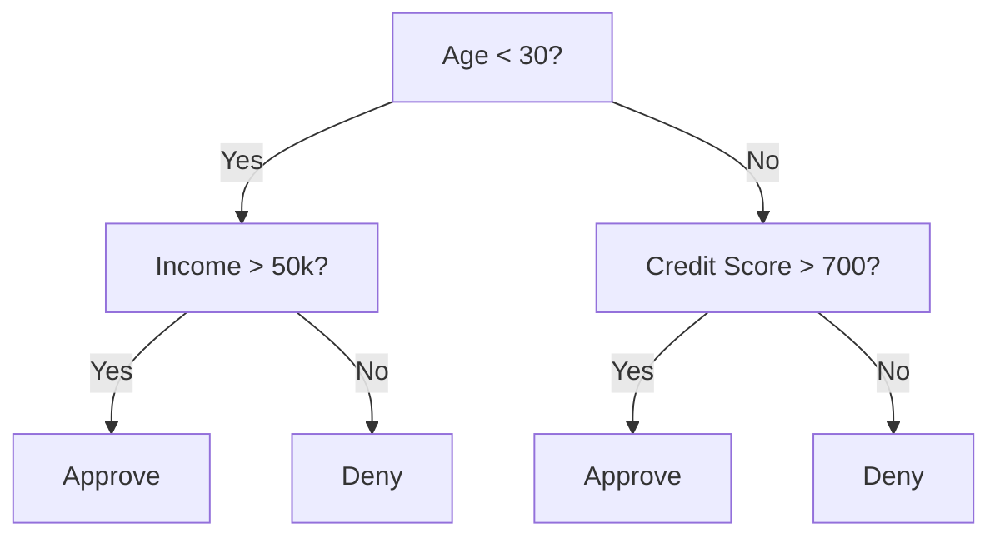
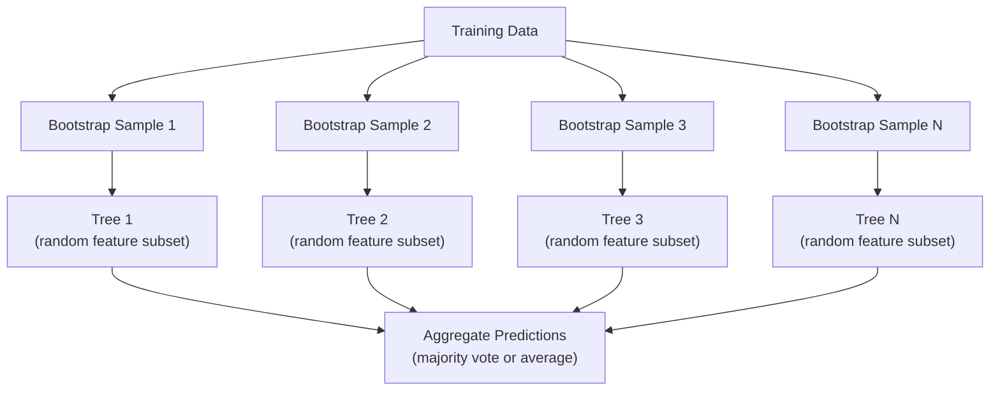

# Деревья решений и случайные леса

> Дерево решений — это просто блок-схема. Но лес из таких деревьев — один из самых сильных инструментов в ML.

**Тип:** Практика
**Язык:** Python
**Требования:** Фаза 1 (уроки 09 «Теория информации», 06 «Вероятность»)
**Время:** ~90 минут

## Цели обучения

- Реализовать вычисления нечистоты Джини, энтропии и информационного выигрыша для поиска оптимальных разбиений дерева решений
- Построить классификатор дерева решений с нуля с управлением предварительной обрезкой (max depth, min samples)
- Собрать случайный лес с bootstrap-выборками и рандомизацией признаков и объяснить, почему это снижает дисперсию
- Сравнить важность признаков MDI с permutation importance и определить, когда MDI смещена

## Проблема

У вас есть табличные данные. Строки — объекты, столбцы — признаки, и есть целевой столбец, который нужно предсказать. Можно бросить на это нейросеть. Но для табличных данных модели на деревьях (деревья решений, случайные леса, градиентный бустинг над деревьями) стабильно превосходят deep learning. В соревнованиях Kaggle на структурированных данных доминируют XGBoost и LightGBM, а не трансформеры.

Почему? Деревья работают со смешанными типами признаков (числовыми и категориальными) без сложной предобработки. Они обрабатывают нелинейные зависимости без feature engineering. Они интерпретируемы: можно посмотреть на дерево и увидеть, почему было сделано предсказание. А случайные леса, усредняющие много деревьев, очень устойчивы к переобучению на наборах данных среднего размера.

В этом уроке мы строим деревья решений с нуля через рекурсивное разбиение, а затем поверх них строим случайный лес. Вы реализуете математику критериев разбиения (нечистота Джини, энтропия, информационный выигрыш) и поймете, почему ансамбль слабых моделей становится сильной моделью.

## Концепция

### Что делает дерево решений

Дерево решений разбивает пространство признаков на прямоугольные области, задавая последовательность вопросов «да/нет».



Каждый внутренний узел проверяет признак относительно порога. Каждый лист делает предсказание. Чтобы классифицировать новую точку данных, вы начинаете с корня и идете по веткам, пока не дойдете до листа.

Дерево строится сверху вниз: в каждом узле выбирается признак и порог, которые лучше всего разделяют данные. «Лучше всего» определяется критерием разбиения.

### Критерии разбиения: измерение нечистоты

В каждом узле есть набор примеров. Мы хотим разделить их так, чтобы дочерние узлы были как можно более «чистыми», то есть каждый дочерний узел содержал в основном один класс.

**Нечистота Джини (Gini impurity)** измеряет вероятность того, что случайно выбранный пример будет классифицирован неверно, если присвоить ему метку согласно распределению классов в этом узле.

```
Gini(S) = 1 - sum(p_k^2)

where p_k is the proportion of class k in set S.
```

Для чистого узла (все примеры одного класса) Gini = 0. Для бинарного разбиения 50/50 Gini = 0.5. Меньше — лучше.

```
Example: 6 cats, 4 dogs

Gini = 1 - (0.6^2 + 0.4^2) = 1 - (0.36 + 0.16) = 0.48
```

**Энтропия** измеряет информационное содержание (беспорядок) в узле. Это разбиралось в Фазе 1 Уроке 09.

```
Entropy(S) = -sum(p_k * log2(p_k))
```

Для чистого узла entropy = 0. Для бинарного разбиения 50/50 entropy = 1.0. Меньше — лучше.

```
Example: 6 cats, 4 dogs

Entropy = -(0.6 * log2(0.6) + 0.4 * log2(0.4))
        = -(0.6 * -0.737 + 0.4 * -1.322)
        = 0.442 + 0.529
        = 0.971 bits
```

**Информационный выигрыш (information gain)** — это уменьшение нечистоты (энтропии или Gini) после разбиения.

```
IG(S, feature, threshold) = Impurity(S) - weighted_avg(Impurity(S_left), Impurity(S_right))

where the weights are the proportions of samples in each child.
```

Жадный алгоритм в каждом узле: попробовать каждый признак и каждый возможный порог. Выбрать пару (признак, порог), которая максимизирует информационный выигрыш.

### Как работает разбиение

Для набора данных с n признаками и m примерами в текущем узле:

1. Для каждого признака j (j = 1 ... n):
   - Отсортировать примеры по признаку j
   - Попробовать каждый midpoint между соседними различными значениями как порог
   - Вычислить информационный выигрыш для каждого порога
2. Выбрать признак и порог с максимальным информационным выигрышем
3. Разделить данные на left (feature <= threshold) и right (feature > threshold)
4. Рекурсивно повторить для каждого дочернего узла

Этот жадный подход не гарантирует глобально оптимального дерева. Поиск оптимального дерева — NP-трудная задача. Но на практике жадное разбиение работает хорошо.

### Условия остановки

Без условий остановки дерево растет, пока каждый лист не станет чистым (один пример на лист). Это идеально запоминает обучающие данные и ужасно обобщает.

**Предварительная обрезка (pre-pruning)** останавливает дерево до полного роста:
- Максимальная глубина: остановить разбиение, когда дерево достигло заданной глубины
- Минимум примеров в листе: остановить, если в узле меньше k примеров
- Минимальный информационный выигрыш: остановить, если лучшее разбиение улучшает нечистоту меньше заданного порога
- Максимальное число листьев: ограничить общее число листьев

**Пост-обрезка (post-pruning)** сначала выращивает полное дерево, затем подрезает его:
- Cost-complexity pruning (используется в scikit-learn): добавляет штраф, пропорциональный числу листьев. Увеличение штрафа дает меньшие деревья
- Reduced error pruning: удалить поддерево, если ошибка на валидации не увеличивается

Pre-pruning проще и быстрее. Post-pruning часто дает лучшие деревья, потому что не останавливает преждевременно разбиения, которые могли бы привести к полезным дальнейшим разбиениям.

### Деревья решений для регрессии

Для регрессии предсказание в листе — среднее целевых значений в этом листе. Критерий разбиения тоже меняется:

**Уменьшение дисперсии (variance reduction)** заменяет информационный выигрыш:

```
VR(S, feature, threshold) = Var(S) - weighted_avg(Var(S_left), Var(S_right))
```

Выбирается разбиение, которое сильнее всего уменьшает дисперсию. Дерево разбивает входное пространство на области и предсказывает константу (среднее) в каждой области.

### Случайные леса: сила ансамблей

Одно дерево решений имеет высокую дисперсию. Малые изменения данных могут дать совершенно другие деревья. Случайные леса исправляют это, усредняя много деревьев.



Два источника случайности делают деревья разнообразными:

**Bagging (bootstrap aggregating):** каждое дерево обучается на bootstrap-выборке — случайной выборке с возвращением из обучающих данных. Около 63% исходных примеров попадают в каждый bootstrap (остальные — out-of-bag samples, их можно использовать для валидации).

**Рандомизация признаков:** в каждом разбиении рассматривается только случайное подмножество признаков. Для классификации стандартно берут sqrt(n_features). Для регрессии — n_features/3. Это не дает всем деревьям делить по одному и тому же доминирующему признаку.

Ключевая идея: усреднение множества декоррелированных деревьев снижает дисперсию, не увеличивая смещение. Каждое отдельное дерево может быть посредственным. Ансамбль получается сильным.

### Важность признаков

Случайные леса естественно дают оценки важности признаков. Самый распространенный метод:

**Mean Decrease in Impurity (MDI):** для каждого признака суммируется полное уменьшение нечистоты по всем деревьям и всем узлам, где этот признак использовался. Признаки, которые дают большие уменьшения нечистоты на ранних разбиениях, считаются более важными.

```
importance(feature_j) = sum over all nodes where feature_j is used:
    (n_samples_at_node / n_total_samples) * impurity_decrease
```

Это быстро (вычисляется во время обучения), но смещено в пользу признаков с высокой кардинальностью и признаков с большим числом возможных точек разбиения.

**Permutation importance** — альтернатива: перемешать значения одного признака и измерить, насколько падает accuracy модели. Надежнее, но медленнее.

### Когда деревья побеждают нейросети

Деревья и леса доминируют над нейросетями на табличных данных. Причин несколько:

| Фактор | Деревья | Нейросети |
|--------|---------|-----------|
| Смешанные типы (числовые + категориальные) | Нативная поддержка | Нужно кодирование |
| Маленькие наборы данных (< 10k строк) | Хорошо работают | Переобучаются |
| Взаимодействия признаков | Находятся разбиениями | Нужен дизайн архитектуры |
| Интерпретируемость | Полная прозрачность | Черный ящик |
| Время обучения | Минуты | Часы |
| Чувствительность к гиперпараметрам | Низкая | Высокая |

Нейросети выигрывают, когда данные имеют пространственную или последовательную структуру (изображения, текст, аудио). Для плоских таблиц признаков деревья — выбор по умолчанию.

## Соберите это

### Шаг 1: нечистота Джини и энтропия

Постройте оба критерия разбиения с нуля и проверьте, что они согласуются в том, какие разбиения хороши.

```python
import math

def gini_impurity(labels):
    n = len(labels)
    if n == 0:
        return 0.0
    counts = {}
    for label in labels:
        counts[label] = counts.get(label, 0) + 1
    return 1.0 - sum((c / n) ** 2 for c in counts.values())

def entropy(labels):
    n = len(labels)
    if n == 0:
        return 0.0
    counts = {}
    for label in labels:
        counts[label] = counts.get(label, 0) + 1
    return -sum(
        (c / n) * math.log2(c / n) for c in counts.values() if c > 0
    )
```

### Шаг 2: найти лучшее разбиение

Попробуйте каждый признак и каждый порог. Верните тот, у которого максимальный информационный выигрыш.

```python
def information_gain(parent_labels, left_labels, right_labels, criterion="gini"):
    measure = gini_impurity if criterion == "gini" else entropy
    n = len(parent_labels)
    n_left = len(left_labels)
    n_right = len(right_labels)
    if n_left == 0 or n_right == 0:
        return 0.0
    parent_impurity = measure(parent_labels)
    child_impurity = (
        (n_left / n) * measure(left_labels) +
        (n_right / n) * measure(right_labels)
    )
    return parent_impurity - child_impurity
```

### Шаг 3: построить класс DecisionTree

Рекурсивное разбиение, предсказание и отслеживание важности признаков.

```python
class DecisionTree:
    def __init__(self, max_depth=None, min_samples_split=2,
                 min_samples_leaf=1, criterion="gini",
                 max_features=None):
        self.max_depth = max_depth
        self.min_samples_split = min_samples_split
        self.min_samples_leaf = min_samples_leaf
        self.criterion = criterion
        self.max_features = max_features
        self.tree = None
        self.feature_importances_ = None

    def fit(self, X, y):
        self.n_features = len(X[0])
        self.feature_importances_ = [0.0] * self.n_features
        self.n_samples = len(X)
        self.tree = self._build(X, y, depth=0)
        total = sum(self.feature_importances_)
        if total > 0:
            self.feature_importances_ = [
                fi / total for fi in self.feature_importances_
            ]

    def predict(self, X):
        return [self._predict_one(x, self.tree) for x in X]
```

### Шаг 4: построить класс RandomForest

Bootstrap-выборки, рандомизация признаков и голосование большинством.

```python
class RandomForest:
    def __init__(self, n_trees=100, max_depth=None,
                 min_samples_split=2, max_features="sqrt",
                 criterion="gini"):
        self.n_trees = n_trees
        self.max_depth = max_depth
        self.min_samples_split = min_samples_split
        self.max_features = max_features
        self.criterion = criterion
        self.trees = []

    def fit(self, X, y):
        n = len(X)
        for _ in range(self.n_trees):
            indices = [random.randint(0, n - 1) for _ in range(n)]
            X_boot = [X[i] for i in indices]
            y_boot = [y[i] for i in indices]
            tree = DecisionTree(
                max_depth=self.max_depth,
                min_samples_split=self.min_samples_split,
                max_features=self.max_features,
                criterion=self.criterion,
            )
            tree.fit(X_boot, y_boot)
            self.trees.append(tree)

    def predict(self, X):
        all_preds = [tree.predict(X) for tree in self.trees]
        predictions = []
        for i in range(len(X)):
            votes = {}
            for preds in all_preds:
                v = preds[i]
                votes[v] = votes.get(v, 0) + 1
            predictions.append(max(votes, key=votes.get))
        return predictions
```

Полную реализацию со всеми вспомогательными методами смотрите в `code/trees.py`.

## Используйте это

Со scikit-learn обучение случайного леса занимает три строки:

```python
from sklearn.ensemble import RandomForestClassifier
from sklearn.datasets import load_iris
from sklearn.model_selection import train_test_split

X, y = load_iris(return_X_y=True)
X_train, X_test, y_train, y_test = train_test_split(X, y, random_state=42)

rf = RandomForestClassifier(n_estimators=100, random_state=42)
rf.fit(X_train, y_train)
print(f"Accuracy: {rf.score(X_test, y_test):.4f}")
print(f"Feature importances: {rf.feature_importances_}")
```

На практике gradient boosted trees (XGBoost, LightGBM, CatBoost) часто сильнее случайных лесов, потому что строят деревья последовательно: каждое следующее дерево исправляет ошибки предыдущих. Но случайные леса сложнее испортить настройками, и им почти не нужен подбор гиперпараметров.

## Доведите до результата

Этот урок создает `outputs/prompt-tree-interpreter.md` — промпт, который интерпретирует разбиения дерева решений для бизнес-стейкхолдеров. Передайте ему структуру обученного дерева (глубина, признаки, пороги разбиения, accuracy), и он переведет модель в правила на обычном языке, ранжирует важность признаков, отметит переобучение или утечку данных и порекомендует следующие шаги. Используйте его каждый раз, когда нужно объяснить модель на деревьях человеку, который не читает код.

## Упражнения

1. Обучите одно дерево решений на двумерном наборе данных с 3 классами. Вручную проследите разбиения и нарисуйте прямоугольные границы решений. Сравните границы при max_depth=2 и max_depth=10.

2. Реализуйте разбиение по уменьшению дисперсии для регрессионных деревьев. Сгенерируйте y = sin(x) + шум для 200 точек и подгоните регрессионное дерево. Постройте кусочно-постоянные предсказания дерева рядом с истинной кривой.

3. Постройте случайный лес с 1, 5, 10, 50 и 200 деревьями. Постройте график обучающей accuracy и тестовой accuracy от числа деревьев. Заметьте, что тестовая accuracy выходит на плато, но не падает (леса сопротивляются переобучению).

4. Сравните нечистоту Джини и энтропию как критерии разбиения на 5 разных наборах данных. Измерьте accuracy и глубину дерева. В большинстве случаев они дают почти одинаковые результаты. Объясните почему.

5. Реализуйте permutation importance. Сравните ее с MDI importance на наборе данных, где один признак является случайным шумом, но имеет высокую кардинальность. MDI высоко оценит шумовой признак. Permutation importance — нет.

## Ключевые термины

| Термин | Как говорят | Что это на самом деле значит |
|--------|-------------|------------------------------|
| Дерево решений | «Блок-схема для предсказаний» | Модель, которая разбивает пространство признаков на прямоугольные области, обучая последовательность if/else-разбиений |
| Нечистота Джини | «Насколько узел смешанный» | Вероятность ошибочно классифицировать случайный пример в узле. 0 = чистый, 0.5 = максимум нечистоты для бинарного случая |
| Энтропия | «Беспорядок в узле» | Информационное содержание в узле. 0 = чистый, 1.0 = максимальная неопределенность для бинарного случая. Из теории информации |
| Информационный выигрыш | «Насколько хорош split» | Уменьшение нечистоты после разбиения. Жадный критерий выбора split |
| Pre-pruning | «Остановить дерево раньше» | Ранняя остановка роста дерева через max depth, min samples или min gain thresholds |
| Post-pruning | «Подрезать дерево после» | Вырастить полное дерево, затем удалить поддеревья, которые не улучшают качество на валидации |
| Bagging | «Обучать на случайных поднаборах» | Bootstrap aggregating. Обучение каждой модели на другой случайной выборке с возвращением |
| Случайный лес | «Куча деревьев» | Ансамбль деревьев решений, каждое обучено на bootstrap-выборке со случайными подмножествами признаков в каждом split |
| Важность признаков (MDI) | «Какие признаки важны» | Полное уменьшение нечистоты, внесенное каждым признаком, суммированное по всем деревьям и узлам |
| Permutation importance | «Перемешать и проверить» | Падение accuracy, когда значения признака случайно перемешаны. Надежнее MDI для шумовых признаков |
| Уменьшение дисперсии | «Регрессионная версия info gain» | Аналог информационного выигрыша для регрессионных деревьев. Выбирает split, сильнее всего уменьшающий дисперсию target |
| Bootstrap-выборка | «Случайная выборка с повторами» | Случайная выборка с возвращением из исходного набора данных. Того же размера, но с дубликатами |

## Дополнительное чтение

- [Breiman: Random Forests (2001)](https://link.springer.com/article/10.1023/A:1010933404324) — оригинальная статья о random forest
- [Grinsztajn et al.: Why do tree-based models still outperform deep learning on tabular data? (2022)](https://arxiv.org/abs/2207.08815) — строгий сравнительный анализ деревьев и нейросетей на табличных задачах
- [scikit-learn Decision Trees documentation](https://scikit-learn.org/stable/modules/tree.html) — практическое руководство с инструментами визуализации
- [XGBoost: A Scalable Tree Boosting System (Chen & Guestrin, 2016)](https://arxiv.org/abs/1603.02754) — статья о gradient boosting, который доминирует на Kaggle
