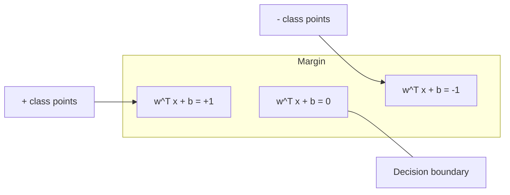
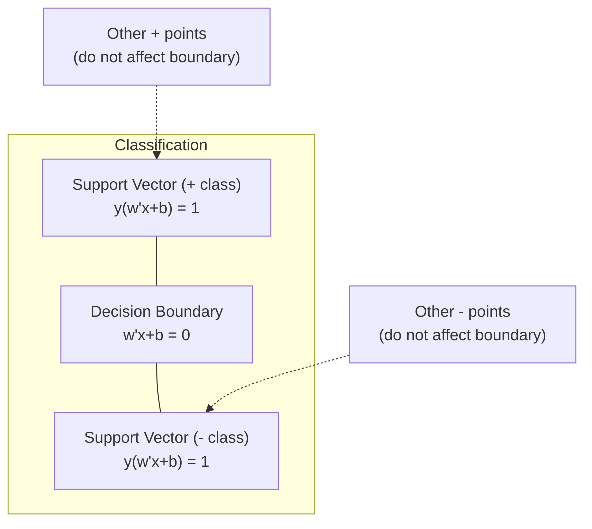
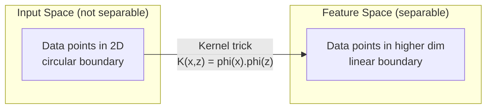

# Метод опорных векторов

> Найдите самую широкую улицу между двумя классами. В этом вся идея.

**Тип:** Практика
**Язык:** Python
**Требования:** Фаза 1 (уроки 08 «Оптимизация», 14 «Нормы и расстояния», 18 «Выпуклая оптимизация»)
**Время:** ~90 минут

## Цели обучения

- Реализовать линейный SVM с нуля, используя hinge loss и градиентный спуск для прямой (primal) постановки
- Объяснить принцип максимального зазора и определить опорные векторы в обученной модели
- Сравнить линейное, полиномиальное и RBF-ядра и объяснить, как kernel trick избегает явного отображения в пространство высокой размерности
- Оценить компромисс, которым управляет параметр C: ширина зазора против ошибок классификации

## Проблема

У вас есть два класса точек данных, и нужно провести линию (или гиперплоскость), которая их разделяет. Подойти могут бесконечно многие линии. Какую выбрать?

Ту, у которой самый большой зазор (margin). Margin — это расстояние между границей решений и ближайшими точками данных с каждой стороны. Более широкий margin означает, что классификатор увереннее и лучше обобщает на невидимые данные.

Эта интуиция приводит к Support Vector Machines, одному из самых математически элегантных алгоритмов в ML. До deep learning SVM были доминирующим методом классификации и до сих пор остаются отличным выбором для малых наборов данных, высокоразмерных данных и задач, где нужна принципиальная, хорошо понятная модель с теоретическими гарантиями.

SVM напрямую связан с Фазой 1: оптимизация выпуклая (Урок 18), margin измеряется нормами (Урок 14), а kernel trick использует скалярные произведения, чтобы работать с нелинейными границами, никогда явно не считая координаты в высокоразмерном пространстве.

## Концепция

### Классификатор с максимальным зазором

Даны линейно разделимые данные с метками y_i из {-1, +1} и векторами признаков x_i. Мы хотим гиперплоскость w^T x + b = 0, разделяющую классы.

Расстояние от точки x_i до гиперплоскости:

```
distance = |w^T x_i + b| / ||w||
```

Для правильно классифицированной точки: y_i * (w^T x_i + b) > 0. Margin — это удвоенное расстояние от гиперплоскости до ближайшей точки по любую сторону.



Задача оптимизации:

```
maximize    2 / ||w||     (the margin width)
subject to  y_i * (w^T x_i + b) >= 1  for all i
```

Эквивалентно (минимизировать ||w||^2 удобнее):

```
minimize    (1/2) ||w||^2
subject to  y_i * (w^T x_i + b) >= 1  for all i
```

Это выпуклая квадратичная программа. У нее есть единственное глобальное решение. Точки данных, лежащие ровно на границах margin (где y_i * (w^T x_i + b) = 1), — это опорные векторы. Только они определяют границу решений. Сдвиньте или удалите любую не-опорную точку, и граница не изменится.

### Опорные векторы: несколько критически важных точек



Большинство обучающих точек нерелевантны. Важны только опорные векторы. Поэтому SVM экономны по памяти во время предсказания: нужно хранить опорные векторы, а не весь обучающий набор.

Число опорных векторов также дает оценку ошибки обобщения. Чем меньше опорных векторов относительно размера набора данных, тем лучше обобщение.

### Soft margin: работа с шумом через параметр C

Реальные данные редко идеально разделимы. Некоторые точки могут оказаться не на той стороне границы или внутри margin. Постановка soft margin разрешает нарушения, вводя slack variables.

```
minimize    (1/2) ||w||^2 + C * sum(xi_i)
subject to  y_i * (w^T x_i + b) >= 1 - xi_i
            xi_i >= 0  for all i
```

Slack-переменная xi_i измеряет, насколько точка i нарушает margin. C управляет компромиссом:

| Значение C | Поведение |
|------------|-----------|
| Большое C | Сильно штрафует нарушения. Узкий margin, меньше ошибок классификации. Переобучается |
| Малое C | Разрешает больше нарушений. Широкий margin, больше ошибок классификации. Недообучается |

C — это сила регуляризации, взятая наоборот. Большое C = меньше регуляризации. Малое C = больше регуляризации.

### Hinge loss: функция потерь SVM

Soft margin SVM можно переписать как оптимизацию без ограничений:

```
minimize    (1/2) ||w||^2 + C * sum(max(0, 1 - y_i * (w^T x_i + b)))
```

Член max(0, 1 - y_i * f(x_i)) — это hinge loss. Он равен нулю, когда точка классифицирована правильно и находится за пределами margin. Он линейный, когда точка внутри margin или классифицирована неверно.

```
Hinge loss for a single point:

loss
  |
  | \
  |  \
  |   \
  |    \
  |     \_______________
  |
  +-----|-----|-------->  y * f(x)
       0     1

Zero loss when y*f(x) >= 1 (correctly classified, outside margin).
Linear penalty when y*f(x) < 1.
```

Сравнение с logistic loss (логистическая регрессия):

```
Hinge:     max(0, 1 - y*f(x))          Hard cutoff at margin
Logistic:  log(1 + exp(-y*f(x)))        Smooth, never exactly zero
```

Hinge loss дает разреженные решения (ненулевой вклад имеют только опорные векторы). Logistic loss использует все точки данных. Поэтому SVM более экономен по памяти во время предсказания.

### Обучение линейного SVM градиентным спуском

Линейный SVM можно обучать градиентным спуском по hinge loss с L2-регуляризацией, не решая задачу квадратичного программирования с ограничениями:

```
L(w, b) = (lambda/2) * ||w||^2 + (1/n) * sum(max(0, 1 - y_i * (w^T x_i + b)))

Gradient with respect to w:
  If y_i * (w^T x_i + b) >= 1:  dL/dw = lambda * w
  If y_i * (w^T x_i + b) < 1:   dL/dw = lambda * w - y_i * x_i

Gradient with respect to b:
  If y_i * (w^T x_i + b) >= 1:  dL/db = 0
  If y_i * (w^T x_i + b) < 1:   dL/db = -y_i
```

Это называется прямой постановкой (primal formulation). Она работает за O(n * d) на эпоху, где n — число примеров, а d — число признаков. Для больших, разреженных и высокоразмерных данных (классификация текстов) это быстро.

### Двойственная постановка и kernel trick

Лагранжева двойственная задача для SVM (из Фазы 1 Урока 18, условия KKT):

```
maximize    sum(alpha_i) - (1/2) * sum_ij(alpha_i * alpha_j * y_i * y_j * (x_i . x_j))
subject to  0 <= alpha_i <= C
            sum(alpha_i * y_i) = 0
```

В dual участвуют только скалярные произведения x_i . x_j между точками данных. Это ключевая идея. Замените каждое скалярное произведение на функцию ядра K(x_i, x_j), и SVM сможет учить нелинейные границы, никогда явно не вычисляя преобразование.

```
Linear kernel:      K(x, z) = x . z
Polynomial kernel:  K(x, z) = (x . z + c)^d
RBF (Gaussian):     K(x, z) = exp(-gamma * ||x - z||^2)
```

RBF-ядро отображает данные в бесконечномерное пространство. Точки, близкие во входном пространстве, имеют значение ядра около 1. Далекие точки имеют значение около 0. Оно способно выучить любую гладкую границу решений.



Kernel trick вычисляет скалярное произведение в высокоразмерном пространстве, ни разу туда явно не переходя. Для полиномиального ядра степени d в D измерениях явное пространство признаков имеет O(D^d) измерений. Но K(x, z) считается за O(D).

### SVM для регрессии (SVR)

Support Vector Regression подгоняет вокруг данных «трубку» ширины epsilon. Точки внутри трубки имеют нулевую потерю. Точки снаружи штрафуются линейно.

```
minimize    (1/2) ||w||^2 + C * sum(xi_i + xi_i*)
subject to  y_i - (w^T x_i + b) <= epsilon + xi_i
            (w^T x_i + b) - y_i <= epsilon + xi_i*
            xi_i, xi_i* >= 0
```

Параметр epsilon управляет шириной трубки. Более широкая трубка = меньше опорных векторов = более гладкая подгонка. Более узкая трубка = больше опорных векторов = более плотная подгонка.

### Почему SVM уступили deep learning (и когда они все еще выигрывают)

SVM доминировали в ML с конца 1990-х до начала 2010-х. Deep learning превзошел их по нескольким причинам:

| Фактор | SVM | Deep learning |
|--------|-----|---------------|
| Feature engineering | Требуется | Признаки выучиваются |
| Масштабируемость | O(n^2) до O(n^3) для kernel | O(n) на эпоху с SGD |
| Изображения/текст/аудио | Нужны ручные признаки | Учится на сырых данных |
| Большие наборы данных (>100k) | Медленно | Хорошо масштабируется |
| GPU-ускорение | Ограниченная польза | Огромное ускорение |

SVM все еще выигрывают в таких ситуациях:
- Малые наборы данных (сотни или первые тысячи примеров)
- Высокоразмерные разреженные данные (тексты с TF-IDF-признаками)
- Нужны математические гарантии (границы через margin)
- Время обучения должно быть минимальным (линейный SVM очень быстрый)
- Бинарная классификация с явной margin-структурой
- Поиск аномалий (one-class SVM)

## Соберите это

### Шаг 1: hinge loss и градиент

Основа. Вычислите hinge loss для батча и его градиент.

```python
def hinge_loss(X, y, w, b):
    n = len(X)
    total_loss = 0.0
    for i in range(n):
        margin = y[i] * (dot(w, X[i]) + b)
        total_loss += max(0.0, 1.0 - margin)
    return total_loss / n
```

### Шаг 2: линейный SVM через градиентный спуск

Обучайте, минимизируя регуляризованный hinge loss. QP-solver не нужен.

```python
class LinearSVM:
    def __init__(self, lr=0.001, lambda_param=0.01, n_epochs=1000):
        self.lr = lr
        self.lambda_param = lambda_param
        self.n_epochs = n_epochs
        self.w = None
        self.b = 0.0

    def fit(self, X, y):
        n_features = len(X[0])
        self.w = [0.0] * n_features
        self.b = 0.0

        for epoch in range(self.n_epochs):
            for i in range(len(X)):
                margin = y[i] * (dot(self.w, X[i]) + self.b)
                if margin >= 1:
                    self.w = [wj - self.lr * self.lambda_param * wj
                              for wj in self.w]
                else:
                    self.w = [wj - self.lr * (self.lambda_param * wj - y[i] * X[i][j])
                              for j, wj in enumerate(self.w)]
                    self.b -= self.lr * (-y[i])

    def predict(self, X):
        return [1 if dot(self.w, x) + self.b >= 0 else -1 for x in X]
```

### Шаг 3: функции ядра

Реализуйте линейное, полиномиальное и RBF-ядро.

```python
def linear_kernel(x, z):
    return dot(x, z)

def polynomial_kernel(x, z, degree=3, c=1.0):
    return (dot(x, z) + c) ** degree

def rbf_kernel(x, z, gamma=0.5):
    diff = [xi - zi for xi, zi in zip(x, z)]
    return math.exp(-gamma * dot(diff, diff))
```

### Шаг 4: margin и поиск опорных векторов

После обучения определите, какие точки являются опорными векторами, и вычислите ширину margin.

```python
def find_support_vectors(X, y, w, b, tol=1e-3):
    support_vectors = []
    for i in range(len(X)):
        margin = y[i] * (dot(w, X[i]) + b)
        if abs(margin - 1.0) < tol:
            support_vectors.append(i)
    return support_vectors
```

Полную реализацию со всеми demo смотрите в `code/svm.py`.

## Используйте это

Со scikit-learn:

```python
from sklearn.svm import SVC, LinearSVC, SVR
from sklearn.preprocessing import StandardScaler
from sklearn.pipeline import Pipeline

clf = Pipeline([
    ("scaler", StandardScaler()),
    ("svm", SVC(kernel="rbf", C=1.0, gamma="scale")),
])
clf.fit(X_train, y_train)
print(f"Accuracy: {clf.score(X_test, y_test):.4f}")
print(f"Support vectors: {clf['svm'].n_support_}")
```

Важно: всегда масштабируйте признаки перед обучением SVM. SVM чувствительны к величинам признаков, потому что margin зависит от ||w||, а немасштабированные признаки искажают геометрию.

Для больших наборов данных используйте `LinearSVC` (primal formulation, O(n) на эпоху) вместо `SVC` (dual formulation, O(n^2) до O(n^3)):

```python
from sklearn.svm import LinearSVC

clf = Pipeline([
    ("scaler", StandardScaler()),
    ("svm", LinearSVC(C=1.0, max_iter=10000)),
])
```

## Упражнения

1. Сгенерируйте двумерный линейно разделимый набор данных. Обучите свой LinearSVM и найдите опорные векторы. Проверьте, что опорные векторы — это точки, ближайшие к границе решений.

2. Меняйте C от 0.001 до 1000 на шумном наборе данных. Постройте границу решений для каждого значения C. Наблюдайте переход от широкого margin (недообучение) к узкому margin (переобучение).

3. Создайте набор данных с круговыми границами классов (нелинейными). Покажите, что линейный SVM проваливается. Вычислите RBF kernel matrix и покажите, что классы становятся разделимыми в пространстве признаков, индуцированном ядром.

4. Сравните hinge loss и logistic loss на одном наборе данных. Обучите линейный SVM и логистическую регрессию. Посчитайте, сколько обучающих точек вносит вклад в границу решений каждой модели (опорные векторы против всех точек).

5. Реализуйте SVR (epsilon-insensitive loss). Подгоните его к y = sin(x) + шум. Постройте epsilon-трубку вокруг предсказаний и выделите опорные векторы (точки вне трубки).

## Ключевые термины

| Термин | Что это на самом деле значит |
|--------|------------------------------|
| Опорные векторы | Обучающие точки, ближайшие к границе решений. Единственные точки, определяющие гиперплоскость |
| Margin | Расстояние между границей решений и ближайшими опорными векторами. SVM максимизирует его |
| Hinge loss | max(0, 1 - y*f(x)). Ноль при правильной классификации вне margin. Иначе линейный штраф |
| Параметр C | Компромисс между шириной margin и ошибками классификации. Большое C = узкий margin, малое C = широкий margin |
| Soft margin | Постановка SVM, разрешающая нарушения margin через slack-переменные. Работает с неразделимыми данными |
| Kernel trick | Вычисление скалярных произведений в высокоразмерном пространстве признаков без явного отображения в него |
| Линейное ядро | K(x, z) = x . z. Эквивалент стандартного скалярного произведения. Для линейно разделимых данных |
| RBF-ядро | K(x, z) = exp(-gamma * \|\|x-z\|\|^2). Отображает в бесконечную размерность. Учит любую гладкую границу |
| Полиномиальное ядро | K(x, z) = (x . z + c)^d. Отображает в пространство полиномиальных комбинаций |
| Dual formulation | Переформулировка SVM-задачи, зависящая только от скалярных произведений между точками данных. Делает возможными ядра |
| SVR | Support Vector Regression. Подгоняет epsilon-трубку вокруг данных. Точки внутри трубки имеют нулевую потерю |
| Slack variables | xi_i: измеряют, насколько точка нарушает margin. Ноль для правильно классифицированных точек вне margin |
| Maximum margin | Принцип выбора гиперплоскости, максимизирующей расстояние до ближайших точек каждого класса |

## Дополнительное чтение

- [Vapnik: The Nature of Statistical Learning Theory (1995)](https://link.springer.com/book/10.1007/978-1-4757-3264-1) — фундаментальный текст о SVM и статистическом обучении
- [Cortes & Vapnik: Support-vector networks (1995)](https://link.springer.com/article/10.1007/BF00994018) — оригинальная статья об SVM
- [Platt: Sequential Minimal Optimization (1998)](https://www.microsoft.com/en-us/research/publication/sequential-minimal-optimization-a-fast-algorithm-for-training-support-vector-machines/) — алгоритм SMO, сделавший обучение SVM практичным
- [scikit-learn SVM documentation](https://scikit-learn.org/stable/modules/svm.html) — практическое руководство с деталями реализации
- [LIBSVM: A Library for Support Vector Machines](https://www.csie.ntu.edu.tw/~cjlin/libsvm/) — C++-библиотека, лежащая в основе многих реализаций SVM
