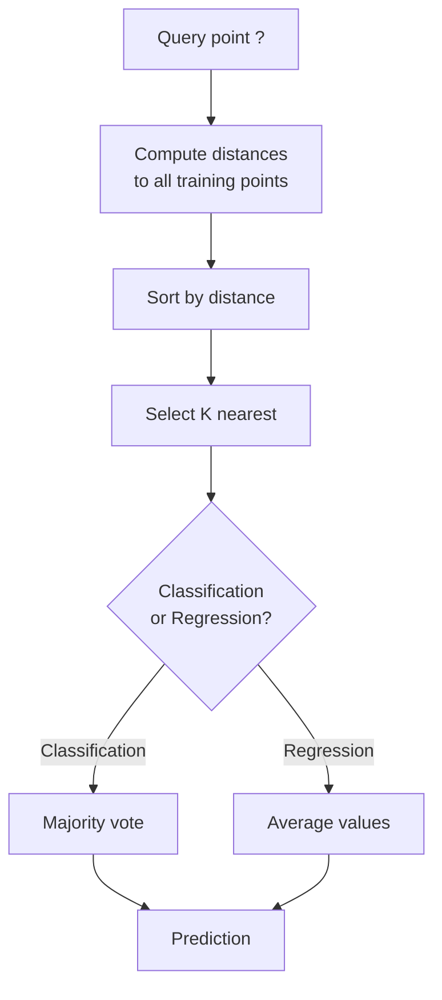
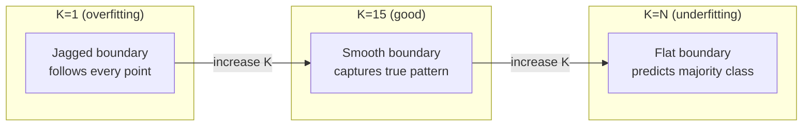
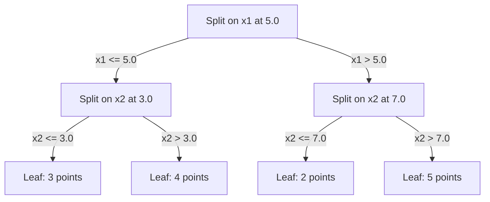

# K ближайших соседей и расстояния

> Храните все. Предсказывайте, глядя на соседей. Самый простой алгоритм, который действительно работает.

**Тип:** Практика
**Язык:** Python
**Требования:** Фаза 1 (урок 14 «Нормы и расстояния»)
**Время:** ~90 минут

## Цели обучения

- Реализовать KNN-классификацию и регрессию с нуля с настраиваемым K и голосованием, взвешенным по расстоянию
- Сравнить метрики расстояния L1, L2, cosine и Minkowski и выбрать подходящую для конкретного типа данных
- Объяснить проклятие размерности и показать, почему KNN деградирует в высокоразмерных пространствах
- Построить KD-tree для эффективного поиска ближайших соседей и проанализировать, когда он быстрее brute force

## Проблема

У вас есть набор данных. Приходит новая точка. Нужно классифицировать ее или предсказать значение. Вместо того чтобы учить параметры по данным (как линейная регрессия или SVM), вы просто находите K обучающих точек, ближайших к новой точке, и позволяете им голосовать.

Это K-nearest neighbors. Фазы обучения нет. Параметров для обучения нет. Функцию потерь минимизировать не нужно. Вы храните весь обучающий набор и вычисляете расстояния во время предсказания.

Звучит слишком просто, чтобы работать. Но KNN удивительно конкурентоспособен во многих задачах, особенно на малых и средних наборах данных, а глубокое понимание KNN раскрывает фундаментальные идеи: выбор метрики расстояния (связь с Фазой 1 Уроком 14), проклятие размерности и различие между lazy и eager learning.

KNN также встречается повсюду в современном AI, просто под другими именами. Векторные базы данных выполняют KNN-поиск по embeddings. Retrieval-augmented generation (RAG) находит K ближайших фрагментов документов. Рекомендательные системы ищут похожих пользователей или товары. Алгоритм тот же. Масштаб и структуры данных другие.

## Концепция

### Как работает KNN

Дан набор размеченных точек и новая query-точка:

1. Вычислить расстояние от query до каждой точки в наборе данных
2. Отсортировать по расстоянию
3. Взять K ближайших точек
4. Для классификации: голосование большинством среди K соседей
5. Для регрессии: среднее (или взвешенное среднее) значений K соседей



Это весь алгоритм. Никакого fitting. Никакого градиентного спуска. Никаких эпох.

### Выбор K

K — единственный гиперпараметр. Он управляет компромиссом bias-variance:

| K | Поведение |
|---|-----------|
| K = 1 | Граница решений следует за каждой точкой. Нулевая обучающая ошибка. Высокая дисперсия. Переобучение |
| Малое K (3-5) | Чувствительно к локальной структуре. Может улавливать сложные границы |
| Большое K | Более гладкие границы. Устойчивее к шуму. Может недообучаться |
| K = N | Для каждой точки предсказывает класс большинства. Максимальное смещение |

Хорошая стартовая точка — K = sqrt(N) для набора из N точек. Для бинарной классификации используйте нечетное K, чтобы избегать ничьих.



### Метрики расстояния

Функция расстояния определяет, что значит «рядом». Разные метрики дают разных соседей и разные предсказания.

**L2 (евклидово расстояние)** — вариант по умолчанию. Расстояние по прямой.

```
d(a, b) = sqrt(sum((a_i - b_i)^2))
```

Чувствительно к масштабу признаков. Всегда стандартизируйте признаки перед использованием L2 с KNN.

**L1 (манхэттенское расстояние)** суммирует абсолютные разности. Оно устойчивее к выбросам, чем L2, потому что не возводит разности в квадрат.

```
d(a, b) = sum(|a_i - b_i|)
```

**Cosine distance** измеряет угол между векторами, игнорируя величину. Критически важно для текстов и embeddings.

```
d(a, b) = 1 - (a . b) / (||a|| * ||b||)
```

**Minkowski** обобщает L1 и L2 параметром p.

```
d(a, b) = (sum(|a_i - b_i|^p))^(1/p)

p=1: Manhattan
p=2: Euclidean
p->inf: Chebyshev (max absolute difference)
```

Выбор метрики зависит от данных:

| Тип данных | Лучшая метрика | Почему |
|------------|----------------|--------|
| Числовые признаки, похожий масштаб | L2 (Euclidean) | Вариант по умолчанию, работает для пространственных данных |
| Числовые признаки, выбросы | L1 (Manhattan) | Устойчива, не усиливает большие разности |
| Text embeddings | Cosine | Величина — шум, направление — смысл |
| Высокоразмерные разреженные | Cosine или L1 | L2 страдает от проклятия размерности |
| Смешанные типы | Пользовательское расстояние | Комбинируйте метрики по типам признаков |

### Взвешенный KNN

Стандартный KNN дает одинаковый вес всем K соседям. Но сосед на расстоянии 0.1 должен значить больше, чем сосед на расстоянии 5.0.

**Distance-weighted KNN** взвешивает каждого соседа обратно пропорционально расстоянию:

```
weight_i = 1 / (distance_i + epsilon)

For classification: weighted vote
For regression:     weighted average = sum(w_i * y_i) / sum(w_i)
```

epsilon предотвращает деление на ноль, когда query-точка точно совпадает с обучающей точкой.

Взвешенный KNN менее чувствителен к выбору K, потому что дальние соседи вносят очень малый вклад.

### Проклятие размерности

Качество KNN ухудшается в больших размерностях. Это не абстрактное опасение, а математический факт.

**Проблема 1: расстояния сходятся.** При росте размерности отношение максимального расстояния к минимальному стремится к 1. Все точки становятся почти одинаково «далекими» от query.

```
In d dimensions, for random uniform points:

d=2:    max_dist / min_dist = varies widely
d=100:  max_dist / min_dist ~ 1.01
d=1000: max_dist / min_dist ~ 1.001

When all distances are nearly equal, "nearest" is meaningless.
```

**Проблема 2: объем взрывается.** Чтобы захватить K соседей в фиксированной доле данных, нужно расширить радиус поиска так, что он покрывает гораздо большую часть пространства признаков. «Окрестность» в высоких размерностях охватывает почти все пространство.

**Проблема 3: углы доминируют.** В единичном гиперкубе в d измерениях большая часть объема сосредоточена около углов, а не центра. Сфера, вписанная в куб, содержит исчезающе малую долю объема при росте d.

Практическое следствие: KNN хорошо работает примерно до 20-50 признаков. Дальше нужно снижать размерность (PCA, UMAP, t-SNE) перед применением KNN или использовать древовидные структуры поиска, которые эксплуатируют более низкую внутреннюю размерность данных.

### KD-trees: быстрый поиск ближайших соседей

Brute-force KNN вычисляет расстояние от query до каждой обучающей точки. Это O(n * d) на query. Для больших наборов данных это слишком медленно.

KD-tree рекурсивно делит пространство вдоль осей признаков. На каждом уровне оно делит по одному измерению в медианном значении.



Чтобы найти ближайшего соседа, пройдите по дереву до листа, содержащего query, затем возвращайтесь назад и проверяйте соседние разбиения только если они могут содержать более близкие точки.

Среднее время query: O(log n) в малых размерностях. Но KD-trees деградируют до O(n) в высоких размерностях (d > 20), потому что backtracking отсекает все меньше ветвей.

### Ball trees: лучше для умеренных размерностей

Ball trees делят данные на вложенные гиперсферы вместо axis-aligned boxes. Каждый узел задает ball (центр + радиус), содержащий все точки в этом поддереве.

Преимущества перед KD-trees:
- Лучше работают в умеренных размерностях (примерно до ~50)
- Обрабатывают структуру, не выровненную по осям
- Более плотные ограничивающие объемы позволяют отсекать больше ветвей при поиске

И KD-trees, и ball trees — точные алгоритмы. Для действительно крупномасштабного поиска (миллионы точек, сотни размерностей) вместо них используют approximate nearest neighbor methods (HNSW, IVF, product quantization). Они разбирались в Фазе 1 Уроке 14.

### Lazy learning и eager learning

KNN — lazy learner: он ничего не делает во время обучения, вся работа происходит во время предсказания. Большинство других алгоритмов (линейная регрессия, SVM, нейросети) — eager learners: они выполняют тяжелые вычисления во время обучения, чтобы построить компактную модель, а затем быстро предсказывают.

| Аспект | Lazy (KNN) | Eager (SVM, нейросеть) |
|--------|------------|------------------------|
| Время обучения | O(1): просто сохранить данные | O(n * epochs) |
| Время предсказания | O(n * d) на query | O(d) или O(parameters) |
| Память при предсказании | Хранить весь обучающий набор | Хранить только параметры модели |
| Адаптация к новым данным | Добавить точки мгновенно | Переобучить модель |
| Граница решений | Неявная, вычисляется на лету | Явная, фиксирована после обучения |

Lazy learning идеально, когда:
- Набор данных часто меняется (добавление/удаление точек без переобучения)
- Предсказания нужны для очень малого числа queries
- Нужно нулевое время обучения
- Набор данных достаточно мал, чтобы brute-force search был быстрым

### KNN для регрессии

Вместо голосования большинством KNN для регрессии усредняет целевые значения K соседей.

```
prediction = (1/K) * sum(y_i for i in K nearest neighbors)

Or with distance weighting:
prediction = sum(w_i * y_i) / sum(w_i)
where w_i = 1 / distance_i
```

KNN-регрессия дает кусочно-постоянные (или кусочно-гладкие при взвешивании) предсказания. Она не умеет экстраполировать за пределы диапазона обучающих данных. Если все обучающие target лежат между 0 и 100, KNN никогда не предскажет 200.

## Соберите это

### Шаг 1: функции расстояния

Реализуйте L1, L2, cosine и Minkowski distances. Они напрямую связаны с Фазой 1 Уроком 14.

```python
import math

def l2_distance(a, b):
    return math.sqrt(sum((ai - bi) ** 2 for ai, bi in zip(a, b)))

def l1_distance(a, b):
    return sum(abs(ai - bi) for ai, bi in zip(a, b))

def cosine_distance(a, b):
    dot_val = sum(ai * bi for ai, bi in zip(a, b))
    norm_a = math.sqrt(sum(ai ** 2 for ai in a))
    norm_b = math.sqrt(sum(bi ** 2 for bi in b))
    if norm_a == 0 or norm_b == 0:
        return 1.0
    return 1.0 - dot_val / (norm_a * norm_b)

def minkowski_distance(a, b, p=2):
    if p == float('inf'):
        return max(abs(ai - bi) for ai, bi in zip(a, b))
    return sum(abs(ai - bi) ** p for ai, bi in zip(a, b)) ** (1 / p)
```

### Шаг 2: KNN-классификатор и регрессор

Постройте полный KNN с настраиваемым K, метрикой расстояния и необязательным взвешиванием по расстоянию.

```python
class KNN:
    def __init__(self, k=5, distance_fn=l2_distance, weighted=False,
                 task="classification"):
        self.k = k
        self.distance_fn = distance_fn
        self.weighted = weighted
        self.task = task
        self.X_train = None
        self.y_train = None

    def fit(self, X, y):
        self.X_train = X
        self.y_train = y

    def predict(self, X):
        return [self._predict_one(x) for x in X]
```

### Шаг 3: KD-tree для эффективного поиска

Постройте KD-tree с нуля: рекурсивно делите по медиане каждого измерения.

```python
class KDTree:
    def __init__(self, X, indices=None, depth=0):
        # Recursively partition the data
        self.axis = depth % len(X[0])
        # Split on median of the current axis
        ...

    def query(self, point, k=1):
        # Traverse to leaf, then backtrack
        ...
```

Полную реализацию со всеми вспомогательными методами и demo смотрите в `code/knn.py`.

### Шаг 4: масштабирование признаков

KNN требует масштабирования признаков, потому что расстояния чувствительны к величинам признаков. Признак от 0 до 1000 будет доминировать над признаком от 0 до 1.

```python
def standardize(X):
    n = len(X)
    d = len(X[0])
    means = [sum(X[i][j] for i in range(n)) / n for j in range(d)]
    stds = [
        max(1e-10, (sum((X[i][j] - means[j]) ** 2 for i in range(n)) / n) ** 0.5)
        for j in range(d)
    ]
    return [[((X[i][j] - means[j]) / stds[j]) for j in range(d)] for i in range(n)], means, stds
```

## Используйте это

Со scikit-learn:

```python
from sklearn.neighbors import KNeighborsClassifier
from sklearn.preprocessing import StandardScaler
from sklearn.pipeline import Pipeline

clf = Pipeline([
    ("scaler", StandardScaler()),
    ("knn", KNeighborsClassifier(n_neighbors=5, metric="euclidean")),
])
clf.fit(X_train, y_train)
print(f"Accuracy: {clf.score(X_test, y_test):.4f}")
```

Scikit-learn автоматически использует KD-trees или ball trees, когда набор данных достаточно большой, а размерность достаточно низкая. Для высокоразмерных данных он возвращается к brute force. Это можно контролировать параметром `algorithm`.

Для крупномасштабного поиска ближайших соседей (миллионы векторов) используйте FAISS, Annoy или векторную базу данных:

```python
import faiss

index = faiss.IndexFlatL2(dimension)
index.add(embeddings)
distances, indices = index.search(query_vectors, k=5)
```

## Упражнения

1. Реализуйте KNN-классификацию на двумерном наборе данных с 3 классами. Постройте границу решений для K=1, K=5, K=15 и K=N. Наблюдайте переход от переобучения к недообучению.

2. Сгенерируйте 1000 случайных точек в 2, 5, 10, 50, 100 и 500 измерениях. Для каждой размерности вычислите отношение максимального попарного расстояния к минимальному попарному расстоянию. Постройте график отношения от размерности, чтобы визуализировать проклятие размерности.

3. Сравните L1, L2 и cosine distance для KNN в задаче классификации текста (используйте TF-IDF vectors). Какая метрика дает лучшую accuracy? Почему cosine обычно выигрывает для текста?

4. Реализуйте KD-tree и измерьте время query по сравнению с brute force для наборов из 1k, 10k и 100k точек в 2D, 10D и 50D. На какой размерности KD-tree перестает быть быстрее brute force?

5. Постройте weighted KNN regressor для y = sin(x) + шум. Сравните его с unweighted KNN при K=3, 10, 30. Покажите, что взвешивание дает более гладкие предсказания, особенно при большом K.

## Ключевые термины

| Термин | Что это на самом деле значит |
|--------|------------------------------|
| K ближайших соседей | Непараметрический алгоритм, который предсказывает, находя K ближайших обучающих точек к query |
| Lazy learning | Нет вычислений во время обучения. Вся работа происходит во время предсказания. KNN — канонический пример |
| Eager learning | Тяжелые вычисления во время обучения для построения компактной модели. Большинство ML-алгоритмов eager |
| Проклятие размерности | В больших размерностях расстояния сходятся, а окрестности расширяются и покрывают большую часть пространства, делая KNN неэффективным |
| KD-tree | Бинарное дерево, рекурсивно делящее пространство вдоль осей признаков. O(log n) queries в малых размерностях |
| Ball tree | Дерево вложенных гиперсфер. Работает лучше KD-tree в умеренных размерностях (до ~50) |
| Weighted KNN | Соседи взвешены обратно пропорционально расстоянию. Более близкие соседи сильнее влияют на предсказание |
| Масштабирование признаков | Нормализация признаков к сопоставимым диапазонам. Обязательна для distance-based методов вроде KNN |
| Голосование большинством | Классификация через подсчет класса, наиболее частого среди K соседей |
| Brute force search | Вычисление расстояния до каждой обучающей точки. O(n*d) на query. Точно, но медленно при большом n |
| Approximate nearest neighbor | Алгоритмы (HNSW, LSH, IVF), которые находят примерно ближайшие точки намного быстрее точного поиска |
| Диаграмма Вороного | Разбиение пространства, где каждая область содержит точки, более близкие к одной обучающей точке, чем к любой другой. K=1 KNN создает границы Вороного |

## Дополнительное чтение

- [Cover & Hart: Nearest Neighbor Pattern Classification (1967)](https://ieeexplore.ieee.org/document/1053964) — фундаментальная статья о KNN, доказывающая, что его error rate не более чем вдвое хуже байесовского оптимума
- [Friedman, Bentley, Finkel: An Algorithm for Finding Best Matches in Logarithmic Expected Time (1977)](https://dl.acm.org/doi/10.1145/355744.355745) — оригинальная статья о KD-tree
- [Beyer et al.: When Is "Nearest Neighbor" Meaningful? (1999)](https://link.springer.com/chapter/10.1007/3-540-49257-7_15) — формальный анализ проклятия размерности для nearest neighbor
- [scikit-learn Nearest Neighbors documentation](https://scikit-learn.org/stable/modules/neighbors.html) — практическое руководство по выбору алгоритма
- [FAISS: A Library for Efficient Similarity Search](https://github.com/facebookresearch/faiss) — библиотека Meta для approximate nearest neighbor search миллиардного масштаба
