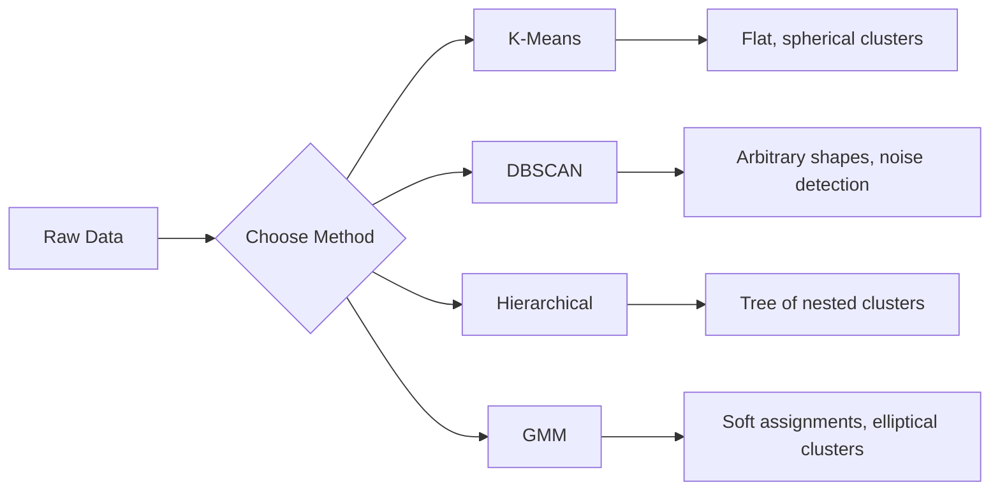

# Обучение без учителя

> Нет меток, нет учителя. Алгоритм сам находит структуру.

**Тип:** Практика
**Языки:** Python
**Требования:** Фаза 1 (нормы и расстояния, вероятность и распределения), Фаза 2 Уроки 1-6
**Время:** ~90 минут

## Цели обучения

- Реализовать K-Means, DBSCAN и Gaussian Mixture Models с нуля и сравнить их поведение при кластеризации
- Оценивать качество кластеров с помощью silhouette score и elbow method для выбора оптимального K
- Объяснить, когда DBSCAN превосходит K-Means, и определить, какой алгоритм работает с несферическими кластерами и выбросами
- Построить pipeline обнаружения аномалий с помощью методов кластеризации, чтобы помечать точки, отклоняющиеся от нормальных паттернов

## Проблема

Все предыдущие уроки ML предполагали размеченные данные: «вот вход, вот правильный выход». В реальном мире метки дороги. У больницы есть миллионы записей пациентов, но никто вручную не отметил каждую категорией заболевания. У e-commerce сайта есть миллионы пользовательских сессий, но никто вручную не разметил клиентские сегменты. У команды безопасности есть сетевые логи, но никто не пометил каждую аномалию.

Обучение без учителя находит паттерны, не получая указаний, что именно искать. Оно группирует похожие точки данных, обнаруживает скрытые структуры и выводит на поверхность аномалии. Если обучение с учителем — это учебник с ответами в конце, то обучение без учителя — это взгляд на сырые данные до тех пор, пока паттерны не начнут проявляться.

Сложность в том, что без меток нельзя напрямую измерить «правильно» или «неправильно». Нужны другие инструменты, чтобы оценить, осмысленна ли структура, найденная алгоритмом.

## Концепция

### Кластеризация: группировка похожих объектов

Кластеризация назначает каждой точке данных группу (кластер), чтобы точки внутри одной группы были более похожи друг на друга, чем на точки из других групп. Вопрос всегда один: что значит «похожи»?



### K-Means: рабочая лошадка

K-Means разбивает данные ровно на K кластеров. У каждого кластера есть центроид (центр масс), и каждая точка принадлежит ближайшему центроиду.

Алгоритм Ллойда:

1. Выбрать K случайных точек как начальные центроиды
2. Назначить каждую точку данных ближайшему центроиду
3. Пересчитать каждый центроид как среднее назначенных ему точек
4. Повторять шаги 2-3, пока назначения не перестанут меняться

Целевая функция (inertia) измеряет суммарное квадратное расстояние от каждой точки до назначенного центроида. K-Means минимизирует ее, но находит только локальный минимум. Разные инициализации могут дать разные результаты.

### Выбор K

Два стандартных метода:

**Elbow method:** запустить K-Means для K = 1, 2, 3, ..., n. Построить inertia vs K. Искать «локоть», где добавление новых кластеров перестает значительно снижать inertia.

**Silhouette score:** для каждой точки измерить, насколько она похожа на свой кластер (a) по сравнению с ближайшим другим кластером (b). Silhouette coefficient равен (b - a) / max(a, b) и лежит от -1 (неверный кластер) до +1 (хорошо кластеризована). Среднее по всем точкам дает глобальную оценку.

### DBSCAN: плотностная кластеризация

K-Means предполагает сферические кластеры и требует заранее выбрать K. DBSCAN не делает ни того, ни другого. Он находит кластеры как плотные области, разделенные разреженными областями.

Два параметра:
- **eps**: радиус окрестности
- **min_samples**: минимальное число точек, нужное для образования плотной области

Три типа точек:
- **Core point:** имеет минимум min_samples точек на расстоянии eps
- **Border point:** находится в пределах eps от core point, но сама не является core point
- **Noise point:** не core и не border. Это выбросы.

DBSCAN соединяет core points, находящиеся в пределах eps друг от друга, в один кластер. Border points присоединяются к кластеру ближайшей core point. Noise points не принадлежат ни одному кластеру.

Сильные стороны: находит кластеры любой формы, автоматически определяет число кластеров, выявляет выбросы. Слабость: плохо справляется с кластерами разной плотности.

### Иерархическая кластеризация

Строит дерево (дендрограмму) вложенных кластеров.

Агломеративная (снизу вверх):
1. Начать с каждой точки как отдельного кластера
2. Объединить два ближайших кластера
3. Повторять, пока не останется один кластер
4. Разрезать дендрограмму на нужном уровне, чтобы получить K кластеров

«Близость» между кластерами можно измерять так:
- **Single linkage:** минимальное расстояние между любыми двумя точками из двух кластеров
- **Complete linkage:** максимальное расстояние между любыми двумя точками
- **Average linkage:** среднее расстояние между всеми парами
- **Метод Уорда:** объединение, вызывающее наименьший рост суммарной внутрикластерной дисперсии

### Gaussian Mixture Models (GMM)

K-Means дает жесткие назначения: каждая точка принадлежит ровно одному кластеру. GMM дает мягкие назначения: у каждой точки есть вероятность принадлежности каждому кластеру.

GMM предполагает, что данные порождены смесью K гауссовых распределений, каждое со своим средним и ковариацией. Алгоритм Expectation-Maximization (EM) чередует:

- **E-step:** вычислить вероятность принадлежности каждой точки каждой гауссиане
- **M-step:** обновить среднее, ковариацию и вес смешивания каждой гауссианы, чтобы максимизировать правдоподобие данных

GMM может моделировать эллиптические кластеры (а не только сферические, как K-Means) и естественно работает с перекрывающимися кластерами.

### Когда что использовать

| Метод | Лучше всего для | Избегать, когда |
|-------|-----------------|-----------------|
| K-Means | Большие наборы данных, сферические кластеры, известный K | Нерегулярные формы, есть выбросы |
| DBSCAN | Неизвестный K, произвольные формы, поиск выбросов | Разная плотность, очень высокая размерность |
| Иерархическая | Малые наборы данных, нужна дендрограмма, неизвестный K | Большие наборы данных (O(n^2) памяти) |
| GMM | Перекрывающиеся кластеры, нужны soft assignments | Очень большие наборы данных, слишком много измерений |

### Обнаружение аномалий через кластеризацию

Кластеризация естественно поддерживает поиск аномалий:
- **K-Means**: точки далеко от любого центроида — аномалии
- **DBSCAN**: noise points являются аномалиями по определению
- **GMM**: точки с низкой вероятностью во всех гауссианах — аномалии

## Соберите это

### Шаг 1: K-Means с нуля

```python
import math
import random


def euclidean_distance(a, b):
    return math.sqrt(sum((ai - bi) ** 2 for ai, bi in zip(a, b)))


def kmeans(data, k, max_iterations=100, seed=42):
    random.seed(seed)
    n_features = len(data[0])

    centroids = random.sample(data, k)

    for iteration in range(max_iterations):
        clusters = [[] for _ in range(k)]
        assignments = []

        for point in data:
            distances = [euclidean_distance(point, c) for c in centroids]
            nearest = distances.index(min(distances))
            clusters[nearest].append(point)
            assignments.append(nearest)

        new_centroids = []
        for cluster in clusters:
            if len(cluster) == 0:
                new_centroids.append(random.choice(data))
                continue
            centroid = [
                sum(point[j] for point in cluster) / len(cluster)
                for j in range(n_features)
            ]
            new_centroids.append(centroid)

        if all(
            euclidean_distance(old, new) < 1e-6
            for old, new in zip(centroids, new_centroids)
        ):
            print(f"  Converged at iteration {iteration + 1}")
            break

        centroids = new_centroids

    return assignments, centroids
```

### Шаг 2: elbow method и silhouette score

```python
def compute_inertia(data, assignments, centroids):
    total = 0.0
    for point, cluster_id in zip(data, assignments):
        total += euclidean_distance(point, centroids[cluster_id]) ** 2
    return total


def silhouette_score(data, assignments):
    n = len(data)
    if n < 2:
        return 0.0

    clusters = {}
    for i, c in enumerate(assignments):
        clusters.setdefault(c, []).append(i)

    if len(clusters) < 2:
        return 0.0

    scores = []
    for i in range(n):
        own_cluster = assignments[i]
        own_members = [j for j in clusters[own_cluster] if j != i]

        if len(own_members) == 0:
            scores.append(0.0)
            continue

        a = sum(euclidean_distance(data[i], data[j]) for j in own_members) / len(own_members)

        b = float("inf")
        for cluster_id, members in clusters.items():
            if cluster_id == own_cluster:
                continue
            avg_dist = sum(euclidean_distance(data[i], data[j]) for j in members) / len(members)
            b = min(b, avg_dist)

        if max(a, b) == 0:
            scores.append(0.0)
        else:
            scores.append((b - a) / max(a, b))

    return sum(scores) / len(scores)


def find_best_k(data, max_k=10):
    print("Elbow method:")
    inertias = []
    for k in range(1, max_k + 1):
        assignments, centroids = kmeans(data, k)
        inertia = compute_inertia(data, assignments, centroids)
        inertias.append(inertia)
        print(f"  K={k}: inertia={inertia:.2f}")

    print("\nSilhouette scores:")
    for k in range(2, max_k + 1):
        assignments, centroids = kmeans(data, k)
        score = silhouette_score(data, assignments)
        print(f"  K={k}: silhouette={score:.4f}")

    return inertias
```

### Шаг 3: DBSCAN с нуля

```python
def dbscan(data, eps, min_samples):
    n = len(data)
    labels = [-1] * n
    cluster_id = 0

    def region_query(point_idx):
        neighbors = []
        for i in range(n):
            if euclidean_distance(data[point_idx], data[i]) <= eps:
                neighbors.append(i)
        return neighbors

    visited = [False] * n

    for i in range(n):
        if visited[i]:
            continue
        visited[i] = True

        neighbors = region_query(i)

        if len(neighbors) < min_samples:
            labels[i] = -1
            continue

        labels[i] = cluster_id
        seed_set = list(neighbors)
        seed_set.remove(i)

        j = 0
        while j < len(seed_set):
            q = seed_set[j]

            if not visited[q]:
                visited[q] = True
                q_neighbors = region_query(q)
                if len(q_neighbors) >= min_samples:
                    for nb in q_neighbors:
                        if nb not in seed_set:
                            seed_set.append(nb)

            if labels[q] == -1:
                labels[q] = cluster_id

            j += 1

        cluster_id += 1

    return labels
```

### Шаг 4: Gaussian Mixture Model (EM-алгоритм)

```python
def gmm(data, k, max_iterations=100, seed=42):
    random.seed(seed)
    n = len(data)
    d = len(data[0])

    indices = random.sample(range(n), k)
    means = [list(data[i]) for i in indices]
    variances = [1.0] * k
    weights = [1.0 / k] * k

    def gaussian_pdf(x, mean, variance):
        d = len(x)
        coeff = 1.0 / ((2 * math.pi * variance) ** (d / 2))
        exponent = -sum((xi - mi) ** 2 for xi, mi in zip(x, mean)) / (2 * variance)
        return coeff * math.exp(max(exponent, -500))

    for iteration in range(max_iterations):
        responsibilities = []
        for i in range(n):
            probs = []
            for j in range(k):
                probs.append(weights[j] * gaussian_pdf(data[i], means[j], variances[j]))
            total = sum(probs)
            if total == 0:
                total = 1e-300
            responsibilities.append([p / total for p in probs])

        old_means = [list(m) for m in means]

        for j in range(k):
            r_sum = sum(responsibilities[i][j] for i in range(n))
            if r_sum < 1e-10:
                continue

            weights[j] = r_sum / n

            for dim in range(d):
                means[j][dim] = sum(
                    responsibilities[i][j] * data[i][dim] for i in range(n)
                ) / r_sum

            variances[j] = sum(
                responsibilities[i][j]
                * sum((data[i][dim] - means[j][dim]) ** 2 for dim in range(d))
                for i in range(n)
            ) / (r_sum * d)
            variances[j] = max(variances[j], 1e-6)

        shift = sum(
            euclidean_distance(old_means[j], means[j]) for j in range(k)
        )
        if shift < 1e-6:
            print(f"  GMM converged at iteration {iteration + 1}")
            break

    assignments = []
    for i in range(n):
        assignments.append(responsibilities[i].index(max(responsibilities[i])))

    return assignments, means, weights, responsibilities
```

### Шаг 5: сгенерировать тестовые данные и запустить все

```python
def make_blobs(centers, n_per_cluster=50, spread=0.5, seed=42):
    random.seed(seed)
    data = []
    true_labels = []
    for label, (cx, cy) in enumerate(centers):
        for _ in range(n_per_cluster):
            x = cx + random.gauss(0, spread)
            y = cy + random.gauss(0, spread)
            data.append([x, y])
            true_labels.append(label)
    return data, true_labels


def make_moons(n_samples=200, noise=0.1, seed=42):
    random.seed(seed)
    data = []
    labels = []
    n_half = n_samples // 2
    for i in range(n_half):
        angle = math.pi * i / n_half
        x = math.cos(angle) + random.gauss(0, noise)
        y = math.sin(angle) + random.gauss(0, noise)
        data.append([x, y])
        labels.append(0)
    for i in range(n_half):
        angle = math.pi * i / n_half
        x = 1 - math.cos(angle) + random.gauss(0, noise)
        y = 1 - math.sin(angle) - 0.5 + random.gauss(0, noise)
        data.append([x, y])
        labels.append(1)
    return data, labels


if __name__ == "__main__":
    centers = [[2, 2], [8, 3], [5, 8]]
    data, true_labels = make_blobs(centers, n_per_cluster=50, spread=0.8)

    print("=== K-Means on 3 blobs ===")
    assignments, centroids = kmeans(data, k=3)
    print(f"  Centroids: {[[round(c, 2) for c in cent] for cent in centroids]}")
    sil = silhouette_score(data, assignments)
    print(f"  Silhouette score: {sil:.4f}")

    print("\n=== Elbow Method ===")
    find_best_k(data, max_k=6)

    print("\n=== DBSCAN on 3 blobs ===")
    db_labels = dbscan(data, eps=1.5, min_samples=5)
    n_clusters = len(set(db_labels) - {-1})
    n_noise = db_labels.count(-1)
    print(f"  Found {n_clusters} clusters, {n_noise} noise points")

    print("\n=== GMM on 3 blobs ===")
    gmm_assignments, gmm_means, gmm_weights, _ = gmm(data, k=3)
    print(f"  Means: {[[round(m, 2) for m in mean] for mean in gmm_means]}")
    print(f"  Weights: {[round(w, 3) for w in gmm_weights]}")
    gmm_sil = silhouette_score(data, gmm_assignments)
    print(f"  Silhouette score: {gmm_sil:.4f}")

    print("\n=== DBSCAN on moons (non-spherical clusters) ===")
    moon_data, moon_labels = make_moons(n_samples=200, noise=0.1)
    moon_db = dbscan(moon_data, eps=0.3, min_samples=5)
    n_moon_clusters = len(set(moon_db) - {-1})
    n_moon_noise = moon_db.count(-1)
    print(f"  Found {n_moon_clusters} clusters, {n_moon_noise} noise points")

    print("\n=== K-Means on moons (will fail to separate) ===")
    moon_km, moon_centroids = kmeans(moon_data, k=2)
    moon_sil = silhouette_score(moon_data, moon_km)
    print(f"  Silhouette score: {moon_sil:.4f}")
    print("  K-Means splits moons poorly because they are not spherical")

    print("\n=== Anomaly detection with DBSCAN ===")
    anomaly_data = list(data)
    anomaly_data.append([20.0, 20.0])
    anomaly_data.append([-5.0, -5.0])
    anomaly_data.append([15.0, 0.0])
    anomaly_labels = dbscan(anomaly_data, eps=1.5, min_samples=5)
    anomalies = [
        anomaly_data[i]
        for i in range(len(anomaly_labels))
        if anomaly_labels[i] == -1
    ]
    print(f"  Detected {len(anomalies)} anomalies")
    for a in anomalies[-3:]:
        print(f"    Point {[round(v, 2) for v in a]}")
```

### Ожидаемый вывод

Запустите `code/clustering.py` — последние строки должны быть такими:

```
  Silhouette score: 0.4895
  K-Means splits moons poorly because they are not spherical

=== Anomaly detection with DBSCAN ===
  Detected 3 anomalies
    Point [20.0, 20.0]
    Point [-5.0, -5.0]
    Point [15.0, 0.0]
```

## Используйте это

Со scikit-learn те же алгоритмы — это one-liners:

```python
from sklearn.cluster import KMeans, DBSCAN, AgglomerativeClustering
from sklearn.mixture import GaussianMixture
from sklearn.metrics import silhouette_score as sklearn_silhouette

km = KMeans(n_clusters=3, random_state=42).fit(data)
db = DBSCAN(eps=1.5, min_samples=5).fit(data)
agg = AgglomerativeClustering(n_clusters=3).fit(data)
gmm_model = GaussianMixture(n_components=3, random_state=42).fit(data)
```

Реализации с нуля показывают, что именно считают библиотеки. K-Means чередует назначение и пересчет. DBSCAN выращивает кластеры из плотных «семян». GMM чередует expectation и maximization. Библиотечные версии добавляют численную устойчивость, более умную инициализацию (K-Means++), GPU-ускорение, но базовая логика та же.

## Доведите до результата

Этот урок создает рабочие реализации K-Means, DBSCAN и GMM с нуля. Код кластеризации можно переиспользовать как основу для более продвинутых методов обучения без учителя.

## Упражнения

1. Реализуйте инициализацию K-Means++: вместо случайного выбора центроидов выберите первый случайно, а каждый следующий — с вероятностью, пропорциональной квадрату расстояния до ближайшего существующего центроида. Сравните скорость сходимости со случайной инициализацией.
2. Добавьте в код иерархическую агломеративную кластеризацию. Реализуйте linkage Уорда и создайте дендрограмму (как вложенный список слияний). Разрежьте ее на разных уровнях и сравните с результатами K-Means.
3. Постройте простой pipeline поиска аномалий: запустите DBSCAN и GMM на одних данных, помечайте точки, которые оба метода считают выбросами (noise в DBSCAN, low probability в GMM). Измерьте пересечение и обсудите, когда методы расходятся.

## Ключевые термины

| Термин | Как говорят | Что это на самом деле значит |
|--------|-------------|------------------------------|
| Кластеризация | «Группировка похожих объектов» | Разбиение данных на подмножества, где внутригрупповая похожесть выше межгрупповой, измеренная конкретной метрикой расстояния |
| Центроид | «Центр кластера» | Среднее всех точек, назначенных кластеру; используется K-Means как представитель кластера |
| Inertia | «Насколько плотные кластеры» | Сумма квадратов расстояний от каждой точки до назначенного центроида; чем ниже, тем плотнее |
| Silhouette score | «Насколько хорошо разделены кластеры» | Для каждой точки (b - a) / max(a, b), где a — среднее внутрикластерное расстояние, b — среднее расстояние до ближайшего другого кластера |
| Core point | «Точка в плотной области» | Точка с минимум min_samples соседями в пределах eps в DBSCAN |
| EM algorithm | «Soft K-Means» | Expectation-Maximization: итеративно вычисляет вероятности принадлежности (E-step) и обновляет параметры распределений (M-step) |
| Дендрограмма | «Дерево кластеров» | Древовидная диаграмма, показывающая порядок и расстояния, на которых кластеры объединялись в иерархической кластеризации |
| Аномалия | «Выброс» | Точка данных, не соответствующая ожидаемому паттерну; определяется как noise в DBSCAN или low-probability в GMM |

## Дополнительное чтение

- [Stanford CS229 - Unsupervised Learning](https://cs229.stanford.edu/notes2022fall/main_notes.pdf) — конспекты Andrew Ng по кластеризации и EM
- [scikit-learn Clustering Guide](https://scikit-learn.org/stable/modules/clustering.html) — практическое сравнение алгоритмов кластеризации с визуальными примерами
- [DBSCAN original paper (Ester et al., 1996)](https://www.aaai.org/Papers/KDD/1996/KDD96-037.pdf) — статья, представившая density-based clustering
