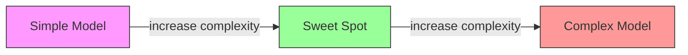
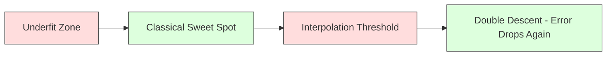
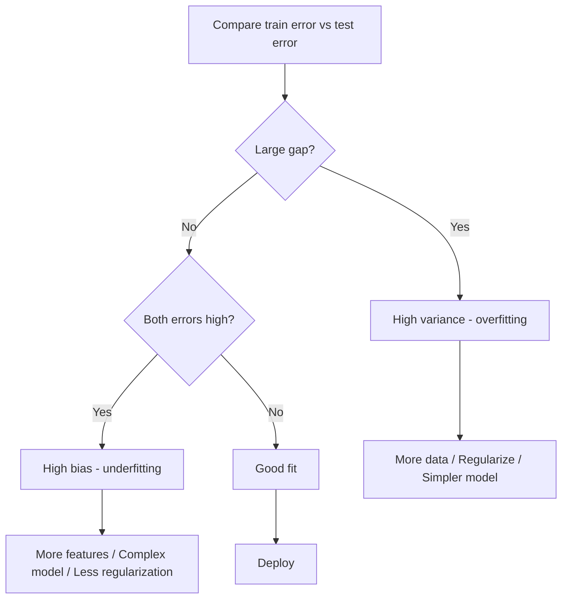
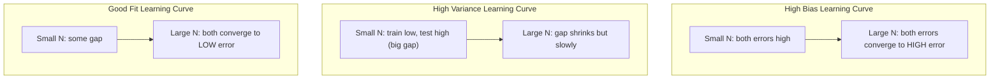
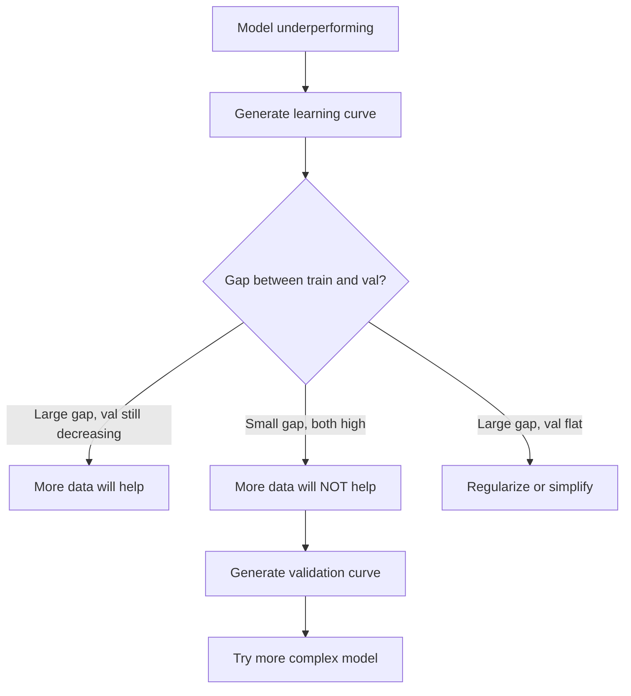

# Компромисс смещения и дисперсии

> Каждая ошибка модели возникает из одного из трех источников: смещения, дисперсии или шума. Управлять можно только первыми двумя.

**Тип:** Изучение
**Язык:** Python
**Требования:** Фаза 2, Уроки 01-09 (основы ML, регрессия, классификация, оценка)
**Время:** ~75 минут

## Цели обучения

- Вывести bias-variance decomposition ожидаемой ошибки предсказания и объяснить роль неустранимого шума
- Диагностировать высокое смещение или высокую дисперсию по паттернам train и test error
- Объяснить, как регуляризация (L1, L2, dropout, early stopping) обменивает bias на variance
- Реализовать эксперименты, визуализирующие bias-variance tradeoff на моделях растущей сложности

## Проблема

Вы обучили модель. У нее есть ошибка на тестовых данных. Откуда берется эта ошибка?

Если модель слишком проста (линейная регрессия на криволинейном наборе данных), она будет систематически промахиваться мимо истинного паттерна. Это bias. Если модель слишком сложна (полином 20-й степени на 15 точках), она идеально подгонит обучающие данные, но будет давать резко разные предсказания на новых данных. Это variance.

Нельзя одновременно минимизировать и то и другое при фиксированной емкости модели. Снижаете bias — растет variance. Снижаете variance — растет bias. Понимание этого компромисса — самый полезный диагностический навык в машинном обучении. Он подсказывает, делать модель сложнее или проще, собирать больше данных или конструировать лучшие признаки, усиливать или ослаблять регуляризацию.

## Концепция

### Bias: систематическая ошибка

Bias измеряет, насколько среднее предсказание модели отстоит от истинного значения. Если обучить одну и ту же модель на множестве разных обучающих наборов из одного распределения и усреднить предсказания, bias — это разрыв между этим средним и истиной.

Высокий bias означает, что модель слишком жесткая, чтобы уловить реальный паттерн. Прямая, подогнанная к параболе, всегда будет промахиваться мимо кривой, сколько данных ей ни дай. Это underfitting.

```
High bias (underfitting):
  Model always predicts roughly the same wrong thing.
  Training error: HIGH
  Test error: HIGH
  Gap between them: SMALL
```

### Variance: чувствительность к обучающим данным

Variance измеряет, насколько меняются предсказания при обучении на разных поднаборах данных. Если небольшие изменения в обучающем наборе вызывают большие изменения модели, variance высока.

Высокая variance означает, что модель подгоняет шум в обучающих данных, а не истинный сигнал. Полином 20-й степени пройдет через каждую обучающую точку, но будет бешено осциллировать между ними. Это overfitting.

```
High variance (overfitting):
  Model fits training data perfectly but fails on new data.
  Training error: LOW
  Test error: HIGH
  Gap between them: LARGE
```

### Разложение

Для любой точки x ожидаемая ошибка предсказания при squared loss раскладывается точно:

```
Expected Error = Bias^2 + Variance + Irreducible Noise

where:
  Bias^2   = (E[f_hat(x)] - f(x))^2
  Variance = E[(f_hat(x) - E[f_hat(x)])^2]
  Noise    = E[(y - f(x))^2]             (sigma^2)
```

- `f(x)` — истинная функция
- `f_hat(x)` — предсказание вашей модели
- `E[...]` — математическое ожидание по разным обучающим наборам
- `y` — наблюдаемая метка (истинная функция плюс шум)

Шумовой член неустраним. Ни одна модель не может быть лучше sigma^2 на шумных данных. Ваша задача — найти правильный баланс между bias^2 и variance.

### Сложность модели и ошибка



Классическая U-образная кривая:

| Сложность | Bias | Variance | Полная ошибка |
|-----------|------|----------|---------------|
| Слишком низкая | HIGH | LOW | HIGH (underfitting) |
| В самый раз | MODERATE | MODERATE | LOWEST |
| Слишком высокая | LOW | HIGH | HIGH (overfitting) |

### Регуляризация как управление bias-variance

Регуляризация намеренно повышает bias, чтобы снизить variance. Она ограничивает модель, не давая ей гнаться за шумом.

- **L2 (Ridge):** сжимает все веса к нулю. Оставляет все признаки, но снижает их влияние.
- **L1 (Lasso):** зануляет некоторые веса ровно до нуля. Выполняет отбор признаков.
- **Dropout:** случайно отключает нейроны во время обучения. Заставляет строить избыточные представления.
- **Early stopping:** останавливает обучение до того, как модель полностью подгонит обучающие данные.

Сила регуляризации (lambda, dropout rate, число эпох) напрямую управляет положением на bias-variance curve. Больше регуляризации означает больше bias и меньше variance.

### Double Descent: современный взгляд

Классическая теория говорит: после золотой середины большая сложность всегда вредит. Но исследования с 2019 года показали неожиданное. Если продолжать увеличивать емкость модели далеко за interpolation threshold (точкой, где у модели достаточно параметров, чтобы идеально подогнать обучающие данные), test error может снова снижаться.



Это явление double descent объясняет, почему сильно overparameterized нейросети (с числом параметров намного больше числа обучающих примеров) все равно хорошо обобщают. Классический bias-variance tradeoff не неверен, но неполон для современного режима.

Ключевые наблюдения о double descent:
- Он возникает в линейных моделях, деревьях решений и нейросетях
- Большее количество данных может даже вредить в interpolation region (sample-wise double descent)
- Большее число эпох обучения тоже может его вызывать (epoch-wise double descent)
- Регуляризация сглаживает пик, но не устраняет его

Почему так происходит? На interpolation threshold у модели ровно достаточно емкости, чтобы подогнать все обучающие точки. Она вынуждена выбрать очень конкретное решение, проходящее через каждую точку, и малые возмущения данных вызывают большие изменения подгонки. Здесь variance достигает пика. После порога у модели есть множество решений, идеально подгоняющих данные. Алгоритм обучения (например, градиентный спуск с implicit regularization) склонен выбирать самое простое из них. Этот implicit bias к простым решениям и объясняет обобщение overparameterized моделей.

| Режим | Параметры vs примеры | Поведение |
|-------|----------------------|-----------|
| Underparameterized | p << n | Работает классический tradeoff |
| Interpolation threshold | p ~ n | Variance достигает пика, test error взлетает |
| Overparameterized | p >> n | Включается implicit regularization, test error падает |

На практике: если вы используете нейросети или большие ансамбли деревьев, не останавливайтесь на interpolation threshold. Либо оставайтесь сильно ниже него (с явной регуляризацией), либо уходите сильно дальше. Худшее место — ровно на пороге.

### Диагностика модели



| Симптом | Диагноз | Исправление |
|---------|---------|-------------|
| Высокая train error, высокая test error | Bias | Больше признаков, сложная модель, меньше регуляризации |
| Низкая train error, высокая test error | Variance | Больше данных, регуляризация, проще модель, dropout |
| Низкая train error, низкая test error | Хорошая подгонка | Ship it |
| Train error падает, test error растет | Идет overfitting | Early stopping |

### Практические стратегии

**Когда проблема в bias:**
- Добавить полиномиальные признаки или interactions
- Использовать более гибкую модель (tree ensemble вместо linear)
- Уменьшить силу регуляризации
- Обучать дольше (если еще не сошлось)

**Когда проблема в variance:**
- Получить больше обучающих данных
- Использовать bagging (random forests)
- Усилить регуляризацию (выше lambda, больше dropout)
- Feature selection (удалить шумовые признаки)
- Использовать cross-validation, чтобы рано обнаружить проблему

### Ансамбли и снижение variance

Ансамбли — самый практичный инструмент борьбы с variance.

**Bagging (Bootstrap Aggregating)** обучает несколько моделей на разных bootstrap-выборках обучающих данных, затем усредняет их предсказания. Каждая отдельная модель имеет высокую variance, но среднее имеет гораздо меньшую variance. Random forests — это bagging, примененный к деревьям решений.

Почему это работает математически: если усреднить N независимых предсказаний, каждое с variance sigma^2, variance среднего равна sigma^2 / N. Модели не полностью независимы (они видят похожие данные), поэтому снижение меньше, чем 1/N, но все равно существенное.

**Boosting** снижает bias, строя модели последовательно: каждая новая модель фокусируется на ошибках текущего ансамбля. Главные примеры — Gradient boosting и AdaBoost. Boosting может переобучаться, если добавить слишком много моделей, поэтому нужны early stopping или регуляризация.

| Метод | Основной эффект | Изменение bias | Изменение variance |
|-------|-----------------|----------------|--------------------|
| Bagging | Снижает variance | Не меняется | Падает |
| Boosting | Снижает bias | Падает | Может расти |
| Stacking | Снижает оба | Зависит от meta-learner | Зависит от base models |
| Dropout | Implicit bagging | Немного растет | Падает |

**Практическое правило:** если base model имеет высокую variance (глубокие деревья, полиномы высокой степени), используйте bagging. Если base model имеет высокий bias (shallow stumps, простые linear models), используйте boosting.

### Learning Curves

Learning curves строят training и validation error как функцию размера обучающего набора. Это самый практичный диагностический инструмент. В отличие от одного train/test-сравнения, learning curves показывают траекторию модели и говорят, поможет ли больше данных.



Как их читать:

| Сценарий | Training Error | Validation Error | Разрыв | Что значит | Что делать |
|----------|----------------|------------------|--------|------------|------------|
| High bias | Высокая | Высокая | Малый | Модель не улавливает паттерн | Больше признаков, сложная модель, меньше регуляризации |
| High variance | Низкая | Высокая | Большой | Модель запоминает обучающие данные | Больше данных, регуляризация, проще модель |
| Good fit | Умеренная | Умеренная | Малый | Модель хорошо обобщает | Ship it |
| High variance, улучшается | Низкая | Падает с ростом данных | Сокращается | Variance-проблема, которую данные могут исправить | Собрать больше данных |
| High bias, flat | Высокая | Высокая и плоская | Малый и плоский | Больше данных НЕ поможет | Менять архитектуру модели |

Ключевая идея: если обе кривые вышли на плато, разрыв мал, но обе ошибки высокие, больше данных бесполезно. Нужна лучшая модель. Если разрыв большой и все еще сокращается, больше данных поможет.

### Как строить Learning Curves

Есть два подхода:

**Подход 1: менять размер обучающего набора при фиксированной модели.** Держите модель и гиперпараметры постоянными. Обучайтесь на все больших поднаборах training data. Измеряйте training error и validation error на каждом размере. Это стандартная learning curve.

**Подход 2: менять сложность модели при фиксированных данных.** Держите данные постоянными. Перебирайте параметр сложности (степень полинома, глубина дерева, число слоев). Измеряйте training error и validation error на каждой сложности. Это validation curve, которая напрямую показывает bias-variance tradeoff.

Оба подхода дополняют друг друга. Первый говорит, помогут ли дополнительные данные. Второй говорит, поможет ли другая модель. Запускайте оба, прежде чем решать следующий шаг.



## Соберите это

Код в `code/bias_variance.py` запускает полный эксперимент bias-variance decomposition. Подход по шагам:

### Шаг 1: сгенерировать синтетические данные из известной функции

Мы используем `f(x) = sin(1.5x) + 0.5x` с гауссовым шумом. Зная истинную функцию, можно точно считать bias и variance.

```python
def true_function(x):
    return np.sin(1.5 * x) + 0.5 * x

def generate_data(n_samples=30, noise_std=0.5, x_range=(-3, 3), seed=None):
    rng = np.random.RandomState(seed)
    x = rng.uniform(x_range[0], x_range[1], n_samples)
    y = true_function(x) + rng.normal(0, noise_std, n_samples)
    return x, y
```

### Шаг 2: bootstrap sampling и polynomial fitting

Для каждой степени полинома мы берем много bootstrap-обучающих наборов, подгоняем полином и записываем предсказания на фиксированной тестовой сетке. Так получаем распределение предсказаний в каждой тестовой точке.

```python
def fit_polynomial(x_train, y_train, degree, lam=0.0):
    X = np.column_stack([x_train ** d for d in range(degree + 1)])
    if lam > 0:
        penalty = lam * np.eye(X.shape[1])
        penalty[0, 0] = 0
        w = np.linalg.solve(X.T @ X + penalty, X.T @ y_train)
    else:
        w = np.linalg.lstsq(X, y_train, rcond=None)[0]
    return w
```

Мы подгоняем модель на 200 разных bootstrap samples. Каждый bootstrap sample взят из одного и того же исходного распределения, но содержит разные точки.

### Шаг 3: вычисление Bias^2, Variance Decomposition

Имея 200 наборов предсказаний в каждой тестовой точке, можно вычислить decomposition напрямую из определения:

```python
mean_pred = predictions.mean(axis=0)
bias_sq = np.mean((mean_pred - y_true) ** 2)
variance = np.mean(predictions.var(axis=0))
total_error = np.mean(np.mean((predictions - y_true) ** 2, axis=1))
```

- `mean_pred` — оценка E[f_hat(x)] по bootstrap samples
- `bias_sq` — квадрат разрыва между средним предсказанием и истиной
- `variance` — средний разброс предсказаний по bootstrap samples
- `total_error` должен примерно равняться bias^2 + variance + noise

### Шаг 4: Learning Curves

Learning curves перебирают размер обучающего набора при фиксированной сложности модели. Они показывают, ограничена ли модель данными или емкостью.

```python
def demo_learning_curves():
    sizes = [10, 15, 20, 30, 50, 75, 100, 150, 200, 300]
    degree = 5

    for n in sizes:
        train_errors = []
        test_errors = []
        for seed in range(50):
            x_train, y_train = generate_data(n_samples=n, seed=seed * 100)
            w = fit_polynomial(x_train, y_train, degree)
            train_pred = predict_polynomial(x_train, w)
            train_mse = np.mean((train_pred - y_train) ** 2)
            test_pred = predict_polynomial(x_test, w)
            test_mse = np.mean((test_pred - y_test) ** 2)
            train_errors.append(train_mse)
            test_errors.append(test_mse)
        # Average over runs gives the learning curve point
```

Для high-variance модели (degree 5 с малым объемом данных) видно:
- Training error начинается низкой и растет, потому что больше данных усложняет запоминание
- Test error начинается высокой и падает, потому что модель получает больше сигнала
- Разрыв сокращается с ростом данных

Для high-bias модели (degree 1) обе ошибки быстро сходятся к одному высокому значению, и больше данных не помогает.

### Шаг 5: sweep регуляризации

Код также включает `demo_regularization_sweep()`: он фиксирует полином высокой степени (degree 15) и перебирает силу Ridge-регуляризации от 0.001 до 100. Это показывает bias-variance tradeoff с другого угла: вместо изменения сложности модели мы меняем силу ограничения.

```python
def demo_regularization_sweep():
    alphas = [0.001, 0.005, 0.01, 0.05, 0.1, 0.5, 1.0, 5.0, 10.0, 50.0, 100.0]
    for alpha in alphas:
        results = bias_variance_decomposition([15], lam=alpha)
        r = results[15]
        print(f"alpha={alpha:.3f}  bias={r['bias_sq']:.4f}  var={r['variance']:.4f}")
```

При низком alpha полином degree-15 почти не ограничен. Доминирует variance, потому что модель гонится за шумом в каждом bootstrap sample. При высоком alpha штраф настолько силен, что модель фактически становится почти константой. Доминирует bias. Оптимальный alpha лежит между этими крайностями.

Это та же U-кривая, что и при изменении степени полинома, но управляемая непрерывной ручкой вместо дискретной. На практике регуляризация — предпочтительный способ управлять tradeoff, потому что дает тонкую настройку без изменения набора признаков.

### Ожидаемый вывод

Запустите `code/bias_variance.py` — последние строки должны быть такими:

```
Optimal alpha: 10.0
  Total error at optimal: 32.1952

Small alpha: variance dominates (model is unconstrained, fits noise)
Large alpha: bias dominates (model is over-constrained, misses signal)
Optimal alpha balances both, sitting at the bottom of the U-curve.
All bias-variance demos complete.
```

## Используйте это

sklearn предоставляет `learning_curve` и `validation_curve`, чтобы автоматизировать эту диагностику без написания bootstrap loops.

### Validation Curve: перебор сложности модели

```python
from sklearn.model_selection import validation_curve
from sklearn.pipeline import make_pipeline
from sklearn.preprocessing import PolynomialFeatures
from sklearn.linear_model import Ridge

degrees = list(range(1, 16))
train_scores_all = []
val_scores_all = []

for d in degrees:
    pipe = make_pipeline(PolynomialFeatures(d), Ridge(alpha=0.01))
    train_scores, val_scores = validation_curve(
        pipe, X, y, param_name="polynomialfeatures__degree",
        param_range=[d], cv=5, scoring="neg_mean_squared_error"
    )
    train_scores_all.append(-train_scores.mean())
    val_scores_all.append(-val_scores.mean())
```

Это напрямую дает bias-variance tradeoff curve. Где validation score хуже относительно train score, доминирует variance. Где оба плохие, доминирует bias.

### Learning Curve: перебор размера обучающего набора

```python
from sklearn.model_selection import learning_curve

pipe = make_pipeline(PolynomialFeatures(5), Ridge(alpha=0.01))
train_sizes, train_scores, val_scores = learning_curve(
    pipe, X, y, train_sizes=np.linspace(0.1, 1.0, 10),
    cv=5, scoring="neg_mean_squared_error"
)
train_mse = -train_scores.mean(axis=1)
val_mse = -val_scores.mean(axis=1)
```

Постройте `train_mse` и `val_mse` против `train_sizes`. Форма графика расскажет все о модели.

### Cross-Validation со sweep регуляризации

```python
from sklearn.model_selection import cross_val_score

alphas = [0.001, 0.01, 0.1, 1.0, 10.0, 100.0]
for alpha in alphas:
    pipe = make_pipeline(PolynomialFeatures(10), Ridge(alpha=alpha))
    scores = cross_val_score(pipe, X, y, cv=5, scoring="neg_mean_squared_error")
    print(f"alpha={alpha:>7.3f}  MSE={-scores.mean():.4f} +/- {scores.std():.4f}")
```

Это перебирает силу регуляризации при фиксированной сложности модели. Вы увидите тот же bias-variance tradeoff: низкий alpha означает high variance, высокий alpha — high bias.

### Собираем все вместе: полный диагностический workflow

На практике вы запускаете диагностику последовательно:

1. Обучите модель. Посчитайте train и test error.
2. Если обе высокие: у вас bias problem. Переходите к шагу 4.
3. Если train низкая, а test высокая: у вас variance problem. Постройте learning curve, чтобы понять, поможет ли больше данных. Если нет — регуляризуйте.
4. Постройте validation curve по главному параметру сложности. Найдите sweet spot.
5. В sweet spot постройте learning curve. Если разрыв все еще большой, нужны больше данных или регуляризация.
6. Попробуйте Ridge/Lasso с разными alpha через `cross_val_score`. Выберите alpha с минимальной cross-validated error.

Для большинства табличных наборов данных это занимает 10-15 минут вычислений и экономит часы угадываний.

## Доведите до результата

Этот урок создает: `outputs/prompt-model-diagnostics.md`

## Упражнения

1. Запустите decomposition с `noise_std=0` (без шума). Что происходит с irreducible error? Меняется ли оптимальная сложность?

2. Увеличьте размер обучающего набора с 30 до 300. Как это влияет на компонент variance? Сдвигается ли оптимальная степень полинома?

3. Добавьте L2-регуляризацию (Ridge regression) в эксперимент. Для фиксированного полинома высокой степени (degree 15) переберите lambda от 0 до 100. Постройте bias^2 и variance как функции lambda.

4. Измените истинную функцию с полинома на `sin(x)`. Как меняется bias-variance decomposition? Остается ли ясная оптимальная степень?

5. Реализуйте простой bootstrap aggregating (bagging) wrapper: обучите 10 моделей на bootstrap samples и усредните предсказания. Покажите, что это снижает variance, почти не увеличивая bias.

## Ключевые термины

| Термин | Как говорят | Что это на самом деле значит |
|--------|-------------|------------------------------|
| Bias | «Модель слишком простая» | Систематическая ошибка от неверных предположений. Разрыв между средним предсказанием модели и истиной. |
| Variance | «Модель переобучается» | Ошибка из-за чувствительности к обучающим данным. Насколько меняются предсказания на разных обучающих наборах. |
| Irreducible error | «Шум в данных» | Ошибка из-за случайности в истинном процессе генерации данных. Ни одна модель не устранит ее. |
| Underfitting | «Недостаточно учится» | Модель имеет высокий bias. Она пропускает реальный паттерн даже на обучающих данных. |
| Overfitting | «Запоминает данные» | Модель имеет высокую variance. Она подгоняет шум в обучающих данных, который не обобщается. |
| Регуляризация | «Ограничение модели» | Добавление штрафа для снижения сложности модели: обмен bias на меньшую variance. |
| Double descent | «Больше параметров может помочь» | Test error снова снижается, когда емкость модели сильно превышает interpolation threshold. |
| Сложность модели | «Насколько гибкая модель» | Способность модели подгонять произвольные паттерны. Управляется архитектурой, признаками или регуляризацией. |

## Дополнительное чтение

- [Hastie, Tibshirani, Friedman: Elements of Statistical Learning, Ch. 7](https://hastie.su.domains/ElemStatLearn/) — канонический разбор bias-variance decomposition
- [Belkin et al., Reconciling modern machine learning practice and the bias-variance trade-off (2019)](https://arxiv.org/abs/1812.11118) — статья о double descent
- [Nakkiran et al., Deep Double Descent (2019)](https://arxiv.org/abs/1912.02292) — epoch-wise и sample-wise double descent
- [Scott Fortmann-Roe: Understanding the Bias-Variance Tradeoff](http://scott.fortmann-roe.com/docs/BiasVariance.html) — наглядное визуальное объяснение
