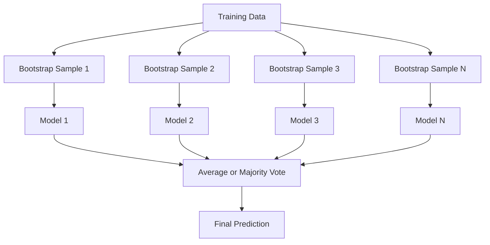
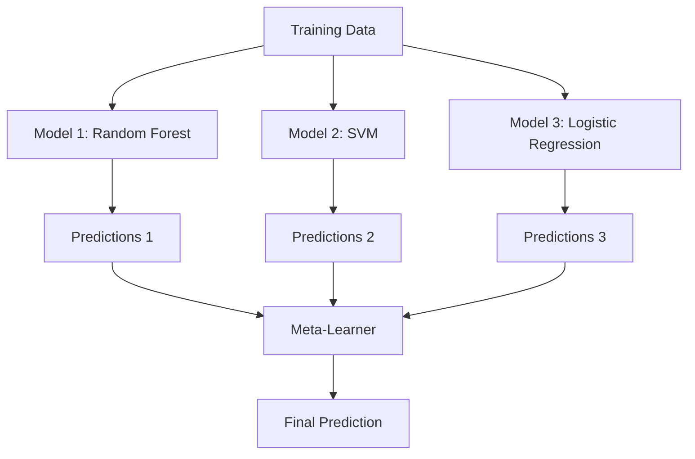

# Ансамблевые методы

> Группа слабых learners, правильно объединенная, становится сильным learner. Это не метафора. Это теорема.

**Тип:** Практика
**Язык:** Python
**Требования:** Фаза 2, Урок 10 (компромисс смещения и дисперсии)
**Время:** ~120 минут

## Цели обучения

- Реализовать AdaBoost и gradient boosting с нуля и объяснить, как boosting последовательно снижает bias
- Построить bagging ensemble и показать, как усреднение декоррелированных моделей снижает variance без увеличения bias
- Сравнить bagging, boosting и stacking по тому, на какую компоненту ошибки нацелен каждый метод
- Оценивать разнообразие ансамбля и объяснить, почему accuracy голосования большинством растет с числом независимых weak learners

## Проблема

Одно дерево решений быстро обучается и легко интерпретируется, но переобучается. Одна линейная модель недообучается на сложных границах. Можно потратить дни на проектирование идеальной архитектуры модели. А можно объединить несколько несовершенных моделей и получить результат лучше каждой из них по отдельности.

Ансамблевые методы делают именно это. Это самая надежная техника для победы в Kaggle-соревнованиях на табличных данных, они лежат в основе большинства production ML-систем и показывают bias-variance tradeoff в действии. Bagging снижает variance. Boosting снижает bias. Stacking учится, каким моделям доверять на каких входах.

## Концепция

### Почему ансамбли работают

Предположим, у вас есть N независимых классификаторов, каждый с accuracy p > 0.5. Accuracy majority vote равна:

```
P(majority correct) = sum over k > N/2 of C(N,k) * p^k * (1-p)^(N-k)
```

Для 21 классификатора с accuracy 60% голосование большинством дает около 74% accuracy. Для 101 классификатора — 84%. Ошибки взаимно компенсируются, когда модели ошибаются по-разному.

Ключевое требование — **разнообразие**. Если все модели делают одни и те же ошибки, объединение ничего не дает. Ансамбли работают, потому что создают разнообразные модели через:

- Разные обучающие поднаборы (bagging)
- Разные подмножества признаков (random forests)
- Последовательное исправление ошибок (boosting)
- Разные семейства моделей (stacking)

### Bagging (Bootstrap Aggregating)

Bagging создает разнообразие, обучая каждую модель на другой bootstrap-выборке обучающих данных.



Bootstrap-выборка берется с возвращением из исходных данных и имеет тот же размер, что исходный набор. Около 63.2% уникальных примеров попадает в каждый bootstrap. Оставшиеся 36.8% (out-of-bag samples) дают бесплатную validation set.

Bagging снижает variance, почти не увеличивая bias. Каждое отдельное дерево переобучается на своей bootstrap-выборке, но переобучение у каждого дерева разное, поэтому усреднение компенсирует шум.

**Random Forests** — это bagging с дополнительным приемом: на каждом split рассматривается только случайное подмножество признаков. Это заставляет деревья быть еще более разнообразными. Типичное число candidate features — `sqrt(n_features)` для классификации и `n_features / 3` для регрессии.

### Boosting (последовательное исправление ошибок)

Boosting обучает модели последовательно. Каждая новая модель фокусируется на примерах, в которых предыдущие модели ошиблись.


Boosting снижает bias. Каждая новая модель исправляет систематические ошибки текущего ансамбля. Финальное предсказание — взвешенная сумма всех моделей, где лучшие модели получают большие веса.

Компромисс: boosting может переобучиться, если запускать слишком много раундов, потому что он продолжает подгонять трудные примеры, часть которых может быть шумом.

### AdaBoost

AdaBoost (Adaptive Boosting) был первым практичным boosting-алгоритмом. Он работает с любым base learner, обычно с decision stumps (деревья глубины 1).

Алгоритм:

```
1. Initialize sample weights: w_i = 1/N for all i

2. For t = 1 to T:
   a. Train weak learner h_t on weighted data
   b. Compute weighted error:
      err_t = sum(w_i * I(h_t(x_i) != y_i)) / sum(w_i)
   c. Compute model weight:
      alpha_t = 0.5 * ln((1 - err_t) / err_t)
   d. Update sample weights:
      w_i = w_i * exp(-alpha_t * y_i * h_t(x_i))
   e. Normalize weights to sum to 1

3. Final prediction: H(x) = sign(sum(alpha_t * h_t(x)))
```

Модели с меньшей ошибкой получают больший alpha. Неверно классифицированные примеры получают больший вес, чтобы следующая модель сфокусировалась на них.

### Gradient Boosting

Gradient boosting обобщает boosting на произвольные функции потерь. Вместо перевзвешивания примеров он подгоняет каждую новую модель к остаткам (отрицательному градиенту loss) текущего ансамбля.

```
1. Initialize: F_0(x) = argmin_c sum(L(y_i, c))

2. For t = 1 to T:
   a. Compute pseudo-residuals:
      r_i = -dL(y_i, F_{t-1}(x_i)) / dF_{t-1}(x_i)
   b. Fit a tree h_t to the residuals r_i
   c. Find optimal step size:
      gamma_t = argmin_gamma sum(L(y_i, F_{t-1}(x_i) + gamma * h_t(x_i)))
   d. Update:
      F_t(x) = F_{t-1}(x) + learning_rate * gamma_t * h_t(x)

3. Final prediction: F_T(x)
```

Для squared error loss pseudo-residuals — это обычные остатки: `r_i = y_i - F_{t-1}(x_i)`. Каждое дерево буквально подгоняет ошибки предыдущего ансамбля.

Learning rate (shrinkage) управляет вкладом каждого дерева. Меньшие learning rates требуют больше деревьев, но лучше обобщают. Типичные значения: от 0.01 до 0.3.

### XGBoost: почему он доминирует на табличных данных

XGBoost (eXtreme Gradient Boosting) — это gradient boosting с инженерными оптимизациями, которые делают его быстрым, точным и устойчивым к переобучению:

- **Regularized objective:** L1 и L2 штрафы на веса листьев не дают отдельным деревьям быть слишком уверенными
- **Second-order approximation:** использует и первые, и вторые производные loss, что дает лучшие split decisions
- **Sparsity-aware splits:** нативно обрабатывает пропуски, обучая лучшее направление для missing data на каждом split
- **Column subsampling:** как random forests, семплирует признаки на каждом split для разнообразия
- **Weighted quantile sketch:** эффективно ищет split points для непрерывных признаков на распределенных данных
- **Cache-aware block structure:** раскладка памяти оптимизирована под CPU cache lines

Для табличных данных XGBoost (и его преемник LightGBM) стабильно превосходит нейросети. В ближайшее время это не изменится. Если ваши данные помещаются в таблицу со строками и столбцами, начинайте с gradient boosting.

### Stacking (Meta-Learning)

Stacking использует предсказания нескольких base models как признаки для meta-learner.



Meta-learner учится, какой base model доверять для каких входов. Если random forest лучше в одних областях, а SVM — в других, meta-learner научится соответствующей маршрутизации.

Чтобы избежать data leakage, предсказания base models должны генерироваться через cross-validation на training set. Нельзя обучать base models и генерировать meta-features на тех же данных.

### Voting

Самый простой ансамбль. Просто объединяет предсказания напрямую.

- **Hard voting:** majority vote по меткам классов.
- **Soft voting:** усреднить предсказанные вероятности и выбрать класс с максимальной средней вероятностью. Обычно лучше, потому что использует информацию об уверенности.

## Соберите это

### Шаг 1: Decision Stump (base learner)

Код в `code/ensembles.py` реализует все с нуля. Начинаем с decision stump: дерева с одним split.

```python
class DecisionStump:
    def __init__(self):
        self.feature_idx = None
        self.threshold = None
        self.polarity = 1
        self.alpha = None

    def fit(self, X, y, weights):
        n_samples, n_features = X.shape
        best_error = float("inf")

        for f in range(n_features):
            thresholds = np.unique(X[:, f])
            for thresh in thresholds:
                for polarity in [1, -1]:
                    pred = np.ones(n_samples)
                    pred[polarity * X[:, f] < polarity * thresh] = -1
                    error = np.sum(weights[pred != y])
                    if error < best_error:
                        best_error = error
                        self.feature_idx = f
                        self.threshold = thresh
                        self.polarity = polarity

    def predict(self, X):
        n = X.shape[0]
        pred = np.ones(n)
        idx = self.polarity * X[:, self.feature_idx] < self.polarity * self.threshold
        pred[idx] = -1
        return pred
```

### Шаг 2: AdaBoost с нуля

```python
class AdaBoostScratch:
    def __init__(self, n_estimators=50):
        self.n_estimators = n_estimators
        self.stumps = []
        self.alphas = []

    def fit(self, X, y):
        n = X.shape[0]
        weights = np.full(n, 1 / n)

        for _ in range(self.n_estimators):
            stump = DecisionStump()
            stump.fit(X, y, weights)
            pred = stump.predict(X)

            err = np.sum(weights[pred != y])
            err = np.clip(err, 1e-10, 1 - 1e-10)

            alpha = 0.5 * np.log((1 - err) / err)
            weights *= np.exp(-alpha * y * pred)
            weights /= weights.sum()

            stump.alpha = alpha
            self.stumps.append(stump)
            self.alphas.append(alpha)

    def predict(self, X):
        total = sum(a * s.predict(X) for a, s in zip(self.alphas, self.stumps))
        return np.sign(total)
```

### Шаг 3: Gradient Boosting с нуля

```python
class GradientBoostingScratch:
    def __init__(self, n_estimators=100, learning_rate=0.1, max_depth=3):
        self.n_estimators = n_estimators
        self.lr = learning_rate
        self.max_depth = max_depth
        self.trees = []
        self.initial_pred = None

    def fit(self, X, y):
        self.initial_pred = np.mean(y)
        current_pred = np.full(len(y), self.initial_pred)

        for _ in range(self.n_estimators):
            residuals = y - current_pred
            tree = SimpleRegressionTree(max_depth=self.max_depth)
            tree.fit(X, residuals)
            update = tree.predict(X)
            current_pred += self.lr * update
            self.trees.append(tree)

    def predict(self, X):
        pred = np.full(X.shape[0], self.initial_pred)
        for tree in self.trees:
            pred += self.lr * tree.predict(X)
        return pred
```

### Шаг 4: сравнить со sklearn

Код проверяет, что реализации с нуля дают accuracy, похожую на sklearn `AdaBoostClassifier` и `GradientBoostingClassifier`, и сравнивает все методы бок о бок.

## Используйте это

### Когда использовать каждый метод

| Метод | Снижает | Лучше всего для | Осторожно с |
|-------|---------|-----------------|-------------|
| Bagging / Random Forest | Variance | Шумные данные, много признаков | Не помогает с bias |
| AdaBoost | Bias | Чистые данные, простые base learners | Чувствителен к выбросам и шуму |
| Gradient Boosting | Bias | Табличные данные, соревнования | Долго обучается, легко переобучить без настройки |
| XGBoost / LightGBM | Оба | Production tabular ML | Много гиперпараметров |
| Stacking | Оба | Последние 1-2% accuracy | Сложен, риск overfitting meta-learner |
| Voting | Variance | Быстрая комбинация разных моделей | Помогает только если модели разнообразны |

### Production stack для табличных данных

Для большинства табличных prediction problems порядок такой:

1. **LightGBM или XGBoost** с параметрами по умолчанию
2. Настроить n_estimators, learning_rate, max_depth, min_child_weight
3. Если нужны последние 0.5%, построить stacking ensemble из 3-5 разнообразных моделей
4. Везде использовать cross-validation

Нейросети на табличных данных почти всегда хуже gradient boosting, несмотря на постоянные исследовательские попытки. TabNet, NODE и похожие архитектуры иногда догоняют, но редко превосходят хорошо настроенный XGBoost.

## Доведите до результата

Этот урок создает `outputs/prompt-ensemble-selector.md` — промпт, помогающий выбрать правильный ensemble method для заданного набора данных. Опишите данные (размер, типы признаков, уровень шума, баланс классов) и решаемую задачу. Промпт пройдет по decision checklist, порекомендует метод, предложит стартовые гиперпараметры и предупредит о частых ошибках для этого метода. Также создается `outputs/skill-ensemble-builder.md` с полным guide по выбору.

## Упражнения

1. Измените реализацию AdaBoost, чтобы отслеживать training accuracy после каждого раунда. Постройте accuracy vs. number of estimators. Когда она сходится?

2. Реализуйте random forest с нуля, добавив random feature subsampling в regression tree. Обучите 100 деревьев с `max_features=sqrt(n_features)` и усредните предсказания. Сравните снижение variance с одним деревом.

3. В реализации gradient boosting добавьте early stopping: отслеживайте validation loss после каждого раунда и останавливайтесь, если он не улучшался 10 раундов подряд. Сколько деревьев реально нужно?

4. Постройте stacking ensemble с тремя base models (logistic regression, decision tree, k-nearest neighbors) и logistic regression meta-learner. Используйте 5-fold cross-validation для генерации meta-features. Сравните с каждой base model по отдельности.

5. Запустите XGBoost на том же наборе данных с параметрами по умолчанию. Сравните его accuracy с вашим gradient boosting с нуля. Измерьте время обоих. Насколько велика разница в скорости?

## Ключевые термины

| Термин | Как говорят | Что это на самом деле значит |
|--------|-------------|------------------------------|
| Bagging | «Обучать на случайных поднаборах» | Bootstrap aggregating: обучить модели на bootstrap samples и усреднить предсказания, чтобы снизить variance |
| Boosting | «Фокусироваться на трудных примерах» | Обучать модели последовательно, каждая исправляет ошибки текущего ансамбля, чтобы снизить bias |
| AdaBoost | «Перевзвешивать данные» | Boosting через обновления sample weights; неверно классифицированные точки получают больший вес для следующего learner |
| Gradient boosting | «Подгонять остатки» | Boosting через подгонку каждой новой модели к отрицательному градиенту функции потерь |
| XGBoost | «Оружие Kaggle» | Gradient boosting с регуляризацией, second-order optimization и системными ускорениями |
| Stacking | «Модели поверх моделей» | Использование предсказаний base models как входных признаков для meta-learner |
| Random forest | «Много рандомизированных деревьев» | Bagging с деревьями решений плюс random feature subsampling на каждом split для разнообразия |
| Ensemble diversity | «Делать разные ошибки» | Ошибки моделей должны быть некоррелированы, чтобы ансамбль улучшался относительно отдельных моделей |
| Out-of-bag error | «Бесплатная валидация» | Примеры, не попавшие в bootstrap draw (~36.8%), служат validation set без отдельного holdout |

## Дополнительное чтение

- [Schapire & Freund: Boosting: Foundations and Algorithms](https://mitpress.mit.edu/9780262526036/) — книга создателей AdaBoost
- [Friedman: Greedy Function Approximation: A Gradient Boosting Machine (2001)](https://statweb.stanford.edu/~jhf/ftp/trebst.pdf) — оригинальная статья о gradient boosting
- [Chen & Guestrin: XGBoost (2016)](https://arxiv.org/abs/1603.02754) — статья об XGBoost
- [Wolpert: Stacked Generalization (1992)](https://www.sciencedirect.com/science/article/abs/pii/S0893608005800231) — оригинальная статья о stacking
- [scikit-learn Ensemble Methods](https://scikit-learn.org/stable/modules/ensemble.html) — практический справочник
