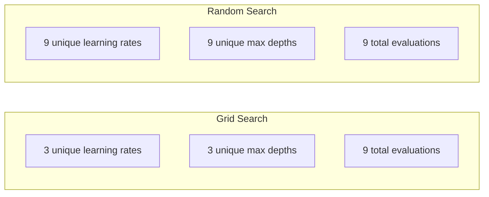
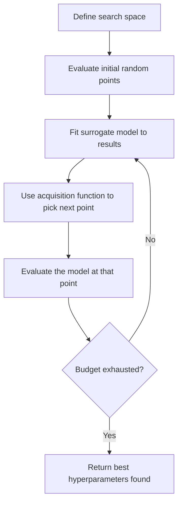
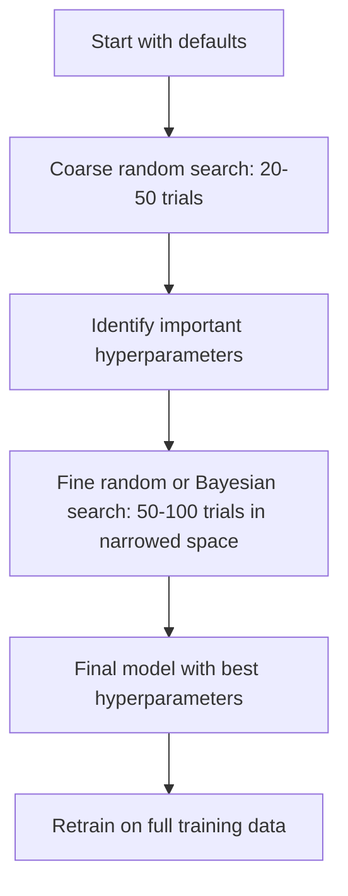
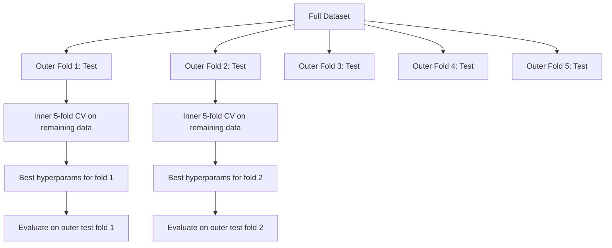

# Подбор гиперпараметров

> Гиперпараметры — это ручки, которые вы крутите до начала обучения. Умение крутить их правильно отличает посредственную модель от отличной.

**Тип:** Практика
**Язык:** Python
**Требования:** Фаза 2, Урок 11 (ансамблевые методы)
**Время:** ~90 минут

## Цели обучения

- Реализовать grid search, random search и Bayesian optimization с нуля и сравнить их sample efficiency
- Объяснить, почему random search превосходит grid search, когда большинство гиперпараметров имеют низкую effective dimensionality
- Построить цикл Bayesian optimization с surrogate model и acquisition function для направления поиска
- Спроектировать стратегию подбора гиперпараметров, которая избегает переобучения validation set через правильную cross-validation

## Проблема

У вашей gradient boosting модели есть learning rate, число деревьев, max depth, min samples per leaf, subsample ratio и column sample ratio. Это шесть гиперпараметров. Если у каждого есть 5 разумных значений, grid содержит 5^6 = 15 625 комбинаций. Обучение каждой занимает 10 секунд. Это 43 часа вычислений, чтобы попробовать все.

Grid search — очевидный подход и худший при масштабе. Random search делает лучше с меньшими вычислениями. Bayesian optimization идет дальше, учась на прошлых оценках. Знание того, какую стратегию использовать и какие гиперпараметры действительно важны, экономит дни GPU-времени.

## Концепция

### Parameters vs Hyperparameters

Parameters обучаются во время training (weights, biases, split thresholds). Hyperparameters задаются до начала обучения и управляют тем, как происходит learning.

| Гиперпараметр | Чем управляет | Типичный диапазон |
|---------------|---------------|-------------------|
| Learning rate | Размер шага обновления | 0.001 до 1.0 |
| Число деревьев/эпох | Как долго обучаться | 10 до 10 000 |
| Max depth | Сложность модели | 1 до 30 |
| Regularization (lambda) | Предотвращение переобучения | 0.0001 до 100 |
| Batch size | Шум оценки градиента | 16 до 512 |
| Dropout rate | Доля отключаемых нейронов | 0.0 до 0.5 |

### Grid Search

Grid search оценивает каждую комбинацию заданных значений. Он исчерпывающий и простой для понимания, но масштабируется экспоненциально с числом гиперпараметров.

```
Grid for 2 hyperparameters:

  learning_rate: [0.01, 0.1, 1.0]
  max_depth:     [3, 5, 7]

  Evaluations: 3 x 3 = 9 combinations

  (0.01, 3)  (0.01, 5)  (0.01, 7)
  (0.1,  3)  (0.1,  5)  (0.1,  7)
  (1.0,  3)  (1.0,  5)  (1.0,  7)
```

У grid search есть фундаментальный изъян: если один гиперпараметр важен, а другой нет, большинство оценок тратится впустую. Из 9 evaluations вы получаете только 3 уникальных значения важного параметра.

### Random Search

Random search семплирует гиперпараметры из распределений вместо grid. При том же бюджете в 9 evaluations вы получаете 9 уникальных значений каждого гиперпараметра.



Почему random лучше grid (Bergstra & Bengio, 2012):

- Большинство гиперпараметров имеют низкую effective dimensionality. Обычно для задачи важны только 1-2 из 6 гиперпараметров.
- Grid search тратит evaluations на неважные измерения.
- Random search плотнее покрывает важные измерения при том же бюджете.
- При 60 random trials у вас есть 95% шанс найти точку в пределах 5% от optimum (если она есть в search space).

### Bayesian Optimization

Random search игнорирует результаты. Он не учится тому, что высокий learning rate вызывает расходимость или что depth 3 стабильно лучше depth 10. Bayesian optimization использует прошлые evaluations, чтобы решать, где искать дальше.



Два ключевых компонента:

**Surrogate model:** дешевая для оценки модель (обычно Gaussian process), приближающая дорогую objective function. В любой точке search space она дает и предсказание, и оценку неопределенности.

**Acquisition function:** решает, где оценивать дальше, балансируя exploitation (искать рядом с известными хорошими точками) и exploration (искать там, где uncertainty высока). Частые варианты:

- **Expected Improvement (EI):** какое улучшение над текущим best ожидается в этой точке?
- **Upper Confidence Bound (UCB):** предсказание плюс множитель uncertainty. Высокий UCB означает либо перспективно, либо мало исследовано.
- **Probability of Improvement (PI):** какова вероятность, что точка превзойдет текущий best?

Bayesian optimization обычно находит лучшие гиперпараметры, чем random search, при в 2-5 раз меньшем числе evaluations. Накладные расходы на fit surrogate model ничтожны по сравнению с обучением реальной модели.

### Early Stopping

Не каждый training run нужно завершать. Если configuration явно плоха после 10 эпох, остановите ее и переходите дальше. Это early stopping в контексте hyperparameter search.

Стратегии:
- **Patience-based:** остановить, если validation loss не улучшался N эпох подряд
- **Median pruning:** остановить, если промежуточный результат trial хуже медианы завершенных trials на том же step
- **Hyperband:** выделить малые бюджеты многим configurations, затем постепенно увеличивать бюджет лучшим

Hyperband особенно эффективен. Он запускает 81 configuration на 1 эпоху, оставляет верхнюю треть, дает им 3 эпохи, оставляет верхнюю треть и так далее. Так хорошие configurations находятся в 10-50 раз быстрее, чем при полной оценке всех configs на полном бюджете.

### Learning Rate Schedulers

Learning rate почти всегда самый важный гиперпараметр. Вместо того чтобы держать его фиксированным, schedulers меняют его во время обучения.

| Scheduler | Formula | Когда использовать |
|-----------|---------|--------------------|
| Step decay | Умножать на 0.1 каждые N эпох | Классическое CNN training |
| Cosine annealing | lr * 0.5 * (1 + cos(pi * t / T)) | Современный default |
| Warmup + decay | Линейный рост, затем cosine decay | Transformers |
| One-cycle | Рост, затем падение за один cycle | Быстрая сходимость |
| Reduce on plateau | Уменьшать на factor, когда metric застыла | Безопасный default |

### Важность гиперпараметров

Не все гиперпараметры одинаково важны. Исследования random forests (Probst et al., 2019) и gradient boosting показывают устойчивые паттерны:

**Высокая важность:**
- Learning rate (всегда настраивать первым)
- Number of estimators / epochs (использовать early stopping вместо подбора)
- Regularization strength

**Средняя важность:**
- Max depth / number of layers
- Min samples per leaf / weight decay
- Subsample ratio

**Низкая важность:**
- Max features (для random forests)
- Конкретный выбор activation function
- Batch size (в разумном диапазоне)

Сначала настраивайте важные, остальные оставляйте по умолчанию.

### Практическая стратегия



Конкретный workflow:

1. **Начните с library defaults.** Их выбирали опытные практики, и часто это уже 80% пути.
2. **Coarse random search.** Широкие диапазоны, 20-50 trials. Используйте early stopping, чтобы быстро убивать плохие runs.
3. **Проанализируйте результаты.** Какие hyperparameters коррелируют с performance? Сузьте search space.
4. **Fine search.** Bayesian optimization или focused random search в суженном space. 50-100 trials.
5. **Переобучите на всех training data** с лучшими найденными гиперпараметрами.

### Интеграция с Cross-Validation

Подбирать гиперпараметры на одном validation split рискованно. Лучшие гиперпараметры могут переобучиться на конкретный validation fold. Nested cross-validation решает это двумя циклами:

- **Outer loop** (evaluation): делит данные на train+val и test. Сообщает несмещенное качество.
- **Inner loop** (tuning): делит train+val на train и val. Находит лучшие гиперпараметры.



Каждый outer fold независимо находит свои best hyperparameters. Outer scores дают несмещенную оценку generalization performance.

Со sklearn:

```python
from sklearn.model_selection import cross_val_score, GridSearchCV
from sklearn.ensemble import GradientBoostingRegressor

inner_cv = GridSearchCV(
    GradientBoostingRegressor(),
    param_grid={
        "learning_rate": [0.01, 0.05, 0.1],
        "max_depth": [2, 3, 5],
        "n_estimators": [50, 100, 200],
    },
    cv=5,
    scoring="neg_mean_squared_error",
)

outer_scores = cross_val_score(
    inner_cv, X, y, cv=5, scoring="neg_mean_squared_error"
)

print(f"Nested CV MSE: {-outer_scores.mean():.4f} +/- {outer_scores.std():.4f}")
```

Это дорого (5 outer folds x 5 inner folds x 27 grid points = 675 model fits), но дает надежную оценку качества. Используйте, когда сообщаете финальные результаты в статьях или когда ставка решения высока.

### Практические советы

**Начните с learning rate.** Это всегда самый важный гиперпараметр для gradient-based methods. Плохой learning rate делает все остальное нерелевантным. Зафиксируйте остальные гиперпараметры на defaults и сначала переберите learning rate.

**Используйте log-uniform distributions для learning rate и regularization.** Разница между 0.001 и 0.01 так же важна, как разница между 0.1 и 1.0. Линейный поиск тратит бюджет на большой край диапазона.

**Используйте early stopping вместо tuning n_estimators.** Для boosting и нейросетей задайте n_estimators или epochs высоким и позвольте early stopping решить, когда остановиться. Это убирает один гиперпараметр из search.

**Распределение бюджета.** Потратьте 60% tuning budget на 2 самых важных гиперпараметра. Оставшиеся 40% — на все остальное. Первые 2 объясняют большую часть variation performance.

**Масштаб важен.** Никогда не ищите batch size на log scale (16, 32, 64 — нормально). Learning rate всегда ищите на log scale. Подбирайте search distribution под то, как гиперпараметр влияет на модель.

| Тип модели | Главные гиперпараметры | Рекомендуемый поиск | Бюджет |
|------------|-------------------------|---------------------|--------|
| Random Forest | n_estimators, max_depth, min_samples_leaf | Random search, 50 trials | Low (fast training) |
| Gradient Boosting | learning_rate, n_estimators, max_depth | Bayesian, 100 trials + early stopping | Medium |
| Neural Network | learning_rate, weight_decay, batch_size | Bayesian or random, 100+ trials | High (slow training) |
| SVM | C, gamma (RBF kernel) | Grid on log scale, 25-50 trials | Low (2 params) |
| Lasso/Ridge | alpha | 1D search on log scale, 20 trials | Very low |
| XGBoost | learning_rate, max_depth, subsample, colsample | Bayesian, 100-200 trials + early stopping | Medium |

**Если сомневаетесь:** random search с числом trials минимум в 2 раза больше числа гиперпараметров (например, 6 hyperparameters = 12+ trials minimum). Вы удивитесь, как часто random search с 50 trials побеждает аккуратно спроектированный grid search.

## Соберите это

### Шаг 1: Grid Search с нуля

Код в `code/tuning.py` реализует grid search, random search и простой Bayesian optimizer с нуля.

```python
def grid_search(model_fn, param_grid, X_train, y_train, X_val, y_val):
    keys = list(param_grid.keys())
    values = list(param_grid.values())
    best_score = -float("inf")
    best_params = None
    n_evals = 0

    for combo in itertools.product(*values):
        params = dict(zip(keys, combo))
        model = model_fn(**params)
        model.fit(X_train, y_train)
        score = evaluate(model, X_val, y_val)
        n_evals += 1

        if score > best_score:
            best_score = score
            best_params = params

    return best_params, best_score, n_evals
```

### Шаг 2: Random Search с нуля

```python
def random_search(model_fn, param_distributions, X_train, y_train,
                  X_val, y_val, n_iter=50, seed=42):
    rng = np.random.RandomState(seed)
    best_score = -float("inf")
    best_params = None

    for _ in range(n_iter):
        params = {k: sample(v, rng) for k, v in param_distributions.items()}
        model = model_fn(**params)
        model.fit(X_train, y_train)
        score = evaluate(model, X_val, y_val)

        if score > best_score:
            best_score = score
            best_params = params

    return best_params, best_score, n_iter
```

### Шаг 3: Bayesian Optimization (упрощенно)

Главная идея: fit Gaussian process по наблюдаемым парам (hyperparameter, score), затем использовать acquisition function, чтобы решить, где смотреть дальше.

```python
class SimpleBayesianOptimizer:
    def __init__(self, search_space, n_initial=5):
        self.search_space = search_space
        self.n_initial = n_initial
        self.X_observed = []
        self.y_observed = []

    def _kernel(self, x1, x2, length_scale=1.0):
        dists = np.sum((x1[:, None, :] - x2[None, :, :]) ** 2, axis=2)
        return np.exp(-0.5 * dists / length_scale ** 2)

    def _fit_gp(self, X_new):
        X_obs = np.array(self.X_observed)
        y_obs = np.array(self.y_observed)
        y_mean = y_obs.mean()
        y_centered = y_obs - y_mean

        K = self._kernel(X_obs, X_obs) + 1e-4 * np.eye(len(X_obs))
        K_star = self._kernel(X_new, X_obs)

        L = np.linalg.cholesky(K)
        alpha = np.linalg.solve(L.T, np.linalg.solve(L, y_centered))
        mu = K_star @ alpha + y_mean

        v = np.linalg.solve(L, K_star.T)
        var = 1.0 - np.sum(v ** 2, axis=0)
        var = np.maximum(var, 1e-6)

        return mu, var

    def _expected_improvement(self, mu, var, best_y):
        sigma = np.sqrt(var)
        z = (mu - best_y) / (sigma + 1e-10)
        ei = sigma * (z * norm_cdf(z) + norm_pdf(z))
        return ei

    def suggest(self):
        if len(self.X_observed) < self.n_initial:
            return sample_random(self.search_space)

        candidates = [sample_random(self.search_space) for _ in range(500)]
        X_cand = np.array([to_vector(c) for c in candidates])
        mu, var = self._fit_gp(X_cand)
        ei = self._expected_improvement(mu, var, max(self.y_observed))
        return candidates[np.argmax(ei)]

    def observe(self, params, score):
        self.X_observed.append(to_vector(params))
        self.y_observed.append(score)
```

GP surrogate дает две величины в каждой candidate point: предсказанный score (mu) и uncertainty (var). Expected Improvement балансирует их: он предпочитает точки, где модель предсказывает высокий score ИЛИ где uncertainty высока. В начале у большинства точек высокая uncertainty, поэтому optimizer исследует. Позже он фокусируется на наиболее перспективной области.

### Шаг 4: сравнить все методы

Запустите все три метода на одной synthetic objective и сравните. Это сравнение использует упрощенный wrapper, вызывающий каждый optimizer с прямой objective function (без training модели), поэтому API отличается от model-based implementations выше:

```python
def synthetic_objective(params):
    lr = params["learning_rate"]
    depth = params["max_depth"]
    return -(np.log10(lr) + 2) ** 2 - (depth - 4) ** 2 + 10

param_grid = {
    "learning_rate": [0.001, 0.01, 0.1, 1.0],
    "max_depth": [2, 3, 4, 5, 6, 7, 8],
}

grid_best = None
grid_score = -float("inf")
grid_history = []
for combo in itertools.product(*param_grid.values()):
    params = dict(zip(param_grid.keys(), combo))
    score = synthetic_objective(params)
    grid_history.append((params, score))
    if score > grid_score:
        grid_score = score
        grid_best = params

param_dist = {
    "learning_rate": ("log_float", 0.001, 1.0),
    "max_depth": ("int", 2, 8),
}

rand_best = None
rand_score = -float("inf")
rand_history = []
rng = np.random.RandomState(42)
for _ in range(28):
    params = {k: sample(v, rng) for k, v in param_dist.items()}
    score = synthetic_objective(params)
    rand_history.append((params, score))
    if score > rand_score:
        rand_score = score
        rand_best = params

optimizer = SimpleBayesianOptimizer(param_dist, n_initial=5)
bayes_history = []
for _ in range(28):
    params = optimizer.suggest()
    score = synthetic_objective(params)
    optimizer.observe(params, score)
    bayes_history.append((params, score))
bayes_score = max(s for _, s in bayes_history)

print(f"{'Method':<20} {'Best Score':>12} {'Evaluations':>12}")
print("-" * 50)
print(f"{'Grid Search':<20} {grid_score:>12.4f} {len(grid_history):>12}")
print(f"{'Random Search':<20} {rand_score:>12.4f} {len(rand_history):>12}")
print(f"{'Bayesian Opt':<20} {bayes_score:>12.4f} {len(bayes_history):>12}")
```

При одинаковом бюджете Bayesian optimization обычно быстрее находит лучший score, потому что не тратит evaluations в явно плохих областях. Random search покрывает пространство лучше grid search. Grid search выигрывает только когда гиперпараметров очень мало и вы можете позволить себе exhaustive search.

## Используйте это

### Optuna на практике

Optuna — рекомендуемая библиотека для серьезного hyperparameter tuning. Она поддерживает pruning, distributed search и visualization из коробки.

```python
import optuna

def objective(trial):
    lr = trial.suggest_float("learning_rate", 1e-4, 1e-1, log=True)
    n_est = trial.suggest_int("n_estimators", 50, 500)
    max_depth = trial.suggest_int("max_depth", 2, 10)

    model = GradientBoostingRegressor(
        learning_rate=lr,
        n_estimators=n_est,
        max_depth=max_depth,
    )
    model.fit(X_train, y_train)
    return mean_squared_error(y_val, model.predict(X_val))

study = optuna.create_study(direction="minimize")
study.optimize(objective, n_trials=100)

print(f"Best params: {study.best_params}")
print(f"Best MSE: {study.best_value:.4f}")
```

Ключевые возможности Optuna:
- `suggest_float(..., log=True)` для параметров, которые лучше искать на log scale (learning rate, regularization)
- `suggest_int` для целочисленных параметров
- `suggest_categorical` для дискретных вариантов
- Встроенный MedianPruner для early stopping плохих trials
- `study.trials_dataframe()` для анализа

### Optuna с Pruning

Pruning рано останавливает бесперспективные trials, экономя огромные вычисления. Паттерн такой:

```python
import optuna
from sklearn.model_selection import cross_val_score

def objective(trial):
    params = {
        "learning_rate": trial.suggest_float("lr", 1e-4, 0.5, log=True),
        "max_depth": trial.suggest_int("max_depth", 2, 10),
        "n_estimators": trial.suggest_int("n_estimators", 50, 500),
        "subsample": trial.suggest_float("subsample", 0.5, 1.0),
    }

    model = GradientBoostingRegressor(**params)
    scores = cross_val_score(model, X_train, y_train, cv=3,
                             scoring="neg_mean_squared_error")
    mean_score = -scores.mean()

    trial.report(mean_score, step=0)
    if trial.should_prune():
        raise optuna.TrialPruned()

    return mean_score

pruner = optuna.pruners.MedianPruner(n_startup_trials=10, n_warmup_steps=5)
study = optuna.create_study(direction="minimize", pruner=pruner)
study.optimize(objective, n_trials=200)
```

`MedianPruner` останавливает trial, если его intermediate value хуже медианы всех completed trials на том же step. Для pruning нужно вызывать `trial.report()`, чтобы сообщать intermediate metrics, и `trial.should_prune()`, чтобы проверять остановку. `n_startup_trials=10` гарантирует, что минимум 10 trials завершатся полностью до включения pruning. Обычно это экономит 40-60% total compute.

### Встроенные sklearn tuners

Для быстрых экспериментов sklearn предоставляет `GridSearchCV`, `RandomizedSearchCV` и `HalvingRandomSearchCV`:

```python
from sklearn.model_selection import RandomizedSearchCV
from scipy.stats import loguniform, randint

param_dist = {
    "learning_rate": loguniform(1e-4, 0.5),
    "max_depth": randint(2, 10),
    "n_estimators": randint(50, 500),
}

search = RandomizedSearchCV(
    GradientBoostingRegressor(),
    param_dist,
    n_iter=100,
    cv=5,
    scoring="neg_mean_squared_error",
    random_state=42,
    n_jobs=-1,
)
search.fit(X_train, y_train)
print(f"Best params: {search.best_params_}")
print(f"Best CV MSE: {-search.best_score_:.4f}")
```

Используйте `loguniform` из scipy для learning rate и regularization. Используйте `randint` для integer hyperparameters. Флаг `n_jobs=-1` параллелит по всем CPU cores.

### Частые ошибки в hyperparameter tuning

**Data leakage через preprocessing.** Если fit scaler на полном наборе до cross-validation, информация из validation fold просачивается в training. Всегда кладите preprocessing внутрь `Pipeline`, чтобы он fit только на training fold.

**Переобучение на validation set.** Тысячи trials фактически обучают на validation set. Для финальной оценки используйте nested cross-validation или отдельный test set, которого tuning никогда не касается.

**Слишком узкий диапазон поиска.** Если лучшее значение на границе search space, вы искали недостаточно широко. Оптимум может быть за пределами диапазона. Всегда проверяйте, не лежат ли best parameters на краях.

**Игнорирование interaction effects.** Learning rate и number of estimators сильно взаимодействуют в boosting. Низкий learning rate требует больше estimators. Независимый tuning хуже совместного.

**Не использовать early stopping для iterative models.** Для gradient boosting и нейросетей задавайте n_estimators или epochs высоким и используйте early stopping. Это строго лучше, чем подбирать число итераций как гиперпараметр.

## Упражнения

1. Запустите grid search и random search с одинаковым total budget (например, 50 evaluations). Сравните лучшие найденные scores. Повторите эксперимент 10 раз с разными seeds. Как часто random search выигрывает?

2. Реализуйте Hyperband с нуля. Начните с 81 configuration, каждая обучается 1 эпоху. Оставляйте top 1/3 на каждом round и утраивайте их budget. Сравните total compute (сумма всех эпох по всем configs) с запуском 81 configs на полном бюджете.

3. Добавьте learning rate scheduler (cosine annealing) в gradient boosting implementation из Урока 11. Помогает ли он по сравнению с фиксированным learning rate?

4. Используйте Optuna, чтобы настроить RandomForestClassifier на реальном наборе данных (например, sklearn breast cancer dataset). Используйте `optuna.visualization.plot_param_importances(study)`, чтобы увидеть, какие hyperparameters важнее всего. Совпадает ли это с рейтингом важности из урока?

5. Реализуйте простую acquisition function (Expected Improvement) и покажите exploration vs exploitation. Постройте mean и uncertainty surrogate model и покажите, где EI выбирает следующую evaluation.

## Ключевые термины

| Термин | Как говорят | Что это на самом деле значит |
|--------|-------------|------------------------------|
| Гиперпараметр | «Настройка, которую выбирают» | Значение, заданное до обучения и управляющее процессом обучения; не выучивается из данных |
| Grid search | «Попробовать каждую комбинацию» | Исчерпывающий поиск по заданной сетке параметров. Экспоненциальная стоимость |
| Random search | «Просто семплировать случайно» | Семплирование гиперпараметров из распределений. Покрывает важные измерения лучше grid search |
| Bayesian optimization | «Умный поиск» | Использует surrogate model objective, чтобы решать, где оценивать дальше, балансируя exploration и exploitation |
| Surrogate model | «Дешевое приближение» | Модель (обычно Gaussian process), приближающая дорогую objective function по наблюдаемым evaluations |
| Acquisition function | «Где искать дальше» | Оценивает candidate points, балансируя expected improvement и uncertainty. EI и UCB — частые варианты |
| Early stopping | «Хватит тратить время» | Раннее прекращение обучения, когда validation performance перестает улучшаться |
| Hyperband | «Турнирная сетка для configs» | Adaptive resource allocation: начать много configs с малыми budgets, оставить лучшие и увеличить их budgets |
| Learning rate scheduler | «Менять lr во время обучения» | Функция, которая меняет learning rate по ходу training для лучшей сходимости |

## Дополнительное чтение

- [Bergstra & Bengio: Random Search for Hyper-Parameter Optimization (2012)](https://jmlr.org/papers/v13/bergstra12a.html) — статья, показавшая, что random beats grid
- [Snoek et al., Practical Bayesian Optimization of Machine Learning Algorithms (2012)](https://arxiv.org/abs/1206.2944) — Bayesian optimization для ML
- [Li et al., Hyperband: A Novel Bandit-Based Approach (2018)](https://jmlr.org/papers/v18/16-558.html) — статья о Hyperband
- [Optuna: A Next-generation Hyperparameter Optimization Framework](https://arxiv.org/abs/1907.10902) — статья об Optuna
- [Probst et al., Tunability: Importance of Hyperparameters (2019)](https://jmlr.org/papers/v20/18-444.html) — какие гиперпараметры важны
