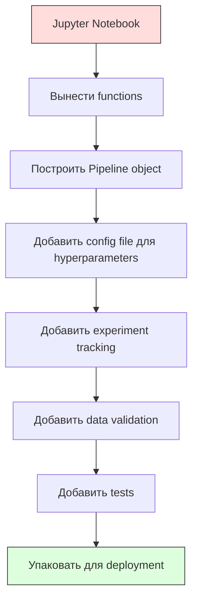

# ML-пайплайны

> Модель — это не продукт. Пайплайн — продукт. Пайплайн — это все от сырых данных до развернутого предсказания, и каждый шаг должен быть воспроизводимым.

**Тип:** Практика
**Язык:** Python
**Требования:** Фаза 2, Урок 12 (подбор гиперпараметров)
**Время:** ~120 минут

## Цели обучения

- Построить ML pipeline с нуля, который объединяет imputation, scaling, encoding и model training в один воспроизводимый объект
- Определять сценарии data leakage и объяснять, как pipelines предотвращают их, fitting transformers только на training data
- Собрать ColumnTransformer, который применяет разную предобработку к числовым и категориальным признакам
- Реализовать сериализацию pipeline и показать, что один и тот же fitted pipeline дает одинаковые результаты в training и production

## Проблема

У вас есть notebook, который загружает данные, заполняет пропуски медианой, масштабирует признаки, обучает модель и печатает accuracy. Он работает. Вы выкатываете его.

Через месяц кто-то переобучает модель и получает другие результаты. Медиана считалась на полном наборе данных, включая test data (data leakage). Параметры scaling не были сохранены, поэтому inference использует другую статистику. Feature engineering code был copy-paste между training и serving, и копии разошлись. В категориальном столбце в production появилось новое значение, которого encoder никогда не видел.

Это не гипотетика. Это самые частые причины падения ML-систем в production. Pipelines решают все эти проблемы, упаковывая каждый transformation step в один упорядоченный, воспроизводимый объект.

## Концепция

### Что такое Pipeline

Pipeline — это упорядоченная последовательность преобразований данных, за которой следует модель. Каждый шаг получает на вход выход предыдущего шага. Весь pipeline fitted один раз на training data. Во время inference тот же fitted pipeline преобразует новые данные и выдает predictions.


Pipeline гарантирует:
- Transformations fitted только на training data (нет leakage)
- Те же transformations применяются во время inference
- Весь объект можно сериализовать и развернуть как один artifact
- Cross-validation применяет pipeline по каждому fold, предотвращая тонкий leakage

### Data Leakage: тихий убийца

Data leakage происходит, когда информация из test set или будущих данных загрязняет training. Pipelines предотвращают самые частые формы.

**Leaky (wrong):**
```python
X = df.drop("target", axis=1)
y = df["target"]

scaler = StandardScaler()
X_scaled = scaler.fit_transform(X)

X_train, X_test = X_scaled[:800], X_scaled[800:]
y_train, y_test = y[:800], y[800:]
```

Scaler видел test data. Mean и standard deviation включают test samples. Это завышает accuracy estimates.

**Correct:**
```python
X_train, X_test = X[:800], X[800:]

scaler = StandardScaler()
X_train_scaled = scaler.fit_transform(X_train)
X_test_scaled = scaler.transform(X_test)
```

С pipeline об этом не нужно думать. Pipeline делает это автоматически.

### sklearn Pipeline

sklearn `Pipeline` связывает transformers и estimator. Он предоставляет `.fit()`, `.predict()` и `.score()`, применяющие все шаги по порядку.

```python
from sklearn.pipeline import Pipeline
from sklearn.preprocessing import StandardScaler
from sklearn.linear_model import LogisticRegression

pipe = Pipeline([
    ("scaler", StandardScaler()),
    ("model", LogisticRegression()),
])

pipe.fit(X_train, y_train)
predictions = pipe.predict(X_test)
```

Когда вы вызываете `pipe.fit(X_train, y_train)`:
1. Scaler вызывает `fit_transform` на X_train
2. Model вызывает `fit` на scaled X_train

Когда вы вызываете `pipe.predict(X_test)`:
1. Scaler вызывает `transform` (не fit_transform) на X_test
2. Model вызывает `predict` на scaled X_test

Scaler никогда не видит test data во время fitting. В этом весь смысл.

### ColumnTransformer: разные pipelines для разных столбцов

В реальных наборах данных есть числовые и категориальные столбцы, которым нужна разная предобработка. `ColumnTransformer` решает это.

```python
from sklearn.compose import ColumnTransformer
from sklearn.preprocessing import StandardScaler, OneHotEncoder
from sklearn.impute import SimpleImputer

numeric_pipe = Pipeline([
    ("impute", SimpleImputer(strategy="median")),
    ("scale", StandardScaler()),
])

categorical_pipe = Pipeline([
    ("impute", SimpleImputer(strategy="most_frequent")),
    ("encode", OneHotEncoder(handle_unknown="ignore")),
])

preprocessor = ColumnTransformer([
    ("num", numeric_pipe, ["age", "income", "score"]),
    ("cat", categorical_pipe, ["city", "gender", "plan"]),
])

full_pipeline = Pipeline([
    ("preprocess", preprocessor),
    ("model", GradientBoostingClassifier()),
])
```

`handle_unknown="ignore"` в OneHotEncoder критичен для production. Когда появляется новая категория (город, которого модель не видела), encoder создает нулевой вектор вместо падения.

### Experiment Tracking

Pipeline делает training воспроизводимым, но нужно также отслеживать, что происходило между experiments: какие hyperparameters использовались, какая версия dataset, какие metrics, какой code запускался.

**MLflow** — самое распространенное open-source решение:

```python
import mlflow

with mlflow.start_run():
    mlflow.log_param("max_depth", 5)
    mlflow.log_param("n_estimators", 100)
    mlflow.log_param("learning_rate", 0.1)

    pipe.fit(X_train, y_train)
    accuracy = pipe.score(X_test, y_test)

    mlflow.log_metric("accuracy", accuracy)
    mlflow.sklearn.log_model(pipe, "model")
```

Каждый run записывается с parameters, metrics, artifacts и полной model. Можно сравнивать runs, воспроизводить любой experiment и deploy любую version модели.

**Weights & Biases (wandb)** предоставляет ту же функциональность с hosted dashboard:

```python
import wandb

wandb.init(project="my-pipeline")
wandb.config.update({"max_depth": 5, "n_estimators": 100})

pipe.fit(X_train, y_train)
accuracy = pipe.score(X_test, y_test)

wandb.log({"accuracy": accuracy})
```

### Версионирование моделей

После experiment tracking нужно управлять model versions. Какая модель в production? Какая в staging? Какая была на прошлой неделе?

MLflow Model Registry предоставляет:
- **Version tracking:** каждая сохраненная model получает version number
- **Stage transitions:** "Staging", "Production", "Archived"
- **Approval workflow:** models должны быть явно promoted to production
- **Rollback:** мгновенный возврат к предыдущей version

### Версионирование данных с DVC

Code версионируется git. Data тоже нужно версионировать, но git не справляется с большими файлами. DVC (Data Version Control) решает это.

```
dvc init
dvc add data/training.csv
git add data/training.csv.dvc data/.gitignore
git commit -m "Track training data"
dvc push
```

DVC хранит сами данные в remote storage (S3, GCS, Azure) и оставляет в git маленький `.dvc` file с hash. Когда вы checkout git commit, `dvc checkout` восстанавливает ровно те данные, которые использовались.

Это значит, что каждый git commit фиксирует и code, и data. Полная воспроизводимость.

### Воспроизводимые эксперименты

Воспроизводимому experiment нужны четыре вещи:

1. **Fixed random seeds:** задать seeds для numpy, random и framework (torch, sklearn)
2. **Pinned dependencies:** requirements.txt или poetry.lock с точными versions
3. **Versioned data:** DVC или аналог
4. **Config files:** все hyperparameters в config, а не hardcoded

```python
import numpy as np
import random

def set_seed(seed=42):
    random.seed(seed)
    np.random.seed(seed)
    try:
        import torch
        torch.manual_seed(seed)
        torch.cuda.manual_seed_all(seed)
        torch.backends.cudnn.deterministic = True
    except ImportError:
        pass
```

### От Notebook к Production Pipeline



Типичный путь:

1. **Notebook exploration:** быстрые experiments, визуализации, идеи признаков
2. **Extract functions:** перенести preprocessing, feature engineering, evaluation в modules
3. **Build Pipeline:** связать transformations в sklearn Pipeline или custom class
4. **Config management:** вынести все hyperparameters в YAML/JSON config
5. **Experiment tracking:** добавить MLflow или wandb logging
6. **Data validation:** проверять schema, distributions и missing value patterns перед training
7. **Tests:** unit tests для transformers, integration tests для полного pipeline
8. **Deployment:** сериализовать pipeline, завернуть в API (FastAPI, Flask), containerize

### Частые ошибки Pipeline

| Ошибка | Почему плохо | Исправление |
|--------|--------------|-------------|
| Fitting на full data до split | Data leakage | Использовать Pipeline с cross_val_score |
| Feature engineering вне pipeline | Разные transforms на train и serve | Поместить все transforms в Pipeline |
| Не обрабатывать unknown categories | Production crash на новых значениях | OneHotEncoder(handle_unknown="ignore") |
| Hardcoded column names | Ломается при изменении schema | Брать lists column names из config |
| Нет data validation | Тихо неверные predictions на плохих данных | Добавить schema checks перед prediction |
| Training/serving skew | Model видит разные features в prod | Один Pipeline object для обоих |

## Соберите это

Код в `code/pipeline.py` строит полный ML pipeline с нуля:

### Шаг 1: Custom Transformer

```python
class CustomTransformer:
    def __init__(self):
        self.means = None
        self.stds = None

    def fit(self, X):
        self.means = np.mean(X, axis=0)
        self.stds = np.std(X, axis=0)
        self.stds[self.stds == 0] = 1.0
        return self

    def transform(self, X):
        return (X - self.means) / self.stds

    def fit_transform(self, X):
        return self.fit(X).transform(X)
```

### Шаг 2: Pipeline с нуля

```python
class PipelineFromScratch:
    def __init__(self, steps):
        self.steps = steps

    def fit(self, X, y=None):
        X_current = X.copy()
        for name, step in self.steps[:-1]:
            X_current = step.fit_transform(X_current)
        name, model = self.steps[-1]
        model.fit(X_current, y)
        return self

    def predict(self, X):
        X_current = X.copy()
        for name, step in self.steps[:-1]:
            X_current = step.transform(X_current)
        name, model = self.steps[-1]
        return model.predict(X_current)
```

### Шаг 3: Cross-Validation с Pipeline

Код показывает, как cross-validation с pipeline предотвращает data leakage: scaler fitted отдельно на training data каждого fold.

### Шаг 4: полный production pipeline со sklearn

Полный pipeline с `ColumnTransformer`, несколькими путями preprocessing и model, обученный с правильной cross-validation и experiment logging.

## Доведите до результата

Этот урок создает:
- `outputs/prompt-ml-pipeline.md` — skill для построения и отладки ML pipelines
- `code/pipeline.py` — полный pipeline от реализации с нуля до sklearn

## Упражнения

1. Постройте pipeline для dataset с 3 numeric columns и 2 categorical columns. Используйте `ColumnTransformer`: median imputation + scaling для numeric и most-frequent imputation + one-hot encoding для categorical. Обучите с 5-fold cross-validation.

2. Намеренно внесите data leakage: fit scaler на полном dataset до splitting. Сравните cross-validation score (leaky) с pipeline cross-validation score (clean). Насколько велика разница?

3. Сериализуйте pipeline через `joblib.dump`. Загрузите его в отдельном script и запустите predictions. Проверьте, что predictions идентичны.

4. Добавьте в pipeline custom transformer, который создает polynomial features (degree 2) для двух самых важных numeric columns. Где он должен стоять в pipeline?

5. Настройте MLflow tracking для pipeline. Запустите 5 experiments с разными hyperparameters. Используйте MLflow UI (`mlflow ui`), чтобы сравнить runs и выбрать лучшую model.

## Ключевые термины

| Термин | Как говорят | Что это на самом деле значит |
|--------|-------------|------------------------------|
| Pipeline | «Цепочка transforms + model» | Упорядоченная последовательность fitted transformers и model, применяемая как единый объект для предотвращения leakage |
| Data leakage | «Test info попала в training» | Использование информации вне training set для построения model, завышающее performance estimates |
| ColumnTransformer | «Разная предобработка по столбцам» | Применяет разные pipelines к разным subsets of columns и объединяет результаты |
| Experiment tracking | «Логирование runs» | Запись parameters, metrics, artifacts и code versions для каждого training run |
| MLflow | «Track and deploy models» | Open-source платформа для experiment tracking, model registry и deployment |
| DVC | «Git для данных» | Version control system для больших data files, хранящий hashes в git и data в remote storage |
| Model registry | «Каталог версий моделей» | Система, отслеживающая model versions со stage labels (staging, production, archived) |
| Training/serving skew | «В notebook работало» | Различия в обработке данных при training и inference, вызывающие тихие ошибки |
| Воспроизводимость | «Тот же code, тот же result» | Возможность получить идентичные results из того же code, data и configuration |

## Дополнительное чтение

- [scikit-learn Pipeline docs](https://scikit-learn.org/stable/modules/compose.html) — официальный справочник по pipeline
- [MLflow documentation](https://mlflow.org/docs/latest/index.html) — experiment tracking и model registry
- [DVC documentation](https://dvc.org/doc) — data versioning
- [Sculley et al., Hidden Technical Debt in Machine Learning Systems (2015)](https://papers.nips.cc/paper/2015/hash/86df7dcfd896fcaf2674f757a2463eba-Abstract.html) — ключевая статья о сложности ML-систем
- [Google ML Best Practices: Rules of ML](https://developers.google.com/machine-learning/guides/rules-of-ml) — практические советы по production ML
