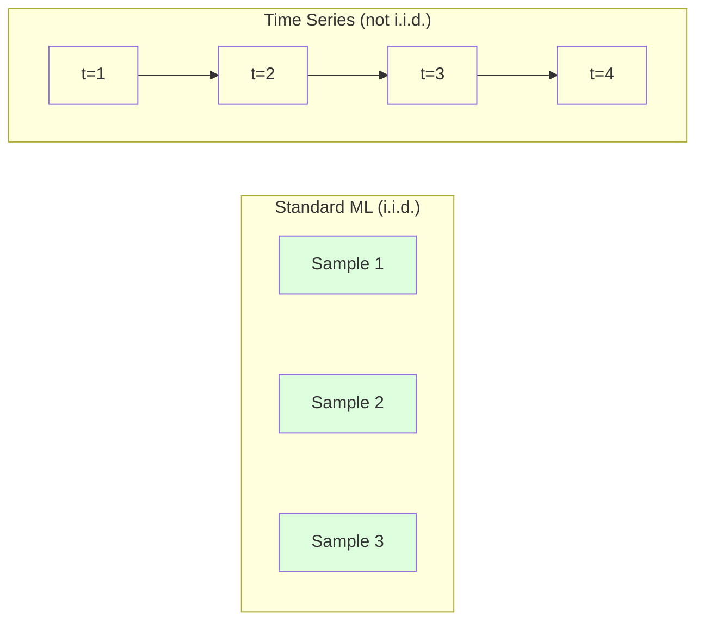
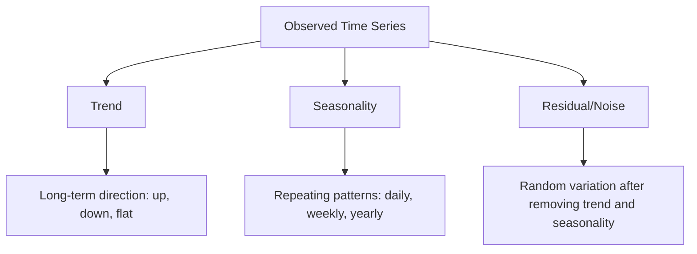
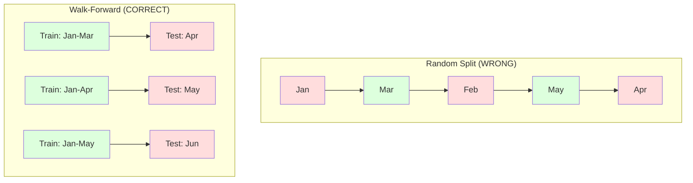

# Основы временных рядов

> Прошлые результаты действительно предсказывают будущие, если сначала проверить стационарность.

**Тип:** Практика
**Язык:** Python
**Требования:** Фаза 2, Уроки 01-09
**Время:** ~90 минут

## Цели обучения

- Разложить временной ряд на trend, seasonality и residual components и проверить stationarity
- Реализовать lag features и rolling statistics, чтобы превратить time series в supervised learning problem
- Построить walk-forward validation framework, предотвращающий утечку будущих данных в training
- Объяснить, почему random train/test splits невалидны для временных рядов, и показать разрыв качества относительно правильных temporal splits

## Проблема

У вас есть данные, упорядоченные по времени. Daily sales, hourly temperature, per-minute CPU usage, weekly stock prices. Вы хотите предсказать следующее значение, следующую неделю, следующий квартал.

Вы тянетесь к стандартному ML toolkit: random train/test split, cross-validation, feature matrix in, prediction out. Каждый шаг неверен.

Time series нарушают предположения, на которых держится стандартный ML. Samples не независимы: сегодняшняя температура зависит от вчерашней. Random splits пропускают future information в past. Features, которые отлично выглядят в backtest, проваливаются в production, потому что опираются на patterns, которые со временем сдвигаются.

Модель, получающая 95% accuracy с random cross-validation, может получить 55% при правильной time-based evaluation. Разница не техническая мелочь. Это разница между моделью, которая работает на бумаге, и моделью, которая работает в production.

Этот урок покрывает основы: чем time data отличается, как честно оценивать модели и как превратить time series в features, которые могут использовать стандартные ML models.

## Концепция

### Что отличает временные ряды

Стандартный ML предполагает i.i.d. — independent and identically distributed. Каждый sample взят из одного распределения независимо от других samples. Time series нарушают оба условия:

- **Не независимы.** Сегодняшняя stock price зависит от вчерашней. Продажи этой недели коррелируют с прошлой неделей.
- **Не одинаково распределены.** Distribution сдвигается во времени. Продажи в декабре выглядят иначе, чем в марте.

Эти нарушения не мелкие. Они меняют то, как строить features, оценивать models и выбирать algorithms.



В standard ML samples взаимозаменяемы. Перемешивание ничего не меняет. Во временных рядах порядок — все. Перемешивание уничтожает сигнал.

### Компоненты временного ряда

Каждый временной ряд — комбинация:



- **Trend**: долгосрочное направление. Revenue растет на 10% в год. Global temperature повышается.
- **Seasonality**: повторяющиеся patterns на фиксированных интервалах. Retail sales взлетают в декабре. Air conditioning usage достигает пика в июле.
- **Residual**: все, что осталось после удаления trend и seasonality. Если residual похож на white noise, decomposition поймала сигнал.

### Stationarity

Time series стационарен, если его статистические свойства (mean, variance, autocorrelation) не меняются со временем. Большинство forecasting methods предполагает stationarity.

**Почему важно:** non-stationary series имеет mean, который дрейфует. Модель, обученная на January data, выучила другой mean, чем будет в February. Она будет систематически ошибаться.

**Как проверить:** вычислить rolling mean и rolling standard deviation по windows. Если они дрейфуют, series non-stationary.

**Как исправить:** differencing. Вместо raw values моделируйте change между consecutive values:

```
diff[t] = value[t] - value[t-1]
```

Если одно differencing не делает series stationary, примените его снова (second-order differencing). Большинству real-world series нужно максимум два rounds.

**Пример:**

Original series: [100, 102, 106, 112, 120]
First difference:  [2, 4, 6, 8] (still trending upward)
Second difference:  [2, 2, 2] (constant -- stationary)

У исходного series был quadratic trend. First differencing превратило его в linear trend. Second differencing сделало его плоским. На практике редко нужно больше двух rounds.

**Формальный тест:** Augmented Dickey-Fuller (ADF) test — стандартный статистический тест stationarity. Null hypothesis: «series non-stationary». p-value ниже 0.05 означает, что можно отвергнуть null и сделать вывод о stationarity. Мы не реализуем ADF с нуля (нужны таблицы asymptotic distributions), но rolling statistics в коде дают практическую visual check.

### Autocorrelation

Autocorrelation измеряет, насколько значение в time t коррелирует со значением в time t-k (k шагов назад). Autocorrelation function (ACF) строит эту correlation для каждого lag k.

**ACF говорит:**
- Насколько далеко назад series «помнит». Если ACF падает к нулю после lag 5, значения старше 5 steps нерелевантны.
- Есть ли seasonality. Если ACF имеет spike на lag 12 (monthly data), есть yearly seasonality.
- Сколько lag features создавать. Используйте lags до момента, где ACF становится negligible.

**PACF (Partial Autocorrelation Function)** удаляет indirect correlations. Если today коррелирует с 3 days ago только потому, что оба коррелируют с yesterday, PACF на lag 3 будет zero, а ACF на lag 3 — нет.

### Lag Features: превращаем Time Series в Supervised Learning

Standard ML models требуют feature matrix X и target y. Time series дает один столбец values. Мост — lag features.

Возьмем series [10, 12, 14, 13, 15] и создадим lag-1 и lag-2 features:

| lag_2 | lag_1 | target |
|-------|-------|--------|
| 10    | 12    | 14     |
| 12    | 14    | 13     |
| 14    | 13    | 15     |

Теперь это standard regression problem. Любая ML model (linear regression, random forest, gradient boosting) может предсказывать target по lags.

Дополнительные features:
- **Rolling statistics:** mean, std, min, max по последним k values
- **Calendar features:** day of week, month, is_holiday, is_weekend
- **Differenced values:** change from previous step
- **Expanding statistics:** cumulative mean, cumulative sum
- **Ratio features:** current value / rolling mean (насколько далеко от recent average)
- **Interaction features:** lag_1 * day_of_week (weekday effects on momentum)

**Сколько lags?** Используйте autocorrelation function. Если ACF significant до lag 10, используйте минимум 10 lags. Если есть weekly seasonality, включите lag 7 (и возможно 14). Больше lags дают модели больше history, но и больше features для fitting, повышая risk of overfitting.

**Ловушка target alignment.** При создании lag features target должен быть value at time t, а все features должны использовать values at time t-1 или раньше. Если случайно включить value at time t как feature, получится perfect predictor — и совершенно бесполезная модель. Это самый частый bug в time series feature engineering.

### Walk-Forward Validation

Это самая важная концепция урока. Стандартная k-fold cross-validation случайно распределяет samples между train и test. Для time series это leaks future information.



Walk-forward validation:
1. Обучиться на данных до time t
2. Предсказать time t+1 (или t+1 до t+k для multi-step)
3. Сдвинуть window forward
4. Повторить

Каждый test fold содержит только данные, идущие после всех training data. Нет future leakage. Это дает честную оценку того, как модель будет работать после deployment.

**Expanding window** использует всю history для training (window растет). **Sliding window** использует fixed-size training window (window slides). Используйте expanding, когда считаете старые данные релевантными. Используйте sliding, когда world changes и old data вредит.

### ARIMA Intuition

ARIMA — классическая time series model. У нее три компонента:

- **AR (Autoregressive):** предсказывает по past values. AR(p) использует последние p values.
- **I (Integrated):** differencing для stationarity. I(d) применяет d rounds of differencing.
- **MA (Moving Average):** предсказывает по past forecast errors. MA(q) использует последние q errors.

ARIMA(p, d, q) объединяет все три. Вы выбираете p, d, q по ACF/PACF analysis или automated search (auto-ARIMA).

Мы не реализуем ARIMA с нуля — она требует numerical optimization за пределами урока. Главное — понимать, что делает каждый component, чтобы интерпретировать ARIMA results и знать, когда ее использовать.

### Когда что использовать

| Подход | Лучше всего для | Handles Seasonality | Handles External Features |
|--------|-----------------|---------------------|---------------------------|
| Lag features + ML | Таблицы с многими external features | С calendar features | Yes |
| ARIMA | Один univariate series, short-term | SARIMA variant | No (ARIMAX for limited) |
| Exponential smoothing | Simple trend + seasonality | Yes (Holt-Winters) | No |
| Prophet | Business forecasting, holidays | Yes (Fourier terms) | Limited |
| Neural networks (LSTM, Transformer) | Long sequences, many series | Learned | Yes |

Для большинства практических задач lag features + gradient boosting — самый сильный старт. Он естественно работает с external features, не требует stationarity и легко debug.

### Forecasting Horizons and Strategies

Single-step forecasting предсказывает один шаг вперед. Multi-step forecasting предсказывает несколько шагов. Есть три стратегии:

**Recursive (iterated):** предсказать один step ahead, использовать prediction как input для next step. Просто, но errors accumulate: каждое prediction использует предыдущее prediction, поэтому mistakes compound.

**Direct:** обучить отдельную model для каждого horizon. Model-1 предсказывает t+1, Model-5 предсказывает t+5. Нет error accumulation, но у каждой модели меньше training samples, и они не share information.

**Multi-output:** обучить одну model, которая outputs all horizons simultaneously. Shares information across horizons, но требует model с поддержкой multiple outputs (или custom loss).

На практике начинайте с recursive для short horizons (1-5 steps) и direct для longer horizons.

### Частые ошибки во временных рядах

| Ошибка | Почему происходит | Как исправить |
|--------|-------------------|---------------|
| Random train/test split | Привычка из standard ML | Использовать walk-forward или temporal split |
| Using future features | Feature at time t включен по ошибке | Проверить temporal alignment каждого feature |
| Overfitting to seasonality | Model memorizes calendar patterns | Hold out полный seasonal cycle в test set |
| Ignoring scale changes | Revenue doubles but patterns stay | Моделировать percentage change вместо absolute |
| Too many lag features | «More history is better» | Использовать ACF для relevant lags |
| Not differencing | «Model will figure it out» | Tree models handle trends; linear models need stationarity |

## Соберите это

Код в `code/time_series.py` реализует core building blocks с нуля.

### Lag Feature Creator

```python
def make_lag_features(series, n_lags):
    n = len(series)
    X = np.full((n, n_lags), np.nan)
    for lag in range(1, n_lags + 1):
        X[lag:, lag - 1] = series[:-lag]
    valid = ~np.isnan(X).any(axis=1)
    return X[valid], series[valid]
```

Это превращает 1D series в feature matrix, где каждая row содержит последние `n_lags` values как features, а current value — target.

### Walk-Forward Cross-Validation

```python
def walk_forward_split(n_samples, n_splits=5, min_train=50):
    assert min_train < n_samples, "min_train must be less than n_samples"
    step = max(1, (n_samples - min_train) // n_splits)
    for i in range(n_splits):
        train_end = min_train + i * step
        test_end = min(train_end + step, n_samples)
        if train_end >= n_samples:
            break
        yield slice(0, train_end), slice(train_end, test_end)
```

Каждый split гарантирует, что training data строго предшествует test data. Training window expands с каждым fold.

### Simple Autoregressive Model

Чистая AR model — это linear regression на lag features:

```python
class SimpleAR:
    def __init__(self, n_lags=5):
        self.n_lags = n_lags
        self.weights = None
        self.bias = None

    def fit(self, series):
        X, y = make_lag_features(series, self.n_lags)
        # Solve via normal equations
        X_b = np.column_stack([np.ones(len(X)), X])
        theta = np.linalg.lstsq(X_b, y, rcond=None)[0]
        self.bias = theta[0]
        self.weights = theta[1:]
        return self
```

Концептуально это та же linear regression из Урока 02, но примененная к time-lagged versions той же переменной.

### Проверка stationarity

Код вычисляет rolling statistics для visual и numerical assessment stationarity:

```python
def check_stationarity(series, window=50):
    rolling_mean = np.array([
        series[max(0, i - window):i].mean()
        for i in range(1, len(series) + 1)
    ])
    rolling_std = np.array([
        series[max(0, i - window):i].std()
        for i in range(1, len(series) + 1)
    ])
    return rolling_mean, rolling_std
```

Если rolling mean дрейфует или rolling std меняется, series non-stationary. Примените differencing и проверьте снова.

Код также проверяет stationarity сравнением первой и второй половины series. Если means отличаются больше чем на половину standard deviation или variance ratio превышает 2x, series помечается как non-stationary.

### Autocorrelation

```python
def autocorrelation(series, max_lag=20):
    n = len(series)
    mean = series.mean()
    var = series.var()
    acf = np.zeros(max_lag + 1)
    for k in range(max_lag + 1):
        cov = np.mean((series[:n-k] - mean) * (series[k:] - mean))
        acf[k] = cov / var if var > 0 else 0
    return acf
```

### Ожидаемый вывод

Запустите `code/time_series.py` — последние строки должны быть такими:

```
    17      59.13      67.09      -7.95
    18      54.61      65.35     -10.74
    19      58.45      60.57      -2.12
    20      61.63      56.74      +4.89

Forecast MSE:  116.3491
Forecast MAE:  9.5334
Forecast MAPE: 16.82%
```

## Используйте это

Со sklearn можно использовать lag features напрямую с любым regressor:

```python
from sklearn.linear_model import Ridge
from sklearn.ensemble import GradientBoostingRegressor

X, y = make_lag_features(series, n_lags=10)

for train_idx, test_idx in walk_forward_split(len(X)):
    model = Ridge(alpha=1.0)
    model.fit(X[train_idx], y[train_idx])
    predictions = model.predict(X[test_idx])
```

Для ARIMA используйте statsmodels:

```python
from statsmodels.tsa.arima.model import ARIMA

model = ARIMA(train_series, order=(5, 1, 2))
fitted = model.fit()
forecast = fitted.forecast(steps=30)
```

Код в `time_series.py` показывает оба подхода и сравнивает их с walk-forward validation.

### sklearn TimeSeriesSplit

sklearn предоставляет `TimeSeriesSplit`, реализующий walk-forward validation:

```python
from sklearn.model_selection import TimeSeriesSplit

tscv = TimeSeriesSplit(n_splits=5)
for train_index, test_index in tscv.split(X):
    X_train, X_test = X[train_index], X[test_index]
    y_train, y_test = y[train_index], y[test_index]
    model.fit(X_train, y_train)
    score = model.score(X_test, y_test)
```

Это эквивалентно нашему `walk_forward_split` с нуля, но интегрировано в sklearn cross-validation framework. Можно использовать с `cross_val_score`:

```python
from sklearn.model_selection import cross_val_score

scores = cross_val_score(model, X, y, cv=TimeSeriesSplit(n_splits=5))
print(f"Mean score: {scores.mean():.4f} +/- {scores.std():.4f}")
```

### Метрики оценки

Time series forecasting использует regression metrics, но с time-aware context:

- **MAE (Mean Absolute Error):** среднее |y_true - y_pred|. Легко интерпретируется в исходных units. «В среднем predictions ошибаются на 3.2 degrees».
- **RMSE (Root Mean Squared Error):** square root of mean squared error. Сильнее штрафует большие ошибки, чем MAE. Используйте, когда big errors хуже, чем many small errors.
- **MAPE (Mean Absolute Percentage Error):** среднее |error / true_value| * 100. Scale-independent, полезно для сравнения разных series. Но undefined, когда true values равны zero.
- **Naive baseline comparison:** всегда сравнивайте с simple baselines. Seasonal naive baseline предсказывает value from one period ago (yesterday, last week). Если модель не бьет naive, что-то не так.

### Rolling Features

Код демонстрирует добавление rolling statistics (mean, std, min, max по windows 7 и 14 days) к lag features. Они дают модели информацию о recent trends и volatility, которую одни lag features не дают.

Например, растущий rolling mean указывает на upward trend. Растущий rolling std указывает на increasing volatility. Это patterns, которые tree-based models могут выучить, а linear models — нет.

## Доведите до результата

Этот урок создает:
- `outputs/prompt-time-series-advisor.md` — промпт для framing time series problems
- `code/time_series.py` — lag features, walk-forward validation, AR model, stationarity checks

### Baselines, которые нужно побить

Перед построением любой model установите baselines:

1. **Last value (persistence).** Предсказать, что завтра будет как сегодня. Для многих series это удивительно трудно побить.
2. **Seasonal naive.** Предсказать, что today будет как same day last week (или last year). Если модель не бьет это, она не выучила ничего полезного сверх seasonality.
3. **Moving average.** Предсказать average of last k values. Сглаживает noise, но не ловит sudden changes.

Если ваша fancy ML model проигрывает seasonal naive baseline, у вас bug. Чаще всего: future leakage in features, wrong evaluation method или series действительно random и unpredictable.

### Практические советы

1. **Начните с графика.** До modeling постройте raw series. Ищите trends, seasonality, outliers, structural breaks (резкие изменения behavior). 30-секундная visual inspection часто дает больше, чем час automated analysis.

2. **Сначала difference, потом model.** Если у series явный trend, сделайте differencing перед lag features. Tree-based models can handle trends, but linear models cannot, and differencing never hurts.

3. **Hold out минимум один полный seasonal cycle.** Если есть weekly seasonality, test set должен включать минимум одну полную неделю. Если monthly — минимум один месяц. Иначе нельзя оценить, поймала ли модель seasonal pattern.

4. **Monitor in production.** Time series models деградируют со временем, потому что world changes. Отслеживайте prediction errors on a rolling basis. Когда errors начинают расти, retrain model на recent data.

5. **Beware regime changes.** Модель, обученная на pre-pandemic data, не предскажет post-pandemic behavior. Добавляйте indicators известных regime changes как features или используйте sliding window, забывающее old data.

6. **Log-transform skewed series.** Revenue, prices и counts часто right-skewed. Log стабилизирует variance и делает multiplicative patterns additive, с чем linear models справляются. Forecast in log space, затем exponentiate для возврата к original units.

## Упражнения

1. **Stationarity experiment.** Сгенерируйте series с linear trend. Проверьте stationarity через rolling statistics. Примените first differencing. Проверьте снова. Сколько rounds of differencing нужно для quadratic trend?

2. **Lag selection.** Вычислите ACF на seasonal series (period=7). Какие lags имеют highest autocorrelation? Создайте lag features только с этими lags (не consecutive lags). Улучшится ли accuracy по сравнению с lags 1 through 7?

3. **Walk-forward vs random split.** Обучите Ridge regression на lag features. Оцените random 80/20 split и walk-forward validation. Насколько random split завышает performance?

4. **Feature engineering.** Добавьте rolling mean (window=7), rolling std (window=7) и day-of-week features к lag features. Сравните accuracy with and without these extras через walk-forward validation.

5. **Multi-step forecasting.** Измените AR model, чтобы предсказывать 5 steps ahead вместо 1. Сравните стратегии: (a) predict one step, use prediction as input for next step (recursive), и (b) train separate models for each horizon (direct). Какая точнее?

## Ключевые термины

| Термин | Как говорят | Что это на самом деле значит |
|--------|-------------|------------------------------|
| Stationarity | «Статистики не меняются со временем» | Series, у которого mean, variance и autocorrelation structure постоянны во времени |
| Differencing | «Вычесть соседние значения» | Вычисление y[t] - y[t-1], чтобы удалить trends и достичь stationarity |
| Autocorrelation (ACF) | «Как series коррелирует сам с собой» | Correlation между time series и lagged copy самого себя как функция lag |
| Partial autocorrelation (PACF) | «Только direct correlation» | Autocorrelation на lag k после удаления эффекта всех shorter lags |
| Lag features | «Past values как inputs» | Использование y[t-1], y[t-2], ..., y[t-k] как features для предсказания y[t] |
| Walk-forward validation | «Time-respecting cross-validation» | Evaluation, где training data всегда хронологически предшествует test data |
| ARIMA | «Классическая time series model» | AutoRegressive Integrated Moving Average: объединяет past values (AR), differencing (I) и past errors (MA) |
| Seasonality | «Повторяющиеся calendar patterns» | Регулярные, предсказуемые циклы во временном ряду, связанные с calendar periods (daily, weekly, yearly) |
| Trend | «Долгосрочное направление» | Устойчивый рост или падение уровня series со временем |
| Expanding window | «Использовать всю history» | Walk-forward validation, где training set растет с каждым fold |
| Sliding window | «Fixed-size history» | Walk-forward validation, где training set — fixed-length window, сдвигающееся вперед |

## Дополнительное чтение

- [Hyndman and Athanasopoulos, Forecasting: Principles and Practice (3rd ed.)](https://otexts.com/fpp3/) — лучший бесплатный учебник по time series forecasting
- [scikit-learn Time Series Split](https://scikit-learn.org/stable/modules/generated/sklearn.model_selection.TimeSeriesSplit.html) — sklearn walk-forward splitter
- [statsmodels ARIMA docs](https://www.statsmodels.org/stable/generated/statsmodels.tsa.arima.model.ARIMA.html) — реализация ARIMA с diagnostics
- [Makridakis et al., The M5 Competition (2022)](https://www.sciencedirect.com/science/article/pii/S0169207021001874) — крупное forecasting competition, сравнивающее ML methods и statistical methods
