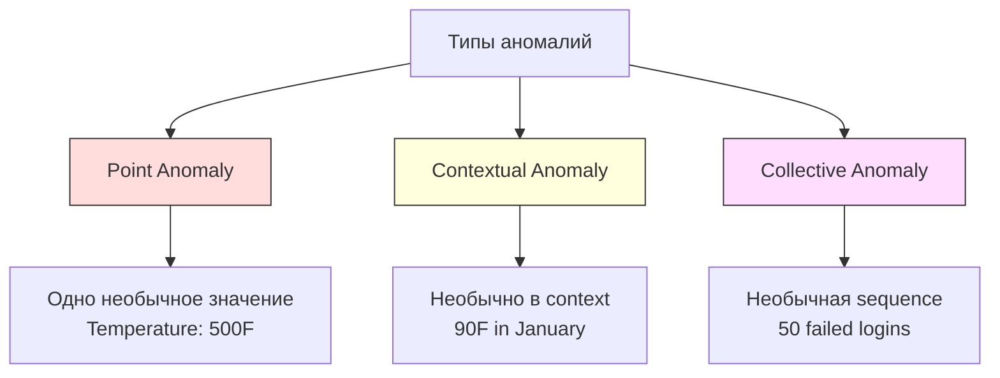
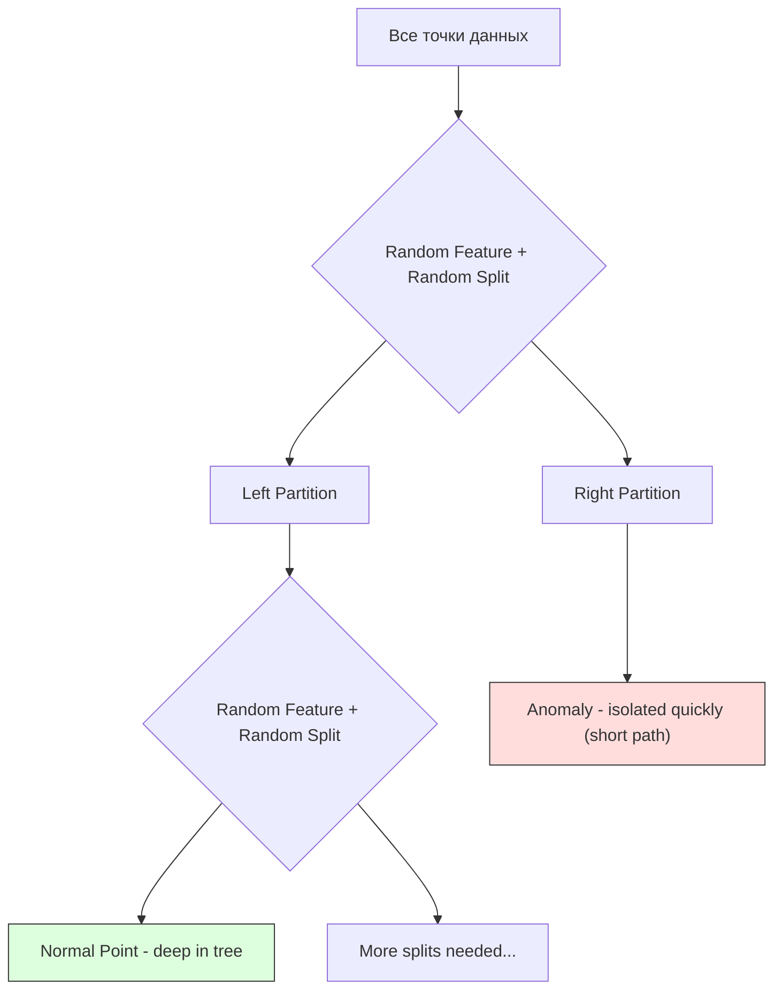
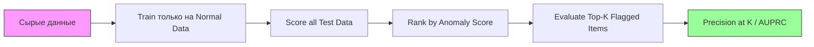

# Обнаружение аномалий

> Норму легко определить. Ненормальное — все, что в нее не вписывается.

**Тип:** Практика
**Язык:** Python
**Требования:** Фаза 2, Уроки 01-09
**Время:** ~75 минут

## Цели обучения

- Реализовать методы anomaly detection на основе Z-score, IQR и Isolation Forest с нуля
- Различать point, contextual и collective anomalies и выбирать подходящий detection method для каждого случая
- Объяснить, почему anomaly detection формулируют как моделирование normal data, а не classification anomalies
- Сравнить unsupervised anomaly detection с supervised classification и оценить tradeoff между novel anomaly coverage и precision

## Проблема

Кредитная карта используется в New York в 14:00, затем в Tokyo в 14:05. Заводской sensor показывает 150 degrees при нормальном диапазоне 80-120. Сервер отправляет 50 000 requests per second при daily average 200.

Это anomalies. Их поиск важен. Fraud стоит миллиарды. Equipment failures стоят downtime. Network intrusions стоят data.

Сложность: у вас редко есть labeled examples of anomalies. Fraud составляет 0.1% transactions. Equipment failures случаются несколько раз в год. Нельзя обучить standard classifier, потому что в class "anomaly" почти нечему учиться. Даже если метки есть, уже виденные anomalies — не все типы, которые встретятся. Завтрашняя схема fraud будет отличаться от сегодняшней.

Anomaly detection переворачивает задачу. Вместо того чтобы учить abnormal, учите normal. Все, что отклоняется от normal, подозрительно. Это работает без labels, адаптируется к новым типам anomalies и масштабируется на большие datasets.

## Концепция

### Типы аномалий

Не все anomalies одинаковы:

- **Point anomalies.** Одна точка данных, необычная независимо от context. Temperature reading 500 degrees. Transaction на $50,000 с account, который обычно тратит $50.
- **Contextual anomalies.** Точка данных, необычная с учетом context. Temperature 90 degrees нормальна летом, аномальна зимой. То же значение, другой context.
- **Collective anomalies.** Последовательность точек, необычная как группа, даже если каждая отдельная точка может быть нормальной. Five login failures — нормально. Fifty in a row — brute-force attack.

Большинство методов detects point anomalies. Contextual anomalies требуют time или location features. Collective anomalies требуют sequence-aware methods.



### Unsupervised framing

В standard classification есть labels для обоих классов. В anomaly detection обычно одна из трех ситуаций:

1. **Fully unsupervised.** Labels нет совсем. Вы fit detector на всех data и надеетесь, что anomalies достаточно редки и не портят model "normal".
2. **Semi-supervised.** Есть clean dataset только normal data. Вы fit на этом clean set и score everything else. Это самая сильная setup, когда возможна.
3. **Weakly supervised.** Есть несколько labeled anomalies. Используйте их для evaluation, не для training. Train unsupervised, затем измеряйте precision/recall на labeled subset.

Ключевая идея: anomaly detection фундаментально отличается от classification. Вы моделируете distribution normal data, а не decision boundary между двумя classes.

### Supervised vs Unsupervised: tradeoff

Если labeled anomalies есть, использовать ли их для training (supervised classification) или только для evaluation (unsupervised detection)?

**Supervised (как classification):**
- Ловит exact types anomalies, которые уже видели
- Higher precision на known anomaly types
- Полностью пропускает novel anomaly types
- Требует retraining при появлении новых anomaly types
- Нужны достаточно anomaly examples (часто их слишком мало)

**Unsupervised (model normal, flag deviations):**
- Ловит любые deviations from normal, включая novel types
- Не требует labeled anomalies
- Higher false positive rate (не все unusual — плохое)
- Более robust to distribution shift

На практике лучшие системы комбинируют оба подхода: unsupervised detection для broad coverage, supervised models для known high-priority anomaly types и human review для ambiguous cases.

### Z-Score Method

Самый простой подход. Вычислить mean и standard deviation каждого feature. Пометить любую точку дальше k standard deviations от mean.

```text
z_score = (x - mean) / std
anomaly if |z_score| > threshold
```

Default threshold — 3.0 (99.7% normal data лежит в пределах 3 standard deviations для Gaussian distribution).

**Сильные стороны:** просто. Быстро. Интерпретируемо («это значение на 4.5 standard deviations от normal»).

**Слабости:** предполагает normal distribution. Чувствителен к outliers в training data (outliers сдвигают mean и раздувают std, из-за чего их труднее обнаружить). Ломается на multimodal distributions.

**Когда хорошо работает:** single-feature monitoring с roughly bell-shaped data. Server response times, manufacturing tolerances, sensor readings со stable baselines.

**Когда fails:** multi-cluster data (два office locations с разными baseline temperatures), skewed data (transaction amounts, где $1000 редко, но не anomalous), data с outliers в training set.

### IQR Method

Более robust, чем Z-score. Использует interquartile range вместо mean и standard deviation.

```
Q1 = 25th percentile
Q3 = 75th percentile
IQR = Q3 - Q1
lower_bound = Q1 - factor * IQR
upper_bound = Q3 + factor * IQR
anomaly if x < lower_bound or x > upper_bound
```

Default factor — 1.5.

**Сильные стороны:** robust to outliers (percentiles не affected by extreme values). Работает на skewed distributions. Нет normality assumption.

**Слабости:** только univariate (применяется независимо по feature). Не может обнаружить anomalies, необычные только при совместном рассмотрении features (точка может быть normal по каждому feature отдельно, но anomalous в joint space).

**Практическая заметка:** factor 1.5 в IQR соответствует whiskers в box plot. Points outside whiskers — potential outliers. Использование 3.0 вместо 1.5 делает detector более conservative (меньше flags, меньше false positives). Правильный factor зависит от tolerance for false alarms.

### Isolation Forest

Ключевая идея: anomalies немногочисленны и отличаются. При random partitioning данных anomalies легче изолировать: им нужно меньше random splits, чтобы отделиться от остальных.



**Как работает:**
1. Построить много random trees (isolation forest)
2. В каждом node выбрать random feature и random split value между min и max этого feature
3. Делить, пока каждая точка не изолирована (в своем leaf)
4. Anomalies имеют shorter average path lengths по всем trees

**Почему работает:** normal points живут в dense regions. Нужно много random splits, чтобы изолировать одну от соседей. Anomalies живут в sparse regions. Одного-двух random splits достаточно.

Anomaly score основан на average path length across all trees, normalized by expected path length of random binary search tree:

```
score(x) = 2^(-average_path_length(x) / c(n))
```

Где `c(n)` — expected path length для n samples. Score near 1 означает anomaly. Score near 0.5 — normal. Score near 0 — very normal (deep in dense clusters).

**Сильные стороны:** нет distribution assumptions. Работает в high dimensions. Хорошо масштабируется (sublinear in sample size, because each tree uses a subsample). Работает со mixed feature types.

**Слабости:** плохо справляется с anomalies in dense regions (masking effect). Random splitting менее эффективен, когда много irrelevant features.

**Ключевые гиперпараметры:**
- `n_estimators`: число trees. 100 обычно достаточно. Больше trees дают стабильнее scores, но медленнее.
- `max_samples`: число samples per tree. 256 — default из оригинальной статьи. Меньшие values делают отдельные trees менее accurate, но увеличивают diversity. Subsampling делает Isolation Forest быстрым: each tree sees small fraction of data.
- `contamination`: expected fraction anomalies. Используется только для threshold. Не влияет на scores themselves.

### Local Outlier Factor (LOF)

LOF сравнивает local density вокруг point с density вокруг ее neighbors. Точка в sparse region, окруженная dense regions, anomalous.

**Как работает:**
1. Для каждой point найти k nearest neighbors
2. Вычислить local reachability density (насколько плотная neighborhood)
3. Сравнить density точки с densities ее neighbors
4. Если у точки density намного ниже, чем у neighbors, это outlier

**LOF score:**
- LOF close to 1.0 означает похожую density as neighbors (normal)
- LOF greater than 1.0 означает lower density than neighbors (potentially anomalous)
- LOF much greater than 1.0 (например, 2.0+) означает значительно lower density (likely anomaly)

Слово "local" критично. Представьте dataset с двумя clusters: dense cluster из 1000 points и sparse cluster из 50 points. Точка на краю sparse cluster не globally unusual — у нее есть 50 neighbors. Но она locally unusual, если ее immediate neighbors плотнее, чем она. LOF ловит nuance, который global methods пропускают.

**Сильные стороны:** detects local anomalies (points unusual in their neighborhood, even if not globally unusual). Работает на clusters of different densities.

**Слабости:** медленный на large datasets (O(n^2) для naive implementation). Чувствителен к выбору k. Плохо работает в very high dimensions (curse of dimensionality affects distance calculations).

### Сравнение

| Метод | Assumptions | Speed | Handles High Dims | Detects Local Anomalies |
|-------|-------------|-------|-------------------|-------------------------|
| Z-score | Normal distribution | Очень быстрый | Yes (per feature) | No |
| IQR | None (per feature) | Очень быстрый | Yes (per feature) | No |
| Isolation Forest | None | Fast | Yes | Partially |
| LOF | Distance is meaningful | Slow | Poorly | Yes |

### Сложности оценки

Оценивать anomaly detectors труднее, чем classifiers:

- **Extreme class imbalance.** При 0.1% anomalies предсказание "normal" для всего дает 99.9% accuracy. Accuracy бесполезна.
- **AUROC misleading.** При сильном imbalance AUROC может выглядеть хорошо, даже если model пропускает большинство anomalies при practical thresholds.
- **Лучшие метрики:** Precision@k (сколько real anomalies среди top k flagged items), AUPRC (area under precision-recall curve) и recall при fixed false positive rate.



### Anomaly Detection Pipeline

На практике anomaly detection идет так:

1. **Collect baseline data.** Идеально — период, где вы знаете, что нет (или очень мало) anomalies.
2. **Feature engineering.** Raw features плюс derived features (rolling statistics, time features, ratios).
3. **Train the detector.** Fit на baseline data. Model learns what "normal" looks like.
4. **Score new data.** Каждое new observation получает anomaly score.
5. **Threshold selection.** Выбрать score cutoff. Это business decision: higher threshold means fewer false alarms but more missed anomalies.
6. **Alert and investigate.** Flagged points идут на human review или automated response.
7. **Feedback collection.** Записывайте, были ли flagged items true anomalies или false alarms. Используйте эти data для evaluation detector и tuning threshold over time.

Pipeline никогда не «готов». Data distributions shift, появляются new anomaly types, thresholds требуют adjustment. Anomaly detection — living system, а не one-time model.

## Соберите это

Код в `code/anomaly_detection.py` реализует Z-score, IQR и Isolation Forest с нуля.

### Z-Score Detector

```python
def zscore_detect(X, threshold=3.0):
    mean = X.mean(axis=0)
    std = X.std(axis=0)
    std[std == 0] = 1.0
    z = np.abs((X - mean) / std)
    return z.max(axis=1) > threshold
```

Простой и vectorized. Помечает точку, если любой feature превышает threshold.

### IQR Detector

```python
def iqr_detect(X, factor=1.5):
    q1 = np.percentile(X, 25, axis=0)
    q3 = np.percentile(X, 75, axis=0)
    iqr = q3 - q1
    iqr[iqr == 0] = 1.0
    lower = q1 - factor * iqr
    upper = q3 + factor * iqr
    outside = (X < lower) | (X > upper)
    return outside.any(axis=1)
```

### Isolation Forest с нуля

Реализация строит isolation trees, которые randomly partition feature space:

```python
class IsolationTree:
    def __init__(self, max_depth):
        self.max_depth = max_depth

    def fit(self, X, depth=0):
        n, p = X.shape
        if depth >= self.max_depth or n <= 1:
            self.is_leaf = True
            self.size = n
            return self
        self.is_leaf = False
        self.feature = np.random.randint(p)
        x_min = X[:, self.feature].min()
        x_max = X[:, self.feature].max()
        if x_min == x_max:
            self.is_leaf = True
            self.size = n
            return self
        self.threshold = np.random.uniform(x_min, x_max)
        left_mask = X[:, self.feature] < self.threshold
        self.left = IsolationTree(self.max_depth).fit(X[left_mask], depth + 1)
        self.right = IsolationTree(self.max_depth).fit(X[~left_mask], depth + 1)
        return self
```

Path length, нужная для isolation point, определяет anomaly score. Shorter paths mean more anomalous.

Класс `IsolationForest` оборачивает multiple trees:

```python
class IsolationForest:
    def __init__(self, n_estimators=100, max_samples=256, seed=42):
        self.n_estimators = n_estimators
        self.max_samples = max_samples

    def fit(self, X):
        sample_size = min(self.max_samples, X.shape[0])
        max_depth = int(np.ceil(np.log2(sample_size)))
        for _ in range(self.n_estimators):
            idx = rng.choice(X.shape[0], size=sample_size, replace=False)
            tree = IsolationTree(max_depth=max_depth)
            tree.fit(X[idx])
            self.trees.append(tree)

    def anomaly_score(self, X):
        avg_path = average path length across all trees
        scores = 2.0 ** (-avg_path / c(max_samples))
        return scores
```

Normalization factor `c(n)` — expected path length unsuccessful search в binary search tree с n elements. Он равен `2 * H(n-1) - 2*(n-1)/n`, где `H` — harmonic number. Эта normalization делает scores comparable across datasets of different sizes.

### Demo Scenarios

Код генерирует несколько test scenarios:

1. **Single cluster with outliers.** 2D Gaussian cluster с anomalies far from center. Все методы должны работать.
2. **Multimodal data.** Три clusters разных sizes и densities. Points between clusters anomalous. Z-score struggles, потому что per-feature ranges широкие.
3. **High-dimensional data.** 50 features, но anomalies отличаются только в 5. Проверяет, могут ли методы найти anomalies в subset of features.

Каждое demo сравнивает методы через precision, recall, F1 и Precision@k.

## Используйте это

Со sklearn (library implementations, не from-scratch):

```python
from sklearn.ensemble import IsolationForest
from sklearn.neighbors import LocalOutlierFactor

iso = IsolationForest(n_estimators=100, contamination=0.05, random_state=42)
iso.fit(X_train)
predictions = iso.predict(X_test)

lof = LocalOutlierFactor(n_neighbors=20, contamination=0.05, novelty=True)
lof.fit(X_train)
predictions = lof.predict(X_test)
```

Заметьте: `contamination` задает expected fraction of anomalies. Правильная настройка важна: слишком низко — missed anomalies, слишком высоко — false alarms.

Код в `anomaly_detection.py` сравнивает implementations from scratch со sklearn на тех же data.

### sklearn Contamination Parameter

Параметр `contamination` в sklearn определяет threshold для преобразования continuous anomaly scores в binary predictions. Он не меняет underlying scores.

```python
iso_5 = IsolationForest(contamination=0.05)
iso_10 = IsolationForest(contamination=0.10)
```

Оба дадут одинаковые anomaly scores. Но `iso_5` пометит top 5%, а `iso_10` — top 10%. Если вы не знаете true anomaly rate (обычно не знаете), задайте contamination="auto" и работайте напрямую с raw scores. Задайте собственный threshold на основе cost tradeoff between false positives and false negatives.

### One-Class SVM

Еще один unsupervised anomaly detector, который стоит знать. One-Class SVM fitting boundary around normal data в high-dimensional feature space (через kernel trick).

```python
from sklearn.svm import OneClassSVM

oc_svm = OneClassSVM(kernel="rbf", gamma="auto", nu=0.05)
oc_svm.fit(X_train)
predictions = oc_svm.predict(X_test)
```

Параметр `nu` приблизительно задает fraction of anomalies. One-Class SVM хорошо работает на small to medium datasets, но не масштабируется на very large data (kernel matrix grows quadratically).

### Autoencoder Approach (Preview)

Autoencoders — neural networks, которые учатся compress и reconstruct data. Train on normal data. At test time anomalies имеют high reconstruction error, потому что network выучила reconstruct только normal patterns.

Это покрывается в Фазе 3 (Deep Learning), но принцип тот же: model what is normal, flag what deviates.

### Ensemble Anomaly Detection

Как ensemble methods улучшают classification (Урок 11), комбинация multiple anomaly detectors улучшает detection. Самый простой подход:

1. Запустить multiple detectors (Z-score, IQR, Isolation Forest, LOF)
2. Normalize scores каждого detector в [0, 1]
3. Average normalized scores
4. Flag points above threshold on average score

Это снижает false positives, потому что у разных методов разные failure modes. Point, flagged by all four methods, почти наверняка anomalous. Point, flagged only by one, может быть quirks конкретного метода.

Более sophisticated ensembles взвешивают каждый detector по estimated reliability (измеренной на validation set with known anomalies, если доступна).

### Production Considerations

1. **Threshold drift.** Когда data distribution shifts, fixed threshold устаревает. Monitor distribution anomaly scores и adjust periodically.
2. **Alert fatigue.** Слишком много false alarms, и operators перестают обращать внимание. Начните с high threshold (меньше, но надежнее alerts), снижайте его по мере роста trust.
3. **Ensemble approach.** В production комбинируйте multiple detectors. Flag point только если multiple methods согласны, что она anomalous. Это значительно снижает false positives.
4. **Feature engineering.** Raw features редко достаточно. Добавьте rolling statistics, ratios, time-since-last-event и domain-specific features. Хороший feature set важнее выбора detector.
5. **Feedback loop.** Когда operators investigate flagged items и confirm/dismiss them, возвращайте это в систему. Накопите labeled data со временем, чтобы evaluate and improve detector.

## Доведите до результата

Этот урок создает:
- `outputs/skill-anomaly-detector.md` — decision skill для выбора правильного detector
- `code/anomaly_detection.py` — Z-score, IQR и Isolation Forest с нуля со сравнением sklearn

### Выбор threshold

Anomaly score непрерывен. Нужен threshold для binary decisions. Это business decision, а не purely technical.

Два сценария:
- **Fraud detection.** Missed fraud дорог (chargebacks, customer trust). False alarms стоят 5 минут human analyst. Set threshold low, чтобы поймать больше fraud, accept more false alarms.
- **Equipment maintenance.** False alarm означает unnecessary shutdown за $50,000. Missed failure означает repair за $500,000. Set threshold to balance these costs.

В обоих случаях optimal threshold зависит от cost ratio between false positives and false negatives. Постройте precision и recall при разных thresholds, наложите cost function и выберите minimum-cost point.

### Scaling to Production

Для real-time anomaly detection в production:

1. **Batch training, online scoring.** Train model periodically (daily, weekly) на recent normal data. Score каждое new observation as it arrives.
2. **Feature computation must match.** Если training использовал rolling statistics over 30 days, нужны 30 days history, чтобы compute features для new observation. Buffer required history.
3. **Score distribution monitoring.** Track distribution anomaly scores over time. Если median score drifts upward, либо data меняется, либо model stale.
4. **Explainability.** Когда flag anomaly, объясните почему. Z-score: "Feature X is 4.2 standard deviations above normal." Isolation Forest: "This point was isolated in 3.1 splits on average (normal points take 8.5)."

## Упражнения

1. **Threshold tuning.** Запустите Z-score detector с thresholds от 1.0 до 5.0 с шагом 0.5. Постройте precision и recall для каждого threshold. Где sweet spot для ваших data?

2. **Multivariate anomalies.** Создайте 2D data, где каждый feature по отдельности выглядит normal, но combination anomalous (например, points far from main cluster diagonal). Покажите, что per-feature Z-score их пропускает, а Isolation Forest ловит.

3. **LOF from scratch.** Реализуйте Local Outlier Factor через k-nearest neighbors. Сравните со sklearn LocalOutlierFactor на тех же data. Используйте k=10 и k=50 — как choice k влияет на results?

4. **Streaming anomaly detection.** Измените Z-score detector, чтобы он работал в streaming setting: обновлял running mean и variance при поступлении новых points (Welford's online algorithm). Сравните с batch Z-score на тех же data.

5. **Real-world evaluation.** Возьмите dataset с known anomalies (например, credit card fraud from Kaggle). Оцените все четыре метода через precision@100, precision@500 и AUPRC. Какой метод работает лучше? Почему?

## Ключевые термины

| Термин | Как говорят | Что это на самом деле значит |
|--------|-------------|------------------------------|
| Anomaly | «Outlier, unusual point» | Точка данных, значительно отклоняющаяся от expected pattern normal data |
| Point anomaly | «Одно странное значение» | Отдельное observation, необычное независимо от context |
| Contextual anomaly | «Normal value, wrong context» | Observation, необычное в своем context (time, location, etc.), но возможно normal в другом context |
| Isolation Forest | «Random splits to find outliers» | Ensemble random trees, изолирующий anomalies меньшим числом splits, чем normal points |
| Local Outlier Factor | «Compare density to neighbors» | Метод, помечающий points, чья local density намного ниже density neighbors |
| Z-score | «Standard deviations from mean» | (x - mean) / std, измеряет расстояние точки от center в units of standard deviation |
| IQR | «Interquartile range» | Q3 - Q1, spread middle 50% data, используется для robust outlier detection |
| Contamination | «Expected fraction of anomalies» | Гиперпараметр, сообщающий detector, какую долю данных flag as anomalous |
| Precision@k | «Среди top k flags сколько real» | Precision, посчитанная только на k most suspicious points; полезна для imbalanced anomaly detection |
| AUPRC | «Area under precision-recall curve» | Метрика, summarizing precision-recall performance across thresholds; лучше AUROC для imbalanced data |

## Дополнительное чтение

- [Liu et al., Isolation Forest (2008)](https://cs.nju.edu.cn/zhouzh/zhouzh.files/publication/icdm08b.pdf) — оригинальная статья об Isolation Forest
- [Breunig et al., LOF: Identifying Density-Based Local Outliers (2000)](https://dl.acm.org/doi/10.1145/342009.335388) — оригинальная статья о LOF
- [scikit-learn Outlier Detection docs](https://scikit-learn.org/stable/modules/outlier_detection.html) — обзор всех sklearn anomaly detectors
- [Chandola et al., Anomaly Detection: A Survey (2009)](https://dl.acm.org/doi/10.1145/1541880.1541882) — comprehensive survey методов anomaly detection
- [Goldstein and Uchida, A Comparative Evaluation of Unsupervised Anomaly Detection Algorithms (2016)](https://journals.plos.org/plosone/article?id=10.1371/journal.pone.0152173) — empirical comparison 10 methods на real datasets
