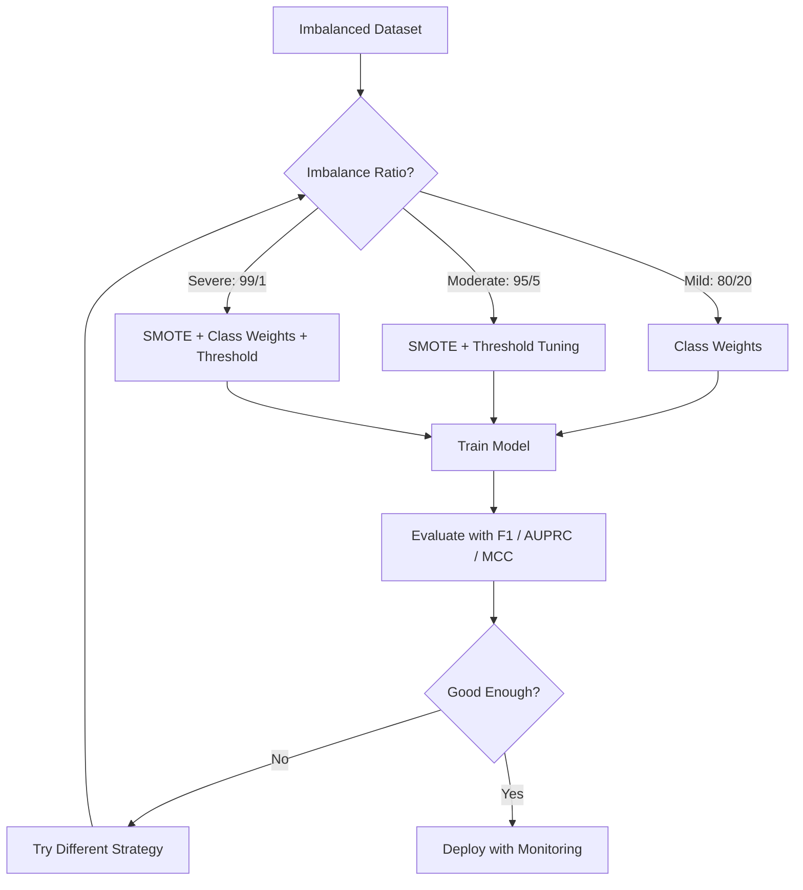
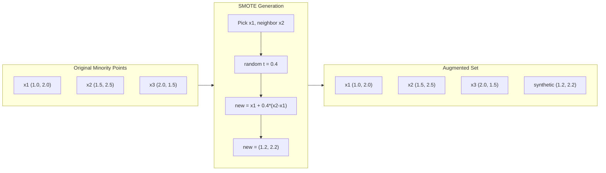
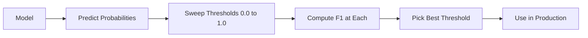
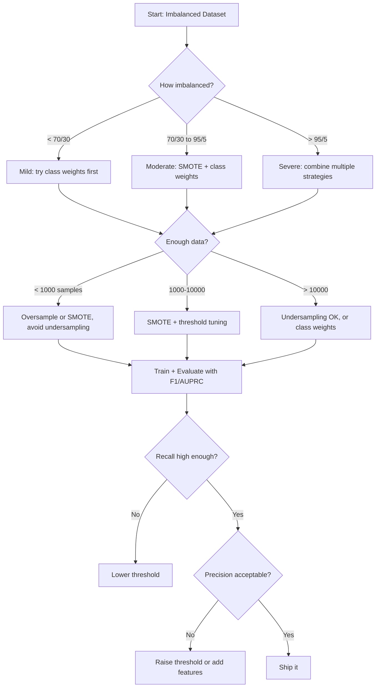

# Работа с несбалансированными данными

> Когда 99% ваших данных — «норма», accuracy лжет.

**Тип:** Практика
**Язык:** Python
**Требования:** Фаза 2, Уроки 01-09 (особенно метрики оценки)
**Время:** ~90 минут

## Цели обучения

- Реализовать SMOTE с нуля и объяснить, чем synthetic oversampling отличается от random duplication
- Оценивать классификаторы на несбалансированных данных через F1, AUPRC и Matthews Correlation Coefficient вместо accuracy
- Сравнить class weighting, threshold tuning и стратегии resampling и выбрать подход для заданного imbalance ratio
- Построить полный pipeline для несбалансированных данных, объединяющий SMOTE, class weights и threshold optimization

## Проблема

Вы строите модель обнаружения мошенничества. Она получает 99.9% accuracy. Вы празднуете. Затем понимаете, что она предсказывает "not fraud" для каждой транзакции.

Это не bug. Это рациональное поведение, когда только 0.1% транзакций мошеннические. Модель выучивает, что постоянный выбор majority class минимизирует общую ошибку. Технически корректно и совершенно бесполезно.

Так происходит везде, где реальная классификация важна. Диагностика болезней: 1% positive rate. Сетевые вторжения: 0.01% атак. Производственные дефекты: 0.5% брака. Фильтрация спама: 20% спама. Прогноз оттока: 5% churners. Чем значимее minority class, тем реже он обычно встречается.

Accuracy fails, потому что одинаково относится ко всем правильным предсказаниям. Правильная классификация legitimate transaction и правильное обнаружение fraud оба дают один пункт accuracy. Но обнаружение fraud — вся причина существования модели. Нужны метрики, техники и стратегии обучения, которые заставляют модель обращать внимание на редкий, но важный класс.

## Концепция

### Почему accuracy не работает

Рассмотрим dataset из 1000 объектов: 990 negative, 10 positive. Модель, всегда предсказывающая negative:

|  | Предсказан Positive | Предсказан Negative |
|--|---|---|
| Фактически Positive | 0 (TP) | 10 (FN) |
| Фактически Negative | 0 (FP) | 990 (TN) |

Accuracy = (0 + 990) / 1000 = 99.0%

Модель ловит ноль fraud. Ноль болезней. Ноль дефектов. Но accuracy говорит 99%. Поэтому accuracy опасна для imbalanced problems.

### Лучшие метрики

**Precision** = TP / (TP + FP). Среди всего, что помечено как positive, сколько действительно positive? High precision значит мало false alarms.

**Recall** = TP / (TP + FN). Сколько из всех actually positive мы поймали? High recall значит мало missed positives.

**F1 Score** = 2 * precision * recall / (precision + recall). Гармоническое среднее. Штрафует extreme imbalance между precision и recall сильнее, чем arithmetic mean.

**F-beta Score** = (1 + beta^2) * precision * recall / (beta^2 * precision + recall). При beta > 1 важнее recall. При beta < 1 важнее precision. F2 часто используется в fraud detection (пропущенное мошенничество хуже false alarm).

**AUPRC** (Area Under Precision-Recall Curve). Как AUC-ROC, но информативнее для imbalanced data. Random classifier имеет AUPRC, равную доле positive class (а не 0.5, как ROC). Поэтому улучшения легче заметить.

**Matthews Correlation Coefficient** = (TP * TN - FP * FN) / sqrt((TP+FP)(TP+FN)(TN+FP)(TN+FN)). Диапазон от -1 до +1. Дает высокий score только когда модель хорошо работает на обоих классах. Сбалансирован даже при сильно разных размерах классов.

Для модели "always predict negative" выше: precision = 0/0 (undefined, часто set to 0), recall = 0/10 = 0, F1 = 0, MCC = 0. Эти метрики правильно определяют модель как бесполезную.

### Pipeline для несбалансированных данных



### SMOTE: Synthetic Minority Oversampling Technique

Random oversampling дублирует существующие minority samples. Это работает, но создает риск overfitting, потому что модель многократно видит идентичные точки.

SMOTE создает новые synthetic minority samples, которые правдоподобны, но не являются копиями. Алгоритм:

1. Для каждого minority sample x найти k nearest neighbors среди других minority samples
2. Случайно выбрать одного neighbor
3. Создать new sample на отрезке между x и этим neighbor

Формула: `new_sample = x + random(0, 1) * (neighbor - x)`

Это интерполирует между реальными minority points, создавая samples в той же области пространства признаков без простого копирования.



### Сравнение sampling strategies

**Random Oversampling**: дублировать minority samples до числа объектов majority class.
- Плюсы: просто, нет потери информации
- Минусы: точные дубликаты вызывают overfitting, время обучения растет

**Random Undersampling**: удалить majority samples до числа объектов minority class.
- Плюсы: быстрое обучение, простота
- Минусы: выбрасывает потенциально полезные majority data, выше variance

**SMOTE**: создать synthetic minority samples через интерполяцию.
- Плюсы: генерирует новые точки данных, снижает overfitting по сравнению с random oversampling
- Минусы: может создавать шумовые samples рядом с decision boundary, не учитывает распределение majority class

| Стратегия | Как меняются данные | Риск | Когда использовать |
|----------|--------------|------|-------------|
| Oversample | Minority дублируется | Overfitting | Малые наборы данных, умеренный imbalance |
| Undersample | Majority удаляется | Потеря информации | Большие наборы данных, нужно быстрое обучение |
| SMOTE | Добавляется synthetic minority | Шум на границе | Умеренный imbalance, достаточно minority samples для k-NN |

### Class Weights

Вместо изменения данных измените то, как модель обрабатывает ошибки. Назначьте больший вес ошибочной классификации minority class.

Для binary problem с 950 negative и 50 positive samples:
- Вес negative class = n_samples / (2 * n_negative) = 1000 / (2 * 950) = 0.526
- Вес positive class = n_samples / (2 * n_positive) = 1000 / (2 * 50) = 10.0

Positive class получает вес в 19x больше. Ошибка на одном positive sample стоит столько же, сколько ошибка на 19 negative samples. Модель вынуждена обращать внимание на minority class.

В logistic regression это меняет loss function:

```
weighted_loss = -sum(w_i * [y_i * log(p_i) + (1-y_i) * log(1-p_i)])
```

где w_i зависит от класса sample i.

Class weights математически equivalent to oversampling in expectation, но без создания новых точек данных. Поэтому они быстрее и избегают риска overfitting на duplicated samples.

### Threshold Tuning

Большинство classifiers выдают probability. Default threshold — 0.5: если P(positive) >= 0.5, predict positive. Но 0.5 произволен. При imbalanced classes optimal threshold обычно намного ниже.

Процесс:
1. Обучить модель
2. Получить predicted probabilities на validation set
3. Перебрать thresholds от 0.0 до 1.0
4. Вычислить F1 (или выбранную metric) на каждом threshold
5. Выбрать threshold, максимизирующий metric



Модель может выдать P(fraud) = 0.15 для fraudulent transaction. При threshold 0.5 это classified as not fraud. При threshold 0.10 fraud caught correctly. Probability calibration менее важна, чем ranking: пока fraud получает probabilities выше, чем non-fraud, существует threshold, который их разделит.

### Cost-Sensitive Learning

Обобщение class weights. Вместо одинаковых costs назначьте конкретные misclassification costs:

| | Предсказать Positive | Предсказать Negative |
|--|---|---|
| Фактически Positive | 0 (correct) | C_FN = 100 |
| Фактически Negative | C_FP = 1 | 0 (correct) |

Пропущенная fraudulent transaction (FN) стоит в 100 раз больше, чем false alarm (FP). Модель оптимизирует суммарную стоимость, а не общее число ошибок.

Это самый принципиальный подход, когда можно оценить реальные costs. Пропущенный диагноз рака имеет совсем другую стоимость, чем false alarm, leading to extra biopsy. Явное задание costs заставляет делать правильные tradeoffs.

### Блок-схема принятия решений



## Соберите это

### Шаг 1: сгенерировать несбалансированный dataset

```python
import numpy as np


def make_imbalanced_data(n_majority=950, n_minority=50, seed=42):
    rng = np.random.RandomState(seed)

    X_maj = rng.randn(n_majority, 2) * 1.0 + np.array([0.0, 0.0])
    X_min = rng.randn(n_minority, 2) * 0.8 + np.array([2.5, 2.5])

    X = np.vstack([X_maj, X_min])
    y = np.concatenate([np.zeros(n_majority), np.ones(n_minority)])

    shuffle_idx = rng.permutation(len(y))
    return X[shuffle_idx], y[shuffle_idx]
```

### Шаг 2: SMOTE с нуля

```python
def euclidean_distance(a, b):
    return np.sqrt(np.sum((a - b) ** 2))


def find_k_neighbors(X, idx, k):
    distances = []
    for i in range(len(X)):
        if i == idx:
            continue
        d = euclidean_distance(X[idx], X[i])
        distances.append((i, d))
    distances.sort(key=lambda x: x[1])
    return [d[0] for d in distances[:k]]


def smote(X_minority, k=5, n_synthetic=100, seed=42):
    rng = np.random.RandomState(seed)
    n_samples = len(X_minority)
    k = min(k, n_samples - 1)
    synthetic = []

    for _ in range(n_synthetic):
        idx = rng.randint(0, n_samples)
        neighbors = find_k_neighbors(X_minority, idx, k)
        neighbor_idx = neighbors[rng.randint(0, len(neighbors))]
        t = rng.random()
        new_point = X_minority[idx] + t * (X_minority[neighbor_idx] - X_minority[idx])
        synthetic.append(new_point)

    return np.array(synthetic)
```

### Шаг 3: Random oversampling и undersampling

```python
def random_oversample(X, y, seed=42):
    rng = np.random.RandomState(seed)
    classes, counts = np.unique(y, return_counts=True)
    max_count = counts.max()

    X_resampled = list(X)
    y_resampled = list(y)

    for cls, count in zip(classes, counts):
        if count < max_count:
            cls_indices = np.where(y == cls)[0]
            n_needed = max_count - count
            chosen = rng.choice(cls_indices, size=n_needed, replace=True)
            X_resampled.extend(X[chosen])
            y_resampled.extend(y[chosen])

    X_out = np.array(X_resampled)
    y_out = np.array(y_resampled)
    shuffle = rng.permutation(len(y_out))
    return X_out[shuffle], y_out[shuffle]


def random_undersample(X, y, seed=42):
    rng = np.random.RandomState(seed)
    classes, counts = np.unique(y, return_counts=True)
    min_count = counts.min()

    X_resampled = []
    y_resampled = []

    for cls in classes:
        cls_indices = np.where(y == cls)[0]
        chosen = rng.choice(cls_indices, size=min_count, replace=False)
        X_resampled.extend(X[chosen])
        y_resampled.extend(y[chosen])

    X_out = np.array(X_resampled)
    y_out = np.array(y_resampled)
    shuffle = rng.permutation(len(y_out))
    return X_out[shuffle], y_out[shuffle]
```

### Шаг 4: логистическая регрессия с class weights

```python
def sigmoid(z):
    return 1.0 / (1.0 + np.exp(-np.clip(z, -500, 500)))


def logistic_regression_weighted(X, y, weights, lr=0.01, epochs=200):
    n_samples, n_features = X.shape
    w = np.zeros(n_features)
    b = 0.0

    for _ in range(epochs):
        z = X @ w + b
        pred = sigmoid(z)
        error = pred - y
        weighted_error = error * weights

        gradient_w = (X.T @ weighted_error) / n_samples
        gradient_b = np.mean(weighted_error)

        w -= lr * gradient_w
        b -= lr * gradient_b

    return w, b


def compute_class_weights(y):
    classes, counts = np.unique(y, return_counts=True)
    n_samples = len(y)
    n_classes = len(classes)
    weight_map = {}
    for cls, count in zip(classes, counts):
        weight_map[cls] = n_samples / (n_classes * count)
    return np.array([weight_map[yi] for yi in y])
```

### Шаг 5: Threshold tuning

```python
def find_optimal_threshold(y_true, y_probs, metric="f1"):
    best_threshold = 0.5
    best_score = -1.0

    for threshold in np.arange(0.05, 0.96, 0.01):
        y_pred = (y_probs >= threshold).astype(int)
        tp = np.sum((y_pred == 1) & (y_true == 1))
        fp = np.sum((y_pred == 1) & (y_true == 0))
        fn = np.sum((y_pred == 0) & (y_true == 1))

        if metric == "f1":
            precision = tp / (tp + fp) if (tp + fp) > 0 else 0.0
            recall = tp / (tp + fn) if (tp + fn) > 0 else 0.0
            score = 2 * precision * recall / (precision + recall) if (precision + recall) > 0 else 0.0
        elif metric == "recall":
            score = tp / (tp + fn) if (tp + fn) > 0 else 0.0
        elif metric == "precision":
            score = tp / (tp + fp) if (tp + fp) > 0 else 0.0

        if score > best_score:
            best_score = score
            best_threshold = threshold

    return best_threshold, best_score
```

### Шаг 6: функции оценки

```python
def confusion_matrix_values(y_true, y_pred):
    tp = np.sum((y_pred == 1) & (y_true == 1))
    tn = np.sum((y_pred == 0) & (y_true == 0))
    fp = np.sum((y_pred == 1) & (y_true == 0))
    fn = np.sum((y_pred == 0) & (y_true == 1))
    return tp, tn, fp, fn


def compute_metrics(y_true, y_pred):
    tp, tn, fp, fn = confusion_matrix_values(y_true, y_pred)
    accuracy = (tp + tn) / (tp + tn + fp + fn)
    precision = tp / (tp + fp) if (tp + fp) > 0 else 0.0
    recall = tp / (tp + fn) if (tp + fn) > 0 else 0.0
    f1 = 2 * precision * recall / (precision + recall) if (precision + recall) > 0 else 0.0

    denom = np.sqrt(float((tp + fp) * (tp + fn) * (tn + fp) * (tn + fn)))
    mcc = (tp * tn - fp * fn) / denom if denom > 0 else 0.0

    return {
        "accuracy": accuracy,
        "precision": precision,
        "recall": recall,
        "f1": f1,
        "mcc": mcc,
    }
```

### Шаг 7: сравнить все подходы

```python
X, y = make_imbalanced_data(950, 50, seed=42)
split = int(0.8 * len(y))
X_train, X_test = X[:split], X[split:]
y_train, y_test = y[:split], y[split:]

# Baseline: no treatment
w_base, b_base = logistic_regression_weighted(
    X_train, y_train, np.ones(len(y_train)), lr=0.1, epochs=300
)
probs_base = sigmoid(X_test @ w_base + b_base)
preds_base = (probs_base >= 0.5).astype(int)

# Oversampled
X_over, y_over = random_oversample(X_train, y_train)
w_over, b_over = logistic_regression_weighted(
    X_over, y_over, np.ones(len(y_over)), lr=0.1, epochs=300
)
preds_over = (sigmoid(X_test @ w_over + b_over) >= 0.5).astype(int)

# SMOTE
minority_mask = y_train == 1
X_minority = X_train[minority_mask]
synthetic = smote(X_minority, k=5, n_synthetic=len(y_train) - 2 * int(minority_mask.sum()))
X_smote = np.vstack([X_train, synthetic])
y_smote = np.concatenate([y_train, np.ones(len(synthetic))])
w_sm, b_sm = logistic_regression_weighted(
    X_smote, y_smote, np.ones(len(y_smote)), lr=0.1, epochs=300
)
preds_smote = (sigmoid(X_test @ w_sm + b_sm) >= 0.5).astype(int)

# Class weights
sample_weights = compute_class_weights(y_train)
w_cw, b_cw = logistic_regression_weighted(
    X_train, y_train, sample_weights, lr=0.1, epochs=300
)
probs_cw = sigmoid(X_test @ w_cw + b_cw)
preds_cw = (probs_cw >= 0.5).astype(int)

# Threshold tuning (tune on held-out validation set, not test set)
probs_val = sigmoid(X_val @ w_cw + b_cw)
best_thresh, best_f1 = find_optimal_threshold(y_val, probs_val, metric="f1")
preds_thresh = (probs_cw >= best_thresh).astype(int)
```

Файл с кодом запускает все это в одном скрипте и печатает результаты.

### Ожидаемый вывод

Запустите `code/imbalanced.py` — последние строки должны быть такими:

```
  No treatment        0.975  1.000  0.643  0.783  0.791
  Oversampling        0.960  0.636  1.000  0.778  0.780
  Undersampling       0.965  0.667  1.000  0.800  0.801
  SMOTE               0.965  0.667  1.000  0.800  0.801
  Class weights       0.960  0.636  1.000  0.778  0.780
  CW + threshold      0.990  0.929  0.929  0.929  0.923

Done.
```

## Используйте это

В scikit-learn и imbalanced-learn эти техники — one-liners:

```python
from sklearn.linear_model import LogisticRegression
from sklearn.metrics import classification_report, f1_score
from sklearn.model_selection import train_test_split
from imblearn.over_sampling import SMOTE
from imblearn.under_sampling import RandomUnderSampler
from imblearn.pipeline import Pipeline

X_train, X_test, y_train, y_test = train_test_split(X, y, stratify=y)

model_weighted = LogisticRegression(class_weight="balanced")
model_weighted.fit(X_train, y_train)
print(classification_report(y_test, model_weighted.predict(X_test)))

smote = SMOTE(random_state=42)
X_resampled, y_resampled = smote.fit_resample(X_train, y_train)
model_smote = LogisticRegression()
model_smote.fit(X_resampled, y_resampled)
print(classification_report(y_test, model_smote.predict(X_test)))

pipeline = Pipeline([
    ("smote", SMOTE()),
    ("model", LogisticRegression(class_weight="balanced")),
])
pipeline.fit(X_train, y_train)
print(classification_report(y_test, pipeline.predict(X_test)))
```

Реализации с нуля показывают, что именно делает каждая техника. SMOTE — это k-NN interpolation на minority class. Class weights умножают loss. Threshold tuning — цикл for по cutoffs. Никакой магии.

## Доведите до результата

Этот урок создает:
- `outputs/skill-imbalanced-data.md` — checklist решений для задач классификации на несбалансированных данных

## Упражнения

1. **Borderline-SMOTE**: измените реализацию SMOTE, чтобы генерировать synthetic samples только для minority points рядом с decision boundary (тех, чьи k-nearest neighbors include majority class samples). Сравните со standard SMOTE на dataset с overlapping classes.

2. **Cost matrix optimization**: реализуйте cost-sensitive learning, где cost matrix — parameter. Создайте функцию, которая принимает cost matrix и возвращает optimal predictions, minimizing expected cost. Протестируйте разные cost ratios (1:10, 1:100, 1:1000) и постройте, как меняется precision-recall tradeoff.

3. **Threshold calibration**: реализуйте Platt scaling (fit logistic regression на raw outputs модели для calibrated probabilities). Сравните precision-recall curve до и после calibration. Покажите, что calibration не меняет ranking (AUC остается тем же), но делает probabilities meaningful.

4. **Ensemble with balanced bagging**: обучите несколько моделей, каждую на balanced bootstrap sample (all minority + random subset of majority). Усредните predictions. Сравните этот подход с single model with SMOTE. Измерьте performance и variance across runs.

5. **Imbalance ratio experiment**: возьмите balanced dataset и постепенно увеличивайте imbalance ratio (50/50, 70/30, 90/10, 95/5, 99/1). Для каждого ratio обучите with and without SMOTE. Постройте F1 vs imbalance ratio для обоих подходов. При каком ratio SMOTE начинает давать meaningful difference?

## Ключевые термины

| Термин | Как говорят | Что это на самом деле значит |
|--------|-------------|------------------------------|
| Class imbalance | «У одного класса намного больше объектов» | Распределение классов в dataset сильно перекошено, из-за чего models favor majority class |
| SMOTE | «Synthetic oversampling» | Создает новые minority samples через interpolation между existing minority samples и их k-nearest minority neighbors |
| Class weights | «Делать ошибки на rare classes дороже» | Умножение функции потерь на class-specific weights, чтобы модель сильнее штрафовала minority misclassification |
| Threshold tuning | «Двигать decision boundary» | Изменение probability cutoff для classification с default 0.5 на value, optimizing desired metric |
| Precision-recall tradeoff | «Нельзя получить оба» | Снижение threshold ловит больше positives (higher recall), но also flags more false positives (lower precision), и наоборот |
| AUPRC | «Area under PR curve» | Сводит precision-recall curve в одно число; информативнее AUC-ROC при сильном class imbalance |
| Matthews Correlation Coefficient | «Balanced metric» | Correlation between predicted and actual labels, дающая высокий score только при хорошем performance на обоих classes |
| Cost-sensitive learning | «Разные ошибки стоят по-разному» | Учет real-world misclassification costs в training objective, чтобы model optimizes total cost, not error count |
| Random oversampling | «Duplicate minority» | Повторение minority class samples для balancing class counts; просто, но есть риск overfitting на duplicated points |

## Дополнительное чтение

- [SMOTE: Synthetic Minority Over-sampling Technique (Chawla et al., 2002)](https://arxiv.org/abs/1106.1813) — оригинальная статья SMOTE, все еще самая цитируемая работа по imbalanced learning
- [Learning from Imbalanced Data (He & Garcia, 2009)](https://ieeexplore.ieee.org/document/5128907) — подробный обзор sampling, cost-sensitive и algorithmic approaches
- [imbalanced-learn documentation](https://imbalanced-learn.org/stable/) — Python-библиотека с SMOTE variants, undersampling strategies и pipeline integration
- [The Precision-Recall Plot Is More Informative than the ROC Plot (Saito & Rehmsmeier, 2015)](https://journals.plos.org/plosone/article?id=10.1371/journal.pone.0118432) — когда и почему выбирать PR curves вместо ROC curves для imbalanced problems
