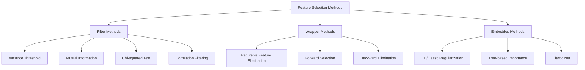
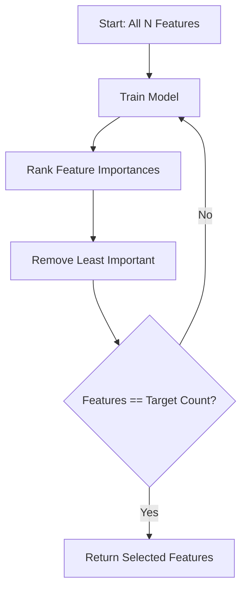
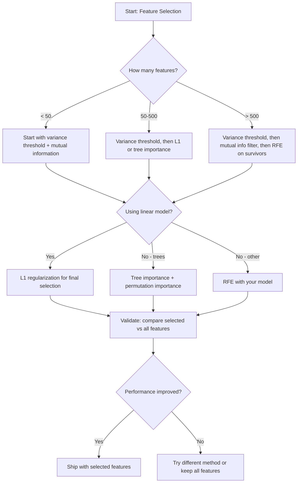

# Отбор признаков

> Больше признаков — не лучше. Лучше — правильные признаки.

**Тип:** Практика
**Язык:** Python
**Требования:** Фаза 2, Уроки 01-09, 08 (feature engineering)
**Время:** ~75 минут

## Цели обучения

- Реализовать методы-фильтры (variance threshold, mutual information, chi-squared) и wrapper-методы (RFE, forward selection) с нуля
- Объяснить, почему mutual information улавливает нелинейные связи между признаками и целевой переменной, которые пропускает correlation
- Сравнить L1 regularization (embedded selection) с RFE (wrapper selection) и оценить вычислительные компромиссы
- Построить pipeline отбора признаков, объединяющий несколько методов, и показать улучшение обобщения на отложенных данных

## Проблема

У вас 500 признаков. Модель обучается медленно, постоянно переобучается, и никто не может объяснить, что она выучила. Вы добавляете больше признаков, надеясь улучшить качество. Становится хуже.

Это проклятие размерности в действии. С ростом числа признаков объем пространства признаков взрывается. Точки данных становятся разреженными. Расстояния между точками сходятся. Модели нужно экспоненциально больше данных, чтобы найти реальные закономерности. Шумовые признаки заглушают сигнальные признаки. Переобучение становится поведением по умолчанию.

Отбор признаков — противоядие. Уберите шум. Удалите избыточность. Оставьте признаки, несущие реальную информацию о целевой переменной. Результат: быстрее обучение, лучше обобщение и модели, которые можно объяснить.

Цель не в использовании всей доступной информации. Цель — использовать правильную информацию.

## Концепция

### Три категории отбора признаков

Каждый метод отбора признаков относится к одной из трех категорий:



**Filter methods** оценивают каждый признак независимо с помощью статистической меры. Они не используют модель. Быстрые, но пропускают взаимодействия признаков.

**Wrapper methods** обучают модель, чтобы оценивать подмножества признаков. Оценка — качество модели. Результаты лучше, но это дорого, потому что модель переобучается много раз.

**Embedded methods** выбирают признаки как часть обучения модели. L1 regularization зануляет веса. Деревья решений делают разбиения по самым полезным признакам. Отбор происходит во время подгонки, а не отдельным шагом.

### Порог дисперсии

Самый простой фильтр. Если признак почти не меняется между объектами, он почти не несет информации.

Представьте признак, равный 0.0 для 999 из 1000 объектов. Его дисперсия почти нулевая. Ни одна модель не может использовать его, чтобы различать классы. Удалите его.

```
variance(x) = mean((x - mean(x))^2)
```

Задайте порог (например, 0.01). Удалите каждый признак с дисперсией ниже этого порога. Это удаляет постоянные или почти постоянные признаки вообще без обращения к целевой переменной.

Когда использовать: как шаг предобработки перед другими методами. Он почти бесплатно ловит очевидно бесполезные признаки.

Ограничение: признак может иметь высокую дисперсию и все равно быть чистым шумом. Порог дисперсии необходим, но недостаточен.

### Взаимная информация

Mutual information измеряет, насколько знание значения признака X снижает неопределенность относительно целевой переменной Y.

```
I(X; Y) = sum_x sum_y p(x, y) * log(p(x, y) / (p(x) * p(y)))
```

Если X и Y независимы, p(x, y) = p(x) * p(y), логарифмический член равен нулю, и I(X; Y) = 0. Чем больше X сообщает о Y, тем выше mutual information.

Главное преимущество перед correlation: mutual information улавливает нелинейные связи. Признак может иметь нулевую correlation с целевой переменной, но высокую mutual information из-за квадратичной или периодической зависимости.

Для непрерывных признаков сначала выполните дискретизацию по корзинам (оценивание на основе гистограммы). Число корзин влияет на оценку: слишком мало корзин теряют информацию, слишком много добавляют шум. Частый выбор: sqrt(n) корзин или правило Стерджеса (1 + log2(n)).


### Recursive Feature Elimination (RFE)

RFE — wrapper-метод. Он использует важность признаков самой модели, чтобы итеративно отсекать признаки:

1. Обучить модель со всеми признаками
2. Ранжировать признаки по важности (coefficients для linear models, impurity reduction для trees)
3. Удалить наименее важный признак или признаки
4. Повторять, пока не останется нужное число признаков



RFE учитывает взаимодействия признаков, потому что модель видит все оставшиеся признаки вместе. Удаление одного признака меняет важность других. Это делает его более тщательным по сравнению с filter methods.

Стоимость: модель обучается N - target раз. При 500 признаках и target 10 это 490 запусков обучения. Для дорогих моделей это медленно. Можно ускорить, удаляя несколько признаков за шаг (например, нижние 10% на каждом раунде).

### L1 (Lasso) Regularization

L1 regularization добавляет сумму абсолютных значений весов к функции потерь:

```
loss = prediction_error + alpha * sum(|w_i|)
```

Параметр alpha управляет тем, насколько агрессивно отсекаются признаки. Более высокий alpha значит, что больше весов становятся ровно нулевыми.

Почему ровно ноль? L1 penalty создает ромбовидную область ограничений в пространстве весов. Оптимальное решение часто попадает в угол этого ромба, где один или несколько весов равны нулю. L2 regularization (ridge) создает круглое ограничение, где веса уменьшаются, но редко становятся нулевыми.

Это embedded feature selection: во время обучения модель узнает, какие признаки игнорировать. Признаки с нулевым весом фактически удалены.

Преимущества: один запуск обучения, работает с коррелированными признаками (выбирает один и зануляет другие), встроено в большинство реализаций линейных моделей.

Ограничение: работает только для линейных моделей. Не улавливает нелинейную важность признаков.

### Важность признаков на основе деревьев

Деревья решений и их ансамбли (random forests, gradient boosting) естественно ранжируют признаки. Каждое разбиение снижает impurity (Gini или entropy для classification, variance для regression). Признаки, которые дают большее снижение impurity, важнее.

Для random forest с T trees:

```
importance(feature_j) = (1/T) * sum over all trees of
    sum over all nodes splitting on feature_j of
        (n_samples * impurity_decrease)
```

Это дает нормализованную оценку важности для каждого признака. Метод автоматически обрабатывает нелинейные связи и взаимодействия признаков.

Осторожно: важность на основе деревьев смещена в сторону признаков с большим числом уникальных значений (высокой кардинальностью). Случайный столбец ID будет выглядеть важным, потому что идеально разделяет каждый объект. Используйте permutation importance как проверку здравого смысла.

### Permutation Importance

Метод, не зависящий от модели:

1. Обучить модель и зафиксировать базовое качество на валидационных данных
2. Для каждого признака: случайно перемешать его значения и измерить падение качества
3. Чем больше падение, тем важнее признак

Если перемешивание признака не ухудшает качество, модель от него не зависит. Если качество рушится, признак критически важен.

Permutation importance избегает смещения tree-based importance по кардинальности. Но этот метод медленный: одна полная оценка на признак, повторенная несколько раз для устойчивости.

### Сравнительная таблица

| Метод | Тип | Скорость | Нелинейность | Взаимодействия признаков |
|-------|-----|-------|-----------|----------------------|
| Variance threshold | Filter | Очень быстро | Нет | Нет |
| Mutual information | Filter | Быстро | Да | Нет |
| Correlation filter | Filter | Быстро | Нет | Нет |
| RFE | Wrapper | Медленно | Зависит от модели | Да |
| L1 / Lasso | Embedded | Быстро | Нет (линейный метод) | Нет |
| Tree importance | Embedded | Средне | Да | Да |
| Permutation importance | Model-agnostic | Медленно | Да | Да |

### Блок-схема принятия решений



## Соберите это

### Шаг 1: сгенерировать синтетические данные с известной структурой признаков

```python
import numpy as np


def make_feature_selection_data(n_samples=500, seed=42):
    rng = np.random.RandomState(seed)

    x1 = rng.randn(n_samples)
    x2 = rng.randn(n_samples)
    x3 = rng.randn(n_samples)
    x4 = x1 + 0.1 * rng.randn(n_samples)
    x5 = x2 + 0.1 * rng.randn(n_samples)

    informative = np.column_stack([x1, x2, x3, x4, x5])

    correlated = np.column_stack([
        x1 * 0.9 + 0.1 * rng.randn(n_samples),
        x2 * 0.8 + 0.2 * rng.randn(n_samples),
        x3 * 0.7 + 0.3 * rng.randn(n_samples),
        x1 * 0.5 + x2 * 0.5 + 0.1 * rng.randn(n_samples),
        x2 * 0.6 + x3 * 0.4 + 0.1 * rng.randn(n_samples),
    ])

    noise = rng.randn(n_samples, 10) * 0.5

    X = np.hstack([informative, correlated, noise])
    y = (2 * x1 - 1.5 * x2 + x3 + 0.5 * rng.randn(n_samples) > 0).astype(int)

    feature_names = (
        [f"info_{i}" for i in range(5)]
        + [f"corr_{i}" for i in range(5)]
        + [f"noise_{i}" for i in range(10)]
    )

    return X, y, feature_names
```

Мы знаем ground truth: признаки 0-4 информативны (плюс 3 и 4 — коррелированные копии 0 и 1), признаки 5-9 коррелируют с информативными признаками, признаки 10-19 — чистый шум. Хороший метод отбора должен ранжировать 0-4 выше всего, а 10-19 ниже всего.

### Шаг 2: порог дисперсии

```python
def variance_threshold(X, threshold=0.01):
    variances = np.var(X, axis=0)
    mask = variances > threshold
    return mask, variances
```

### Шаг 3: mutual information (дискретная)

```python
def discretize(x, n_bins=10):
    min_val, max_val = x.min(), x.max()
    if max_val == min_val:
        return np.zeros_like(x, dtype=int)
    bin_edges = np.linspace(min_val, max_val, n_bins + 1)
    binned = np.digitize(x, bin_edges[1:-1])
    return binned


def mutual_information(X, y, n_bins=10):
    n_samples, n_features = X.shape
    mi_scores = np.zeros(n_features)

    y_vals, y_counts = np.unique(y, return_counts=True)
    p_y = y_counts / n_samples

    for f in range(n_features):
        x_binned = discretize(X[:, f], n_bins)
        x_vals, x_counts = np.unique(x_binned, return_counts=True)
        p_x = dict(zip(x_vals, x_counts / n_samples))

        mi = 0.0
        for xv in x_vals:
            for yi, yv in enumerate(y_vals):
                joint_mask = (x_binned == xv) & (y == yv)
                p_xy = np.sum(joint_mask) / n_samples
                if p_xy > 0:
                    mi += p_xy * np.log(p_xy / (p_x[xv] * p_y[yi]))
        mi_scores[f] = mi

    return mi_scores
```

### Шаг 4: Recursive Feature Elimination

```python
def simple_logistic_importance(X, y, lr=0.1, epochs=100):
    n_samples, n_features = X.shape
    w = np.zeros(n_features)
    b = 0.0

    for _ in range(epochs):
        z = X @ w + b
        pred = 1.0 / (1.0 + np.exp(-np.clip(z, -500, 500)))
        error = pred - y
        w -= lr * (X.T @ error) / n_samples
        b -= lr * np.mean(error)

    return w, b


def rfe(X, y, n_features_to_select=5, lr=0.1, epochs=100):
    n_total = X.shape[1]
    remaining = list(range(n_total))
    rankings = np.ones(n_total, dtype=int)
    rank = n_total

    while len(remaining) > n_features_to_select:
        X_subset = X[:, remaining]
        w, _ = simple_logistic_importance(X_subset, y, lr, epochs)
        importances = np.abs(w)

        least_idx = np.argmin(importances)
        original_idx = remaining[least_idx]
        rankings[original_idx] = rank
        rank -= 1
        remaining.pop(least_idx)

    for idx in remaining:
        rankings[idx] = 1

    selected_mask = rankings == 1
    return selected_mask, rankings
```

### Шаг 5: отбор признаков через L1

```python
def soft_threshold(w, alpha):
    return np.sign(w) * np.maximum(np.abs(w) - alpha, 0)


def l1_feature_selection(X, y, alpha=0.1, lr=0.01, epochs=500):
    n_samples, n_features = X.shape
    w = np.zeros(n_features)
    b = 0.0

    for _ in range(epochs):
        z = X @ w + b
        pred = 1.0 / (1.0 + np.exp(-np.clip(z, -500, 500)))
        error = pred - y

        gradient_w = (X.T @ error) / n_samples
        gradient_b = np.mean(error)

        w -= lr * gradient_w
        w = soft_threshold(w, lr * alpha)
        b -= lr * gradient_b

    selected_mask = np.abs(w) > 1e-6
    return selected_mask, w
```

### Шаг 6: важность на основе деревьев (простое дерево решений)

```python
def gini_impurity(y):
    if len(y) == 0:
        return 0.0
    classes, counts = np.unique(y, return_counts=True)
    probs = counts / len(y)
    return 1.0 - np.sum(probs ** 2)


def best_split(X, y, feature_idx):
    values = np.unique(X[:, feature_idx])
    if len(values) <= 1:
        return None, -1.0

    best_threshold = None
    best_gain = -1.0
    parent_gini = gini_impurity(y)
    n = len(y)

    for i in range(len(values) - 1):
        threshold = (values[i] + values[i + 1]) / 2.0
        left_mask = X[:, feature_idx] <= threshold
        right_mask = ~left_mask

        n_left = np.sum(left_mask)
        n_right = np.sum(right_mask)

        if n_left == 0 or n_right == 0:
            continue

        gain = parent_gini - (n_left / n) * gini_impurity(y[left_mask]) - (n_right / n) * gini_impurity(y[right_mask])

        if gain > best_gain:
            best_gain = gain
            best_threshold = threshold

    return best_threshold, best_gain


def tree_importance(X, y, n_trees=50, max_depth=5, seed=42):
    rng = np.random.RandomState(seed)
    n_samples, n_features = X.shape
    importances = np.zeros(n_features)

    for _ in range(n_trees):
        sample_idx = rng.choice(n_samples, size=n_samples, replace=True)
        feature_subset = rng.choice(n_features, size=max(1, int(np.sqrt(n_features))), replace=False)

        X_boot = X[sample_idx]
        y_boot = y[sample_idx]

        tree_imp = _build_tree_importance(X_boot, y_boot, feature_subset, max_depth)
        importances += tree_imp

    total = importances.sum()
    if total > 0:
        importances /= total

    return importances


def _build_tree_importance(X, y, feature_subset, max_depth, depth=0):
    n_features = X.shape[1]
    importances = np.zeros(n_features)

    if depth >= max_depth or len(np.unique(y)) <= 1 or len(y) < 4:
        return importances

    best_feature = None
    best_threshold = None
    best_gain = -1.0

    for f in feature_subset:
        threshold, gain = best_split(X, y, f)
        if gain > best_gain:
            best_gain = gain
            best_feature = f
            best_threshold = threshold

    if best_feature is None or best_gain <= 0:
        return importances

    importances[best_feature] += best_gain * len(y)

    left_mask = X[:, best_feature] <= best_threshold
    right_mask = ~left_mask

    importances += _build_tree_importance(X[left_mask], y[left_mask], feature_subset, max_depth, depth + 1)
    importances += _build_tree_importance(X[right_mask], y[right_mask], feature_subset, max_depth, depth + 1)

    return importances
```

### Шаг 7: запустить все методы и сравнить

Файл с кодом запускает все пять методов на одном синтетическом наборе данных и печатает сравнительную таблицу, показывающую, какие признаки выбирает каждый метод.

## Используйте это

В scikit-learn отбор признаков встроен в pipeline:

```python
from sklearn.feature_selection import (
    VarianceThreshold,
    mutual_info_classif,
    RFE,
    SelectFromModel,
)
from sklearn.linear_model import Lasso, LogisticRegression
from sklearn.ensemble import RandomForestClassifier

vt = VarianceThreshold(threshold=0.01)
X_filtered = vt.fit_transform(X)

mi_scores = mutual_info_classif(X, y)
top_k = np.argsort(mi_scores)[-10:]

rfe_selector = RFE(LogisticRegression(), n_features_to_select=10)
rfe_selector.fit(X, y)
X_rfe = rfe_selector.transform(X)

lasso_selector = SelectFromModel(Lasso(alpha=0.01))
lasso_selector.fit(X, y)
X_lasso = lasso_selector.transform(X)

rf = RandomForestClassifier(n_estimators=100)
rf.fit(X, y)
importances = rf.feature_importances_
```

Реализации с нуля показывают, что происходит внутри каждого метода. Variance threshold — это просто вычисление `var(X, axis=0)` и применение маски. Mutual information — подсчет совместных и маргинальных частот в contingency table. RFE — цикл, который обучает, ранжирует и отсекает. L1 — gradient descent с шагом soft-thresholding. Tree importance накапливает снижения impurity по разбиениям. Никакой магии — только статистика и циклы.

Версии sklearn добавляют устойчивость (например, mutual_info_classif использует k-NN density estimation вместо binning), скорость (реализации на C) и интеграцию с pipeline.

## Доведите до результата

Этот урок создает:
- `outputs/skill-feature-selector.md` — краткое справочное дерево решений для выбора правильного метода отбора признаков

## Упражнения

1. **Forward selection**: реализуйте противоположность RFE. Начните с нуля признаков. На каждом шаге добавляйте признак, который сильнее всего улучшает качество модели. Остановитесь, когда добавление признаков перестанет помогать. Сравните выбранные признаки с результатами RFE. Что быстрее? Что дает лучший результат?

2. **Stability selection**: запустите L1 feature selection 50 раз, каждый раз на случайной 80% подвыборке данных, со слегка разными значениями alpha. Посчитайте, как часто выбирается каждый признак. Признаки, выбранные более чем в 80% запусков, считаются "stable." Сравните устойчивые признаки с однократным запуском L1 selection. Что надежнее?

3. **Multicollinearity detection**: вычислите correlation matrix для всех признаков. Реализуйте функцию, которая при заданном correlation threshold (например, 0.9) удаляет один признак из каждой сильно коррелированной пары (оставляя тот, у которого выше mutual information with target). Проверьте на синтетическом наборе данных и убедитесь, что избыточные коррелированные признаки удалены.

4. **Feature selection pipeline**: объедините variance threshold, mutual information filter и RFE в один pipeline. Сначала удалите признаки с почти нулевой дисперсией, затем оставьте верхние 50% по mutual information, затем запустите RFE на оставшихся признаках. Сравните с RFE alone on all features. Pipeline быстрее? Точность такая же?

5. **Permutation importance from scratch**: реализуйте permutation importance. Для каждого признака перемешайте значения 10 раз и измерьте среднее падение F1 score. Сравните ranking с tree-based importance. Найдите случаи, где они расходятся, и объясните почему (hint: correlated features).

## Ключевые термины

| Термин | Как говорят | Что это на самом деле значит |
|--------|-------------|------------------------------|
| Filter method | «Оценить признаки независимо» | Подход к отбору признаков, который ранжирует признаки статистической мерой без обучения модели, оценивая каждый признак отдельно |
| Wrapper method | «Использовать модель для выбора признаков» | Подход к отбору признаков, который оценивает подмножества признаков через обучение модели и ее качество как критерий выбора |
| Embedded method | «Модель выбирает признаки во время обучения» | Отбор признаков, происходящий как часть подгонки модели, например L1 regularization, зануляющая веса |
| Mutual information | «Насколько одна переменная сообщает о другой» | Мера снижения неопределенности о Y при знании X, улавливающая и линейные, и нелинейные зависимости |
| Recursive Feature Elimination | «Обучить, ранжировать, отсечь, повторить» | Итеративный wrapper-метод: обучает модель, удаляет наименее важные признаки и повторяет до нужного числа признаков |
| L1 / Lasso regularization | «Штраф, убивающий признаки» | Добавление суммы абсолютных значений весов к функции потерь, из-за чего веса неважных признаков становятся ровно нулевыми |
| Variance threshold | «Удалить постоянные признаки» | Удаление признаков, чья дисперсия по объектам ниже заданного порога, что отфильтровывает признаки без информации |
| Feature importance | «Какие признаки важнее всего» | Оценка вклада каждого признака в предсказания модели, вычисляемая по выигрышам разбиений (деревья) или модулям коэффициентов (линейные модели) |
| Permutation importance | «Перемешать и измерить ущерб» | Оценка важности признака через случайное перемешивание его значений и измерение падения качества модели |
| Curse of dimensionality | «Слишком много признаков, слишком мало данных» | Явление, при котором добавление признаков экспоненциально увеличивает объем пространства признаков, делая данные разреженными, а расстояния бессмысленными |

## Дополнительное чтение

- [An Introduction to Variable and Feature Selection (Guyon & Elisseeff, 2003)](https://jmlr.org/papers/v3/guyon03a.html) — фундаментальный обзор методов отбора признаков
- [scikit-learn Feature Selection Guide](https://scikit-learn.org/stable/modules/feature_selection.html) — практический справочник по filter, wrapper и embedded methods с примерами кода
- [Stability Selection (Meinshausen & Buhlmann, 2010)](https://arxiv.org/abs/0809.2932) — объединяет subsampling с feature selection для устойчивых, воспроизводимых результатов
- [Beware Default Random Forest Importances (Strobl et al., 2007)](https://bmcbioinformatics.biomedcentral.com/articles/10.1186/1471-2105-8-25) — показывает cardinality bias в tree-based importance и предлагает conditional importance как альтернативу
