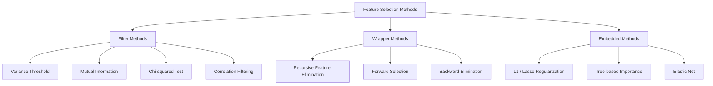
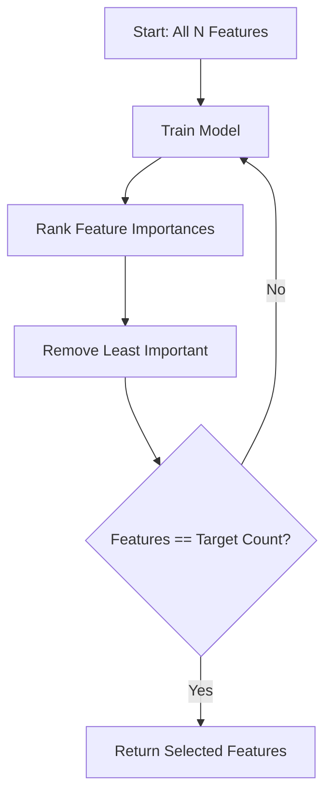
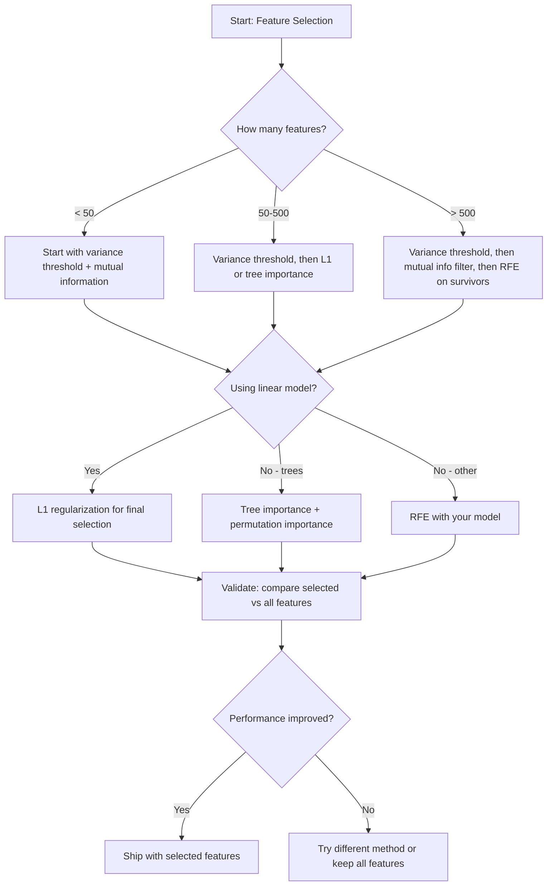

# Отбор признаков

> Больше признаков — не лучше. Лучше — правильные признаки.

**Тип:** Практика
**Язык:** Python
**Требования:** Фаза 2, Уроки 01-09, 08 (feature engineering)
**Время:** ~75 минут

## Цели обучения

- Реализовать filter methods (variance threshold, mutual information, chi-squared) и wrapper methods (RFE, forward selection) с нуля
- Объяснить, почему mutual information улавливает нелинейные feature-target relationships, которые correlation пропускает
- Сравнить L1 regularization (embedded selection) с RFE (wrapper selection) и оценить computational tradeoffs
- Построить feature selection pipeline, объединяющий несколько методов, и показать улучшение generalization на held-out data

## Проблема

У вас 500 features. Model обучается медленно, постоянно переобучается, и никто не может объяснить, что она выучила. Вы добавляете больше features, надеясь улучшить performance. Становится хуже.

Это curse of dimensionality в действии. С ростом числа features объем feature space взрывается. Data points становятся sparse. Distances между points сходятся. Model нужны exponentially more data, чтобы найти real patterns. Noise features заглушают signal features. Overfitting становится default.

Feature selection — противоядие. Уберите noise. Удалите redundancy. Оставьте features, несущие реальную информацию о target. Результат: быстрее training, лучше generalization и models, которые можно объяснить.

Цель не в использовании всей доступной информации. Цель — использовать правильную информацию.

## Концепция

### Три категории Feature Selection

Каждый feature selection method относится к одной из трех категорий:



**Filter methods** оценивают каждый feature независимо с помощью statistical measure. Они не используют model. Быстрые, но пропускают feature interactions.

**Wrapper methods** обучают model, чтобы оценивать feature subsets. Score — performance модели. Результаты лучше, но дорого, потому что model переобучается много раз.

**Embedded methods** выбирают features как часть model training. L1 regularization зануляет weights. Decision trees split по самым полезным features. Selection происходит во время fitting, а не отдельным шагом.

### Variance Threshold

Самый простой filter. Если feature почти не меняется между samples, он почти не несет информации.

Представьте feature, равный 0.0 для 999 из 1000 samples. Его variance почти zero. Ни одна model не может использовать его, чтобы различать classes. Удалите его.

```
variance(x) = mean((x - mean(x))^2)
```

Задайте threshold (например, 0.01). Drop every feature with variance below it. Это удаляет constant или near-constant features вообще без обращения к target variable.

Когда использовать: как preprocessing step перед другими methods. Он ловит очевидно useless features почти бесплатно.

Ограничение: feature может иметь high variance и все равно быть pure noise. Variance threshold необходим, но недостаточен.

### Mutual Information

Mutual information измеряет, насколько знание value feature X снижает uncertainty about target Y.

```
I(X; Y) = sum_x sum_y p(x, y) * log(p(x, y) / (p(x) * p(y)))
```

Если X и Y independent, p(x, y) = p(x) * p(y), log term zero и I(X; Y) = 0. Чем больше X сообщает о Y, тем выше mutual information.

Главное преимущество перед correlation: mutual information улавливает nonlinear relationships. Feature может иметь zero correlation с target, но high mutual information из-за quadratic или periodic relationship.

Для continuous features сначала discretize into bins (histogram-based estimation). Number of bins влияет на estimate: слишком мало bins теряют information, слишком много добавляют noise. Частый выбор: sqrt(n) bins или Sturges' rule (1 + log2(n)).


### Recursive Feature Elimination (RFE)

RFE — wrapper method. Он использует feature importance самой модели, чтобы iteratively prune:

1. Train model со всеми features
2. Rank features by importance (coefficients для linear models, impurity reduction для trees)
3. Remove least important feature(s)
4. Repeat until desired number of features remains



RFE учитывает feature interactions, потому что model видит все remaining features вместе. Removing one feature changes importance of others. Это делает его thorough по сравнению с filter methods.

Стоимость: model обучается N - target раз. При 500 features и target 10 это 490 training runs. Для expensive models это медленно. Можно ускорить, удаляя multiple features per step (например, bottom 10% each round).

### L1 (Lasso) Regularization

L1 regularization добавляет absolute value weights к loss function:

```
loss = prediction_error + alpha * sum(|w_i|)
```

Параметр alpha управляет тем, насколько агрессивно features prune. Более высокий alpha значит, что больше weights становятся exactly zero.

Почему exactly zero? L1 penalty создает diamond-shaped constraint region в weight space. Optimal solution склонен попадать в corner этого diamond, где один или несколько weights zero. L2 regularization (ridge) создает circular constraint, где weights shrink, но редко становятся zero.

Это embedded feature selection: model learns during training, какие features игнорировать. Features with zero weight effectively removed.

Преимущества: single training run, handles correlated features (выбирает один и зануляет другие), встроено в большинство linear model implementations.

Ограничение: работает только для linear models. Не улавливает nonlinear feature importance.

### Tree-Based Feature Importance

Decision trees и их ensembles (random forests, gradient boosting) naturally rank features. Каждый split reduces impurity (Gini или entropy для classification, variance для regression). Features, которые дают larger impurity reductions, важнее.

Для random forest с T trees:

```
importance(feature_j) = (1/T) * sum over all trees of
    sum over all nodes splitting on feature_j of
        (n_samples * impurity_decrease)
```

Это дает normalized importance score для каждого feature. Метод автоматически handles nonlinear relationships и feature interactions.

Осторожно: tree-based importance biased toward features with many unique values (high cardinality). Random ID column будет выглядеть important, потому что perfectly splits every sample. Используйте permutation importance как sanity check.

### Permutation Importance

Model-agnostic method:

1. Train model и record baseline performance на validation data
2. Для каждого feature: shuffle its values randomly, measure drop in performance
3. Чем больше drop, тем важнее feature

Если shuffling feature не ухудшает performance, model от него не зависит. Если performance collapses, feature critical.

Permutation importance избегает cardinality bias tree-based importance. Но он slow: one full evaluation per feature, repeated multiple times for stability.

### Comparison Table

| Метод | Тип | Speed | Nonlinear | Feature Interactions |
|-------|-----|-------|-----------|----------------------|
| Variance threshold | Filter | Very fast | No | No |
| Mutual information | Filter | Fast | Yes | No |
| Correlation filter | Filter | Fast | No | No |
| RFE | Wrapper | Slow | Depends on model | Yes |
| L1 / Lasso | Embedded | Fast | No (linear) | No |
| Tree importance | Embedded | Medium | Yes | Yes |
| Permutation importance | Model-agnostic | Slow | Yes | Yes |

### Decision Flowchart



## Соберите это

### Шаг 1: сгенерировать synthetic data с известной feature structure

```python
import numpy as np


def make_feature_selection_data(n_samples=500, seed=42):
    rng = np.random.RandomState(seed)

    x1 = rng.randn(n_samples)
    x2 = rng.randn(n_samples)
    x3 = rng.randn(n_samples)
    x4 = x1 + 0.1 * rng.randn(n_samples)
    x5 = x2 + 0.1 * rng.randn(n_samples)

    informative = np.column_stack([x1, x2, x3, x4, x5])

    correlated = np.column_stack([
        x1 * 0.9 + 0.1 * rng.randn(n_samples),
        x2 * 0.8 + 0.2 * rng.randn(n_samples),
        x3 * 0.7 + 0.3 * rng.randn(n_samples),
        x1 * 0.5 + x2 * 0.5 + 0.1 * rng.randn(n_samples),
        x2 * 0.6 + x3 * 0.4 + 0.1 * rng.randn(n_samples),
    ])

    noise = rng.randn(n_samples, 10) * 0.5

    X = np.hstack([informative, correlated, noise])
    y = (2 * x1 - 1.5 * x2 + x3 + 0.5 * rng.randn(n_samples) > 0).astype(int)

    feature_names = (
        [f"info_{i}" for i in range(5)]
        + [f"corr_{i}" for i in range(5)]
        + [f"noise_{i}" for i in range(10)]
    )

    return X, y, feature_names
```

Мы знаем ground truth: features 0-4 informative (плюс 3 и 4 — correlated copies 0 и 1), features 5-9 correlated with informative features, features 10-19 pure noise. Хороший selection method должен rank 0-4 highest и 10-19 lowest.

### Шаг 2: Variance threshold

```python
def variance_threshold(X, threshold=0.01):
    variances = np.var(X, axis=0)
    mask = variances > threshold
    return mask, variances
```

### Шаг 3: Mutual information (discrete)

```python
def discretize(x, n_bins=10):
    min_val, max_val = x.min(), x.max()
    if max_val == min_val:
        return np.zeros_like(x, dtype=int)
    bin_edges = np.linspace(min_val, max_val, n_bins + 1)
    binned = np.digitize(x, bin_edges[1:-1])
    return binned


def mutual_information(X, y, n_bins=10):
    n_samples, n_features = X.shape
    mi_scores = np.zeros(n_features)

    y_vals, y_counts = np.unique(y, return_counts=True)
    p_y = y_counts / n_samples

    for f in range(n_features):
        x_binned = discretize(X[:, f], n_bins)
        x_vals, x_counts = np.unique(x_binned, return_counts=True)
        p_x = dict(zip(x_vals, x_counts / n_samples))

        mi = 0.0
        for xv in x_vals:
            for yi, yv in enumerate(y_vals):
                joint_mask = (x_binned == xv) & (y == yv)
                p_xy = np.sum(joint_mask) / n_samples
                if p_xy > 0:
                    mi += p_xy * np.log(p_xy / (p_x[xv] * p_y[yi]))
        mi_scores[f] = mi

    return mi_scores
```

### Шаг 4: Recursive Feature Elimination

```python
def simple_logistic_importance(X, y, lr=0.1, epochs=100):
    n_samples, n_features = X.shape
    w = np.zeros(n_features)
    b = 0.0

    for _ in range(epochs):
        z = X @ w + b
        pred = 1.0 / (1.0 + np.exp(-np.clip(z, -500, 500)))
        error = pred - y
        w -= lr * (X.T @ error) / n_samples
        b -= lr * np.mean(error)

    return w, b


def rfe(X, y, n_features_to_select=5, lr=0.1, epochs=100):
    n_total = X.shape[1]
    remaining = list(range(n_total))
    rankings = np.ones(n_total, dtype=int)
    rank = n_total

    while len(remaining) > n_features_to_select:
        X_subset = X[:, remaining]
        w, _ = simple_logistic_importance(X_subset, y, lr, epochs)
        importances = np.abs(w)

        least_idx = np.argmin(importances)
        original_idx = remaining[least_idx]
        rankings[original_idx] = rank
        rank -= 1
        remaining.pop(least_idx)

    for idx in remaining:
        rankings[idx] = 1

    selected_mask = rankings == 1
    return selected_mask, rankings
```

### Шаг 5: L1 feature selection

```python
def soft_threshold(w, alpha):
    return np.sign(w) * np.maximum(np.abs(w) - alpha, 0)


def l1_feature_selection(X, y, alpha=0.1, lr=0.01, epochs=500):
    n_samples, n_features = X.shape
    w = np.zeros(n_features)
    b = 0.0

    for _ in range(epochs):
        z = X @ w + b
        pred = 1.0 / (1.0 + np.exp(-np.clip(z, -500, 500)))
        error = pred - y

        gradient_w = (X.T @ error) / n_samples
        gradient_b = np.mean(error)

        w -= lr * gradient_w
        w = soft_threshold(w, lr * alpha)
        b -= lr * gradient_b

    selected_mask = np.abs(w) > 1e-6
    return selected_mask, w
```

### Шаг 6: Tree-based importance (simple decision tree)

```python
def gini_impurity(y):
    if len(y) == 0:
        return 0.0
    classes, counts = np.unique(y, return_counts=True)
    probs = counts / len(y)
    return 1.0 - np.sum(probs ** 2)


def best_split(X, y, feature_idx):
    values = np.unique(X[:, feature_idx])
    if len(values) <= 1:
        return None, -1.0

    best_threshold = None
    best_gain = -1.0
    parent_gini = gini_impurity(y)
    n = len(y)

    for i in range(len(values) - 1):
        threshold = (values[i] + values[i + 1]) / 2.0
        left_mask = X[:, feature_idx] <= threshold
        right_mask = ~left_mask

        n_left = np.sum(left_mask)
        n_right = np.sum(right_mask)

        if n_left == 0 or n_right == 0:
            continue

        gain = parent_gini - (n_left / n) * gini_impurity(y[left_mask]) - (n_right / n) * gini_impurity(y[right_mask])

        if gain > best_gain:
            best_gain = gain
            best_threshold = threshold

    return best_threshold, best_gain


def tree_importance(X, y, n_trees=50, max_depth=5, seed=42):
    rng = np.random.RandomState(seed)
    n_samples, n_features = X.shape
    importances = np.zeros(n_features)

    for _ in range(n_trees):
        sample_idx = rng.choice(n_samples, size=n_samples, replace=True)
        feature_subset = rng.choice(n_features, size=max(1, int(np.sqrt(n_features))), replace=False)

        X_boot = X[sample_idx]
        y_boot = y[sample_idx]

        tree_imp = _build_tree_importance(X_boot, y_boot, feature_subset, max_depth)
        importances += tree_imp

    total = importances.sum()
    if total > 0:
        importances /= total

    return importances


def _build_tree_importance(X, y, feature_subset, max_depth, depth=0):
    n_features = X.shape[1]
    importances = np.zeros(n_features)

    if depth >= max_depth or len(np.unique(y)) <= 1 or len(y) < 4:
        return importances

    best_feature = None
    best_threshold = None
    best_gain = -1.0

    for f in feature_subset:
        threshold, gain = best_split(X, y, f)
        if gain > best_gain:
            best_gain = gain
            best_feature = f
            best_threshold = threshold

    if best_feature is None or best_gain <= 0:
        return importances

    importances[best_feature] += best_gain * len(y)

    left_mask = X[:, best_feature] <= best_threshold
    right_mask = ~left_mask

    importances += _build_tree_importance(X[left_mask], y[left_mask], feature_subset, max_depth, depth + 1)
    importances += _build_tree_importance(X[right_mask], y[right_mask], feature_subset, max_depth, depth + 1)

    return importances
```

### Шаг 7: запустить все методы и сравнить

Код file запускает все пять methods на одном synthetic dataset и печатает comparison table, показывающую, какие features выбирает каждый method.

## Используйте это

Со scikit-learn feature selection встроен в pipeline:

```python
from sklearn.feature_selection import (
    VarianceThreshold,
    mutual_info_classif,
    RFE,
    SelectFromModel,
)
from sklearn.linear_model import Lasso, LogisticRegression
from sklearn.ensemble import RandomForestClassifier

vt = VarianceThreshold(threshold=0.01)
X_filtered = vt.fit_transform(X)

mi_scores = mutual_info_classif(X, y)
top_k = np.argsort(mi_scores)[-10:]

rfe_selector = RFE(LogisticRegression(), n_features_to_select=10)
rfe_selector.fit(X, y)
X_rfe = rfe_selector.transform(X)

lasso_selector = SelectFromModel(Lasso(alpha=0.01))
lasso_selector.fit(X, y)
X_lasso = lasso_selector.transform(X)

rf = RandomForestClassifier(n_estimators=100)
rf.fit(X, y)
importances = rf.feature_importances_
```

Реализации с нуля показывают, что происходит внутри каждого method. Variance threshold — просто computing `var(X, axis=0)` и applying mask. Mutual information — counting joint and marginal frequencies in contingency table. RFE — loop, который trains, ranks и prunes. L1 — gradient descent с soft-thresholding step. Tree importance accumulates impurity reductions across splits. Никакой магии — только statistics и loops.

Sklearn versions добавляют robustness (например, mutual_info_classif uses k-NN density estimation instead of binning), speed (C implementations) и pipeline integration.

## Доведите до результата

Этот урок создает:
- `outputs/skill-feature-selector.md` — quick reference decision tree для выбора правильного feature selection method

## Упражнения

1. **Forward selection**: реализуйте противоположность RFE. Начните с zero features. На каждом step добавляйте feature, который сильнее всего улучшает model performance. Остановитесь, когда добавление features перестанет помогать. Сравните selected features с RFE results. Что быстрее? Что дает лучший результат?

2. **Stability selection**: запустите L1 feature selection 50 раз, каждый раз на random 80% subsample data, со слегка разными alpha values. Посчитайте, как часто каждый feature selected. Features selected in > 80% runs считаются "stable." Сравните stable features с single-run L1 selection. Что надежнее?

3. **Multicollinearity detection**: вычислите correlation matrix для всех features. Реализуйте function, которая при заданном correlation threshold (например, 0.9) удаляет один feature из каждой highly-correlated pair (оставляя тот, у которого выше mutual information with target). Проверьте на synthetic dataset и убедитесь, что redundant correlated features удалены.

4. **Feature selection pipeline**: объедините variance threshold, mutual information filter и RFE в один pipeline. Сначала удалите near-zero-variance features, затем оставьте top 50% by mutual information, затем запустите RFE на survivors. Сравните с RFE alone on all features. Pipeline быстрее? Так же accurate?

5. **Permutation importance from scratch**: реализуйте permutation importance. Для каждого feature shuffle values 10 раз, measure average drop in F1 score. Сравните ranking с tree-based importance. Найдите случаи, где они disagree, и объясните почему (hint: correlated features).

## Ключевые термины

| Термин | Как говорят | Что это на самом деле значит |
|--------|-------------|------------------------------|
| Filter method | «Score features independently» | Feature selection approach, который ranks features using statistical measure without training a model, оценивая каждый feature in isolation |
| Wrapper method | «Use the model to pick features» | Feature selection approach, который evaluates feature subsets by training a model and using its performance as selection criterion |
| Embedded method | «The model selects features during training» | Feature selection, happening as part of model fitting, например L1 regularization driving weights to zero |
| Mutual information | «Насколько one variable tells you about another» | Мера reduction in uncertainty about Y given knowledge of X, capturing both linear and nonlinear dependencies |
| Recursive Feature Elimination | «Train, rank, prune, repeat» | Iterative wrapper method: trains a model, removes least important feature(s), repeats until target count reached |
| L1 / Lasso regularization | «Penalty that kills features» | Adding sum of absolute weight values to loss function, driving unimportant feature weights exactly to zero |
| Variance threshold | «Remove constant features» | Dropping features whose variance across samples falls below specified threshold, filtering out features with no information |
| Feature importance | «Какие features важнее всего» | Score, indicating how much each feature contributes to model predictions, computed from split gains (trees) or coefficient magnitudes (linear) |
| Permutation importance | «Shuffle and measure the damage» | Evaluating feature importance by randomly shuffling each feature's values and measuring resulting drop in model performance |
| Curse of dimensionality | «Too many features, not enough data» | Phenomenon where adding features increases feature space volume exponentially, making data sparse and distances meaningless |

## Дополнительное чтение

- [An Introduction to Variable and Feature Selection (Guyon & Elisseeff, 2003)](https://jmlr.org/papers/v3/guyon03a.html) — foundational survey по feature selection methods
- [scikit-learn Feature Selection Guide](https://scikit-learn.org/stable/modules/feature_selection.html) — practical reference для filter, wrapper и embedded methods с code examples
- [Stability Selection (Meinshausen & Buhlmann, 2010)](https://arxiv.org/abs/0809.2932) — combines subsampling with feature selection для robust, reproducible results
- [Beware Default Random Forest Importances (Strobl et al., 2007)](https://bmcbioinformatics.biomedcentral.com/articles/10.1186/1471-2105-8-25) — показывает cardinality bias в tree-based importance и предлагает conditional importance как alternative
