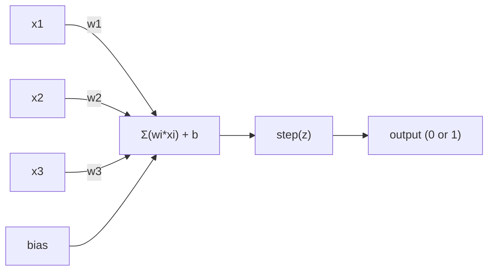
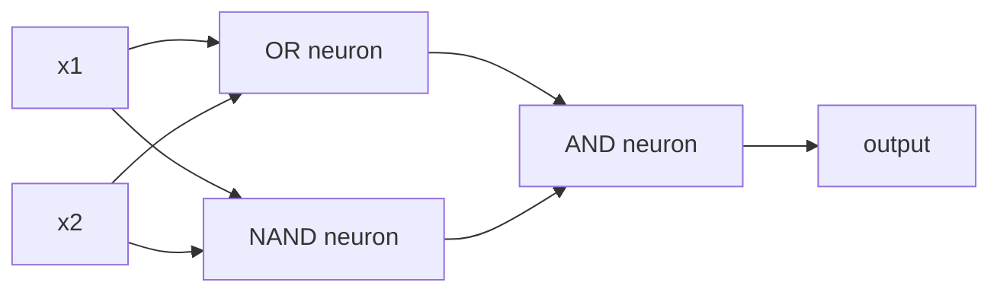

# Перцептрон

> Перцептрон - это атом нейронных сетей. Разберите его, и внутри вы найдете веса, смещение и решение.

**Тип:** Сборка
**Языки:** Python
**Предварительные требования:** Фаза 1 (Интуиция линейной алгебры)
**Время:** ~60 минут

## Цели обучения

- Реализовать перцептрон с нуля на Python, включая правило обновления весов и ступенчатую функцию активации
- Объяснить, почему один перцептрон может решать только линейно разделимые задачи, и показать случай отказа на XOR
- Построить многослойный перцептрон, комбинируя вентили OR, NAND и AND для решения XOR
- Обучить двухслойную сеть с сигмоидной активацией и обратным распространением ошибки, чтобы автоматически выучить XOR

## Задача

Вы знаете векторы и скалярные произведения. Вы знаете, что матрица преобразует входы в выходы. Но как машина *учится*, какое преобразование использовать?

Перцептрон отвечает на этот вопрос. Это простейшая возможная обучающаяся машина: взять несколько входов, умножить их на веса, добавить смещение и принять бинарное решение. Затем скорректироваться. И все. Любая когда-либо построенная нейронная сеть - это слои этой идеи, сложенные друг на друга.

Понимание перцептрона означает понимание того, что на самом деле значит "обучение" в коде: корректировать числа, пока выход не совпадет с реальностью.

## Концепция

### Один нейрон, одно решение

Перцептрон принимает n входов, умножает каждый на вес, суммирует их, добавляет смещение и пропускает результат через функцию активации.



Ступенчатая функция жесткая: если взвешенная сумма плюс смещение >= 0, она возвращает 1. Иначе возвращает 0.

```
step(z) = 1  if z >= 0
           0  if z < 0
```

Это линейный классификатор. Веса и смещение задают прямую (или гиперплоскость в более высоких размерностях), которая делит пространство входов на две области.

### Граница принятия решений

Для двух входов перцептрон проводит прямую в двумерном пространстве:

```
  x2
  ┤
  │  Class 1        /
  │    (0)          /
  │                /
  │               / w1·x1 + w2·x2 + b = 0
  │              /
  │             /     Class 2
  │            /        (1)
  ┼───────────/──────────── x1
```

Все по одну сторону прямой дает выход 0. Все по другую сторону дает выход 1. Обучение сдвигает эту прямую, пока она корректно не разделит классы.

### Правило обучения

Правило обучения перцептрона простое:

```
For each training example (x, y_true):
    y_pred = predict(x)
    error = y_true - y_pred

    For each weight:
        w_i = w_i + learning_rate * error * x_i
    bias = bias + learning_rate * error
```

Если предсказание верное, error = 0, ничего не меняется. Если он предсказывает 0, хотя должен быть 1, веса увеличиваются. Если он предсказывает 1, хотя должен быть 0, веса уменьшаются. Скорость обучения управляет величиной каждой корректировки.

### Задача XOR

Вот где все ломается. Посмотрите на эти логические вентили:

```
AND gate:           OR gate:            XOR gate:
x1  x2  out         x1  x2  out         x1  x2  out
0   0   0           0   0   0           0   0   0
0   1   0           0   1   1           0   1   1
1   0   0           1   0   1           1   0   1
1   1   1           1   1   1           1   1   0
```

AND и OR линейно разделимы: можно провести одну прямую, чтобы отделить 0 от 1. XOR - нет. Ни одна прямая не может отделить [0,1] и [1,0] от [0,0] и [1,1].

```
AND (separable):        XOR (not separable):

  x2                      x2
  1 ┤  0     1            1 ┤  1     0
    │     /                 │
  0 ┤  0 / 0              0 ┤  0     1
    ┼──/──────── x1         ┼──────────── x1
       line works!          no single line works!
```

Это фундаментальное ограничение. Один перцептрон может решать только линейно разделимые задачи. Минский и Пейперт доказали это в 1969 году, и это почти на десятилетие остановило исследования нейронных сетей.

Исправление: сложить перцептроны в слои. Многослойный перцептрон может решить XOR, объединяя два линейных решения в одно нелинейное.

## Реализация

### Шаг 1: класс Perceptron

```python
class Perceptron:
    def __init__(self, n_inputs, learning_rate=0.1):
        self.weights = [0.0] * n_inputs
        self.bias = 0.0
        self.lr = learning_rate

    def predict(self, inputs):
        total = sum(w * x for w, x in zip(self.weights, inputs))
        total += self.bias
        return 1 if total >= 0 else 0

    def train(self, training_data, epochs=100):
        for epoch in range(epochs):
            errors = 0
            for inputs, target in training_data:
                prediction = self.predict(inputs)
                error = target - prediction
                if error != 0:
                    errors += 1
                    for i in range(len(self.weights)):
                        self.weights[i] += self.lr * error * inputs[i]
                    self.bias += self.lr * error
            if errors == 0:
                print(f"Converged at epoch {epoch + 1}")
                return
        print(f"Did not converge after {epochs} epochs")
```

### Шаг 2: обучить на логических вентилях

```python
and_data = [
    ([0, 0], 0),
    ([0, 1], 0),
    ([1, 0], 0),
    ([1, 1], 1),
]

or_data = [
    ([0, 0], 0),
    ([0, 1], 1),
    ([1, 0], 1),
    ([1, 1], 1),
]

not_data = [
    ([0], 1),
    ([1], 0),
]

print("=== AND Gate ===")
p_and = Perceptron(2)
p_and.train(and_data)
for inputs, _ in and_data:
    print(f"  {inputs} -> {p_and.predict(inputs)}")

print("\n=== OR Gate ===")
p_or = Perceptron(2)
p_or.train(or_data)
for inputs, _ in or_data:
    print(f"  {inputs} -> {p_or.predict(inputs)}")

print("\n=== NOT Gate ===")
p_not = Perceptron(1)
p_not.train(not_data)
for inputs, _ in not_data:
    print(f"  {inputs} -> {p_not.predict(inputs)}")
```

### Шаг 3: посмотреть, как XOR не сработает

```python
xor_data = [
    ([0, 0], 0),
    ([0, 1], 1),
    ([1, 0], 1),
    ([1, 1], 0),
]

print("\n=== XOR Gate (single perceptron) ===")
p_xor = Perceptron(2)
p_xor.train(xor_data, epochs=1000)
for inputs, expected in xor_data:
    result = p_xor.predict(inputs)
    status = "OK" if result == expected else "WRONG"
    print(f"  {inputs} -> {result} (expected {expected}) {status}")
```

Он никогда не сойдется. Это строгое доказательство того, что один перцептрон не может выучить XOR.

### Шаг 4: решить XOR двумя слоями

Идея: XOR = (x1 OR x2) AND NOT (x1 AND x2). Объединим три перцептрона:



```python
def xor_network(x1, x2):
    or_neuron = Perceptron(2)
    or_neuron.weights = [1.0, 1.0]
    or_neuron.bias = -0.5

    nand_neuron = Perceptron(2)
    nand_neuron.weights = [-1.0, -1.0]
    nand_neuron.bias = 1.5

    and_neuron = Perceptron(2)
    and_neuron.weights = [1.0, 1.0]
    and_neuron.bias = -1.5

    hidden1 = or_neuron.predict([x1, x2])
    hidden2 = nand_neuron.predict([x1, x2])
    output = and_neuron.predict([hidden1, hidden2])
    return output


print("\n=== XOR Gate (multi-layer network) ===")
for inputs, expected in xor_data:
    result = xor_network(inputs[0], inputs[1])
    print(f"  {inputs} -> {result} (expected {expected})")
```

Все четыре случая корректны. Укладка перцептронов в слои создает границы принятия решений, которые не может построить один перцептрон.

### Шаг 5: обучить двухслойную сеть

В шаге 4 веса были заданы вручную. Для XOR это работает, но не для реальных задач, где вы заранее не знаете правильные веса. Исправление: заменить ступенчатую функцию на сигмоиду и автоматически выучить веса через обратное распространение ошибки.

```python
class TwoLayerNetwork:
    def __init__(self, learning_rate=0.5):
        import random
        random.seed(0)
        self.w_hidden = [[random.uniform(-1, 1), random.uniform(-1, 1)] for _ in range(2)]
        self.b_hidden = [random.uniform(-1, 1), random.uniform(-1, 1)]
        self.w_output = [random.uniform(-1, 1), random.uniform(-1, 1)]
        self.b_output = random.uniform(-1, 1)
        self.lr = learning_rate

    def sigmoid(self, x):
        import math
        x = max(-500, min(500, x))
        return 1.0 / (1.0 + math.exp(-x))

    def forward(self, inputs):
        self.inputs = inputs
        self.hidden_outputs = []
        for i in range(2):
            z = sum(w * x for w, x in zip(self.w_hidden[i], inputs)) + self.b_hidden[i]
            self.hidden_outputs.append(self.sigmoid(z))
        z_out = sum(w * h for w, h in zip(self.w_output, self.hidden_outputs)) + self.b_output
        self.output = self.sigmoid(z_out)
        return self.output

    def train(self, training_data, epochs=10000):
        for epoch in range(epochs):
            total_error = 0
            for inputs, target in training_data:
                output = self.forward(inputs)
                error = target - output
                total_error += error ** 2

                d_output = error * output * (1 - output)

                saved_w_output = self.w_output[:]
                hidden_deltas = []
                for i in range(2):
                    h = self.hidden_outputs[i]
                    hd = d_output * saved_w_output[i] * h * (1 - h)
                    hidden_deltas.append(hd)

                for i in range(2):
                    self.w_output[i] += self.lr * d_output * self.hidden_outputs[i]
                self.b_output += self.lr * d_output

                for i in range(2):
                    for j in range(len(inputs)):
                        self.w_hidden[i][j] += self.lr * hidden_deltas[i] * inputs[j]
                    self.b_hidden[i] += self.lr * hidden_deltas[i]
```

```python
net = TwoLayerNetwork(learning_rate=2.0)
net.train(xor_data, epochs=10000)
for inputs, expected in xor_data:
    result = net.forward(inputs)
    predicted = 1 if result >= 0.5 else 0
    print(f"  {inputs} -> {result:.4f} (rounded: {predicted}, expected {expected})")
```

Два ключевых отличия от шага 4. Во-первых, сигмоида заменяет ступенчатую функцию - она гладкая, поэтому существуют градиенты. Во-вторых, метод `train` распространяет ошибку назад от выхода к скрытому слою, корректируя каждый вес пропорционально его вкладу в ошибку. Это обратное распространение ошибки в 20 строках.

Это мост к уроку 03. Математика за `d_output` и `hidden_deltas` - это цепное правило, примененное к графу сети. Там мы выведем его как следует.

### Ожидаемый вывод

Запустите `code/perceptron.py` — последние строки должны быть такими:

```
  Epoch 4000, error: 0.0007
  Epoch 6000, error: 0.0005
  Epoch 8000, error: 0.0003

  [0, 0] -> 0.0074 (rounded: 0, expected 0)
  [0, 1] -> 0.9923 (rounded: 1, expected 1)
  [1, 0] -> 0.9923 (rounded: 1, expected 1)
  [1, 1] -> 0.0094 (rounded: 0, expected 0)
```

## Использование

Все, что вы только что построили с нуля, существует в одном импорте:

```python
from sklearn.linear_model import Perceptron as SkPerceptron
import numpy as np

X = np.array([[0,0],[0,1],[1,0],[1,1]])
y = np.array([0, 0, 0, 1])

clf = SkPerceptron(max_iter=100, tol=1e-3)
clf.fit(X, y)
print([clf.predict([x])[0] for x in X])
```

Пять строк. Ваш 30-строчный класс `Perceptron` делает то же самое. Версия sklearn добавляет проверки сходимости, несколько функций потерь и поддержку разреженных входов, но основной цикл идентичен: взвешенная сумма, ступенчатая функция, обновление весов по ошибке.

Настоящий разрыв проявляется в масштабе. Что меняется в промышленных сетях:

- Ступенчатая функция заменяется сигмоидой, ReLU или другими гладкими активациями
- Веса автоматически обучаются через обратное распространение ошибки (урок 03)
- Слои становятся глубже: 3, 10, 100+ слоев
- Тот же принцип сохраняется: каждый слой создает новые признаки из выходов предыдущего слоя

Один перцептрон может проводить только прямые линии. Сложите их, и вы сможете нарисовать любую форму.

## Результат

Этот урок создает:
- `outputs/skill-perceptron.md` - навык о том, когда нужны однослойные и многослойные архитектуры

## Упражнения

1. Обучите перцептрон на вентиле NAND (универсальном вентиле - любую логическую схему можно построить из NAND). Проверьте, что его веса и смещение образуют корректную границу принятия решений.
2. Измените класс Perceptron, чтобы он отслеживал границу принятия решений (w1*x1 + w2*x2 + b = 0) на каждой эпохе. Выведите, как прямая сдвигается во время обучения на вентиле AND.
3. Постройте перцептрон с 3 входами, который выдает 1 только тогда, когда хотя бы 2 из 3 входов равны 1 (функция большинства голосов). Линейно ли она разделима? Почему?

<details>
<summary>Решение — упражнение 3</summary>

```python
w = [1.0, 1.0, 1.0]
b = -1.5            # fires when x1 + x2 + x3 >= 2
def majority(x): return 1 if (w[0]*x[0] + w[1]*x[1] + w[2]*x[2] + b) > 0 else 0
```

Перцептрон — это порог на взвешенной сумме, а «хотя бы 2 из 3» — ровно полупространство `x1 + x2 + x3 >= 2`. Значит да, линейно разделимо. Проверено: совпадает с функцией большинства на всех 8 входах. (XOR, в отличие от этого, линейно неразделим — поэтому в уроке 02 нужен скрытый слой.)

</details>

## Ключевые термины

| Термин | Как говорят | Что это на самом деле означает |
|------|----------------|----------------------|
| Перцептрон (Perceptron) | "Искусственный нейрон" | Линейный классификатор: скалярное произведение входов и весов плюс смещение, пропущенное через ступенчатую функцию |
| Вес (Weight) | "Насколько важен вход" | Множитель, который масштабирует вклад каждого входа в решение |
| Смещение (Bias) | "Порог" | Константа, которая сдвигает границу принятия решений, позволяя перцептрону активироваться даже при нулевых входах |
| Функция активации (Activation function) | "То, что сжимает значения" | Функция, применяемая после взвешенной суммы: ступенчатая функция для перцептронов, sigmoid/ReLU для современных сетей |
| Линейно разделимый (Linearly separable) | "Между ними можно провести прямую" | Набор данных, где одна гиперплоскость может идеально разделить классы |
| Задача XOR (XOR problem) | "То, что перцептроны не умеют делать" | Доказательство того, что однослойные сети не могут выучить нелинейно разделимые функции |
| Граница принятия решений (Decision boundary) | "Где классификатор переключается" | Гиперплоскость w*x + b = 0, которая делит пространство входов на два класса |
| Многослойный перцептрон (Multi-layer perceptron) | "Настоящая нейронная сеть" | Перцептроны, сложенные в слои, где выход каждого слоя подается на вход следующего |

## Дополнительное чтение

- [Frank Rosenblatt, "The Perceptron: A Probabilistic Model for Information Storage and Organization in the Brain" (1958)](https://doi.org/10.1037/h0042519) - оригинальная статья, с которой все началось
- Minsky & Papert, "Perceptrons" (1969) - книга, доказавшая, что XOR не решается однослойными сетями, и остановившая исследования перцептронов на десятилетие
- Michael Nielsen, "Neural Networks and Deep Learning", Chapter 1 (http://neuralnetworksanddeeplearning.com/) - бесплатная онлайн-глава, лучшее визуальное объяснение того, как перцептроны складываются в сети
