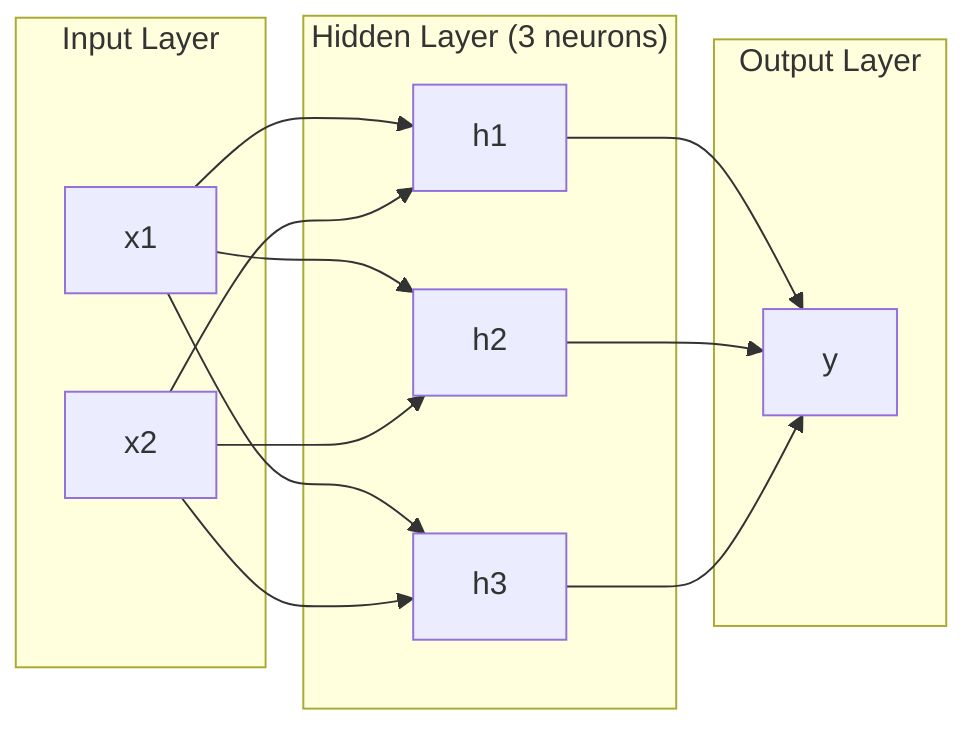
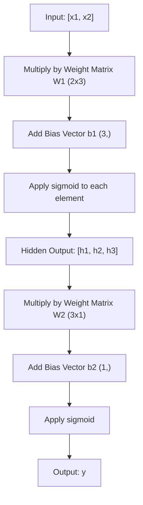
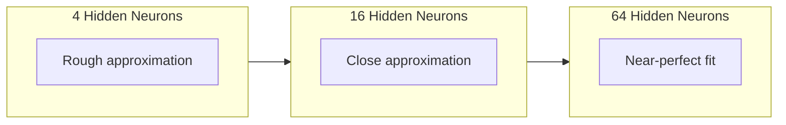

# Многослойные сети и прямой проход

> Один нейрон рисует линию. Сложите их в стек, и вы сможете нарисовать что угодно.

**Тип:** Сборка
**Языки:** Python
**Предварительные требования:** Фаза 01 (математические основы), урок 03.01 (перцептрон)
**Время:** ~90 минут

## Цели обучения

- Построить многослойную сеть (multi-layer network) с нуля с классами Layer и Network, которые выполняют полный прямой проход (forward pass)
- Прослеживать размерности матриц через каждый слой сети и находить несовпадения форм (shape mismatches)
- Объяснить, как стек нелинейных активаций позволяет сети учить криволинейные границы решений
- Решить задачу XOR с архитектурой 2-2-1 и вручную подобранными весами sigmoid

## Проблема

Один нейрон -- это рисователь линий. И все. Одна прямая линия через ваши данные. Любая реальная задача в AI -- распознавание изображений, понимание языка, игра в Go -- требует кривых. Объединение нейронов в слои -- способ получить кривые.

В 1969 году Minsky и Papert доказали, что это ограничение фатально: однослойная сеть не может выучить XOR. Не "ей трудно выучить" -- математически не может. Таблица истинности XOR помещает [0,1] и [1,0] на одну сторону, а [0,0] и [1,1] -- на другую. Ни одна прямая не разделяет их.

Это убило финансирование нейронных сетей больше чем на десятилетие. В ретроспективе исправление было очевидным: перестать использовать один слой. Складывать нейроны в слои. Пусть первый слой вырезает из входного пространства новые признаки, а второй слой объединяет эти признаки в решения, которые не смогла бы принять ни одна отдельная линия.

Этот стек и есть многослойная сеть (multi-layer network). Это основа каждой модели глубокого обучения (deep learning), которая сегодня работает в продакшене. Прямой проход (forward pass) -- поток данных от входа через скрытые слои к выходу -- это первое, что нужно построить, прежде чем заработает что-либо еще.

## Концепция

### Слои: входной, скрытый, выходной

В многослойной сети есть три типа слоев:

**Входной слой (input layer)** -- на самом деле не совсем слой. Он хранит сырые данные. Два признака означают два входных узла. Здесь не происходит вычислений.

**Скрытые слои (hidden layers)** -- место, где происходит работа. Каждый нейрон берет каждый выход предыдущего слоя, применяет веса и смещение (bias), а затем пропускает результат через функцию активации (activation function). "Скрытые", потому что вы никогда не видите эти значения напрямую в обучающих данных.

**Выходной слой (output layer)** -- финальный ответ. Для бинарной классификации -- один нейрон с sigmoid. Для многоклассовой -- по одному нейрону на класс.



Это сеть 2-3-1. Два входа, три скрытых нейрона, один выход. Каждое соединение несет вес. Каждый нейрон (кроме входного) несет смещение (bias).

Каждый слой производит вектор чисел, который называется скрытым состоянием (hidden state). Для текста скрытые состояния увеличивают размерность -- кодируют слово как 768 чисел, чтобы захватить семантический смысл. Для изображений они уменьшают размерность -- сжимают миллионы пикселей в управляемое представление. Скрытое состояние -- место, где живет обучение.

### Нейроны и активации

Каждый нейрон делает три вещи:

1. Умножает каждый вход на соответствующий вес
2. Складывает все произведения и добавляет смещение (bias)
3. Пропускает сумму через функцию активации (activation function)

Пока активация -- это sigmoid:

```
sigmoid(z) = 1 / (1 + e^(-z))
```

Sigmoid сжимает любое число в диапазон (0, 1). Большие положительные входы тянут значение к 1. Большие отрицательные входы тянут к 0. Ноль отображается в 0.5. Эта гладкая кривая делает обучение возможным -- в отличие от жесткой ступеньки перцептрона, у sigmoid везде есть градиент.

### Прямой проход: как текут данные

Прямой проход (forward pass) проталкивает входные данные через сеть, слой за слоем, пока они не достигнут выхода. Во время прямого прохода обучение не происходит. Это чистое вычисление: умножить, сложить, активировать, повторить.



На каждом слое последовательно выполняются три операции:

```
z = W * input + b       (linear transformation)
a = sigmoid(z)           (activation)
```

Выход одного слоя становится входом следующего. Это и есть весь прямой проход.

### Размерности матриц

Отслеживание размерностей -- самый важный навык отладки в глубоком обучении (deep learning). Вот сеть 2-3-1:

| Шаг | Операция | Размерности | Форма результата |
|------|-----------|------------|-------------|
| Вход | x | -- | (2,) |
| Линейная часть скрытого слоя | W1 * x + b1 | W1: (3, 2), b1: (3,) | (3,) |
| Активация скрытого слоя | sigmoid(z1) | -- | (3,) |
| Линейная часть выходного слоя | W2 * h + b2 | W2: (1, 3), b2: (1,) | (1,) |
| Активация выходного слоя | sigmoid(z2) | -- | (1,) |

Правило: матрица весов W на слое k имеет форму (neurons_in_layer_k, neurons_in_layer_k_minus_1). Строки соответствуют текущему слою. Столбцы соответствуют предыдущему слою. Если формы не сходятся, у вас баг.

### Теорема универсальной аппроксимации

В 1989 году George Cybenko доказал замечательную вещь: нейронная сеть с одним скрытым слоем и достаточным количеством нейронов может аппроксимировать любую непрерывную функцию с любой желаемой точностью.

Это не означает, что один скрытый слой всегда лучше. Это означает, что архитектура теоретически способна на это. На практике более глубокие сети (больше слоев, меньше нейронов на слой) учат те же функции с гораздо меньшим общим числом параметров, чем мелкие широкие сети (shallow-wide networks). Поэтому глубокое обучение работает.

Интуиция: каждый нейрон в скрытом слое учит один "бугорок" или признак. Достаточное количество бугорков, размещенных в правильных местах, может аппроксимировать любую гладкую кривую. Больше нейронов, больше бугорков, лучше аппроксимация.



### Компонуемость

Нейронные сети компонуемы. Их можно складывать в стек, соединять в цепочки, запускать параллельно. Модель Whisper использует сеть-энкодер (encoder) для обработки аудио и отдельную сеть-декодер (decoder) для генерации текста. Современные LLM -- только декодеры (decoder-only). BERT -- только энкодер (encoder-only). T5 -- энкодер-декодер (encoder-decoder). Выбор архитектуры определяет, что модель может делать.

## Сборка

Чистый Python. Без numpy. Каждая матричная операция написана с нуля.

### Шаг 1: активация Sigmoid

```python
import math

def sigmoid(x):
    x = max(-500.0, min(500.0, x))
    return 1.0 / (1.0 + math.exp(-x))
```

Ограничение диапазоном [-500, 500] предотвращает переполнение. `math.exp(500)` велико, но конечно. `math.exp(1000)` -- это бесконечность.

### Шаг 2: класс Layer

Самая важная операция во всем глубоком обучении -- матричное умножение. Каждый слой, каждая голова внимания (attention head), каждый прямой проход -- везде матричные умножения (matmuls). Линейный слой берет входной вектор, умножает его на матрицу весов и добавляет вектор смещений: y = Wx + b. На это одно уравнение приходится 90% вычислений в нейронной сети.

Слой хранит матрицу весов и вектор смещений. Его метод forward принимает входной вектор и возвращает активированный выход.

```python
class Layer:
    def __init__(self, n_inputs, n_neurons, weights=None, biases=None):
        if weights is not None:
            self.weights = weights
        else:
            import random
            self.weights = [
                [random.uniform(-1, 1) for _ in range(n_inputs)]
                for _ in range(n_neurons)
            ]
        if biases is not None:
            self.biases = biases
        else:
            self.biases = [0.0] * n_neurons

    def forward(self, inputs):
        self.last_input = inputs
        self.last_output = []
        for neuron_idx in range(len(self.weights)):
            z = sum(
                w * x for w, x in zip(self.weights[neuron_idx], inputs)
            )
            z += self.biases[neuron_idx]
            self.last_output.append(sigmoid(z))
        return self.last_output
```

Матрица весов имеет форму (n_neurons, n_inputs). Каждая строка -- это веса одного нейрона по всем входам. Метод forward проходит по нейронам, вычисляет взвешенную сумму плюс смещение, применяет sigmoid и собирает результаты.

### Шаг 3: класс Network

Сеть -- это список слоев. Прямой проход связывает их в цепочку: выход слоя k подается на вход слоя k+1.

```python
class Network:
    def __init__(self, layers):
        self.layers = layers

    def forward(self, inputs):
        current = inputs
        for layer in self.layers:
            current = layer.forward(current)
        return current
```

Это весь прямой проход. Четыре строки логики. Данные входят, протекают через каждый слой и выходят с другой стороны.

### Шаг 4: XOR с вручную подобранными весами

В уроке 01 мы решили XOR, комбинируя перцептроны OR, NAND и AND. Теперь сделайте то же самое с нашими классами Layer и Network. Архитектура 2-2-1: два входа, два скрытых нейрона, один выход.

```python
hidden = Layer(
    n_inputs=2,
    n_neurons=2,
    weights=[[20.0, 20.0], [-20.0, -20.0]],
    biases=[-10.0, 30.0],
)

output = Layer(
    n_inputs=2,
    n_neurons=1,
    weights=[[20.0, 20.0]],
    biases=[-30.0],
)

xor_net = Network([hidden, output])

xor_data = [
    ([0, 0], 0),
    ([0, 1], 1),
    ([1, 0], 1),
    ([1, 1], 0),
]

for inputs, expected in xor_data:
    result = xor_net.forward(inputs)
    predicted = 1 if result[0] >= 0.5 else 0
    print(f"  {inputs} -> {result[0]:.6f} (rounded: {predicted}, expected: {expected})")
```

Большие веса (20, -20) заставляют sigmoid вести себя как ступенчатая функция. Первый скрытый нейрон аппроксимирует OR. Второй аппроксимирует NAND. Выходной нейрон объединяет их в AND, что и дает XOR.

### Шаг 5: классификация круга

Более сложная задача: классифицировать 2D-точки как находящиеся внутри или снаружи круга радиуса 0.5 с центром в начале координат. Для этого нужна криволинейная граница решения -- невозможная для одного перцептрона.

```python
import random
import math

random.seed(42)

data = []
for _ in range(200):
    x = random.uniform(-1, 1)
    y = random.uniform(-1, 1)
    label = 1 if (x * x + y * y) < 0.25 else 0
    data.append(([x, y], label))

circle_net = Network([
    Layer(n_inputs=2, n_neurons=8),
    Layer(n_inputs=8, n_neurons=1),
])
```

Со случайными весами сеть не будет классифицировать хорошо. Но прямой проход все равно выполняется. В этом смысл -- прямой проход является просто вычислением. Обучение правильных весов -- это обратное распространение ошибки (backpropagation), которое появится в уроке 03.

```python
correct = 0
for inputs, expected in data:
    result = circle_net.forward(inputs)
    predicted = 1 if result[0] >= 0.5 else 0
    if predicted == expected:
        correct += 1

print(f"Accuracy with random weights: {correct}/{len(data)} ({100*correct/len(data):.1f}%)")
```

Случайные веса дают плохую точность -- часто хуже, чем угадывание класса большинства. После обучения (урок 03) эта же архитектура с 8 скрытыми нейронами нарисует криволинейную границу, которая отделяет внутренние точки от внешних.

### Ожидаемый вывод

Запустите `code/main.py` — последние строки должны быть такими:

```
============================================================
DEMO 4: Parameter count for classic architectures
============================================================
  2-3-1 (this lesson): 13 parameters
  2-8-1 (circle): 33 parameters
  784-256-128-10 (MNIST): 235,146 parameters
  784-512-256-128-10 (deep MNIST): 567,434 parameters
```

## Использование

PyTorch делает все вышеописанное в четыре строки:

```python
import torch
import torch.nn as nn

model = nn.Sequential(
    nn.Linear(2, 8),
    nn.Sigmoid(),
    nn.Linear(8, 1),
    nn.Sigmoid(),
)

x = torch.tensor([[0.0, 0.0], [0.0, 1.0], [1.0, 0.0], [1.0, 1.0]])
output = model(x)
print(output)
```

`nn.Linear(2, 8)` -- это ваш класс Layer: матрица весов формы (8, 2), вектор смещений формы (8,). `nn.Sigmoid()` -- это ваша функция sigmoid, примененная поэлементно. `nn.Sequential` -- это ваш класс Network: слои соединены в цепочку по порядку.

Разница -- в скорости и масштабе. PyTorch работает на GPU, обрабатывает батчи из миллионов примеров и автоматически вычисляет градиенты для обратного распространения ошибки (backpropagation). Но логика прямого прохода идентична той, которую вы только что построили с нуля.

## Результат

Этот урок создает переиспользуемый prompt для проектирования сетевых архитектур:

- `outputs/prompt-network-architect.md`

Используйте его, когда нужно решить, сколько слоев, сколько нейронов на слой и какие функции активации применять для конкретной задачи.

## Упражнения

1. Постройте сеть 2-4-2-1 (два скрытых слоя) и запустите прямой проход на данных XOR со случайными весами. Выведите промежуточные выходы скрытых слоев, чтобы увидеть, как представление преобразуется на каждом слое.

2. Измените размер скрытого слоя в классификаторе круга с 8 на 2, затем на 32. Каждый раз запускайте прямой проход со случайными весами. Меняет ли число скрытых нейронов диапазон или распределение выхода? Почему?

3. Реализуйте метод `count_parameters` в классе Network, который возвращает общее число обучаемых весов и смещений. Протестируйте его на сети 784-256-128-10 (классическая архитектура MNIST). Сколько в ней параметров?

4. Постройте прямой проход для сети 3-4-4-2. Подайте в нее значения цвета RGB (нормализованные к 0-1) и понаблюдайте за двумя выходами. Это архитектура простого классификатора цветов с двумя классами.

5. Замените sigmoid функцией "ступенька с утечкой" (leaky step): return 0.01 * z if z < 0, else 1.0. Запустите прямой проход на XOR с теми же вручную подобранными весами из шага 4. Работает ли это все еще? Почему гладкая sigmoid предпочтительнее жестких отсечений?

## Ключевые термины

| Термин | Как говорят | Что это на самом деле означает |
|------|----------------|----------------------|
| Прямой проход (forward pass) | "Запуск модели" | Проталкивание входа через каждый слой -- умножить на веса, добавить смещение, активировать -- чтобы получить выход |
| Скрытый слой (hidden layer) | "Средняя часть" | Любой слой между входом и выходом, значения которого напрямую не наблюдаются в данных |
| Многослойная сеть (multi-layer network) | "Глубокая нейронная сеть" | Последовательно сложенные слои нейронов, где выход каждого слоя подается на вход следующего |
| Функция активации (activation function) | "Нелинейность" | Функция, применяемая после линейного преобразования, которая вводит кривые в границу решения |
| Sigmoid | "S-кривая" | sigma(z) = 1/(1+e^(-z)), сжимает любое действительное число в (0,1), гладкая и везде дифференцируемая |
| Матрица весов (weight matrix) | "Параметры" | Матрица W формы (current_layer_neurons, previous_layer_neurons), содержащая обучаемые силы связей |
| Вектор смещений (bias vector) | "Сдвиг" | Вектор, добавляемый после матричного умножения, который позволяет нейронам активироваться даже когда все входы равны нулю |
| Универсальная аппроксимация (universal approximation) | "Нейросети могут выучить что угодно" | Один скрытый слой с достаточным количеством нейронов может аппроксимировать любую непрерывную функцию -- но "достаточно" может означать миллиарды |
| Линейное преобразование (linear transformation) | "Шаг матричного умножения" | z = W * x + b, вычисление перед активацией, которое отображает входы в новое пространство |
| Граница решения (decision boundary) | "Где классификатор переключается" | Поверхность во входном пространстве, где выход сети пересекает порог классификации |

## Дополнительное чтение

- Michael Nielsen, "Neural Networks and Deep Learning", Chapter 1-2 (http://neuralnetworksanddeeplearning.com/) -- самое ясное бесплатное объяснение прямых проходов и структуры сети, с интерактивными визуализациями
- Cybenko, "Approximation by Superpositions of a Sigmoidal Function" (1989) -- оригинальная статья о теореме универсальной аппроксимации, на удивление читаемая
- 3Blue1Brown, "But what is a neural network?" (https://www.youtube.com/watch?v=aircAruvnKk) -- 20-минутный визуальный разбор слоев, весов и прямых проходов, который строит правильную ментальную модель
- Goodfellow, Bengio, Courville, "Deep Learning", Chapter 6 (https://www.deeplearningbook.org/) -- стандартный справочник по многослойным сетям, бесплатно доступный онлайн
