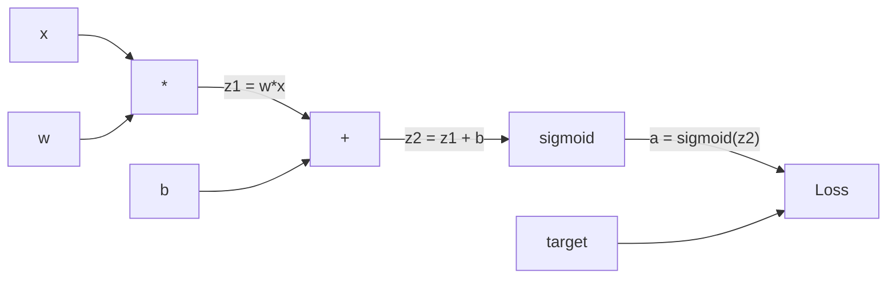
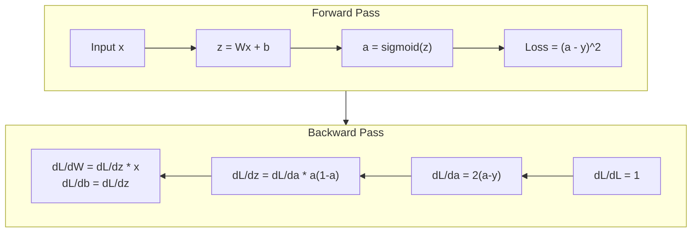
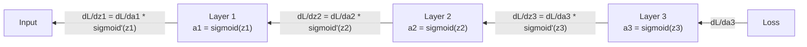

# Обратное распространение с нуля

> Обратное распространение (backpropagation) - это алгоритм, который делает обучение возможным. Без него нейронные сети были бы просто дорогими генераторами случайных чисел.

**Тип:** Сборка
**Языки:** Python
**Предварительные требования:** Урок 03.02 (многослойные сети, Multi-Layer Networks)
**Время:** ~120 минут

## Цели обучения

- Реализовать движок автоматического дифференцирования (autograd) на основе `Value`, который строит вычислительный граф и вычисляет градиенты через топологическую сортировку
- Вывести обратный проход для сложения, умножения и сигмоиды с помощью правила цепочки (chain rule)
- Обучить многослойную сеть на XOR и классификации окружности, используя только собственный движок обратного распространения
- Распознать проблему затухающего градиента (vanishing gradient) в глубоких сигмоидальных сетях и объяснить, почему градиенты убывают экспоненциально

## Проблема

У вашей сети один скрытый слой с 768 входами и 3072 выходами. Это 2 359 296 весов. Сеть сделала неправильное предсказание. Какие веса вызвали ошибку? Проверять каждый вес отдельно означает выполнить 2,3 миллиона прямых проходов. Обратное распространение вычисляет все 2,3 миллиона градиентов за один обратный проход. Это не оптимизация. Это разница между тем, что можно обучить, и тем, что невозможно.

Наивный подход: взять один вес, немного сдвинуть его, снова выполнить прямой проход и измерить, выросла или уменьшилась функция потерь. Так вы получите градиент для этого веса. Теперь сделайте это для каждого веса в сети. Умножьте на тысячи шагов обучения и миллионы точек данных. Чтобы обучить что-то полезное, понадобилось бы геологическое время.

Обратное распространение решает эту проблему. Один прямой проход, один обратный проход, все градиенты вычислены. Прием заключается в правиле цепочки из математического анализа, систематически примененном к вычислительному графу. Именно этот алгоритм сделал глубокое обучение практичным. Без него мы бы до сих пор застревали на игрушечных задачах.

## Концепция

### Правило цепочки применительно к сетям

Вы видели правило цепочки в Фазе 01, Уроке 05. Краткое напоминание: если y = f(g(x)), то dy/dx = f'(g(x)) * g'(x). Вы перемножаете производные вдоль цепочки.

В нейронной сети «цепочка» - это последовательность операций от входа до функции потерь. Каждый слой применяет веса, добавляет смещения и пропускает результат через активацию. Функция потерь сравнивает итоговый выход с целевым значением. Обратное распространение проходит по этой цепочке назад, вычисляя, как каждая операция внесла вклад в ошибку.

### Вычислительные графы

Каждый прямой проход строит граф. Каждый узел - это операция (умножение, сложение, сигмоида). Каждое ребро переносит значение вперед и градиент назад.



Прямой проход: значения текут слева направо. x и w дают z1 = w*x. Добавляем b и получаем z2. Сигмоида дает активацию a. Сравниваем a с целью y с помощью функции потерь.

Обратный проход: градиенты текут справа налево. Начинаем с dL/da (как потери меняются при изменении активации). Умножаем на da/dz2 (производную сигмоиды). Получаем dL/dz2. Разделяем его на dL/db (он равен dL/dz2, поскольку z2 = z1 + b) и dL/dz1. Затем dL/dw = dL/dz1 * x и dL/dx = dL/dz1 * w.

У каждого узла графа в обратном проходе одна задача: взять градиент, пришедший сверху, умножить его на локальную производную и передать вниз.

### Прямой и обратный проход



Прямой проход сохраняет каждое промежуточное значение: z, a, входы каждого слоя. Обратному проходу нужны эти сохраненные значения, чтобы вычислять градиенты. Это компромисс между памятью и вычислениями в основе backprop: вы тратите память на хранение активаций ради скорости - одного прохода вместо миллионов.

### Поток градиентов через сеть

Для трехслойной сети градиенты проходят цепочкой через каждый слой:



На каждом слое градиент умножается на производную сигмоиды. Производная сигмоиды равна a * (1 - a), и ее максимум 0.25 (когда a = 0.5). На глубине трех слоев градиент уже умножен максимум на 0.25^3 = 0.0156. На глубине десяти слоев: 0.25^10 = 0.000001.

### Затухающие градиенты

Это и есть проблема затухающего градиента. Сигмоида сжимает выход в диапазон от 0 до 1. Ее производная всегда меньше 0.25. Если сложить достаточно сигмоидальных слоев, градиенты сжимаются почти до нуля. Ранние слои почти не учатся, потому что получают почти нулевые градиенты.

```
sigmoid(z):     Output range [0, 1]
sigmoid'(z):    Max value 0.25 (at z = 0)

After 5 layers:   gradient * 0.25^5 = 0.001x original
After 10 layers:  gradient * 0.25^10 = 0.000001x original
```

Именно поэтому глубокие сигмоидальные сети почти невозможно обучать. Исправление - ReLU и его варианты - тема Урока 04. Сейчас важно понять: backprop работает правильно. Проблема в том, через что он проходит.

### Вывод градиентов для двухслойной сети

Конкретная математика для сети с входом x, скрытым слоем с сигмоидой, выходным слоем с сигмоидой и MSE-потерей.

Прямой проход:
```
z1 = W1 * x + b1
a1 = sigmoid(z1)
z2 = W2 * a1 + b2
a2 = sigmoid(z2)
L = (a2 - y)^2
```

Обратный проход (пошаговое применение правила цепочки):
```
dL/da2 = 2(a2 - y)
da2/dz2 = a2 * (1 - a2)
dL/dz2 = dL/da2 * da2/dz2 = 2(a2 - y) * a2 * (1 - a2)

dL/dW2 = dL/dz2 * a1
dL/db2 = dL/dz2

dL/da1 = dL/dz2 * W2
da1/dz1 = a1 * (1 - a1)
dL/dz1 = dL/da1 * da1/dz1

dL/dW1 = dL/dz1 * x
dL/db1 = dL/dz1
```

Каждый градиент - это произведение локальных производных, прослеженных назад от функции потерь. Это все, чем является обратное распространение.

## Соберите это

### Шаг 1: Узел Value

Каждое число в нашем вычислении становится `Value`. Оно хранит свои данные, свой градиент и то, как было создано, чтобы знать, как вычислять градиенты назад.

```python
class Value:
    def __init__(self, data, children=(), op=''):
        self.data = data
        self.grad = 0.0
        self._backward = lambda: None
        self._children = set(children)
        self._op = op

    def __repr__(self):
        return f"Value(data={self.data:.4f}, grad={self.grad:.4f})"
```

Градиента пока нет (0.0). Обратной функции пока нет (no-op). `_children` отслеживает, какие `Value` породили это значение, чтобы позже можно было топологически отсортировать граф.

### Шаг 2: Операции с обратными функциями

Каждая операция создает новое `Value` и определяет, как градиенты текут назад через нее.

```python
def __add__(self, other):
    other = other if isinstance(other, Value) else Value(other)
    out = Value(self.data + other.data, (self, other), '+')

    def _backward():
        self.grad += out.grad
        other.grad += out.grad

    out._backward = _backward
    return out

def __mul__(self, other):
    other = other if isinstance(other, Value) else Value(other)
    out = Value(self.data * other.data, (self, other), '*')

    def _backward():
        self.grad += other.data * out.grad
        other.grad += self.data * out.grad

    out._backward = _backward
    return out
```

Для сложения: d(a+b)/da = 1, d(a+b)/db = 1. Поэтому оба входа напрямую получают градиент выхода.

Для умножения: d(a*b)/da = b, d(a*b)/db = a. Каждый вход получает значение другого входа, умноженное на градиент выхода.

`+=` критически важен. Одно `Value` может использоваться в нескольких операциях. Его градиент - сумма градиентов из всех путей.

### Шаг 3: Сигмоида и функция потерь

```python
import math

def sigmoid(self):
    x = self.data
    x = max(-500, min(500, x))
    s = 1.0 / (1.0 + math.exp(-x))
    out = Value(s, (self,), 'sigmoid')

    def _backward():
        self.grad += (s * (1 - s)) * out.grad

    out._backward = _backward
    return out
```

Производная сигмоиды: sigmoid(x) * (1 - sigmoid(x)). Мы вычислили sigmoid(x) = s во время прямого прохода. Переиспользуем его. Никакой лишней работы.

```python
def mse_loss(predicted, target):
    diff = predicted + Value(-target)
    return diff * diff
```

MSE для одного выхода: (predicted - target)^2. Вычитание выражаем как сложение с отрицательным `Value`.

### Шаг 4: Обратный проход

Топологическая сортировка гарантирует, что мы обрабатываем узлы в правильном порядке: градиент узла полностью накоплен до того, как мы проталкиваем его дальше.

```python
def backward(self):
    topo = []
    visited = set()

    def build_topo(v):
        if v not in visited:
            visited.add(v)
            for child in v._children:
                build_topo(child)
            topo.append(v)

    build_topo(self)
    self.grad = 1.0
    for v in reversed(topo):
        v._backward()
```

Начинаем с потерь (градиент = 1.0, потому что dL/dL = 1). Идем назад по отсортированному графу. `_backward` каждого узла проталкивает градиенты к его дочерним узлам.

### Шаг 5: Слой и сеть

```python
import random

class Neuron:
    def __init__(self, n_inputs):
        scale = (2.0 / n_inputs) ** 0.5
        self.weights = [Value(random.uniform(-scale, scale)) for _ in range(n_inputs)]
        self.bias = Value(0.0)

    def __call__(self, x):
        act = sum((wi * xi for wi, xi in zip(self.weights, x)), self.bias)
        return act.sigmoid()

    def parameters(self):
        return self.weights + [self.bias]


class Layer:
    def __init__(self, n_inputs, n_outputs):
        self.neurons = [Neuron(n_inputs) for _ in range(n_outputs)]

    def __call__(self, x):
        out = [n(x) for n in self.neurons]
        return out[0] if len(out) == 1 else out

    def parameters(self):
        params = []
        for n in self.neurons:
            params.extend(n.parameters())
        return params


class Network:
    def __init__(self, sizes):
        self.layers = []
        for i in range(len(sizes) - 1):
            self.layers.append(Layer(sizes[i], sizes[i + 1]))

    def __call__(self, x):
        for layer in self.layers:
            x = layer(x)
            if not isinstance(x, list):
                x = [x]
        return x[0] if len(x) == 1 else x

    def parameters(self):
        params = []
        for layer in self.layers:
            params.extend(layer.parameters())
        return params

    def zero_grad(self):
        for p in self.parameters():
            p.grad = 0.0
```

Нейрон принимает входы, вычисляет взвешенную сумму + смещение и применяет сигмоиду. Инициализация весов масштабируется как sqrt(2/n_inputs), чтобы предотвращать насыщение сигмоиды в более глубоких сетях. Слой - это список нейронов. Сеть - список слоев. Метод `parameters()` собирает все обучаемые `Value`, чтобы мы могли их обновлять.

### Шаг 6: Обучение на XOR

```python
random.seed(42)
net = Network([2, 4, 1])

xor_data = [
    ([0.0, 0.0], 0.0),
    ([0.0, 1.0], 1.0),
    ([1.0, 0.0], 1.0),
    ([1.0, 1.0], 0.0),
]

learning_rate = 1.0

for epoch in range(1000):
    total_loss = Value(0.0)
    for inputs, target in xor_data:
        x = [Value(i) for i in inputs]
        pred = net(x)
        loss = mse_loss(pred, target)
        total_loss = total_loss + loss

    net.zero_grad()
    total_loss.backward()

    for p in net.parameters():
        p.data -= learning_rate * p.grad

    if epoch % 100 == 0:
        print(f"Epoch {epoch:4d} | Loss: {total_loss.data:.6f}")

print("\nXOR Results:")
for inputs, target in xor_data:
    x = [Value(i) for i in inputs]
    pred = net(x)
    print(f"  {inputs} -> {pred.data:.4f} (expected {target})")
```

Наблюдайте, как уменьшается потеря. От случайных предсказаний к правильным выходам XOR - все это происходит благодаря обратному распространению, которое вычисляет градиенты и сдвигает веса в правильном направлении.

### Шаг 7: Классификация окружности

В Уроке 02 вы вручную подбирали веса для классификации окружности. Теперь пусть сеть выучит их сама.

```python
random.seed(7)

def generate_circle_data(n=100):
    data = []
    for _ in range(n):
        x1 = random.uniform(-1.5, 1.5)
        x2 = random.uniform(-1.5, 1.5)
        label = 1.0 if x1 * x1 + x2 * x2 < 1.0 else 0.0
        data.append(([x1, x2], label))
    return data

circle_data = generate_circle_data(80)

circle_net = Network([2, 8, 1])
learning_rate = 0.5

for epoch in range(2000):
    random.shuffle(circle_data)
    total_loss_val = 0.0
    for inputs, target in circle_data:
        x = [Value(i) for i in inputs]
        pred = circle_net(x)
        loss = mse_loss(pred, target)
        circle_net.zero_grad()
        loss.backward()
        for p in circle_net.parameters():
            p.data -= learning_rate * p.grad
        total_loss_val += loss.data

    if epoch % 200 == 0:
        correct = 0
        for inputs, target in circle_data:
            x = [Value(i) for i in inputs]
            pred = circle_net(x)
            predicted_class = 1.0 if pred.data > 0.5 else 0.0
            if predicted_class == target:
                correct += 1
        accuracy = correct / len(circle_data) * 100
        print(f"Epoch {epoch:4d} | Loss: {total_loss_val:.4f} | Accuracy: {accuracy:.1f}%")
```

Здесь мы используем онлайн-SGD - обновляем веса после каждого примера, а не накапливаем полный батч. Это быстрее ломает симметрию и помогает избежать насыщения сигмоиды на полном ландшафте потерь. Перемешивание данных в каждую эпоху не дает сети запоминать порядок.

Никакой ручной настройки. Сеть сама находит круговую границу решения. В этом сила обратного распространения: вы задаете архитектуру, функцию потерь и данные. Алгоритм сам подбирает веса.

## Используйте это

PyTorch делает все описанное выше в несколько строк. Основная идея та же: autograd строит вычислительный граф во время прямого прохода и проходит по нему назад, чтобы вычислить градиенты.

```python
import torch
import torch.nn as nn

model = nn.Sequential(
    nn.Linear(2, 4),
    nn.Sigmoid(),
    nn.Linear(4, 1),
    nn.Sigmoid(),
)
optimizer = torch.optim.SGD(model.parameters(), lr=1.0)
criterion = nn.MSELoss()

X = torch.tensor([[0,0],[0,1],[1,0],[1,1]], dtype=torch.float32)
y = torch.tensor([[0],[1],[1],[0]], dtype=torch.float32)

for epoch in range(1000):
    pred = model(X)
    loss = criterion(pred, y)
    optimizer.zero_grad()
    loss.backward()
    optimizer.step()

print("PyTorch XOR Results:")
with torch.no_grad():
    for i in range(4):
        pred = model(X[i])
        print(f"  {X[i].tolist()} -> {pred.item():.4f} (expected {y[i].item()})")
```

`loss.backward()` - это ваш `total_loss.backward()`. `optimizer.step()` - ваше ручное `p.data -= lr * p.grad`. `optimizer.zero_grad()` - ваш `net.zero_grad()`. Тот же алгоритм, промышленная реализация. PyTorch берет на себя ускорение на GPU, смешанную точность (mixed precision), контрольные точки градиентов (gradient checkpointing) и сотни типов слоев. Но обратный проход - все то же правило цепочки, примененное к тому же вычислительному графу.

Обучение выполняет прямой проход, затем обратный проход, затем обновляет веса. Инференс выполняет только прямой проход. Без градиентов, без обновлений. Это различие важно, потому что именно инференс происходит в продакшене. Когда вы вызываете API вроде Claude или GPT, вы запускаете инференс: ваш промпт проходит вперед через сеть, а токены выходят с другой стороны. Веса не меняются. Понимание backprop важно, потому что он сформировал каждый вес в этой сети.

## Отправьте это

Этот урок создает:
- `outputs/prompt-gradient-debugger.md` - переиспользуемый промпт для диагностики проблем с градиентами (затухание, взрыв, NaN) в любой нейронной сети

## Упражнения

1. Добавьте метод `__sub__` в класс `Value` (a - b = a + (-1 * b)). Затем реализуйте метод `__neg__`. Проверьте, что градиенты корректны, сравнив их с ручным расчетом для простого выражения вроде (a - b)^2.

2. Добавьте метод `relu` в `Value` (выход max(0, x), производная равна 1, если x > 0, иначе 0). Замените сигмоиду на relu в скрытых слоях и снова обучите на XOR. Сравните скорость сходимости. Вы должны увидеть более быстрое обучение - это предварительный взгляд на Урок 04.

3. Реализуйте метод `__pow__` для `Value` для целых степеней. Используйте его, чтобы заменить `mse_loss` на корректное выражение `(predicted - target) ** 2`. Проверьте, что градиенты совпадают с исходной реализацией.

4. Добавьте отсечение градиентов (gradient clipping) в цикл обучения: после вызова `backward()` ограничьте все градиенты диапазоном [-1, 1]. Обучите более глубокую сеть (4+ слоя с сигмоидой) и сравните кривые потерь с отсечением и без него. Это ваша первая защита от взрывающихся градиентов.

5. Постройте визуализацию: после обучения на XOR напечатайте градиент каждого параметра в сети. Определите, в каком слое самые маленькие градиенты. Это демонстрирует проблему затухающего градиента, о которой вы читали в разделе «Концепция».

## Ключевые термины

| Термин | Как говорят | Что это на самом деле означает |
|------|----------------|----------------------|
| Обратное распространение (Backpropagation) | «Сеть учится» | Алгоритм, который вычисляет dL/dw для каждого веса, применяя правило цепочки назад через вычислительный граф |
| Вычислительный граф (Computational graph) | «Структура сети» | Направленный ациклический граф, где узлы - операции, а ребра переносят значения (вперед) и градиенты (назад) |
| Правило цепочки (Chain rule) | «Перемножить производные» | Если y = f(g(x)), то dy/dx = f'(g(x)) * g'(x) - математическая основа обратного распространения |
| Градиент (Gradient) | «Направление наискорейшего роста» | Частная производная потерь по параметру: показывает, как изменить этот параметр, чтобы уменьшить потерю |
| Затухающий градиент (Vanishing gradient) | «Глубокие сети не учатся» | Градиенты экспоненциально уменьшаются при распространении через слои с насыщаемыми активациями вроде сигмоиды |
| Прямой проход (Forward pass) | «Запуск сети» | Вычисление выхода из входов путем последовательного применения операций каждого слоя и сохранения промежуточных значений |
| Обратный проход (Backward pass) | «Вычисление градиентов» | Обход вычислительного графа в обратном направлении с накоплением градиентов в каждом узле по правилу цепочки |
| Скорость обучения (Learning rate) | «Как быстро она учится» | Скаляр, управляющий размером шага при обновлении весов: w_new = w_old - lr * gradient |
| Топологическая сортировка (Topological sort) | «Правильный порядок» | Упорядочивание узлов графа, при котором каждый узел идет после всех узлов, от которых зависит; это гарантирует полное накопление градиентов перед распространением |
| Автоградиент (Autograd) | «Автоматическое дифференцирование» | Система, которая строит вычислительные графы во время прямых вычислений и автоматически вычисляет градиенты; именно это делает движок PyTorch |

## Дополнительное чтение

- Rumelhart, Hinton & Williams, "Learning representations by back-propagating errors" (1986) - статья, которая сделала обратное распространение массовым подходом и открыла обучение многослойных сетей
- 3Blue1Brown, серия "Neural Networks" (https://www.youtube.com/playlist?list=PLZHQObOWTQDNU6R1_67000Dx_ZCJB-3pi) - лучшее визуальное объяснение обратного распространения и потока градиентов через сети
