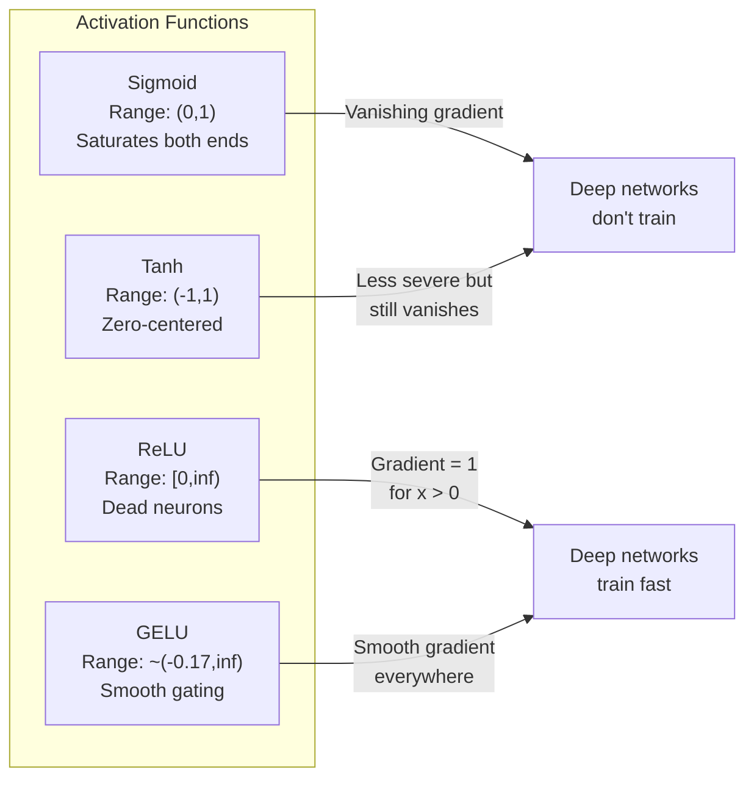
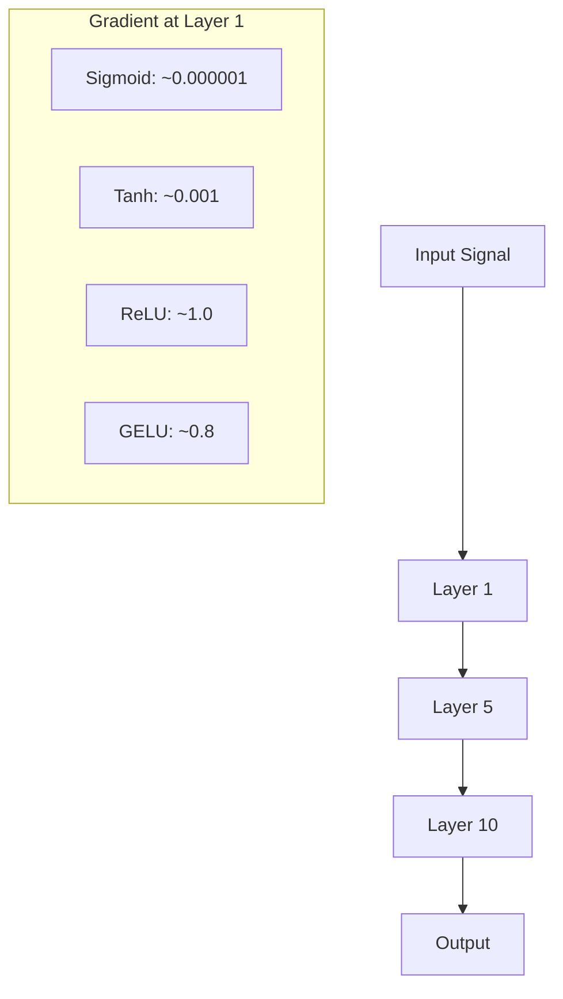
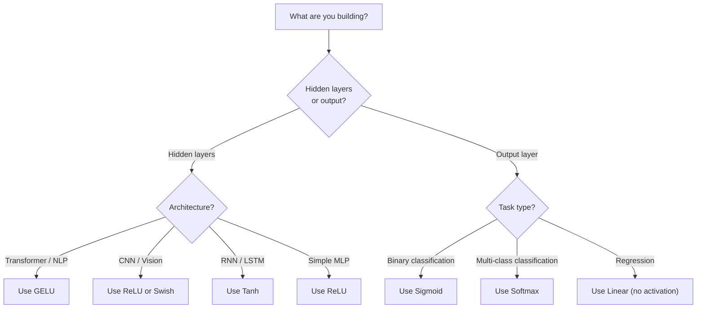

# Функции активации

> Без нелинейности ваша 100-слойная сеть - это просто изящное умножение матриц. Активации - это ворота, которые позволяют нейронным сетям мыслить кривыми.

**Тип:** Сборка
**Языки:** Python
**Предварительные требования:** Урок 03.03 (обратное распространение, Backpropagation)
**Время:** ~75 минут

## Цели обучения

- Реализовать sigmoid, tanh, ReLU, Leaky ReLU, GELU, Swish и softmax вместе с их производными с нуля
- Диагностировать проблему затухающего градиента, измеряя величины активаций через 10+ слоев с разными активациями
- Обнаруживать мертвые нейроны (dead neurons) в ReLU-сети и объяснять, почему GELU избегает этого режима отказа
- Выбирать правильную функцию активации для заданной архитектуры (transformer, CNN, RNN, выходной слой)

## Проблема

Сложите два линейных преобразования: y = W2(W1x + b1) + b2. Раскройте скобки: y = W2W1x + W2b1 + b2. Это просто y = Ax + c - одно линейное преобразование. Сколько бы линейных слоев вы ни сложили, результат сворачивается в одно умножение на матрицу. У вашей 100-слойной сети такая же выразительная сила, как у одного слоя.

Это не теоретическая диковинка. Это означает, что глубокая линейная сеть буквально не может выучить XOR, не может классифицировать спиральный набор данных, не может распознать лицо. Без функций активации глубина - иллюзия.

Функции активации ломают линейность. Они деформируют выход каждого слоя через нелинейную функцию, давая сети возможность изгибать границы решений, приближать произвольные функции и действительно учиться. Но выберите неправильную активацию - и ваши градиенты затухнут до нуля (sigmoid в глубоких сетях), взорвутся до бесконечности (неограниченные активации без аккуратной инициализации) или нейроны умрут навсегда (ReLU с большими отрицательными смещениями). Выбор функции активации напрямую определяет, будет ли сеть вообще учиться.

## Концепция

### Почему нелинейность необходима

Умножение матриц композиционно. Умножить вектор на матрицу A, а затем на матрицу B - то же самое, что умножить на AB. Поэтому стек из десяти линейных слоев математически эквивалентен одному линейному слою с одной большой матрицей. Все эти параметры, вся эта глубина - впустую. Нужно что-то, что разорвет цепочку. Это и делают функции активации.

Вот доказательство. Линейный слой вычисляет f(x) = Wx + b. Сложим два:

```
Layer 1: h = W1 * x + b1
Layer 2: y = W2 * h + b2
```

Подставим:

```
y = W2 * (W1 * x + b1) + b2
y = (W2 * W1) * x + (W2 * b1 + b2)
y = A * x + c
```

Один слой. Вставим между слоями нелинейную активацию g():

```
h = g(W1 * x + b1)
y = W2 * h + b2
```

Теперь подстановка ломается. W2 * g(W1 * x + b1) + b2 нельзя свести к одному линейному преобразованию. Сеть может представлять нелинейные функции. Каждый дополнительный слой с активацией добавляет выразительную способность.

### Sigmoid

Изначальная функция активации для нейронных сетей.

```
sigmoid(x) = 1 / (1 + e^(-x))
```

Диапазон выхода: (0, 1). Гладкая, дифференцируемая, отображает любое вещественное число в значение, похожее на вероятность.

Производная:

```
sigmoid'(x) = sigmoid(x) * (1 - sigmoid(x))
```

Максимальное значение этой производной равно 0.25 и достигается при x = 0. При обратном распространении градиенты перемножаются через слои. Десять слоев sigmoid означают, что градиент умножается максимум на 0.25 десять раз:

```
0.25^10 = 0.000000953674
```

Меньше одной миллионной исходного сигнала. Это проблема затухающего градиента. Градиенты в ранних слоях становятся настолько малы, что веса почти не обновляются. Кажется, что сеть учится - потеря уменьшается в поздних слоях, - но первые слои заморожены. Глубокие sigmoid-сети просто не обучаются.

Дополнительная проблема: выходы sigmoid всегда положительны (от 0 до 1), поэтому градиенты по весам всегда имеют один и тот же знак. Это вызывает зигзагообразное движение при градиентном спуске.

### Tanh

Центрированная версия sigmoid.

```
tanh(x) = (e^x - e^(-x)) / (e^x + e^(-x))
```

Диапазон выхода: (-1, 1). Центрирована вокруг нуля, что устраняет проблему зигзагов.

Производная:

```
tanh'(x) = 1 - tanh(x)^2
```

Максимальная производная равна 1.0 при x = 0 - в четыре раза лучше, чем у sigmoid. Но проблема затухающего градиента все равно остается. Для больших положительных или отрицательных входов производная стремится к нулю. Десять слоев все равно раздавят градиент, просто менее агрессивно.

### ReLU: прорыв

Rectified Linear Unit. Популяризирована для глубокого обучения Nair и Hinton в 2010 году (сама функция восходит к работе Fukushima 1969 года), она изменила все.

```
relu(x) = max(0, x)
```

Диапазон выхода: [0, infinity). Производная тривиально проста:

```
relu'(x) = 1  if x > 0
            0  if x <= 0
```

Нет затухающего градиента для положительных входов. Градиент ровно 1 и проходит прямо дальше. Поэтому глубокие сети стали обучаемыми: ReLU сохраняет величину градиента между слоями.

Но есть режим отказа: проблема мертвого нейрона. Если взвешенный вход нейрона всегда отрицателен (из-за большого отрицательного смещения или неудачной инициализации весов), его выход всегда равен нулю, его градиент всегда равен нулю, и он никогда не обновляется. Он навсегда мертв. На практике 10-40% нейронов в ReLU-сети могут умереть во время обучения.

### Leaky ReLU

Самое простое исправление для мертвых нейронов.

```
leaky_relu(x) = x        if x > 0
                alpha * x if x <= 0
```

Где alpha - маленькая константа, обычно 0.01. У отрицательной стороны есть небольшой наклон вместо нуля, поэтому мертвые нейроны все еще получают градиентный сигнал и могут восстановиться.

### GELU: современный стандарт

Gaussian Error Linear Unit. Представлена Hendrycks и Gimpel в 2016 году. Активация по умолчанию в BERT, GPT и большинстве современных трансформеров.

```
gelu(x) = x * Phi(x)
```

Где Phi(x) - функция распределения стандартного нормального распределения. Приближение, используемое на практике:

```
gelu(x) ~= 0.5 * x * (1 + tanh(sqrt(2/pi) * (x + 0.044715 * x^3)))
```

GELU гладкая везде, допускает небольшие отрицательные значения (в отличие от ReLU, которая жестко обрезает их до нуля), и имеет вероятностную интерпретацию: она взвешивает каждый вход по тому, насколько вероятно, что он положителен при гауссовом распределении. Такое гладкое управление превосходит ReLU в архитектурах трансформеров, потому что дает лучший поток градиентов и полностью избегает проблемы мертвых нейронов.

### Swish / SiLU

Самоуправляемая активация, найденная Ramachandran и соавторами в 2017 году с помощью автоматического поиска.

```
swish(x) = x * sigmoid(x)
```

Формально Swish - это x * sigmoid(x). Google обнаружила ее автоматическим поиском по пространству функций активации: нейронная сеть проектировала части нейронных сетей.

Как и GELU, она гладкая, немонотонная и допускает небольшие отрицательные значения. Разница тонкая: Swish использует sigmoid для управления, а GELU использует гауссову CDF. На практике качество почти одинаковое. Swish используется в EfficientNet и некоторых моделях компьютерного зрения. GELU доминирует в языковых моделях.

### Softmax: выходная активация

Не используется в скрытых слоях. Softmax превращает вектор сырых оценок (логитов) в распределение вероятностей.

```
softmax(x_i) = e^(x_i) / sum(e^(x_j) for all j)
```

Каждый выход находится между 0 и 1. Все выходы суммируются в 1. Поэтому это стандартная финальная активация для многоклассовой классификации. Самый большой логит получает самую высокую вероятность, но в отличие от argmax, softmax дифференцируема и сохраняет информацию об относительной уверенности.

### Сравнение форм



### Сравнение потока градиентов



### Какую активацию когда использовать



## Соберите это

### Шаг 1: Реализуйте все функции активации с производными

Каждая функция принимает один `float` и возвращает `float`. Каждая функция производной принимает тот же вход и возвращает градиент.

```python
import math

def sigmoid(x):
    x = max(-500, min(500, x))
    return 1.0 / (1.0 + math.exp(-x))

def sigmoid_derivative(x):
    s = sigmoid(x)
    return s * (1 - s)

def tanh_act(x):
    return math.tanh(x)

def tanh_derivative(x):
    t = math.tanh(x)
    return 1 - t * t

def relu(x):
    return max(0.0, x)

def relu_derivative(x):
    return 1.0 if x > 0 else 0.0

def leaky_relu(x, alpha=0.01):
    return x if x > 0 else alpha * x

def leaky_relu_derivative(x, alpha=0.01):
    return 1.0 if x > 0 else alpha

def gelu(x):
    return 0.5 * x * (1 + math.tanh(math.sqrt(2 / math.pi) * (x + 0.044715 * x ** 3)))

def gelu_derivative(x):
    phi = 0.5 * (1 + math.erf(x / math.sqrt(2)))
    pdf = math.exp(-0.5 * x * x) / math.sqrt(2 * math.pi)
    return phi + x * pdf

def swish(x):
    return x * sigmoid(x)

def swish_derivative(x):
    s = sigmoid(x)
    return s + x * s * (1 - s)

def softmax(xs):
    max_x = max(xs)
    exps = [math.exp(x - max_x) for x in xs]
    total = sum(exps)
    return [e / total for e in exps]
```

### Шаг 2: Визуализируйте, где умирают градиенты

Вычислите градиент в 100 равномерно расположенных точках от -5 до 5. Напечатайте текстовую гистограмму, показывающую, где градиент каждой активации близок к нулю.

```python
def gradient_scan(name, derivative_fn, start=-5, end=5, n=100):
    step = (end - start) / n
    near_zero = 0
    healthy = 0
    for i in range(n):
        x = start + i * step
        g = derivative_fn(x)
        if abs(g) < 0.01:
            near_zero += 1
        else:
            healthy += 1
    pct_dead = near_zero / n * 100
    print(f"{name:15s}: {healthy:3d} healthy, {near_zero:3d} near-zero ({pct_dead:.0f}% dead zone)")

gradient_scan("Sigmoid", sigmoid_derivative)
gradient_scan("Tanh", tanh_derivative)
gradient_scan("ReLU", relu_derivative)
gradient_scan("Leaky ReLU", leaky_relu_derivative)
gradient_scan("GELU", gelu_derivative)
gradient_scan("Swish", swish_derivative)
```

### Шаг 3: Эксперимент с затухающим градиентом

Пропустите сигнал прямым проходом через N слоев, используя sigmoid и ReLU. Измерьте, как меняется величина активации.

```python
import random

def vanishing_gradient_experiment(activation_fn, name, n_layers=10, n_inputs=5):
    random.seed(42)
    values = [random.gauss(0, 1) for _ in range(n_inputs)]

    print(f"\n{name} through {n_layers} layers:")
    for layer in range(n_layers):
        weights = [random.gauss(0, 1) for _ in range(n_inputs)]
        z = sum(w * v for w, v in zip(weights, values))
        activated = activation_fn(z)
        magnitude = abs(activated)
        bar = "#" * int(magnitude * 20)
        print(f"  Layer {layer+1:2d}: magnitude = {magnitude:.6f} {bar}")
        values = [activated] * n_inputs

vanishing_gradient_experiment(sigmoid, "Sigmoid")
vanishing_gradient_experiment(relu, "ReLU")
vanishing_gradient_experiment(gelu, "GELU")
```

### Шаг 4: Детектор мертвых нейронов

Создайте ReLU-сеть, пропустите через нее случайные входы и посчитайте, сколько нейронов ни разу не активировались.

```python
def dead_neuron_detector(n_inputs=5, hidden_size=20, n_samples=1000):
    random.seed(0)
    weights = [[random.gauss(0, 1) for _ in range(n_inputs)] for _ in range(hidden_size)]
    biases = [random.gauss(0, 1) for _ in range(hidden_size)]

    fire_counts = [0] * hidden_size

    for _ in range(n_samples):
        inputs = [random.gauss(0, 1) for _ in range(n_inputs)]
        for neuron_idx in range(hidden_size):
            z = sum(w * x for w, x in zip(weights[neuron_idx], inputs)) + biases[neuron_idx]
            if relu(z) > 0:
                fire_counts[neuron_idx] += 1

    dead = sum(1 for c in fire_counts if c == 0)
    rarely_fire = sum(1 for c in fire_counts if 0 < c < n_samples * 0.05)
    healthy = hidden_size - dead - rarely_fire

    print(f"\nDead Neuron Report ({hidden_size} neurons, {n_samples} samples):")
    print(f"  Dead (never fired):     {dead}")
    print(f"  Barely alive (<5%):     {rarely_fire}")
    print(f"  Healthy:                {healthy}")
    print(f"  Dead neuron rate:       {dead/hidden_size*100:.1f}%")

    for i, c in enumerate(fire_counts):
        status = "DEAD" if c == 0 else "WEAK" if c < n_samples * 0.05 else "OK"
        bar = "#" * (c * 40 // n_samples)
        print(f"  Neuron {i:2d}: {c:4d}/{n_samples} fires [{status:4s}] {bar}")

dead_neuron_detector()
```

### Шаг 5: Сравнение обучения - Sigmoid, ReLU и GELU

Обучите одну и ту же двухслойную сеть на наборе данных окружности (точки внутри окружности = класс 1, снаружи = класс 0) с тремя разными активациями. Сравните скорость сходимости.

```python
def make_circle_data(n=200, seed=42):
    random.seed(seed)
    data = []
    for _ in range(n):
        x = random.uniform(-2, 2)
        y = random.uniform(-2, 2)
        label = 1.0 if x * x + y * y < 1.5 else 0.0
        data.append(([x, y], label))
    return data


class ActivationNetwork:
    def __init__(self, activation_fn, activation_deriv, hidden_size=8, lr=0.1):
        random.seed(0)
        self.act = activation_fn
        self.act_d = activation_deriv
        self.lr = lr
        self.hidden_size = hidden_size

        self.w1 = [[random.gauss(0, 0.5) for _ in range(2)] for _ in range(hidden_size)]
        self.b1 = [0.0] * hidden_size
        self.w2 = [random.gauss(0, 0.5) for _ in range(hidden_size)]
        self.b2 = 0.0

    def forward(self, x):
        self.x = x
        self.z1 = []
        self.h = []
        for i in range(self.hidden_size):
            z = self.w1[i][0] * x[0] + self.w1[i][1] * x[1] + self.b1[i]
            self.z1.append(z)
            self.h.append(self.act(z))

        self.z2 = sum(self.w2[i] * self.h[i] for i in range(self.hidden_size)) + self.b2
        self.out = sigmoid(self.z2)
        return self.out

    def backward(self, target):
        error = self.out - target
        d_out = error * self.out * (1 - self.out)

        for i in range(self.hidden_size):
            d_h = d_out * self.w2[i] * self.act_d(self.z1[i])
            self.w2[i] -= self.lr * d_out * self.h[i]
            for j in range(2):
                self.w1[i][j] -= self.lr * d_h * self.x[j]
            self.b1[i] -= self.lr * d_h
        self.b2 -= self.lr * d_out

    def train(self, data, epochs=200):
        losses = []
        for epoch in range(epochs):
            total_loss = 0
            correct = 0
            for x, y in data:
                pred = self.forward(x)
                self.backward(y)
                total_loss += (pred - y) ** 2
                if (pred >= 0.5) == (y >= 0.5):
                    correct += 1
            avg_loss = total_loss / len(data)
            accuracy = correct / len(data) * 100
            losses.append(avg_loss)
            if epoch % 50 == 0 or epoch == epochs - 1:
                print(f"    Epoch {epoch:3d}: loss={avg_loss:.4f}, accuracy={accuracy:.1f}%")
        return losses


data = make_circle_data()

configs = [
    ("Sigmoid", sigmoid, sigmoid_derivative),
    ("ReLU", relu, relu_derivative),
    ("GELU", gelu, gelu_derivative),
]

results = {}
for name, act_fn, act_d_fn in configs:
    print(f"\n=== Training with {name} ===")
    net = ActivationNetwork(act_fn, act_d_fn, hidden_size=8, lr=0.1)
    losses = net.train(data, epochs=200)
    results[name] = losses

print("\n=== Final Loss Comparison ===")
for name, losses in results.items():
    print(f"  {name:10s}: start={losses[0]:.4f} -> end={losses[-1]:.4f} (improvement: {(1 - losses[-1]/losses[0])*100:.1f}%)")
```

### Ожидаемый вывод

Запустите `code/main.py` — последние строки должны быть такими:

```
    Epoch 100: loss=0.0133, accuracy=98.5%
    Epoch 150: loss=0.0081, accuracy=99.5%
    Epoch 199: loss=0.0056, accuracy=99.5%

=== Final Loss Comparison ===
  Sigmoid   : start=0.2222 -> end=0.0319 (improvement: 85.6%)
  ReLU      : start=0.2232 -> end=0.0102 (improvement: 95.4%)
  GELU      : start=0.2225 -> end=0.0056 (improvement: 97.5%)
```

## Используйте это

PyTorch предоставляет все эти функции как в функциональной форме, так и в форме модулей:

```python
import torch
import torch.nn as nn
import torch.nn.functional as F

x = torch.randn(4, 10)

relu_out = F.relu(x)
gelu_out = F.gelu(x)
sigmoid_out = torch.sigmoid(x)
swish_out = F.silu(x)

logits = torch.randn(4, 5)
probs = F.softmax(logits, dim=1)

model = nn.Sequential(
    nn.Linear(10, 64),
    nn.GELU(),
    nn.Linear(64, 32),
    nn.GELU(),
    nn.Linear(32, 5),
)
```

Скрытые слои в transformer: GELU. Скрытые слои в CNN: ReLU. Выходной слой для классификации: softmax. Выходной слой для регрессии: ничего (линейный). Выходной слой для вероятностей: sigmoid. Вот и все. Начинайте с этих стандартных вариантов. Меняйте их только при наличии доказательств.

RNN и LSTM используют tanh для скрытого состояния и sigmoid для вентилей, но если вы сегодня строите что-то с нуля, вы, вероятно, не используете RNN. Если нейроны умирают в вашей ReLU-сети, переключитесь на GELU. Не тянитесь к Leaky ReLU без конкретной причины: GELU решает проблему мертвых нейронов и дает лучший поток градиентов.

## Отправьте это

Этот урок создает:
- `outputs/prompt-activation-selector.md` - переиспользуемый промпт, который помогает выбрать правильную функцию активации для любой архитектуры

## Упражнения

1. Реализуйте Parametric ReLU (PReLU), где отрицательный наклон alpha является обучаемым параметром. Обучите его на наборе окружности и сравните с фиксированным Leaky ReLU.

2. Запустите эксперимент с затухающим градиентом для 50 слоев вместо 10. Постройте график величины на каждом слое для sigmoid, tanh, ReLU и GELU. На каком слое сигнал каждой активации фактически достигает нуля?

3. Реализуйте ELU (Exponential Linear Unit): elu(x) = x, если x > 0, alpha * (e^x - 1), если x <= 0. Сравните долю мертвых нейронов с ReLU на той же сети.

4. Постройте «монитор здоровья градиентов», который работает во время обучения: на каждой эпохе вычисляйте среднюю величину градиента на каждом слое. Печатайте предупреждение, когда градиент любого слоя падает ниже 0.001 или превышает 100.

5. Измените сравнение обучения так, чтобы использовать набор XOR из Урока 01 вместо окружностей. Какая активация быстрее всего сходится на XOR? Почему это отличается от результатов на окружностях?

<details>
<summary>Решение — упражнение 4</summary>

```python
def gradient_health(layers):
    for i, layer in enumerate(layers):
        params = layer.parameters()
        g = sum(abs(p.grad) for p in params) / max(len(params), 1)
        if g < 1e-3:   print(f"  layer {i}: vanishing grad {g:.2e}")
        elif g > 100:  print(f"  layer {i}: exploding grad {g:.2e}")
```

Вызывайте после `backward()`, до шага оптимизатора. В глубокой сигмоидной сети предупреждения о затухании концентрируются в *ранних* слоях (эффект из урока 03 — производные с потолком 0.25 перемножаются к нулю); предупреждения о взрыве появляются при слишком большом learning rate или плохой инициализации.

</details>

## Ключевые термины

| Термин | Как говорят | Что это на самом деле означает |
|------|----------------|----------------------|
| Функция активации (Activation function) | «Нелинейная часть» | Функция, применяемая к выходу каждого нейрона, которая ломает линейность и позволяет сети учить нелинейные отображения |
| Затухающий градиент (Vanishing gradient) | «Градиенты исчезают в глубоких сетях» | Градиенты экспоненциально уменьшаются через слои, когда производная активации меньше 1, из-за чего ранние слои невозможно обучать |
| Взрывающийся градиент (Exploding gradient) | «Градиенты взрываются» | Градиенты экспоненциально растут через слои, когда эффективный множитель больше 1, вызывая нестабильное обучение |
| Мертвый нейрон (Dead neuron) | «Нейрон перестал учиться» | ReLU-нейрон, вход которого постоянно отрицателен, поэтому он дает нулевой выход и нулевой градиент |
| Sigmoid | «Сжимает значения в 0-1» | Логистическая функция 1/(1+e^-x), исторически важная, но вызывающая затухающие градиенты в глубоких сетях |
| ReLU | «Обрезает отрицательные значения до нуля» | max(0, x) - активация, сделавшая глубокое обучение практичным благодаря сохранению величины градиента |
| GELU | «Активация трансформеров» | Gaussian Error Linear Unit, гладкая активация, которая взвешивает входы по вероятности быть положительными |
| Swish/SiLU | «Самоуправляемая ReLU» | x * sigmoid(x), найдена автоматическим поиском, используется в EfficientNet |
| Softmax | «Превращает оценки в вероятности» | Нормализует вектор логитов в распределение вероятностей, где все значения находятся в (0,1) и суммируются в 1 |
| Leaky ReLU | «ReLU, которая не умирает» | max(alpha*x, x), где alpha мала (0.01), предотвращает мертвые нейроны, позволяя небольшие отрицательные градиенты |
| Насыщение (Saturation) | «Плоская часть sigmoid» | Области, где производная активации стремится к нулю и блокирует поток градиентов |
| Логит (Logit) | «Сырая оценка перед softmax» | Ненормализованный выход последнего слоя перед применением softmax или sigmoid |

## Дополнительное чтение

- Nair & Hinton, "Rectified Linear Units Improve Restricted Boltzmann Machines" (2010) - статья, которая представила ReLU и сделала возможным обучение глубоких сетей
- Hendrycks & Gimpel, "Gaussian Error Linear Units (GELUs)" (2016) - представила функцию активации, ставшую стандартом для трансформеров
- Ramachandran et al., "Searching for Activation Functions" (2017) - использовала автоматический поиск для обнаружения Swish и показала, что дизайн активаций можно автоматизировать
- Glorot & Bengio, "Understanding the difficulty of training deep feedforward neural networks" (2010) - статья, которая диагностировала затухающие/взрывающиеся градиенты и предложила инициализацию Xavier
- Goodfellow, Bengio, Courville, "Deep Learning" Chapter 6.3 (https://www.deeplearningbook.org/) - строгий разбор скрытых узлов и функций активации
