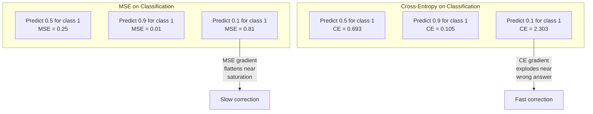
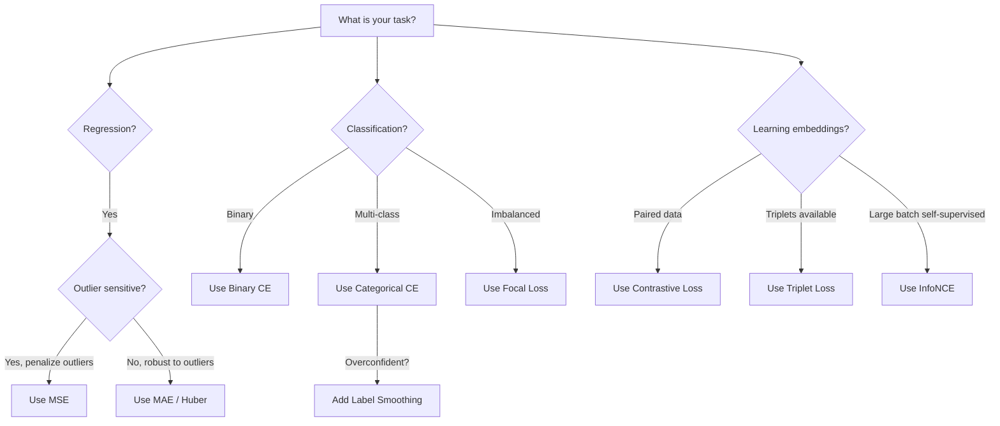
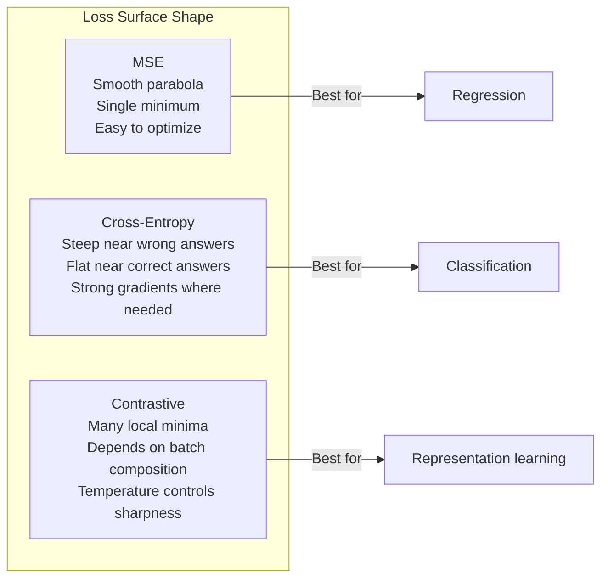

# Функции потерь

> Ваша сеть делает предсказание. Истинная разметка говорит другое. Насколько сильна ошибка? Это число и есть потеря. Выберите неправильную функцию потерь, и ваша модель будет оптимизировать совсем не то, что нужно.

**Тип:** Сборка
**Языки:** Python
**Предварительные требования:** Урок 03.04 (Функции активации)
**Время:** ~75 минут

## Цели обучения

- Реализовать MSE, бинарную кросс-энтропию (binary cross-entropy), категориальную кросс-энтропию (categorical cross-entropy) и контрастивную потерю (contrastive loss, InfoNCE) с нуля вместе с их градиентами
- Объяснить, почему MSE плохо работает для классификации, продемонстрировав режим отказа "предсказывать 0.5 для всего"
- Применить сглаживание меток (label smoothing) к кросс-энтропии и описать, как оно предотвращает чрезмерно уверенные предсказания
- Выбирать правильную функцию потерь для задач регрессии, бинарной классификации, многоклассовой классификации и обучения эмбеддингов

## Проблема

Модель, минимизирующая MSE в задаче классификации, будет уверенно предсказывать 0.5 для всего. Она минимизирует потерю. И при этом она бесполезна.

Функция потерь - единственное, что ваша модель на самом деле оптимизирует. Не accuracy. Не F1 score. Не любую метрику, которую вы показываете менеджеру. Оптимизатор берет градиент функции потерь и настраивает веса так, чтобы сделать это число меньше. Если функция потерь не отражает то, что вам важно, модель найдет математически самый дешевый способ ее удовлетворить, и этот способ почти никогда не совпадает с тем, чего вы хотели.

Вот конкретный пример. У вас задача бинарной классификации. Два класса, разделение 50/50. В качестве потери вы используете MSE. Модель предсказывает 0.5 для каждого входа. Средняя MSE равна 0.25, и это минимально возможное значение без реального обучения. У модели нулевая дискриминативная способность, но технически она минимизировала вашу функцию потерь. Переключитесь на кросс-энтропию, и та же модель будет вынуждена сдвигать предсказания к 0 или 1, потому что -log(0.5) = 0.693 - это ужасная потеря, тогда как -log(0.99) = 0.01 вознаграждает уверенные правильные предсказания. Выбор функции потерь - это разница между моделью, которая учится, и моделью, которая обыгрывает метрику.

Становится хуже. В самообучении (self-supervised learning) у вас даже нет меток. Контрастивная потеря полностью определяет обучающий сигнал: что считать похожим, что считать различным и насколько сильно модель должна их раздвигать. Ошибитесь в контрастивной потере, и ваши эмбеддинги схлопнутся в одну точку -- каждый вход будет отображаться в один и тот же вектор. Технически нулевая потеря. Полностью бесполезно.

## Концепция

### Среднеквадратичная ошибка (Mean Squared Error, MSE)

Стандартный выбор для регрессии. Вычислите квадрат разности между предсказанием и целевым значением и усредните по всем примерам.

```
MSE = (1/n) * sum((y_pred - y_true)^2)
```

Почему возведение в квадрат важно: оно штрафует большие ошибки квадратично. Ошибка 2 стоит в 4 раза больше, чем ошибка 1. Ошибка 10 стоит в 100 раз больше. Поэтому MSE чувствительна к выбросам -- одно сильно ошибочное предсказание доминирует в потере.

На числах: если ваша модель предсказывает цены на жилье и ошибается на $10,000 для большинства домов, но на $200,000 для одного особняка, MSE будет агрессивно пытаться исправить этот один особняк, потенциально ухудшая качество на остальных 99 домах.

Градиент MSE по предсказанию:

```
dMSE/dy_pred = (2/n) * (y_pred - y_true)
```

Он линейный по ошибке. Большие ошибки дают большие градиенты. Это преимущество для регрессии (большие ошибки требуют больших исправлений) и недостаток для классификации (нужно штрафовать уверенные неправильные ответы экспоненциально, а не линейно).

### Потеря кросс-энтропии (Cross-Entropy Loss)

Функция потерь для классификации. Она основана на теории информации -- измеряет расхождение между предсказанным распределением вероятностей и истинным распределением.

**Бинарная кросс-энтропия (Binary Cross-Entropy, BCE):**

```
BCE = -(y * log(p) + (1 - y) * log(1 - p))
```

Где y - истинная метка (0 или 1), а p - предсказанная вероятность.

Почему -log(p) работает: когда истинная метка равна 1 и вы предсказываете p = 0.99, потеря равна -log(0.99) = 0.01. Когда вы предсказываете p = 0.01, потеря равна -log(0.01) = 4.6. Эта разница в 460 раз и есть причина, почему кросс-энтропия работает. Она жестко наказывает уверенные неправильные предсказания и почти не штрафует уверенные правильные.

Градиент рассказывает ту же историю:

```
dBCE/dp = -(y/p) + (1-y)/(1-p)
```

Когда y = 1, а p близко к нулю, градиент равен -1/p и стремится к отрицательной бесконечности. Модель получает огромный сигнал исправить ошибку. Когда p близко к 1, градиент крошечный. Уже правильно, исправлять нечего.

**Категориальная кросс-энтропия (Categorical Cross-Entropy):**

Для многоклассовой классификации с целевыми значениями в one-hot кодировке.

```
CCE = -sum(y_i * log(p_i))
```

В потерю вносит вклад только истинный класс (потому что все остальные y_i равны нулю). Если есть 10 классов и правильный класс получает вероятность 0.1 (случайное угадывание), потеря равна -log(0.1) = 2.3. Если правильный класс получает вероятность 0.9, потеря равна -log(0.9) = 0.105. Модель учится концентрировать массу вероятности на правильном ответе.

### Почему MSE плохо работает для классификации



Градиенты MSE выравниваются, когда предсказания близки к 0 или 1 (из-за насыщения sigmoid). Градиенты кросс-энтропии это компенсируют -- -log отменяет плоские области sigmoid, давая сильные градиенты именно там, где они нужнее всего.

### Сглаживание меток (Label Smoothing)

Стандартные one-hot метки говорят: "это на 100% класс 3 и на 0% все остальное". Это сильное утверждение. Сглаживание меток его смягчает:

```
smooth_label = (1 - alpha) * one_hot + alpha / num_classes
```

При alpha = 0.1 и 10 классах вместо [0, 0, 1, 0, ...] целевое значение становится [0.01, 0.01, 0.91, 0.01, ...]. Модель целится в 0.91 вместо 1.0.

Почему это работает: модель, пытающаяся выдать ровно 1.0 через softmax, должна отправить logits в бесконечность. Это вызывает чрезмерную уверенность, ухудшает обобщение и делает модель хрупкой к сдвигу распределения. Сглаживание меток ограничивает целевое значение на 0.9 (при alpha=0.1), удерживая logits в разумном диапазоне. GPT и большинство современных моделей используют сглаживание меток или его эквивалент.

### Контрастивная потеря (Contrastive Loss)

Нет меток. Нет классов. Только пары входов и вопрос: они похожи или различны?

**Контрастивная потеря в стиле SimCLR (NT-Xent / InfoNCE):**

Возьмите одно изображение. Создайте два аугментированных представления (crop, rotate, color jitter). Это "positive pair" -- у них должны быть похожие эмбеддинги. Каждое другое изображение в батче образует "negative pair" -- у них должны быть разные эмбеддинги.

```
L = -log(exp(sim(z_i, z_j) / tau) / sum(exp(sim(z_i, z_k) / tau)))
```

Где sim() - косинусное сходство, z_i и z_j - positive pair, сумма идет по всем negatives, а tau (temperature) управляет резкостью распределения. Ниже temperature = более трудные negatives = более агрессивное разделение.

На числах: batch size 256 означает 255 negatives на positive pair. Temperature tau = 0.07 (значение по умолчанию в SimCLR). Потеря выглядит как softmax по сходствам -- она хочет, чтобы сходство positive pair было самым высоким среди всех 256 вариантов.

**Триплетная потеря (Triplet Loss):**

Берет три входа: anchor, positive (тот же класс), negative (другой класс).

```
L = max(0, d(anchor, positive) - d(anchor, negative) + margin)
```

Margin (обычно 0.2-1.0) задает минимальный разрыв между расстояниями до positive и negative. Если negative уже достаточно далеко, потеря равна нулю -- нет градиента, нет обновления. Это делает обучение эффективным, но требует аккуратного triplet mining (выбора трудных negatives, которые близки к anchor).

### Фокальная потеря (Focal Loss)

Для несбалансированных наборов данных. Стандартная кросс-энтропия одинаково относится ко всем правильно классифицированным примерам. Focal loss уменьшает вес простых примеров:

```
FL = -alpha * (1 - p_t)^gamma * log(p_t)
```

Где p_t - предсказанная вероятность истинного класса, а gamma управляет фокусировкой. При gamma = 0 это стандартная кросс-энтропия. При gamma = 2 (значение по умолчанию):

- Простой пример (p_t = 0.9): weight = (0.1)^2 = 0.01. Практически игнорируется.
- Трудный пример (p_t = 0.1): weight = (0.9)^2 = 0.81. Полный градиентный сигнал.

Focal loss была предложена Lin et al. для детекции объектов, где 99% кандидатных областей - фон (простые negatives). Без focal loss модель тонет в простых фоновых примерах и так и не учится находить объекты. С ней модель фокусирует свою емкость на трудных, неоднозначных случаях, которые действительно важны.

### Дерево выбора функции потерь



### Ландшафт потерь



## Реализуем

### Шаг 1: MSE и ее градиент

```python
def mse(predictions, targets):
    n = len(predictions)
    total = 0.0
    for p, t in zip(predictions, targets):
        total += (p - t) ** 2
    return total / n

def mse_gradient(predictions, targets):
    n = len(predictions)
    grads = []
    for p, t in zip(predictions, targets):
        grads.append(2.0 * (p - t) / n)
    return grads
```

### Шаг 2: Бинарная кросс-энтропия

Проблема log(0) реальна. Если модель предсказывает ровно 0 для положительного примера, log(0) = отрицательная бесконечность. Clipping предотвращает это.

```python
import math

def binary_cross_entropy(predictions, targets, eps=1e-15):
    n = len(predictions)
    total = 0.0
    for p, t in zip(predictions, targets):
        p_clipped = max(eps, min(1 - eps, p))
        total += -(t * math.log(p_clipped) + (1 - t) * math.log(1 - p_clipped))
    return total / n

def bce_gradient(predictions, targets, eps=1e-15):
    grads = []
    for p, t in zip(predictions, targets):
        p_clipped = max(eps, min(1 - eps, p))
        grads.append(-(t / p_clipped) + (1 - t) / (1 - p_clipped))
    return grads
```

### Шаг 3: Категориальная кросс-энтропия с Softmax

Softmax преобразует сырые logits в вероятности. Затем мы вычисляем кросс-энтропию относительно one-hot целевых значений.

```python
def softmax(logits):
    max_val = max(logits)
    exps = [math.exp(x - max_val) for x in logits]
    total = sum(exps)
    return [e / total for e in exps]

def categorical_cross_entropy(logits, target_index, eps=1e-15):
    probs = softmax(logits)
    p = max(eps, probs[target_index])
    return -math.log(p)

def cce_gradient(logits, target_index):
    probs = softmax(logits)
    grads = list(probs)
    grads[target_index] -= 1.0
    return grads
```

Градиент softmax + кросс-энтропии красиво упрощается: это просто (предсказанная вероятность - 1) для истинного класса и (предсказанная вероятность) для всех остальных классов. Это элегантное упрощение не случайно -- именно поэтому softmax и кросс-энтропию используют вместе.

### Шаг 4: Сглаживание меток

```python
def label_smoothed_cce(logits, target_index, num_classes, alpha=0.1, eps=1e-15):
    probs = softmax(logits)
    loss = 0.0
    for i in range(num_classes):
        if i == target_index:
            smooth_target = 1.0 - alpha + alpha / num_classes
        else:
            smooth_target = alpha / num_classes
        p = max(eps, probs[i])
        loss += -smooth_target * math.log(p)
    return loss
```

### Шаг 5: Контрастивная потеря (упрощенная InfoNCE)

```python
def cosine_similarity(a, b):
    dot = sum(x * y for x, y in zip(a, b))
    norm_a = math.sqrt(sum(x * x for x in a))
    norm_b = math.sqrt(sum(x * x for x in b))
    if norm_a < 1e-10 or norm_b < 1e-10:
        return 0.0
    return dot / (norm_a * norm_b)

def contrastive_loss(anchor, positive, negatives, temperature=0.07):
    sim_pos = cosine_similarity(anchor, positive) / temperature
    sim_negs = [cosine_similarity(anchor, neg) / temperature for neg in negatives]

    max_sim = max(sim_pos, max(sim_negs)) if sim_negs else sim_pos
    exp_pos = math.exp(sim_pos - max_sim)
    exp_negs = [math.exp(s - max_sim) for s in sim_negs]
    total_exp = exp_pos + sum(exp_negs)

    return -math.log(max(1e-15, exp_pos / total_exp))
```

### Шаг 6: MSE против кросс-энтропии в классификации

Обучите одну и ту же сеть из урока 04 (набор данных с кругами) с обеими функциями потерь. Посмотрите, как кросс-энтропия сходится быстрее.

```python
import random

def sigmoid(x):
    x = max(-500, min(500, x))
    return 1.0 / (1.0 + math.exp(-x))

def make_circle_data(n=200, seed=42):
    random.seed(seed)
    data = []
    for _ in range(n):
        x = random.uniform(-2, 2)
        y = random.uniform(-2, 2)
        label = 1.0 if x * x + y * y < 1.5 else 0.0
        data.append(([x, y], label))
    return data


class LossComparisonNetwork:
    def __init__(self, loss_type="bce", hidden_size=8, lr=0.1):
        random.seed(0)
        self.loss_type = loss_type
        self.lr = lr
        self.hidden_size = hidden_size

        self.w1 = [[random.gauss(0, 0.5) for _ in range(2)] for _ in range(hidden_size)]
        self.b1 = [0.0] * hidden_size
        self.w2 = [random.gauss(0, 0.5) for _ in range(hidden_size)]
        self.b2 = 0.0

    def forward(self, x):
        self.x = x
        self.z1 = []
        self.h = []
        for i in range(self.hidden_size):
            z = self.w1[i][0] * x[0] + self.w1[i][1] * x[1] + self.b1[i]
            self.z1.append(z)
            self.h.append(max(0.0, z))

        self.z2 = sum(self.w2[i] * self.h[i] for i in range(self.hidden_size)) + self.b2
        self.out = sigmoid(self.z2)
        return self.out

    def backward(self, target):
        if self.loss_type == "mse":
            d_loss = 2.0 * (self.out - target)
        else:
            eps = 1e-15
            p = max(eps, min(1 - eps, self.out))
            d_loss = -(target / p) + (1 - target) / (1 - p)

        d_sigmoid = self.out * (1 - self.out)
        d_out = d_loss * d_sigmoid

        for i in range(self.hidden_size):
            d_relu = 1.0 if self.z1[i] > 0 else 0.0
            d_h = d_out * self.w2[i] * d_relu
            self.w2[i] -= self.lr * d_out * self.h[i]
            for j in range(2):
                self.w1[i][j] -= self.lr * d_h * self.x[j]
            self.b1[i] -= self.lr * d_h
        self.b2 -= self.lr * d_out

    def compute_loss(self, pred, target):
        if self.loss_type == "mse":
            return (pred - target) ** 2
        else:
            eps = 1e-15
            p = max(eps, min(1 - eps, pred))
            return -(target * math.log(p) + (1 - target) * math.log(1 - p))

    def train(self, data, epochs=200):
        losses = []
        for epoch in range(epochs):
            total_loss = 0.0
            correct = 0
            for x, y in data:
                pred = self.forward(x)
                self.backward(y)
                total_loss += self.compute_loss(pred, y)
                if (pred >= 0.5) == (y >= 0.5):
                    correct += 1
            avg_loss = total_loss / len(data)
            accuracy = correct / len(data) * 100
            losses.append((avg_loss, accuracy))
            if epoch % 50 == 0 or epoch == epochs - 1:
                print(f"    Epoch {epoch:3d}: loss={avg_loss:.4f}, accuracy={accuracy:.1f}%")
        return losses
```

### Ожидаемый вывод

Запустите `code/main.py` — последние строки должны быть такими:

```
    Epoch 150: loss=0.0256, accuracy=99.0%
    Epoch 199: loss=0.0219, accuracy=99.0%
  Final: loss=0.0219, accuracy=99.0%

=== Key Takeaway ===
  Cross-entropy converges faster on classification because its
  gradient is strong when predictions are wrong and weak when correct.
  MSE gradient flattens near 0 and 1 due to sigmoid saturation.
```

## Используем

PyTorch предоставляет все стандартные функции потерь со встроенной численной стабильностью:

```python
import torch
import torch.nn as nn
import torch.nn.functional as F

predictions = torch.tensor([0.9, 0.1, 0.7], requires_grad=True)
targets = torch.tensor([1.0, 0.0, 1.0])

mse_loss = F.mse_loss(predictions, targets)
bce_loss = F.binary_cross_entropy(predictions, targets)

logits = torch.randn(4, 10)
labels = torch.tensor([3, 7, 1, 9])
ce_loss = F.cross_entropy(logits, labels)
ce_smooth = F.cross_entropy(logits, labels, label_smoothing=0.1)
```

Используйте `F.cross_entropy` (а не `F.nll_loss` плюс ручной softmax). Она объединяет log-softmax и negative log-likelihood в одну численно стабильную операцию. Применять softmax отдельно, а затем брать log менее стабильно -- вы теряете точность при вычитании больших экспонент.

Для контрастивного обучения большинство команд использует собственные реализации или библиотеки вроде `lightly` или `pytorch-metric-learning`. Основной цикл всегда одинаков: вычислить попарные сходства, создать softmax по positives и negatives, выполнить backpropagate.

## Результат

Этот урок создает:
- `outputs/prompt-loss-function-selector.md` -- переиспользуемый prompt для выбора правильной функции потерь
- `outputs/prompt-loss-debugger.md` -- диагностический prompt на случай, когда ваша кривая потерь выглядит неправильно

## Упражнения

1. Реализуйте Huber loss (smooth L1 loss), которая является MSE для малых ошибок и MAE для больших ошибок. Обучите регрессионную сеть, предсказывающую y = sin(x), с MSE и Huber, когда к 5% обучающих целевых значений добавлен случайный шум (выбросы). Сравните итоговую ошибку на тесте.

2. Добавьте focal loss в цикл обучения бинарной классификации. Создайте несбалансированный набор данных (90% class 0, 10% class 1). Сравните стандартную BCE и focal loss (gamma=2) по recall миноритарного класса после 200 epochs.

3. Реализуйте triplet loss с semi-hard negative mining. Сгенерируйте 2D данные эмбеддингов для 5 классов. Для каждого anchor найдите самый трудный negative, который все еще дальше, чем positive (semi-hard). Сравните сходимость со случайным выбором triplet.

4. Запустите сравнение MSE и кросс-энтропии, но отслеживайте величины градиентов на каждом слое во время обучения. Постройте график средней нормы градиента по epochs. Проверьте, что кросс-энтропия дает большие градиенты на ранних epochs, когда модель наиболее неуверенна.

5. Реализуйте KL divergence loss и проверьте, что минимизация KL(true || predicted) дает те же градиенты, что и кросс-энтропия, когда истинное распределение one-hot. Затем попробуйте soft targets (например, knowledge distillation), где "true" распределение берется из softmax выхода teacher model.

## Ключевые термины

| Термин | Как говорят | Что это на самом деле означает |
|------|----------------|----------------------|
| Loss function | "Насколько модель ошибается" | Дифференцируемая функция, отображающая предсказания и целевые значения в скаляр, который минимизирует оптимизатор |
| MSE | "Средняя квадратичная ошибка" | Среднее квадратов разностей между предсказаниями и целевыми значениями; штрафует большие ошибки квадратично |
| Cross-entropy | "Потеря для классификации" | Измеряет расхождение между предсказанным распределением вероятностей и истинным распределением с помощью -log(p) |
| Binary cross-entropy | "BCE" | Кросс-энтропия для двух классов: -(y*log(p) + (1-y)*log(1-p)) |
| Label smoothing | "Смягчение целевых значений" | Замена жестких целевых 0/1 на мягкие значения (например, 0.1/0.9), чтобы предотвращать чрезмерную уверенность и улучшать обобщение |
| Contrastive loss | "Стягивать вместе, раздвигать в стороны" | Потеря, которая учит представления, делая похожие пары близкими, а непохожие пары далекими в пространстве эмбеддингов |
| InfoNCE | "Потеря CLIP/SimCLR" | Нормализованная кросс-энтропия с температурным масштабированием по scores сходства; рассматривает контрастивное обучение как классификацию |
| Focal loss | "Исправление для несбалансированных данных" | Кросс-энтропия, взвешенная на (1-p_t)^gamma, чтобы уменьшать вес простых примеров и фокусироваться на трудных |
| Triplet loss | "Anchor-positive-negative" | Подталкивает anchor быть ближе к positive, чем к negative, как минимум на margin в пространстве эмбеддингов |
| Temperature | "Ручка резкости" | Скалярный делитель logits/сходств, который управляет тем, насколько пиковым будет итоговое распределение; ниже = резче |

## Дополнительное чтение

- Lin et al., "Focal Loss for Dense Object Detection" (2017) -- предложили focal loss для работы с экстремальным дисбалансом классов в детекции объектов (RetinaNet)
- Chen et al., "A Simple Framework for Contrastive Learning of Visual Representations" (SimCLR, 2020) -- определили современный конвейер контрастивного обучения с NT-Xent loss
- Szegedy et al., "Rethinking the Inception Architecture" (2016) -- предложили сглаживание меток как технику регуляризации, теперь стандартную в большинстве больших моделей
- Hinton et al., "Distilling the Knowledge in a Neural Network" (2015) -- knowledge distillation с soft targets и KL divergence, основа для сжатия моделей
