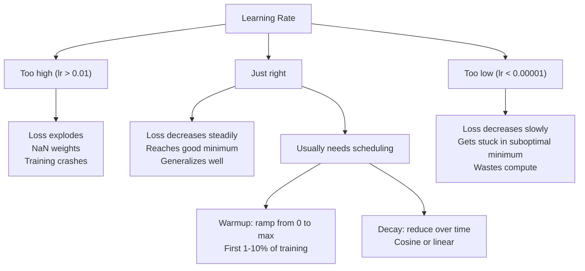
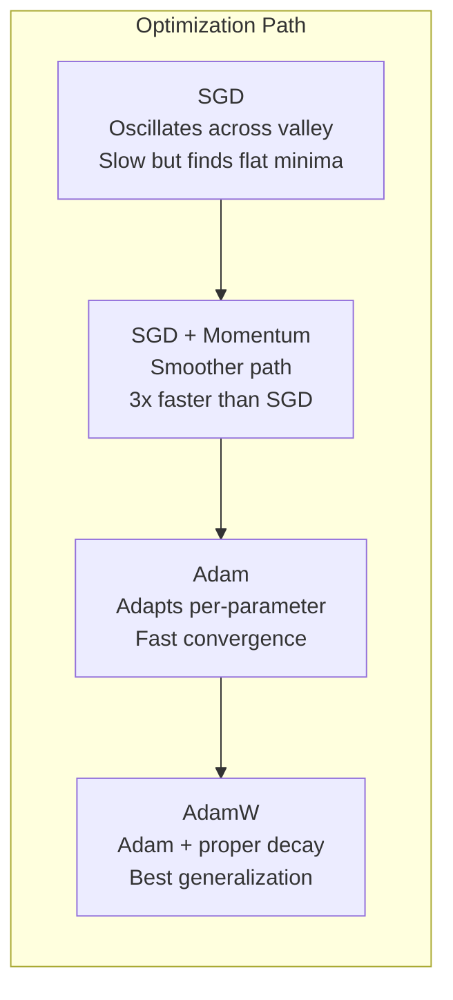
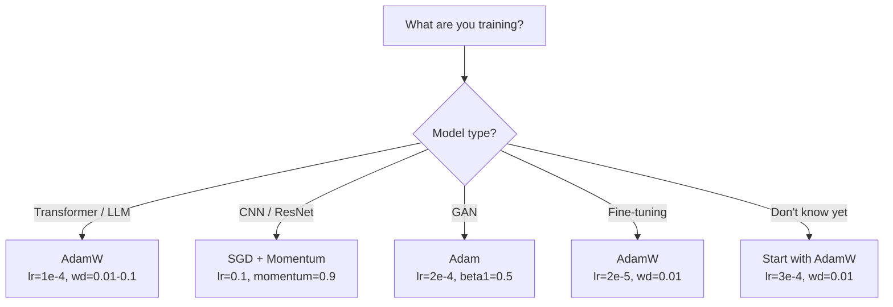

# Оптимизаторы

> Градиентный спуск говорит, в каком направлении двигаться. Он ничего не говорит о том, насколько далеко или насколько быстро. SGD — это компас. Adam — это GPS с данными о пробках.

**Тип:** Сборка
**Языки:** Python
**Предварительные требования:** Урок 03.05 (Функции потерь)
**Время:** ~75 минут

## Цели обучения

- Реализовать оптимизаторы SGD, SGD с импульсом (momentum), Adam и AdamW с нуля на Python
- Объяснить, как коррекция смещения (bias correction) в Adam компенсирует инициализированные нулями оценки моментов на ранних шагах обучения
- Показать, почему AdamW дает лучшую обобщающую способность, чем Adam с L2-регуляризацией на той же задаче
- Выбирать подходящий оптимизатор и стандартные гиперпараметры для трансформеров (transformers), CNN, GAN и дообучения (fine-tuning)

## Проблема

Вы вычислили градиенты. Вы знаете, что вес #4,721 должен уменьшиться на 0.003, чтобы снизить потерю. Но 0.003 в каких единицах? С каким масштабированием? И нужно ли двигаться на одну и ту же величину на шаге 1 и на шаге 1,000?

Обычный градиентный спуск применяет одну и ту же скорость обучения (learning rate) к каждому параметру на каждом шаге: w = w - lr * gradient. Это создает три проблемы, которые на практике делают обучение нейронных сетей болезненным.

Во-первых, осцилляции. Ландшафт функции потерь редко похож на гладкую чашу. Он скорее напоминает длинную узкую долину. Градиент указывает поперек долины (крутое направление), а не вдоль нее (пологе направление). Градиентный спуск скачет туда-сюда поперек узкого измерения, делая крошечный прогресс вдоль полезного. Вы это видели: потеря быстро падает, а затем выходит на плато не потому, что модель сошлась, а потому, что она осциллирует.

Во-вторых, одна скорость обучения для всех параметров — неверно. Некоторым весам нужны большие обновления (они на ранней стадии недообучения). Другим нужны крошечные обновления (они близки к оптимальному значению). Скорость обучения, которая подходит первым, разрушает вторые, и наоборот.

В-третьих, седловые точки. В высоких размерностях ландшафт потерь имеет огромные плоские области, где градиент близок к нулю. Обычный SGD ползет через них со скоростью градиента, которая фактически равна нулю. Модель выглядит застрявшей. Она не застряла -- она находится в плоской области, за которой есть полезный спуск. Но у SGD нет механизма, чтобы протолкнуть ее дальше.

Adam решает все три проблемы. Он поддерживает два скользящих средних для каждого параметра -- средний градиент (momentum, справляется с осцилляциями) и средний квадрат градиента (adaptive rate, справляется с разными масштабами). В сочетании с коррекцией смещения для первых нескольких шагов это дает один оптимизатор, который работает на 80% задач со стандартными гиперпараметрами. В этом уроке вы соберете его с нуля, чтобы точно понимать, когда и почему он ломается на остальных 20%.

## Концепция

### Стохастический градиентный спуск (SGD)

Самый простой оптимизатор. Вычислите градиент на мини-батче (mini-batch) и сделайте шаг в противоположном направлении.

```
w = w - lr * gradient
```

"Стохастический" означает, что вы используете случайное подмножество данных (мини-батч) для оценки градиента, а не весь датасет. Этот шум на самом деле полезен -- он помогает выходить из острых локальных минимумов. Но шум также вызывает осцилляции.

Скорость обучения — единственная ручка управления. Слишком высокая: потеря расходится. Слишком низкая: обучение длится вечность. Оптимальное значение зависит от архитектуры, данных, размера батча и текущей стадии обучения. Для обычного SGD на современных сетях типичные значения находятся в диапазоне от 0.01 до 0.1. Но даже внутри одного запуска обучения идеальная скорость обучения меняется.

### Momentum

Аналогия с шаром, катящимся вниз по склону, избита, но точна. Вместо шага только по текущему градиенту вы поддерживаете скорость (velocity), которая накапливает прошлые градиенты.

```
m_t = beta * m_{t-1} + gradient
w = w - lr * m_t
```

Beta (обычно 0.9) управляет тем, сколько истории сохранять. При beta = 0.9 импульс примерно равен среднему последних 10 градиентов (1 / (1 - 0.9) = 10).

Почему это исправляет осцилляции: градиенты, указывающие в одном направлении, накапливаются. Градиенты, которые меняют направление на противоположное, взаимно уничтожаются. В той узкой долине "поперечная" компонента меняет знак на каждом шаге и подавляется. "Продольная" компонента остается согласованной и усиливается. Результат — плавное ускорение в полезном направлении.

Конкретные числа: один SGD на плохо обусловленном ландшафте потерь может занять 10,000 шагов. SGD с импульсом (beta=0.9) обычно занимает 3,000-5,000 шагов на той же задаче. Ускорение не маргинальное.

### RMSProp

Первый метод адаптивной скорости обучения для каждого параметра, который действительно заработал. Предложен Хинтоном в лекции Coursera (формально так и не опубликован).

```
s_t = beta * s_{t-1} + (1 - beta) * gradient^2
w = w - lr * gradient / (sqrt(s_t) + epsilon)
```

s_t отслеживает скользящее среднее квадратов градиентов. Параметры с постоянно большими градиентами делятся на большое число (меньшая эффективная скорость обучения). Параметры с малыми градиентами делятся на малое число (большая эффективная скорость обучения).

Это решает проблему "одной скорости обучения для всех параметров". Вес, который уже получал большие обновления, вероятно, близок к целевому значению -- замедлите его. Вес, который получал крошечные обновления, может быть недообучен -- ускорьте его.

Epsilon (обычно 1e-8) предотвращает деление на ноль, когда параметр еще не обновлялся.

### Adam: Momentum + RMSProp

Adam объединяет обе идеи. Он поддерживает два экспоненциальных скользящих средних для каждого параметра:

```
m_t = beta1 * m_{t-1} + (1 - beta1) * gradient        (first moment: mean)
v_t = beta2 * v_{t-1} + (1 - beta2) * gradient^2       (second moment: variance)
```

**Коррекция смещения (bias correction)** — ключевая деталь, которую большинство объяснений пропускает. На шаге 1, m_1 = (1 - beta1) * gradient. При beta1 = 0.9 это 0.1 * gradient -- в десять раз меньше нужного. Скользящее среднее еще не разогрелось. Коррекция смещения это компенсирует:

```
m_hat = m_t / (1 - beta1^t)
v_hat = v_t / (1 - beta2^t)
```

На шаге 1 при beta1 = 0.9: m_hat = m_1 / (1 - 0.9) = m_1 / 0.1 = фактический градиент. На шаге 100: (1 - 0.9^100) приблизительно равно 1.0, поэтому коррекция исчезает. Коррекция смещения важна для первых ~10 шагов и несущественна после ~50.

Обновление:

```
w = w - lr * m_hat / (sqrt(v_hat) + epsilon)
```

Стандартные значения Adam: lr = 0.001, beta1 = 0.9, beta2 = 0.999, epsilon = 1e-8. Эти значения работают для 80% задач. Когда не работают, сначала меняйте lr. Затем beta2. Почти никогда не меняйте beta1 или epsilon.

### AdamW: правильный Weight Decay

L2-регуляризация добавляет lambda * w^2 к функции потерь. В обычном SGD это эквивалентно weight decay (вычитанию lambda * w из веса на каждом шаге). В Adam эта эквивалентность нарушается.

Инсайт Loshchilov & Hutter: когда вы добавляете L2 к функции потерь, а затем Adam обрабатывает градиент, адаптивная скорость обучения масштабирует и член регуляризации. Параметры с большой дисперсией градиента получают меньше регуляризации. Параметры с малой дисперсией получают больше. Это не то, что нужно -- нужна равномерная регуляризация независимо от статистики градиентов.

AdamW исправляет это, применяя weight decay напрямую к весам, после обновления Adam:

```
w = w - lr * m_hat / (sqrt(v_hat) + epsilon) - lr * lambda * w
```

Член weight decay (lr * lambda * w) не масштабируется адаптивным множителем Adam. Каждый параметр получает одинаковое пропорциональное сжатие.

Это кажется мелкой деталью. Это не так. AdamW сходится к лучшим решениям, чем Adam + L2-регуляризация, практически на каждой задаче. Это стандартный оптимизатор в PyTorch для обучения трансформеров, диффузионных моделей и большинства современных архитектур. BERT, GPT, LLaMA, Stable Diffusion -- все обучались с AdamW.

### Скорость обучения: самый важный гиперпараметр



Если настраивать один гиперпараметр, настраивайте скорость обучения. Изменение скорости обучения в 10 раз важнее любого архитектурного решения, которое вы примете. Распространенные стандартные значения:

- SGD: lr = 0.01 до 0.1
- Adam/AdamW: lr = 1e-4 до 3e-4
- Дообучение предобученных моделей: lr = 1e-5 до 5e-5
- Разогрев скорости обучения (learning rate warmup): линейный рост в течение первых 1-10% шагов

### Сравнение оптимизаторов



### Когда какой оптимизатор выигрывает



## Соберите это

### Шаг 1: Vanilla SGD

```python
class SGD:
    def __init__(self, lr=0.01):
        self.lr = lr

    def step(self, params, grads):
        for i in range(len(params)):
            params[i] -= self.lr * grads[i]
```

### Шаг 2: SGD with Momentum

```python
class SGDMomentum:
    def __init__(self, lr=0.01, beta=0.9):
        self.lr = lr
        self.beta = beta
        self.velocities = None

    def step(self, params, grads):
        if self.velocities is None:
            self.velocities = [0.0] * len(params)
        for i in range(len(params)):
            self.velocities[i] = self.beta * self.velocities[i] + grads[i]
            params[i] -= self.lr * self.velocities[i]
```

### Шаг 3: Adam

```python
import math

class Adam:
    def __init__(self, lr=0.001, beta1=0.9, beta2=0.999, epsilon=1e-8):
        self.lr = lr
        self.beta1 = beta1
        self.beta2 = beta2
        self.epsilon = epsilon
        self.m = None
        self.v = None
        self.t = 0

    def step(self, params, grads):
        if self.m is None:
            self.m = [0.0] * len(params)
            self.v = [0.0] * len(params)

        self.t += 1

        for i in range(len(params)):
            self.m[i] = self.beta1 * self.m[i] + (1 - self.beta1) * grads[i]
            self.v[i] = self.beta2 * self.v[i] + (1 - self.beta2) * grads[i] ** 2

            m_hat = self.m[i] / (1 - self.beta1 ** self.t)
            v_hat = self.v[i] / (1 - self.beta2 ** self.t)

            params[i] -= self.lr * m_hat / (math.sqrt(v_hat) + self.epsilon)
```

### Шаг 4: AdamW

```python
class AdamW:
    def __init__(self, lr=0.001, beta1=0.9, beta2=0.999, epsilon=1e-8, weight_decay=0.01):
        self.lr = lr
        self.beta1 = beta1
        self.beta2 = beta2
        self.epsilon = epsilon
        self.weight_decay = weight_decay
        self.m = None
        self.v = None
        self.t = 0

    def step(self, params, grads):
        if self.m is None:
            self.m = [0.0] * len(params)
            self.v = [0.0] * len(params)

        self.t += 1

        for i in range(len(params)):
            self.m[i] = self.beta1 * self.m[i] + (1 - self.beta1) * grads[i]
            self.v[i] = self.beta2 * self.v[i] + (1 - self.beta2) * grads[i] ** 2

            m_hat = self.m[i] / (1 - self.beta1 ** self.t)
            v_hat = self.v[i] / (1 - self.beta2 ** self.t)

            params[i] -= self.lr * m_hat / (math.sqrt(v_hat) + self.epsilon)
            params[i] -= self.lr * self.weight_decay * params[i]
```

### Шаг 5: Сравнение обучения

Обучите одну и ту же двухслойную сеть на датасете окружностей из урока 05 со всеми четырьмя оптимизаторами. Сравните сходимость.

```python
import random

def sigmoid(x):
    x = max(-500, min(500, x))
    return 1.0 / (1.0 + math.exp(-x))

def make_circle_data(n=200, seed=42):
    random.seed(seed)
    data = []
    for _ in range(n):
        x = random.uniform(-2, 2)
        y = random.uniform(-2, 2)
        label = 1.0 if x * x + y * y < 1.5 else 0.0
        data.append(([x, y], label))
    return data


class OptimizerTestNetwork:
    def __init__(self, optimizer, hidden_size=8):
        random.seed(0)
        self.hidden_size = hidden_size
        self.optimizer = optimizer

        self.w1 = [[random.gauss(0, 0.5) for _ in range(2)] for _ in range(hidden_size)]
        self.b1 = [0.0] * hidden_size
        self.w2 = [random.gauss(0, 0.5) for _ in range(hidden_size)]
        self.b2 = 0.0

    def get_params(self):
        params = []
        for row in self.w1:
            params.extend(row)
        params.extend(self.b1)
        params.extend(self.w2)
        params.append(self.b2)
        return params

    def set_params(self, params):
        idx = 0
        for i in range(self.hidden_size):
            for j in range(2):
                self.w1[i][j] = params[idx]
                idx += 1
        for i in range(self.hidden_size):
            self.b1[i] = params[idx]
            idx += 1
        for i in range(self.hidden_size):
            self.w2[i] = params[idx]
            idx += 1
        self.b2 = params[idx]

    def forward(self, x):
        self.x = x
        self.z1 = []
        self.h = []
        for i in range(self.hidden_size):
            z = self.w1[i][0] * x[0] + self.w1[i][1] * x[1] + self.b1[i]
            self.z1.append(z)
            self.h.append(max(0.0, z))

        self.z2 = sum(self.w2[i] * self.h[i] for i in range(self.hidden_size)) + self.b2
        self.out = sigmoid(self.z2)
        return self.out

    def compute_grads(self, target):
        eps = 1e-15
        p = max(eps, min(1 - eps, self.out))
        d_loss = -(target / p) + (1 - target) / (1 - p)
        d_sigmoid = self.out * (1 - self.out)
        d_out = d_loss * d_sigmoid

        grads = [0.0] * (self.hidden_size * 2 + self.hidden_size + self.hidden_size + 1)
        idx = 0
        for i in range(self.hidden_size):
            d_relu = 1.0 if self.z1[i] > 0 else 0.0
            d_h = d_out * self.w2[i] * d_relu
            grads[idx] = d_h * self.x[0]
            grads[idx + 1] = d_h * self.x[1]
            idx += 2

        for i in range(self.hidden_size):
            d_relu = 1.0 if self.z1[i] > 0 else 0.0
            grads[idx] = d_out * self.w2[i] * d_relu
            idx += 1

        for i in range(self.hidden_size):
            grads[idx] = d_out * self.h[i]
            idx += 1

        grads[idx] = d_out
        return grads

    def train(self, data, epochs=300):
        losses = []
        for epoch in range(epochs):
            total_loss = 0.0
            correct = 0
            for x, y in data:
                pred = self.forward(x)
                grads = self.compute_grads(y)
                params = self.get_params()
                self.optimizer.step(params, grads)
                self.set_params(params)

                eps = 1e-15
                p = max(eps, min(1 - eps, pred))
                total_loss += -(y * math.log(p) + (1 - y) * math.log(1 - p))
                if (pred >= 0.5) == (y >= 0.5):
                    correct += 1
            avg_loss = total_loss / len(data)
            accuracy = correct / len(data) * 100
            losses.append((avg_loss, accuracy))
            if epoch % 75 == 0 or epoch == epochs - 1:
                print(f"    Epoch {epoch:3d}: loss={avg_loss:.4f}, accuracy={accuracy:.1f}%")
        return losses
```

### Ожидаемый вывод

Запустите `code/main.py` — последние строки должны быть такими:

```
============================================================
STEP 4: Weight Decay Effect
============================================================
  Initial weight L2 norm: 10.0550
  After 100 steps:
    Adam  weight L2 norm: 10.0433
    AdamW weight L2 norm: 9.9434
    AdamW shrinks weights 1.0x more
```

## Используйте это

Оптимизаторы PyTorch обрабатывают группы параметров, отсечение градиентов (gradient clipping) и расписание скорости обучения:

```python
import torch
import torch.optim as optim

model = torch.nn.Sequential(
    torch.nn.Linear(784, 256),
    torch.nn.ReLU(),
    torch.nn.Linear(256, 10),
)

optimizer = optim.AdamW(model.parameters(), lr=3e-4, weight_decay=0.01)

scheduler = optim.lr_scheduler.CosineAnnealingLR(optimizer, T_max=100)

for epoch in range(100):
    optimizer.zero_grad()
    output = model(torch.randn(32, 784))
    loss = torch.nn.functional.cross_entropy(output, torch.randint(0, 10, (32,)))
    loss.backward()
    torch.nn.utils.clip_grad_norm_(model.parameters(), max_norm=1.0)
    optimizer.step()
    scheduler.step()
```

Паттерн всегда такой: zero_grad, forward, loss, backward, (clip), step, (schedule). Запомните этот порядок. Ошибка в нем (например, вызов scheduler.step() перед optimizer.step()) — частый источник тонких багов.

Для CNN многие практики все еще предпочитают SGD + momentum (lr=0.1, momentum=0.9, weight_decay=1e-4) с пошаговым или косинусным расписанием. SGD находит более плоские минимумы, которые часто лучше обобщаются. Для трансформеров и LLM универсальный стандарт — AdamW с разогревом (warmup) + косинусным спадом. Не спорьте с консенсусом без измеримой причины.

## Отправьте это

Этот урок создает:
- `outputs/prompt-optimizer-selector.md` -- промпт для выбора подходящего оптимизатора и скорости обучения для любой архитектуры

## Упражнения

1. Реализуйте импульс Нестерова (Nesterov momentum), где градиент вычисляется в позиции "с заглядыванием вперед" (w - lr * beta * v), а не в текущей позиции. Сравните сходимость со стандартным momentum на датасете окружностей.

2. Реализуйте расписание разогрева скорости обучения: линейный рост от 0 до max_lr в течение первых 10% шагов обучения, затем косинусный спад до 0. Обучите с Adam + warmup и Adam без warmup. Измерьте, сколько эпох нужно, чтобы достичь 90% точности на датасете окружностей.

3. Отслеживайте эффективную скорость обучения для каждого параметра во время обучения Adam. Эффективная скорость равна lr * m_hat / (sqrt(v_hat) + eps). Постройте распределение эффективных скоростей после 10, 50 и 200 шагов. Все ли параметры обновляются с одинаковой скоростью?

4. Реализуйте отсечение градиентов (clip by global norm). Установите максимальную норму градиента в 1.0. Обучите с отсечением и без него, используя высокую скорость обучения (lr=0.01 для Adam). Подсчитайте, сколько запусков расходится (loss становится NaN) с отсечением и без него на 10 случайных seed.

5. Сравните Adam и AdamW на сети с большими весами. Инициализируйте все веса случайными значениями в [-5, 5] (намного больше обычного). Обучайте 200 эпох с weight_decay=0.1. Постройте L2-норму весов в ходе обучения для обоих оптимизаторов. AdamW должен показать более быстрое сжатие весов.

<details>
<summary>Решение — упражнение 4</summary>

```python
def clip_global_norm(params, max_norm=1.0):
    total = sum(p.grad ** 2 for p in params) ** 0.5
    if total > max_norm:
        scale = max_norm / (total + 1e-6)
        for p in params: p.grad *= scale
```

Масштабируйте *все* градиенты одним коэффициентом, чтобы *направление* шага сохранилось, а ограничивалась только его *длина*. При большом learning rate именно это удерживает прогон конечным: без клиппинга один шаг с большим градиентом раздувает веса, и все последующие loss становятся NaN. На 10 сидах прогоны без клиппинга расходятся заметно чаще.

</details>

## Ключевые термины

| Термин | Как говорят | Что это на самом деле означает |
|------|----------------|----------------------|
| Скорость обучения (Learning rate) | "Размер шага" | Скалярный множитель при обновлении градиента; самый влиятельный гиперпараметр в обучении |
| SGD | "Базовый градиентный спуск" | Стохастический градиентный спуск: обновляет веса, вычитая lr * gradient, вычисленный на мини-батче |
| Momentum | "Аналогия с катящимся шаром" | Экспоненциальное скользящее среднее прошлых градиентов; подавляет осцилляции и ускоряет согласованные направления |
| RMSProp | "Адаптивная скорость обучения" | Делит градиент каждого параметра на скользящее RMS его недавних градиентов; выравнивает скорости обучения |
| Adam | "Стандартный оптимизатор" | Объединяет momentum (первый момент) и RMSProp (второй момент) с коррекцией смещения на начальных шагах |
| AdamW | "Adam, сделанный правильно" | Adam с развязанным weight decay; применяет регуляризацию напрямую к весам, а не через градиент |
| Коррекция смещения (Bias correction) | "Разогрев для скользящих средних" | Деление на (1 - beta^t), чтобы компенсировать нулевую инициализацию оценок моментов Adam |
| Weight decay | "Сжимать веса" | Вычитание доли значения веса на каждом шаге; регуляризатор, который штрафует большие веса |
| Расписание скорости обучения (Learning rate schedule) | "Изменение lr со временем" | Функция, которая корректирует скорость обучения во время обучения; warmup + косинусный спад — современный стандарт |
| Отсечение градиентов (Gradient clipping) | "Ограничение нормы градиента" | Масштабирование вектора градиента вниз, когда его норма превышает порог; предотвращает взрывные обновления градиента |

## Дополнительное чтение

- [Kingma & Ba, "Adam: A Method for Stochastic Optimization" (2014)](https://arxiv.org/abs/1412.6980) -- оригинальная статья Adam с анализом сходимости и выводом коррекции смещения
- [Loshchilov & Hutter, "Decoupled Weight Decay Regularization" (2017)](https://arxiv.org/abs/1711.05920) -- доказали, что L2-регуляризация и weight decay не эквивалентны в Adam, и предложили AdamW
- [Smith, "Cyclical Learning Rates for Training Neural Networks" (2017)](https://arxiv.org/abs/1506.01186) -- ввел LR range test и циклические расписания, которые устраняют необходимость настраивать фиксированную скорость обучения
- [Ruder, "An Overview of Gradient Descent Optimization Algorithms" (2016)](https://arxiv.org/abs/1609.04747) -- лучший единый обзор всех вариантов оптимизаторов, с ясными сравнениями и интуициями
