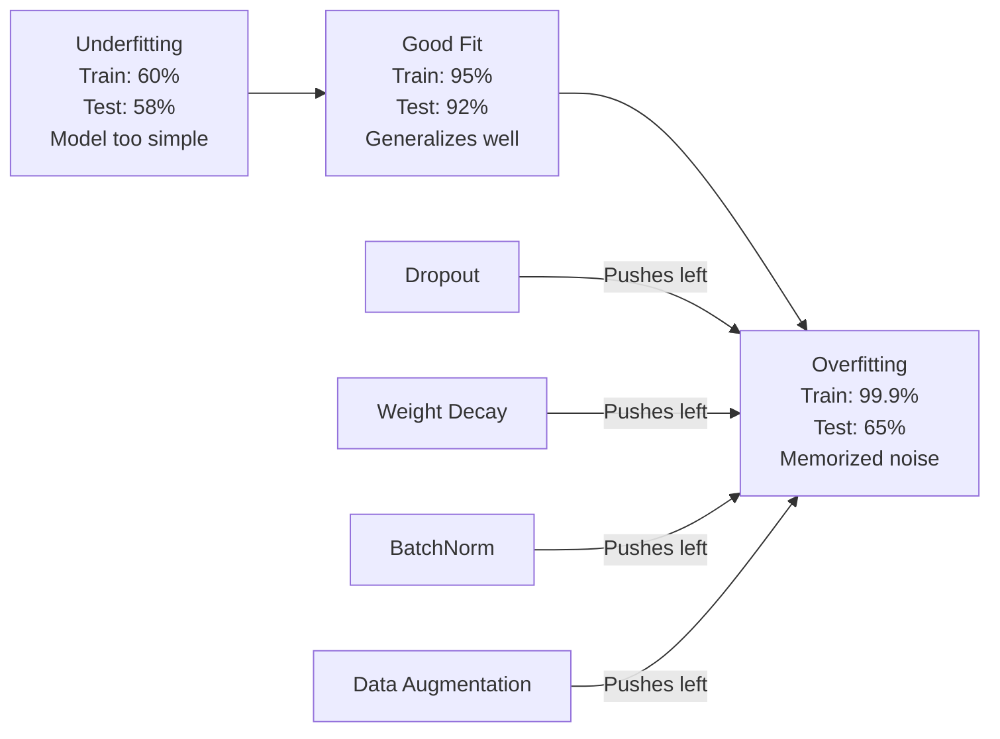
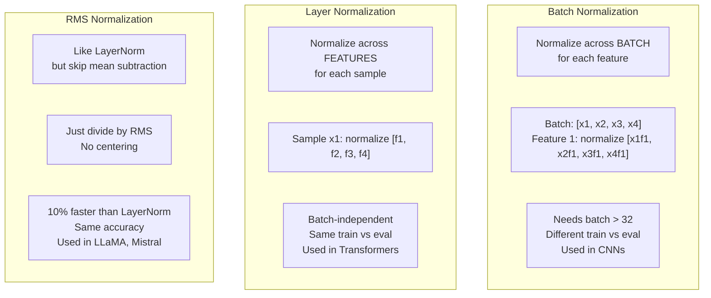
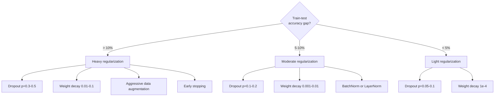

# Регуляризация

> Ваша модель получает 99% на обучающих данных и 60% на тестовых данных. Она запомнила вместо того, чтобы научиться. Регуляризация - это налог, который вы накладываете на сложность, чтобы заставить модель обобщать.

**Тип:** Сборка
**Языки:** Python
**Предварительные требования:** Урок 03.06 (Optimizers)
**Время:** ~75 минут

## Цели обучения

- Реализовать dropout с инвертированным масштабированием, L2 weight decay, batch normalization, layer normalization и RMSNorm с нуля
- Измерять разрыв точности между обучением и тестом и диагностировать переобучение с помощью экспериментов с регуляризацией
- Объяснять, почему трансформеры используют LayerNorm вместо BatchNorm и почему современные LLM предпочитают RMSNorm
- Применять правильную комбинацию техник регуляризации в зависимости от серьезности переобучения

## Проблема

Нейронная сеть с достаточным числом параметров может запомнить любой набор данных. Это не гипотеза -- Zhang et al. (2017) доказали это, обучив стандартные сети на ImageNet со случайными метками. Сети достигли почти нулевой обучающей ошибки на полностью случайных назначениях меток. Они запомнили миллион случайных пар вход-выход, где не было никакой закономерности для изучения. Обучающая ошибка была идеальной. Тестовая точность была нулевой.

Это проблема переобучения (overfitting), и она усугубляется по мере роста моделей. У GPT-3 175 миллиардов параметров. В обучающем наборе около 500 миллиардов токенов. При таком количестве параметров у модели достаточно емкости, чтобы дословно запоминать значительные фрагменты обучающих данных. Без регуляризации она просто воспроизводила бы обучающие примеры вместо изучения обобщаемых закономерностей.

Разрыв между качеством на обучении и качеством на тесте - это разрыв переобучения. Каждая техника в этом уроке атакует этот разрыв с другой стороны. Dropout заставляет сеть не полагаться на какой-либо один нейрон. Weight decay не дает отдельному весу стать слишком большим. Batch normalization сглаживает ландшафт функции потерь, чтобы оптимизатор находил более плоские, лучше обобщаемые минимумы. Layer normalization делает то же самое, но работает там, где batch normalization не справляется (малые батчи, последовательности переменной длины). RMSNorm делает это на 10% быстрее, отбрасывая вычисление среднего. Каждая техника проста. Вместе они отделяют модель, которая запоминает, от модели, которая обобщает.

## Концепция

### Спектр переобучения

Каждая модель находится где-то на спектре от недообучения (слишком проста, чтобы уловить закономерность) до переобучения (настолько сложна, что улавливает шум). Оптимальная точка находится посередине, и регуляризация подталкивает модели к ней со стороны переобучения.



### Dropout

Самая простая техника регуляризации с самой элегантной интерпретацией. Во время обучения случайно обнуляйте выход каждого нейрона с вероятностью p.

```
output = activation(z) * mask    where mask[i] ~ Bernoulli(1 - p)
```

При p = 0.5 половина нейронов обнуляется на каждом прямом проходе. Сеть должна изучать избыточные представления, потому что она не может предсказать, какие нейроны будут доступны. Это предотвращает коадаптацию (co-adaptation) -- ситуацию, когда нейроны учатся полагаться на присутствие конкретных других нейронов.

Интерпретация как ансамбля: сеть с N нейронами и dropout создает 2^N возможных подсетей (каждую комбинацию включенных и выключенных нейронов). Обучение с dropout приблизительно обучает все 2^N подсетей одновременно, каждую на разных mini-batches. Во время тестирования вы используете все нейроны (без dropout) и масштабируете выходы на (1 - p), чтобы совпасть с ожидаемым значением во время обучения. Это эквивалентно усреднению предсказаний 2^N подсетей -- огромному ансамблю из одной модели.

На практике масштабирование применяется во время обучения, а не тестирования (inverted dropout):

```
During training:  output = activation(z) * mask / (1 - p)
During testing:   output = activation(z)   (no change needed)
```

Так чище, потому что тестовому коду вообще не нужно знать о dropout.

Типичные значения: p = 0.1 для transformers, p = 0.5 для MLPs, p = 0.2-0.3 для CNNs. Более высокий dropout = более сильная регуляризация = больший риск недообучения.

### Weight Decay (L2-регуляризация)

Добавьте к функции потерь квадрат величины всех весов:

```
total_loss = task_loss + (lambda / 2) * sum(w_i^2)
```

Градиент регуляризационного слагаемого равен lambda * w. Это означает, что на каждом шаге каждый вес сжимается к нулю на долю, пропорциональную его величине. Большие веса штрафуются сильнее. Модель подталкивается к решениям, где ни один отдельный вес не доминирует.

Почему это помогает обобщению: переобученные модели склонны иметь большие веса, которые усиливают шум в обучающих данных. Weight decay удерживает веса малыми, что ограничивает эффективную емкость модели и заставляет ее полагаться на устойчивые, обобщаемые признаки, а не на запомненные особенности.

Гиперпараметр lambda управляет силой. Типичные значения:

- 0.01 для AdamW на transformers
- 1e-4 для SGD на CNNs
- 0.1 для сильно переобученных моделей

Как обсуждалось в уроке 06: weight decay и L2 regularization эквивалентны в SGD, но не в Adam. При обучении с Adam всегда используйте AdamW (decoupled weight decay).

### Batch Normalization

Нормализуйте выход каждого слоя по mini-batch перед передачей в следующий слой.

Для mini-batch активаций на некотором слое:

```
mu = (1/B) * sum(x_i)           (batch mean)
sigma^2 = (1/B) * sum((x_i - mu)^2)   (batch variance)
x_hat = (x_i - mu) / sqrt(sigma^2 + eps)   (normalize)
y = gamma * x_hat + beta        (scale and shift)
```

Gamma и beta - обучаемые параметры, которые позволяют сети отменить нормализацию, если это оптимально. Без них вы заставляли бы выход каждого слоя иметь нулевое среднее и единичную дисперсию, что может быть не тем, чего хочет сеть.

**Разделение обучения и inference:** Во время обучения mu и sigma берутся из текущего mini-batch. Во время inference вы используете скользящие средние, накопленные при обучении (экспоненциальное скользящее среднее с momentum = 0.1, то есть 90% старого + 10% нового).

Почему BatchNorm работает, до сих пор обсуждается. В исходной статье утверждалось, что он снижает "internal covariate shift" (изменение распределения входов слоя по мере обновления более ранних слоев). Santurkar et al. (2018) показали, что это объяснение неверно. Настоящая причина: BatchNorm делает ландшафт функции потерь более гладким. Градиенты становятся более предсказательными, константы Липшица меньше, и оптимизатор может безопасно делать более крупные шаги. Поэтому BatchNorm позволяет использовать более высокие learning rates и быстрее сходиться.

У BatchNorm есть фундаментальное ограничение: он зависит от статистик батча. При batch size 1 среднее и дисперсия бессмысленны. При малых батчах (< 32) статистики шумные и ухудшают качество. Это важно для задач вроде object detection (где память ограничивает batch size) и language modeling (где длины последовательностей различаются).

### Layer Normalization

Нормализуйте по признакам, а не по батчу. Для одного примера:

```
mu = (1/D) * sum(x_j)           (feature mean)
sigma^2 = (1/D) * sum((x_j - mu)^2)   (feature variance)
x_hat = (x_j - mu) / sqrt(sigma^2 + eps)
y = gamma * x_hat + beta
```

D - размерность признаков. Каждый пример нормализуется независимо -- без зависимости от batch size. Поэтому transformers используют LayerNorm вместо BatchNorm. Последовательности имеют переменную длину, размеры батчей часто малы (или равны 1 во время генерации), а вычисление идентично при training и inference.

LayerNorm в transformers применяется после каждого блока self-attention и каждого feed-forward блока (Post-LN) или перед ними (Pre-LN, что стабильнее для обучения).

### RMSNorm

LayerNorm без вычитания среднего. Предложено Zhang & Sennrich (2019).

```
rms = sqrt((1/D) * sum(x_j^2))
y = gamma * x / rms
```

Вот и все. Нет вычисления среднего, нет параметра beta. Наблюдение: повторное центрирование (вычитание среднего) в LayerNorm дает очень малый вклад в качество модели, но требует вычислений. Удаление этого шага дает ту же точность примерно с на 10% меньшими накладными расходами.

LLaMA, LLaMA 2, LLaMA 3, Mistral и большинство современных LLMs используют RMSNorm вместо LayerNorm. В масштабе миллиардов параметров и триллионов токенов эта экономия 10% существенна.

### Сравнение нормализаций



### Аугментация данных как регуляризация

Это не модификация модели, а модификация данных. Преобразуйте обучающие входы, сохраняя метки:

- Изображения: random crop, flip, rotation, color jitter, cutout
- Текст: synonym replacement, back-translation, random deletion
- Аудио: time stretch, pitch shift, noise addition

Эффект идентичен регуляризации: это увеличивает эффективный размер обучающего набора, из-за чего модели сложнее запоминать конкретные примеры. Модель, которая видит каждое изображение только один раз в исходной форме, может его запомнить. Модель, которая видит 50 аугментированных версий каждого изображения, вынуждена изучать инвариантную структуру.

### Early Stopping

Самый простой регуляризатор: остановите обучение, когда validation loss начинает расти. В этой точке модель еще не переобучилась. На практике вы отслеживаете validation loss каждую эпоху, сохраняете лучшую модель и продолжаете обучение в течение окна "patience" (обычно 5-20 эпох). Если validation loss не улучшается в пределах окна patience, вы останавливаетесь и загружаете лучшую сохраненную модель.

### Что и когда применять



## Соберите это

### Шаг 1: Dropout (режимы обучения и оценки)

```python
import random
import math


class Dropout:
    def __init__(self, p=0.5):
        self.p = p
        self.training = True
        self.mask = None

    def forward(self, x):
        if not self.training:
            return list(x)
        self.mask = []
        output = []
        for val in x:
            if random.random() < self.p:
                self.mask.append(0)
                output.append(0.0)
            else:
                self.mask.append(1)
                output.append(val / (1 - self.p))
        return output

    def backward(self, grad_output):
        grads = []
        for g, m in zip(grad_output, self.mask):
            if m == 0:
                grads.append(0.0)
            else:
                grads.append(g / (1 - self.p))
        return grads
```

### Шаг 2: L2 Weight Decay

```python
def l2_regularization(weights, lambda_reg):
    penalty = 0.0
    for w in weights:
        penalty += w * w
    return lambda_reg * 0.5 * penalty

def l2_gradient(weights, lambda_reg):
    return [lambda_reg * w for w in weights]
```

### Шаг 3: Batch Normalization

```python
class BatchNorm:
    def __init__(self, num_features, momentum=0.1, eps=1e-5):
        self.gamma = [1.0] * num_features
        self.beta = [0.0] * num_features
        self.eps = eps
        self.momentum = momentum
        self.running_mean = [0.0] * num_features
        self.running_var = [1.0] * num_features
        self.training = True
        self.num_features = num_features

    def forward(self, batch):
        batch_size = len(batch)
        if self.training:
            mean = [0.0] * self.num_features
            for sample in batch:
                for j in range(self.num_features):
                    mean[j] += sample[j]
            mean = [m / batch_size for m in mean]

            var = [0.0] * self.num_features
            for sample in batch:
                for j in range(self.num_features):
                    var[j] += (sample[j] - mean[j]) ** 2
            var = [v / batch_size for v in var]

            for j in range(self.num_features):
                self.running_mean[j] = (1 - self.momentum) * self.running_mean[j] + self.momentum * mean[j]
                self.running_var[j] = (1 - self.momentum) * self.running_var[j] + self.momentum * var[j]
        else:
            mean = list(self.running_mean)
            var = list(self.running_var)

        self.x_hat = []
        output = []
        for sample in batch:
            normalized = []
            out_sample = []
            for j in range(self.num_features):
                x_h = (sample[j] - mean[j]) / math.sqrt(var[j] + self.eps)
                normalized.append(x_h)
                out_sample.append(self.gamma[j] * x_h + self.beta[j])
            self.x_hat.append(normalized)
            output.append(out_sample)
        return output
```

### Шаг 4: Layer Normalization

```python
class LayerNorm:
    def __init__(self, num_features, eps=1e-5):
        self.gamma = [1.0] * num_features
        self.beta = [0.0] * num_features
        self.eps = eps
        self.num_features = num_features

    def forward(self, x):
        mean = sum(x) / len(x)
        var = sum((xi - mean) ** 2 for xi in x) / len(x)

        self.x_hat = []
        output = []
        for j in range(self.num_features):
            x_h = (x[j] - mean) / math.sqrt(var + self.eps)
            self.x_hat.append(x_h)
            output.append(self.gamma[j] * x_h + self.beta[j])
        return output
```

### Шаг 5: RMSNorm

```python
class RMSNorm:
    def __init__(self, num_features, eps=1e-6):
        self.gamma = [1.0] * num_features
        self.eps = eps
        self.num_features = num_features

    def forward(self, x):
        rms = math.sqrt(sum(xi * xi for xi in x) / len(x) + self.eps)
        output = []
        for j in range(self.num_features):
            output.append(self.gamma[j] * x[j] / rms)
        return output
```

### Шаг 6: Обучение с регуляризацией и без нее

```python
def sigmoid(x):
    x = max(-500, min(500, x))
    return 1.0 / (1.0 + math.exp(-x))


def make_circle_data(n=200, seed=42):
    random.seed(seed)
    data = []
    for _ in range(n):
        x = random.uniform(-2, 2)
        y = random.uniform(-2, 2)
        label = 1.0 if x * x + y * y < 1.5 else 0.0
        data.append(([x, y], label))
    return data


class RegularizedNetwork:
    def __init__(self, hidden_size=16, lr=0.05, dropout_p=0.0, weight_decay=0.0):
        random.seed(0)
        self.hidden_size = hidden_size
        self.lr = lr
        self.dropout_p = dropout_p
        self.weight_decay = weight_decay
        self.dropout = Dropout(p=dropout_p) if dropout_p > 0 else None

        self.w1 = [[random.gauss(0, 0.5) for _ in range(2)] for _ in range(hidden_size)]
        self.b1 = [0.0] * hidden_size
        self.w2 = [random.gauss(0, 0.5) for _ in range(hidden_size)]
        self.b2 = 0.0

    def forward(self, x, training=True):
        self.x = x
        self.z1 = []
        self.h = []
        for i in range(self.hidden_size):
            z = self.w1[i][0] * x[0] + self.w1[i][1] * x[1] + self.b1[i]
            self.z1.append(z)
            self.h.append(max(0.0, z))

        if self.dropout and training:
            self.dropout.training = True
            self.h = self.dropout.forward(self.h)
        elif self.dropout:
            self.dropout.training = False
            self.h = self.dropout.forward(self.h)

        self.z2 = sum(self.w2[i] * self.h[i] for i in range(self.hidden_size)) + self.b2
        self.out = sigmoid(self.z2)
        return self.out

    def backward(self, target):
        eps = 1e-15
        p = max(eps, min(1 - eps, self.out))
        d_loss = -(target / p) + (1 - target) / (1 - p)
        d_sigmoid = self.out * (1 - self.out)
        d_out = d_loss * d_sigmoid

        for i in range(self.hidden_size):
            d_relu = 1.0 if self.z1[i] > 0 else 0.0
            d_h = d_out * self.w2[i] * d_relu
            self.w2[i] -= self.lr * (d_out * self.h[i] + self.weight_decay * self.w2[i])
            for j in range(2):
                self.w1[i][j] -= self.lr * (d_h * self.x[j] + self.weight_decay * self.w1[i][j])
            self.b1[i] -= self.lr * d_h
        self.b2 -= self.lr * d_out

    def evaluate(self, data):
        correct = 0
        total_loss = 0.0
        for x, y in data:
            pred = self.forward(x, training=False)
            eps = 1e-15
            p = max(eps, min(1 - eps, pred))
            total_loss += -(y * math.log(p) + (1 - y) * math.log(1 - p))
            if (pred >= 0.5) == (y >= 0.5):
                correct += 1
        return total_loss / len(data), correct / len(data) * 100

    def train_model(self, train_data, test_data, epochs=300):
        history = []
        for epoch in range(epochs):
            total_loss = 0.0
            correct = 0
            for x, y in train_data:
                pred = self.forward(x, training=True)
                self.backward(y)
                eps = 1e-15
                p = max(eps, min(1 - eps, pred))
                total_loss += -(y * math.log(p) + (1 - y) * math.log(1 - p))
                if (pred >= 0.5) == (y >= 0.5):
                    correct += 1
            train_loss = total_loss / len(train_data)
            train_acc = correct / len(train_data) * 100
            test_loss, test_acc = self.evaluate(test_data)
            history.append((train_loss, train_acc, test_loss, test_acc))
            if epoch % 75 == 0 or epoch == epochs - 1:
                gap = train_acc - test_acc
                print(f"    Epoch {epoch:3d}: train_acc={train_acc:.1f}%, test_acc={test_acc:.1f}%, gap={gap:.1f}%")
        return history
```

### Ожидаемый вывод

Запустите `code/main.py` — последние строки должны быть такими:

```
  No regularization                   99.3%      97.3%     2.0%
  Dropout p=0.3                       96.0%      98.0%    -2.0%
  Weight decay 0.01                   96.7%      94.0%     2.7%
  Dropout + weight decay              87.3%      90.7%    -3.3%

  Key insight: regularization reduces the train-test gap.
  The model with dropout + weight decay generalizes best,
  even if its training accuracy is lower.
```

## Используйте это

PyTorch предоставляет всю нормализацию и регуляризацию как модули:

```python
import torch
import torch.nn as nn

model = nn.Sequential(
    nn.Linear(784, 256),
    nn.BatchNorm1d(256),
    nn.ReLU(),
    nn.Dropout(0.3),
    nn.Linear(256, 128),
    nn.BatchNorm1d(128),
    nn.ReLU(),
    nn.Dropout(0.3),
    nn.Linear(128, 10),
)

model.train()
out_train = model(torch.randn(32, 784))

model.eval()
out_test = model(torch.randn(1, 784))
```

Переключатель `model.train()` / `model.eval()` критически важен. Он включает/выключает dropout и сообщает BatchNorm, использовать ли batch statistics или running statistics. Забыть `model.eval()` перед inference - одна из самых частых ошибок в deep learning. Ваша тестовая точность будет случайно колебаться, потому что dropout все еще активен, а BatchNorm использует статистики mini-batch.

Для transformers паттерн другой:

```python
class TransformerBlock(nn.Module):
    def __init__(self, d_model=512, nhead=8, dropout=0.1):
        super().__init__()
        self.attention = nn.MultiheadAttention(d_model, nhead, dropout=dropout)
        self.norm1 = nn.LayerNorm(d_model)
        self.ff = nn.Sequential(
            nn.Linear(d_model, d_model * 4),
            nn.GELU(),
            nn.Linear(d_model * 4, d_model),
            nn.Dropout(dropout),
        )
        self.norm2 = nn.LayerNorm(d_model)
        self.dropout = nn.Dropout(dropout)

    def forward(self, x):
        attended, _ = self.attention(x, x, x)
        x = self.norm1(x + self.dropout(attended))
        x = self.norm2(x + self.ff(x))
        return x
```

LayerNorm, а не BatchNorm. Dropout p=0.1, а не p=0.5. Это значения по умолчанию для transformers.

## Доведите до результата

Этот урок создает:
- `outputs/prompt-regularization-advisor.md` -- prompt, который диагностирует переобучение и рекомендует правильную стратегию регуляризации

## Упражнения

1. Реализуйте spatial dropout для 2D-данных: вместо удаления отдельных нейронов удаляйте целые каналы признаков. Смоделируйте это, рассматривая группы последовательных признаков как каналы и удаляя целые группы. Сравните разрыв между обучением и тестом со стандартным dropout на круговом наборе данных с hidden_size=32.

2. Реализуйте label smoothing из урока 05 в сочетании с dropout из этого урока. Обучите четыре конфигурации: ни то ни другое, только dropout, только label smoothing, оба вместе. Измерьте итоговый разрыв точности между обучением и тестом для каждой. Какая комбинация дает самый маленький разрыв?

3. Добавьте слой BatchNorm между скрытым слоем и активацией в вашей сети для circle-dataset. Обучите с BatchNorm и без него при скоростях обучения 0.01, 0.05 и 0.1. BatchNorm должен позволить стабильное обучение при более высоких скоростях обучения, где обычная сеть расходится.

4. Реализуйте early stopping: отслеживайте тестовую потерю каждую эпоху, сохраняйте лучшие веса и останавливайтесь, если тестовая потеря не улучшалась 20 эпох. Запустите регуляризованную сеть на 1000 эпох. Сообщите, на какой эпохе была лучшая тестовая точность и сколько эпох вычислений вы сэкономили.

5. Сравните LayerNorm vs RMSNorm на 4-слойной сети (не только 2). Инициализируйте обе одинаковыми весами. Обучайте 200 эпох и сравните итоговую точность, скорость обучения (время на эпоху) и величины градиентов на первом слое. Проверьте, что RMSNorm быстрее при той же точности.

<details>
<summary>Решение — упражнение 4</summary>

```python
best_loss, best_weights, patience, wait = float("inf"), None, 20, 0
for epoch in range(1000):
    train_one_epoch()
    test_loss = evaluate()
    if test_loss < best_loss:
        best_loss, best_weights, wait = test_loss, snapshot(net), 0
    else:
        wait += 1
        if wait >= patience:
            restore(net, best_weights); break
```

Останавливайтесь, когда test loss не улучшался `patience` эпох, и восстанавливайте лучший снимок. Каждая эпоха после лучшей точки — чистое переобучение (train accuracy растёт, а test стоит), поэтому вы экономите ровно этот хвост вычислений — обычно сотни эпох из бюджета в 1000.

</details>

## Ключевые термины

| Термин | Как говорят | Что это на самом деле означает |
|------|----------------|----------------------|
| Переобучение (overfitting) | "Модель запомнила данные" | Когда качество модели на обучении значительно превосходит качество на тесте, что указывает на изучение шума вместо сигнала |
| Регуляризация (regularization) | "Предотвращение переобучения" | Любая техника, которая ограничивает сложность модели для улучшения обобщения: dropout, weight decay, normalization, augmentation |
| Dropout | "Случайное удаление нейронов" | Обнуление случайных нейронов во время обучения с вероятностью p, вынуждающее избыточные представления; эквивалентно обучению ансамбля |
| Weight decay | "L2-штраф" | Сжатие всех весов к нулю путем вычитания lambda * w на каждом шаге; штрафует сложность через величину весов |
| Batch normalization | "Нормализация по батчу" | Нормализация выходов слоя по размерности батча с использованием batch statistics во время обучения и running averages во время inference |
| Layer normalization | "Нормализация по примеру" | Нормализация по признакам внутри каждого примера; не зависит от батча, используется в transformers, где batch size меняется |
| RMSNorm | "LayerNorm без среднего" | Root mean square normalization; убирает вычитание среднего из LayerNorm ради ускорения на 10% при равной точности |
| Early stopping | "Остановиться до переобучения" | Остановка обучения, когда validation loss перестает улучшаться; самый простой регуляризатор, часто используется вместе с другими |
| Аугментация данных (data augmentation) | "Больше данных из меньшего объема" | Преобразование обучающих входов (flip, crop, noise), чтобы увеличить эффективный размер набора данных и заставить модель изучать инвариантность |
| Разрыв обобщения (generalization gap) | "Разрыв train-test" | Разница между качеством на обучении и на тесте; регуляризация стремится минимизировать этот разрыв |

## Дополнительное чтение

- [Srivastava et al., "Dropout: A Simple Way to Prevent Neural Networks from Overfitting" (2014)](https://jmlr.org/papers/v15/srivastava14a.html) -- исходная статья о dropout с ансамблевой интерпретацией и обширными экспериментами
- [Ioffe & Szegedy, "Batch Normalization: Accelerating Deep Network Training by Reducing Internal Covariate Shift" (2015)](https://arxiv.org/abs/1502.03167) -- представила BatchNorm и процедуру его обучения, одна из самых цитируемых статей по deep learning
- [Zhang & Sennrich, "Root Mean Square Layer Normalization" (2019)](https://arxiv.org/abs/1910.07467) -- показала, что RMSNorm достигает точности LayerNorm с меньшими вычислениями; используется в LLaMA и Mistral
- [Zhang et al., "Understanding Deep Learning Requires Rethinking Generalization" (2017)](https://arxiv.org/abs/1611.03530) -- знаковая статья, показавшая, что нейронные сети могут запоминать случайные метки, бросая вызов традиционным взглядам на обобщение
