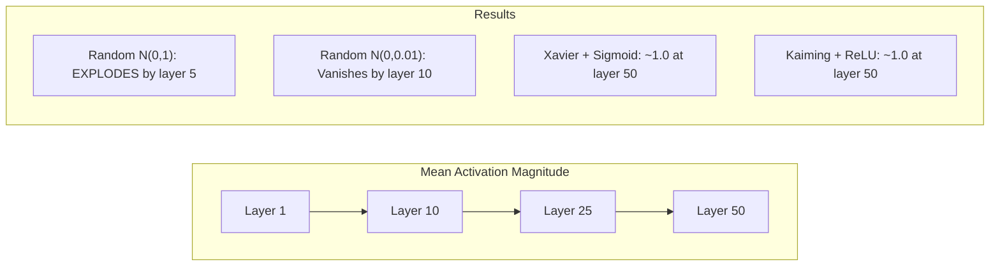
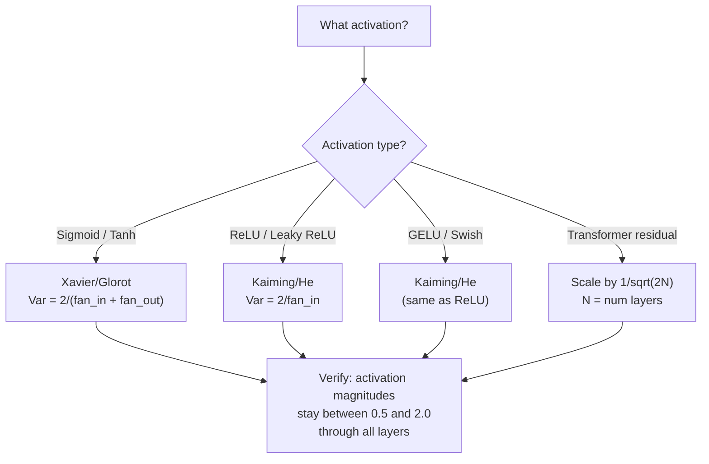

# Инициализация весов и стабильность обучения

> Инициализируйте неправильно, и обучение так и не начнется. Инициализируйте правильно, и 50 слоев будут обучаться так же гладко, как 3.

**Тип:** Сборка
**Языки:** Python
**Предварительные требования:** Урок 03.04 (Функции активации), урок 03.07 (Регуляризация)
**Время:** ~90 минут

## Цели обучения

- Реализовать стратегии нулевой, случайной, Xavier/Glorot и Kaiming/He инициализации и измерить их влияние на величины активаций через 50 слоев
- Вывести, почему Xavier init использует Var(w) = 2/(fan_in + fan_out), а Kaiming использует Var(w) = 2/fan_in
- Продемонстрировать проблему симметрии при нулевой инициализации и объяснить, почему одного случайного масштаба недостаточно
- Сопоставить правильную стратегию инициализации с функцией активации: Xavier для sigmoid/tanh, Kaiming для ReLU/GELU

## Проблема

Инициализируйте все веса нулями. Ничего не обучается. Каждый нейрон вычисляет одну и ту же функцию, получает один и тот же градиент и обновляется одинаково. После 10 000 эпох ваш скрытый слой из 512 нейронов все еще остается 512 копиями одного и того же нейрона. Вы заплатили за 512 параметров, а получили 1.

Инициализируйте их слишком большими. Активации взрываются по сети. К 10-му слою значения доходят до 1e15. К 20-му слою они переполняются до бесконечности. Градиенты проходят ту же траекторию в обратном направлении.

Инициализируйте их случайно из стандартного нормального распределения. Это работает для 3 слоев. На 50 слоях сигнал схлопывается к нулю или взрывается до бесконечности в зависимости от того, был ли случайный масштаб чуть слишком мал или чуть слишком велик. Граница между "работает" и "сломано" тонка как лезвие.

Инициализация весов - самое недооцененное решение в глубоком обучении. Архитектуры получают статьи. Оптимизаторы получают посты в блогах. Инициализация получает сноску. Но если ошибиться с ней, все остальное уже не важно -- ваша сеть мертва еще до начала обучения.

## Концепция

### Проблема симметрии

Каждый нейрон в слое имеет одну и ту же структуру: умножить входы на веса, добавить смещение, применить активацию. Если все веса начинаются с одного и того же значения (ноль - крайний случай), каждый нейрон вычисляет один и тот же выход. Во время обратного распространения каждый нейрон получает один и тот же градиент. На шаге обновления каждый нейрон изменяется на одну и ту же величину.

Вы застряли. У сети сотни параметров, но все они движутся синхронно. Это называется симметрией, а случайная инициализация - грубый способ ее нарушить. Каждый нейрон начинает из другой точки в пространстве весов, поэтому каждый обучается другому признаку.

Но "случайно" недостаточно. *Масштаб* случайности определяет, будет ли сеть обучаться.

### Распространение дисперсии через слои

Рассмотрим один слой с fan_in входами:

```
z = w1*x1 + w2*x2 + ... + w_n*x_n
```

Если каждый вес wi выбирается из распределения с дисперсией Var(w), а каждый вход xi имеет дисперсию Var(x), дисперсия выхода равна:

```
Var(z) = fan_in * Var(w) * Var(x)
```

Если Var(w) = 1 и fan_in = 512, дисперсия выхода в 512 раз больше дисперсии входа. После 10 слоев: 512^10 = 1.2e27. Ваш сигнал взорвался.

Если Var(w) = 0.001, дисперсия выхода уменьшается в 0.001 * 512 = 0.512 раза на слой. После 10 слоев: 0.512^10 = 0.00013. Ваш сигнал исчез.

Цель: выбрать Var(w) так, чтобы Var(z) = Var(x). Величина сигнала остается постоянной между слоями.

### Инициализация Xavier/Glorot

Glorot и Bengio (2010) вывели решение для активаций sigmoid и tanh. Чтобы дисперсия оставалась постоянной и в прямом, и в обратном проходе:

```
Var(w) = 2 / (fan_in + fan_out)
```

На практике веса выбираются из:

```
w ~ Uniform(-limit, limit)  where limit = sqrt(6 / (fan_in + fan_out))
```

или:

```
w ~ Normal(0, sqrt(2 / (fan_in + fan_out)))
```

Это работает, потому что sigmoid и tanh примерно линейны около нуля, где находятся правильно инициализированные активации. Дисперсия остается стабильной на протяжении десятков слоев.

### Инициализация Kaiming/He

ReLU обнуляет половину выходов (все отрицательное становится нулем). Эффективный fan_in уменьшается вдвое, потому что в среднем половина входов обнуляется. Xavier init этого не учитывает -- он недооценивает нужную дисперсию.

He et al. (2015) скорректировали формулу:

```
Var(w) = 2 / fan_in
```

Веса выбираются из:

```
w ~ Normal(0, sqrt(2 / fan_in))
```

Множитель 2 компенсирует то, что ReLU обнуляет половину активаций. Без него сигнал уменьшается примерно в ~0.5 раза на слой. При 50 слоях: 0.5^50 = 8.8e-16. Kaiming init предотвращает это.

### Инициализация Transformer

GPT-2 ввел другой шаблон. Остаточные соединения (residual connections) добавляют выход каждого подслоя к его входу:

```
x = x + sublayer(x)
```

Каждое сложение увеличивает дисперсию. При N остаточных слоях дисперсия растет пропорционально N. GPT-2 масштабирует веса остаточных слоев на 1/sqrt(2N), где N - число слоев. Это сохраняет накопленную величину сигнала стабильной.

Llama 3 (405B параметров, 126 слоев) использует похожую схему. Без такого масштабирования остаточный поток (residual stream) неограниченно рос бы через 126 слоев блоков внимания и feedforward-блоков.

```mermaid
flowchart TD
    subgraph "Zero Init"
        Z1["Layer 1<br/>All weights = 0"] --> Z2["Layer 2<br/>All neurons identical"]
        Z2 --> Z3["Layer 3<br/>Still identical"]
        Z3 --> ZR["Result: 1 effective neuron<br/>regardless of width"]
    end

    subgraph "Xavier Init"
        X1["Layer 1<br/>Var = 2/(fan_in+fan_out)"] --> X2["Layer 2<br/>Signal stable"]
        X2 --> X3["Layer 50<br/>Signal stable"]
        X3 --> XR["Result: Trains with<br/>sigmoid/tanh"]
    end

    subgraph "Kaiming Init"
        K1["Layer 1<br/>Var = 2/fan_in"] --> K2["Layer 2<br/>Signal stable"]
        K2 --> K3["Layer 50<br/>Signal stable"]
        K3 --> KR["Result: Trains with<br/>ReLU/GELU"]
    end
```



### Величина активаций через 50 слоев



### Выбор правильной инициализации



## Соберите это

### Шаг 1: Стратегии инициализации

Четыре способа инициализировать матрицу весов. Каждый возвращает список списков (2D-матрицу) с fan_in столбцами и fan_out строками.

```python
import math
import random


def zero_init(fan_in, fan_out):
    return [[0.0 for _ in range(fan_in)] for _ in range(fan_out)]


def random_init(fan_in, fan_out, scale=1.0):
    return [[random.gauss(0, scale) for _ in range(fan_in)] for _ in range(fan_out)]


def xavier_init(fan_in, fan_out):
    std = math.sqrt(2.0 / (fan_in + fan_out))
    return [[random.gauss(0, std) for _ in range(fan_in)] for _ in range(fan_out)]


def kaiming_init(fan_in, fan_out):
    std = math.sqrt(2.0 / fan_in)
    return [[random.gauss(0, std) for _ in range(fan_in)] for _ in range(fan_out)]
```

### Шаг 2: Функции активации

Нам нужны sigmoid, tanh и ReLU, чтобы проверить каждую стратегию инициализации с предназначенной для нее активацией.

```python
def sigmoid(x):
    x = max(-500, min(500, x))
    return 1.0 / (1.0 + math.exp(-x))


def tanh_act(x):
    return math.tanh(x)


def relu(x):
    return max(0.0, x)
```

### Шаг 3: Прямой проход через 50 слоев

Пропустите случайные данные через глубокую сеть и измерьте среднюю величину активаций на каждом слое.

```python
def forward_deep(init_fn, activation_fn, n_layers=50, width=64, n_samples=100):
    random.seed(42)
    layer_magnitudes = []

    inputs = [[random.gauss(0, 1) for _ in range(width)] for _ in range(n_samples)]

    for layer_idx in range(n_layers):
        weights = init_fn(width, width)
        biases = [0.0] * width

        new_inputs = []
        for sample in inputs:
            output = []
            for neuron_idx in range(width):
                z = sum(weights[neuron_idx][j] * sample[j] for j in range(width)) + biases[neuron_idx]
                output.append(activation_fn(z))
            new_inputs.append(output)
        inputs = new_inputs

        magnitudes = []
        for sample in inputs:
            magnitudes.append(sum(abs(v) for v in sample) / width)
        mean_mag = sum(magnitudes) / len(magnitudes)
        layer_magnitudes.append(mean_mag)

    return layer_magnitudes
```

### Шаг 4: Эксперимент

Запустите все комбинации: zero init, random N(0,1), random N(0,0.01), Xavier с sigmoid, Xavier с tanh, Kaiming с ReLU. Выведите величину на ключевых слоях.

```python
def run_experiment():
    configs = [
        ("Zero init + Sigmoid", lambda fi, fo: zero_init(fi, fo), sigmoid),
        ("Random N(0,1) + ReLU", lambda fi, fo: random_init(fi, fo, 1.0), relu),
        ("Random N(0,0.01) + ReLU", lambda fi, fo: random_init(fi, fo, 0.01), relu),
        ("Xavier + Sigmoid", xavier_init, sigmoid),
        ("Xavier + Tanh", xavier_init, tanh_act),
        ("Kaiming + ReLU", kaiming_init, relu),
    ]

    print(f"{'Strategy':<30} {'L1':>10} {'L5':>10} {'L10':>10} {'L25':>10} {'L50':>10}")
    print("-" * 80)

    for name, init_fn, act_fn in configs:
        mags = forward_deep(init_fn, act_fn)
        row = f"{name:<30}"
        for idx in [0, 4, 9, 24, 49]:
            val = mags[idx]
            if val > 1e6:
                row += f" {'EXPLODED':>10}"
            elif val < 1e-6:
                row += f" {'VANISHED':>10}"
            else:
                row += f" {val:>10.4f}"
        print(row)
```

### Шаг 5: Демонстрация симметрии

Покажите, что zero init создает идентичные нейроны.

```python
def symmetry_demo():
    random.seed(42)
    weights = zero_init(2, 4)
    biases = [0.0] * 4

    inputs = [0.5, -0.3]
    outputs = []
    for neuron_idx in range(4):
        z = sum(weights[neuron_idx][j] * inputs[j] for j in range(2)) + biases[neuron_idx]
        outputs.append(sigmoid(z))

    print("\nSymmetry Demo (4 neurons, zero init):")
    for i, out in enumerate(outputs):
        print(f"  Neuron {i}: output = {out:.6f}")
    all_same = all(abs(outputs[i] - outputs[0]) < 1e-10 for i in range(len(outputs)))
    print(f"  All identical: {all_same}")
    print(f"  Effective parameters: 1 (not {len(weights) * len(weights[0])})")
```

### Шаг 6: Послойный отчет о величинах

Выведите визуальную столбиковую диаграмму величин активаций через 50 слоев.

```python
def magnitude_report(name, magnitudes):
    print(f"\n{name}:")
    for i, mag in enumerate(magnitudes):
        if i % 5 == 0 or i == len(magnitudes) - 1:
            if mag > 1e6:
                bar = "X" * 50 + " EXPLODED"
            elif mag < 1e-6:
                bar = "." + " VANISHED"
            else:
                bar_len = min(50, max(1, int(mag * 10)))
                bar = "#" * bar_len
            print(f"  Layer {i+1:3d}: {bar} ({mag:.6f})")
```

### Ожидаемый вывод

Запустите `code/main.py` — последние строки должны быть такими:

```
  Config                           Start Loss     End Loss  Improvement
  ------------------------------------------------------------------
  Random(0.01) + Sigmoid             0.213427     0.205097         3.9%
  Random(1.0) + Sigmoid              0.257682     0.018135        93.0%
  Xavier + Sigmoid                   0.220716     0.022327        89.9%
  Random(0.01) + ReLU                0.222634     0.007044        96.8%
  Random(1.0) + ReLU                 0.395736     0.004482        98.9%
  Kaiming + ReLU                     0.261864     0.004715        98.2%
```

## Используйте это

PyTorch предоставляет их как встроенные функции:

```python
import torch
import torch.nn as nn

layer = nn.Linear(512, 256)

nn.init.xavier_uniform_(layer.weight)
nn.init.xavier_normal_(layer.weight)

nn.init.kaiming_uniform_(layer.weight, nonlinearity='relu')
nn.init.kaiming_normal_(layer.weight, nonlinearity='relu')

nn.init.zeros_(layer.bias)
```

Когда вы вызываете `nn.Linear(512, 256)`, PyTorch по умолчанию использует равномерную инициализацию Kaiming. Поэтому большинство простых сетей "просто работает" -- PyTorch уже сделал правильный выбор. Но когда вы строите собственные архитектуры или уходите глубже 20 слоев, нужно понимать, что происходит, и потенциально переопределять значение по умолчанию.

Для трансформеров модели HuggingFace обычно выполняют инициализацию в своем методе `_init_weights`. Реализация GPT-2 масштабирует остаточные проекции на 1/sqrt(N). Если вы строите трансформер с нуля, это нужно добавить самостоятельно.

## Отправьте это

Этот урок создает:
- `outputs/prompt-init-strategy.md` -- промпт, который диагностирует проблемы инициализации весов и рекомендует правильную стратегию

## Упражнения

1. Добавьте инициализацию LeCun (Var = 1/fan_in, разработана для активации SELU). Запустите 50-слойный эксперимент с LeCun init + tanh и сравните с Xavier + tanh.

2. Реализуйте остаточное масштабирование GPT-2: умножайте выход каждого слоя на 1/sqrt(2*N) перед добавлением к остаточному потоку. Запустите 50 слоев с масштабированием и без него, измерьте, как быстро растет величина остаточного потока.

3. Создайте функцию "проверки здоровья инициализации" (init health check), которая принимает размеры слоев сети и тип активации, затем рекомендует правильную инициализацию и предупреждает, если текущая инициализация вызовет проблемы.

4. Запустите эксперимент с fan_in = 16 и fan_in = 1024. Xavier и Kaiming адаптируются к fan_in, а random init - нет. Покажите, как разрыв между "работает" и "ломается" расширяется с более крупными слоями.

5. Реализуйте ортогональную инициализацию (сгенерируйте случайную матрицу, вычислите ее SVD, используйте ортогональную матрицу U). Сравните с Kaiming для ReLU-сетей на 50 слоях.

<details>
<summary>Решение — упражнение 5</summary>

```python
import numpy as np
def orthogonal(n):
    U, _, _ = np.linalg.svd(np.random.randn(n, n))
    return U            # U is orthogonal: U @ U.T == I
```

Проверено `max|U @ U.T - I| ~ 8e-16`. Ортогональная матрица сохраняет нормы векторов при прохождении линейного слоя (без сжатия и без взрыва), поэтому удерживает сигнал на глубинах, где даже Kaiming начинает плыть — именно поэтому она помогает очень глубоким (50 слоёв) ReLU-сетям.

</details>

## Ключевые термины

| Термин | Как говорят | Что это на самом деле означает |
|------|----------------|----------------------|
| Инициализация весов (Weight initialization) | "Задать начальные веса случайно" | Стратегия выбора начальных значений весов, которая определяет, сможет ли сеть вообще обучаться |
| Нарушение симметрии (Symmetry breaking) | "Сделать нейроны разными" | Использование случайной инициализации, чтобы нейроны изучали разные признаки, а не вычисляли идентичные функции |
| Fan-in | "Число входов в нейрон" | Число входящих соединений, которое определяет, как входная дисперсия накапливается во взвешенной сумме |
| Fan-out | "Число выходов из нейрона" | Число исходящих соединений, важное для поддержания дисперсии градиентов во время обратного распространения |
| Xavier/Glorot init | "Инициализация для sigmoid" | Var(w) = 2/(fan_in + fan_out), разработана для сохранения дисперсии через активации sigmoid и tanh |
| Kaiming/He init | "Инициализация для ReLU" | Var(w) = 2/fan_in, учитывает, что ReLU обнуляет половину активаций |
| Распространение дисперсии (Variance propagation) | "Как сигналы растут или уменьшаются через слои" | Математический анализ того, как дисперсия активаций меняется слой за слоем в зависимости от масштаба весов |
| Остаточное масштабирование (Residual scaling) | "Трюк инициализации GPT-2" | Масштабирование весов остаточных соединений на 1/sqrt(2N), чтобы предотвратить рост дисперсии через N слоев трансформера |
| Мертвая сеть (Dead network) | "Ничего не обучается" | Сеть, в которой плохая инициализация приводит к тому, что все градиенты равны нулю или все активации насыщаются |
| Взрывающиеся активации (Exploding activations) | "Значения уходят в бесконечность" | Ситуация, когда дисперсия весов слишком высока, из-за чего величины активаций экспоненциально растут через слои |

## Дополнительное чтение

- Glorot & Bengio, "Understanding the difficulty of training deep feedforward neural networks" (2010) -- исходная статья об инициализации Xavier с анализом дисперсии
- He et al., "Delving Deep into Rectifiers" (2015) -- представила инициализацию Kaiming для ReLU-сетей
- Radford et al., "Language Models are Unsupervised Multitask Learners" (2019) -- статья GPT-2 с инициализацией через остаточное масштабирование
- Mishkin & Matas, "All You Need is a Good Init" (2016) -- послойная инициализация с единичной дисперсией, эмпирическая альтернатива аналитическим формулам
