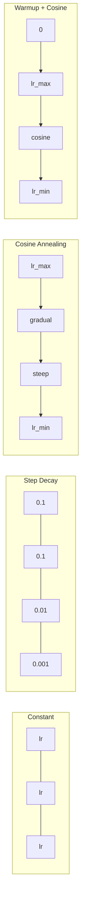
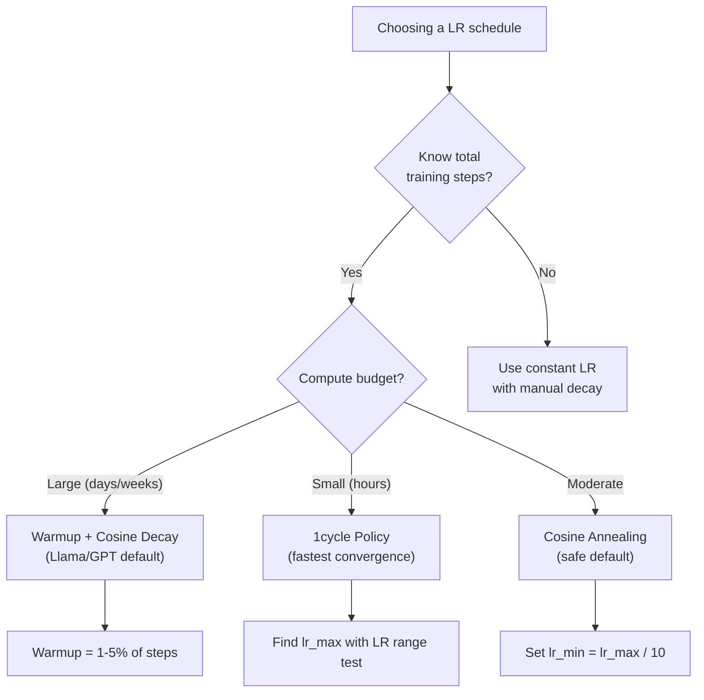
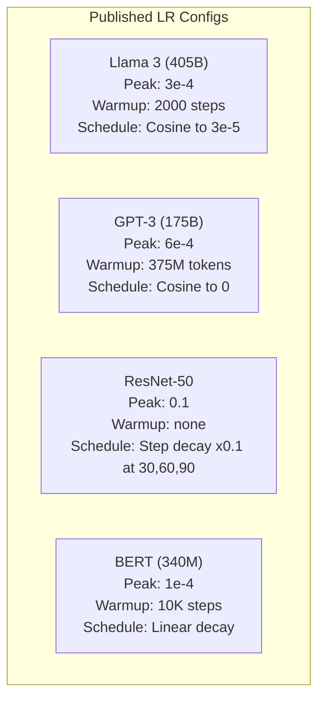

# Расписания скорости обучения и разогрев (Warmup)

> Скорость обучения (learning rate) - самый важный гиперпараметр. Не архитектура. Не размер датасета. Не функция активации. Скорость обучения. Если вы не настраиваете больше ничего, настройте ее.

**Тип:** Сборка
**Языки:** Python
**Предварительные требования:** Урок 03.06 (Оптимизаторы), Урок 03.08 (Инициализация весов)
**Время:** ~90 минут

## Цели обучения

- Реализовать с нуля расписания скорости обучения: постоянное, ступенчатое затухание, косинусный отжиг (cosine annealing), разогрев + косинус и 1cycle
- Продемонстрировать три режима отказа при выборе скорости обучения: расходимость (слишком высокая), остановка прогресса (слишком низкая) и осцилляции (нет затухания)
- Объяснить, почему разогрев необходим для оптимизаторов на основе Adam и как он стабилизирует раннее обучение
- Сравнить скорость сходимости всех пяти расписаний на одной и той же задаче и выбрать подходящее для заданного бюджета обучения

## Проблема

Установите скорость обучения равной 0.1. Обучение расходится -- loss улетает в бесконечность за 3 шага. Установите 0.0001. Обучение ползет -- после 100 эпох модель почти не сдвинулась от случайного состояния. Установите 0.01. Обучение работает 50 эпох, затем loss осциллирует вокруг минимума, которого никогда не достигает, потому что шаги слишком большие.

Оптимальная скорость обучения не является константой. Она меняется во время обучения. В начале нужны большие шаги, чтобы быстро покрыть пространство. В конце обучения нужны крошечные шаги, чтобы осесть в резком минимуме. Разница между моделью с точностью 90% и 95% часто заключается только в расписании.

Каждая крупная модель, опубликованная за последние три года, использует расписание скорости обучения. Llama 3 использовала пиковое lr=3e-4 с 2000 шагами разогрева и косинусным затуханием до 3e-5. GPT-3 использовала lr=6e-4 с разогревом на протяжении 375 миллионов токенов. Это не произвольные решения. Это результат масштабных переборов гиперпараметров, стоивших миллионы долларов.

Вам нужно понимать расписания, потому что значения по умолчанию не будут работать для вашей задачи. Когда вы дообучаете предобученную модель, правильное расписание отличается от обучения с нуля. Когда вы увеличиваете размер батча, период разогрева должен измениться. Когда обучение ломается на шаге 10,000, нужно понимать, проблема ли это расписания или чего-то другого.

## Концепция

### Постоянная скорость обучения

Самый простой подход. Выберите число и используйте его на каждом шаге.

```
lr(t) = lr_0
```

Редко бывает оптимальным. Она либо слишком высока для конца обучения (осцилляции вокруг минимума), либо слишком низка для начала (потраченные вычисления на крошечные шаги). Хорошо работает для небольших моделей и отладки. Ужасный выбор для всего, что обучается дольше часа.

### Ступенчатое затухание

Старый подход из эпохи ResNet. Уменьшайте скорость обучения в заданное число раз (обычно 10x) на фиксированных эпохах.

```
lr(t) = lr_0 * gamma^(floor(epoch / step_size))
```

Где gamma = 0.1 и step_size = 30 означает: lr падает в 10 раз каждые 30 эпох. ResNet-50 использовала это -- lr=0.1, падение в 10 раз на эпохах 30, 60 и 90.

Проблема: оптимальные точки затухания зависят от датасета и архитектуры. Перейдите к другой задаче, и нужно заново настраивать, когда снижать скорость. Переходы резкие -- loss может подскочить, когда скорость внезапно меняется.

### Косинусный отжиг

Плавное затухание от максимальной скорости обучения к минимальной по косинусной кривой:

```
lr(t) = lr_min + 0.5 * (lr_max - lr_min) * (1 + cos(pi * t / T))
```

Где t - текущий шаг, а T - общее число шагов.

При t=0 косинусный член равен 1, поэтому lr = lr_max. При t=T косинусный член равен -1, поэтому lr = lr_min. Затухание сначала мягкое, ускоряется в середине и снова становится мягким ближе к концу.

Это значение по умолчанию для большинства современных запусков обучения. Нет гиперпараметров для настройки, кроме lr_max и lr_min. Косинусная форма соответствует эмпирическому наблюдению, что большая часть обучения происходит в середине -- в этот критический период нужны разумные размеры шагов.

### Разогрев: почему нужно начинать с малого

Adam и другие адаптивные оптимизаторы поддерживают скользящие оценки среднего и дисперсии градиента. На шаге 0 эти оценки инициализированы нулями. Первые несколько обновлений градиента основаны на мусорной статистике. Если в этот период скорость обучения велика, модель делает огромные, плохо направленные шаги.

Разогрев исправляет это. Начните с крошечной скорости обучения (часто lr_max / warmup_steps или даже ноль) и линейно повышайте ее до lr_max за первые N шагов. К моменту достижения полной скорости обучения статистики Adam стабилизируются.

```
lr(t) = lr_max * (t / warmup_steps)     for t < warmup_steps
```

Типичный разогрев: 1-5% от общего числа шагов обучения. Llama 3 обучалась примерно на ~1.8 триллиона токенов и разогревалась 2000 шагов. GPT-3 разогревалась на протяжении 375 миллионов токенов.

### Линейный разогрев + косинусное затухание

Современный вариант по умолчанию. Линейно поднимайте скорость, затем снижайте ее косинусом:

```
if t < warmup_steps:
    lr(t) = lr_max * (t / warmup_steps)
else:
    progress = (t - warmup_steps) / (total_steps - warmup_steps)
    lr(t) = lr_min + 0.5 * (lr_max - lr_min) * (1 + cos(pi * progress))
```

Именно это используют Llama, GPT, PaLM и большинство современных трансформеров. Разогрев предотвращает раннюю нестабильность. Косинусное затухание приводит модель к хорошему минимуму.

### Политика 1cycle

Открытие Leslie Smith (2018): поднимайте скорость обучения от низкого значения к высокому в первой половине обучения, затем опускайте ее обратно во второй половине. Контринтуитивно -- зачем *увеличивать* скорость обучения посреди процесса?

Теория: высокая скорость обучения действует как регуляризация, добавляя шум в траекторию оптимизации. Модель исследует большую часть ландшафта потерь во время фазы подъема и находит лучшие бассейны. Затем фаза спуска уточняет решение внутри лучшего найденного бассейна.

```
Phase 1 (0 to T/2):    lr ramps from lr_max/25 to lr_max
Phase 2 (T/2 to T):    lr ramps from lr_max to lr_max/10000
```

1cycle часто обучает быстрее, чем косинусный отжиг, при фиксированном вычислительном бюджете. Компромисс: нужно заранее знать общее число шагов.

### Формы расписаний



### Блок-схема выбора



### Реальные числа из опубликованных моделей



## Соберите это

### Шаг 1: функции расписаний

Каждая функция принимает текущий шаг и возвращает скорость обучения на этом шаге.

```python
import math


def constant_schedule(step, lr=0.01, **kwargs):
    return lr


def step_decay_schedule(step, lr=0.1, step_size=100, gamma=0.1, **kwargs):
    return lr * (gamma ** (step // step_size))


def cosine_schedule(step, lr=0.01, total_steps=1000, lr_min=1e-5, **kwargs):
    if step >= total_steps:
        return lr_min
    return lr_min + 0.5 * (lr - lr_min) * (1 + math.cos(math.pi * step / total_steps))


def warmup_cosine_schedule(step, lr=0.01, total_steps=1000, warmup_steps=100, lr_min=1e-5, **kwargs):
    if total_steps <= warmup_steps:
        return lr * (step / max(warmup_steps, 1))
    if step < warmup_steps:
        return lr * step / warmup_steps
    progress = (step - warmup_steps) / (total_steps - warmup_steps)
    return lr_min + 0.5 * (lr - lr_min) * (1 + math.cos(math.pi * progress))


def one_cycle_schedule(step, lr=0.01, total_steps=1000, **kwargs):
    mid = max(total_steps // 2, 1)
    if step < mid:
        return (lr / 25) + (lr - lr / 25) * step / mid
    else:
        progress = (step - mid) / max(total_steps - mid, 1)
        return lr * (1 - progress) + (lr / 10000) * progress
```

### Шаг 2: визуализируйте все расписания

Выведите текстовый график, показывающий, как каждое расписание меняется в ходе обучения.

```python
def visualize_schedule(name, schedule_fn, total_steps=500, **kwargs):
    steps = list(range(0, total_steps, total_steps // 20))
    if total_steps - 1 not in steps:
        steps.append(total_steps - 1)

    lrs = [schedule_fn(s, total_steps=total_steps, **kwargs) for s in steps]
    max_lr = max(lrs) if max(lrs) > 0 else 1.0

    print(f"\n{name}:")
    for s, lr_val in zip(steps, lrs):
        bar_len = int(lr_val / max_lr * 40)
        bar = "#" * bar_len
        print(f"  Step {s:4d}: lr={lr_val:.6f} {bar}")
```

### Шаг 3: обучающая сеть

Простая двухслойная сеть на датасете окружности, как в предыдущих уроках, но теперь мы меняем расписание.

```python
import random


def sigmoid(x):
    x = max(-500, min(500, x))
    return 1.0 / (1.0 + math.exp(-x))


def relu(x):
    return max(0.0, x)


def relu_deriv(x):
    return 1.0 if x > 0 else 0.0


def make_circle_data(n=200, seed=42):
    random.seed(seed)
    data = []
    for _ in range(n):
        x = random.uniform(-2, 2)
        y = random.uniform(-2, 2)
        label = 1.0 if x * x + y * y < 1.5 else 0.0
        data.append(([x, y], label))
    return data


def train_with_schedule(schedule_fn, schedule_name, data, epochs=300, base_lr=0.05, **kwargs):
    random.seed(0)
    hidden_size = 8
    total_steps = epochs * len(data)

    std = math.sqrt(2.0 / 2)
    w1 = [[random.gauss(0, std) for _ in range(2)] for _ in range(hidden_size)]
    b1 = [0.0] * hidden_size
    w2 = [random.gauss(0, std) for _ in range(hidden_size)]
    b2 = 0.0

    step = 0
    epoch_losses = []

    for epoch in range(epochs):
        total_loss = 0
        correct = 0

        for x, target in data:
            lr = schedule_fn(step, lr=base_lr, total_steps=total_steps, **kwargs)

            z1 = []
            h = []
            for i in range(hidden_size):
                z = w1[i][0] * x[0] + w1[i][1] * x[1] + b1[i]
                z1.append(z)
                h.append(relu(z))

            z2 = sum(w2[i] * h[i] for i in range(hidden_size)) + b2
            out = sigmoid(z2)

            error = out - target
            d_out = error * out * (1 - out)

            for i in range(hidden_size):
                d_h = d_out * w2[i] * relu_deriv(z1[i])
                w2[i] -= lr * d_out * h[i]
                for j in range(2):
                    w1[i][j] -= lr * d_h * x[j]
                b1[i] -= lr * d_h
            b2 -= lr * d_out

            total_loss += (out - target) ** 2
            if (out >= 0.5) == (target >= 0.5):
                correct += 1
            step += 1

        avg_loss = total_loss / len(data)
        accuracy = correct / len(data) * 100
        epoch_losses.append(avg_loss)

    return epoch_losses
```

### Шаг 4: сравните все расписания

Обучите одну и ту же сеть с каждым расписанием и сравните итоговый loss и поведение сходимости.

```python
def compare_schedules(data):
    configs = [
        ("Constant", constant_schedule, {}),
        ("Step Decay", step_decay_schedule, {"step_size": 15000, "gamma": 0.1}),
        ("Cosine", cosine_schedule, {"lr_min": 1e-5}),
        ("Warmup+Cosine", warmup_cosine_schedule, {"warmup_steps": 3000, "lr_min": 1e-5}),
        ("1cycle", one_cycle_schedule, {}),
    ]

    print(f"\n{'Schedule':<20} {'Start Loss':>12} {'Mid Loss':>12} {'End Loss':>12} {'Best Loss':>12}")
    print("-" * 70)

    for name, schedule_fn, extra_kwargs in configs:
        losses = train_with_schedule(schedule_fn, name, data, epochs=300, base_lr=0.05, **extra_kwargs)
        mid_idx = len(losses) // 2
        best = min(losses)
        print(f"{name:<20} {losses[0]:>12.6f} {losses[mid_idx]:>12.6f} {losses[-1]:>12.6f} {best:>12.6f}")
```

### Шаг 5: LR слишком высока и слишком низка

Продемонстрируйте три режима отказа: слишком высокая (расходимость), слишком низкая (ползучее обучение) и подходящая.

```python
def lr_sensitivity(data):
    learning_rates = [1.0, 0.1, 0.01, 0.001, 0.0001]

    print("\nLR Sensitivity (constant schedule, 100 epochs):")
    print(f"  {'LR':>10} {'Start Loss':>12} {'End Loss':>12} {'Status':>15}")
    print("  " + "-" * 52)

    for lr in learning_rates:
        losses = train_with_schedule(constant_schedule, f"lr={lr}", data, epochs=100, base_lr=lr)
        start = losses[0]
        end = losses[-1]

        if end > start or math.isnan(end) or end > 1.0:
            status = "DIVERGED"
        elif end > start * 0.9:
            status = "BARELY MOVED"
        elif end < 0.15:
            status = "CONVERGED"
        else:
            status = "LEARNING"

        end_str = f"{end:.6f}" if not math.isnan(end) else "NaN"
        print(f"  {lr:>10.4f} {start:>12.6f} {end_str:>12} {status:>15}")
```

## Используйте это

PyTorch предоставляет планировщики в `torch.optim.lr_scheduler`:

```python
import torch
import torch.optim as optim
from torch.optim.lr_scheduler import CosineAnnealingLR, OneCycleLR, StepLR

model = nn.Sequential(nn.Linear(10, 64), nn.ReLU(), nn.Linear(64, 1))
optimizer = optim.Adam(model.parameters(), lr=3e-4)

scheduler = CosineAnnealingLR(optimizer, T_max=1000, eta_min=1e-5)

for step in range(1000):
    loss = train_step(model, optimizer)
    scheduler.step()
```

Для разогрева + косинуса используйте lambda scheduler или `get_cosine_schedule_with_warmup` из HuggingFace:

```python
from transformers import get_cosine_schedule_with_warmup

scheduler = get_cosine_schedule_with_warmup(
    optimizer,
    num_warmup_steps=2000,
    num_training_steps=100000,
)
```

Функция HuggingFace - это то, что используют большинство скриптов дообучения Llama и GPT. Если сомневаетесь, используйте разогрев + косинус с warmup = 3-5% от общего числа шагов. Это работает почти для всего.

## Отправьте это

Этот урок создает:
- `outputs/prompt-lr-schedule-advisor.md` -- промпт, который рекомендует правильное расписание скорости обучения и гиперпараметры для вашей настройки обучения

## Упражнения

1. Реализуйте экспоненциальное затухание: lr(t) = lr_0 * gamma^t, где gamma = 0.999. Сравните с косинусным отжигом на датасете окружности.

2. Реализуйте тест диапазона скорости обучения (Leslie Smith): обучайте несколько сотен шагов, экспоненциально увеличивая LR от 1e-7 до 1. Постройте график loss vs LR. Оптимальный max LR находится прямо перед тем, как loss начинает расти.

3. Обучайте с разогревом + косинусом, но меняйте длину разогрева: 0%, 1%, 5%, 10%, 20% от общего числа шагов. Найдите оптимальную точку, где обучение наиболее стабильно.

4. Реализуйте косинусный отжиг с теплыми перезапусками (warm restarts, SGDR): сбрасывайте скорость обучения к lr_max каждые T шагов и снова запускайте затухание. Сравните со стандартным косинусом на более длинном запуске обучения.

5. Создайте "хирурга расписаний", который отслеживает loss при обучении и автоматически переключается с разогрева на косинус, когда loss стабилизируется, и снижает lr, если loss слишком долго выходит на плато.

## Ключевые термины

| Термин | Как обычно говорят | Что это на самом деле означает |
|------|----------------|----------------------|
| Скорость обучения (Learning rate) | "Насколько быстро модель учится" | Скаляр, на который умножается градиент для определения размера обновления параметров |
| Расписание (Schedule) | "Менять LR со временем" | Функция, которая отображает шаг обучения в скорость обучения и предназначена для оптимизации сходимости |
| Разогрев (Warmup) | "Начать с маленькой LR" | Линейное повышение LR от почти нуля до целевого значения за первые N шагов для стабилизации статистик оптимизатора |
| Косинусный отжиг (Cosine annealing) | "Плавное затухание LR" | Уменьшение LR по косинусной кривой от lr_max до lr_min в ходе обучения |
| Ступенчатое затухание (Step decay) | "Снижать LR на контрольных точках" | Умножение LR на коэффициент (обычно 0.1) через фиксированные интервалы эпох |
| Политика 1cycle (1cycle policy) | "Вверх, потом вниз" | Метод Leslie Smith: поднимать LR, затем опускать ее в одном цикле для более быстрой сходимости |
| Тест диапазона LR (LR range test) | "Найти лучшую скорость обучения" | Короткое обучение с увеличением LR, чтобы найти значение, при котором loss начинает расходиться |
| Косинус с теплыми перезапусками (Cosine with warm restarts) | "Сбросить и повторить" | Периодический сброс LR к lr_max и повторное затухание (SGDR) |
| Eta min | "Нижняя граница для LR" | Минимальная скорость обучения, до которой затухает расписание |
| Пиковая скорость обучения (Peak learning rate) | "Максимальная LR" | Самая высокая LR, достигаемая во время обучения, обычно после разогрева |

## Дополнительное чтение

- Loshchilov & Hutter, "SGDR: Stochastic Gradient Descent with Warm Restarts" (2017) -- представили косинусный отжиг и теплые перезапуски
- Smith, "Super-Convergence: Very Fast Training of Neural Networks Using Large Learning Rates" (2018) -- статья о политике 1cycle
- Touvron et al., "Llama 2: Open Foundation and Fine-Tuned Chat Models" (2023) -- документирует расписание разогрев + косинус, используемое в масштабе
- Goyal et al., "Accurate, Large Minibatch SGD: Training ImageNet in 1 Hour" (2017) -- правило линейного масштабирования и разогрев для обучения с большими батчами
