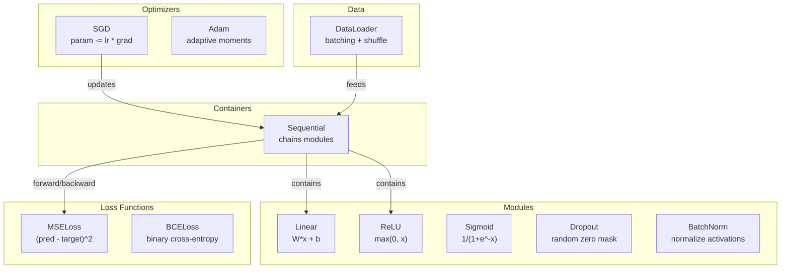
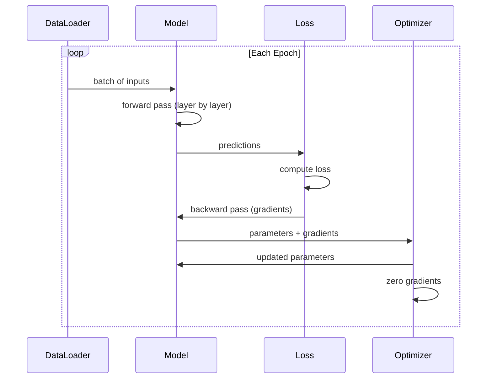
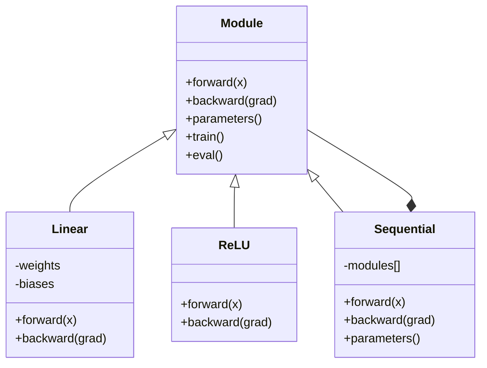

# Соберите собственный мини-фреймворк

> Вы уже собрали нейроны, слои, сети, обратное распространение, активации, функции потерь, оптимизаторы, регуляризацию, инициализацию и расписания LR. Все как отдельные части. Теперь соедините их во фреймворк. Не PyTorch. Не TensorFlow. Ваш.

**Тип:** Сборка
**Языки:** Python
**Требования:** Вся Фаза 03 (уроки 01-09)
**Время:** ~120 минут

## Цели обучения

- Построить полноценный фреймворк глубокого обучения (~500 строк) с Module, Linear, ReLU, Sigmoid, Dropout, BatchNorm, Sequential, функциями потерь, оптимизаторами и DataLoader
- Объяснить абстракцию Module (forward, backward, parameters) и почему необходимо переключение режимов train/eval
- Соединить все компоненты в рабочий цикл обучения, который обучает 4-слойную сеть на классификации окружностей
- Сопоставить каждый компонент вашего фреймворка с его эквивалентом в PyTorch (nn.Module, nn.Sequential, optim.Adam, DataLoader)

## Проблема

У вас есть десять уроков со строительными блоками, разбросанными по отдельным файлам. Класс `Value` здесь, цикл обучения там, инициализация весов в другом файле, расписания скорости обучения еще в одном. Чтобы обучить сеть, вы копируете код из пяти разных уроков и вручную соединяете его.

Именно это решают фреймворки. PyTorch дает вам `nn.Module`, `nn.Sequential`, `optim.Adam`, `DataLoader` и шаблон цикла обучения, который связывает их вместе. TensorFlow дает вам `keras.Layer`, `keras.Sequential`, `keras.optimizers.Adam`. Это не магия. Это организационные паттерны, которые позволяют определять, обучать и оценивать сети без повторного изобретения всей обвязки каждый раз.

Вы построите то же самое примерно в 500 строках Python. Без numpy. Без внешних зависимостей. Фреймворк, который может определять любую полносвязную сеть (feedforward network), обучать ее с SGD или Adam, разбивать данные на батчи, применять dropout и пакетную нормализацию (batch normalization), использовать любую активацию и задавать расписание скорости обучения.

Когда вы закончите, вы будете точно понимать, что происходит, когда вы пишете `model = nn.Sequential(...)` в PyTorch. Вы поймете, почему существуют `model.train()` и `model.eval()`. Вы поймете, почему `optimizer.zero_grad()` является отдельным вызовом. Вы поймете все это, потому что построили все это сами.

## Концепция

### Абстракция Module

Каждый слой в PyTorch наследуется от `nn.Module`. Module имеет три обязанности:

1. **forward()** -- вычислить выход по входам
2. **parameters()** -- вернуть все обучаемые веса
3. **backward()** -- вычислить градиенты (в PyTorch этим занимается autograd, у нас это явно)

Слой Linear является Module. Активация ReLU является Module. Слой dropout является Module. Слой пакетной нормализации является Module. У всех них одинаковый интерфейс.

### Контейнер Sequential

`nn.Sequential` связывает Modules в цепочку. Прямой проход (forward pass): передать данные через Module 1, затем Module 2, затем Module 3. Обратный проход (backward pass): пройти цепочку в обратном порядке. Сам контейнер тоже является Module -- у него есть forward(), parameters() и backward(). Это паттерн компоновщик (composite pattern): последовательность Modules сама является Module.

### Режим обучения и режим оценки

Dropout случайно обнуляет нейроны во время обучения, но пропускает все без изменений во время оценки. Пакетная нормализация использует статистики батча во время обучения, но скользящие средние во время оценки. Методы `train()` и `eval()` переключают это поведение. У каждого Module есть флаг `training`.

### Оптимизатор

Оптимизатор обновляет параметры с использованием их градиентов. SGD: `param -= lr * grad`. Adam: поддерживает оценки момента и дисперсии, затем обновляет параметры. Оптимизатор ничего не знает об архитектуре сети -- он видит только плоский список параметров и их градиентов.

### DataLoader

Разбиение на батчи важно по двум причинам. Во-первых, для больших задач весь набор данных может не помещаться в память. Во-вторых, мини-батчевый градиентный спуск дает шум, который помогает выходить из локальных минимумов. DataLoader разбивает данные на батчи и при необходимости перемешивает их между эпохами.

### Архитектура фреймворка



### Цикл обучения



### Иерархия Module



## Соберите это

### Шаг 1: базовый класс Module

Абстрактный интерфейс, который реализует каждый слой.

```python
class Module:
    def __init__(self):
        self.training = True

    def forward(self, x):
        raise NotImplementedError

    def backward(self, grad):
        raise NotImplementedError

    def parameters(self):
        return []

    def train(self):
        self.training = True

    def eval(self):
        self.training = False
```

### Шаг 2: слой Linear

Фундаментальный строительный блок. Хранит веса и смещения, вычисляет Wx + b в прямом проходе, а в обратном проходе вычисляет градиенты весов и входа.

```python
import math
import random


class Linear(Module):
    def __init__(self, fan_in, fan_out):
        super().__init__()
        std = math.sqrt(2.0 / fan_in)
        self.weights = [[random.gauss(0, std) for _ in range(fan_in)] for _ in range(fan_out)]
        self.biases = [0.0] * fan_out
        self.weight_grads = [[0.0] * fan_in for _ in range(fan_out)]
        self.bias_grads = [0.0] * fan_out
        self.fan_in = fan_in
        self.fan_out = fan_out
        self.input = None

    def forward(self, x):
        self.input = x
        output = []
        for i in range(self.fan_out):
            val = self.biases[i]
            for j in range(self.fan_in):
                val += self.weights[i][j] * x[j]
            output.append(val)
        return output

    def backward(self, grad):
        input_grad = [0.0] * self.fan_in
        for i in range(self.fan_out):
            self.bias_grads[i] += grad[i]
            for j in range(self.fan_in):
                self.weight_grads[i][j] += grad[i] * self.input[j]
                input_grad[j] += grad[i] * self.weights[i][j]
        return input_grad

    def parameters(self):
        params = []
        for i in range(self.fan_out):
            for j in range(self.fan_in):
                params.append((self.weights, i, j, self.weight_grads))
            params.append((self.biases, i, None, self.bias_grads))
        return params
```

### Шаг 3: модули активации

ReLU, Sigmoid и Tanh как Modules. Каждый кэширует то, что нужно для обратного прохода.

```python
class ReLU(Module):
    def __init__(self):
        super().__init__()
        self.mask = None

    def forward(self, x):
        self.mask = [1.0 if v > 0 else 0.0 for v in x]
        return [max(0.0, v) for v in x]

    def backward(self, grad):
        return [g * m for g, m in zip(grad, self.mask)]


class Sigmoid(Module):
    def __init__(self):
        super().__init__()
        self.output = None

    def forward(self, x):
        self.output = []
        for v in x:
            v = max(-500, min(500, v))
            self.output.append(1.0 / (1.0 + math.exp(-v)))
        return self.output

    def backward(self, grad):
        return [g * o * (1 - o) for g, o in zip(grad, self.output)]


class Tanh(Module):
    def __init__(self):
        super().__init__()
        self.output = None

    def forward(self, x):
        self.output = [math.tanh(v) for v in x]
        return self.output

    def backward(self, grad):
        return [g * (1 - o * o) for g, o in zip(grad, self.output)]
```

### Шаг 4: модуль Dropout

Случайно обнуляет элементы во время обучения. Масштабирует оставшиеся элементы на 1/(1-p), чтобы ожидаемые значения оставались теми же. Ничего не делает в режиме eval.

```python
class Dropout(Module):
    def __init__(self, p=0.5):
        super().__init__()
        self.p = p
        self.mask = None

    def forward(self, x):
        if not self.training:
            return x
        self.mask = [0.0 if random.random() < self.p else 1.0 / (1 - self.p) for _ in x]
        return [v * m for v, m in zip(x, self.mask)]

    def backward(self, grad):
        if self.mask is None:
            return grad
        return [g * m for g, m in zip(grad, self.mask)]
```

### Шаг 5: модуль BatchNorm

Нормализует активации до нулевого среднего и единичной дисперсии для каждого признака по батчу. Поддерживает скользящие статистики для режима eval.

```python
class BatchNorm(Module):
    def __init__(self, size, momentum=0.1, eps=1e-5):
        super().__init__()
        self.size = size
        self.gamma = [1.0] * size
        self.beta = [0.0] * size
        self.gamma_grads = [0.0] * size
        self.beta_grads = [0.0] * size
        self.running_mean = [0.0] * size
        self.running_var = [1.0] * size
        self.momentum = momentum
        self.eps = eps
        self.x_norm = None
        self.std_inv = None
        self.batch_input = None

    def forward_batch(self, batch):
        batch_size = len(batch)
        output_batch = []

        if self.training:
            mean = [0.0] * self.size
            for sample in batch:
                for j in range(self.size):
                    mean[j] += sample[j]
            mean = [m / batch_size for m in mean]

            var = [0.0] * self.size
            for sample in batch:
                for j in range(self.size):
                    var[j] += (sample[j] - mean[j]) ** 2
            var = [v / batch_size for v in var]

            self.std_inv = [1.0 / math.sqrt(v + self.eps) for v in var]

            self.x_norm = []
            self.batch_input = batch
            for sample in batch:
                normed = [(sample[j] - mean[j]) * self.std_inv[j] for j in range(self.size)]
                self.x_norm.append(normed)
                output = [self.gamma[j] * normed[j] + self.beta[j] for j in range(self.size)]
                output_batch.append(output)

            for j in range(self.size):
                self.running_mean[j] = (1 - self.momentum) * self.running_mean[j] + self.momentum * mean[j]
                self.running_var[j] = (1 - self.momentum) * self.running_var[j] + self.momentum * var[j]
        else:
            std_inv = [1.0 / math.sqrt(v + self.eps) for v in self.running_var]
            for sample in batch:
                normed = [(sample[j] - self.running_mean[j]) * std_inv[j] for j in range(self.size)]
                output = [self.gamma[j] * normed[j] + self.beta[j] for j in range(self.size)]
                output_batch.append(output)

        return output_batch

    def forward(self, x):
        result = self.forward_batch([x])
        return result[0]

    def backward(self, grad):
        if self.x_norm is None:
            return grad
        for j in range(self.size):
            self.gamma_grads[j] += self.x_norm[0][j] * grad[j]
            self.beta_grads[j] += grad[j]
        return [grad[j] * self.gamma[j] * self.std_inv[j] for j in range(self.size)]

    def parameters(self):
        params = []
        for j in range(self.size):
            params.append((self.gamma, j, None, self.gamma_grads))
            params.append((self.beta, j, None, self.beta_grads))
        return params
```

### Шаг 6: контейнер Sequential

Связывает модули в цепочку. Прямой проход идет слева направо, обратный проход -- справа налево.

```python
class Sequential(Module):
    def __init__(self, *modules):
        super().__init__()
        self.modules = list(modules)

    def forward(self, x):
        for module in self.modules:
            x = module.forward(x)
        return x

    def backward(self, grad):
        for module in reversed(self.modules):
            grad = module.backward(grad)
        return grad

    def parameters(self):
        params = []
        for module in self.modules:
            params.extend(module.parameters())
        return params

    def train(self):
        self.training = True
        for module in self.modules:
            module.train()

    def eval(self):
        self.training = False
        for module in self.modules:
            module.eval()
```

### Шаг 7: функции потерь

MSE и бинарная кросс-энтропия (Binary Cross-Entropy). Каждая возвращает значение потерь и предоставляет backward(), который возвращает градиент.

```python
class MSELoss:
    def __call__(self, predicted, target):
        self.predicted = predicted
        self.target = target
        n = len(predicted)
        self.loss = sum((p - t) ** 2 for p, t in zip(predicted, target)) / n
        return self.loss

    def backward(self):
        n = len(self.predicted)
        return [2 * (p - t) / n for p, t in zip(self.predicted, self.target)]


class BCELoss:
    def __call__(self, predicted, target):
        self.predicted = predicted
        self.target = target
        eps = 1e-7
        n = len(predicted)
        self.loss = 0
        for p, t in zip(predicted, target):
            p = max(eps, min(1 - eps, p))
            self.loss += -(t * math.log(p) + (1 - t) * math.log(1 - p))
        self.loss /= n
        return self.loss

    def backward(self):
        eps = 1e-7
        n = len(self.predicted)
        grads = []
        for p, t in zip(self.predicted, self.target):
            p = max(eps, min(1 - eps, p))
            grads.append((-t / p + (1 - t) / (1 - p)) / n)
        return grads
```

### Шаг 8: оптимизаторы SGD и Adam

Оба принимают список параметров и обновляют веса с использованием градиентов.

```python
class SGD:
    def __init__(self, parameters, lr=0.01):
        self.params = parameters
        self.lr = lr

    def step(self):
        for container, i, j, grad_container in self.params:
            if j is not None:
                container[i][j] -= self.lr * grad_container[i][j]
            else:
                container[i] -= self.lr * grad_container[i]

    def zero_grad(self):
        for container, i, j, grad_container in self.params:
            if j is not None:
                grad_container[i][j] = 0.0
            else:
                grad_container[i] = 0.0


class Adam:
    def __init__(self, parameters, lr=0.001, beta1=0.9, beta2=0.999, eps=1e-8):
        self.params = parameters
        self.lr = lr
        self.beta1 = beta1
        self.beta2 = beta2
        self.eps = eps
        self.t = 0
        self.m = [0.0] * len(parameters)
        self.v = [0.0] * len(parameters)

    def step(self):
        self.t += 1
        for idx, (container, i, j, grad_container) in enumerate(self.params):
            if j is not None:
                g = grad_container[i][j]
            else:
                g = grad_container[i]

            self.m[idx] = self.beta1 * self.m[idx] + (1 - self.beta1) * g
            self.v[idx] = self.beta2 * self.v[idx] + (1 - self.beta2) * g * g

            m_hat = self.m[idx] / (1 - self.beta1 ** self.t)
            v_hat = self.v[idx] / (1 - self.beta2 ** self.t)

            update = self.lr * m_hat / (math.sqrt(v_hat) + self.eps)

            if j is not None:
                container[i][j] -= update
            else:
                container[i] -= update

    def zero_grad(self):
        for container, i, j, grad_container in self.params:
            if j is not None:
                grad_container[i][j] = 0.0
            else:
                grad_container[i] = 0.0
```

### Шаг 9: DataLoader

Разбивает данные на батчи, при необходимости перемешивает каждую эпоху.

```python
class DataLoader:
    def __init__(self, data, batch_size=32, shuffle=True):
        self.data = data
        self.batch_size = batch_size
        self.shuffle = shuffle

    def __iter__(self):
        indices = list(range(len(self.data)))
        if self.shuffle:
            random.shuffle(indices)
        for start in range(0, len(indices), self.batch_size):
            batch_indices = indices[start:start + self.batch_size]
            batch = [self.data[i] for i in batch_indices]
            inputs = [item[0] for item in batch]
            targets = [item[1] for item in batch]
            yield inputs, targets

    def __len__(self):
        return (len(self.data) + self.batch_size - 1) // self.batch_size
```

### Шаг 10: обучите 4-слойную сеть на классификации окружностей

Соедините все вместе. Определите модель, выберите функцию потерь, выберите оптимизатор и запустите цикл обучения.

```python
def make_circle_data(n=500, seed=42):
    random.seed(seed)
    data = []
    for _ in range(n):
        x = random.uniform(-2, 2)
        y = random.uniform(-2, 2)
        label = 1.0 if x * x + y * y < 1.5 else 0.0
        data.append(([x, y], [label]))
    return data


def train():
    random.seed(42)

    model = Sequential(
        Linear(2, 16),
        ReLU(),
        Linear(16, 16),
        ReLU(),
        Linear(16, 8),
        ReLU(),
        Linear(8, 1),
        Sigmoid(),
    )

    criterion = BCELoss()
    optimizer = Adam(model.parameters(), lr=0.01)

    data = make_circle_data(500)
    split = int(len(data) * 0.8)
    train_data = data[:split]
    test_data = data[split:]

    loader = DataLoader(train_data, batch_size=16, shuffle=True)

    model.train()

    for epoch in range(100):
        total_loss = 0
        total_correct = 0
        total_samples = 0

        for batch_inputs, batch_targets in loader:
            batch_loss = 0
            for x, t in zip(batch_inputs, batch_targets):
                pred = model.forward(x)
                loss = criterion(pred, t)
                batch_loss += loss

                optimizer.zero_grad()
                grad = criterion.backward()
                model.backward(grad)
                optimizer.step()

                predicted_class = 1.0 if pred[0] >= 0.5 else 0.0
                if predicted_class == t[0]:
                    total_correct += 1
                total_samples += 1

            total_loss += batch_loss

        avg_loss = total_loss / total_samples
        accuracy = total_correct / total_samples * 100

        if epoch % 10 == 0 or epoch == 99:
            print(f"Epoch {epoch:3d} | Loss: {avg_loss:.6f} | Train Accuracy: {accuracy:.1f}%")

    model.eval()
    correct = 0
    for x, t in test_data:
        pred = model.forward(x)
        predicted_class = 1.0 if pred[0] >= 0.5 else 0.0
        if predicted_class == t[0]:
            correct += 1
    test_accuracy = correct / len(test_data) * 100
    print(f"\nTest Accuracy: {test_accuracy:.1f}% ({correct}/{len(test_data)})")

    return model, test_accuracy
```

### Ожидаемый вывод

Запустите `code/main.py` — последние строки должны быть такими:

```
FRAMEWORK COMPONENTS
======================================================================
  Modules:    Linear, ReLU, Sigmoid, Tanh, Dropout, BatchNorm
  Containers: Sequential
  Losses:     MSELoss, BCELoss
  Optimizers: SGD, Adam
  Data:       DataLoader (batching + shuffle)
  Total:      ~500 lines of pure Python
```

## Используйте это

Вот эквивалент PyTorch того, что вы только что построили:

```python
import torch
import torch.nn as nn
from torch.utils.data import DataLoader, TensorDataset

model = nn.Sequential(
    nn.Linear(2, 16),
    nn.ReLU(),
    nn.Linear(16, 16),
    nn.ReLU(),
    nn.Linear(16, 8),
    nn.ReLU(),
    nn.Linear(8, 1),
    nn.Sigmoid(),
)

criterion = nn.BCELoss()
optimizer = torch.optim.Adam(model.parameters(), lr=0.01)

for epoch in range(100):
    model.train()
    for inputs, targets in dataloader:
        optimizer.zero_grad()
        predictions = model(inputs)
        loss = criterion(predictions, targets)
        loss.backward()
        optimizer.step()

    model.eval()
    with torch.no_grad():
        test_predictions = model(test_inputs)
```

Структура идентична. `Sequential`, `Linear`, `ReLU`, `Sigmoid`, `BCELoss`, `Adam`, `zero_grad`, `backward`, `step`, `train`, `eval`. Каждая концепция сопоставляется один к одному. Разница в том, что PyTorch автоматически обрабатывает autograd (не нужно реализовывать backward() в каждом модуле), работает на GPU и оптимизировался годами. Но основа та же.

Теперь, когда вы видите код PyTorch, вы точно знаете, что происходит в каждой строке. В этом понимании и заключается весь смысл.

## Отправьте результат

Этот урок создает:
- `outputs/prompt-framework-architect.md` -- промпт для проектирования архитектур нейронных сетей с использованием абстракций фреймворка

## Упражнения

1. Добавьте класс `SoftmaxCrossEntropyLoss` для многоклассовой классификации. Примените softmax к предсказаниям, вычислите кросс-энтропийную потерю и обработайте объединенный обратный проход. Проверьте его на 3-классовом наборе данных spiral.

2. Реализуйте расписание скорости обучения в оптимизаторе: добавьте метод `set_lr()` и подключите косинусное расписание из урока 09. Обучите классификатор окружностей с warmup + cosine и сравните с постоянной LR.

3. Добавьте методы `save()` и `load()` в Sequential, которые сериализуют все веса в JSON-файл и загружают их обратно. Проверьте, что загруженная модель дает те же предсказания, что и исходная.

4. Реализуйте weight decay (L2-регуляризацию) в оптимизаторе Adam. Добавьте параметр `weight_decay`, который на каждом шаге сдвигает веса к нулю. Сравните обучение с decay=0 и decay=0.01.

5. Замените посэмпловый цикл обучения на правильное накопление градиентов по мини-батчу: накапливайте градиенты по всем примерам в батче, затем делите на размер батча и делайте один шаг оптимизатора. Измерьте, меняет ли это скорость сходимости.

<details>
<summary>Решение — упражнение 4</summary>

```python
m = b1 * m + (1 - b1) * g
v = b2 * v + (1 - b2) * g * g
m_hat = m / (1 - b1 ** t); v_hat = v / (1 - b2 ** t)
p.data -= lr * (m_hat / (v_hat ** 0.5 + eps) + weight_decay * p.data)
```

Затухание самого *веса* (а не добавление `weight_decay * w` к градиенту) — это и есть исправление AdamW: оно отвязывает регуляризацию от адаптивного шага. Проверено: вес 5.0 при `weight_decay=0.1` уменьшается до ~4.09 за 200 шагов при нулевом градиенте данных; при `weight_decay=0` остается 5.0.

</details>

## Ключевые термины

| Термин | Как говорят | Что это на самом деле означает |
|------|----------------|----------------------|
| Module | "Слой" | Базовая абстракция во фреймворке -- все, что имеет forward(), backward() и parameters() |
| Sequential | "Сложить слои по порядку" | Контейнер, который связывает модули в цепочку, применяя их последовательно для прямого прохода и в обратном порядке для обратного |
| Forward pass | "Запустить сеть" | Вычисление выхода путем передачи входа через каждый модуль по порядку |
| Backward pass | "Вычислить градиенты" | Распространение градиента потерь через каждый модуль в обратном порядке для вычисления градиентов параметров |
| Parameters | "Обучаемые веса" | Все значения в сети, которые оптимизатор может обновлять -- веса и смещения |
| Optimizer | "То, что обновляет веса" | Алгоритм, который использует градиенты для обновления параметров, реализуя SGD, Adam или другие правила |
| DataLoader | "То, что подает данные" | Итератор, который разбивает набор данных на батчи, при необходимости перемешивая их между эпохами |
| Training mode | "model.train()" | Флаг, который включает стохастическое поведение, такое как dropout и пакетная нормализация со статистиками батча |
| Evaluation mode | "model.eval()" | Флаг, который отключает dropout и использует скользящие статистики для пакетной нормализации |
| Zero grad | "Очистить градиенты" | Сброс всех градиентов параметров в ноль перед вычислением градиентов следующего батча |

## Дополнительное чтение

- [Paszke et al., "PyTorch: An Imperative Style, High-Performance Deep Learning Library" (2019)](https://arxiv.org/abs/1912.01703) -- статья, описывающая проектные решения PyTorch
- Chollet, "Deep Learning with Python, Second Edition" (2021) -- глава 3 рассматривает внутреннее устройство Keras с той же абстракцией module/layer
- Johnson, "Tiny-DNN" (https://github.com/tiny-dnn/tiny-dnn) -- header-only C++ фреймворк глубокого обучения для понимания внутреннего устройства фреймворков
